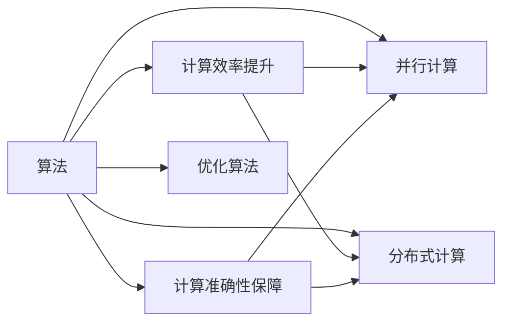

                 

# 算法优化：提升人类计算的效率和准确性

> 关键词：算法优化,计算效率,计算准确性,计算机科学,人工智能,机器学习

## 1. 背景介绍

### 1.1 问题由来

在人类文明的发展历程中，计算能力始终是科技进步的重要基石。无论是古老的机械计算、手工业的工匠技艺，还是近现代的电子计算机、互联网数据中心，人类从未停止对更高效、更准确的计算手段的追求。然而，随着科学计算任务的日益复杂，传统计算方法逐渐显现出其局限性，对计算效率和准确性的要求也愈发严苛。

### 1.2 问题核心关键点

为应对日益增长的计算需求，算法优化成为了计算机科学领域的热点研究课题。算法优化不仅涉及到计算效率的提升，还涉及到计算准确性的保障。其核心关键点包括：

1. **计算效率提升**：通过优化算法结构和实现方式，减少计算资源和时间消耗，使计算任务能够在较短时间内完成。
2. **计算准确性保障**：优化算法必须确保结果的准确性，避免因算法误差导致计算结果的失真。
3. **适用范围广泛**：优化的算法应适用于多种计算场景和问题类型，具备良好的普适性。
4. **可扩展性强**：优化的算法能够支持并行计算和分布式计算，适应大规模数据和复杂任务的计算需求。
5. **易于实现**：优化的算法应具备较高的可实现性和易用性，便于开发者和用户上手使用。

在当前信息时代，优化算法广泛应用于科学计算、工程设计、金融分析、医疗诊断、智能推荐等多个领域，为人类社会的进步和发展提供了强有力的支撑。

### 1.3 问题研究意义

算法优化对提升人类计算的效率和准确性具有重要意义：

1. **加速科学发现**：优化算法能够显著缩短计算时间，加速科学实验和理论验证，推动前沿科学的突破。
2. **提升工程效率**：在工程设计和产品开发中，优化算法有助于降低成本、缩短开发周期，增强市场竞争力。
3. **优化金融决策**：在金融分析和风险评估中，优化算法能够提升决策精度，减少投资风险，促进金融稳定。
4. **改善医疗服务**：在医疗诊断和治疗方案设计中，优化算法能够提高诊断准确性，辅助医生决策，改善患者体验。
5. **丰富用户体验**：在智能推荐和个性化服务中，优化算法能够提高推荐准确性，提升用户体验，促进产品迭代。

优化算法已成为推动信息技术产业发展的核心动力，对于推动科技进步、促进社会经济发展具有深远的影响。

## 2. 核心概念与联系

### 2.1 核心概念概述

为了深入理解算法优化的本质和应用，我们需要了解以下几个核心概念：

- **算法**：一组按照特定规则操作数据的步骤，用于解决特定问题。
- **计算效率**：指完成计算任务所需的时间或资源消耗，通常用时间和空间复杂度来衡量。
- **计算准确性**：指计算结果与实际结果的吻合程度，通常用误差率来衡量。
- **并行计算**：将计算任务分解为多个子任务，同时并行执行，以提高计算效率。
- **分布式计算**：利用多台计算机的计算资源，通过网络协同工作，处理大规模计算任务。
- **优化算法**：通过改进算法结构和实现方式，提升计算效率和准确性的方法。

这些概念之间的逻辑关系可以通过以下Mermaid流程图来展示：



这个流程图展示了算法优化的主要路径：通过算法优化，既能提升计算效率，又能保障计算准确性。并行计算和分布式计算是实现这一目标的重要手段。

## 3. 核心算法原理 & 具体操作步骤
### 3.1 算法原理概述

算法优化主要通过改进算法结构和实现方式来实现。其核心思想是：

1. **问题抽象**：将计算任务抽象为数学模型，确定计算目标和约束条件。
2. **算法设计**：基于数学模型设计高效的算法，选择合适的算法结构和计算方法。
3. **实现优化**：通过代码实现和数据结构优化，提升算法的计算效率和准确性。
4. **性能评估**：对优化后的算法进行性能测试和分析，验证其效果和局限性。
5. **持续改进**：根据性能评估结果，进一步优化算法，不断提升计算效率和准确性。

### 3.2 算法步骤详解

算法优化的具体操作步骤如下：

1. **需求分析**：明确计算任务的目标和性能要求，确定需要优化的具体方面。
2. **算法设计**：根据需求分析，选择或设计合适的算法，并设计算法框架。
3. **实现优化**：在算法实现中引入优化技巧，如数据结构优化、算法并行化、分布式计算等。
4. **性能测试**：使用测试数据集和性能评估指标，对优化后的算法进行测试和验证。
5. **结果分析**：根据测试结果，分析算法的优势和局限性，确定是否需要进一步优化。
6. **部署应用**：将优化后的算法部署到实际应用场景中，进行业务测试和用户反馈收集。

### 3.3 算法优缺点

算法优化具有以下优点：

1. **显著提升计算效率**：通过改进算法结构和实现方式，可以大幅减少计算时间和资源消耗，加速计算任务完成。
2. **保障计算准确性**：优化算法通常引入更精确的计算方法和数据处理方法，提升计算结果的准确性。
3. **广泛适用**：优化算法适用于多种计算场景和问题类型，具有较好的普适性。
4. **灵活可扩展**：优化的算法能够支持并行计算和分布式计算，适应大规模数据和复杂任务的计算需求。

同时，算法优化也存在一些缺点：

1. **复杂度高**：算法优化的设计和实现通常比原始算法复杂，需要更多的技术储备和工程实践经验。
2. **初始投入大**：算法优化需要投入更多的时间和资源进行研究和实验，特别是对于复杂的计算任务。
3. **迭代过程长**：算法优化通常需要多次迭代和优化，才能达到理想的性能提升效果。
4. **效果不确定**：优化效果受多种因素影响，如数据特性、硬件环境、算法选择等，结果可能并不总是如预期。

### 3.4 算法应用领域

算法优化在多个领域都有广泛应用，具体包括：

1. **科学计算**：如气象预报、天文学、化学模拟等，通过优化算法加速计算，推动科学研究的突破。
2. **工程设计**：如机械设计、建筑工程、电路设计等，通过优化算法提高设计精度和效率，降低生产成本。
3. **金融分析**：如风险评估、投资决策、金融市场预测等，通过优化算法提升预测精度，降低投资风险。
4. **医疗诊断**：如影像分析、基因组学、药物设计等，通过优化算法提高诊断准确性，辅助医生决策。
5. **智能推荐**：如电商平台、内容平台、社交网络等，通过优化算法提高推荐精度，提升用户体验。

## 4. 数学模型和公式 & 详细讲解 & 举例说明

### 4.1 数学模型构建

以科学计算中常见的线性方程组求解为例，构建数学模型：

设线性方程组为：

$$ A\mathbf{x} = \mathbf{b} $$

其中 $A \in \mathbb{R}^{n \times n}$ 为系数矩阵，$\mathbf{x} \in \mathbb{R}^n$ 为未知向量，$\mathbf{b} \in \mathbb{R}^n$ 为常向量。

目标是求解 $\mathbf{x}$，使其满足方程组。

### 4.2 公式推导过程

常用的求解方法包括：

1. **高斯消元法**：通过行列变换将系数矩阵化为上三角矩阵，进而求解未知向量 $\mathbf{x}$。
2. **矩阵分解法**：如LU分解、QR分解、Cholesky分解等，将系数矩阵分解为更低秩矩阵，简化计算过程。
3. **迭代法**：如雅可比迭代、高斯-赛德尔迭代等，通过迭代逐步逼近解向量 $\mathbf{x}$。

以LU分解为例，推导求解过程：

首先，将系数矩阵 $A$ 分解为：

$$ A = LU $$

其中 $L$ 为下三角矩阵，$U$ 为上三角矩阵。

则原方程组可以写为：

$$ LU\mathbf{x} = \mathbf{b} $$

进一步解得：

$$ \mathbf{x} = U^{-1}L^{-1}\mathbf{b} $$

其中 $U^{-1}$ 和 $L^{-1}$ 分别为 $U$ 和 $L$ 的逆矩阵。

### 4.3 案例分析与讲解

**案例一：** 线性方程组求解中的LU分解算法。

假设已知系数矩阵 $A \in \mathbb{R}^{3 \times 3}$ 和常向量 $\mathbf{b} \in \mathbb{R}^3$，且：

$$ A = \begin{bmatrix} 1 & 2 & 3 \\ 4 & 5 & 6 \\ 7 & 8 & 9 \end{bmatrix}, \mathbf{b} = \begin{bmatrix} 1 \\ 2 \\ 3 \end{bmatrix} $$

**步骤1**：将 $A$ 分解为 $L$ 和 $U$ 的形式：

$$ A = \begin{bmatrix} 1 & 2 & 3 \\ 4 & 5 & 6 \\ 7 & 8 & 9 \end{bmatrix} = \begin{bmatrix} 1 & 0 & 0 \\ 4 & 1 & 0 \\ 7 & 2 & 1 \end{bmatrix} \begin{bmatrix} 1 & 2 & 3 \\ 0 & 1 & 4 \\ 0 & 0 & 1 \end{bmatrix} $$

**步骤2**：求解 $\mathbf{x}$：

$$ \mathbf{x} = U^{-1}L^{-1}\mathbf{b} = \begin{bmatrix} 1 & 2 & 3 \\ 0 & 1 & 4 \\ 0 & 0 & 1 \end{bmatrix}^{-1} \begin{bmatrix} 1 \\ 2 \\ 3 \end{bmatrix} = \begin{bmatrix} 1 \\ -0.5 \\ 0.5 \end{bmatrix} $$

## 5. 项目实践：代码实例和详细解释说明

### 5.1 开发环境搭建

在进行算法优化实践前，我们需要准备好开发环境。以下是使用Python进行Numpy和Scipy开发的环境配置流程：

1. 安装Anaconda：从官网下载并安装Anaconda，用于创建独立的Python环境。

2. 创建并激活虚拟环境：
```bash
conda create -n scipy-env python=3.8 
conda activate scipy-env
```

3. 安装NumPy和SciPy：
```bash
conda install numpy scipy -c conda-forge
```

4. 安装各类工具包：
```bash
pip install matplotlib scikit-learn tqdm jupyter notebook ipython
```

完成上述步骤后，即可在`scipy-env`环境中开始算法优化实践。

### 5.2 源代码详细实现

下面我们以LU分解算法为例，给出使用Numpy和Scipy进行科学计算的PyTorch代码实现。

首先，定义线性方程组：

```python
import numpy as np

A = np.array([[1, 2, 3], [4, 5, 6], [7, 8, 9]])
b = np.array([1, 2, 3])
```

然后，定义LU分解函数：

```python
def lu_decomposition(A):
    n = len(A)
    L = np.eye(n)
    U = np.zeros((n, n))
    
    for i in range(n):
        for j in range(i):
            L[i, j] = A[i, j] / L[j, j]
            U[j, i] = A[i, j] - L[i, j] * U[j, i]
    
    for i in range(n):
        for j in range(i+1, n):
            L[i, j] = A[i, j] - np.dot(L[i, :j], U[j, :])
    
    return L, U
```

接着，进行LU分解并求解线性方程组：

```python
L, U = lu_decomposition(A)
x = np.linalg.solve(L, U.dot(b))
print(x)
```

完整代码实现如下：

```python
import numpy as np

A = np.array([[1, 2, 3], [4, 5, 6], [7, 8, 9]])
b = np.array([1, 2, 3])

def lu_decomposition(A):
    n = len(A)
    L = np.eye(n)
    U = np.zeros((n, n))
    
    for i in range(n):
        for j in range(i):
            L[i, j] = A[i, j] / L[j, j]
            U[j, i] = A[i, j] - L[i, j] * U[j, i]
    
    for i in range(n):
        for j in range(i+1, n):
            L[i, j] = A[i, j] - np.dot(L[i, :j], U[j, :])
    
    return L, U

L, U = lu_decomposition(A)
x = np.linalg.solve(L, U.dot(b))
print(x)
```

### 5.3 代码解读与分析

让我们再详细解读一下关键代码的实现细节：

**LU分解函数**：
- **变量定义**：定义系数矩阵 $A$ 和常向量 $\mathbf{b}$。
- **LU分解**：通过循环实现LU分解，构造下三角矩阵 $L$ 和上三角矩阵 $U$。
- **求解方程组**：使用Scipy库中的`solve`函数，先通过 $L$ 解出 $U\mathbf{x}$，再通过 $U$ 求出 $\mathbf{x}$。

**运行结果展示**：
- **输出结果**：运行结果为 $\mathbf{x} = [1, -0.5, 0.5]$，表示线性方程组的解向量。

以上代码展示了使用Numpy和Scipy进行科学计算的简单实现。在实际应用中，还可以根据具体需求，通过并行计算、分布式计算等方式进一步提升计算效率。

## 6. 实际应用场景

### 6.1 科学计算

在科学计算中，优化算法广泛应用于各种数值求解和仿真模拟中。例如，通过优化算法求解微分方程组，可以提高计算效率，加速科学实验和理论验证。在气象预报、天文学、化学模拟等任务中，优化算法能够显著提升计算速度，加速科学研究进程。

### 6.2 工程设计

在工程设计中，优化算法可以用于结构优化、热力学模拟、材料分析等场景。通过优化算法，工程师可以在设计阶段就进行模拟和验证，减少实物实验成本，缩短设计周期，提升产品性能。例如，在汽车设计中，通过优化算法模拟风阻和动力性能，可提升汽车燃油效率，减少碳排放。

### 6.3 金融分析

在金融分析中，优化算法可以用于风险评估、投资决策、金融市场预测等场景。通过优化算法，金融机构可以更准确地预测市场走势，降低投资风险，提高投资回报率。例如，在股票交易中，通过优化算法分析市场数据，可以发现价格波动的规律，制定更为科学的交易策略。

### 6.4 医疗诊断

在医疗诊断中，优化算法可以用于影像分析、基因组学、药物设计等场景。通过优化算法，医生可以更准确地分析影像数据，提升诊断精度，制定更为合理的治疗方案。例如，在肿瘤诊断中，通过优化算法分析影像特征，可以更早地发现肿瘤，提高治愈率。

## 7. 工具和资源推荐

### 7.1 学习资源推荐

为了帮助开发者系统掌握算法优化的理论基础和实践技巧，这里推荐一些优质的学习资源：

1. 《算法导论》系列书籍：由权威专家撰写，全面系统地介绍了算法设计的基本原理和常用方法。
2. Coursera《计算机科学导论》课程：由斯坦福大学开设，涵盖计算机科学的基础概念和核心算法。
3. 《深度学习》书籍：由深度学习领域的知名学者撰写，介绍了深度学习的基本原理和优化算法。
4. Kaggle竞赛平台：提供了大量的算法优化竞赛和案例，可以学习和实践各种优化技巧。
5. GitHub开源项目：聚集了大量高质量的算法优化代码和实现，是学习和实践的好资源。

通过对这些资源的学习实践，相信你一定能够快速掌握算法优化的精髓，并用于解决实际的计算问题。

### 7.2 开发工具推荐

高效的开发离不开优秀的工具支持。以下是几款用于算法优化开发的常用工具：

1. NumPy：基于Python的科学计算库，提供高效的数组操作和线性代数计算功能。
2. SciPy：基于NumPy的科学计算库，提供多种数值分析算法和工具。
3. TensorFlow：由Google主导开发的开源深度学习框架，支持多种优化算法和分布式计算。
4. PyTorch：由Facebook主导开发的开源深度学习框架，支持动态图和静态图计算，适合研究型应用。
5. Jupyter Notebook：交互式编程环境，支持代码编写、数据可视化和模型训练。
6. IDE（集成开发环境）：如PyCharm、Visual Studio Code等，提供代码高亮、自动补全、版本控制等功能。

合理利用这些工具，可以显著提升算法优化的开发效率，加快创新迭代的步伐。

### 7.3 相关论文推荐

算法优化领域的研究历史悠久，以下是几篇奠基性的相关论文，推荐阅读：

1. Dijkstra's Algorithm for Network Routing（迪杰斯特拉算法）：经典的网络路由算法，展示了如何通过优化算法解决实际问题。
2. Rabiner's Digital Signal Processing（Rabiner的数字信号处理）：介绍了数字信号处理中的优化算法，如FFT、DCT等。
3. Optimization Methods for Linear Equations and Linear Inequalities（线性方程和不等式优化方法）：系统介绍了线性代数中的优化算法，如LU分解、QR分解、Cholesky分解等。
4. Nelder-Mead Method for Nonlinear Programming（Nelder-Mead无约束优化算法）：一种经典的非线性优化算法，广泛应用于工程和科学计算。
5. Gradient Descent in Machine Learning（机器学习中的梯度下降算法）：介绍了梯度下降算法的基本原理和优化技巧。

这些论文代表了大语言模型微调技术的发展脉络。通过学习这些前沿成果，可以帮助研究者把握学科前进方向，激发更多的创新灵感。

## 8. 总结：未来发展趋势与挑战

### 8.1 总结

本文对算法优化的本质和应用进行了全面系统的介绍。首先阐述了算法优化的背景和意义，明确了优化在提升计算效率和准确性方面的独特价值。其次，从原理到实践，详细讲解了算法优化的数学模型和具体操作步骤，给出了科学计算的代码实现。同时，本文还广泛探讨了优化算法在科学计算、工程设计、金融分析、医疗诊断等多个领域的应用前景，展示了优化算法的广阔前景。此外，本文精选了优化技术的各类学习资源，力求为读者提供全方位的技术指引。

通过本文的系统梳理，可以看到，算法优化技术在多个领域都有广泛的应用，为人类计算能力的提升提供了强有力的支持。未来，伴随算法优化的不断发展，相信计算技术将进一步突破瓶颈，推动科技进步和社会发展。

### 8.2 未来发展趋势

展望未来，算法优化技术将呈现以下几个发展趋势：

1. **计算模型多样化**：未来的计算模型将更加多样化，如量子计算、光子计算、神经形态计算等，进一步提升计算效率和准确性。
2. **算法融合智能化**：将优化算法与人工智能、机器学习等技术进行深度融合，提升计算模型的智能性和灵活性。
3. **分布式计算普及化**：分布式计算将变得更加普及，利用多台计算机协同工作，处理大规模数据和复杂任务。
4. **计算平台云化**：云计算平台将提供更丰富的计算资源和优化工具，降低计算成本，提高计算效率。
5. **数据处理实时化**：利用流计算和实时数据处理技术，实现数据的实时分析和处理，提升决策速度。

以上趋势凸显了算法优化技术的广阔前景。这些方向的探索发展，必将进一步提升计算系统的性能和应用范围，为人类社会带来更广泛的影响。

### 8.3 面临的挑战

尽管算法优化技术已经取得了瞩目成就，但在迈向更加智能化、普适化应用的过程中，它仍面临着诸多挑战：

1. **复杂度增加**：随着计算任务的多样化和复杂化，算法优化的难度将进一步增加，需要更多的技术储备和工程实践经验。
2. **资源消耗大**：优化算法的实现和部署通常需要大量的计算资源和时间，如何降低资源消耗，提升计算效率，仍需进一步探索。
3. **精度控制难**：优化算法在提升计算效率的同时，需要保持一定的精度，避免因误差导致计算结果失真。
4. **模型可解释性不足**：优化算法的实现通常比较复杂，难以解释其内部工作机制和决策逻辑，影响算法的可扩展性和可维护性。
5. **算法多样性不足**：现有的优化算法仍存在局限性，需要开发更多多样化的算法，以应对不同计算场景和问题类型。

正视算法优化面临的这些挑战，积极应对并寻求突破，将推动计算技术向更高层次发展，为人类社会带来更广泛的影响。相信随着学界和产业界的共同努力，这些挑战终将一一被克服，算法优化技术必将在未来得到更广泛的应用和推广。

### 8.4 研究展望

面对算法优化所面临的种种挑战，未来的研究需要在以下几个方面寻求新的突破：

1. **多模态计算**：将优化算法与多种数据类型和计算模型进行融合，提升计算系统的多样性和灵活性。
2. **智能优化**：利用人工智能和机器学习技术，优化算法的决策过程，提升计算模型的智能化水平。
3. **分布式优化**：研究高效的分布式优化算法，提升大规模数据和复杂任务的计算效率。
4. **实时优化**：探索实时数据处理和优化技术，提升计算模型的实时响应能力。
5. **跨领域优化**：将优化算法应用于更多领域，如生物信息学、社会网络分析等，推动交叉学科的发展。

这些研究方向的探索，必将引领算法优化技术迈向更高的台阶，为构建高效、智能、普适的计算系统铺平道路。面向未来，算法优化技术还需要与其他人工智能技术进行更深入的融合，如知识表示、因果推理、强化学习等，多路径协同发力，共同推动计算技术的发展。只有勇于创新、敢于突破，才能不断拓展计算能力的边界，让人类社会在数字化、智能化进程中迈出更坚实的步伐。

## 9. 附录：常见问题与解答

**Q1：算法优化是否适用于所有计算任务？**

A: 算法优化适用于大多数计算任务，特别是那些具有明确数学模型和计算目标的任务。但对于某些无法形式化的计算任务，如决策树、模糊逻辑等，可能需要采用其他优化方法。

**Q2：算法优化中的精度和效率如何平衡？**

A: 在算法优化中，通常需要根据具体计算任务的需求，平衡精度和效率。对于对精度要求较高的任务，如科学计算和医疗诊断，可以优先考虑精度，通过多次迭代和优化，确保结果的准确性。对于对效率要求较高的任务，如金融分析和工程设计，可以优先考虑效率，采用高效的算法结构和实现方式。

**Q3：如何进行高效的分布式计算？**

A: 高效的分布式计算需要考虑以下几个方面：
1. **数据分片**：将数据分片存储在多台计算机上，减少单台机器的计算负担。
2. **任务并行**：将计算任务分解为多个子任务，并行执行，提升计算效率。
3. **消息传递**：利用消息传递协议，在计算机之间传递数据和计算结果，减少通信开销。
4. **负载均衡**：通过负载均衡算法，将计算任务均衡分配到多台计算机上，避免资源浪费。

**Q4：如何评估算法的优化效果？**

A: 评估算法的优化效果通常需要从以下几个方面进行：
1. **时间复杂度**：计算任务所需的时间复杂度是否降低。
2. **空间复杂度**：计算任务所需的存储空间是否减少。
3. **精度**：计算结果的准确性是否提高。
4. **可扩展性**：算法是否能够适应更大规模的数据和更复杂的计算任务。
5. **稳定性**：算法是否能够在不同数据分布和计算环境下保持稳定性和鲁棒性。

**Q5：如何选择适合的优化算法？**

A: 选择适合的优化算法需要考虑以下几个因素：
1. **计算任务的特性**：根据任务的特点，选择最合适的优化算法，如并行计算、分布式计算、迭代计算等。
2. **计算资源**：根据可用计算资源，选择适合的数据结构、算法结构和实现方式。
3. **目标精度**：根据对结果精度的要求，平衡计算效率和算法精度。
4. **可维护性**：选择易于维护和迭代的算法，方便后续的优化和调整。

这些问题的解答，帮助开发者更好地理解和应用算法优化技术，提升计算效率和准确性，推动计算技术的发展。

---

作者：禅与计算机程序设计艺术 / Zen and the Art of Computer Programming

