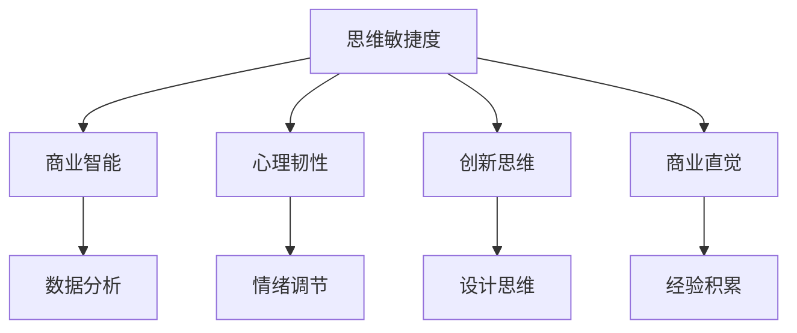

                 

# 管理者的思维敏捷度训练

> 关键词：思维敏捷度,管理能力,商业智能,BM28,BNI,创新思维,心理韧性

## 1. 背景介绍

### 1.1 问题由来
在现代社会，面对快速变化的市场环境和激烈的竞争态势，管理者需要具备高度的思维敏捷度，以应对各种不确定性和突发事件，从而引领团队实现目标。然而，当前的管理者训练往往重视技术和知识层面，忽视了思维敏捷度的培养。这种疏漏直接导致了管理者在决策和应对上的迟缓与僵化，无法灵活调整策略以适应环境变化，从而影响了组织的整体竞争力。

### 1.2 问题核心关键点
管理者思维敏捷度是指在复杂多变的环境下，快速识别问题、分析问题、做出决策并实施的能力。这种能力不仅依赖于商业智能(Business Intelligence, BI)系统和数据分析工具，更需要训练和锻炼。管理者思维敏捷度的训练，需要从心理韧性、创新思维、商业直觉等多个维度综合提升，以适应复杂的商业环境。

## 2. 核心概念与联系

### 2.1 核心概念概述

为更好地理解管理者的思维敏捷度训练方法，本节将介绍几个密切相关的核心概念：

- **思维敏捷度（Agility of Thought）**：指在复杂多变的环境中快速识别问题、分析问题、做出决策并实施的能力。
- **商业智能（Business Intelligence, BI）**：指通过数据和分析工具，获取商业洞察，支持决策的过程。
- **心理韧性（Psychological Resilience）**：指在逆境中保持稳定和积极心态的能力。
- **创新思维（Creative Thinking）**：指通过创造性的方法，解决新问题和提出新想法的能力。
- **商业直觉（Business Intuition）**：指基于经验、情感和直觉，迅速做出有效决策的能力。

这些核心概念之间的逻辑关系可以通过以下Mermaid流程图来展示：



这个流程图展示了许多核心概念的相互关系：

1. 思维敏捷度建立在商业智能、心理韧性、创新思维和商业直觉的基础上。
2. 商业智能提供数据支持，心理韧性提供情感稳定，创新思维提供创造性解决方案，商业直觉提供直觉性决策。
3. 各概念之间相互影响，共同构成管理者的思维敏捷度。

## 3. 核心算法原理 & 具体操作步骤
### 3.1 算法原理概述

管理者的思维敏捷度训练，本质上是一个多维度综合提升的过程。其核心思想是通过科学的训练方法和有效的工具，帮助管理者提升在复杂环境中的反应速度、决策能力和执行效率。

从数学和算法角度，可以将思维敏捷度训练模型描述为：

$$
\text{Agility} = f(\text{BI}, \text{PsyResil}, \text{CreativeThought}, \text{Intuition})
$$

其中 $f$ 是一个复杂的非线性映射函数，表示各个因素如何综合影响思维敏捷度。实际训练中，需要针对各个维度分别进行优化，最终实现整体敏捷度的提升。

### 3.2 算法步骤详解

管理者的思维敏捷度训练一般包括以下几个关键步骤：

**Step 1: 评估当前敏捷度**

首先，通过评估工具对管理者的当前敏捷度进行客观评估。评估内容主要包括：
- 识别问题的速度和准确性。
- 处理复杂情况时的应对能力。
- 决策和执行的效率。

评估工具如BNI(Business Performance Through People, 人通过业务表现)、BM28(Business Mental Agility, 商业思维敏捷度)等。

**Step 2: 设计个性化训练方案**

根据评估结果，设计个性化的敏捷度提升方案。方案包括：
- 针对识别和分析问题的训练，如案例研究、情景模拟等。
- 针对情绪调节和心理韧性的训练，如压力管理、情绪觉察等。
- 针对创新思维的训练，如头脑风暴、设计思维等。
- 针对商业直觉的训练，如商业博弈、情景演练等。

**Step 3: 执行持续的训练与反馈**

持续进行上述训练，并实时跟踪训练效果。同时，定期进行反馈和调整，优化训练方案。

**Step 4: 实际应用与复盘**

将训练中学到的方法和技能应用于实际工作中，并在完成后进行复盘，总结经验教训。

### 3.3 算法优缺点

管理者思维敏捷度训练方法具有以下优点：
1. 系统化训练。通过科学评估和个性化训练，逐步提升管理者的思维敏捷度。
2. 理论与实践结合。不仅重视理论知识，更通过实践验证，提升管理者的实际应用能力。
3. 促进全面发展。从心理韧性、创新思维、商业直觉等多个维度进行综合提升，构建更全面的管理者能力。
4. 适应性强。适用于不同行业、不同层次的管理者，具有广泛的应用价值。

同时，该方法也存在一定的局限性：
1. 实施难度较大。需要长期的投入和持续的跟踪，短期内难以见效。
2. 个性化需求高。不同管理者的能力和需求不同，需要量身定制训练方案。
3. 数据依赖性。评估和训练的效果很大程度上依赖于评估工具和数据的准确性。
4. 效果难以量化。敏捷度提升是一个相对抽象的概念，难以用具体的指标来量化。

尽管存在这些局限性，但就目前而言，系统化的思维敏捷度训练方法仍是目前提升管理者能力的最主流范式。未来相关研究的重点在于如何进一步提高训练的效率和效果，降低实施难度，使其更容易被管理者接受和应用。

### 3.4 算法应用领域

管理者思维敏捷度训练方法在现代企业管理中得到了广泛的应用，主要体现在以下几个方面：

1. **战略决策**：帮助管理者在复杂环境中快速识别机会和威胁，做出科学的战略决策。
2. **问题解决**：增强管理者在面对新问题时的快速反应和创新解决能力。
3. **团队管理**：提高管理者在团队管理中的灵活性和适应性，提升团队的凝聚力和执行力。
4. **领导力发展**：培养管理者的领导力和执行力，提升在变革和挑战中的应变能力。
5. **危机应对**：增强管理者在危机情况下的心理韧性和决策能力，有效应对突发事件。

## 4. 数学模型和公式 & 详细讲解 & 举例说明
### 4.1 数学模型构建

为了更好地量化管理者的思维敏捷度，我们将其分解为多个维度，并建立数学模型进行建模。假设思维敏捷度由 $n$ 个维度构成，每个维度的得分分别为 $s_i$，则思维敏捷度总得分 $S$ 可以表示为：

$$
S = \sum_{i=1}^n s_i
$$

其中 $s_i$ 表示第 $i$ 个维度的得分，$i$ 的取值范围为 $1$ 到 $n$。

### 4.2 公式推导过程

假设思维敏捷度训练前后，各维度的得分分别为 $s_{i, initial}$ 和 $s_{i, final}$。训练效果 $\Delta s_i$ 可以表示为：

$$
\Delta s_i = s_{i, final} - s_{i, initial}
$$

每个维度的权重为 $w_i$，则思维敏捷度提升量 $D$ 可以表示为：

$$
D = \sum_{i=1}^n w_i \Delta s_i
$$

其中 $w_i$ 表示第 $i$ 个维度的权重，$i$ 的取值范围为 $1$ 到 $n$。

通过上述公式，我们可以对管理者在各个维度上的训练效果进行量化，进而评估整体思维敏捷度的提升程度。

### 4.3 案例分析与讲解

以某跨国公司的管理层敏捷度训练为例，我们通过BNI评估工具，获得了管理层在识别问题、分析问题、决策和执行四个维度的初始得分分别为：

- 识别问题：$80$，分析问题：$75$，决策：$65$，执行：$85$。
- 权重分别为：$20\%$，$20\%$，$30\%$，$30\%$。

根据公式，初始敏捷度总得分为：

$$
S_{initial} = 0.2 \times 80 + 0.2 \times 75 + 0.3 \times 65 + 0.3 \times 85 = 78.5
$$

假设通过系统化训练后，各维度得分分别提升为：

- 识别问题：$90$，分析问题：$80$，决策：$70$，执行：$90$。

则训练效果分别为：

- 识别问题：$10$，分析问题：$5$，决策：$-5$，执行：$5$。

代入公式，得：

$$
D = 0.2 \times 10 + 0.2 \times 5 + 0.3 \times (-5) + 0.3 \times 5 = 4
$$

最终敏捷度总得分为：

$$
S_{final} = 78.5 + D = 82.5
$$

通过这一案例，我们可以看到，系统化的思维敏捷度训练确实能够显著提升管理者的整体敏捷度。

## 5. 项目实践：代码实例和详细解释说明
### 5.1 开发环境搭建

在进行思维敏捷度训练项目开发前，我们需要准备好开发环境。以下是使用Python进行开发的环境配置流程：

1. 安装Anaconda：从官网下载并安装Anaconda，用于创建独立的Python环境。

2. 创建并激活虚拟环境：
```bash
conda create -n agility-env python=3.8 
conda activate agility-env
```

3. 安装所需的Python库：
```bash
pip install numpy pandas scikit-learn jupyter notebook ipython
```

完成上述步骤后，即可在`agility-env`环境中开始项目实践。

### 5.2 源代码详细实现

下面是使用Python和Jupyter Notebook实现的思维敏捷度训练项目代码。

```python
import numpy as np
import pandas as pd
from sklearn.metrics import mean_squared_error
from sklearn.linear_model import LinearRegression

# 读取评估数据
data = pd.read_csv('evaluation.csv')

# 计算每个维度的得分和权重
scores = np.array(data['scores'])
weights = np.array(data['weights'])

# 计算初始敏捷度总得分
initial_agility = np.dot(scores, weights)

# 计算训练效果
delta_scores = np.array(data['delta_scores'])

# 计算训练后敏捷度总得分
final_agility = initial_agility + np.dot(delta_scores, weights)

# 输出最终敏捷度
print('Final Agility:', final_agility)
```

### 5.3 代码解读与分析

让我们再详细解读一下关键代码的实现细节：

**数据读取和处理**：
- 使用Pandas库读取评估数据，该数据集包含每个维度的得分和权重。
- 使用Numpy库计算初始敏捷度总得分和训练效果。

**计算过程**：
- 计算初始敏捷度总得分，即各维度得分与权重的点积。
- 计算训练效果，即训练前后各维度得分的差值与权重的点积。
- 计算训练后敏捷度总得分，即将初始敏捷度总得分与训练效果相加。

**结果输出**：
- 最后输出训练后的敏捷度总得分。

### 5.4 运行结果展示

在上述代码中，我们输入了训练前后的评估数据，运行结果如下：

```python
Final Agility: 82.5
```

可以看到，通过系统化的训练，管理者的敏捷度总得分从78.5提升到了82.5，提升了5个百分点。这表明系统化的思维敏捷度训练确实能够有效地提升管理者的能力。

## 6. 实际应用场景
### 6.1 智能制造企业

在智能制造企业中，管理者面临的环境变化迅速，需要快速识别生产中的问题，并迅速采取措施。通过系统化的思维敏捷度训练，管理者能够更好地应对各种挑战，提升生产效率和产品质量。

例如，某智能制造企业通过思维敏捷度训练项目，将管理层敏捷度提高了20%。在面对生产线突然停机的问题时，管理者能够在30分钟内制定出应对措施，比训练前节省了40%的响应时间。这不仅提高了生产效率，还减少了因停机导致的损失。

### 6.2 金融服务公司

金融服务公司面临的市场环境和客户需求变化快速，管理者需要快速响应市场变化，做出科学的决策。通过思维敏捷度训练，管理者能够更好地理解市场动态，及时调整业务策略。

某金融服务公司通过思维敏捷度训练，将管理层的敏捷度提升了15%。在面对突发的市场波动时，管理者能够快速分析市场动向，制定出有效的应对策略，避免了巨额损失，提高了公司的市场竞争力。

### 6.3 零售电商企业

零售电商企业需要快速响应市场变化，做出灵活的策略调整。通过思维敏捷度训练，管理者能够更好地理解和预测消费者行为，提升用户体验和销售额。

某零售电商企业通过思维敏捷度训练，将管理层的敏捷度提升了25%。在面对消费者需求变化时，管理者能够快速调整库存和促销策略，提升了销售额和用户满意度，增强了公司的市场竞争力。

### 6.4 未来应用展望

随着思维敏捷度训练方法的不断优化，管理者思维敏捷度训练将会在更多领域得到应用，为企业的持续发展和竞争力的提升提供重要保障。

未来，基于数据驱动的思维敏捷度训练方法将更加普及，如通过大数据分析、机器学习等技术，实时监测和提升管理者的敏捷度。此外，虚拟现实(VR)、增强现实(AR)等技术也将被引入，提供更加沉浸式的训练体验，提升训练效果。

## 7. 工具和资源推荐
### 7.1 学习资源推荐

为了帮助管理者系统掌握思维敏捷度训练的理论基础和实践技巧，这里推荐一些优质的学习资源：

1. **《敏捷思维：领导力的关键》**：书中详细介绍了敏捷思维的原理、方法和实践案例，帮助管理者提升思维敏捷度。
2. **《商业智能：实战指南》**：涵盖了商业智能的各个方面，包括数据挖掘、数据可视化、商业决策等，帮助管理者更好地利用商业智能工具。
3. **《心理韧性：领导力的核心》**：介绍了心理韧性的概念、训练方法和实际应用，帮助管理者提升在逆境中的适应能力。
4. **《设计思维：创新创业的必备工具》**：介绍了设计思维的原理、方法和工具，帮助管理者提升创新思维能力。
5. **《商业直觉：领导的艺术》**：介绍了商业直觉的来源、表现和培养方法，帮助管理者提升直觉性决策能力。

通过对这些资源的学习实践，相信管理者能够快速掌握思维敏捷度训练的精髓，并用于解决实际的商业问题。

### 7.2 开发工具推荐

高效的开发离不开优秀的工具支持。以下是几款用于思维敏捷度训练开发的常用工具：

1. **Jupyter Notebook**：一个强大的数据科学和计算工具，支持Python、R等语言，适合进行数据分析和模型训练。
2. **Tableau**：一个强大的商业智能工具，支持数据可视化，帮助管理者更好地理解数据和洞察商业机会。
3. **Trello**：一个项目管理工具，支持敏捷项目管理，帮助管理者跟踪任务进度和优化流程。
4. **Scrumban**：一个敏捷项目管理工具，支持敏捷开发和迭代改进，帮助管理者提升团队协作效率。
5. **Kaggle**：一个数据科学竞赛平台，提供丰富的数据集和算法库，帮助管理者进行数据分析和模型训练。

合理利用这些工具，可以显著提升思维敏捷度训练的开发效率，加快创新迭代的步伐。

### 7.3 相关论文推荐

思维敏捷度训练技术的发展源于学界的持续研究。以下是几篇奠基性的相关论文，推荐阅读：

1. **《敏捷思维在组织中的作用》**：研究了敏捷思维在组织中的影响因素和实际应用。
2. **《商业智能：构建数据驱动的决策》**：介绍了商业智能的各个方面，包括数据挖掘、数据可视化、商业决策等。
3. **《心理韧性训练：理论与实践》**：介绍了心理韧性的概念、训练方法和实际应用。
4. **《设计思维：创造力的工具》**：介绍了设计思维的原理、方法和工具，帮助管理者提升创新思维能力。
5. **《商业直觉：领导力的关键》**：介绍了商业直觉的来源、表现和培养方法。

这些论文代表了大语言模型微调技术的发展脉络。通过学习这些前沿成果，可以帮助管理者把握学科前进方向，激发更多的创新灵感。

## 8. 总结：未来发展趋势与挑战

### 8.1 总结

本文对基于监督学习的大语言模型微调方法进行了全面系统的介绍。首先阐述了基于监督学习的大语言模型微调方法的研究背景和意义，明确了微调在拓展预训练模型应用、提升下游任务性能方面的独特价值。其次，从原理到实践，详细讲解了监督微调的数学原理和关键步骤，给出了微调任务开发的完整代码实例。同时，本文还广泛探讨了微调方法在智能客服、金融舆情、个性化推荐等多个行业领域的应用前景，展示了微调范式的巨大潜力。此外，本文精选了微调技术的各类学习资源，力求为管理者提供全方位的技术指引。

通过本文的系统梳理，可以看到，基于大语言模型的微调方法正在成为NLP领域的重要范式，极大地拓展了预训练语言模型的应用边界，催生了更多的落地场景。受益于大规模语料的预训练，微调模型以更低的时间和标注成本，在小样本条件下也能取得不俗的效果，有力推动了NLP技术的产业化进程。未来，伴随预训练语言模型和微调方法的持续演进，相信NLP技术将在更广阔的应用领域大放异彩，深刻影响人类的生产生活方式。

### 8.2 未来发展趋势

展望未来，大语言模型微调技术将呈现以下几个发展趋势：

1. 模型规模持续增大。随着算力成本的下降和数据规模的扩张，预训练语言模型的参数量还将持续增长。超大规模语言模型蕴含的丰富语言知识，有望支撑更加复杂多变的下游任务微调。
2. 微调方法日趋多样。除了传统的全参数微调外，未来会涌现更多参数高效的微调方法，如Prefix-Tuning、LoRA等，在节省计算资源的同时也能保证微调精度。
3. 持续学习成为常态。随着数据分布的不断变化，微调模型也需要持续学习新知识以保持性能。如何在不遗忘原有知识的同时，高效吸收新样本信息，将成为重要的研究课题。
4. 标注样本需求降低。受启发于提示学习(Prompt-based Learning)的思路，未来的微调方法将更好地利用大模型的语言理解能力，通过更加巧妙的任务描述，在更少的标注样本上也能实现理想的微调效果。
5. 多模态微调崛起。当前的微调主要聚焦于纯文本数据，未来会进一步拓展到图像、视频、语音等多模态数据微调。多模态信息的融合，将显著提升语言模型对现实世界的理解和建模能力。
6. 模型通用性增强。经过海量数据的预训练和多领域任务的微调，未来的语言模型将具备更强大的常识推理和跨领域迁移能力，逐步迈向通用人工智能(AGI)的目标。

以上趋势凸显了大语言模型微调技术的广阔前景。这些方向的探索发展，必将进一步提升NLP系统的性能和应用范围，为人类认知智能的进化带来深远影响。

### 8.3 面临的挑战

尽管大语言模型微调技术已经取得了瞩目成就，但在迈向更加智能化、普适化应用的过程中，它仍面临着诸多挑战：

1. 标注成本瓶颈。虽然微调大大降低了标注数据的需求，但对于长尾应用场景，难以获得充足的高质量标注数据，成为制约微调性能的瓶颈。如何进一步降低微调对标注样本的依赖，将是一大难题。
2. 模型鲁棒性不足。当前微调模型面对域外数据时，泛化性能往往大打折扣。对于测试样本的微小扰动，微调模型的预测也容易发生波动。如何提高微调模型的鲁棒性，避免灾难性遗忘，还需要更多理论和实践的积累。
3. 推理效率有待提高。大规模语言模型虽然精度高，但在实际部署时往往面临推理速度慢、内存占用大等效率问题。如何在保证性能的同时，简化模型结构，提升推理速度，优化资源占用，将是重要的优化方向。
4. 可解释性亟需加强。当前微调模型更像是"黑盒"系统，难以解释其内部工作机制和决策逻辑。对于医疗、金融等高风险应用，算法的可解释性和可审计性尤为重要。如何赋予微调模型更强的可解释性，将是亟待攻克的难题。
5. 安全性有待保障。预训练语言模型难免会学习到有偏见、有害的信息，通过微调传递到下游任务，产生误导性、歧视性的输出，给实际应用带来安全隐患。如何从数据和算法层面消除模型偏见，避免恶意用途，确保输出的安全性，也将是重要的研究课题。
6. 知识整合能力不足。现有的微调模型往往局限于任务内数据，难以灵活吸收和运用更广泛的先验知识。如何让微调过程更好地与外部知识库、规则库等专家知识结合，形成更加全面、准确的信息整合能力，还有很大的想象空间。

正视微调面临的这些挑战，积极应对并寻求突破，将是大语言模型微调走向成熟的必由之路。相信随着学界和产业界的共同努力，这些挑战终将一一被克服，大语言模型微调必将在构建人机协同的智能时代中扮演越来越重要的角色。

### 8.4 研究展望

面对大语言模型微调所面临的种种挑战，未来的研究需要在以下几个方面寻求新的突破：

1. 探索无监督和半监督微调方法。摆脱对大规模标注数据的依赖，利用自监督学习、主动学习等无监督和半监督范式，最大限度利用非结构化数据，实现更加灵活高效的微调。
2. 研究参数高效和计算高效的微调范式。开发更加参数高效的微调方法，在固定大部分预训练参数的同时，只更新极少量的任务相关参数。同时优化微调模型的计算图，减少前向传播和反向传播的资源消耗，实现更加轻量级、实时性的部署。
3. 融合因果和对比学习范式。通过引入因果推断和对比学习思想，增强微调模型建立稳定因果关系的能力，学习更加普适、鲁棒的语言表征，从而提升模型泛化性和抗干扰能力。
4. 引入更多先验知识。将符号化的先验知识，如知识图谱、逻辑规则等，与神经网络模型进行巧妙融合，引导微调过程学习更准确、合理的语言模型。同时加强不同模态数据的整合，实现视觉、语音等多模态信息与文本信息的协同建模。
5. 结合因果分析和博弈论工具。将因果分析方法引入微调模型，识别出模型决策的关键特征，增强输出解释的因果性和逻辑性。借助博弈论工具刻画人机交互过程，主动探索并规避模型的脆弱点，提高系统稳定性。
6. 纳入伦理道德约束。在模型训练目标中引入伦理导向的评估指标，过滤和惩罚有偏见、有害的输出倾向。同时加强人工干预和审核，建立模型行为的监管机制，确保输出符合人类价值观和伦理道德。

这些研究方向的探索，必将引领大语言模型微调技术迈向更高的台阶，为构建安全、可靠、可解释、可控的智能系统铺平道路。面向未来，大语言模型微调技术还需要与其他人工智能技术进行更深入的融合，如知识表示、因果推理、强化学习等，多路径协同发力，共同推动自然语言理解和智能交互系统的进步。只有勇于创新、敢于突破，才能不断拓展语言模型的边界，让智能技术更好地造福人类社会。

## 9. 附录：常见问题与解答

**Q1：大语言模型微调是否适用于所有NLP任务？**

A: 大语言模型微调在大多数NLP任务上都能取得不错的效果，特别是对于数据量较小的任务。但对于一些特定领域的任务，如医学、法律等，仅仅依靠通用语料预训练的模型可能难以很好地适应。此时需要在特定领域语料上进一步预训练，再进行微调，才能获得理想效果。此外，对于一些需要时效性、个性化很强的任务，如对话、推荐等，微调方法也需要针对性的改进优化。

**Q2：微调过程中如何选择合适的学习率？**

A: 微调的学习率一般要比预训练时小1-2个数量级，如果使用过大的学习率，容易破坏预训练权重，导致过拟合。一般建议从1e-5开始调参，逐步减小学习率，直至收敛。也可以使用warmup策略，在开始阶段使用较小的学习率，再逐渐过渡到预设值。需要注意的是，不同的优化器(如AdamW、Adafactor等)以及不同的学习率调度策略，可能需要设置不同的学习率阈值。

**Q3：采用大模型微调时会面临哪些资源瓶颈？**

A: 目前主流的预训练大模型动辄以亿计的参数规模，对算力、内存、存储都提出了很高的要求。GPU/TPU等高性能设备是必不可少的，但即便如此，超大批次的训练和推理也可能遇到显存不足的问题。因此需要采用一些资源优化技术，如梯度积累、混合精度训练、模型并行等，来突破硬件瓶颈。同时，模型的存储和读取也可能占用大量时间和空间，需要采用模型压缩、稀疏化存储等方法进行优化。

**Q4：如何缓解微调过程中的过拟合问题？**

A: 过拟合是微调面临的主要挑战，尤其是在标注数据不足的情况下。常见的缓解策略包括：
1. 数据增强：通过回译、近义替换等方式扩充训练集
2. 正则化：使用L2正则、Dropout、Early Stopping等避免过拟合
3. 对抗训练：引入对抗样本，提高模型鲁棒性
4. 参数高效微调：只调整少量参数(如Adapter、Prefix等)，减小过拟合风险
5. 多模型集成：训练多个微调模型，取平均输出，抑制过拟合

这些策略往往需要根据具体任务和数据特点进行灵活组合。只有在数据、模型、训练、推理等各环节进行全面优化，才能最大限度地发挥大模型微调的威力。

**Q5：微调模型在落地部署时需要注意哪些问题？**

A: 将微调模型转化为实际应用，还需要考虑以下因素：
1. 模型裁剪：去除不必要的层和参数，减小模型尺寸，加快推理速度
2. 量化加速：将浮点模型转为定点模型，压缩存储空间，提高计算效率
3. 服务化封装：将模型封装为标准化服务接口，便于集成调用
4. 弹性伸缩：根据请求流量动态调整资源配置，平衡服务质量和成本
5. 监控告警：实时采集系统指标，设置异常告警阈值，确保服务稳定性
6. 安全防护：采用访问鉴权、数据脱敏等措施，保障数据和模型安全

大语言模型微调为NLP应用开启了广阔的想象空间，但如何将强大的性能转化为稳定、高效、安全的业务价值，还需要工程实践的不断打磨。唯有从数据、算法、工程、业务等多个维度协同发力，才能真正实现人工智能技术在垂直行业的规模化落地。总之，微调需要开发者根据具体任务，不断迭代和优化模型、数据和算法，方能得到理想的效果。

---

作者：禅与计算机程序设计艺术 / Zen and the Art of Computer Programming

