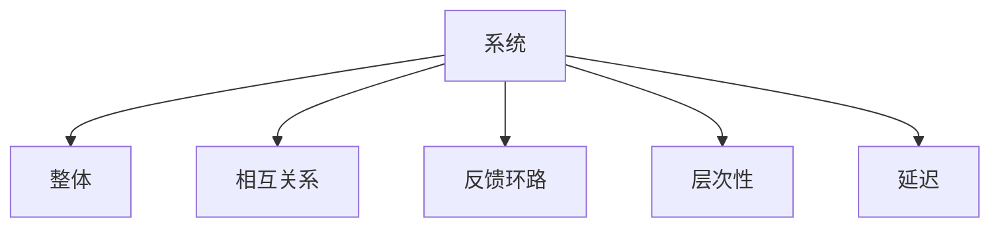
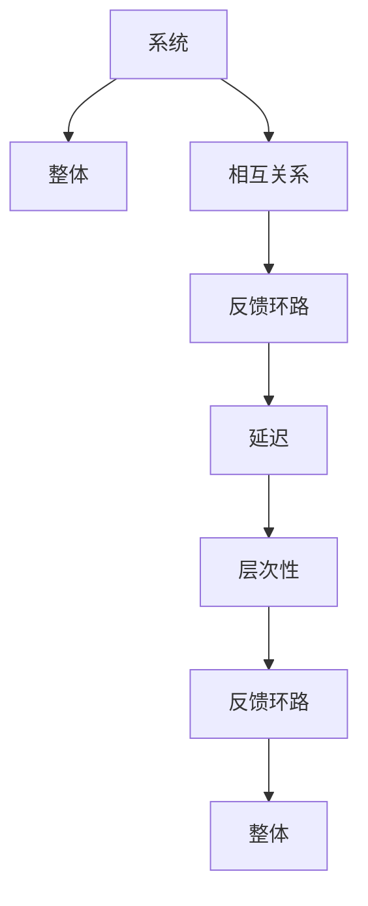

                 

## 1. 背景介绍

### 1.1 问题由来

在今天快速变化和复杂多变的商业环境中，管理者们面临诸多复杂问题，如市场变化、资源配置、员工管理、组织变革等。这些问题涉及多种因素的交织和冲突，传统线性思维难以找到有效的解决方案。系统思考作为一种深层次的思维方法，能够帮助管理者从整体和相互关联的角度分析问题，揭示问题的根源，并提出更为有效的解决方案。

### 1.2 问题核心关键点

系统思考的核心在于其“整体观”和“相互关系观”，即理解问题的整体结构和不同元素之间的相互关系。这需要管理者从以下几个方面进行思考：

- **整体观**：从系统的角度看待问题，不仅关注问题的局部，还要看到系统的整体。
- **相互关系观**：理解系统内部不同元素之间的相互作用，以及外部环境对系统的影响。
- **反馈环路**：理解系统内部的反馈机制，即系统元素之间的相互作用如何影响系统行为。
- **延迟**：认识系统行为变化的滞后性，即系统对外部刺激的响应需要时间。
- **层次性**：理解系统的不同层次结构，不同层次上的行为和变化可能存在差异。

### 1.3 问题研究意义

系统思考在管理实践中具有重要意义：

- **提升决策质量**：系统思考能够提供更为全面和深入的分析，帮助管理者做出更为合理的决策。
- **促进创新**：通过理解系统内部元素之间的相互作用，管理者可以发现新的解决方案和创新点。
- **增强适应能力**：系统思考强调动态适应和灵活应对，有助于管理者应对复杂多变的外部环境。
- **增强团队协作**：系统思考强调整体和相互关系，有助于团队成员之间更好地沟通和协作。

## 2. 核心概念与联系

### 2.1 核心概念概述

系统思考涉及多个核心概念，这些概念共同构成了系统思考的理论基础和实践方法。以下是系统思考的几个关键概念：

- **系统**：一组相互联系和相互作用的元素，这些元素共同构成一个整体。
- **整体**：系统中的所有元素共同构成的完整系统。
- **相互关系**：系统内部不同元素之间的相互作用和依赖关系。
- **反馈环路**：系统内部元素的相互作用形成的闭环反馈机制。
- **层次性**：系统由多个层次结构构成，不同层次的行为和变化可能存在差异。
- **延迟**：系统行为变化的滞后性，即外部刺激对系统行为的影响需要时间。

这些概念之间的联系可以通过以下Mermaid流程图来展示：



这个流程图展示了几大核心概念之间的联系：

- **系统**由多个元素和它们之间的**相互关系**构成。
- **反馈环路**是系统内部元素之间的**相互作用**形成的闭环，影响系统的整体行为。
- **层次性**表示系统的不同层次，每个层次的行为可能受其他层次的影响。
- **延迟**表示系统对外部刺激的响应需要时间，影响系统的动态行为。

### 2.2 核心概念原理和架构的 Mermaid 流程图



这个流程图进一步展示了系统思考的架构：

1. **系统**由多个元素和它们之间的**相互关系**构成（C）。
2. **反馈环路**是系统内部元素之间的**相互作用**形成的闭环（D）。
3. **延迟**表示系统对外部刺激的响应需要时间（E）。
4. **层次性**表示系统的不同层次（F），不同层次的行为和变化可能存在差异。
5. **反馈环路**和**层次性**共同影响系统的整体行为（G）。

## 3. 核心算法原理 & 具体操作步骤

### 3.1 算法原理概述

系统思考的核心算法原理主要包括系统建模和系统仿真。系统建模通过将系统抽象为数学模型或逻辑模型，帮助管理者理解系统的结构和行为。系统仿真则通过模拟系统行为，预测系统的未来发展趋势，评估不同决策对系统行为的影响。

### 3.2 算法步骤详解

1. **系统定义**：明确系统目标，定义系统的边界和元素。
2. **系统建模**：将系统抽象为数学模型或逻辑模型，建立系统的结构图。
3. **数据收集**：收集系统的历史数据，包括输入、输出和系统内部的状态变化。
4. **模型验证**：使用历史数据验证模型的准确性，调整模型参数。
5. **系统仿真**：输入新的假设条件，模拟系统行为，预测系统未来发展趋势。
6. **决策分析**：评估不同决策对系统行为的影响，选择最佳决策。

### 3.3 算法优缺点

系统思考的优点包括：

- **整体观**：能够从系统的整体角度出发，避免局部视野带来的片面性。
- **动态适应**：强调系统的动态变化，帮助管理者应对复杂多变的外部环境。
- **长期规划**：通过系统仿真，评估不同决策的长期影响，避免短期行为导致的长期问题。

系统思考的缺点包括：

- **复杂性**：系统建模和系统仿真需要较高的数学和编程技能，门槛较高。
- **数据依赖**：系统建模和仿真依赖于高质量的数据，数据缺失或不准确可能导致模型预测失效。
- **时间成本**：系统建模和仿真需要大量时间和精力，对于时间紧迫的问题可能不适用。

### 3.4 算法应用领域

系统思考广泛应用于各个领域的管理实践中，例如：

- **组织管理**：理解组织的结构、流程和员工行为，优化组织架构和运营。
- **资源管理**：优化资源配置，提高资源利用效率。
- **市场营销**：理解市场环境、竞争对手和消费者行为，制定有效的市场策略。
- **项目管理**：理解项目的关键节点和影响因素，优化项目管理和风险控制。
- **供应链管理**：理解供应链的各个环节和相互关系，优化供应链管理和运营。

## 4. 数学模型和公式 & 详细讲解 & 举例说明

### 4.1 数学模型构建

系统思考的数学模型主要分为两类：动态系统和静态系统。动态系统通过微分方程描述系统的动态变化，静态系统通过代数方程描述系统的静态结构。

### 4.2 公式推导过程

以一个简单的动态系统为例，考虑一个人口增长模型，假设人口增长由出生率、死亡率和迁移率决定。设人口数量为 $N(t)$，出生率为 $b$，死亡率为 $d$，迁移率为 $m$，则人口增长模型可以表示为：

$$
\frac{dN}{dt} = bN - dN - mN
$$

简化得到：

$$
N'(t) = bN - (d+m)N
$$

其中 $N'(t)$ 表示人口数量的变化率，$N(t)$ 表示人口数量。

### 4.3 案例分析与讲解

假设一个城市的总人口为 $N_0$，出生率为 $b=0.02$，死亡率为 $d=0.01$，迁移率为 $m=0.05$。若问在$t=10$年后的城市人口数量是多少？

使用上述微分方程，可以计算得到：

$$
N(t) = N_0e^{-0.08t}
$$

代入 $t=10$ 年，得到：

$$
N(10) = N_0e^{-0.8}
$$

假设 $N_0=1000000$，则 $N(10) \approx 879920$。

## 5. 项目实践：代码实例和详细解释说明

### 5.1 开发环境搭建

在系统思考的项目实践中，通常需要使用专业的建模和仿真工具。以下是使用Python进行系统建模和仿真的环境配置流程：

1. 安装Anaconda：从官网下载并安装Anaconda，用于创建独立的Python环境。

2. 创建并激活虚拟环境：
```bash
conda create -n systemthinking python=3.8 
conda activate systemthinking
```

3. 安装必要的库：
```bash
pip install sympy scipy numpy pandas matplotlib scikit-learn jupyter notebook ipython
```

完成上述步骤后，即可在`systemthinking`环境中开始系统思考的实践。

### 5.2 源代码详细实现

我们以一个简单的线性回归模型为例，给出使用Sympy进行系统建模和仿真的Python代码实现。

首先，定义模型和初始条件：

```python
from sympy import symbols, Eq, solve, exp

# 定义变量
t = symbols('t')
N = symbols('N', positive=True)
b = symbols('b')
d = symbols('d')
m = symbols('m')
N0 = 1000000

# 定义微分方程
eq = Eq(N.diff(t), b*N - (d+m)*N)

# 解微分方程
N_solution = solve(eq, N)[0]
```

然后，进行模型验证和仿真：

```python
# 验证模型
b_val = 0.02
d_val = 0.01
m_val = 0.05
N_val = N_solution.subs({b: b_val, d: d_val, m: m_val, N: N0})
print(f"验证结果: {N_val}")
```

最后，使用Sympy进行仿真：

```python
# 仿真10年后的人口数量
t_val = 10
N_sim = N_solution.subs({b: b_val, d: d_val, m: m_val, N: N0})
print(f"仿真结果: {N_sim}")
```

### 5.3 代码解读与分析

这里我们详细解读一下关键代码的实现细节：

**定义模型和初始条件**：
- 使用Sympy定义变量 `t`, `N`, `b`, `d`, `m` 和初始人口数量 `N0`。
- 定义微分方程 `eq`，表示人口增长的微分关系。

**模型验证**：
- 将模型中的参数值 `b_val`, `d_val`, `m_val` 和初始人口数量 `N0` 代入模型，计算得到验证结果。

**仿真**：
- 将模型中的参数值和初始人口数量代入模型，计算得到10年后的人口数量。

可以看出，Sympy提供了强大的符号计算能力，可以方便地进行数学建模和仿真。使用Sympy进行系统思考的实践，可以帮助管理者更好地理解和预测系统行为。

## 6. 实际应用场景

### 6.1 智能制造系统

系统思考在智能制造系统中具有重要应用。智能制造系统涉及大量设备和人员，管理复杂，难以协调。通过系统思考，可以理解设备的相互关系和影响，优化生产流程，提高生产效率和质量。

在技术实现上，可以收集设备运行数据、生产任务和人员操作数据，使用系统思考方法建立系统模型。根据模型预测设备故障和生产瓶颈，提前采取措施，减少停机时间，提高生产效率。

### 6.2 供应链管理

供应链管理是一个复杂的多层次系统，涉及供应商、制造商、分销商和消费者。系统思考可以帮助管理者理解供应链中的各个环节和相互关系，优化供应链管理和运营。

在实践中，可以收集供应链中的各种数据，如订单、库存、运输和仓储数据。使用系统思考方法建立供应链模型，识别瓶颈环节和改进点。根据模型预测供应链的动态变化，优化库存管理、运输计划和配送路线，降低成本，提高响应速度。

### 6.3 金融风险管理

金融风险管理涉及多种因素的交织和冲突，如市场风险、信用风险和操作风险。系统思考可以帮助管理者理解金融系统的结构和行为，识别潜在的风险点和改进点。

在技术实现上，可以收集金融市场数据、企业财务数据和信用数据，使用系统思考方法建立金融风险模型。根据模型预测市场变化和信用风险，提前采取措施，降低损失。同时优化金融产品的设计和投资策略，提高投资收益。

### 6.4 未来应用展望

随着系统思考方法的不断发展和应用，未来在系统管理中可能会有更多的创新和突破。例如：

- **多层次分析**：未来系统思考可能会结合多层次分析方法，更加深入地理解系统结构和行为。
- **实时仿真**：未来系统思考可能会结合实时仿真技术，提高模型预测的实时性和准确性。
- **大数据分析**：未来系统思考可能会结合大数据分析方法，利用大量的历史数据进行模型训练和优化。

## 7. 工具和资源推荐

### 7.1 学习资源推荐

为了帮助管理者掌握系统思考的理论基础和实践技巧，这里推荐一些优质的学习资源：

1. 《系统思考: 从概念到应用》系列书籍：全面介绍了系统思考的基本概念和应用方法，适合初学者和中级管理者阅读。

2. 《复杂系统: 方法、模型和模拟》课程：麻省理工学院开设的在线课程，深入讲解了系统建模和仿真方法，适合高级管理者学习。

3. 《系统动力学与模型应用》书籍：介绍系统思考的理论基础和应用方法，适合学术研究和实际应用。

4. 《系统思考: 理论、方法和实践》论文集：系统思考领域的经典论文集，涵盖理论和应用两方面的研究。

5. 《系统思考: 实践指南》书籍：介绍系统思考的实践方法和工具，适合实际应用。

通过这些资源的学习实践，相信管理者一定能够掌握系统思考的精髓，并将其应用于解决实际问题。

### 7.2 开发工具推荐

在系统思考的项目实践中，通常需要使用专业的建模和仿真工具。以下是几款常用的系统思考工具：

1. Vensim：广泛使用的系统动力学建模工具，支持复杂系统的建模和仿真。

2. AnyLogic：多用途建模和仿真平台，支持多种系统建模方法。

3. Simulink：MATLAB的仿真工具，支持复杂的系统建模和仿真。

4. PyVista：Python的可视化工具，支持系统建模和仿真结果的可视化展示。

5. Open Source Ecology (OSE)：开源的生态系统建模平台，支持多层次分析和仿真。

合理利用这些工具，可以显著提升系统思考的实践效率，帮助管理者更好地理解和预测系统行为。

### 7.3 相关论文推荐

系统思考在管理研究中得到了广泛应用，以下是几篇奠基性的相关论文，推荐阅读：

1. 《系统思考: 从概念到应用》论文：介绍系统思考的基本概念和应用方法，经典之作。

2. 《复杂系统: 方法、模型和模拟》论文：介绍系统建模和仿真方法，系统的动态特性和反馈机制。

3. 《系统动力学与模型应用》论文：介绍系统动力学的方法和应用，系统建模和仿真的技术细节。

4. 《系统思考: 理论、方法和实践》论文：涵盖系统思考的理论基础和应用方法，经典论文集。

5. 《系统思考: 实践指南》论文：介绍系统思考的实践方法和工具，适合实际应用。

这些论文代表了大系统思考的理论进展，可以帮助管理者掌握系统思考的精髓，应用到实际问题解决中。

## 8. 总结：未来发展趋势与挑战

### 8.1 总结

本文对系统思考在管理中的应用进行了全面系统的介绍。首先阐述了系统思考的基本概念和重要意义，明确了系统思考在理解复杂系统、优化系统管理方面的独特价值。其次，从原理到实践，详细讲解了系统建模和仿真方法，给出了系统思考任务开发的完整代码实例。同时，本文还广泛探讨了系统思考在智能制造、供应链管理、金融风险管理等多个领域的应用前景，展示了系统思考范式的广阔潜力。此外，本文精选了系统思考学习的相关资源，力求为管理者提供全方位的技术指引。

通过本文的系统梳理，可以看到，系统思考方法在管理实践中具有重要的应用价值，能够帮助管理者从整体和相互关系的角度分析问题，揭示问题的根源，并提出更为有效的解决方案。未来，伴随系统思考方法的不断演进，相信其在更广泛的管理实践中将继续发挥重要作用。

### 8.2 未来发展趋势

展望未来，系统思考将呈现以下几个发展趋势：

1. **多层次分析**：未来系统思考可能会结合多层次分析方法，更加深入地理解系统结构和行为。
2. **实时仿真**：未来系统思考可能会结合实时仿真技术，提高模型预测的实时性和准确性。
3. **大数据分析**：未来系统思考可能会结合大数据分析方法，利用大量的历史数据进行模型训练和优化。
4. **智能辅助**：未来系统思考可能会结合人工智能技术，提高系统分析和决策的自动化水平。
5. **交互式仿真**：未来系统思考可能会结合交互式仿真技术，提高用户对系统行为的理解和控制。

这些趋势展示了系统思考方法的持续发展和应用前景，将在未来更广泛的管理实践中发挥更大的作用。

### 8.3 面临的挑战

尽管系统思考在管理实践中具有重要应用价值，但在推广应用的过程中，仍面临诸多挑战：

1. **模型复杂性**：系统思考模型通常较为复杂，需要较高的数学和编程技能。对于缺乏相关背景的管理者，学习门槛较高。
2. **数据质量**：系统思考模型的准确性和可靠性依赖于高质量的数据，数据缺失或不准确可能导致模型预测失效。
3. **时间成本**：系统思考模型的建立和仿真需要大量时间和精力，对于时间紧迫的问题可能不适用。
4. **决策透明度**：系统思考模型通常较为复杂，其决策过程和结果难以解释，可能影响管理者的信任和接受度。
5. **技术变革**：随着技术不断发展和更新，系统思考方法需要不断更新和改进，以保持其有效性和实用性。

### 8.4 研究展望

面对系统思考面临的这些挑战，未来的研究需要在以下几个方面寻求新的突破：

1. **简化建模方法**：开发更加简单、易用的建模工具，降低系统思考的入门门槛。
2. **提高数据质量**：研究数据清洗和数据增强方法，提高数据的质量和可靠性。
3. **优化仿真算法**：开发高效的仿真算法，提高模型预测的实时性和准确性。
4. **增强决策透明度**：研究决策解释和可视化方法，提高模型的决策透明度。
5. **融合技术创新**：结合人工智能、大数据、云计算等技术创新，提升系统思考的应用范围和效果。

这些研究方向的探索，将有助于系统思考方法在更广泛的管理实践中得到应用，推动管理科学的发展和进步。

## 9. 附录：常见问题与解答

**Q1：系统思考是否适用于所有管理问题？**

A: 系统思考适用于各种复杂管理问题，特别是涉及多种因素交织和冲突的问题。但对于简单、局部、单一问题，系统思考可能不适用。

**Q2：如何选择合适的系统建模方法？**

A: 选择合适的系统建模方法需要考虑问题的复杂性、数据的可获取性和决策的紧急程度。对于复杂多变的问题，使用动态系统建模方法更为适合；对于结构明确的问题，使用静态系统建模方法更为适合。

**Q3：系统思考在实际应用中需要注意哪些问题？**

A: 系统思考在实际应用中需要注意以下问题：

1. 数据质量和完整性：确保数据准确、完整，避免数据缺失或不准确导致的模型预测失效。
2. 模型复杂性：避免模型过于复杂，增加模型建立和仿真的时间成本。
3. 决策透明度：确保模型决策过程和结果透明，便于管理者理解和接受。
4. 技术更新：及时更新系统思考方法和工具，保持其有效性和实用性。

**Q4：系统思考与传统管理方法有何不同？**

A: 系统思考与传统管理方法有以下不同：

1. 整体观：系统思考强调从整体和相互关系角度分析问题，避免局部视野带来的片面性。
2. 动态适应：系统思考强调系统的动态变化，帮助管理者应对复杂多变的外部环境。
3. 多因素分析：系统思考强调多因素的相互关系和相互作用，提供更为全面和深入的分析。

**Q5：系统思考在实际应用中如何与业务结合？**

A: 系统思考在实际应用中可以通过以下方式与业务结合：

1. 业务需求分析：通过系统思考方法理解业务需求和目标，建立系统的整体框架。
2. 业务过程建模：使用系统思考方法建模业务过程，识别瓶颈环节和改进点。
3. 业务指标优化：根据系统模型优化业务指标，提高业务运营效率和效果。
4. 业务风险评估：使用系统思考方法评估业务风险，制定风险应对策略。

通过系统思考与业务结合，管理者可以更好地理解和管理复杂的业务问题，提升企业的整体竞争力和创新能力。

---

作者：禅与计算机程序设计艺术 / Zen and the Art of Computer Programming

