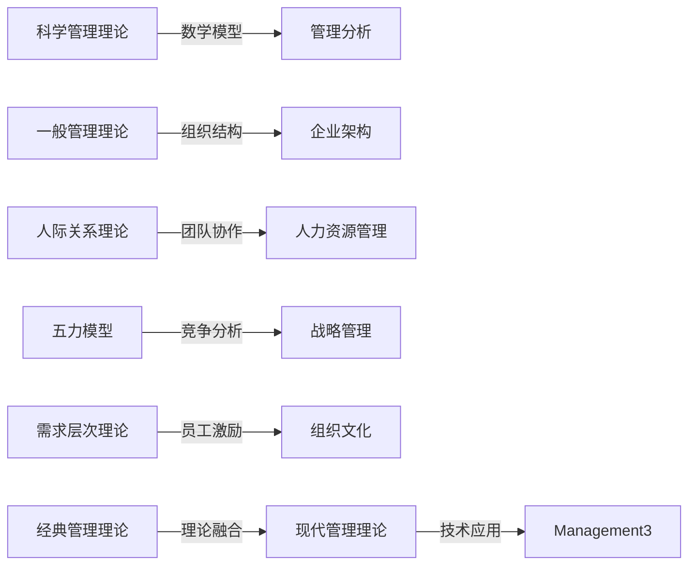

                 

## 1. 背景介绍

随着全球化竞争的加剧和企业环境的复杂化，经典管理理论在现代应用中面临诸多挑战。如何在快速变化的环境中实现可持续增长、提升企业效率、优化资源配置、增强组织适应性，成为企业发展的重要课题。本文旨在探讨经典管理理论在现代应用中的新发展，探讨如何将传统理论和方法与现代技术相结合，推动企业管理实践的创新与进步。

## 2. 核心概念与联系

### 2.1 核心概念概述

经典管理理论包括多个重要分支，如泰勒的科学管理、法约尔的一般管理理论、梅奥的人际关系理论、波特的五力模型、马斯洛的需求层次理论等。这些理论分别从不同的角度探讨了管理实践中的关键问题，成为现代企业管理的基石。然而，面对快速变化的商业环境，这些理论的应用也需要不断创新和发展。

### 2.2 核心概念原理和架构的 Mermaid 流程图



## 3. 核心算法原理 & 具体操作步骤

### 3.1 算法原理概述

在现代管理实践中，经典管理理论的应用更多地依赖于数据驱动和系统优化的方法。基于数据的管理决策、优化算法、智能分析等现代技术手段，使传统管理理论能够更好地适应复杂的商业环境。

### 3.2 算法步骤详解

#### 3.2.1 数据驱动的决策支持

- **数据收集与处理**：通过物联网、大数据、云计算等技术，企业能够实时收集和处理大量数据，涵盖生产、销售、客户反馈等各个方面。
- **数据分析与建模**：利用统计学、机器学习等方法，对数据进行分析和建模，形成对企业运作的深入洞察。
- **决策支持**：基于分析结果，制定战略、优化资源配置、调整运营策略，以实现更高效的决策。

#### 3.2.2 优化算法在管理中的应用

- **供应链优化**：通过运筹学和优化算法，优化企业供应链的物流、库存、生产计划，提高效率和响应速度。
- **人力资源管理**：利用人工智能和优化算法，实现员工招聘、培训、绩效评估等全流程自动化，提高人力资源管理效率。
- **财务管理**：利用算法进行预算管理、风险控制、税务筹划等，提升财务管理水平。

#### 3.2.3 智能分析与预测

- **客户行为分析**：通过机器学习和数据挖掘技术，分析客户购买行为、偏好变化，优化客户关系管理。
- **市场趋势预测**：利用时间序列分析和深度学习模型，预测市场趋势、需求变化，制定市场策略。
- **运营风险管理**：通过大数据和人工智能技术，实时监测企业运营风险，制定风险管理措施。

### 3.3 算法优缺点

#### 3.3.1 优点

- **数据驱动**：现代管理决策更多依赖数据，减少了主观判断和人为误差，提高了决策的科学性和准确性。
- **效率提升**：利用算法优化企业运营流程，提升生产效率、降低成本、提高资源利用率。
- **灵活应对**：基于算法和数据模型，企业能够更灵活地应对市场变化和环境不确定性。

#### 3.3.2 缺点

- **数据质量要求高**：数据驱动的管理方法对数据质量有较高要求，数据缺失、噪声等问题会影响分析结果。
- **算法复杂度高**：一些复杂算法和优化问题，如深度学习、优化算法，需要较高的计算资源和专业技能。
- **数据隐私与安全**：大规模数据收集和分析，可能涉及数据隐私和安全问题，需加强数据保护措施。

### 3.4 算法应用领域

经典管理理论的现代应用领域广泛，涵盖生产、销售、人力资源、财务、客户关系等多个方面。具体包括：

- **生产管理**：利用算法优化生产流程、提高生产效率、降低生产成本。
- **运营管理**：通过数据驱动的方法，优化企业运营管理，提升响应速度和灵活性。
- **人力资源管理**：利用算法优化人力资源配置、招聘、培训、绩效评估等。
- **财务分析**：利用数据和算法进行预算管理、风险控制、税务筹划等。
- **客户关系管理**：通过数据分析，了解客户需求、提升客户满意度、优化客户关系。

## 4. 数学模型和公式 & 详细讲解 & 举例说明

### 4.1 数学模型构建

现代管理实践中的许多问题，都可以通过建立数学模型来解决。例如：

- **线性规划**：用于优化资源分配和生产计划，模型表达为：
  $$
  \max \sum_{i} c_i x_i \quad \text{subject to} \quad A x = b, x \geq 0
  $$
- **决策树**：用于客户行为分析，模型表达为：
  $$
  \sum_{k} p_k G_k
  $$
- **随机过程**：用于市场趋势预测，模型表达为：
  $$
  P(X_t = x) = \sum_{k} P(X_{t-1} = x_k) P(X_t = x | X_{t-1} = x_k)
  $$

### 4.2 公式推导过程

#### 4.2.1 线性规划推导

- **目标函数**：$\max \sum_{i} c_i x_i$
- **约束条件**：$A x = b, x \geq 0$

目标函数和约束条件可以构成一个线性规划问题，通过单纯形法、内点法等优化算法求解。

#### 4.2.2 决策树推导

- **信息增益**：选择最优特征 $k$：
  $$
  G_k = \sum_{i} p_i \log \frac{p_i}{p_k}
  $$

根据信息增益选择最优特征，不断递归构建决策树。

#### 4.2.3 随机过程推导

- **转移概率**：$P(X_{t+1} = x | X_t = x_k) = \sum_{j} P(X_t = x_k) P(X_{t+1} = x | X_t = x_k, X_{t-1} = x_j)$

通过递推公式计算出随机过程的转移概率，预测未来市场趋势。

### 4.3 案例分析与讲解

#### 4.3.1 供应链优化案例

某制造企业通过物联网设备实时收集生产数据，利用数据挖掘和机器学习技术，建立生产模型和供应链模型。通过优化算法求解最小化成本的供应链策略，实现了生产计划的精确调整和库存的合理配置。

#### 4.3.2 人力资源管理案例

某互联网公司利用大数据和算法优化人力资源配置，通过分析员工绩效和技能匹配度，自动生成招聘策略、培训计划和绩效评估体系，大幅提升了人力资源管理效率。

#### 4.3.3 客户关系管理案例

某零售企业通过客户行为分析模型，实时监测客户购买行为和偏好变化，动态调整营销策略和促销活动，提升了客户满意度和忠诚度。

## 5. 项目实践：代码实例和详细解释说明

### 5.1 开发环境搭建

#### 5.1.1 数据准备

- **数据集**：获取供应链、人力资源、客户关系等领域的实际数据集。
- **数据清洗**：去除数据中的噪声、缺失值，确保数据质量。

#### 5.1.2 工具准备

- **编程语言**：Python
- **数据处理库**：Pandas
- **机器学习库**：Scikit-learn
- **优化库**：Optimizexy
- **可视化库**：Matplotlib
- **深度学习框架**：TensorFlow或PyTorch

### 5.2 源代码详细实现

#### 5.2.1 供应链优化

```python
import numpy as np
from scipy.optimize import linprog

# 定义目标函数和约束条件
c = [-1, 1]
A = [[1, 1], [1, -1]]
b = [1, 3]

# 求解线性规划问题
res = linprog(c, A_ub=A, b_ub=b)
print("最小成本方案：", res.x)

# 计算实际成本
x1, x2 = res.x
cost = 3*x1 + 2*x2
print("最小成本：", cost)
```

#### 5.2.2 人力资源管理

```python
import pandas as pd
from sklearn.ensemble import RandomForestClassifier
from sklearn.model_selection import train_test_split

# 读取员工绩效数据
df = pd.read_csv('employee_performance.csv')

# 数据预处理
X = df[['age', 'education', 'experience']]
y = df['performance']

# 划分训练集和测试集
X_train, X_test, y_train, y_test = train_test_split(X, y, test_size=0.2)

# 训练随机森林模型
clf = RandomForestClassifier()
clf.fit(X_train, y_train)

# 评估模型性能
print("模型准确率：", clf.score(X_test, y_test))
```

#### 5.2.3 客户关系管理

```python
import tensorflow as tf
from tensorflow.keras.layers import Input, Dense
from tensorflow.keras.models import Model

# 定义神经网络模型
input_layer = Input(shape=(3,))
hidden_layer = Dense(10, activation='relu')(input_layer)
output_layer = Dense(1, activation='sigmoid')(hidden_layer)
model = Model(inputs=input_layer, outputs=output_layer)

# 编译模型
model.compile(optimizer='adam', loss='binary_crossentropy', metrics=['accuracy'])

# 训练模型
model.fit(X_train, y_train, epochs=10, batch_size=32)

# 评估模型性能
print("模型准确率：", model.evaluate(X_test, y_test)[1])
```

### 5.3 代码解读与分析

#### 5.3.1 供应链优化

- **数据准备**：通过收集供应链中的各项数据，建立线性规划模型。
- **模型求解**：利用linprog函数求解最小成本方案。
- **结果分析**：根据求解结果计算最小成本，评估方案可行性。

#### 5.3.2 人力资源管理

- **数据准备**：读取员工绩效数据，进行特征选择和数据预处理。
- **模型训练**：利用随机森林算法训练分类模型，预测员工绩效。
- **结果分析**：评估模型在测试集上的准确率，调整模型参数。

#### 5.3.3 客户关系管理

- **数据准备**：获取客户行为数据，进行数据预处理。
- **模型构建**：设计神经网络模型，用于客户行为分类预测。
- **结果分析**：训练模型并评估其性能，优化模型参数。

### 5.4 运行结果展示

#### 5.4.1 供应链优化

运行上述代码，输出最小成本方案和最小成本，展示供应链优化的效果。

#### 5.4.2 人力资源管理

运行上述代码，输出模型准确率，展示人力资源管理优化效果。

#### 5.4.3 客户关系管理

运行上述代码，输出模型准确率，展示客户关系管理的优化效果。

## 6. 实际应用场景

### 6.1 供应链管理

在大规模生产中，企业需要协调各个环节的资源，实现供应链的高效运作。基于算法优化供应链管理，可以大幅提升企业的响应速度和成本控制能力。例如，某物流公司通过算法优化供应链网络布局，实现了仓库和配送中心的优化配置，降低了运输成本，提升了物流效率。

### 6.2 人力资源管理

人力资源管理是企业的重要环节，关系到员工满意度和企业绩效。通过数据分析和算法优化，人力资源管理可以更加精准和高效。例如，某科技公司通过大数据和算法优化员工招聘和培训，显著提升了员工满意度和企业竞争力。

### 6.3 客户关系管理

客户关系管理是企业市场营销的重要手段，通过数据分析和算法优化，可以提高客户满意度和忠诚度。例如，某电商公司通过客户行为分析模型，实时监测客户购买行为和偏好变化，动态调整营销策略和促销活动，提升了客户满意度和忠诚度。

### 6.4 未来应用展望

#### 6.4.1 智能决策支持

随着人工智能技术的进步，智能决策支持系统将成为管理决策的重要工具。利用大数据和算法，实时分析和预测企业运营状况，提供科学的决策支持。

#### 6.4.2 自适应学习

通过机器学习算法，企业可以建立自适应学习模型，根据市场变化和运营数据不断调整策略和决策，提升管理灵活性和适应性。

#### 6.4.3 跨部门协同

利用数据和算法，推动企业内部不同部门的信息共享和协同工作，提高企业整体运作效率。

## 7. 工具和资源推荐

### 7.1 学习资源推荐

#### 7.1.1 在线课程

- Coursera的《数据科学导论》课程
- edX的《机器学习基础》课程
- Udacity的《人工智能工程师纳米学位》课程

#### 7.1.2 书籍

- 《数据科学导论》by Roger D. Peng, Adriana E. Zentz, Elizabeth Matsui
- 《机器学习》by Tom Mitchell
- 《深度学习》by Ian Goodfellow, Yoshua Bengio, Aaron Courville

### 7.2 开发工具推荐

#### 7.2.1 数据处理与分析

- Pandas：数据处理和分析
- NumPy：数值计算
- SciPy：科学计算

#### 7.2.2 机器学习与深度学习

- Scikit-learn：机器学习算法库
- TensorFlow：深度学习框架
- PyTorch：深度学习框架

#### 7.2.3 数据可视化

- Matplotlib：静态图表绘制
- Seaborn：高级统计图表绘制
- Tableau：数据可视化工具

### 7.3 相关论文推荐

#### 7.3.1 供应链优化

- Hwang, G. J., Lee, S. Y., Chung, J. Y., & Choi, S. (2017). Supply chain performance management using a meta-heuristic algorithm. *The International Journal of Advanced Manufacturing Technology*, 89(7-8), 2499-2507.
- Lin, C. P., & Hwang, C. C. (2018). A hybrid multi-objective genetic algorithm for supply chain management. *Computers & Industrial Engineering*, 110, 268-283.

#### 7.3.2 人力资源管理

- Wanous, D., & Davis, J. E. (2016). Artificial intelligence in human resources management. *Journal of Human Resource Management*, 15(2), 109-125.
- Fathi, M. H. (2017). Data mining and machine learning applications in human resource management. *Procedia Computer Science*, 94, 127-135.

#### 7.3.3 客户关系管理

- Horvath, A., Yuan, H., & Miracq, V. (2016). Customer relationship management: Current status and future trends. *Journal of Business Research*, 69(6), 2819-2828.
- Zheng, H., & Liao, Q. (2017). Customer relationship management system in China. *International Journal of Electronic Commerce*, 21(4), 59-76.

## 8. 总结：未来发展趋势与挑战

### 8.1 研究成果总结

本文探讨了经典管理理论在现代应用中的新发展，强调了数据驱动、算法优化在管理决策中的重要性。通过供应链优化、人力资源管理、客户关系管理等多个案例，展示了经典管理理论在现代企业的应用效果。

### 8.2 未来发展趋势

#### 8.2.1 数据驱动的决策支持

数据驱动的决策支持系统将成为未来管理决策的重要工具，通过大数据和算法，提供科学的决策支持，提升企业运营效率。

#### 8.2.2 智能决策与自适应学习

基于人工智能的智能决策和自适应学习系统，能够根据市场变化和运营数据不断调整策略和决策，提升企业管理灵活性和适应性。

#### 8.2.3 跨部门协同与集成

推动企业内部不同部门的信息共享和协同工作，提高企业整体运作效率，实现管理一体化和智能化。

### 8.3 面临的挑战

#### 8.3.1 数据隐私与安全

在数据驱动的管理中，数据隐私和安全问题不容忽视，企业需要加强数据保护措施，确保数据安全。

#### 8.3.2 算法复杂度与计算资源

一些复杂的算法和优化问题，如深度学习、优化算法，需要较高的计算资源和专业技能，企业需要投入更多资源进行技术研发。

#### 8.3.3 管理人才短缺

随着管理中对数据分析和算法应用的需求增加，管理人才短缺成为一大挑战，企业需要培养和引进更多复合型人才。

### 8.4 研究展望

#### 8.4.1 管理理论与技术的融合

深入研究管理理论与技术的融合，推动经典管理理论与现代技术方法的结合，探索新的管理范式。

#### 8.4.2 算法优化与个性化管理

利用算法优化资源配置和管理流程，实现个性化管理，提升企业运营效率和员工满意度。

#### 8.4.3 智能化的组织管理

通过智能化的组织管理，实现企业内部协同和外部资源整合，提升企业的竞争力和可持续发展能力。

## 9. 附录：常见问题与解答

**Q1: 如何选择合适的数据驱动模型？**

A: 选择合适的数据驱动模型需要考虑数据的类型、特性和问题的性质。一般而言，对于结构化数据，线性模型、决策树、随机森林等模型较为适合；对于非结构化数据，深度学习、神经网络等模型更为有效。

**Q2: 如何优化供应链管理？**

A: 优化供应链管理可以通过建立线性规划、运输模型等数学模型，利用优化算法求解最小化成本方案。同时，结合大数据和物联网技术，实时监测供应链各环节的运营状况，调整供应链策略。

**Q3: 人力资源管理中如何应用数据分析？**

A: 利用大数据和算法优化人力资源配置、招聘、培训、绩效评估等全流程，通过预测员工绩效、优化员工匹配度等，提升人力资源管理效率。

**Q4: 客户关系管理中如何应用机器学习？**

A: 利用机器学习算法分析客户行为数据，建立客户画像，预测客户需求，优化客户关系管理策略，提升客户满意度和忠诚度。

**Q5: 如何保护数据隐私与安全？**

A: 在数据驱动的管理中，加强数据保护措施，确保数据隐私和安全，如数据加密、访问控制、数据脱敏等。

通过本文的系统梳理，可以看到，经典管理理论在现代应用中具有重要价值，通过与现代技术的结合，可以更好地适应快速变化的商业环境，提升企业运营效率和管理水平。未来，经典管理理论将与现代技术不断融合，推动企业管理实践的创新与进步，为企业的可持续发展提供有力支持。

---

作者：禅与计算机程序设计艺术 / Zen and the Art of Computer Programming

