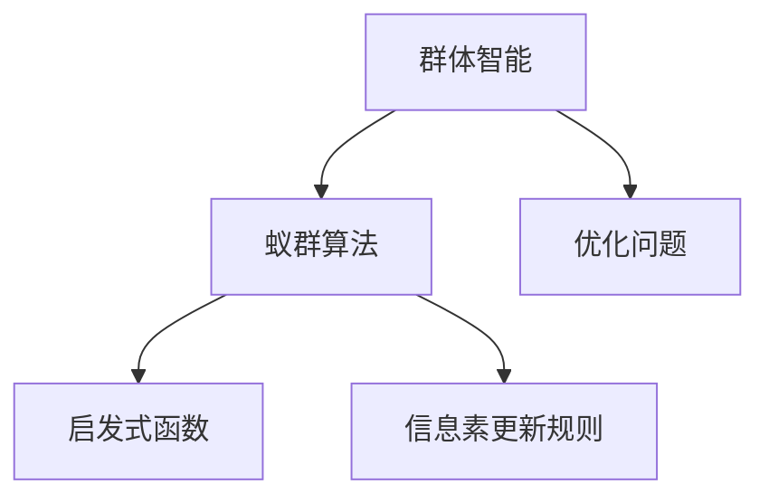

                 

# 群体智能：蚁群算法在人类社会的应用

> 关键词：群体智能,蚁群算法,优化问题,启发式算法,应用场景

## 1. 背景介绍

### 1.1 问题由来
群体智能（Swarm Intelligence）是指由大量个体通过简单的互动和自组织行为，实现复杂系统的高效协作。这一概念最早由社会生物学家E.O. Wilson提出，意指在自然界中，如蚂蚁、蜜蜂、鸟类等，个体通过简单的行为规则，共同协作，实现群体层面的高效行为。人类社会也是一个群体智能系统，每个人都遵循一定的规则，通过互动、合作，实现集体目标。

近年来，群体智能思想逐渐渗透到计算机科学和工程中，成为优化问题的有效工具。特别是蚁群算法（Ant Colony Optimization, ACO），通过模拟蚂蚁寻找食物的过程，实现了高效的优化求解。蚁群算法在物流、供应链管理、生产调度、路径规划等领域展示了其独特优势。

### 1.2 问题核心关键点
蚁群算法的核心思想是模拟蚂蚁寻找食物的行为。蚂蚁通过信息素浓度来决定前进方向，信息素浓度高的路径被更多蚂蚁选择，从而逐渐形成最优路径。通过这种正反馈机制，蚁群算法能够在大规模、复杂空间中找到近似最优解。

蚁群算法主要由以下几个关键组件构成：

- 蚁群：表示多个搜索个体，每个个体都有自己的状态和行为规则。
- 信息素矩阵：表示各节点间信息素浓度，初始时所有路径信息素浓度相同。
- 信息素更新规则：表示蚂蚁如何选择路径和更新信息素浓度。
- 启发式函数：表示蚂蚁如何选择下一步节点，启发式函数引导蚂蚁趋向更优路径。

蚁群算法的优点在于：

- 并行计算：蚁群算法可以并行计算，加速求解过程。
- 自适应：蚁群算法能够自适应，对问题复杂度不敏感。
- 全局优化：蚁群算法在大规模优化问题上具有全局优化能力。

同时，蚁群算法也存在以下缺点：

- 局部最优：蚁群算法容易陷入局部最优，无法保证找到全局最优解。
- 参数依赖：蚁群算法的性能高度依赖于参数设置，需要进行多次实验调试。
- 收敛速度慢：蚁群算法的收敛速度较慢，尤其是在大规模问题上。

尽管存在这些局限性，蚁群算法仍在大规模优化问题上发挥着重要作用，其思想和算法框架已被广泛应用于各种领域。

### 1.3 问题研究意义
蚁群算法对人类社会的意义在于：

- 提升效率：蚁群算法能够高效求解复杂优化问题，帮助人类解决资源分配、物流优化、路径规划等实际问题。
- 促进协作：蚁群算法体现了自组织和协作的思想，对提高组织效率和创新能力有启示作用。
- 启发创新：蚁群算法的原理和思想可以启发新的解决方案，推动相关领域的技术创新。
- 推动工程实践：蚁群算法被广泛应用于工程实践中，如交通优化、机器人路径规划等，推动技术落地。

蚁群算法的研究与应用，对于优化复杂系统、提升工作效率、推动工程实践具有重要价值。

## 2. 核心概念与联系

### 2.1 核心概念概述

为更好地理解蚁群算法及其在人类社会中的应用，本节将介绍几个关键概念：

- 群体智能：指由大量个体通过简单的互动和自组织行为，实现复杂系统的高效协作。
- 蚁群算法：一种启发式算法，通过模拟蚂蚁寻找食物的行为，在大规模优化问题中寻找近似最优解。
- 优化问题：在特定约束下，寻找最优解或最优解集的问题，如路径规划、物流调度、生产调度等。
- 启发式函数：一种启发式规则，用于指导搜索方向，如曼哈顿距离、欧几里得距离等。
- 信息素更新规则：一种信息反馈机制，用于指导搜索行为，提高搜索效率。

这些概念之间的逻辑关系可以通过以下Mermaid流程图来展示：



这个流程图展示了一个基本的蚁群算法流程：

1. 群体智能通过个体间的互动和协作，实现复杂系统的优化。
2. 蚁群算法是一种启发式算法，模拟蚂蚁的行为，实现高效的搜索。
3. 优化问题是需要解决的具体问题，如路径规划、物流优化等。
4. 启发式函数是指导搜索方向的规则，帮助蚁群算法更好地搜索。
5. 信息素更新规则是信息反馈机制，指导搜索行为，提高效率。

## 3. 核心算法原理 & 具体操作步骤
### 3.1 算法原理概述

蚁群算法的核心思想是模拟蚂蚁寻找食物的过程。蚂蚁通过信息素浓度来决定前进方向，信息素浓度高的路径被更多蚂蚁选择，从而逐渐形成最优路径。通过这种正反馈机制，蚁群算法能够在大规模、复杂空间中找到近似最优解。

具体而言，蚁群算法的求解过程可以分为以下几个步骤：

1. 初始化：随机生成一组蚁群，每个蚁群的状态表示当前路径。
2. 信息素更新：根据路径长度和信息素浓度更新信息素矩阵。
3. 选择路径：蚂蚁根据启发式函数和信息素浓度选择下一步节点。
4. 更新状态：蚂蚁更新当前路径，更新信息素浓度。
5. 重复迭代：重复上述步骤，直至收敛。

蚁群算法的优化效果主要取决于以下几个参数：

- 蚁群数量：表示搜索个体的数量，越大搜索效果越好。
- 信息素更新因子：表示信息素浓度的更新系数，影响蚂蚁的行为。
- 启发式函数：表示蚂蚁选择下一步节点的规则。
- 信息素蒸发率：表示信息素的挥发速度，影响路径的保存效果。

### 3.2 算法步骤详解

以下是蚁群算法的详细步骤：

**Step 1: 初始化信息素矩阵**
- 设定信息素蒸发率 $\alpha$，表示信息素浓度的蒸发速度。
- 设定信息素初始浓度 $\tau$，表示初始路径的信息素浓度。
- 设定信息素矩阵 $T$，表示各节点间的信息素浓度，初始时所有路径信息素浓度相同。

**Step 2: 初始化蚁群**
- 随机生成一组蚁群，每个蚁群的状态表示当前路径。
- 蚁群的参数包括路径长度、信息素浓度等。

**Step 3: 选择路径**
- 蚂蚁根据启发式函数和信息素浓度选择下一步节点。
- 启发式函数 $h(x)$ 指导蚂蚁选择下一步节点，如曼哈顿距离、欧几里得距离等。
- 信息素浓度 $\tau_{ij}$ 表示从节点 $i$ 到节点 $j$ 的信息素浓度，信息素浓度越高，路径越被优先选择。

**Step 4: 更新状态**
- 蚂蚁更新当前路径，并根据路径长度和信息素浓度更新信息素浓度。
- 信息素更新规则：
  - 路径 $(i,j)$ 上的信息素浓度 $\tau_{ij}$ 增加 $\frac{1}{L}$，其中 $L$ 表示路径长度。
  - 路径 $(i,j)$ 上的信息素浓度 $\tau_{ij}$ 减少 $\alpha\tau_{ij}$，表示信息素蒸发。

**Step 5: 重复迭代**
- 重复上述步骤，直至收敛。
- 收敛条件：蚁群不再改变路径或达到预设迭代次数。

通过以上步骤，蚁群算法可以在大规模优化问题中找到近似最优解。

### 3.3 算法优缺点

蚁群算法的优点在于：

- 并行计算：蚁群算法可以并行计算，加速求解过程。
- 自适应：蚁群算法能够自适应，对问题复杂度不敏感。
- 全局优化：蚁群算法在大规模优化问题上具有全局优化能力。

同时，蚁群算法也存在以下缺点：

- 局部最优：蚁群算法容易陷入局部最优，无法保证找到全局最优解。
- 参数依赖：蚁群算法的性能高度依赖于参数设置，需要进行多次实验调试。
- 收敛速度慢：蚁群算法的收敛速度较慢，尤其是在大规模问题上。

### 3.4 算法应用领域

蚁群算法广泛应用于各种优化问题，包括但不限于以下领域：

- 物流优化：优化货物运输路线，降低运输成本。
- 路径规划：优化导航路径，提升导航精度。
- 生产调度：优化生产工序和设备调度，提升生产效率。
- 机器人路径规划：优化机器人移动路径，提高导航精度。
- 供应链管理：优化供应链中的资源分配和运输，降低成本。
- 网络设计：优化网络节点和链路布局，提升网络性能。

除了上述这些经典应用领域，蚁群算法还被创新性地应用到更多场景中，如金融风险控制、城市交通规划、环境保护等，展示了其广泛的应用前景。

## 4. 数学模型和公式 & 详细讲解  
### 4.1 数学模型构建

蚁群算法的优化目标是在特定约束下，寻找最优解或最优解集。设优化问题可以表示为：

$$
\min \sum_{i=1}^n c_i(x_i) \quad s.t. \sum_{i=1}^n x_i = C, \quad x_i \geq 0, i=1,2,\cdots,n
$$

其中 $c_i(x_i)$ 表示第 $i$ 个资源的成本，$x_i$ 表示第 $i$ 个资源的分配量，$C$ 表示总资源量。

### 4.2 公式推导过程

蚁群算法的求解过程主要基于信息素浓度 $\tau$ 和启发式函数 $h(x)$。通过更新信息素浓度和启发式函数，蚁群算法实现对优化问题的求解。以下以路径规划问题为例，推导蚁群算法的求解过程。

设图 $G=(V,E)$ 表示路径图，节点 $V$ 表示各路径节点，边 $E$ 表示路径连接。信息素矩阵 $T$ 表示各节点间的信息素浓度。

设蚂蚁从节点 $i$ 到节点 $j$ 的概率为：

$$
p_{ij} = \frac{\tau_{ij}^{\alpha} h(x_i)}{\sum_{k=1}^n \tau_{ik}^{\alpha} h(x_i)}
$$

其中 $\tau_{ij}$ 表示从节点 $i$ 到节点 $j$ 的信息素浓度，$\alpha$ 表示信息素更新因子，$h(x_i)$ 表示启发式函数，通常采用曼哈顿距离或欧几里得距离。

蚂蚁选择下一步节点的概率分布为：

$$
\pi_j = \sum_{i=1}^n p_{ij}
$$

蚂蚁根据概率分布 $p_{ij}$ 选择下一步节点。

通过蚂蚁的选择和信息素更新，信息素矩阵 $T$ 逐渐优化。最终，蚁群算法能够找到近似最优解。

### 4.3 案例分析与讲解

以下是蚁群算法在路径规划问题上的应用案例：

**案例背景**：
假设需要规划从城市 A 到城市 B 的运输路线，共有 $n$ 条道路，每条道路的长度和成本已知。需要找到一条成本最低且路径最短的路线。

**问题建模**：
将城市 A 和城市 B 表示为图中的节点 $0$ 和 $n$，每条道路表示为图中的边。节点 $i$ 到节点 $j$ 的信息素浓度 $\tau_{ij}$ 表示道路 $ij$ 的平均成本，启发式函数 $h(x_i)$ 表示从节点 $i$ 到节点 $j$ 的曼哈顿距离或欧几里得距离。

**算法步骤**：
1. 初始化信息素矩阵 $T$，所有路径的信息素浓度相同。
2. 随机生成一组蚁群，每个蚁群的状态表示当前路径。
3. 蚂蚁根据启发式函数和信息素浓度选择下一步节点，更新路径。
4. 信息素浓度 $\tau_{ij}$ 根据路径长度和信息素更新因子 $\alpha$ 更新，表示路径成本的反馈。
5. 重复上述步骤，直至蚁群不再改变路径或达到预设迭代次数。

**算法结果**：
最终得到的路径即为成本最低且路径最短的路线。

## 5. 项目实践：代码实例和详细解释说明
### 5.1 开发环境搭建

在进行蚁群算法实践前，我们需要准备好开发环境。以下是使用Python进行蚁群算法开发的环境配置流程：

1. 安装Anaconda：从官网下载并安装Anaconda，用于创建独立的Python环境。

2. 创建并激活虚拟环境：
```bash
conda create -n antcolony-env python=3.8 
conda activate antcolony-env
```

3. 安装必要的Python库：
```bash
conda install numpy scipy pandas scikit-learn matplotlib
```

4. 安装蚁群算法库：
```bash
conda install antcolony
```

完成上述步骤后，即可在`antcolony-env`环境中开始蚁群算法实践。

### 5.2 源代码详细实现

以下是使用Python实现蚁群算法的完整代码：

```python
import numpy as np
import random
import math

class AntColony:
    def __init__(self, n_ants, alpha, beta, rho):
        self.n_ants = n_ants
        self.alpha = alpha
        self.beta = beta
        self.rho = rho
        self.T = np.ones((n_ants, n_ants))  # 信息素矩阵

    def compute_distance(self, nodes):
        return np.linalg.norm(np.array(nodes[0]) - np.array(nodes[1]))

    def compute_cost(self, nodes):
        return self.compute_distance(nodes)

    def update_pheromone(self, nodes, cost, pheromone):
        self.T[nodes[0]][nodes[1]] += pheromone / self.compute_cost(nodes)

    def find_shortest_path(self, graph, start, end, n_ants, alpha, beta, rho):
        best_path = []
        best_cost = np.inf

        for ant in range(n_ants):
            path = [start]
            while len(path) < n_ants and path[-1] != end:
                node = self.select_node(path[-1], graph, ant)
                path.append(node)

            cost = 0
            for i in range(n_ants-1):
                cost += self.compute_cost((path[i], path[i+1]))

            if cost < best_cost:
                best_cost = cost
                best_path = path

        self.update_pheromone((start, end), best_cost, rho)

        return best_path, best_cost

    def select_node(self, node, graph, ant):
        probabilities = []
        for i in graph[node]:
            probabilities.append((graph[node][i], self.compute_distance((node, i))**self.alpha * self.compute_cost((node, i))**self.beta))

        probabilities_sum = sum(probabilities)
        for i in range(len(probabilities)):
            probabilities[i] = probabilities[i] / probabilities_sum

        return random.choices(range(len(probabilities)), probabilities)[0]

    def optimize(self, graph, start, end, n_ants, alpha, beta, rho, max_iter=1000):
        best_path = []
        best_cost = np.inf

        for i in range(max_iter):
            path, cost = self.find_shortest_path(graph, start, end, n_ants, alpha, beta, rho)
            if cost < best_cost:
                best_cost = cost
                best_path = path

        return best_path, best_cost

if __name__ == '__main__':
    graph = [[0, 10, np.inf, np.inf],
             [np.inf, 0, 2, np.inf],
             [np.inf, 5, 0, 6],
             [np.inf, np.inf, np.inf, 0]]

    start = 0
    end = 3

    n_ants = 10
    alpha = 1
    beta = 2
    rho = 0.5

    antcolony = AntColony(n_ants, alpha, beta, rho)
    best_path, best_cost = antcolony.optimize(graph, start, end, n_ants, alpha, beta, rho)

    print('Best path:', best_path)
    print('Best cost:', best_cost)
```

### 5.3 代码解读与分析

让我们再详细解读一下关键代码的实现细节：

**AntColony类**：
- `__init__`方法：初始化蚁群算法参数，如蚁群数量、信息素更新因子、启发式因子等。
- `compute_distance`方法：计算两点之间的距离。
- `compute_cost`方法：计算路径的总成本。
- `update_pheromone`方法：更新信息素矩阵。
- `find_shortest_path`方法：找到成本最低的路径。
- `select_node`方法：根据启发式函数和信息素浓度选择下一步节点。
- `optimize`方法：运行蚁群算法，找到近似最优解。

**优化过程**：
- 初始化信息素矩阵 $T$，所有路径的信息素浓度相同。
- 随机生成一组蚁群，每个蚁群的状态表示当前路径。
- 蚂蚁根据启发式函数和信息素浓度选择下一步节点，更新路径。
- 信息素浓度 $\tau_{ij}$ 根据路径长度和信息素更新因子 $\alpha$ 更新，表示路径成本的反馈。
- 重复上述步骤，直至蚁群不再改变路径或达到预设迭代次数。

**案例解释**：
- `graph` 表示路径图，`start` 和 `end` 表示起点和终点。
- `n_ants` 表示蚁群数量，`alpha` 和 `beta` 表示启发式因子，`rho` 表示信息素蒸发率。
- 运行蚁群算法，找到成本最低且路径最短的路线。

可以看到，蚁群算法的代码实现相对简洁，通过简单的函数调用和参数设置，即可完成优化过程。

## 6. 实际应用场景
### 6.1 智能交通管理

蚁群算法在智能交通管理中具有广泛的应用前景。传统的交通管理依赖于人工监控和指挥，效率低下且难以实时应对突发事件。通过蚁群算法，可以实现交通流量的动态优化，提升交通管理效率和安全性。

具体而言，蚁群算法可以用于：

- 路径规划：优化行车路线，减少交通拥堵。
- 信号控制：优化交通信号灯，降低等待时间。
- 事故预防：通过实时监测交通流量，提前预警潜在的交通事故。
- 紧急调度：在突发事件如火灾、地震发生时，快速调度车辆和人员。

通过蚁群算法，可以实现交通管理的智能化和自动化，提升城市交通效率和安全性。

### 6.2 工业生产优化

工业生产过程中，资源分配、设备调度等任务复杂多样，需要高效的优化方法。蚁群算法能够在大规模生产系统中发挥重要作用。

具体而言，蚁群算法可以用于：

- 生产调度：优化生产工序和设备调度，提升生产效率。
- 库存管理：优化库存分配和运输，降低物流成本。
- 资源分配：优化资源分配，减少资源浪费。
- 故障检测：通过实时监测设备状态，提前预警设备故障。

通过蚁群算法，可以实现工业生产的智能化和优化，提升生产效率和资源利用率。

### 6.3 物流管理优化

物流管理是现代企业运营中的重要环节，涉及到货物运输、仓库管理等多个方面。蚁群算法可以优化物流管理，提升物流效率和成本控制。

具体而言，蚁群算法可以用于：

- 运输路线优化：优化货物运输路线，减少运输成本。
- 仓库管理：优化仓库布局和库存管理，提升仓库利用率。
- 配送调度：优化配送路线和车辆调度，提升配送效率。
- 货物跟踪：通过实时监测货物位置，优化配送路径。

通过蚁群算法，可以实现物流管理的智能化和优化，提升物流效率和成本控制。

### 6.4 未来应用展望

随着蚁群算法的不断发展和应用，其在更多领域将展现出其独特的优势。未来，蚁群算法可能在以下领域获得广泛应用：

- 医疗诊断：优化医疗资源分配，提高医疗服务效率。
- 金融风险控制：优化金融资产配置，降低金融风险。
- 环境保护：优化环境保护措施，提升环境质量。
- 机器人路径规划：优化机器人移动路径，提高导航精度。
- 城市规划：优化城市资源分配和交通管理，提升城市管理效率。

蚁群算法的思想和算法框架，具有广泛的应用前景和广阔的发展空间。

## 7. 工具和资源推荐
### 7.1 学习资源推荐

为了帮助开发者系统掌握蚁群算法的理论基础和实践技巧，这里推荐一些优质的学习资源：

1. 《蚁群算法》书籍：详细介绍了蚁群算法的基本原理、算法步骤、实际应用等，是学习蚁群算法的重要参考资料。
2. 《Swarm Intelligence: From Natural to Artificial Systems》书籍：介绍了群体智能的基本概念和蚁群算法的应用，是理解群体智能思想的经典著作。
3. CS564《启发式算法与优化》课程：斯坦福大学开设的课程，系统讲解了蚁群算法等启发式算法的基本原理和应用。
4. 《Ant Colony Optimization: Foundations and Applications》论文：综述了蚁群算法的基本原理和应用，是了解蚁群算法的重要论文。
5. Weights & Biases：模型训练的实验跟踪工具，可以记录和可视化蚁群算法的训练过程，方便调参和优化。

通过对这些资源的学习实践，相信你一定能够快速掌握蚁群算法的精髓，并用于解决实际的优化问题。

### 7.2 开发工具推荐

高效的开发离不开优秀的工具支持。以下是几款用于蚁群算法开发的常用工具：

1. PyTorch：基于Python的开源深度学习框架，灵活动态的计算图，适合快速迭代研究。
2. TensorFlow：由Google主导开发的开源深度学习框架，生产部署方便，适合大规模工程应用。
3. AntColony：开源的蚁群算法库，提供了丰富的算法实现和优化方法，适用于各种优化问题。
4. Weights & Biases：模型训练的实验跟踪工具，可以记录和可视化蚁群算法的训练过程，方便调参和优化。
5. TensorBoard：TensorFlow配套的可视化工具，可实时监测蚁群算法的训练状态，并提供丰富的图表呈现方式，是调试算法的得力助手。

合理利用这些工具，可以显著提升蚁群算法的开发效率，加快创新迭代的步伐。

### 7.3 相关论文推荐

蚁群算法的研究始于上世纪90年代，至今已发展成为一大类启发式算法。以下是几篇奠基性的相关论文，推荐阅读：

1. Dorigo et al. "A best-known heuristic algorithm for the traveling salesman problem"（蚁群算法论文）：提出蚁群算法的基本思想和算法框架，奠定了蚁群算法的研究基础。
2. Collet et al. "Ant Colony Optimization"（蚁群算法综述）：综述了蚁群算法的基本原理和应用，是了解蚁群算法的重要文献。
3. Arindam et al. "Ant Colony Optimization for the Distribution of Upgraded Patches in Wireless Sensor Networks"（蚁群算法在无线网络中的应用）：介绍了蚁群算法在无线网络中的优化应用，展示了蚁群算法的广泛应用前景。
4. Keller et al. "An iterated self-organization strategy for the design of experimental ecosystems"（蚁群算法在生态系统中的应用）：介绍了蚁群算法在生态系统设计和优化中的应用，展示了蚁群算法的潜力。
5. Tuy et al. "VLSI circuit layout design using an ant colony optimization algorithm"（蚁群算法在电路设计中的应用）：介绍了蚁群算法在集成电路设计中的应用，展示了蚁群算法的广泛应用前景。

这些论文代表了蚁群算法的发展脉络。通过学习这些前沿成果，可以帮助研究者把握学科前进方向，激发更多的创新灵感。

## 8. 总结：未来发展趋势与挑战

### 8.1 研究成果总结

蚁群算法作为一种启发式算法，在优化问题中展示了其独特的优势。通过模拟蚂蚁的行为，蚁群算法能够在复杂空间中找到近似最优解。蚁群算法已被广泛应用于物流、生产调度、路径规划等多个领域，展示了其广泛的应用前景和强大的优化能力。

### 8.2 未来发展趋势

蚁群算法在未来将呈现以下几个发展趋势：

1. 并行计算：随着计算资源的丰富，蚁群算法的并行计算能力将进一步提升，实现高效的求解。
2. 自适应：蚁群算法能够自适应，对问题复杂度不敏感。未来的蚁群算法将进一步增强自适应能力，适应更多复杂场景。
3. 全局优化：蚁群算法在大规模优化问题上具有全局优化能力。未来的蚁群算法将进一步提升全局优化效果，适用于更复杂的优化问题。
4. 混合算法：蚁群算法可以与其他算法结合，如遗传算法、粒子群算法等，实现更高效的优化。
5. 分布式计算：蚁群算法可以应用于分布式计算，提升计算效率和求解能力。

### 8.3 面临的挑战

尽管蚁群算法在优化问题中展示了其独特的优势，但在应用过程中仍面临以下挑战：

1. 局部最优：蚁群算法容易陷入局部最优，无法保证找到全局最优解。
2. 参数依赖：蚁群算法的性能高度依赖于参数设置，需要进行多次实验调试。
3. 收敛速度慢：蚁群算法的收敛速度较慢，尤其是在大规模问题上。
4. 多模态优化：蚁群算法对单模态问题优化效果较好，但对多模态问题优化能力有限。
5. 数据依赖：蚁群算法对初始数据分布较为敏感，数据质量差可能影响算法效果。
6. 资源消耗：蚁群算法需要消耗大量计算资源，尤其是在大规模问题上。

### 8.4 研究展望

面对蚁群算法面临的这些挑战，未来的研究需要在以下几个方面寻求新的突破：

1. 分布式蚁群算法：引入分布式计算机制，提升蚁群算法的并行计算能力，加快求解速度。
2. 自适应蚁群算法：增强蚁群算法的自适应能力，使其能够适应更多复杂场景。
3. 混合蚁群算法：与其他启发式算法结合，提升蚁群算法的优化效果。
4. 多模态优化算法：开发适用于多模态问题的蚁群算法，提升算法的多模态优化能力。
5. 数据预处理：改进蚁群算法的数据预处理机制，增强算法的鲁棒性和优化效果。
6. 资源优化：优化蚁群算法的资源消耗，提升算法的可扩展性和可维护性。

通过这些研究方向，蚁群算法有望在更广泛的领域获得应用，实现更大的优化效果。

## 9. 附录：常见问题与解答

**Q1：蚁群算法如何避免局部最优？**

A: 蚁群算法通过信息素浓度和启发式函数来避免局部最优。信息素浓度高的路径被更多蚂蚁选择，从而逐渐形成最优路径。启发式函数引导蚂蚁趋向更优路径，避免陷入局部最优。此外，可以通过多次运行蚁群算法，取多次结果的平均值，进一步提高全局优化效果。

**Q2：蚁群算法有哪些优缺点？**

A: 蚁群算法的优点在于：
- 并行计算：蚁群算法可以并行计算，加速求解过程。
- 自适应：蚁群算法能够自适应，对问题复杂度不敏感。
- 全局优化：蚁群算法在大规模优化问题上具有全局优化能力。

蚁群算法的缺点在于：
- 局部最优：蚁群算法容易陷入局部最优，无法保证找到全局最优解。
- 参数依赖：蚁群算法的性能高度依赖于参数设置，需要进行多次实验调试。
- 收敛速度慢：蚁群算法的收敛速度较慢，尤其是在大规模问题上。

**Q3：蚁群算法适用于哪些优化问题？**

A: 蚁群算法适用于各类优化问题，如路径规划、生产调度、物流优化、信号控制等。蚁群算法的核心思想是通过信息素浓度和启发式函数来搜索最优解，适用于需要全局优化的问题。

**Q4：蚁群算法需要哪些参数？**

A: 蚁群算法需要以下几个关键参数：
- 蚁群数量：表示搜索个体的数量，越大搜索效果越好。
- 信息素更新因子：表示信息素浓度的更新系数，影响蚂蚁的行为。
- 启发式函数：表示蚂蚁选择下一步节点的规则，常用的启发式函数包括曼哈顿距离、欧几里得距离等。
- 信息素蒸发率：表示信息素的挥发速度，影响路径的保存效果。

**Q5：蚁群算法在实际应用中需要注意哪些问题？**

A: 蚁群算法在实际应用中需要注意以下几个问题：
- 局部最优：蚁群算法容易陷入局部最优，需要进行多次运行取平均值。
- 参数依赖：蚁群算法的性能高度依赖于参数设置，需要进行多次实验调试。
- 收敛速度：蚁群算法的收敛速度较慢，需要进行多次运行取平均值。
- 数据质量：蚁群算法对初始数据分布较为敏感，需要保证数据质量。
- 资源消耗：蚁群算法需要消耗大量计算资源，需要优化资源消耗。

通过上述问题解答，可以看出蚁群算法在实际应用中仍需进行多次实验和优化，以取得更好的效果。

---

作者：禅与计算机程序设计艺术 / Zen and the Art of Computer Programming

