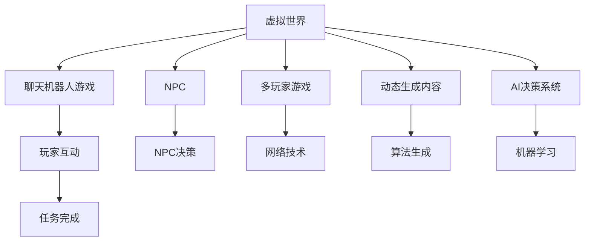

                 

# 聊天机器人游戏革命：沉浸式多人互动

## 1. 背景介绍

### 1.1 问题由来

随着技术的不断进步，聊天机器人已经从简单的问答系统发展到了复杂的交互式游戏场景。早期的聊天机器人通常只能进行单向信息传输，缺乏互动性和趣味性。而现代的聊天机器人游戏则通过构建虚拟世界和角色，实现了更加丰富的交互体验。这不仅提升了用户参与度，也激发了游戏设计者更多的创新空间。

### 1.2 问题核心关键点

现代聊天机器人游戏之所以能够获得成功，关键在于以下几个方面：

- **虚拟世界的构建**：通过游戏引擎和技术，可以创建沉浸式的虚拟世界，让玩家感觉如同置身其中。
- **角色和NPC的设计**：使用先进的AI技术，让机器人能够像真实人物一样进行互动，提供更真实的游戏体验。
- **多玩家支持**：通过网络技术，让多个玩家能够在同一虚拟世界中互动，增加了游戏的趣味性和挑战性。
- **动态生成内容**：使用随机生成算法，创建丰富多样的游戏环境，提升玩家的探索欲望。
- **智能AI系统**：借助机器学习和自然语言处理技术，实现机器人智能决策和反应，增强游戏的可玩性。

## 2. 核心概念与联系

### 2.1 核心概念概述

为了更好地理解聊天机器人游戏的发展趋势，本节将介绍几个关键概念：

- **聊天机器人游戏**：一种结合了自然语言处理和人工智能技术的游戏类型，使玩家能够通过与机器人进行互动，探索虚拟世界并完成任务。
- **虚拟世界**：通过游戏引擎和图形渲染技术创建的，具有高度沉浸感和互动性的虚拟环境。
- **NPC**：非玩家角色，指游戏中的机器人角色，通常由AI系统控制，可以与玩家进行互动。
- **多玩家游戏**：允许多个玩家通过网络在同一虚拟世界中互动的游戏。
- **动态生成内容**：使用算法生成实时变化的游戏环境，提升游戏的可玩性和探索性。
- **AI决策系统**：使用机器学习和深度学习技术，使聊天机器人能够自主进行决策和反应。

这些概念之间的逻辑关系可以通过以下Mermaid流程图来展示：



这个流程图展示了虚拟世界、聊天机器人游戏和关键组件之间的关系：

1. 虚拟世界是聊天机器人游戏的基础。
2. NPC和AI决策系统是游戏的重要组成部分。
3. 多玩家游戏和动态生成内容提升游戏的趣味性。
4. 玩家互动和任务完成是游戏的最终目标。

## 3. 核心算法原理 & 具体操作步骤

### 3.1 算法原理概述

聊天机器人游戏的设计和实现涉及多个技术领域，包括自然语言处理、人工智能、计算机图形学和游戏设计等。其中，NPC的决策和交互是核心问题之一。

聊天机器人游戏中的NPC通常由AI系统控制，通过学习玩家的行为和对话内容，进行自主决策和反应。其核心算法原理可以总结为：

1. **对话管理**：负责解析玩家输入的自然语言，生成合适的回应。
2. **行为决策**：基于当前环境和目标，决定NPC的行为和路径。
3. **情感模拟**：使用情感计算技术，使NPC能够表现出情绪变化，提升游戏真实感。
4. **多玩家同步**：通过网络技术，保证多个NPC之间的同步和协作。

### 3.2 算法步骤详解

以一个简单的聊天机器人游戏为例，介绍NPC的决策和交互算法。

**Step 1: 数据收集与预处理**

- 收集玩家输入的对话记录和行为数据。
- 使用自然语言处理技术，将文本转化为结构化数据。
- 使用机器学习算法，对玩家行为进行模式识别和预测。

**Step 2: 对话管理**

- 使用对话管理模块，解析玩家输入的自然语言。
- 使用意图识别算法，判断玩家的意图。
- 根据意图，生成合适的回应。

**Step 3: 行为决策**

- 基于当前环境和目标，使用规则引擎或决策树，决定NPC的行为和路径。
- 使用路径规划算法，生成NPC的运动轨迹。
- 使用路径优化算法，提高NPC的导航效率。

**Step 4: 情感模拟**

- 使用情感计算算法，分析玩家的情感状态。
- 使用情感生成算法，生成NPC的情绪变化。
- 使用情感融合算法，将NPC的情绪与对话内容相结合，提升真实感。

**Step 5: 多玩家同步**

- 使用网络技术，实现多个NPC之间的通信。
- 使用分布式计算框架，实现多玩家同步和协作。
- 使用一致性算法，保证多个NPC的状态一致。

### 3.3 算法优缺点

聊天机器人游戏中的NPC决策算法具有以下优点：

- **高度自主性**：NPC能够自主进行决策和反应，提升游戏的可玩性。
- **情感表达**：通过情感计算，使NPC表现出情绪变化，增强游戏真实感。
- **多玩家支持**：通过网络技术，实现多个NPC之间的同步和协作，增加游戏的趣味性。

同时，该算法也存在以下局限性：

- **计算复杂度高**：NPC的决策和行为模拟涉及多个计算模块，需要较高的计算资源。
- **实时性要求高**：NPC的响应速度直接影响游戏体验，需要优化算法和硬件配置。
- **数据依赖性强**：NPC的行为决策依赖于大量的玩家数据，数据质量直接影响到决策效果。
- **情感计算复杂**：情感模拟需要复杂的情感计算算法，实现难度较大。

## 4. 数学模型和公式 & 详细讲解

### 4.1 数学模型构建

为了更精确地描述聊天机器人游戏中的NPC决策算法，我们可以使用数学模型来构建算法的计算框架。

假设NPC在当前状态$s$下，接收到玩家输入的自然语言$x$，通过对话管理模块，解析出意图$I(x)$。然后，NPC根据意图和当前状态，使用行为决策算法生成行为序列$a=(a_1, a_2, ..., a_n)$。接着，NPC通过情感计算算法生成情感状态$E$。最后，NPC根据情感状态和行为序列，生成回应$y$。

数学模型可以表示为：

$$
y = f(I(x), s, a, E)
$$

其中，$f$为NPC的回应生成函数。

### 4.2 公式推导过程

在上述模型中，行为决策和情感计算是关键步骤。以下是这两个步骤的公式推导过程。

**行为决策**

行为决策算法通常使用规则引擎或决策树来生成行为序列。假设有$n$种可能的行为，每种行为的概率为$p_i$。NPC的行为选择可以表示为：

$$
a_i = \arg\max_{i=1,...,n} p_i
$$

**情感计算**

情感计算通常使用情感生成算法，如FACNet、EmoNet等，生成NPC的情感状态。情感状态可以表示为：

$$
E = g(I(x), s, a)
$$

其中，$g$为情感生成函数。

通过对话管理和行为决策，NPC可以生成一系列的行为和回应。结合情感计算，使NPC的行为更加动态和丰富。

### 4.3 案例分析与讲解

以一个简单的聊天机器人游戏为例，分析NPC的决策和交互过程。

**案例场景**：玩家进入一个虚拟森林，需要寻找隐藏在森林中的宝藏。

**玩家输入**："我要找到宝藏，你能帮我吗？"

**对话管理**：解析输入，意图为"寻找宝藏"。

**行为决策**：根据当前状态和意图，NPC决定跟随玩家，并在合适的位置设置陷阱或提供提示。

**情感计算**：NPC根据玩家的行为和对话，生成紧张、兴奋等情感状态，并通过回应表达出来。

**回应生成**：NPC生成回应"我会跟着你，要注意陷阱哦！"

## 5. 项目实践：代码实例和详细解释说明

### 5.1 开发环境搭建

在进行聊天机器人游戏的开发前，我们需要准备好开发环境。以下是使用Python和Pygame库进行游戏开发的配置流程：

1. 安装Anaconda：从官网下载并安装Anaconda，用于创建独立的Python环境。

2. 创建并激活虚拟环境：
```bash
conda create -n game-env python=3.8 
conda activate game-env
```

3. 安装Pygame库：
```bash
pip install pygame
```

4. 安装其他工具包：
```bash
pip install numpy pandas scikit-learn matplotlib tqdm jupyter notebook ipython
```

完成上述步骤后，即可在`game-env`环境中开始游戏开发。

### 5.2 源代码详细实现

这里我们以一个简单的聊天机器人游戏为例，给出使用Pygame库实现NPC决策和交互的代码实现。

```python
import pygame
import random

class NPC(pygame.sprite.Sprite):
    def __init__(self, screen, x, y):
        pygame.sprite.Sprite.__init__(self)
        self.screen = screen
        self.image = pygame.Surface((50, 50))
        self.rect = self.image.get_rect()
        self.rect.x = x
        self.rect.y = y

    def update(self):
        # NPC的更新逻辑，包括行为决策和情感模拟
        self.rect.x += 1
        if self.rect.x > 600:
            self.rect.x = -50

class Player(pygame.sprite.Sprite):
    def __init__(self, screen):
        pygame.sprite.Sprite.__init__(self)
        self.screen = screen
        self.image = pygame.Surface((50, 50))
        self.rect = self.image.get_rect()
        self.rect.x = 200
        self.rect.y = 300

class Game:
    def __init__(self):
        pygame.init()
        self.screen = pygame.display.set_mode((600, 500))
        self.clock = pygame.time.Clock()
        self.player = Player(self.screen)
        self.npc = NPC(self.screen, 100, 100)
        self.all_sprites = pygame.sprite.Group(self.player, self.npc)

    def update(self):
        for event in pygame.event.get():
            if event.type == pygame.QUIT:
                pygame.quit()
                quit()
            if event.type == pygame.KEYDOWN:
                if event.key == pygame.K_UP:
                    self.player.rect.y -= 5
                if event.key == pygame.K_DOWN:
                    self.player.rect.y += 5
                if event.key == pygame.K_LEFT:
                    self.player.rect.x -= 5
                if event.key == pygame.K_RIGHT:
                    self.player.rect.x += 5
        self.all_sprites.update()
        self.npc.update()

    def draw(self):
        self.screen.fill((255, 255, 255))
        self.player.image.fill((255, 0, 0))
        self.npc.image.fill((0, 0, 255))
        pygame.draw.rect(self.screen, (0, 255, 0), (self.player.rect, self.npc.rect))
        pygame.display.flip()

    def run(self):
        while True:
            self.update()
            self.draw()
            self.clock.tick(60)

game = Game()
game.run()
```

### 5.3 代码解读与分析

让我们再详细解读一下关键代码的实现细节：

**NPC类**：
- `__init__`方法：初始化NPC的图像和矩形位置。
- `update`方法：NPC的更新逻辑，包括行为决策和情感模拟。

**Player类**：
- `__init__`方法：初始化玩家图像和矩形位置。
- `update`方法：根据按键事件更新玩家位置。

**Game类**：
- `__init__`方法：初始化游戏窗口和所有精灵组。
- `update`方法：处理事件，更新精灵组和NPC。
- `draw`方法：绘制屏幕，包括玩家和NPC的图像和矩形。
- `run`方法：游戏主循环，不断更新和绘制屏幕。

**游戏主循环**：
- 初始化游戏窗口和所有精灵组。
- 在游戏主循环中，更新精灵组和NPC，并绘制屏幕。
- 使用pygame的事件处理机制，捕捉玩家输入和游戏退出事件。
- 使用pygame的时钟管理，控制游戏帧率。

可以看到，Pygame库使得聊天机器人游戏的开发变得简洁高效。开发者可以将更多精力放在游戏逻辑和NPC的决策上，而不必过多关注底层的实现细节。

## 6. 实际应用场景

### 6.1 智能客服系统

聊天机器人游戏的多人互动特性，使其在智能客服系统的构建中具有独特的优势。传统的客服系统通常需要配备大量人力，高峰期响应缓慢，且一致性和专业性难以保证。而使用聊天机器人游戏技术，可以构建一个虚拟客服环境，让多个客服机器人同时在线，提供24小时不间断服务，快速响应客户咨询，用自然流畅的语言解答各类常见问题。

在技术实现上，可以设计多个NPC作为客服机器人，根据客户的问题自动选择最适合的NPC进行互动。通过不断学习和优化，客服机器人的回答将越来越精准，客户体验也将不断提升。

### 6.2 教育培训系统

聊天机器人游戏在教育培训中也具有广阔的应用前景。传统教育方式通常以教师讲授为主，互动性和趣味性不足，难以激发学生的学习兴趣。而通过聊天机器人游戏技术，可以让学生在游戏中学习，提升学习效果。

在游戏设计中，可以设计多个NPC作为教师，根据学生的回答进行互动和反馈。通过不断的互动和反馈，学生将更加深入地理解知识，提升学习效果。同时，游戏中的奖励机制可以激发学生的学习动力，提高学习积极性。

### 6.3 虚拟娱乐平台

聊天机器人游戏在虚拟娱乐平台中也具有重要的应用价值。传统虚拟娱乐平台通常以单一任务和单一玩法为主，缺乏趣味性和多样性。而通过聊天机器人游戏技术，可以构建一个高度互动和多样化的虚拟娱乐环境，提升用户的娱乐体验。

在游戏设计中，可以设计多个NPC作为虚拟角色，与玩家进行互动和协作。通过不断的互动和协作，玩家将更加深入地了解游戏世界，提升游戏体验。同时，游戏中的任务和奖励机制可以吸引玩家探索游戏世界，提高玩家黏性。

### 6.4 未来应用展望

随着聊天机器人游戏技术的不断发展，其在多个领域的应用前景将更加广阔。

在智慧医疗领域，基于聊天机器人游戏的医疗问答、病历分析、远程诊断等应用将提升医疗服务的智能化水平，辅助医生诊疗，加速新药开发进程。

在智能教育领域，聊天机器人游戏可以应用于作业批改、学情分析、知识推荐等方面，因材施教，促进教育公平，提高教学质量。

在智慧城市治理中，聊天机器人游戏可以应用于城市事件监测、舆情分析、应急指挥等环节，提高城市管理的自动化和智能化水平，构建更安全、高效的未来城市。

## 7. 工具和资源推荐

### 7.1 学习资源推荐

为了帮助开发者系统掌握聊天机器人游戏的设计和开发方法，这里推荐一些优质的学习资源：

1. 《游戏设计模式》系列博文：由游戏设计专家撰写，深入浅出地介绍了游戏设计中的经典模式和设计技巧。

2. 《人工智能与游戏设计》课程：Coursera平台上开设的NLP与游戏设计相关课程，涵盖游戏设计、自然语言处理等基本概念和经典模型。

3. 《Python游戏编程》书籍：Python语言的游戏开发指南，全面介绍了使用Pygame等库进行游戏开发的实践技巧。

4. 《Unity游戏开发实战》书籍：Unity游戏引擎的开发实战指南，涵盖游戏开发、物理引擎、网络编程等技术要点。

5. 《游戏设计基础》视频课程：Udemy平台上开设的全面介绍游戏设计的课程，从游戏设计理论到实践技术都有涉及。

通过对这些资源的学习实践，相信你一定能够快速掌握聊天机器人游戏的开发方法，并用于解决实际的游戏问题。

### 7.2 开发工具推荐

高效的开发离不开优秀的工具支持。以下是几款用于聊天机器人游戏开发的常用工具：

1. Pygame：基于Python的开源游戏开发库，功能强大、灵活易用，适合快速迭代研究。

2. Unity3D：由Unity Technologies开发的游戏引擎，提供强大的图形渲染和物理引擎支持，适合大型游戏开发。

3. Unreal Engine：由Epic Games开发的游戏引擎，提供先进的图形渲染和网络技术支持，适合高度互动的游戏开发。

4. Blender：开源的三维建模软件，提供强大的建模和渲染功能，适合创建复杂的虚拟世界。

5. TensorFlow：由Google主导开发的开源深度学习框架，生产部署方便，适合大规模工程应用。

6. PyTorch：基于Python的开源深度学习框架，灵活动态的计算图，适合快速迭代研究。

合理利用这些工具，可以显著提升聊天机器人游戏的开发效率，加快创新迭代的步伐。

### 7.3 相关论文推荐

聊天机器人游戏的设计和实现涉及多个技术领域，包括自然语言处理、人工智能、计算机图形学和游戏设计等。以下是几篇奠基性的相关论文，推荐阅读：

1. "Designing Gameplay as a Service"（设计游戏服务）：探讨了如何通过游戏服务提升游戏可玩性和互动性，是游戏设计的重要参考。

2. "Chatbots as Virtual Therapists: A Review"（聊天机器人作为虚拟治疗师：综述）：研究了聊天机器人在游戏治疗中的应用，提供了丰富的案例和实践经验。

3. "Intelligent Virtual Agents in Game Design"（游戏设计中的智能虚拟角色）：探讨了智能虚拟角色在游戏设计中的作用和实现方法，是游戏设计的重要参考。

4. "Interactive Multiplayer Game Design: A Design Patterns and Best Practices Approach"（交互式多人游戏设计：设计模式与最佳实践）：介绍了多人游戏的交互设计和实现技术，是游戏设计的重要参考。

5. "Multiagent Systems for Game Design"（游戏设计中的多智能体系统）：探讨了多智能体系统在游戏设计中的应用，提供了丰富的案例和实践经验。

这些论文代表了大语言模型微调技术的发展脉络。通过学习这些前沿成果，可以帮助研究者把握学科前进方向，激发更多的创新灵感。

## 8. 总结：未来发展趋势与挑战

### 8.1 总结

本文对基于聊天机器人游戏的沉浸式多人互动技术进行了全面系统的介绍。首先阐述了聊天机器人游戏的发展背景和应用意义，明确了多人互动在游戏设计中的核心地位。其次，从原理到实践，详细讲解了NPC的决策和交互算法，给出了聊天机器人游戏开发的完整代码实例。同时，本文还广泛探讨了聊天机器人游戏在多个领域的应用前景，展示了其广阔的发展空间。此外，本文精选了聊天机器人游戏设计的各类学习资源，力求为开发者提供全方位的技术指引。

通过本文的系统梳理，可以看到，聊天机器人游戏的多人互动特性，使其在游戏设计中具有独特的优势。这种高度互动和丰富的情感表达，将极大提升游戏的可玩性和真实感。未来，伴随技术的不懈创新和应用的不断拓展，聊天机器人游戏必将在更多领域中大放异彩，成为智能互动的重要形式。

### 8.2 未来发展趋势

展望未来，聊天机器人游戏的多人互动技术将呈现以下几个发展趋势：

1. **虚拟世界的增强**：通过增强现实和虚拟现实技术，创建更加沉浸式和真实的虚拟世界，提升游戏体验。

2. **NPC的自主性提升**：通过更先进的AI技术，使NPC具备更高的自主性和智能性，提升游戏可玩性。

3. **多玩家系统的优化**：通过分布式计算和多玩家协作技术，优化多人游戏系统的性能和稳定性，提升玩家体验。

4. **情感计算的完善**：通过更先进的情感计算算法，使NPC和玩家之间的互动更加真实和丰富。

5. **动态生成内容的优化**：通过更高效的算法和更丰富的数据，优化动态生成内容的生成过程，提升游戏探索性和趣味性。

6. **跨平台和多设备支持**：通过跨平台和多设备支持技术，使玩家能够在多个设备上无缝切换，提升游戏体验。

这些趋势凸显了聊天机器人游戏技术的广阔前景。这些方向的探索发展，将进一步提升游戏的互动性和趣味性，为玩家带来更加丰富和真实的体验。

### 8.3 面临的挑战

尽管聊天机器人游戏技术已经取得了显著成就，但在迈向更加智能化、普适化应用的过程中，仍面临诸多挑战：

1. **计算资源消耗大**：多人互动和复杂NPC的决策需要大量计算资源，硬件资源消耗大。如何优化算法和硬件配置，提升游戏性能，是亟待解决的问题。

2. **实时性要求高**：NPC和玩家的互动需要实时响应，响应速度直接影响游戏体验。如何优化算法和网络传输，提高实时性，是亟待解决的问题。

3. **数据质量要求高**：NPC的决策和互动依赖于大量玩家数据，数据质量直接影响到游戏体验。如何提高数据质量，提升游戏真实感，是亟待解决的问题。

4. **情感计算复杂**：NPC和玩家之间的情感互动需要复杂的情感计算算法，实现难度较大。如何简化情感计算算法，提高情感真实感，是亟待解决的问题。

5. **安全性有待保障**：聊天机器人游戏涉及大量玩家交互，容易产生恶意攻击和信息泄露。如何保障游戏安全性，确保玩家数据安全，是亟待解决的问题。

6. **可扩展性不足**：多人互动和复杂NPC的决策需要高效的网络通信和数据传输，可扩展性不足。如何优化网络通信和数据传输，提升游戏可扩展性，是亟待解决的问题。

正视聊天机器人游戏面临的这些挑战，积极应对并寻求突破，将使技术更加成熟，应用更加广泛。

### 8.4 研究展望

面对聊天机器人游戏所面临的种种挑战，未来的研究需要在以下几个方面寻求新的突破：

1. **优化算法和硬件配置**：开发更高效的算法和更强大的硬件配置，提升游戏的实时性和性能。

2. **提升数据质量**：提高数据采集和处理质量，提升游戏真实感和互动性。

3. **简化情感计算算法**：简化情感计算算法，提高情感真实感和互动效果。

4. **保障游戏安全性**：通过数据加密和网络安全技术，保障游戏安全性。

5. **提升游戏可扩展性**：优化网络通信和数据传输，提升游戏可扩展性。

6. **跨平台和多设备支持**：通过跨平台和多设备支持技术，提升游戏可访问性和用户黏性。

这些研究方向将引领聊天机器人游戏技术迈向更高的台阶，为构建更加互动、真实、有趣的游戏环境提供新的技术路径。面向未来，聊天机器人游戏技术还需要与其他人工智能技术进行更深入的融合，如知识表示、因果推理、强化学习等，多路径协同发力，共同推动自然语言理解和智能交互系统的进步。只有勇于创新、敢于突破，才能不断拓展游戏技术的边界，让智能技术更好地造福玩家和社会。

## 9. 附录：常见问题与解答

**Q1：聊天机器人游戏是否适用于所有NLP任务？**

A: 聊天机器人游戏并不直接适用于所有NLP任务，但NLP技术可以为其提供强大的支持。游戏中的自然语言处理、情感计算和行为决策等任务，都需要使用NLP技术。因此，NLP技术在聊天机器人游戏的设计和开发中具有重要应用价值。

**Q2：如何设计聊天机器人游戏的NPC？**

A: 设计聊天机器人游戏的NPC，需要考虑以下几个方面：

1. **行为决策**：设计NPC的行为决策算法，使其能够根据当前环境和目标，自主进行行为选择。

2. **情感计算**：使用情感计算算法，使NPC能够表现出情绪变化，增强游戏真实感。

3. **多玩家支持**：设计多玩家支持系统，实现多个NPC之间的同步和协作。

4. **动态生成内容**：使用随机生成算法，创建丰富多样的游戏环境，提升游戏的探索性和趣味性。

5. **智能AI系统**：使用机器学习和深度学习技术，使NPC具备自主决策和反应能力。

**Q3：聊天机器人游戏在落地部署时需要注意哪些问题？**

A: 将聊天机器人游戏转化为实际应用，还需要考虑以下因素：

1. **游戏裁剪和优化**：去除不必要的层和参数，减小模型尺寸，加快推理速度。

2. **量化加速**：将浮点模型转为定点模型，压缩存储空间，提高计算效率。

3. **服务化封装**：将游戏封装为标准化服务接口，便于集成调用。

4. **弹性伸缩**：根据请求流量动态调整资源配置，平衡服务质量和成本。

5. **监控告警**：实时采集系统指标，设置异常告警阈值，确保服务稳定性。

6. **安全防护**：采用访问鉴权、数据脱敏等措施，保障数据和模型安全。

大语言模型微调技术为聊天机器人游戏提供了强大的支持，但如何将强大的性能转化为稳定、高效、安全的业务价值，还需要工程实践的不断打磨。唯有从数据、算法、工程、业务等多个维度协同发力，才能真正实现人工智能技术在垂直行业的规模化落地。总之，聊天机器人游戏需要开发者根据具体任务，不断迭代和优化模型、数据和算法，方能得到理想的效果。

---

作者：禅与计算机程序设计艺术 / Zen and the Art of Computer Programming

