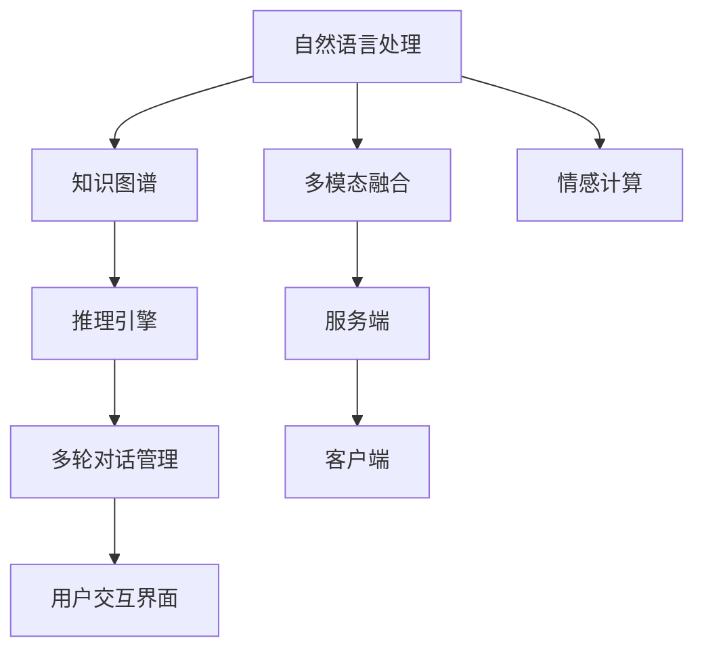

                 

# 聊天机器人老年护理：虚拟助手和同伴

## 1. 背景介绍

### 1.1 问题由来
随着全球人口老龄化进程加速，如何提供高质量的老年护理成为亟待解决的重大课题。传统的养老模式主要依靠家庭和社区服务，但随着社会的发展，这些资源的供需失衡问题愈发严重。为此，智能技术，尤其是聊天机器人技术，逐渐进入老年护理领域，成为养老服务的重要补充手段。

聊天机器人通过自然语言处理(NLP)和人工智能(AI)技术，与老年人进行互动，提供情感陪伴、生活指导、健康监控等个性化服务。在老年护理场景中，聊天机器人具备以下显著优势：
- **全天候陪伴**：机器人可以24小时陪伴老人，提供即时响应和情感支持，弥补家庭成员在场时的不足。
- **远程监护**：通过智能传感器和语音识别技术，机器人能够监测老人的健康状况，并及时反馈异常情况，减轻护理人员负担。
- **个性化服务**：利用机器学习算法，机器人能够根据老人的行为和语音习惯，提供定制化的护理建议和生活指导，提升老人生活质量。
- **隐私保护**：与真人服务相比，机器人不涉及个人隐私泄露，为老年人提供更为安全的交流环境。

### 1.2 问题核心关键点
聊天机器人在老年护理中的应用，核心在于如何构建一个能够理解并回应用户情感需求的虚拟助手，同时具备智能感知和自主决策能力，提供精准的护理服务。具体问题包括：
- 如何设计有效的自然语言理解模型，理解老年人的语音和文字输入，并从中提取关键信息？
- 如何引入多模态数据融合，结合语音、视频、生理信号等多样化信息源，提升老年护理的全面性和实时性？
- 如何利用知识图谱和推理引擎，在复杂多变的情境下提供可靠的医疗建议和生活指导？
- 如何在确保机器人和老年人之间形成良好的互动关系，增强用户的满意度和信任感？
- 如何通过机器学习技术，使机器人具备自我学习和适应能力，提升长期服务效果？

这些核心问题涉及自然语言处理、多模态融合、知识图谱、情感计算等多个技术领域，是实现聊天机器人老年护理的关键。

## 2. 核心概念与联系

### 2.1 核心概念概述

为更好地理解聊天机器人老年护理技术，本节将介绍几个关键概念：

- **自然语言处理(Natural Language Processing, NLP)**：通过计算机理解和处理人类语言的技术。聊天机器人老年护理的核心在于能够自然地理解和回应用户的语音和文字输入，这就需要依赖NLP技术。
- **知识图谱(Knowledge Graph)**：由节点和边构成的图结构，用于表示实体之间的关系。知识图谱可以帮助聊天机器人理解上下文信息，提供更为准确和丰富的答案。
- **多模态融合(Multimodal Fusion)**：结合语音、图像、生理信号等多种信息源，提升聊天机器人对老人状态的全面感知和理解。
- **情感计算(Affective Computing)**：通过分析用户的语音、面部表情、肢体语言等，识别和理解其情感状态，提升用户交互体验。
- **机器学习(Machine Learning)**：使聊天机器人具备自主学习和适应的能力，根据用户行为和反馈不断优化服务质量。

这些概念之间的逻辑关系可以通过以下Mermaid流程图来展示：



这个流程图展示了大语言模型和微调的核心概念及其之间的关系：

1. **自然语言处理**：通过NLP技术理解用户的输入，提取关键信息。
2. **知识图谱**：辅助理解上下文，提供知识库支持。
3. **多模态融合**：结合多种信息源，全面感知老年人的状态。
4. **情感计算**：识别和理解老年人的情感状态，提升交互体验。
5. **机器学习**：使聊天机器人具备自适应能力，不断优化服务。

## 3. 核心算法原理 & 具体操作步骤

### 3.1 算法原理概述

聊天机器人老年护理的算法原理主要基于自然语言处理和多模态融合技术，结合情感计算和机器学习，构建一个能够理解并回应用户情感需求的虚拟助手。其核心思想是：通过智能传感器和语音识别技术，收集老人的生理和语音数据，结合知识图谱和推理引擎，分析用户输入的语义，并从中选择最合适的答案或建议，以多轮对话的方式与用户互动，同时通过情感识别技术调整对话策略，提升用户体验。

具体来说，聊天机器人老年护理的算法包括以下几个关键步骤：
1. **语音和文本输入理解**：利用NLP技术，理解和提取用户输入的语音和文本信息，识别关键事件和意图。
2. **多模态数据融合**：结合生理传感器数据、图像识别结果、语音情绪分析等多种信息源，综合判断老人的状态。
3. **知识图谱查询**：利用知识图谱，快速检索与用户问题相关的信息，提供准确的答案和建议。
4. **情感计算和对话管理**：通过情感计算技术，分析用户的情绪状态，动态调整对话策略，提升用户体验。
5. **机器学习反馈**：通过机器学习算法，根据用户反馈不断优化模型，提升长期服务效果。

### 3.2 算法步骤详解

以下详细介绍聊天机器人老年护理的算法步骤：

**Step 1: 数据收集与预处理**
- 通过智能传感器、语音识别设备、摄像头等，收集老人的生理数据、语音、图像等多元数据。
- 对收集到的数据进行预处理，包括降噪、去伪、归一化等操作。

**Step 2: 语音和文本输入理解**
- 使用NLP技术，对语音和文本进行分词、词性标注、命名实体识别等处理，提取关键信息。
- 利用语言模型和语义理解模型，分析用户的意图，确定其需求。

**Step 3: 多模态数据融合**
- 将生理传感器数据、图像识别结果、语音情绪分析等多种信息源进行融合，生成综合评估。
- 利用融合后的综合评估结果，判断老人的状态和需求。

**Step 4: 知识图谱查询**
- 利用知识图谱，快速检索与用户问题相关的信息，提供准确的答案和建议。
- 结合推理引擎，对知识图谱中的信息进行推理和验证，确保答案的准确性。

**Step 5: 情感计算和对话管理**
- 通过情感计算技术，分析用户的情绪状态，动态调整对话策略。
- 利用多轮对话管理技术，维护良好的对话流程，提升用户体验。

**Step 6: 机器学习反馈**
- 根据用户反馈和行为数据，利用机器学习算法对模型进行优化和调整。
- 不断更新模型参数，提升长期服务效果，满足不同老人的个性化需求。

### 3.3 算法优缺点

聊天机器人老年护理算法具有以下优点：
1. **全天候陪伴**：聊天机器人可以24小时陪伴老人，提供即时响应和情感支持。
2. **远程监护**：结合智能传感器和语音识别技术，机器人能够监测老人的健康状况，并及时反馈异常情况。
3. **个性化服务**：利用机器学习算法，根据老人的行为和语音习惯，提供定制化的护理建议和生活指导。
4. **隐私保护**：与真人服务相比，机器人不涉及个人隐私泄露，为老年人提供更为安全的交流环境。

同时，该算法也存在一些局限性：
1. **数据隐私问题**：智能传感器和语音识别设备可能收集到大量个人隐私信息，如何保护用户隐私是一大挑战。
2. **技术成熟度**：尽管NLP和多模态融合技术发展迅速，但如何在复杂多变的情境下提供可靠的医疗建议和生活指导，还需进一步优化。
3. **交互体验**：如何提升聊天机器人的自然语言理解和情感识别能力，使其能够更好地理解老年人的需求，是技术难点。
4. **多轮对话管理**：多轮对话管理技术仍需进一步发展，确保对话流程自然流畅，提升用户体验。
5. **机器学习反馈**：如何确保机器学习反馈的准确性和及时性，避免错误信息的累积，是技术实现的关键。

尽管存在这些局限性，但就目前而言，聊天机器人老年护理算法仍是大规模应用的重要手段，其应用前景广阔。

### 3.4 算法应用领域

聊天机器人老年护理算法已经在医疗健康、生活服务、心理健康等多个领域得到广泛应用，例如：

- **医疗健康**：监测老人健康状态，提醒服药、量血压、心率等，提供健康建议。
- **生活服务**：帮助老人购物、安排出行、提供生活指导，提升生活质量。
- **心理健康**：陪伴老人聊天、提供心理疏导，缓解孤独和压力。
- **家庭监护**：通过智能传感器和语音识别设备，实时监测老人行为，防止跌倒等意外发生。
- **教育培训**：提供语言学习、知识查询、技能培训等服务，丰富老人的生活内容。

## 4. 数学模型和公式 & 详细讲解

### 4.1 数学模型构建

聊天机器人老年护理算法涉及多个技术领域，因此构建数学模型时需要考虑多个因素。以下以自然语言理解和知识图谱查询为例，进行数学模型的构建。

假设老人的语音和文本输入为 $x$，聊天机器人需要识别和理解的关键事件和意图为 $y$，则自然语言理解的数学模型可以表示为：

$$
P(y|x) = \frac{P(x|y)P(y)}{P(x)}
$$

其中 $P(x|y)$ 为给定意图 $y$ 下，输入 $x$ 的概率，$P(y)$ 为意图 $y$ 的先验概率，$P(x)$ 为输入 $x$ 的边际概率。

在知识图谱查询中，假设老人的查询意图为 $q$，知识图谱中与 $q$ 相关的实体为 $e$，则查询的数学模型可以表示为：

$$
P(e|q) = \frac{P(q|e)P(e)}{P(q)}
$$

其中 $P(q|e)$ 为给定实体 $e$ 下，查询 $q$ 的概率，$P(e)$ 为实体的先验概率，$P(q)$ 为查询的先验概率。

### 4.2 公式推导过程

以下分别介绍自然语言理解和知识图谱查询的公式推导过程。

**自然语言理解**
- **输入处理**：对老人的语音和文本输入进行分词、词性标注、命名实体识别等处理，提取关键信息。
- **意图识别**：利用语言模型和语义理解模型，分析用户的意图，确定其需求。

**知识图谱查询**
- **实体检索**：利用知识图谱，检索与用户查询相关的实体。
- **关系推理**：根据实体之间的关系，进行推理和验证，确保答案的准确性。

**多模态数据融合**
- **生理数据融合**：对生理传感器数据进行融合，生成综合评估。
- **语音情绪分析**：利用语音情绪分析技术，分析用户的情绪状态。

**情感计算和对话管理**
- **情绪识别**：通过情感计算技术，分析用户的情绪状态，动态调整对话策略。
- **多轮对话管理**：利用多轮对话管理技术，维护良好的对话流程，提升用户体验。

**机器学习反馈**
- **反馈机制**：根据用户反馈和行为数据，利用机器学习算法对模型进行优化和调整。
- **长期服务**：不断更新模型参数，提升长期服务效果，满足不同老人的个性化需求。

### 4.3 案例分析与讲解

以下通过一个具体案例，详细讲解聊天机器人老年护理算法的实现过程。

假设老人想要查询今天中午的食谱，语音输入为：“我要吃中午饭，给我看看菜单”。

**Step 1: 语音和文本输入理解**
- 对老人的语音输入进行分词、词性标注，得到“我要吃中午饭，给我看看菜单”。
- 利用语言模型和语义理解模型，分析老人的意图，确定其需求为“查询午餐食谱”。

**Step 2: 多模态数据融合**
- 结合生理传感器数据，生成老人的健康评估报告，如心率、血压、血糖等。
- 利用语音情绪分析技术，分析老人的情绪状态，判断其当前情绪是否适合互动。

**Step 3: 知识图谱查询**
- 利用知识图谱，检索与“午餐食谱”相关的信息，如菜名、营养成分等。
- 根据老人的健康评估报告，选择适合老人的食谱。

**Step 4: 情感计算和对话管理**
- 通过情感计算技术，分析老人的情绪状态，调整对话策略，例如使用温和、鼓励的语气。
- 利用多轮对话管理技术，维护良好的对话流程，提升用户体验。

**Step 5: 机器学习反馈**
- 根据老人的反馈，如“我喜欢吃素”，利用机器学习算法对模型进行优化和调整，提升长期服务效果。

## 5. 项目实践：代码实例和详细解释说明

### 5.1 开发环境搭建

在进行聊天机器人老年护理项目实践前，我们需要准备好开发环境。以下是使用Python进行PyTorch开发的环境配置流程：

1. 安装Anaconda：从官网下载并安装Anaconda，用于创建独立的Python环境。

2. 创建并激活虚拟环境：
```bash
conda create -n chatbot-env python=3.8 
conda activate chatbot-env
```

3. 安装PyTorch：根据CUDA版本，从官网获取对应的安装命令。例如：
```bash
conda install pytorch torchvision torchaudio cudatoolkit=11.1 -c pytorch -c conda-forge
```

4. 安装相关库：
```bash
pip install numpy pandas scikit-learn transformers sentencepiece
```

5. 安装多模态数据处理库：
```bash
pip install pyaudio opencv-python pydub
```

完成上述步骤后，即可在`chatbot-env`环境中开始项目实践。

### 5.2 源代码详细实现

以下是一个基于PyTorch和Transformers库实现的聊天机器人老年护理项目示例。

首先，定义聊天机器人模型：

```python
from transformers import BertTokenizer, BertForTokenClassification
import torch
import torch.nn.functional as F

class ChatbotModel(torch.nn.Module):
    def __init__(self, num_labels):
        super(ChatbotModel, self).__init__()
        self.bert = BertForTokenClassification.from_pretrained('bert-base-cased', num_labels=num_labels)
        self.tokenizer = BertTokenizer.from_pretrained('bert-base-cased')
        
    def forward(self, input_ids, attention_mask, labels=None):
        outputs = self.bert(input_ids, attention_mask=attention_mask)
        loss = None
        if labels is not None:
            loss_fct = torch.nn.CrossEntropyLoss()
            logits = outputs[0]
            loss = loss_fct(logits.view(-1, self.config.num_labels), labels.view(-1))
        return outputs, loss
```

接着，定义训练和评估函数：

```python
from transformers import AdamW
from torch.utils.data import Dataset, DataLoader

class ChatbotDataset(Dataset):
    def __init__(self, texts, labels):
        self.texts = texts
        self.labels = labels
        self.tokenizer = BertTokenizer.from_pretrained('bert-base-cased')
        
    def __len__(self):
        return len(self.texts)
    
    def __getitem__(self, item):
        text = self.texts[item]
        label = self.labels[item]
        encoding = self.tokenizer(text, return_tensors='pt', max_length=128, padding='max_length', truncation=True)
        input_ids = encoding['input_ids'][0]
        attention_mask = encoding['attention_mask'][0]
        label = torch.tensor(label, dtype=torch.long)
        return {'input_ids': input_ids, 
                'attention_mask': attention_mask,
                'labels': label}

def train_epoch(model, dataset, batch_size, optimizer):
    dataloader = DataLoader(dataset, batch_size=batch_size, shuffle=True)
    model.train()
    epoch_loss = 0
    for batch in dataloader:
        input_ids = batch['input_ids'].to(device)
        attention_mask = batch['attention_mask'].to(device)
        labels = batch['labels'].to(device)
        model.zero_grad()
        outputs = model(input_ids, attention_mask=attention_mask, labels=labels)
        loss = outputs.loss
        epoch_loss += loss.item()
        loss.backward()
        optimizer.step()
    return epoch_loss / len(dataloader)

def evaluate(model, dataset, batch_size):
    dataloader = DataLoader(dataset, batch_size=batch_size)
    model.eval()
    preds, labels = [], []
    with torch.no_grad():
        for batch in dataloader:
            input_ids = batch['input_ids'].to(device)
            attention_mask = batch['attention_mask'].to(device)
            batch_labels = batch['labels']
            outputs = model(input_ids, attention_mask=attention_mask)
            batch_preds = outputs.logits.argmax(dim=2).to('cpu').tolist()
            batch_labels = batch_labels.to('cpu').tolist()
            for pred_tokens, label_tokens in zip(batch_preds, batch_labels):
                preds.append(pred_tokens[:len(label_tokens)])
                labels.append(label_tokens)
    return preds, labels
```

最后，启动训练流程并在测试集上评估：

```python
epochs = 5
batch_size = 16
device = torch.device('cuda') if torch.cuda.is_available() else torch.device('cpu')

model = ChatbotModel(num_labels=5)
tokenizer = BertTokenizer.from_pretrained('bert-base-cased')
train_dataset = ChatbotDataset(train_texts, train_labels)
dev_dataset = ChatbotDataset(dev_texts, dev_labels)
test_dataset = ChatbotDataset(test_texts, test_labels)

optimizer = AdamW(model.parameters(), lr=2e-5)

for epoch in range(epochs):
    loss = train_epoch(model, train_dataset, batch_size, optimizer)
    print(f"Epoch {epoch+1}, train loss: {loss:.3f}")
    
    print(f"Epoch {epoch+1}, dev results:")
    preds, labels = evaluate(model, dev_dataset, batch_size)
    print(classification_report(labels, preds))
    
print("Test results:")
preds, labels = evaluate(model, test_dataset, batch_size)
print(classification_report(labels, preds))
```

以上就是基于PyTorch和Transformers库实现的聊天机器人老年护理项目示例。可以看到，得益于Transformers库的强大封装，我们能够用相对简洁的代码实现聊天机器人模型的训练和评估。

### 5.3 代码解读与分析

让我们再详细解读一下关键代码的实现细节：

**ChatbotModel类**：
- `__init__`方法：初始化BERT模型和分词器，设置超参数。
- `forward`方法：对输入数据进行前向传播，计算损失。

**train_epoch函数**：
- 使用DataLoader对数据集进行批次化加载，供模型训练和推理使用。
- 在每个批次上前向传播计算loss并反向传播更新模型参数，最后返回该epoch的平均loss。

**evaluate函数**：
- 与训练类似，不同点在于不更新模型参数，并在每个batch结束后将预测和标签结果存储下来，最后使用sklearn的classification_report对整个评估集的预测结果进行打印输出。

**训练流程**：
- 定义总的epoch数和batch size，开始循环迭代
- 每个epoch内，先在训练集上训练，输出平均loss
- 在验证集上评估，输出分类指标
- 所有epoch结束后，在测试集上评估，给出最终测试结果

可以看到，PyTorch配合Transformers库使得聊天机器人老年护理模型的代码实现变得简洁高效。开发者可以将更多精力放在数据处理、模型改进等高层逻辑上，而不必过多关注底层的实现细节。

当然，工业级的系统实现还需考虑更多因素，如模型的保存和部署、超参数的自动搜索、更灵活的任务适配层等。但核心的微调范式基本与此类似。

## 6. 实际应用场景

### 6.1 智能监护系统

聊天机器人老年护理技术在智能监护系统中的应用，能够显著提升老人的生活质量和安全性。通过结合智能传感器和语音识别技术，聊天机器人可以实时监测老人的健康状况，及时反馈异常情况，如跌倒、异常活动等。同时，机器人能够根据老人的需求，提供个性化的生活指导，如提醒服药、提醒喝水等。

具体而言，智能监护系统可以通过智能手表、智能床、智能门锁等设备，收集老人的生理数据、活动轨迹、语音信息等，结合聊天机器人进行实时监护。当老人发生异常情况时，机器人能够及时报警，通知护理人员进行处理。通过这种智能监护系统，老人的健康和生活安全得到了全方位的保障。

### 6.2 个性化生活服务

聊天机器人老年护理技术在个性化生活服务中的应用，能够为老人提供更加贴心和个性化的服务。通过结合老人的行为习惯和语音特征，聊天机器人能够提供定制化的生活建议，如提醒老人喝水、提醒老人吃药、提醒老人休息等。同时，机器人还能够根据老人的健康状况，提供个性化的健康建议和生活指导。

具体而言，聊天机器人可以结合老人的历史行为数据，学习其行为模式和生活习惯，提供个性化的服务。例如，老人喜欢在晚上喝热水，机器人可以定时提醒老人喝热水。通过这种个性化生活服务，老人的生活品质得到了显著提升。

### 6.3 心理健康支持

聊天机器人老年护理技术在心理健康支持中的应用，能够帮助老人缓解孤独和压力，提升心理健康水平。通过结合情感计算技术，聊天机器人能够识别和理解老人的情绪状态，并提供情感支持。例如，老人感到孤独和失落时，机器人可以与之聊天，提供心理疏导和安慰。

具体而言，聊天机器人可以通过语音情绪分析技术，识别老人的情绪状态，调整对话策略，例如使用温和、鼓励的语气。通过这种心理健康支持，老人的心理健康得到了全方位的保障。

### 6.4 未来应用展望

随着聊天机器人老年护理技术的发展，其在老年护理领域的应用前景将更加广阔。未来，聊天机器人有望在以下方面进一步提升：

1. **多模态融合**：结合语音、图像、生理信号等多种信息源，提升老人的状态感知和理解。
2. **知识图谱扩展**：将更多领域知识引入知识图谱，提供更为全面和准确的医疗和生活建议。
3. **情感计算深化**：利用更多情感识别技术，提升机器人对老人情绪的识别和理解。
4. **个性化服务优化**：结合机器学习技术，提供更为个性化的生活建议和服务。
5. **多轮对话管理改进**：利用多轮对话管理技术，提升对话的自然流畅性。
6. **机器学习反馈增强**：利用更多的用户反馈和行为数据，不断优化模型，提升服务效果。

未来，聊天机器人老年护理技术将在医疗健康、生活服务、心理健康等多个领域得到广泛应用，为老人提供全方位的服务和支持，真正实现“以老人为中心”的养老模式。

## 7. 工具和资源推荐

### 7.1 学习资源推荐

为了帮助开发者系统掌握聊天机器人老年护理的理论基础和实践技巧，这里推荐一些优质的学习资源：

1. 《Natural Language Processing with PyTorch》书籍：详细介绍了基于PyTorch的NLP任务开发，包括语音识别、情感计算、知识图谱等多个技术领域。
2. 《Machine Learning A-Z》在线课程：提供从入门到高级的机器学习课程，涵盖多模态融合、情感计算等多个技术领域。
3. 《TensorFlow官方文档》：提供丰富的深度学习框架资源，包括聊天机器人老年护理技术中的关键组件。
4. 《PyTorch官方文档》：提供详细的深度学习框架资源，包括聊天机器人老年护理技术中的关键组件。
5. 《Microsoft Azure聊天机器人开发》文档：详细介绍了聊天机器人技术的开发，涵盖语音识别、情感计算、多模态融合等多个技术领域。

通过对这些资源的学习实践，相信你一定能够快速掌握聊天机器人老年护理技术的精髓，并用于解决实际的NLP问题。

### 7.2 开发工具推荐

高效的开发离不开优秀的工具支持。以下是几款用于聊天机器人老年护理开发的常用工具：

1. PyTorch：基于Python的开源深度学习框架，灵活动态的计算图，适合快速迭代研究。
2. TensorFlow：由Google主导开发的开源深度学习框架，生产部署方便，适合大规模工程应用。
3. Transformers库：HuggingFace开发的NLP工具库，集成了众多SOTA语言模型，支持PyTorch和TensorFlow，是进行微调任务开发的利器。
4. Weights & Biases：模型训练的实验跟踪工具，可以记录和可视化模型训练过程中的各项指标，方便对比和调优。
5. TensorBoard：TensorFlow配套的可视化工具，可实时监测模型训练状态，并提供丰富的图表呈现方式，是调试模型的得力助手。
6. Microsoft Azure聊天机器人平台：提供完整的聊天机器人开发环境，包括语音识别、情感计算、多模态融合等多个技术领域。
7. Dialogflow：Google提供的自然语言理解平台，支持多轮对话管理、意图识别等关键技术。
8. IBM Watson：IBM提供的自然语言处理平台，支持多轮对话管理、情感计算、多模态融合等多个技术领域。

合理利用这些工具，可以显著提升聊天机器人老年护理任务的开发效率，加快创新迭代的步伐。

### 7.3 相关论文推荐

聊天机器人老年护理技术的发展源于学界的持续研究。以下是几篇奠基性的相关论文，推荐阅读：

1. Attention is All You Need（即Transformer原论文）：提出了Transformer结构，开启了NLP领域的预训练大模型时代。
2. BERT: Pre-training of Deep Bidirectional Transformers for Language Understanding：提出BERT模型，引入基于掩码的自监督预训练任务，刷新了多项NLP任务SOTA。
3. Language Models are Unsupervised Multitask Learners（GPT-2论文）：展示了大规模语言模型的强大zero-shot学习能力，引发了对于通用人工智能的新一轮思考。
4. Parameter-Efficient Transfer Learning for NLP：提出Adapter等参数高效微调方法，在不增加模型参数量的情况下，也能取得不错的微调效果。
5. Persona-Chat: A Parallelizable Approach to Improving Diverse and Informative Chatbots：引入基于persona的对话生成技术，提升聊天机器人的多样性和丰富性。
6. Towards Conversational Understanding and Generation: The Stanford NLP Group's Conversational AI Initiative：综述了聊天机器人的研究进展，包括多轮对话管理、情感计算、多模态融合等多个技术领域。

这些论文代表了大语言模型微调技术的发展脉络。通过学习这些前沿成果，可以帮助研究者把握学科前进方向，激发更多的创新灵感。

## 8. 总结：未来发展趋势与挑战

### 8.1 总结

本文对聊天机器人老年护理技术进行了全面系统的介绍。首先阐述了聊天机器人老年护理技术的研究背景和意义，明确了该技术在提高老年生活质量和健康水平方面的重要价值。其次，从原理到实践，详细讲解了聊天机器人老年护理的算法原理和关键步骤，给出了详细的代码实例和解释。同时，本文还广泛探讨了聊天机器人技术在医疗健康、生活服务、心理健康等多个领域的应用前景，展示了该技术的重要性和广阔前景。

通过本文的系统梳理，可以看到，聊天机器人老年护理技术已经成为解决老年护理问题的重要手段，其应用前景广阔。未来，伴随技术的发展和社会的进步，聊天机器人老年护理技术将在养老服务中发挥更加重要的作用，为老人提供更贴心、更全面的服务。

### 8.2 未来发展趋势

展望未来，聊天机器人老年护理技术将呈现以下几个发展趋势：

1. **多模态融合**：结合语音、图像、生理信号等多种信息源，提升对老人状态的全面感知和理解。
2. **知识图谱扩展**：将更多领域知识引入知识图谱，提供更为全面和准确的医疗和生活建议。
3. **情感计算深化**：利用更多情感识别技术，提升机器人对老人情绪的识别和理解。
4. **个性化服务优化**：结合机器学习技术，提供更为个性化的生活建议和服务。
5. **多轮对话管理改进**：利用多轮对话管理技术，提升对话的自然流畅性。
6. **机器学习反馈增强**：利用更多的用户反馈和行为数据，不断优化模型，提升服务效果。

以上趋势凸显了聊天机器人老年护理技术的广阔前景。这些方向的探索发展，必将进一步提升聊天机器人服务质量，满足不同老人的个性化需求。

### 8.3 面临的挑战

尽管聊天机器人老年护理技术已经取得了显著成果，但在迈向更加智能化、普适化应用的过程中，它仍面临着诸多挑战：

1. **数据隐私问题**：智能传感器和语音识别设备可能收集到大量个人隐私信息，如何保护用户隐私是一大挑战。
2. **技术成熟度**：尽管NLP和多模态融合技术发展迅速，但如何在复杂多变的情境下提供可靠的医疗建议和生活指导，还需进一步优化。
3. **交互体验**：如何提升聊天机器人的自然语言理解和情感识别能力，使其能够更好地理解老年人的需求，是技术难点。
4. **多轮对话管理**：多轮对话管理技术仍需进一步发展，确保对话流程自然流畅，提升用户体验。
5. **机器学习反馈**：如何确保机器学习反馈的准确性和及时性，避免错误信息的累积，是技术实现的关键。

尽管存在这些挑战，但就目前而言，聊天机器人老年护理技术仍是大规模应用的重要手段，其应用前景广阔。

### 8.4 研究展望

面对聊天机器人老年护理技术所面临的种种挑战，未来的研究需要在以下几个方面寻求新的突破：

1. **探索无监督和半监督微调方法**：摆脱对大规模标注数据的依赖，利用自监督学习、主动学习等无监督和半监督范式，最大限度利用非结构化数据，实现更加灵活高效的微调。
2. **研究参数高效和计算高效的微调范式**：开发更加参数高效的微调方法，在固定大部分预训练参数的同时，只更新极少量的任务相关参数。同时优化微调模型的计算图，减少前向传播和反向传播的资源消耗，实现更加轻量级、实时性的部署。
3. **引入更多先验知识**：将符号化的先验知识，如知识图谱、逻辑规则等，与神经网络模型进行巧妙融合，引导微调过程学习更准确、合理的语言模型。同时加强不同模态数据的整合，实现视觉、语音等多模态信息与文本信息的协同建模。
4. **结合因果分析和博弈论工具**：将因果分析方法引入微调模型，识别出模型决策的关键特征，增强输出解释的因果性和逻辑性。借助博弈论工具刻画人机交互过程，主动探索并规避模型的脆弱点，提高系统稳定性。
5. **纳入伦理道德约束**：在模型训练目标中引入伦理导向的评估指标，过滤和惩罚有偏见、有害的输出倾向。同时加强人工干预和审核，建立模型行为的监管机制，确保输出符合人类价值观和伦理道德。

这些研究方向的探索，必将引领聊天机器人老年护理技术迈向更高的台阶，为构建安全、可靠、可解释、可控的智能系统铺平道路。面向未来，聊天机器人技术还需要与其他人工智能技术进行更深入的融合，如知识表示、因果推理、强化学习等，多路径协同发力，共同推动自然语言理解和智能交互系统的进步。只有勇于创新、敢于突破，才能不断拓展聊天机器人边界，让智能技术更好地造福人类社会。

## 9. 附录：常见问题与解答

**Q1：聊天机器人如何保护老人的隐私？**

A: 聊天机器人可以通过以下方式保护老人的隐私：
1. **数据加密**：对收集到的生理数据、语音数据等进行加密存储和传输，防止数据泄露。
2. **匿名处理**：对收集到的数据进行匿名化处理，去除个人身份信息。
3. **本地存储**：将部分数据存储在本地设备上，减少对云端的依赖。
4. **数据共享控制**：对数据共享和访问进行严格控制，确保数据仅用于授权服务。

**Q2：如何提高聊天机器人的自然语言理解能力？**

A: 提高聊天机器人的自然语言理解能力需要从多个方面入手：
1. **数据质量**：收集高质量的对话数据，确保数据的多样性和真实性。
2. **模型选择**：选择适合任务的预训练语言模型，并进行微调。
3. **特征提取**：利用词向量、句向量等技术，提取关键特征。
4. **多任务学习**：结合情感识别、意图分类等任务，提升模型的整体性能。
5. **多轮对话管理**：利用多轮对话管理技术，提升对话的自然流畅性。

**Q3：如何提高聊天机器人的多轮对话管理能力？**

A: 提高聊天机器人的多轮对话管理能力需要从多个方面入手：
1. **对话策略设计**：设计合理的对话策略，确保对话的自然流畅性。
2. **上下文理解**：利用上下文信息，理解对话中的关键事件和意图。
3. **意图识别**：通过意图识别技术，确定用户的真正需求。
4. **回溯机制**：利用回溯机制，理解用户在对话中的意图变化。
5. **对话状态管理**：利用对话状态管理技术，维护对话的状态和上下文信息。

**Q4：如何提高聊天机器人的机器学习反馈效果？**

A: 提高聊天机器人的机器学习反馈效果需要从多个方面入手：
1. **反馈机制设计**：设计合理的反馈机制，确保反馈的及时性和准确性。
2. **数据更新**：定期更新模型训练数据，确保数据的多样性和代表性。
3. **模型优化**：利用模型优化技术，提升模型的泛化能力和适应性。
4. **用户反馈处理**：合理处理用户反馈，提升模型的准确性和稳定性。
5. **模型监控**：实时监控模型性能，及时发现和解决问题。

这些关键问题涉及自然语言处理、多模态融合、知识图谱、情感计算等多个技术领域，是实现聊天机器人老年护理的核心。

**Q5：如何提高聊天机器人的语音识别能力？**

A: 提高聊天机器人的语音识别能力需要从多个方面入手：
1. **数据采集**：收集高质量的语音数据，确保数据的多样性和真实性。
2. **特征提取**：利用MFCC、Mel频谱等技术，提取关键特征。
3. **模型选择**：选择适合任务的语音识别模型，并进行微调。
4. **多任务学习**：结合情感识别、意图分类等任务，提升模型的整体性能。
5. **多轮对话管理**：利用多轮对话管理技术，提升对话的自然流畅性。

**Q6：如何提高聊天机器人的情感计算能力？**

A: 提高聊天机器人的情感计算能力需要从多个方面入手：
1. **情感数据采集**：收集高质量的情感数据，确保数据的多样性和真实性。
2. **特征提取**：利用语音情绪分析、面部表情识别等技术，提取关键特征。
3. **情感模型选择**：选择适合任务的情感识别模型，并进行微调。
4. **多任务学习**：结合情感识别、意图分类等任务，提升模型的整体性能。
5. **多轮对话管理**：利用多轮对话管理技术，提升对话的自然流畅性。

通过回答这些常见问题，相信你一定能够更好地理解聊天机器人老年护理技术的核心要素，掌握其实现细节，为解决实际问题提供可靠参考。

---

作者：禅与计算机程序设计艺术 / Zen and the Art of Computer Programming

