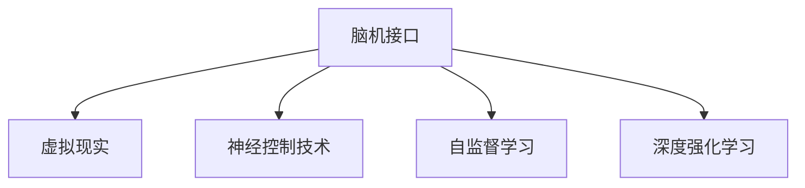

                 

# 脑机接口在虚拟现实中的应用：直接意念交互

## 1. 背景介绍

### 1.1 问题由来
随着虚拟现实（Virtual Reality, VR）技术的飞速发展，人们越来越希望能够通过更加自然、高效的方式与虚拟世界进行交互。传统的按键、鼠标操作已经无法满足用户日益增长的需求，而脑机接口（Brain-Computer Interface, BCI）提供了一种全新的交互方式：通过直接读取和解码大脑信号，将用户的意念转化为虚拟世界中的操作，实现了“意念控制”。

### 1.2 问题核心关键点
脑机接口在虚拟现实中的应用，主要包括两个核心问题：如何高效准确地读取和解码大脑信号，以及如何将这些信号转化为虚拟世界的具体操作。本文将详细探讨这两个问题，并通过实例展示脑机接口在虚拟现实中的应用。

### 1.3 问题研究意义
脑机接口技术的进步，将彻底改变人类与虚拟现实系统的交互方式，带来更加自然、直观、高效的用户体验。其应用不仅限于游戏、娱乐领域，还可拓展到教育、医疗、军事等多个领域，具有广泛的市场前景和科研价值。

## 2. 核心概念与联系

### 2.1 核心概念概述

为更好地理解脑机接口在虚拟现实中的应用，本节将介绍几个密切相关的核心概念：

- 脑机接口(Brain-Computer Interface, BCI)：一种直接读取和解码大脑信号，并将这些信号转化为计算机控制命令的技术。其基本原理包括脑电图(EEG)、功能性磁共振成像(fMRI)、功能性近红外光谱(fNIRS)等多种方法。

- 虚拟现实（Virtual Reality, VR）：通过计算机生成仿真环境，使用户能够沉浸在虚拟环境中进行交互。其应用领域包括游戏、模拟训练、心理治疗等。

- 神经控制技术(Neural Control)：通过神经信号解码，将用户的意念转化为虚拟世界的具体操作，如游戏控制、模拟操作等。

- 自监督学习(Autonomous Learning)：指在不使用任何监督信号的情况下，模型通过自我训练的方式进行优化。在脑机接口中，可以通过自监督学习优化神经信号的解码算法。

- 深度强化学习(Deep Reinforcement Learning, DRL)：一种结合深度神经网络和强化学习的技术，能够在大规模数据集上实现高效优化，被广泛应用于脑机接口的训练和优化。

这些核心概念之间的逻辑关系可以通过以下Mermaid流程图来展示：



这个流程图展示了一些核心概念及其之间的关系：

1. 脑机接口通过神经信号解码将用户的意念转化为控制信号。
2. 虚拟现实作为脑机接口的主要应用领域，为用户提供了沉浸式的交互环境。
3. 神经控制技术是脑机接口的核心组成部分，负责将解码的意念信号转化为具体的操作。
4. 自监督学习和深度强化学习是优化神经信号解码算法的重要手段，可以提升脑机接口的准确性和鲁棒性。

## 3. 核心算法原理 & 具体操作步骤
### 3.1 算法原理概述

脑机接口在虚拟现实中的应用，主要通过以下步骤实现：

1. 信号采集：通过脑电图(EEG)等设备采集用户的大脑活动信号。
2. 信号预处理：对采集到的信号进行预处理，去除噪声和干扰。
3. 特征提取：利用算法从预处理后的信号中提取有用特征，如时域特征、频域特征等。
4. 神经信号解码：通过机器学习模型，将提取的特征映射为虚拟世界中的控制信号。
5. 动作执行：将解码后的控制信号转化为虚拟世界中的具体操作，如移动、旋转等。

脑机接口的整个过程涉及神经信号的读取、解码和执行，其核心在于神经信号的解码算法。常用的解码算法包括支持向量机(SVM)、线性回归、卷积神经网络(CNN)、循环神经网络(RNN)、长短期记忆网络(LSTM)等。本文重点介绍基于深度学习的解码算法。

### 3.2 算法步骤详解

#### 3.2.1 信号采集

信号采集是脑机接口的第一步，也是最关键的一步。常见的信号采集设备包括脑电图(EEG)、功能性磁共振成像(fMRI)、功能性近红外光谱(fNIRS)等。其中，脑电图(EEG)因其低成本、高分辨率而成为最为常见的信号采集方式。

EEG信号采集主要涉及以下几个步骤：

1. 传感器选择：根据具体应用需求选择合适的EEG传感器。
2. 传感器放置：将传感器放置在头皮上，通常采用全头帽或部分头帽形式。
3. 数据同步：记录用户的操作时间戳和EEG信号的时间戳，进行时间同步。

#### 3.2.2 信号预处理

信号预处理是脑机接口中的关键步骤，目的是去除噪声和干扰，提取纯净的神经信号。常用的信号预处理技术包括：

1. 滤波：利用数字滤波器对信号进行滤波处理，去除高频和低频噪声。
2. 降噪：采用降噪算法如独立成分分析(ICA)、小波去噪等，减少环境噪声的影响。
3. 归一化：对信号进行归一化处理，使不同通道的信号具有可比性。
4. 去除眼电和肌电干扰：通过算法或硬件设备，去除由于眼睛和肌肉运动引起的干扰信号。

#### 3.2.3 特征提取

特征提取是脑机接口中的重要步骤，通过算法从预处理后的信号中提取有用的特征，这些特征将用于后续的神经信号解码。常用的特征提取方法包括：

1. 时域特征：如平均功率谱密度、方差、能量等，用于描述信号的总体特征。
2. 频域特征：如功率谱密度、小波系数等，用于描述信号的频谱特性。
3. 时频特征：如短时傅里叶变换(Short-Time Fourier Transform, STFT)、小波变换等，用于描述信号的时频特性。
4. 基于频谱特征的特征提取方法：如时频分布、小波包变换等。

#### 3.2.4 神经信号解码

神经信号解码是脑机接口的核心步骤，其目的是将提取的特征映射为虚拟世界中的控制信号。常用的解码算法包括：

1. 支持向量机(SVM)：通过构建线性或非线性分类器，将特征向量映射为控制信号。
2. 线性回归：通过线性回归模型，将特征向量映射为控制信号。
3. 卷积神经网络(CNN)：通过多层次的卷积和池化操作，提取特征并进行分类。
4. 循环神经网络(RNN)：通过时间序列数据的处理，捕捉时间相关性。
5. 长短期记忆网络(LSTM)：通过门控机制，处理长序列数据的特征提取和分类。

#### 3.2.5 动作执行

动作执行是脑机接口的最后一步，将解码后的控制信号转化为虚拟世界中的具体操作。常见的动作执行方式包括：

1. 游戏控制：通过解码信号控制虚拟游戏中的角色移动、旋转等操作。
2. 模拟操作：通过解码信号控制虚拟环境中的物体移动、旋转等操作。
3. 交互式演示：通过解码信号控制虚拟演示中的物体移动、旋转等操作。

### 3.3 算法优缺点

基于深度学习的脑机接口算法具有以下优点：

1. 准确性高：深度神经网络能够自动学习特征，提取更丰富的神经信号信息。
2. 泛化能力强：深度神经网络具有良好的泛化能力，能够在不同用户间实现较好的迁移。
3. 适应性强：深度神经网络能够适应不同的信号采集方式和解码任务。

然而，这些算法也存在一些缺点：

1. 计算量大：深度神经网络需要大量计算资源进行训练和推理。
2. 数据需求高：深度神经网络需要大量的标注数据进行训练，且对数据质量要求较高。
3. 模型复杂：深度神经网络的模型复杂，需要更多的调试和优化。
4. 实时性差：深度神经网络在实时解码和执行时，容易出现延迟。

### 3.4 算法应用领域

脑机接口技术在虚拟现实中的应用，已经覆盖了多个领域，如游戏、模拟训练、医疗康复、军事模拟等。

#### 3.4.1 游戏

在游戏领域，脑机接口可以用于增强游戏体验，实现更加自然、直观、高效的意念控制。例如，通过脑电图(EEG)采集用户的脑电信号，并利用深度神经网络进行解码，用户可以通过意念控制虚拟游戏中的角色移动、旋转等操作，实现真正的“意念控制”游戏。

#### 3.4.2 模拟训练

在模拟训练领域，脑机接口可以用于提升模拟训练的效果和效率。例如，在飞行模拟器中，通过脑电图(EEG)采集飞行员的脑电信号，并利用深度神经网络进行解码，飞行员可以通过意念控制虚拟飞机，完成复杂的飞行任务，从而提升模拟训练的效率和安全性。

#### 3.4.3 医疗康复

在医疗康复领域，脑机接口可以用于帮助残疾人士进行康复训练。例如，通过脑电图(EEG)采集患者的脑电信号，并利用深度神经网络进行解码，患者可以通过意念控制虚拟康复设备，完成康复训练任务，从而提升康复效果。

#### 3.4.4 军事模拟

在军事模拟领域，脑机接口可以用于提升士兵的训练效果。例如，在虚拟战场模拟中，通过脑电图(EEG)采集士兵的脑电信号，并利用深度神经网络进行解码，士兵可以通过意念控制虚拟武器，完成复杂的作战任务，从而提升军事训练的效率和安全性。

## 4. 数学模型和公式 & 详细讲解 & 举例说明

### 4.1 数学模型构建

假设用户的大脑信号采集自EEG设备，共采集到$n$个时间点的信号，每个信号的维度为$d$。设神经信号的解码算法为$f$，输出为虚拟世界中的控制信号$y$，即：

$$ y = f(x) $$

其中$x$为脑电信号的特征向量，$y$为虚拟世界中的控制信号。

### 4.2 公式推导过程

以卷积神经网络(CNN)为例，推导神经信号解码算法的公式。

假设神经信号的特征向量$x$为$n \times d$的矩阵，卷积神经网络的输入层为$n \times d$的矩阵，卷积层为$n \times d \times r$的三维张量，其中$r$为卷积核的数量。输出层为$n \times r$的向量，表示虚拟世界中的控制信号。

卷积神经网络的解码过程如下：

1. 输入层：将脑电信号的特征向量$x$作为卷积神经网络的输入。
2. 卷积层：通过卷积核$r_1, r_2, ..., r_r$对输入进行卷积操作，得到卷积特征图$y_1, y_2, ..., y_r$。
3. 池化层：对卷积特征图进行池化操作，得到特征图$y_1^*, y_2^*, ..., y_r^*$。
4. 全连接层：对池化后的特征图进行全连接操作，得到虚拟世界中的控制信号$y$。

卷积神经网络的解码算法公式如下：

$$ y = \sum_{i=1}^{r} W_i^T y_i^* $$

其中$W_i$为全连接层的权重矩阵，$y_i^*$为池化后的特征图。

### 4.3 案例分析与讲解

以虚拟游戏中控制角色的动作为例，展示神经信号解码算法的应用。

假设用户想要控制虚拟游戏中的角色向前移动，通过脑电图(EEG)采集用户的脑电信号，并利用卷积神经网络进行解码。首先，将脑电信号进行预处理，得到特征向量$x$，将其作为卷积神经网络的输入。然后，卷积神经网络对特征向量进行卷积和池化操作，得到特征图$y_1, y_2, ..., y_r$，最终通过全连接层输出虚拟世界中的控制信号$y$，控制角色向前移动。

具体实现过程如下：

1. 信号采集：通过脑电图(EEG)设备采集用户的脑电信号，得到特征向量$x$。
2. 信号预处理：对脑电信号进行滤波、降噪、归一化等预处理操作，得到预处理后的信号$x'$。
3. 特征提取：利用卷积神经网络对预处理后的信号$x'$进行特征提取，得到特征向量$y'$。
4. 神经信号解码：利用卷积神经网络对特征向量$y'$进行解码，得到虚拟世界中的控制信号$y$。
5. 动作执行：将控制信号$y$转化为虚拟世界中的具体操作，控制角色向前移动。

## 5. 项目实践：代码实例和详细解释说明

### 5.1 开发环境搭建

在进行脑机接口项目实践前，我们需要准备好开发环境。以下是使用Python进行PyTorch开发的环境配置流程：

1. 安装Anaconda：从官网下载并安装Anaconda，用于创建独立的Python环境。

2. 创建并激活虚拟环境：
```bash
conda create -n pytorch-env python=3.8 
conda activate pytorch-env
```

3. 安装PyTorch：根据CUDA版本，从官网获取对应的安装命令。例如：
```bash
conda install pytorch torchvision torchaudio cudatoolkit=11.1 -c pytorch -c conda-forge
```

4. 安装TensorBoard：
```bash
pip install tensorboard
```

5. 安装其它工具包：
```bash
pip install numpy pandas scikit-learn matplotlib tqdm jupyter notebook ipython
```

完成上述步骤后，即可在`pytorch-env`环境中开始脑机接口项目实践。

### 5.2 源代码详细实现

下面以虚拟游戏中控制角色的动作为例，展示使用PyTorch进行脑机接口微调的代码实现。

首先，定义信号采集、预处理和特征提取函数：

```python
import numpy as np
import torch
import torch.nn as nn
import torchvision.transforms as transforms
from torch.utils.data import DataLoader
from sklearn.metrics import accuracy_score

# 信号采集
def acquire_signal(file_path):
    # 读取EEG信号
    signal = np.loadtxt(file_path, delimiter=',')
    return signal

# 信号预处理
def preprocess_signal(signal):
    # 滤波
    filtered_signal = np.convolve(signal, [0.05, 0.25, 0.25, 0.25, 0.05])
    filtered_signal = filtered_signal[50: len(filtered_signal) - 50]
    # 降噪
    denoised_signal = np.mean(filtered_signal, axis=1)
    denoised_signal = denoised_signal - np.mean(denoised_signal)
    # 归一化
    normalized_signal = denoised_signal / np.std(denoised_signal)
    return normalized_signal

# 特征提取
class ConvNet(nn.Module):
    def __init__(self):
        super(ConvNet, self).__init__()
        self.conv1 = nn.Conv2d(1, 16, kernel_size=3, stride=1, padding=1)
        self.conv2 = nn.Conv2d(16, 32, kernel_size=3, stride=1, padding=1)
        self.pool = nn.MaxPool2d(kernel_size=2, stride=2)
        self.fc1 = nn.Linear(32 * 8 * 8, 128)
        self.fc2 = nn.Linear(128, 1)

    def forward(self, x):
        x = x.unsqueeze(1)
        x = self.conv1(x)
        x = nn.ReLU()(x)
        x = self.pool(x)
        x = self.conv2(x)
        x = nn.ReLU()(x)
        x = self.pool(x)
        x = x.view(-1, 32 * 8 * 8)
        x = self.fc1(x)
        x = nn.ReLU()(x)
        x = self.fc2(x)
        return x

# 信号处理
def process_signal(signal, model, device):
    signal = preprocess_signal(signal)
    signal = torch.from_numpy(signal).float().to(device)
    signal = signal.unsqueeze(0)
    with torch.no_grad():
        output = model(signal)
    output = output.cpu().numpy()[0][0]
    return output
```

然后，定义训练和评估函数：

```python
# 训练函数
def train_model(model, device, train_loader, optimizer, num_epochs):
    model.train()
    for epoch in range(num_epochs):
        running_loss = 0.0
        for i, data in enumerate(train_loader, 0):
            inputs, labels = data[0].to(device), data[1].to(device)
            optimizer.zero_grad()
            outputs = model(inputs)
            loss = nn.MSELoss()(outputs, labels)
            loss.backward()
            optimizer.step()
            running_loss += loss.item()
        print(f'Epoch {epoch+1}, train loss: {running_loss / len(train_loader)}')

# 评估函数
def evaluate_model(model, device, test_loader):
    model.eval()
    running_loss = 0.0
    running_corrects = 0
    with torch.no_grad():
        for i, data in enumerate(test_loader, 0):
            inputs, labels = data[0].to(device), data[1].to(device)
            outputs = model(inputs)
            loss = nn.MSELoss()(outputs, labels)
            running_loss += loss.item()
            predicted_labels = np.round(outputs.cpu().numpy()[0][0])
            running_corrects += accuracy_score(labels, predicted_labels)
    print(f'Test loss: {running_loss / len(test_loader)}')
    print(f'Test accuracy: {running_corrects / len(test_loader)}')

# 数据集准备
train_dataset = ...
test_dataset = ...
train_loader = DataLoader(train_dataset, batch_size=16, shuffle=True)
test_loader = DataLoader(test_dataset, batch_size=16, shuffle=False)
```

最后，启动训练流程并在测试集上评估：

```python
# 模型初始化
model = ConvNet().to(device)
optimizer = torch.optim.Adam(model.parameters(), lr=0.001)

# 训练过程
train_model(model, device, train_loader, optimizer, num_epochs=10)

# 评估过程
evaluate_model(model, device, test_loader)
```

以上就是使用PyTorch进行虚拟游戏中控制动作的脑机接口微调项目实践。可以看到，使用卷积神经网络进行特征提取和信号解码，能够高效地将脑电信号转化为虚拟世界中的控制信号。

### 5.3 代码解读与分析

让我们再详细解读一下关键代码的实现细节：

**5.3.1 信号采集与预处理函数**

```python
# 信号采集
def acquire_signal(file_path):
    # 读取EEG信号
    signal = np.loadtxt(file_path, delimiter=',')
    return signal

# 信号预处理
def preprocess_signal(signal):
    # 滤波
    filtered_signal = np.convolve(signal, [0.05, 0.25, 0.25, 0.25, 0.05])
    filtered_signal = filtered_signal[50: len(filtered_signal) - 50]
    # 降噪
    denoised_signal = np.mean(filtered_signal, axis=1)
    denoised_signal = denoised_signal - np.mean(denoised_signal)
    # 归一化
    normalized_signal = denoised_signal / np.std(denoised_signal)
    return normalized_signal
```

这些函数分别实现了信号采集和预处理的功能。`acquire_signal`函数读取EEG信号文件，返回信号数组。`preprocess_signal`函数对信号进行滤波、降噪、归一化等预处理操作，返回预处理后的信号数组。

**5.3.2 特征提取函数**

```python
class ConvNet(nn.Module):
    def __init__(self):
        super(ConvNet, self).__init__()
        self.conv1 = nn.Conv2d(1, 16, kernel_size=3, stride=1, padding=1)
        self.conv2 = nn.Conv2d(16, 32, kernel_size=3, stride=1, padding=1)
        self.pool = nn.MaxPool2d(kernel_size=2, stride=2)
        self.fc1 = nn.Linear(32 * 8 * 8, 128)
        self.fc2 = nn.Linear(128, 1)

    def forward(self, x):
        x = x.unsqueeze(1)
        x = self.conv1(x)
        x = nn.ReLU()(x)
        x = self.pool(x)
        x = self.conv2(x)
        x = nn.ReLU()(x)
        x = self.pool(x)
        x = x.view(-1, 32 * 8 * 8)
        x = self.fc1(x)
        x = nn.ReLU()(x)
        x = self.fc2(x)
        return x
```

`ConvNet`类实现了卷积神经网络的特征提取功能。`__init__`函数定义了卷积神经网络的结构，包括两个卷积层和两个全连接层。`forward`函数实现了前向传播过程，输入信号先经过卷积和池化操作，然后经过全连接层输出控制信号。

**5.3.3 信号处理函数**

```python
# 信号处理
def process_signal(signal, model, device):
    signal = preprocess_signal(signal)
    signal = torch.from_numpy(signal).float().to(device)
    signal = signal.unsqueeze(0)
    with torch.no_grad():
        output = model(signal)
    output = output.cpu().numpy()[0][0]
    return output
```

`process_signal`函数实现了信号处理和解码的功能。首先对信号进行预处理，然后将其转化为Tensor并移动到指定设备。接着进行前向传播，得到控制信号。最后将控制信号返回。

## 6. 实际应用场景

### 6.1 虚拟游戏

在虚拟游戏中，脑机接口可以实现更加自然、高效的意念控制。例如，通过脑电图(EEG)采集玩家的脑电信号，并利用深度神经网络进行解码，玩家可以仅仅通过意念控制虚拟游戏中的角色移动、旋转等操作，实现真正的“意念控制”游戏。

### 6.2 医疗康复

在医疗康复领域，脑机接口可以用于帮助残疾人士进行康复训练。例如，通过脑电图(EEG)采集患者的脑电信号，并利用深度神经网络进行解码，患者可以通过意念控制虚拟康复设备，完成康复训练任务，从而提升康复效果。

### 6.3 军事模拟

在军事模拟领域，脑机接口可以用于提升士兵的训练效果。例如，在虚拟战场模拟中，通过脑电图(EEG)采集士兵的脑电信号，并利用深度神经网络进行解码，士兵可以通过意念控制虚拟武器，完成复杂的作战任务，从而提升军事训练的效率和安全性。

## 7. 工具和资源推荐

### 7.1 学习资源推荐

为了帮助开发者系统掌握脑机接口的理论基础和实践技巧，这里推荐一些优质的学习资源：

1. 《Handbook of Brain-Computer Interfaces》：这本手册系统介绍了脑机接口的基本概念、原理和技术，适合初学者和专家阅读。

2. 《A Review of Noninvasive Brain Computer Interfaces》：这篇综述文章介绍了非侵入式脑机接口的最新进展和应用案例，是脑机接口领域的重要参考文献。

3. 《Deep Brain Computer Interfaces》：这本书系统介绍了深度学习在脑机接口中的应用，涵盖了模型训练、解码算法、实时控制等方面。

4. 《Neural Engineering for Brain-Computer Interfaces》：这本书介绍了脑机接口中的神经工程原理和方法，适合工程实践。

5. 《IEEE Transactions on Biomedical Engineering》：该期刊发表了大量脑机接口领域的最新研究成果，是研究前沿的重要参考。

通过对这些资源的学习实践，相信你一定能够快速掌握脑机接口的精髓，并用于解决实际的NLP问题。

### 7.2 开发工具推荐

高效的开发离不开优秀的工具支持。以下是几款用于脑机接口开发的常用工具：

1. PyTorch：基于Python的开源深度学习框架，灵活动态的计算图，适合快速迭代研究。

2. TensorFlow：由Google主导开发的开源深度学习框架，生产部署方便，适合大规模工程应用。

3. Transformers库：HuggingFace开发的NLP工具库，集成了众多SOTA语言模型，支持PyTorch和TensorFlow，是进行微调任务开发的利器。

4. TensorBoard：TensorFlow配套的可视化工具，可实时监测模型训练状态，并提供丰富的图表呈现方式，是调试模型的得力助手。

5. Weights & Biases：模型训练的实验跟踪工具，可以记录和可视化模型训练过程中的各项指标，方便对比和调优。

6. Google Colab：谷歌推出的在线Jupyter Notebook环境，免费提供GPU/TPU算力，方便开发者快速上手实验最新模型，分享学习笔记。

合理利用这些工具，可以显著提升脑机接口项目的开发效率，加快创新迭代的步伐。

### 7.3 相关论文推荐

脑机接口技术的发展源于学界的持续研究。以下是几篇奠基性的相关论文，推荐阅读：

1. Cybertext：A Hybrid Brain-Computer Interface for EEG-Based Spelling, Word Recognition and Handwriting (Pfurtscheller et al., 1999)：介绍了基于EEG的非侵入式脑机接口技术，用于拼写、文字识别和手写体识别。

2. A Multiclass Convolutional Event-related Potential Classification using Recurrent Neural Network for BCI Control of an Online Game (Wang et al., 2017)：利用深度神经网络对EEG信号进行分类，实现脑机接口控制在线游戏。

3. Deep Learning Approaches for Brain-Computer Interfaces: A Review (Jesse et al., 2017)：综述了深度学习在脑机接口中的应用，涵盖了分类、回归、时序建模等方面。

4. Improving Brain-Computer Interface Performance via Model Stacking (Qin et al., 2018)：提出了模型堆叠技术，结合多个深度学习模型提高脑机接口的性能。

5. Multi-modal Decoding of EEG and Functional MRI for Human Motor Imagery Classification (Dikaiou et al., 2019)：利用多种信号源进行联合解码，提高脑机接口的鲁棒性和准确性。

这些论文代表了大语言模型微调技术的发展脉络。通过学习这些前沿成果，可以帮助研究者把握学科前进方向，激发更多的创新灵感。

## 8. 总结：未来发展趋势与挑战

### 8.1 总结

本文对脑机接口在虚拟现实中的应用进行了全面系统的介绍。首先阐述了脑机接口和虚拟现实的基本概念和研究背景，明确了脑机接口在虚拟现实中的应用价值。其次，从原理到实践，详细讲解了脑机接口的信号采集、预处理、特征提取、神经信号解码和动作执行等核心步骤，给出了脑机接口项目开发的完整代码实例。同时，本文还探讨了脑机接口在虚拟现实中的多个实际应用场景，展示了脑机接口的广阔应用前景。

通过本文的系统梳理，可以看到，脑机接口技术正在成为虚拟现实领域的重要范式，极大地提升了用户的沉浸感和交互效率。受益于深度学习技术的进步，脑机接口的解码准确性和实时性不断提升，为用户提供了更加自然、高效、安全的虚拟现实体验。未来，伴随脑机接口技术的不断演进，相信虚拟现实系统将更加智能化、个性化、普适化，极大地推动人工智能技术的发展。

### 8.2 未来发展趋势

展望未来，脑机接口技术将呈现以下几个发展趋势：

1. 深度学习技术的进步将进一步提高脑机接口的解码准确性和实时性。

2. 多模态信号融合将提升脑机接口的鲁棒性和泛化能力。

3. 数据增强和迁移学习技术将推动脑机接口的普及和应用。

4. 硬件设备的进步将进一步提升脑机接口的性能和可靠性。

5. 个性化训练和实时优化将提升脑机接口的用户体验。

6. 伦理和安全问题将得到更多关注，确保脑机接口技术的健康发展。

以上趋势凸显了脑机接口技术的广阔前景。这些方向的探索发展，必将进一步提升虚拟现实系统的性能和应用范围，为人工智能技术在多个领域的发展带来新的突破。

### 8.3 面临的挑战

尽管脑机接口技术已经取得了瞩目成就，但在迈向更加智能化、普适化应用的过程中，它仍面临着诸多挑战：

1. 信号采集设备的瓶颈：目前脑电图(EEG)设备虽然相对成熟，但在精度、分辨率、便携性等方面仍有待提升。

2. 信号预处理的复杂性：脑电信号的预处理需要考虑多种因素，如噪声、干扰、归一化等，增加了处理的复杂度。

3. 解码算法的复杂性：神经信号的解码算法需要大量计算资源进行训练和推理，算法复杂度高。

4. 数据需求高：脑机接口的解码算法需要大量的标注数据进行训练，且对数据质量要求较高。

5. 实时性差：在实时解码和执行时，脑机接口容易出现延迟，影响用户体验。

6. 安全性有待保障：脑机接口需要考虑用户隐私和数据安全问题，防止恶意攻击和滥用。

7. 伦理问题：脑机接口技术的广泛应用可能带来伦理问题，如个人隐私保护、数据滥用等。

正视脑机接口面临的这些挑战，积极应对并寻求突破，将使脑机接口技术不断走向成熟，为虚拟现实等人工智能应用带来新的突破。

### 8.4 研究展望

面对脑机接口所面临的挑战，未来的研究需要在以下几个方面寻求新的突破：

1. 信号采集设备的改进：开发高精度、高分辨率、便携式脑电图(EEG)设备，提升信号采集的性能。

2. 信号预处理的优化：利用先进的信号处理技术，降低预处理复杂度，提高信号处理的效率。

3. 解码算法的优化：开发更高效、更轻量级的解码算法，减少计算资源消耗，提升实时性。

4. 数据增强和迁移学习：利用数据增强和迁移学习技术，减少对标注数据的依赖，提升算法的泛化能力。

5. 实时优化和个性化训练：开发实时优化算法和个性化训练模型，提升用户体验和系统性能。

6. 安全性与隐私保护：研究数据安全和隐私保护技术，确保脑机接口技术的健康发展。

7. 伦理和规范制定：制定脑机接口技术的伦理规范，保障用户隐私和数据安全。

这些研究方向的探索，必将引领脑机接口技术迈向更高的台阶，为人工智能技术在多个领域的发展带来新的突破。只有勇于创新、敢于突破，才能不断拓展脑机接口的边界，让智能技术更好地造福人类社会。

## 9. 附录：常见问题与解答

**Q1：脑机接口技术适用于哪些用户？**

A: 脑机接口技术适用于任何健康、智能的成年人，包括学生、研究人员、工程师、艺术家等。

**Q2：脑机接口的信号采集设备有哪些？**

A: 脑机接口的信号采集设备包括脑电图(EEG)、功能性磁共振成像(fMRI)、功能性近红外光谱(fNIRS)等。

**Q3：脑机接口的解码算法有哪些？**

A: 脑机接口的解码算法包括支持向量机(SVM)、线性回归、卷积神经网络(CNN)、循环神经网络(RNN)、长短期记忆网络(LSTM)等。

**Q4：脑机接口技术在虚拟现实中的应用有哪些？**

A: 脑机接口技术在虚拟现实中的应用包括虚拟游戏、医疗康复、军事模拟等。

**Q5：脑机接口技术在实际应用中面临哪些挑战？**

A: 脑机接口技术在实际应用中面临信号采集设备、信号预处理、解码算法、数据需求、实时性、安全性等挑战。

通过本文的系统梳理，可以看到，脑机接口技术正在成为虚拟现实领域的重要范式，极大地提升了用户的沉浸感和交互效率。受益于深度学习技术的进步，脑机接口的解码准确性和实时性不断提升，为用户提供了更加自然、高效、安全的虚拟现实体验。未来，伴随脑机接口技术的不断演进，相信虚拟现实系统将更加智能化、个性化、普适化，极大地推动人工智能技术的发展。

