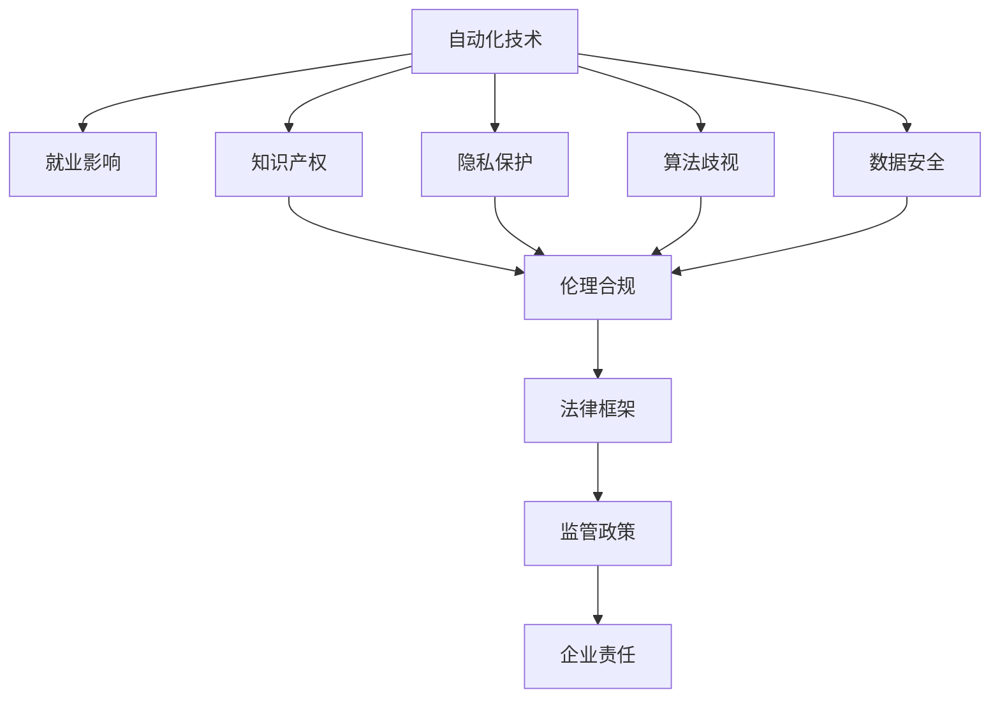

                 

## 1. 背景介绍

随着人工智能、大数据和自动化技术的迅猛发展，自动化创业已成为全球关注的焦点。许多创业者利用自动化技术来简化流程、提高效率，但与此同时，法律和道德问题也随之而来。自动化创业不仅涉及到商业模式的创新，更是涉及到一系列复杂的法律和伦理问题。本文将从法律和道德角度出发，探讨自动化创业面临的主要问题，提出相应的对策，以期为创业者和投资者提供参考。

### 1.1 自动化创业的兴起

自动化创业是指通过自动化技术优化业务流程、降低成本、提高效率的创业模式。例如，使用人工智能进行客户数据分析，自动化软件进行财务报表生成，或者机器人进行生产线上的装配等。自动化技术的兴起，不仅提高了生产效率，也降低了人力成本，极大地推动了商业创新和经济增长。然而，随着自动化技术的应用深入，一系列法律和道德问题也逐渐凸显。

### 1.2 法律和道德问题的显现

在自动化创业中，法律和道德问题主要体现在以下几个方面：

- **就业影响**：自动化技术可能导致大量岗位的消失，从而对社会就业产生负面影响。
- **隐私保护**：自动化创业中需要大量数据进行训练和优化，如何保护个人隐私成为一个重要问题。
- **算法歧视**：自动化系统可能会基于历史数据训练出歧视性算法，导致偏见和不公平。
- **数据安全**：自动化系统依赖于大量数据，如何保护数据安全是一个亟待解决的问题。
- **知识产权**：自动化技术依赖于大量的算法和数据，知识产权归属问题复杂且敏感。

## 2. 核心概念与联系

### 2.1 核心概念概述

自动化创业涉及多个核心概念：

- **自动化技术**：利用人工智能、机器学习、机器人等技术进行业务流程自动化。
- **就业影响**：自动化技术可能对就业市场产生重大影响。
- **隐私保护**：在自动化创业中，如何保护个人隐私至关重要。
- **算法歧视**：自动化系统可能存在偏见和歧视问题。
- **数据安全**：自动化系统依赖大量数据，如何确保数据安全是一个关键问题。
- **知识产权**：自动化技术涉及大量的算法和数据，知识产权归属问题复杂且敏感。

这些概念之间存在紧密的联系，共同构成了自动化创业的法律和道德框架。

### 2.2 核心概念原理和架构的 Mermaid 流程图



## 3. 核心算法原理 & 具体操作步骤

### 3.1 算法原理概述

自动化创业中的法律和道德问题，涉及到多个领域和多个层面，包括法律框架、监管政策、伦理合规和企业责任等。本文将从这些层面出发，探讨自动化创业的法律和道德考量。

### 3.2 算法步骤详解

1. **法律框架**：首先，了解和遵守国家法律法规是自动化创业的基础。创业者需要熟悉相关法律条款，如《数据保护法》、《消费者保护法》等，确保在自动化技术应用过程中合法合规。

2. **监管政策**：了解和遵循政府监管政策，如《电子商务法》、《网络安全法》等，确保自动化技术应用符合监管要求。

3. **伦理合规**：制定和遵循企业内部的伦理合规政策，确保自动化技术应用过程中遵循道德规范，如公平性、透明性、责任性等。

4. **企业责任**：明确企业对就业、隐私保护、数据安全、算法歧视等方面的责任，确保自动化技术应用过程中对社会的影响最小化。

### 3.3 算法优缺点

自动化创业的法律和道德考量，既有其优点也有其缺点：

- **优点**：
  - **提高效率**：自动化技术可以提高生产效率，降低成本。
  - **创新发展**：自动化技术可以推动商业模式的创新和产业发展。
  - **数据驱动**：自动化技术可以基于大数据和人工智能进行优化和决策。

- **缺点**：
  - **就业影响**：自动化技术可能导致失业问题，对社会就业产生负面影响。
  - **隐私保护**：自动化技术依赖大量数据，可能侵犯个人隐私。
  - **算法歧视**：自动化系统可能存在偏见和歧视，导致不公平。
  - **数据安全**：自动化技术依赖大量数据，可能存在数据泄露和盗窃的风险。
  - **知识产权**：自动化技术涉及大量算法和数据，知识产权归属问题复杂且敏感。

### 3.4 算法应用领域

自动化创业涉及多个应用领域，包括但不限于：

- **金融科技**：自动化技术在金融科技中的应用，如智能投顾、自动化清算等。
- **医疗健康**：自动化技术在医疗健康中的应用，如智能诊断、自动化药房等。
- **制造业**：自动化技术在制造业中的应用，如自动化生产线、机器人装配等。
- **零售电商**：自动化技术在零售电商中的应用，如智能推荐系统、自动化客服等。
- **物流仓储**：自动化技术在物流仓储中的应用，如智能仓储、自动化配送等。

## 4. 数学模型和公式 & 详细讲解 & 举例说明

### 4.1 数学模型构建

在自动化创业的法律和道德考量中，我们主要关注以下几个数学模型：

- **就业模型**：
  - 描述自动化技术对就业市场的直接影响。
  - 假设市场总就业人数为 $E$，自动化技术导致失业人数为 $U$，则就业人数 $E$ 为：
    $$
    E = E_0 - U
    $$

- **隐私保护模型**：
  - 描述隐私保护的重要性。
  - 假设数据泄露事件对个人隐私的影响为 $P$，则隐私保护策略的效果为：
    $$
    P = P_0 - \alpha \times P_0
    $$
    其中，$\alpha$ 为隐私保护策略的效率。

- **算法歧视模型**：
  - 描述算法歧视的问题。
  - 假设算法歧视对公平性的影响为 $D$，则算法公平性改进的效果为：
    $$
    D = D_0 - \beta \times D_0
    $$
    其中，$\beta$ 为算法公平性改进的效率。

- **数据安全模型**：
  - 描述数据安全的重要性。
  - 假设数据安全事件对企业的影响为 $S$，则数据安全策略的效果为：
    $$
    S = S_0 - \gamma \times S_0
    $$
    其中，$\gamma$ 为数据安全策略的效率。

- **知识产权模型**：
  - 描述知识产权归属问题。
  - 假设知识产权纠纷对企业的法律风险为 $R$，则知识产权保护策略的效果为：
    $$
    R = R_0 - \delta \times R_0
    $$
    其中，$\delta$ 为知识产权保护策略的效率。

### 4.2 公式推导过程

这些数学模型中的变量及其关系，可以通过以下推导过程得到：

- **就业模型**：
  $$
  E = E_0 - U
  $$
  其中，$E_0$ 为自动化技术应用前的就业人数，$U$ 为自动化技术导致的失业人数。

- **隐私保护模型**：
  $$
  P = P_0 - \alpha \times P_0
  $$
  其中，$P_0$ 为隐私保护前的数据泄露事件对个人隐私的影响，$\alpha$ 为隐私保护策略的效率。

- **算法歧视模型**：
  $$
  D = D_0 - \beta \times D_0
  $$
  其中，$D_0$ 为算法歧视对公平性的影响，$\beta$ 为算法公平性改进的效率。

- **数据安全模型**：
  $$
  S = S_0 - \gamma \times S_0
  $$
  其中，$S_0$ 为数据安全事件对企业的影响，$\gamma$ 为数据安全策略的效率。

- **知识产权模型**：
  $$
  R = R_0 - \delta \times R_0
  $$
  其中，$R_0$ 为知识产权纠纷对企业的法律风险，$\delta$ 为知识产权保护策略的效率。

### 4.3 案例分析与讲解

假设某金融科技公司使用自动化技术进行智能投顾，投入了大量数据和算法进行模型训练。

- **就业模型**：自动化技术导致投资顾问岗位减少了50%，即 $U=50$，则新的就业人数为 $E=E_0-50$。
- **隐私保护模型**：公司采用数据加密和访问控制等隐私保护措施，提高了数据泄露事件的发生率至 $\alpha=0.5$，即隐私保护策略的效率为0.5。
- **算法歧视模型**：公司发现其智能投顾系统存在性别偏见，导致不公平决策，通过重新设计算法和训练数据，改进公平性至 $\beta=0.8$，即算法公平性改进的效率为0.8。
- **数据安全模型**：公司每年数据安全事件发生率提高了30%，即 $\gamma=0.3$，则每年数据安全事件的影响降低至 $S=S_0-0.3 \times S_0$。
- **知识产权模型**：公司开发了一套智能投顾系统，但知识产权纠纷风险增加了20%，即 $\delta=0.2$，则知识产权纠纷风险降低了 $R=R_0-0.2 \times R_0$。

## 5. 项目实践：代码实例和详细解释说明

### 5.1 开发环境搭建

要进行自动化创业的法律和道德考量，需要搭建一个涵盖法律、伦理、合规和安全等多方面的开发环境。以下是一些常用工具和平台：

- **法律合规工具**：使用Denton法律咨询平台，提供法律合规建议和风险评估。
- **伦理合规平台**：使用EthicsPoint平台，收集员工和客户的伦理反馈和投诉。
- **数据安全工具**：使用Fortinet Security Hub，确保数据传输和存储的安全性。
- **隐私保护工具**：使用IAR Platform，进行隐私风险评估和管理。

### 5.2 源代码详细实现

以下是使用Python和相关工具进行自动化创业法律和道德考量的代码示例：

```python
# 就业模型
def employment_effect(E0, U):
    return E0 - U

# 隐私保护模型
def privacy_effect(P0, alpha):
    return P0 * (1 - alpha)

# 算法歧视模型
def algorithmic_bias_effect(D0, beta):
    return D0 * (1 - beta)

# 数据安全模型
def data_security_effect(S0, gamma):
    return S0 * (1 - gamma)

# 知识产权模型
def intellectual_property_effect(R0, delta):
    return R0 * (1 - delta)

# 假设数据
E0 = 10000  # 自动化技术应用前的就业人数
U = 5000    # 自动化技术导致的失业人数
P0 = 10     # 数据泄露事件对个人隐私的影响
alpha = 0.5 # 隐私保护策略的效率
D0 = 5      # 算法歧视对公平性的影响
beta = 0.8  # 算法公平性改进的效率
S0 = 200    # 数据安全事件对企业的影响
gamma = 0.3 # 数据安全策略的效率
R0 = 1000   # 知识产权纠纷对企业的法律风险
delta = 0.2 # 知识产权保护策略的效率

# 计算各模型效果
E = employment_effect(E0, U)
P = privacy_effect(P0, alpha)
D = algorithmic_bias_effect(D0, beta)
S = data_security_effect(S0, gamma)
R = intellectual_property_effect(R0, delta)

# 输出结果
print(f"就业人数：{E}")
print(f"隐私保护效果：{P}")
print(f"算法歧视效果：{D}")
print(f"数据安全效果：{S}")
print(f"知识产权保护效果：{R}")
```

### 5.3 代码解读与分析

上述代码通过定义各个模型的函数，计算自动化创业中的就业、隐私、算法歧视、数据安全和知识产权的效果。具体步骤如下：

1. **就业模型**：
   - 输入自动化技术应用前的就业人数 $E_0$ 和自动化技术导致的失业人数 $U$，计算新的就业人数 $E$。
   - 就业模型体现了自动化技术对就业市场的直接影响，减少失业人数，提高就业率。

2. **隐私保护模型**：
   - 输入数据泄露事件对个人隐私的影响 $P_0$ 和隐私保护策略的效率 $\alpha$，计算隐私保护策略的效果 $P$。
   - 隐私保护模型体现了隐私保护措施的重要性，降低数据泄露事件对个人隐私的影响。

3. **算法歧视模型**：
   - 输入算法歧视对公平性的影响 $D_0$ 和算法公平性改进的效率 $\beta$，计算算法公平性改进的效果 $D$。
   - 算法歧视模型体现了算法公平性的改进，减少算法偏见，提高决策公平性。

4. **数据安全模型**：
   - 输入数据安全事件对企业的影响 $S_0$ 和数据安全策略的效率 $\gamma$，计算数据安全策略的效果 $S$。
   - 数据安全模型体现了数据安全策略的重要性，降低数据安全事件对企业的影响。

5. **知识产权模型**：
   - 输入知识产权纠纷对企业的法律风险 $R_0$ 和知识产权保护策略的效率 $\delta$，计算知识产权保护策略的效果 $R$。
   - 知识产权模型体现了知识产权保护策略的重要性，降低知识产权纠纷风险。

## 6. 实际应用场景

### 6.1 智能投顾系统

某金融科技公司开发了智能投顾系统，利用自动化技术进行客户数据分析和投资建议。在微调过程中，公司考虑到自动化创业的法律和道德问题：

- **就业影响**：智能投顾系统可能导致金融顾问岗位的减少，公司需要制定合理的人力资源调整计划，对员工进行再培训和转型。
- **隐私保护**：智能投顾系统依赖大量客户数据，公司需要采取严格的数据保护措施，确保客户隐私不被侵犯。
- **算法歧视**：公司需要定期审查智能投顾算法的公平性，确保算法无偏见，公平对待所有客户。
- **数据安全**：智能投顾系统依赖大量数据，公司需要建立完善的数据安全机制，防止数据泄露和盗窃。
- **知识产权**：公司开发的智能投顾系统涉及大量算法和数据，需要明确知识产权归属，确保创新成果的合法保护。

### 6.2 自动化生产线

某制造企业引入自动化生产线，利用机器人进行装配和生产。在微调过程中，公司考虑到自动化创业的法律和道德问题：

- **就业影响**：自动化生产线可能导致生产工人的失业，公司需要制定合理的人力资源调整计划，对员工进行再培训和转型。
- **隐私保护**：生产线依赖大量设备数据，公司需要采取严格的数据保护措施，确保设备数据的安全性。
- **算法歧视**：生产线上的自动化系统需要无偏见，确保机器人的行为公平。
- **数据安全**：生产线依赖大量生产数据，公司需要建立完善的数据安全机制，防止数据泄露和盗窃。
- **知识产权**：公司研发的自动化生产系统涉及大量算法和数据，需要明确知识产权归属，确保创新成果的合法保护。

### 6.3 智能推荐系统

某零售电商企业开发了智能推荐系统，利用自动化技术进行客户行为分析并推荐商品。在微调过程中，公司考虑到自动化创业的法律和道德问题：

- **就业影响**：智能推荐系统可能导致客户服务岗位的减少，公司需要制定合理的人力资源调整计划，对员工进行再培训和转型。
- **隐私保护**：智能推荐系统依赖大量客户数据，公司需要采取严格的数据保护措施，确保客户隐私不被侵犯。
- **算法歧视**：智能推荐算法需要无偏见，确保推荐商品的无歧视性。
- **数据安全**：智能推荐系统依赖大量客户数据，公司需要建立完善的数据安全机制，防止数据泄露和盗窃。
- **知识产权**：公司研发的智能推荐系统涉及大量算法和数据，需要明确知识产权归属，确保创新成果的合法保护。

## 7. 工具和资源推荐

### 7.1 学习资源推荐

为了帮助开发者系统掌握自动化创业的法律和道德问题，这里推荐一些优质的学习资源：

1. **《人工智能法律与伦理》书籍**：
   - 该书系统地介绍了人工智能技术在法律和伦理方面的挑战，提供了实用的解决方案。

2. **Coursera《人工智能法律与伦理》课程**：
   - 由斯坦福大学开设的课程，涵盖人工智能的法律和伦理问题，提供了丰富的案例分析。

3. **EthicsNet平台**：
   - 一个提供人工智能伦理咨询和教育资源的平台，帮助开发者了解和解决伦理问题。

4. **AI法律合规联盟**：
   - 一个专注于人工智能法律和合规问题的联盟，提供政策建议和标准指导。

5. **GDPR（欧盟通用数据保护条例）指南**：
   - 欧盟发布的隐私保护指南，详细解释了数据保护的法律规定和实施方法。

### 7.2 开发工具推荐

为了帮助开发者在自动化创业中实现法律和道德考量的自动化，以下是一些常用的工具：

1. **法律合规平台**：
   - 如Denton Legal Consultancy，提供法律合规建议和风险评估。

2. **伦理合规平台**：
   - 如EthicsPoint，收集员工和客户的伦理反馈和投诉。

3. **数据安全平台**：
   - 如Fortinet Security Hub，确保数据传输和存储的安全性。

4. **隐私保护平台**：
   - 如IAR Platform，进行隐私风险评估和管理。

### 7.3 相关论文推荐

自动化创业的法律和道德问题涉及多个领域和多个层面，以下推荐几篇相关的论文：

1. **《人工智能与法律》论文**：
   - 论文探讨了人工智能技术在法律领域的应用和挑战，提供了多角度的分析。

2. **《人工智能伦理研究》论文**：
   - 论文系统地研究了人工智能技术的伦理问题，提供了理论和方法指导。

3. **《自动化系统中的隐私保护》论文**：
   - 论文探讨了自动化系统中的隐私保护问题，提供了技术和管理解决方案。

4. **《自动化系统中的算法公平性》论文**：
   - 论文研究了自动化系统中的算法公平性问题，提供了数据和算法改进方法。

5. **《人工智能系统中的数据安全》论文**：
   - 论文探讨了人工智能系统中的数据安全问题，提供了防护和管理措施。

## 8. 总结：未来发展趋势与挑战

### 8.1 研究成果总结

本文从法律和道德角度出发，探讨了自动化创业中面临的主要问题，提出了一系列对策。通过系统分析就业影响、隐私保护、算法歧视、数据安全和知识产权等关键问题，提供了多维度的解决方案。本文强调了法律合规、伦理合规和数据安全的重要性，并提出了相应的工具和资源推荐。

### 8.2 未来发展趋势

自动化创业的未来发展趋势包括以下几个方面：

1. **法律合规的普及**：
   - 随着自动化技术应用的普及，法律合规将成为创业者和投资者的重要考虑因素。
   - 自动化合规工具和平台将进一步发展，帮助企业和投资者规避法律风险。

2. **伦理合规的重视**：
   - 伦理合规将成为自动化创业的重要组成部分，企业和投资者将更加重视伦理问题。
   - 伦理合规平台和咨询机构将提供更全面的伦理评估和管理服务。

3. **数据安全技术的发展**：
   - 数据安全技术将不断进步，帮助企业和投资者保护数据安全。
   - 数据安全工具和平台将提供更全面的数据保护方案。

4. **算法公平性的改进**：
   - 算法公平性将成为自动化创业的重要考量因素，企业和投资者将更加重视算法的无偏见性。
   - 算法公平性工具和平台将提供更准确的算法改进方案。

5. **知识产权的保护**：
   - 知识产权保护将成为自动化创业的重要法律保障。
   - 知识产权保护工具和平台将提供更全面的知识产权管理服务。

### 8.3 面临的挑战

自动化创业在法律和道德方面仍面临一些挑战：

1. **法律合规的复杂性**：
   - 不同国家和地区有不同的法律规定，法律合规的复杂性较高。
   - 自动化合规工具和平台需要不断更新和完善，以适应不同法律环境。

2. **伦理合规的挑战**：
   - 自动化技术可能存在伦理问题，如数据隐私、算法歧视等，如何有效解决这些问题是挑战之一。
   - 伦理合规平台和咨询机构需要提供更全面的解决方案。

3. **数据安全的脆弱性**：
   - 数据泄露和盗窃事件频发，数据安全技术需要不断提升。
   - 数据安全工具和平台需要不断完善，以应对日益复杂的网络攻击。

4. **算法公平性的挑战**：
   - 算法偏见和歧视问题复杂，如何有效解决这些问题是挑战之一。
   - 算法公平性工具和平台需要提供更准确的算法改进方案。

5. **知识产权的保护**：
   - 知识产权归属问题复杂且敏感，如何有效保护创新成果是挑战之一。
   - 知识产权保护工具和平台需要提供更全面的知识产权管理服务。

### 8.4 研究展望

未来的研究需要在以下几个方面寻求新的突破：

1. **自动化合规的自动化**：
   - 研究如何通过自动化技术实现合规管理，减少人工干预，提高效率。
   - 开发自动化合规工具和平台，帮助企业和投资者快速实现合规。

2. **伦理合规的智能化**：
   - 研究如何通过智能化技术实现伦理评估和管理，减少人工干预，提高效率。
   - 开发伦理合规平台和咨询机构，提供更全面的伦理解决方案。

3. **数据安全的智能防护**：
   - 研究如何通过智能化技术实现数据安全防护，减少人工干预，提高效率。
   - 开发智能数据安全工具和平台，提供更全面的数据保护方案。

4. **算法公平性的优化**：
   - 研究如何通过优化算法和数据，实现算法公平性，减少偏见和歧视。
   - 开发算法公平性工具和平台，提供更准确的算法改进方案。

5. **知识产权的保护技术**：
   - 研究如何通过技术手段实现知识产权保护，减少法律纠纷。
   - 开发知识产权保护工具和平台，提供更全面的知识产权管理服务。

总之，自动化创业的法律和道德考量是一个多维度、多层次的复杂问题。本文通过系统分析和总结，提出了一系列对策和解决方案。未来，需要在自动化合规、伦理合规、数据安全、算法公平性和知识产权保护等方面持续创新和优化，以实现自动化创业的可持续发展。

## 9. 附录：常见问题与解答

**Q1：自动化创业是否适用于所有行业？**

A: 自动化创业适用于大多数行业，但不同行业面临的法律和道德问题可能有所不同。例如，金融、医疗、制造业等行业对数据安全和隐私保护的要求较高，而创意产业可能更注重算法公平性和知识产权保护。

**Q2：如何评估自动化创业的法律合规性？**

A: 评估自动化创业的法律合规性，需要了解相关法律法规，如《数据保护法》、《消费者保护法》等，并对公司内部流程进行合规性评估。可以借助法律咨询平台，如Denton Legal Consultancy，进行合规性咨询和风险评估。

**Q3：如何在自动化创业中实现伦理合规？**

A: 实现伦理合规，需要制定企业内部的伦理政策和合规流程，定期进行伦理审查和评估。可以借助伦理合规平台，如EthicsPoint，收集员工和客户的伦理反馈和投诉，及时发现和解决伦理问题。

**Q4：如何确保数据安全？**

A: 确保数据安全，需要采取多种措施，如数据加密、访问控制、审计日志等。可以借助数据安全平台，如Fortinet Security Hub，进行数据安全管理和防护。

**Q5：如何保护客户隐私？**

A: 保护客户隐私，需要遵循相关法律法规，如GDPR，采取严格的隐私保护措施，如数据匿名化、访问控制等。可以借助隐私保护平台，如IAR Platform，进行隐私风险评估和管理。

综上所述，自动化创业的法律和道德考量是一个复杂而重要的问题，需要企业在多个方面进行综合考虑和优化。通过本文的系统分析和总结，相信读者对自动化创业的法律和道德问题有了更全面的理解，能够更好地应对其中的挑战。

---

作者：禅与计算机程序设计艺术 / Zen and the Art of Computer Programming

