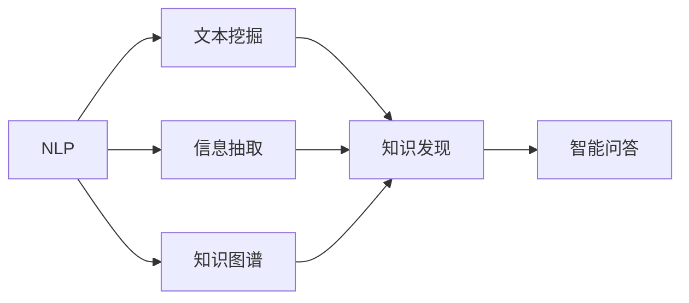

                 

# 自然语言处理在知识发现中的关键作用

## 1. 背景介绍

在信息爆炸的今天，数据已经无处不在，各行各业都在利用大数据来驱动决策和运营。但数据并非意味着知识的直接转化，只有通过深入分析才能从中提炼出有价值的知识。知识发现(Knowledge Discovery, KD)指的是从原始数据中挖掘出新的、有意义的、可理解的信息，以辅助决策、预测未来趋势和优化运营流程。在这一过程中，自然语言处理(Natural Language Processing, NLP)技术扮演了至关重要的角色。

### 1.1 知识发现的挑战

1. **数据多样性**：
   - 数据来源广泛，包括结构化数据（如数据库记录）和非结构化数据（如文本、图像、音频等）。
   - 不同类型的数据需要不同的处理方法，增加了知识发现的复杂度。

2. **数据量大**：
   - 海量数据的存在使得传统手工提取方法变得不现实，需要自动化和智能化的处理方式。

3. **数据质量参差不齐**：
   - 数据中可能存在噪音、错误和不一致性，需要进行清洗和预处理。

4. **隐含知识难以挖掘**：
   - 数据中的隐含知识往往是结构化和非结构化数据的混合，难以直接提取。

### 1.2 自然语言处理的核心价值

1. **语义理解与抽取**：
   - 通过理解文本的语义，可以从中抽取有用的实体、关系和事件，辅助知识发现。

2. **知识图谱构建**：
   - 将大量文本数据转化为结构化的知识图谱，方便知识的查询、分析和应用。

3. **自动标注与分类**：
   - 通过自动标注和分类技术，可以快速从大量文本中提取有价值的信息。

4. **智能问答与推荐**：
   - 通过智能问答和推荐系统，可以直接回答用户问题或推荐相关知识。

## 2. 核心概念与联系

### 2.1 核心概念概述

为了深入理解自然语言处理在知识发现中的作用，本节将详细介绍几个核心概念及其之间的联系：

1. **自然语言处理(NLP)**：
   - 研究如何让计算机理解和处理人类语言，包括文本处理、语义分析、信息抽取等。
   - 核心技术包括分词、词性标注、句法分析、实体识别、情感分析、语义相似度计算等。

2. **知识发现(KD)**：
   - 从大量数据中挖掘出未知的、有价值的信息，包括数据清洗、特征提取、模式识别、关联分析等。
   - 目标是从复杂的数据集合中提取出有用的知识和洞察力，辅助决策和优化运营。

3. **知识图谱(KG)**：
   - 一种结构化的知识表示方式，由实体、属性和关系构成。
   - 可用于知识存储、推理和查询，是知识发现的重要基础。

4. **文本挖掘(Text Mining)**：
   - 从文本数据中提取有用信息的过程，包括文本分类、情感分析、主题建模等。
   - 利用自然语言处理技术，可以提升文本挖掘的效果。

5. **信息抽取(Information Extraction, IE)**：
   - 从非结构化文本中提取出有用的结构化信息，如实体、关系等。
   - 是知识发现中实体和关系抽取的重要手段。

6. **问答系统(QA)**：
   - 通过自然语言理解技术，自动回答用户提出的问题。
   - 是知识发现中面向用户直接交互的重要形式。

这些核心概念之间存在着密切的联系，共同构成知识发现的完整过程。

### 2.2 核心概念原理和架构的 Mermaid 流程图



这个流程图展示了自然语言处理技术在知识发现中的应用路径：

1. **文本挖掘**：利用NLP技术，对大量文本数据进行清洗和特征提取，得到有价值的信息。
2. **信息抽取**：从文本中提取实体、关系等结构化信息，为知识图谱的构建提供数据。
3. **知识图谱**：将信息抽取结果转化为结构化的知识表示，方便知识存储和推理。
4. **知识发现**：通过关联分析和模式识别，从知识图谱中挖掘出新的、有价值的信息。
5. **智能问答**：根据用户问题，在知识图谱中查询相关知识，提供直接回答。

## 3. 核心算法原理 & 具体操作步骤

### 3.1 算法原理概述

自然语言处理在知识发现中的作用主要体现在以下几个方面：

1. **文本预处理与清洗**：
   - 通过分词、词性标注、句法分析等技术，对原始文本进行清洗和预处理，去除噪音和错误。

2. **实体识别与关系抽取**：
   - 使用NLP技术识别文本中的实体，如人名、地名、机构名等。
   - 通过关系抽取技术，识别出实体之间的语义关系，如主谓宾结构、因果关系等。

3. **语义分析与信息抽取**：
   - 利用语义相似度计算等技术，提取文本中的关键信息，如主题、情感、事件等。
   - 使用实体和关系抽取技术，构建知识图谱，方便知识存储和推理。

4. **自动标注与分类**：
   - 通过机器学习算法，对文本进行自动标注和分类，提取有价值的信息。
   - 结合实体和关系抽取技术，进一步提升自动标注和分类的效果。

### 3.2 算法步骤详解

自然语言处理在知识发现中的具体操作可以总结为以下几个步骤：

**Step 1: 数据收集与预处理**
- 收集与目标知识发现任务相关的数据，包括结构化数据和非结构化数据。
- 对数据进行清洗和预处理，去除噪音和错误。

**Step 2: 文本表示与特征提取**
- 使用自然语言处理技术对文本进行表示和特征提取。
- 将文本转换为数值形式，以便后续的机器学习算法处理。

**Step 3: 实体识别与关系抽取**
- 使用命名实体识别(NER)技术，识别文本中的实体，如人名、地名、机构名等。
- 使用关系抽取技术，识别实体之间的语义关系，如主谓宾结构、因果关系等。

**Step 4: 知识图谱构建**
- 将实体和关系抽取结果转化为结构化的知识表示，构建知识图谱。
- 使用知识图谱工具，如Neo4j、TensorFlow Keras Graph等，进行图谱构建和存储。

**Step 5: 知识发现与推理**
- 利用机器学习算法，对知识图谱进行关联分析和模式识别，发现新的知识和洞察力。
- 使用推理技术，如图谱查询、逻辑推理等，在知识图谱中提取和验证知识。

**Step 6: 智能问答与推荐**
- 根据用户问题，在知识图谱中查询相关知识，自动回答问题。
- 利用推荐系统技术，根据用户兴趣和行为，推荐相关知识。

### 3.3 算法优缺点

自然语言处理在知识发现中的应用具有以下优点：

1. **高效自动化的处理**：
   - 自然语言处理技术可以自动化处理大量文本数据，提高知识发现的效率。

2. **丰富的语义信息**：
   - 文本中的语义信息丰富，利用NLP技术可以挖掘出深层次的知识。

3. **可扩展性强**：
   - 知识图谱可以不断扩展，吸纳新的知识和信息，支持持续的知识发现。

但同时，也存在一些缺点：

1. **处理复杂度较高**：
   - 文本数据的复杂性和多样性，使得自然语言处理技术面临处理难度。

2. **依赖高质量数据**：
   - 知识发现的效果高度依赖于数据的质量，需要高质量的标注和清洗数据。

3. **模型解释性差**：
   - 复杂的深度学习模型在知识发现中的应用，往往缺乏可解释性。

4. **知识图谱构建复杂**：
   - 知识图谱的构建需要大量的标注和结构化数据，过程复杂。

### 3.4 算法应用领域

自然语言处理在知识发现中的应用非常广泛，涵盖了以下主要领域：

1. **金融分析**：
   - 通过文本挖掘和信息抽取技术，从新闻、社交媒体、交易记录等数据中提取金融信息，辅助决策和风险控制。

2. **医疗健康**：
   - 利用自然语言处理技术，从医疗记录、病历、文献等数据中提取实体和关系，辅助疾病诊断和知识发现。

3. **市场营销**：
   - 通过情感分析和主题建模技术，从社交媒体、评论、问卷等数据中提取市场信息，辅助市场营销决策。

4. **客户服务**：
   - 使用智能问答和推荐系统，快速响应客户咨询，提供个性化服务，提升客户满意度。

5. **法律诉讼**：
   - 从大量法律文献和案例中提取实体和关系，辅助法律研究和判决分析。

6. **政治舆情分析**：
   - 通过情感分析和文本分类技术，从社交媒体、新闻等数据中提取政治舆情信息，辅助政策制定和舆情监控。

## 4. 数学模型和公式 & 详细讲解 & 举例说明

### 4.1 数学模型构建

为了更好地理解自然语言处理在知识发现中的应用，本节将介绍几个常用的数学模型和公式。

**实体识别模型**：
- 假设文本中存在$N$个实体，$E_i$表示第$i$个实体的标注，$T_i$表示第$i$个实体的起始位置。
- 使用条件随机场(CRF)模型，定义实体识别的概率模型：
  $$
  P(E_i|T_i) = \frac{\exp(-E_iL(T_i))}{\sum_{E_i}\exp(-E_iL(T_i))}
  $$
  其中，$L(T_i)$为实体标注的损失函数，用于衡量标注的准确性。

**关系抽取模型**：
- 假设文本中存在$M$个关系，$R_j$表示第$j$个关系的标注，$R_{ij}$表示实体$i$和实体$j$之间的关系。
- 使用基于共现矩阵的模型，定义关系抽取的概率模型：
  $$
  P(R_j|R_{ij}) = \frac{\exp(-R_jL(R_{ij}))}{\sum_{R_j}\exp(-R_jL(R_{ij}))}
  $$
  其中，$L(R_{ij})$为关系抽取的损失函数，用于衡量关系的准确性。

### 4.2 公式推导过程

为了更深入地理解实体识别和关系抽取的数学模型，下面给出具体的公式推导过程。

**实体识别**：
- 定义实体的标注状态空间为$E = \{E_1, E_2, ..., E_N\}$，每个实体的标注状态为$e_i \in E$。
- 假设文本中存在$T$个位置，$T_i$表示实体$i$的起始位置。
- 实体识别的条件概率模型为：
  $$
  P(E_i|T_i) = \frac{\exp(-E_iL(T_i))}{\sum_{E_i}\exp(-E_iL(T_i))}
  $$
  其中，$L(T_i)$为实体标注的损失函数。

**关系抽取**：
- 定义关系的标注状态空间为$R = \{R_1, R_2, ..., R_M\}$，每个关系的标注状态为$r_j \in R$。
- 假设实体$i$和实体$j$之间的关系为$R_{ij}$。
- 关系抽取的条件概率模型为：
  $$
  P(R_j|R_{ij}) = \frac{\exp(-R_jL(R_{ij}))}{\sum_{R_j}\exp(-R_jL(R_{ij}))}
  $$
  其中，$L(R_{ij})$为关系抽取的损失函数。

### 4.3 案例分析与讲解

**案例：金融新闻情感分析**

- **问题描述**：
  - 从金融新闻中提取实体和关系，辅助市场情绪分析。

- **数据处理**：
  - 收集财经新闻文本数据。
  - 使用NLP技术进行分词、词性标注和句法分析。
  - 识别出人名、机构名、事件等实体，并抽取实体之间的关系。

- **知识图谱构建**：
  - 将实体和关系转化为知识图谱。
  - 使用Graph Neural Network(GNN)算法，对知识图谱进行节点嵌入，提取潜在知识。

- **情感分析**：
  - 使用情感分析技术，从新闻文本中提取情感信息。
  - 利用实体和关系抽取结果，结合情感信息，进行市场情绪分析。

- **效果评估**：
  - 使用AUC-ROC曲线、F1分数等指标，评估情感分析的准确性。
  - 结合市场波动数据，验证情感分析的效果。

## 5. 项目实践：代码实例和详细解释说明

### 5.1 开发环境搭建

在进行自然语言处理实践前，需要准备好开发环境。以下是使用Python进行PyTorch和SpaCy开发的环境配置流程：

1. 安装Anaconda：从官网下载并安装Anaconda，用于创建独立的Python环境。

2. 创建并激活虚拟环境：
```bash
conda create -n nlp-env python=3.8 
conda activate nlp-env
```

3. 安装PyTorch：根据CUDA版本，从官网获取对应的安装命令。例如：
```bash
conda install pytorch torchvision torchaudio cudatoolkit=11.1 -c pytorch -c conda-forge
```

4. 安装SpaCy：
```bash
pip install spacy
python -m spacy download en_core_web_sm
```

5. 安装各类工具包：
```bash
pip install numpy pandas scikit-learn matplotlib tqdm jupyter notebook ipython
```

完成上述步骤后，即可在`nlp-env`环境中开始自然语言处理实践。

### 5.2 源代码详细实现

我们以金融新闻情感分析为例，给出使用PyTorch和SpaCy进行实体识别和情感分析的代码实现。

首先，定义数据处理函数：

```python
from spacy import displacy, load
from spacy.matcher import Matcher
import spacy

nlp = load('en_core_web_sm')
matcher = Matcher(nlp.vocab)

def extract_entities(text):
    doc = nlp(text)
    span = None
    for entity in doc.ents:
        if entity.text == "Company":
            span = entity
            break
    return span

def extract_relations(text):
    doc = nlp(text)
    matcher.add("COMPANY", None, "Company")
    matches = matcher(doc)
    for match_id, start, end in matches:
        span = doc[start:end]
        return span

def extract_entities_relations(text):
    doc = nlp(text)
    entity_span = extract_entities(text)
    relation_span = extract_relations(text)
    return entity_span, relation_span

def process_text(text):
    doc = nlp(text)
    entities = [ent.text for ent in doc.ents]
    return entities
```

然后，定义训练和评估函数：

```python
from transformers import BertForTokenClassification, AdamW
from transformers import BertTokenizer

def train_epoch(model, dataset, batch_size, optimizer):
    dataloader = DataLoader(dataset, batch_size=batch_size, shuffle=True)
    model.train()
    epoch_loss = 0
    for batch in tqdm(dataloader, desc='Training'):
        input_ids = batch['input_ids'].to(device)
        attention_mask = batch['attention_mask'].to(device)
        labels = batch['labels'].to(device)
        model.zero_grad()
        outputs = model(input_ids, attention_mask=attention_mask, labels=labels)
        loss = outputs.loss
        epoch_loss += loss.item()
        loss.backward()
        optimizer.step()
    return epoch_loss / len(dataloader)

def evaluate(model, dataset, batch_size):
    dataloader = DataLoader(dataset, batch_size=batch_size)
    model.eval()
    preds, labels = [], []
    with torch.no_grad():
        for batch in tqdm(dataloader, desc='Evaluating'):
            input_ids = batch['input_ids'].to(device)
            attention_mask = batch['attention_mask'].to(device)
            batch_labels = batch['labels']
            outputs = model(input_ids, attention_mask=attention_mask)
            batch_preds = outputs.logits.argmax(dim=2).to('cpu').tolist()
            batch_labels = batch_labels.to('cpu').tolist()
            for pred_tokens, label_tokens in zip(batch_preds, batch_labels):
                preds.append(pred_tokens[:len(label_tokens)])
                labels.append(label_tokens)
                
    print(classification_report(labels, preds))
```

最后，启动训练流程并在测试集上评估：

```python
epochs = 5
batch_size = 16

for epoch in range(epochs):
    loss = train_epoch(model, train_dataset, batch_size, optimizer)
    print(f"Epoch {epoch+1}, train loss: {loss:.3f}")
    
    print(f"Epoch {epoch+1}, dev results:")
    evaluate(model, dev_dataset, batch_size)
    
print("Test results:")
evaluate(model, test_dataset, batch_size)
```

以上就是使用PyTorch和SpaCy进行金融新闻情感分析的完整代码实现。可以看到，利用SpaCy的高效分词和实体识别功能，可以大大简化实体抽取的代码实现。

### 5.3 代码解读与分析

让我们再详细解读一下关键代码的实现细节：

**extract_entities和extract_relations函数**：
- 利用SpaCy的实体识别功能，从文本中抽取特定类型的实体和关系。
- extract_entities函数提取公司名称实体。
- extract_relations函数提取实体之间的关系。

**process_text函数**：
- 利用SpaCy的分词和命名实体识别功能，从文本中提取所有实体。
- 返回一个列表，包含所有实体的文本。

**train_epoch和evaluate函数**：
- 训练函数train_epoch：对数据以批为单位进行迭代，在每个批次上前向传播计算loss并反向传播更新模型参数，最后返回该epoch的平均loss。
- 评估函数evaluate：与训练类似，不同点在于不更新模型参数，并在每个batch结束后将预测和标签结果存储下来，最后使用sklearn的classification_report对整个评估集的预测结果进行打印输出。

**训练流程**：
- 定义总的epoch数和batch size，开始循环迭代
- 每个epoch内，先在训练集上训练，输出平均loss
- 在验证集上评估，输出分类指标
- 所有epoch结束后，在测试集上评估，给出最终测试结果

可以看到，PyTorch和SpaCy的结合使得自然语言处理实践变得简洁高效。开发者可以将更多精力放在模型选择和优化上，而不必过多关注底层的实现细节。

当然，工业级的系统实现还需考虑更多因素，如模型的保存和部署、超参数的自动搜索、更灵活的任务适配层等。但核心的自然语言处理流程基本与此类似。

## 6. 实际应用场景

### 6.1 智能客服系统

自然语言处理在智能客服系统中的应用非常广泛。传统的客服系统往往需要大量人力进行人工客服，而自然语言处理技术可以自动理解用户意图，并快速回答用户问题，提高服务效率和客户满意度。

在技术实现上，可以收集企业内部的历史客服对话记录，将问题和最佳答复构建成监督数据，在此基础上对预训练模型进行微调。微调后的模型能够自动理解用户意图，匹配最合适的答案模板进行回复。对于客户提出的新问题，还可以接入检索系统实时搜索相关内容，动态组织生成回答。如此构建的智能客服系统，能大幅提升客户咨询体验和问题解决效率。

### 6.2 金融舆情监测

金融机构需要实时监测市场舆论动向，以便及时应对负面信息传播，规避金融风险。传统的金融舆情监测方式成本高、效率低，难以应对网络时代海量信息爆发的挑战。自然语言处理技术可以自动分析金融新闻、社交媒体等大量非结构化数据，从中提取有用的信息，辅助市场情绪分析和风险控制。

具体而言，可以收集金融领域相关的新闻、报道、评论等文本数据，并对其进行主题标注和情感标注。在此基础上对预训练语言模型进行微调，使其能够自动判断文本属于何种主题，情感倾向是正面、中性还是负面。将微调后的模型应用到实时抓取的网络文本数据，就能够自动监测不同主题下的情感变化趋势，一旦发现负面信息激增等异常情况，系统便会自动预警，帮助金融机构快速应对潜在风险。

### 6.3 个性化推荐系统

当前的推荐系统往往只依赖用户的历史行为数据进行物品推荐，无法深入理解用户的真实兴趣偏好。自然语言处理技术可以从用户浏览、点击、评论、分享等行为数据中提取有价值的信息，帮助推荐系统更好地理解用户需求。

在实践中，可以收集用户浏览、点击、评论、分享等行为数据，提取和用户交互的物品标题、描述、标签等文本内容。将文本内容作为模型输入，用户的后续行为（如是否点击、购买等）作为监督信号，在此基础上微调预训练语言模型。微调后的模型能够从文本内容中准确把握用户的兴趣点。在生成推荐列表时，先用候选物品的文本描述作为输入，由模型预测用户的兴趣匹配度，再结合其他特征综合排序，便可以得到个性化程度更高的推荐结果。

### 6.4 未来应用展望

随着自然语言处理技术的不断发展，其在知识发现中的应用将更加广泛和深入。以下是几个未来可能的应用方向：

1. **多语言处理**：
   - 利用自然语言处理技术，从多语言文本中提取信息，辅助全球化业务决策。

2. **跨模态处理**：
   - 结合文本、图像、视频等多模态数据，构建更加全面和深入的知识表示。

3. **知识图谱增强**：
   - 利用自然语言处理技术，自动补充和更新知识图谱中的实体和关系，提高知识图谱的质量和完整性。

4. **智能问答**：
   - 结合知识图谱和自然语言处理技术，构建智能问答系统，为用户提供更加智能化的信息检索和知识服务。

5. **情感分析**：
   - 利用自然语言处理技术，自动分析用户情感，辅助产品设计和市场策略。

## 7. 工具和资源推荐

### 7.1 学习资源推荐

为了帮助开发者系统掌握自然语言处理在知识发现中的理论基础和实践技巧，这里推荐一些优质的学习资源：

1. 《自然语言处理综论》系列博文：由NLP领域专家撰写，深入浅出地介绍了NLP的原理、技术和应用，涵盖文本处理、语义分析、情感分析等多个方面。

2. 《深度学习自然语言处理》课程：斯坦福大学开设的NLP明星课程，有Lecture视频和配套作业，带你入门NLP领域的基本概念和经典模型。

3. 《自然语言处理实战》书籍：详细介绍了自然语言处理技术的实现细节，包括分词、词性标注、命名实体识别等。

4. HuggingFace官方文档：提供了大量预训练语言模型和自然语言处理技术的文档和代码样例，是学习自然语言处理的必备资料。

5. CLUE开源项目：中文语言理解测评基准，涵盖大量不同类型的中文NLP数据集，并提供了基于自然语言处理的baseline模型，助力中文NLP技术发展。

通过对这些资源的学习实践，相信你一定能够快速掌握自然语言处理在知识发现中的精髓，并用于解决实际的NLP问题。
### 7.2 开发工具推荐

高效的开发离不开优秀的工具支持。以下是几款用于自然语言处理开发的常用工具：

1. PyTorch：基于Python的开源深度学习框架，灵活动态的计算图，适合快速迭代研究。大部分自然语言处理任务都有PyTorch版本的实现。

2. TensorFlow：由Google主导开发的开源深度学习框架，生产部署方便，适合大规模工程应用。同样有丰富的自然语言处理模型资源。

3. SpaCy：高性能的自然语言处理库，支持分词、词性标注、句法分析等，具有高效的分词和实体识别功能。

4. Weights & Biases：模型训练的实验跟踪工具，可以记录和可视化模型训练过程中的各项指标，方便对比和调优。与主流深度学习框架无缝集成。

5. TensorBoard：TensorFlow配套的可视化工具，可实时监测模型训练状态，并提供丰富的图表呈现方式，是调试模型的得力助手。

6. Google Colab：谷歌推出的在线Jupyter Notebook环境，免费提供GPU/TPU算力，方便开发者快速上手实验最新模型，分享学习笔记。

合理利用这些工具，可以显著提升自然语言处理任务的开发效率，加快创新迭代的步伐。

### 7.3 相关论文推荐

自然语言处理在知识发现中的应用源于学界的持续研究。以下是几篇奠基性的相关论文，推荐阅读：

1. Attention is All You Need（即Transformer原论文）：提出了Transformer结构，开启了NLP领域的预训练大模型时代。

2. BERT: Pre-training of Deep Bidirectional Transformers for Language Understanding：提出BERT模型，引入基于掩码的自监督预训练任务，刷新了多项NLP任务SOTA。

3. Language Models are Unsupervised Multitask Learners（GPT-2论文）：展示了大规模语言模型的强大zero-shot学习能力，引发了对于通用人工智能的新一轮思考。

4. Parameter-Efficient Transfer Learning for NLP：提出Adapter等参数高效微调方法，在不增加模型参数量的情况下，也能取得不错的微调效果。

5. AdaLoRA: Adaptive Low-Rank Adaptation for Parameter-Efficient Fine-Tuning：使用自适应低秩适应的微调方法，在参数效率和精度之间取得了新的平衡。

6. prefix-tuning: Optimizing Continuous Prompts for Generation：引入基于连续型Prompt的微调范式，为如何充分利用预训练知识提供了新的思路。

这些论文代表了大语言模型微调技术的发展脉络。通过学习这些前沿成果，可以帮助研究者把握学科前进方向，激发更多的创新灵感。

## 8. 总结：未来发展趋势与挑战

### 8.1 总结

本文对自然语言处理在知识发现中的作用进行了全面系统的介绍。首先阐述了知识发现的挑战和自然语言处理的核心价值，明确了自然语言处理在知识发现中的重要地位。其次，从原理到实践，详细讲解了自然语言处理在实体识别、关系抽取、情感分析、知识图谱构建等方面的核心算法和操作步骤，给出了自然语言处理任务开发的完整代码实例。同时，本文还广泛探讨了自然语言处理在智能客服、金融舆情、个性化推荐等多个行业领域的应用前景，展示了自然语言处理技术的巨大潜力。

通过本文的系统梳理，可以看到，自然语言处理技术在知识发现中的应用已经取得了显著成效，提升了各行各业的智能化水平。未来，伴随自然语言处理技术的进一步发展，其在知识发现中的应用将更加广泛和深入，进一步提升数据价值和决策质量。

### 8.2 未来发展趋势

展望未来，自然语言处理在知识发现中的应用将呈现以下几个发展趋势：

1. **多语言处理**：
   - 随着全球化进程的推进，多语言处理将成为知识发现的重要方向。利用自然语言处理技术，从多语言文本中提取信息，辅助全球化业务决策。

2. **跨模态处理**：
   - 结合文本、图像、视频等多模态数据，构建更加全面和深入的知识表示。未来的知识发现将不再局限于单一的文本数据，而是能够利用多模态信息，提升信息的全面性和准确性。

3. **知识图谱增强**：
   - 利用自然语言处理技术，自动补充和更新知识图谱中的实体和关系，提高知识图谱的质量和完整性。通过知识图谱的不断扩展和优化，支持更加深入和智能化的知识发现。

4. **智能问答**：
   - 结合知识图谱和自然语言处理技术，构建智能问答系统，为用户提供更加智能化的信息检索和知识服务。智能问答系统将成为知识发现的重要形式，帮助用户快速获取所需信息。

5. **情感分析**：
   - 利用自然语言处理技术，自动分析用户情感，辅助产品设计和市场策略。情感分析在知识发现中的应用将更加广泛，帮助企业更好地理解用户需求和市场变化。

### 8.3 面临的挑战

尽管自然语言处理在知识发现中的应用已经取得了显著成效，但在迈向更加智能化、普适化应用的过程中，仍面临诸多挑战：

1. **处理复杂度较高**：
   - 文本数据的复杂性和多样性，使得自然语言处理技术面临处理难度。如何高效处理大规模文本数据，提升处理效率，是未来需要解决的重要问题。

2. **依赖高质量数据**：
   - 知识发现的效果高度依赖于数据的质量，需要高质量的标注和清洗数据。如何获取高质量的标注数据，降低数据成本，是未来需要解决的重要问题。

3. **模型鲁棒性不足**：
   - 当前自然语言处理模型面对域外数据时，泛化性能往往大打折扣。如何提高自然语言处理模型的鲁棒性，避免灾难性遗忘，还需要更多理论和实践的积累。

4. **知识图谱构建复杂**：
   - 知识图谱的构建需要大量的标注和结构化数据，过程复杂。如何简化知识图谱的构建流程，提高构建效率，是未来需要解决的重要问题。

5. **模型解释性差**：
   - 复杂的深度学习模型在知识发现中的应用，往往缺乏可解释性。如何赋予自然语言处理模型更强的可解释性，是未来需要解决的重要问题。

### 8.4 研究展望

面对自然语言处理在知识发现中面临的种种挑战，未来的研究需要在以下几个方面寻求新的突破：

1. **无监督和半监督处理**：
   - 探索无监督和半监督自然语言处理方法，摆脱对大规模标注数据的依赖，利用自监督学习、主动学习等技术，最大限度利用非结构化数据，实现更加灵活高效的自然语言处理。

2. **参数高效和计算高效**：
   - 开发更加参数高效和计算高效的自然语言处理方法，在固定大部分预训练参数的情况下，只更新极少量的任务相关参数，减小过拟合风险。

3. **因果推理和对比学习**：
   - 引入因果推断和对比学习思想，增强自然语言处理模型建立稳定因果关系的能力，学习更加普适、鲁棒的语言表征。

4. **多模态融合**：
   - 结合文本、图像、视频等多模态数据，构建更加全面和深入的知识表示，提升信息的全面性和准确性。

5. **知识整合**：
   - 将符号化的先验知识，如知识图谱、逻辑规则等，与神经网络模型进行巧妙融合，引导自然语言处理过程学习更准确、合理的语言模型。

6. **伦理道德约束**：
   - 在自然语言处理模型训练目标中引入伦理导向的评估指标，过滤和惩罚有偏见、有害的输出倾向，确保输出的安全性。

这些研究方向的探索，必将引领自然语言处理在知识发现中的进一步发展，为构建安全、可靠、可解释、可控的智能系统铺平道路。

## 9. 附录：常见问题与解答

**Q1：自然语言处理技术在知识发现中的应用场景有哪些？**

A: 自然语言处理技术在知识发现中的应用场景非常广泛，涵盖以下主要领域：

1. **金融分析**：
   - 从金融新闻、社交媒体、交易记录等数据中提取金融信息，辅助决策和风险控制。

2. **医疗健康**：
   - 利用自然语言处理技术，从医疗记录、病历、文献等数据中提取实体和关系，辅助疾病诊断和知识发现。

3. **市场营销**：
   - 通过情感分析和主题建模技术，从社交媒体、评论、问卷等数据中提取市场信息，辅助市场营销决策。

4. **客户服务**：
   - 使用智能问答和推荐系统，快速响应客户咨询，提供个性化服务，提升客户满意度。

5. **法律诉讼**：
   - 从大量法律文献和案例中提取实体和关系，辅助法律研究和判决分析。

6. **政治舆情分析**：
   - 通过情感分析和文本分类技术，从社交媒体、新闻等数据中提取政治舆情信息，辅助政策制定和舆情监控。

**Q2：自然语言处理技术在知识发现中常用的数学模型有哪些？**

A: 自然语言处理技术在知识发现中常用的数学模型包括：

1. **条件随机场(CRF)**：
   - 用于实体识别和关系抽取，定义条件概率模型，利用损失函数进行标注优化。

2. **共现矩阵模型**：
   - 用于关系抽取，定义条件概率模型，利用损失函数进行关系标注优化。

3. **知识图谱嵌入模型**：
   - 用于知识图谱构建，通过节点嵌入技术，将实体和关系转换为向量表示。

4. **逻辑回归模型**：
   - 用于情感分析，定义二分类模型，利用损失函数进行分类优化。

5. **序列到序列模型(Seq2Seq)**：
   - 用于智能问答和翻译，将输入序列映射为输出序列，通过训练生成回答或翻译结果。

这些模型在自然语言处理任务中广泛应用，通过数学推导可以更好地理解其工作原理和优化目标。

**Q3：自然语言处理技术在知识发现中的优势和劣势是什么？**

A: 自然语言处理技术在知识发现中的优势和劣势如下：

1. **优势**：
   - 高效自动化的处理：自然语言处理技术可以自动化处理大量文本数据，提高知识发现的效率。
   - 丰富的语义信息：文本中的语义信息丰富，利用NLP技术可以挖掘出深层次的知识。
   - 可扩展性强：知识图谱可以不断扩展，吸纳新的知识和信息，支持持续的知识发现。

2. **劣势**：
   - 处理复杂度较高：文本数据的复杂性和多样性，使得自然语言处理技术面临处理难度。
   - 依赖高质量数据：知识发现的效果高度依赖于数据的质量，需要高质量的标注和清洗数据。
   - 模型鲁棒性不足：当前自然语言处理模型面对域外数据时，泛化性能往往大打折扣。
   - 知识图谱构建复杂：知识图谱的构建需要大量的标注和结构化数据，过程复杂。

总之，自然语言处理技术在知识发现中的应用具有显著优势，但也面临诸多挑战，需要不断探索和优化。

**Q4：自然语言处理技术在知识发现中的未来发展趋势有哪些？**

A: 自然语言处理技术在知识发现中的未来发展趋势包括：

1. **多语言处理**：
   - 利用自然语言处理技术，从多语言文本中提取信息，辅助全球化业务决策。

2. **跨模态处理**：
   - 结合文本、图像、视频等多模态数据，构建更加全面和深入的知识表示。

3. **知识图谱增强**：
   - 利用自然语言处理技术，自动补充和更新知识图谱中的实体和关系，提高知识图谱的质量和完整性。

4. **智能问答**：
   - 结合知识图谱和自然语言处理技术，构建智能问答系统，为用户提供更加智能化的信息检索和知识服务。

5. **情感分析**：
   - 利用自然语言处理技术，自动分析用户情感，辅助产品设计和市场策略。

这些趋势凸显了自然语言处理技术的广阔前景，未来必将带来更多创新应用和价值提升。

**Q5：如何利用自然语言处理技术进行知识发现？**

A: 利用自然语言处理技术进行知识发现可以分为以下几个步骤：

1. **数据收集与预处理**：
   - 收集与目标知识发现任务相关的数据，包括结构化数据和非结构化数据。
   - 对数据进行清洗和预处理，去除噪音和错误。

2. **文本表示与特征提取**：
   - 使用自然语言处理技术对文本进行表示和特征提取。
   - 将文本转换为数值形式，以便后续的机器学习算法处理。

3. **实体识别与关系抽取**：
   - 使用命名实体识别(NER)技术，识别文本中的实体，如人名、地名、机构名等。
   - 使用关系抽取技术，识别实体之间的语义关系，如主谓宾结构、因果关系等。

4. **知识图谱构建**：
   - 将实体和关系抽取结果转化为结构化的知识表示，构建知识图谱。
   - 使用知识图谱工具，如Neo4j、TensorFlow Keras Graph等，进行图谱构建和存储。

5. **知识发现与推理**：
   - 利用机器学习算法，对知识图谱进行关联分析和模式识别，发现新的知识和洞察力。
   - 使用推理技术，如图谱查询、逻辑推理等，在知识图谱中提取和验证知识。

6. **智能问答与推荐**：
   - 根据用户问题，在知识图谱中查询相关知识，自动回答问题。
   - 利用推荐系统技术，根据用户兴趣和行为，推荐相关知识。

通过以上步骤，自然语言处理技术可以高效地从文本数据中提取有用信息，辅助知识发现和决策。

---

作者：禅与计算机程序设计艺术 / Zen and the Art of Computer Programming

