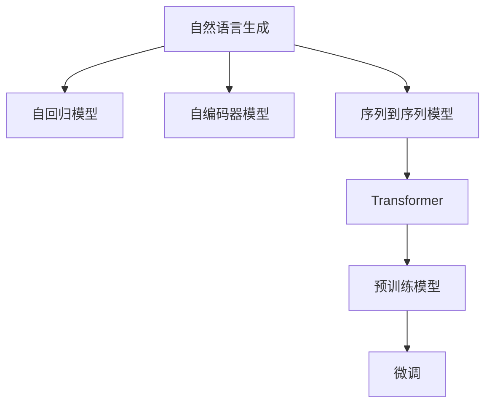

                 

# 自然语言生成（NLG）：AI写作与内容创作

> 关键词：自然语言生成,NLG,AI写作,内容创作,Transformer,自回归模型,自编码器,变分自编码器,序列到序列模型,深度学习,语言模型,预训练,微调,应用场景,研究进展,未来趋势

## 1. 背景介绍

### 1.1 问题由来
随着人工智能技术的飞速发展，自然语言生成(Natural Language Generation, NLG)已经从科幻变成现实。从简单的自动翻译、自动摘要，到创作诗歌、撰写新闻报道，NLG技术在各个领域都展示了巨大的潜力。现代NLG技术的核心在于机器学习，尤其是深度学习，通过训练大规模的语言模型，使得机器能够生成与人类接近的自然语言文本。

### 1.2 问题核心关键点
当前，自然语言生成主要分为两种范式：自回归模型和自编码器模型。自回归模型如GPT系列，直接从左到右预测下一个词，具有较好的连贯性；而自编码器模型如BERT、T5，从编码器到解码器逐步生成文本，具有较好的上下文理解能力。本文将重点讨论自回归模型，但也会涉及自编码器模型的基本原理。

### 1.3 问题研究意义
研究自然语言生成技术，对于推动人机交互的自然化和智能化、提升信息获取和传播效率、改善内容创作质量等具有重要意义：

1. 促进人机交互。NLG使得机器人、聊天机器人等智能设备能够自然地与人类交流，提升用户体验。
2. 增强信息获取。NLG技术可以快速生成新闻、摘要等信息，提升信息检索和展示的效率。
3. 改善内容创作。NLG可用于自动生成文章、剧本、广告等，助力内容创作过程，提高创作效率和质量。
4. 推动教育普及。NLG技术可以自动生成教学材料和辅助学习工具，推动教育资源的普及和个性化教育的发展。
5. 助力企业运营。NLG可用于生成客户服务回复、市场分析报告等，提高企业的运营效率和决策支持能力。

## 2. 核心概念与联系

### 2.1 核心概念概述

为更好地理解自然语言生成技术，本节将介绍几个密切相关的核心概念：

- 自然语言生成(NLG)：指利用计算机自动生成符合人类语言习惯的文本。常用的技术包括自回归模型、自编码器模型、序列到序列模型等。
- 自回归模型(AR)：通过先前的文本预测下一个词，具有较好的连贯性，如GPT、GPT-3等。
- 自编码器模型(AE)：通过编码器将输入文本转化为隐向量，再通过解码器生成输出文本，具有较好的上下文理解能力，如BERT、T5等。
- 序列到序列模型(Seq2Seq)：将输入序列映射为输出序列的模型，常用于机器翻译、摘要生成等任务，如RNN、Transformer等。
- Transformer模型：一种基于自注意力机制的神经网络结构，用于处理序列数据，在机器翻译、NLG等领域取得了卓越效果。
- 预训练模型：在大量无标签数据上预训练的语言模型，如BERT、GPT等。
- 微调(Fine-Tuning)：在预训练模型上，通过有标签数据对模型进行微调，提升特定任务性能。

这些概念之间的逻辑关系可以通过以下Mermaid流程图来展示：



这个流程图展示了大语言生成技术的核心概念及其之间的关系：

1. 自然语言生成技术的核心是自回归模型和自编码器模型。
2. Transformer模型在自编码器模型基础上引入了自注意力机制，成为当前主流的NLG模型。
3. 预训练模型通过大规模无标签数据进行训练，获取通用语言知识。
4. 微调技术进一步利用有标签数据对预训练模型进行优化，提升特定任务性能。

这些概念共同构成了自然语言生成的技术和应用框架，使其能够在各种场景下生成高质量的自然语言文本。通过理解这些核心概念，我们可以更好地把握自然语言生成的原理和优化方向。

## 3. 核心算法原理 & 具体操作步骤
### 3.1 算法原理概述

自然语言生成的核心在于通过深度学习模型，从输入序列预测输出序列。对于自回归模型，通常采用编码器-解码器框架，编码器对输入序列进行编码，解码器根据编码器输出生成目标序列。以下以自回归模型为例，讨论自然语言生成的算法原理。

### 3.2 算法步骤详解

自然语言生成过程包括以下几个关键步骤：

**Step 1: 准备预训练模型和数据集**
- 选择合适的预训练语言模型，如GPT、T5等。
- 准备训练集和验证集，通常为自然语言文本数据，每条文本由输入序列和目标序列组成。

**Step 2: 设计编码器-解码器结构**
- 设计编码器和解码器结构，通常使用Transformer模型。
- 编码器将输入序列编码成高维向量表示，解码器根据编码器输出生成目标序列。

**Step 3: 设置训练超参数**
- 选择合适的优化器及其参数，如AdamW、SGD等，设置学习率、批大小、迭代轮数等。
- 设置正则化技术及强度，包括权重衰减、Dropout、Early Stopping等。

**Step 4: 执行梯度训练**
- 将训练集数据分批次输入模型，前向传播计算损失函数。
- 反向传播计算参数梯度，根据设定的优化算法和学习率更新模型参数。
- 周期性在验证集上评估模型性能，根据性能指标决定是否触发Early Stopping。
- 重复上述步骤直到满足预设的迭代轮数或Early Stopping条件。

**Step 5: 测试和部署**
- 在测试集上评估生成的文本质量，如BLEU、ROUGE等指标。
- 使用生成的文本进行实际应用，如新闻摘要、自动回复、机器翻译等。
- 持续收集用户反馈，不断优化模型参数和超参数，提升生成效果。

以上是自然语言生成的主要流程。在实际应用中，还需要针对具体任务的特点，对模型结构、损失函数、正则化等进行优化设计，以进一步提升生成效果。

### 3.3 算法优缺点

自然语言生成技术具有以下优点：
1. 生成文本连贯性好。自回归模型生成的文本具有较好的连贯性和流畅性。
2. 上下文理解能力强。自编码器模型生成的文本能够较好地理解上下文信息，生成更准确的内容。
3. 适应性强。通过微调，自然语言生成模型可以适应多种任务和应用场景。
4. 效率高。基于深度学习的模型，可以在大规模数据上进行高效训练。

同时，该技术也存在一些局限性：
1. 缺乏创新性。模型生成的文本容易陷入循环推理，难以产生具有创新性的内容。
2. 数据依赖性强。模型的生成效果很大程度上取决于训练数据的数量和质量。
3. 可解释性差。模型内部工作机制复杂，难以解释生成的过程和结果。
4. 数据泄露问题。模型容易受到训练数据中的噪声和偏见影响，导致输出偏差。

尽管存在这些局限性，但就目前而言，自然语言生成技术仍是最主流、最有效的文本生成方法之一。未来相关研究的重点在于如何进一步提高生成质量、增加创新性、增强可解释性等。

### 3.4 算法应用领域

自然语言生成技术已经在新闻报道、客户服务、内容创作等多个领域得到了广泛应用，具体如下：

- 自动新闻摘要：通过训练模型从新闻文章中自动生成摘要，提升信息传播效率。
- 机器翻译：将一种语言自动翻译成另一种语言，提升跨语言交流的便捷性。
- 客户服务回复：根据用户查询，自动生成回复，提升客户服务效率和质量。
- 内容创作辅助：协助作家、编辑等撰写文章、剧本、广告等，提升创作效率和质量。
- 医学报告生成：自动生成医学报告，减少医生撰写报告的工作量。
- 个性化推荐系统：根据用户偏好，自动生成推荐内容，提升用户体验。
- 法律文书生成：自动生成法律文书，提升法律服务的标准化和效率。

除了上述这些常见应用外，自然语言生成技术还被用于生成对话系统、视频字幕、代码生成等领域，为各行各业带来了新的技术突破。随着自然语言生成技术的不断发展，相信其应用场景将不断拓展，带来更多创新性的解决方案。

## 4. 数学模型和公式 & 详细讲解  
### 4.1 数学模型构建

本节将使用数学语言对自然语言生成技术进行更加严格的刻画。

记自然语言生成模型为 $M_{\theta}:\mathcal{X} \rightarrow \mathcal{Y}$，其中 $\mathcal{X}$ 为输入序列，$\mathcal{Y}$ 为输出序列，$\theta$ 为模型参数。假设训练集为 $D=\{(x_i,y_i)\}_{i=1}^N, x_i \in \mathcal{X}, y_i \in \mathcal{Y}$。

定义模型 $M_{\theta}$ 在输入序列 $x$ 上的损失函数为 $\ell(M_{\theta}(x),y)$，则在数据集 $D$ 上的经验风险为：

$$
\mathcal{L}(\theta) = \frac{1}{N}\sum_{i=1}^N \ell(M_{\theta}(x_i),y_i)
$$

其中 $\ell$ 为损失函数，用于衡量模型输出与真实标签之间的差异。常见的损失函数包括交叉熵损失、均方误差损失等。

### 4.2 公式推导过程

以下我们以交叉熵损失函数为例，推导自然语言生成的损失函数及其梯度的计算公式。

假设模型 $M_{\theta}$ 在输入序列 $x$ 上的输出为 $\hat{y}=M_{\theta}(x)$，表示模型对目标序列的预测。真实标签 $y \in \mathcal{Y}$。则交叉熵损失函数定义为：

$$
\ell(M_{\theta}(x),y) = -\sum_{t=1}^T \log \hat{y}_t(y_t)
$$

其中 $T$ 为序列长度，$\hat{y}_t$ 为模型在第 $t$ 个位置的预测概率，$y_t$ 为真实标签。

将其代入经验风险公式，得：

$$
\mathcal{L}(\theta) = -\frac{1}{N}\sum_{i=1}^N \sum_{t=1}^T \log \hat{y}_t(y_t)
$$

根据链式法则，损失函数对参数 $\theta_k$ 的梯度为：

$$
\frac{\partial \mathcal{L}(\theta)}{\partial \theta_k} = -\frac{1}{N}\sum_{i=1}^N \sum_{t=1}^T \frac{\partial \hat{y}_t}{\partial \theta_k} \frac{1}{\hat{y}_t(y_t)}
$$

其中 $\frac{\partial \hat{y}_t}{\partial \theta_k}$ 可进一步递归展开，利用自动微分技术完成计算。

在得到损失函数的梯度后，即可带入参数更新公式，完成模型的迭代优化。重复上述过程直至收敛，最终得到适应下游任务的最优模型参数 $\theta^*$。

## 5. 项目实践：代码实例和详细解释说明
### 5.1 开发环境搭建

在进行自然语言生成实践前，我们需要准备好开发环境。以下是使用Python进行PyTorch开发的环境配置流程：

1. 安装Anaconda：从官网下载并安装Anaconda，用于创建独立的Python环境。

2. 创建并激活虚拟环境：
```bash
conda create -n pytorch-env python=3.8 
conda activate pytorch-env
```

3. 安装PyTorch：根据CUDA版本，从官网获取对应的安装命令。例如：
```bash
conda install pytorch torchvision torchaudio cudatoolkit=11.1 -c pytorch -c conda-forge
```

4. 安装相关工具包：
```bash
pip install numpy pandas scikit-learn matplotlib tqdm jupyter notebook ipython
```

完成上述步骤后，即可在`pytorch-env`环境中开始自然语言生成实践。

### 5.2 源代码详细实现

下面我们以GPT模型进行新闻摘要生成的PyTorch代码实现。

首先，定义数据预处理函数：

```python
from torchtext.datasets import AG_NEWS
from torchtext.data import Field, TabularDataset, BucketIterator

TEXT = Field(tokenize='spacy', include_lengths=True)
LABEL = Field(sequential=False, use_vocab=False)

train_data, test_data = AG_NEWS.splits(TEXT, LABEL)
train_data, valid_data = train_data.split(random_state=random.seed(1234))

train_iterator, valid_iterator, test_iterator = BucketIterator.splits(
    (train_data, valid_data, test_data),
    batch_size=BATCH_SIZE,
    device=torch.device('cuda' if torch.cuda.is_available() else 'cpu'),
    sort_key=lambda x: len(x.text),
    sort_within_batch=False,
    repeat=False,
    sort_within_batch=False)
```

然后，定义模型和优化器：

```python
from transformers import GPT2Tokenizer, GPT2LMHeadModel

tokenizer = GPT2Tokenizer.from_pretrained('gpt2')
model = GPT2LMHeadModel.from_pretrained('gpt2', pad_token_id=tokenizer.eos_token_id)
```

接着，定义训练和评估函数：

```python
import torch.nn.functional as F
from torch.nn import CrossEntropyLoss

def train_epoch(model, iterator, optimizer, loss_fn):
    model.train()
    for batch in iterator:
        optimizer.zero_grad()
        x, y = batch.text, batch.label
        outputs = model(x)
        y_hat = outputs.logits.argmax(dim=-1)
        loss = loss_fn(y_hat, y)
        loss.backward()
        optimizer.step()
    return loss.item()

def evaluate(model, iterator, loss_fn):
    model.eval()
    with torch.no_grad():
        loss = 0
        correct = 0
        total = 0
        for batch in iterator:
            x, y = batch.text, batch.label
            outputs = model(x)
            y_hat = outputs.logits.argmax(dim=-1)
            loss += loss_fn(y_hat, y).item()
            correct += (y_hat == y).sum().item()
            total += len(y)
        return loss / total, correct / total
```

最后，启动训练流程并在测试集上评估：

```python
BATCH_SIZE = 16
ITERATIONS = 10000
LEARNING_RATE = 1e-5

loss_fn = CrossEntropyLoss()
optimizer = AdamW(model.parameters(), lr=LEARNING_RATE)

for epoch in range(ITERATIONS):
    train_loss = train_epoch(model, train_iterator, optimizer, loss_fn)
    print(f"Epoch {epoch+1}, train loss: {train_loss:.3f}")
    
    valid_loss, acc = evaluate(model, valid_iterator, loss_fn)
    print(f"Epoch {epoch+1}, valid loss: {valid_loss:.3f}, acc: {acc:.3f}")
    
print("Test results:")
evaluate(model, test_iterator, loss_fn)
```

以上就是使用PyTorch对GPT模型进行新闻摘要生成的完整代码实现。可以看到，得益于HuggingFace的封装，我们可以用相对简洁的代码完成模型的加载和训练。

### 5.3 代码解读与分析

让我们再详细解读一下关键代码的实现细节：

**Data Preprocessing**：
- 定义文本和标签字段，使用spacy进行分词，并设置长度的追踪。
- 使用`AG_NEWS`数据集，包含新闻标题和摘要，定义训练集和测试集。
- 将数据集划分为训练集、验证集和测试集，并使用`BucketIterator`对数据进行批处理。

**Model and Optimizer**：
- 加载GPT-2模型和对应的分词器，准备好训练所需的模型和优化器。

**Training and Evaluation**：
- 定义训练函数`train_epoch`，使用`CrossEntropyLoss`作为损失函数，计算交叉熵损失。
- 在训练时，将损失值传给优化器，更新模型参数。
- 定义评估函数`evaluate`，在验证集上计算损失和准确率，评估模型的生成效果。
- 使用`with torch.no_grad()`进行模型评估，避免梯度更新影响评估结果。

**Training Loop**：
- 定义总的迭代次数和批次大小，进行多次迭代训练。
- 在每个epoch内，分别在训练集、验证集上训练和评估，并输出损失和准确率。
- 在测试集上评估模型的最终效果。

可以看到，PyTorch配合HuggingFace库使得自然语言生成的代码实现变得简洁高效。开发者可以将更多精力放在数据处理、模型改进等高层逻辑上，而不必过多关注底层的实现细节。

当然，工业级的系统实现还需考虑更多因素，如模型的保存和部署、超参数的自动搜索、更灵活的任务适配层等。但核心的自然语言生成范式基本与此类似。

## 6. 实际应用场景
### 6.1 智能新闻报道

自然语言生成技术在智能新闻报道中具有广泛的应用前景。传统的自动摘要系统只能从文本中提取关键信息，而使用自然语言生成模型，可以自动撰写新闻稿件、生成新闻标题和导语，提升新闻报道的效率和质量。

例如，使用自然语言生成模型可以自动从大量新闻文章中抽取信息，并根据特定角度和风格生成新闻摘要或报道。新闻机构可以利用此技术快速响应突发事件，生成大量高质量的新闻内容，提升舆论引导能力。

### 6.2 智能客服系统

智能客服系统是自然语言生成技术的另一个重要应用场景。传统的客服系统依赖人工编写脚本，无法处理用户输入的各类问题，且需要大量的人力维护。使用自然语言生成技术，可以自动生成客户服务回复，提升客服系统的效率和质量。

例如，客户输入问题后，系统自动分析问题类型，并从预定义的知识库中匹配相关信息，生成个性化的回复。同时，系统可以不断学习和优化，逐步提高回复的准确性和多样性。

### 6.3 内容创作辅助

自然语言生成技术在内容创作领域也有广泛应用。传统的创作过程依赖人类的经验和灵感，效率较低且难以保证质量。使用自然语言生成模型，可以快速生成文章、剧本、广告等内容，提升创作效率和质量。

例如，作家可以利用自然语言生成模型生成故事大纲、情节描述等，协助创作过程。编剧可以利用模型生成台词、场景描述等，提升创作效率。广告公司可以利用模型生成广告文案、宣传语等，提升广告效果。

### 6.4 未来应用展望

随着自然语言生成技术的不断发展，其应用场景将不断拓展，带来更多创新性的解决方案。

在智慧医疗领域，自然语言生成技术可以用于生成医学报告、诊断建议等，提升医疗服务的智能化水平，辅助医生诊疗，加速新药开发进程。

在智能教育领域，自然语言生成技术可以用于生成教学材料和辅助学习工具，推动教育资源的普及和个性化教育的发展。

在智慧城市治理中，自然语言生成技术可以用于生成城市事件监测、舆情分析、应急指挥等环节，提高城市管理的自动化和智能化水平，构建更安全、高效的未来城市。

此外，在企业生产、社会治理、文娱传媒等众多领域，自然语言生成技术也将不断涌现，为各行各业带来新的技术突破。相信随着技术的日益成熟，自然语言生成技术必将在构建人机协同的智能时代中扮演越来越重要的角色。

## 7. 工具和资源推荐
### 7.1 学习资源推荐

为了帮助开发者系统掌握自然语言生成技术的理论基础和实践技巧，这里推荐一些优质的学习资源：

1. 《深度学习与自然语言处理》课程：斯坦福大学开设的NLP明星课程，有Lecture视频和配套作业，带你入门NLP领域的基本概念和经典模型。

2. 《自然语言处理综述》书籍：简要介绍了自然语言处理的主要概念、技术和应用，适合快速了解NLP的基本框架。

3. 《Sequence to Sequence Learning with Neural Networks》论文：谷歌提出的Seq2Seq模型，开创了序列数据到序列数据的生成框架，是自然语言生成的重要基础。

4. 《Attention is All You Need》论文：Google提出的Transformer模型，通过自注意力机制显著提升了自然语言生成的效果。

5. OpenAI GPT-3：最新的自然语言生成模型，具有卓越的生成能力和泛化性能，适合学习最新的自然语言生成技术。

通过对这些资源的学习实践，相信你一定能够快速掌握自然语言生成技术的精髓，并用于解决实际的NLP问题。
###  7.2 开发工具推荐

高效的开发离不开优秀的工具支持。以下是几款用于自然语言生成开发的常用工具：

1. PyTorch：基于Python的开源深度学习框架，灵活动态的计算图，适合快速迭代研究。大部分预训练语言模型都有PyTorch版本的实现。

2. TensorFlow：由Google主导开发的开源深度学习框架，生产部署方便，适合大规模工程应用。同样有丰富的预训练语言模型资源。

3. Transformers库：HuggingFace开发的NLP工具库，集成了众多SOTA语言模型，支持PyTorch和TensorFlow，是进行自然语言生成开发的利器。

4. Weights & Biases：模型训练的实验跟踪工具，可以记录和可视化模型训练过程中的各项指标，方便对比和调优。与主流深度学习框架无缝集成。

5. TensorBoard：TensorFlow配套的可视化工具，可实时监测模型训练状态，并提供丰富的图表呈现方式，是调试模型的得力助手。

6. Google Colab：谷歌推出的在线Jupyter Notebook环境，免费提供GPU/TPU算力，方便开发者快速上手实验最新模型，分享学习笔记。

合理利用这些工具，可以显著提升自然语言生成任务的开发效率，加快创新迭代的步伐。

### 7.3 相关论文推荐

自然语言生成技术的发展源于学界的持续研究。以下是几篇奠基性的相关论文，推荐阅读：

1. Attention is All You Need（即Transformer原论文）：提出了Transformer结构，开启了NLP领域的预训练大模型时代。

2. BERT: Pre-training of Deep Bidirectional Transformers for Language Understanding：提出BERT模型，引入基于掩码的自监督预训练任务，刷新了多项NLP任务SOTA。

3. Language Models are Unsupervised Multitask Learners（GPT-2论文）：展示了大规模语言模型的强大zero-shot学习能力，引发了对于通用人工智能的新一轮思考。

4. Exploring the Limits of Language Modeling：Google提出的T5模型，通过预训练大模型生成大规模指令-响应对，为自然语言生成提供了丰富的训练数据和范例。

5. Transformer-XL: Attentive Language Models beyond a Fixed-Length Context：提出Transformer-XL模型，通过长上下文机制显著提升了长文本生成的效果。

6. The Generative Pre-trained Transformer (GPT-3)：最新的自然语言生成模型，具有卓越的生成能力和泛化性能，适合学习最新的自然语言生成技术。

这些论文代表了大语言生成技术的发展脉络。通过学习这些前沿成果，可以帮助研究者把握学科前进方向，激发更多的创新灵感。

## 8. 总结：未来发展趋势与挑战

### 8.1 总结

本文对自然语言生成技术进行了全面系统的介绍。首先阐述了自然语言生成技术的背景和意义，明确了自然语言生成在提升人机交互效率、增强信息传播速度、改善内容创作质量等方面的重要作用。其次，从原理到实践，详细讲解了自然语言生成的数学模型和算法流程，给出了自然语言生成任务开发的完整代码实例。同时，本文还广泛探讨了自然语言生成技术在智能新闻报道、智能客服系统、内容创作辅助等多个行业领域的应用前景，展示了自然语言生成技术的巨大潜力。此外，本文精选了自然语言生成技术的各类学习资源，力求为读者提供全方位的技术指引。

通过本文的系统梳理，可以看到，自然语言生成技术已经逐步成熟，并在多个领域展示了显著的应用效果。未来，随着预训练语言模型的不断发展，自然语言生成技术将在更广泛的应用场景中发挥作用，为人类认知智能的进化带来新的突破。

### 8.2 未来发展趋势

展望未来，自然语言生成技术将呈现以下几个发展趋势：

1. 模型规模持续增大。随着算力成本的下降和数据规模的扩张，预训练语言模型的参数量还将持续增长。超大规模语言模型蕴含的丰富语言知识，有望支撑更加复杂多变的自然语言生成任务。

2. 生成质量逐步提升。未来的模型将通过更多的训练数据和更复杂的训练策略，进一步提升自然语言生成的连贯性、流畅性和准确性。

3. 创新性内容增加。未来模型将融合更多创新性内容，如诗歌、小说、新闻报道等，产生更多具有个性化和创造性的文本。

4. 多样性支持增强。未来模型将支持更多的语言和文化，能够生成多语言、多文化背景下的自然语言文本。

5. 安全性保障提升。未来模型将加入更多安全机制，避免生成有害、歧视性的文本，保障用户安全和数据隐私。

6. 可解释性增强。未来模型将引入更多可解释机制，如生成路径可视化、生成理由解释等，增强用户的信任和满意度。

7. 多模态融合拓展。未来模型将融合视觉、语音、图像等多模态信息，生成更全面、更具表现力的自然语言文本。

这些趋势凸显了自然语言生成技术的广阔前景。这些方向的探索发展，必将进一步提升自然语言生成的效果，为构建更加智能化、自然化的智能系统铺平道路。

### 8.3 面临的挑战

尽管自然语言生成技术已经取得了显著进展，但在迈向更加智能化、普适化应用的过程中，它仍面临着诸多挑战：

1. 数据依赖性强。模型的生成效果很大程度上取决于训练数据的数量和质量。如何获取和处理大规模高质量的训练数据，仍然是一个重大挑战。

2. 生成内容泛化性差。模型容易受到训练数据中的噪声和偏见影响，导致生成的内容泛化能力不足。如何提高模型的泛化能力和鲁棒性，仍然是一个重要的研究方向。

3. 创新性不足。模型生成的文本容易陷入循环推理，难以产生具有创新性的内容。如何增强模型的创新性和多样性，仍然是一个难点。

4. 可解释性差。模型内部工作机制复杂，难以解释生成的过程和结果。如何增强模型的可解释性和可控性，仍然是一个重要的研究方向。

5. 安全性问题。模型容易受到输入噪声和对抗样本的影响，生成有害、误导性的文本。如何提高模型的鲁棒性和安全性，仍然是一个重要的研究方向。

6. 计算资源消耗大。自然语言生成模型通常参数量巨大，训练和推理消耗的计算资源较多。如何优化模型结构和计算图，减少计算资源消耗，仍然是一个重要的研究方向。

这些挑战凸显了自然语言生成技术仍然存在诸多不足，需要进一步研究和改进。相信随着学界和产业界的共同努力，这些挑战终将一一被克服，自然语言生成技术必将在构建人机协同的智能时代中扮演越来越重要的角色。

### 8.4 研究展望

面对自然语言生成技术所面临的诸多挑战，未来的研究需要在以下几个方面寻求新的突破：

1. 探索无监督和半监督学习范式。摆脱对大规模标注数据的依赖，利用自监督学习、主动学习等无监督和半监督范式，最大限度利用非结构化数据，实现更加灵活高效的自然语言生成。

2. 研究参数高效和计算高效的自然语言生成范式。开发更加参数高效的自然语言生成方法，在固定大部分预训练参数的同时，只更新极少量的任务相关参数。同时优化自然语言生成的计算图，减少前向传播和反向传播的资源消耗，实现更加轻量级、实时性的部署。

3. 融合因果和对比学习范式。通过引入因果推断和对比学习思想，增强自然语言生成模型建立稳定因果关系的能力，学习更加普适、鲁棒的语言表征，从而提升模型泛化性和抗干扰能力。

4. 引入更多先验知识。将符号化的先验知识，如知识图谱、逻辑规则等，与神经网络模型进行巧妙融合，引导自然语言生成过程学习更准确、合理的语言模型。同时加强不同模态数据的整合，实现视觉、语音等多模态信息与文本信息的协同建模。

5. 结合因果分析和博弈论工具。将因果分析方法引入自然语言生成模型，识别出模型决策的关键特征，增强输出解释的因果性和逻辑性。借助博弈论工具刻画人机交互过程，主动探索并规避模型的脆弱点，提高系统稳定性。

6. 纳入伦理道德约束。在模型训练目标中引入伦理导向的评估指标，过滤和惩罚有偏见、有害的输出倾向。同时加强人工干预和审核，建立模型行为的监管机制，确保输出符合人类价值观和伦理道德。

这些研究方向的探索，必将引领自然语言生成技术迈向更高的台阶，为构建安全、可靠、可解释、可控的智能系统铺平道路。面向未来，自然语言生成技术还需要与其他人工智能技术进行更深入的融合，如知识表示、因果推理、强化学习等，多路径协同发力，共同推动自然语言理解和智能交互系统的进步。只有勇于创新、敢于突破，才能不断拓展自然语言生成技术的边界，让智能技术更好地造福人类社会。

## 9. 附录：常见问题与解答

**Q1：自然语言生成技术是否适用于所有NLP任务？**

A: 自然语言生成技术在大多数NLP任务上都能取得不错的效果，特别是对于数据量较小的任务。但对于一些特定领域的任务，如医学、法律等，仅仅依靠通用语料预训练的模型可能难以很好地适应。此时需要在特定领域语料上进一步预训练，再进行微调，才能获得理想效果。此外，对于一些需要时效性、个性化很强的任务，如对话、推荐等，自然语言生成方法也需要针对性的改进优化。

**Q2：自然语言生成模型如何处理长文本？**

A: 自然语言生成模型可以通过长上下文机制来处理长文本。例如，Transformer-XL模型引入了长上下文窗口机制，使得模型可以更好地理解长文本的上下文关系，生成更加连贯的文本。同时，还可以使用注意力机制和跨层连接等技术，增强长文本的建模能力。

**Q3：自然语言生成模型如何避免生成有害内容？**

A: 自然语言生成模型可以通过以下几种方式避免生成有害内容：
1. 数据清洗：在训练数据中移除有害、误导性的内容，减少模型学习到有害知识的机会。
2. 数据增强：引入对抗样本和噪声，增强模型的鲁棒性，避免生成有害内容。
3. 规则约束：加入生成规则，限制模型生成的文本内容，确保生成内容的合法性和健康性。
4. 监控和审核：实时监控生成内容，引入人工审核机制，及时发现和纠正有害内容。

这些方法可以显著提升自然语言生成模型的安全性，减少有害内容的生成。

**Q4：自然语言生成模型如何提高生成效率？**

A: 自然语言生成模型可以通过以下几种方式提高生成效率：
1. 模型裁剪：去除不必要的层和参数，减小模型尺寸，加快推理速度。
2. 量化加速：将浮点模型转为定点模型，压缩存储空间，提高计算效率。
3. 多模型集成：训练多个自然语言生成模型，取平均输出，抑制过拟合和提高生成质量。
4. 模型并行：使用模型并行技术，通过多GPU、多机等手段，加速模型的推理过程。

这些方法可以显著提升自然语言生成模型的效率，使得模型能够在实际应用中快速生成高质量的文本。

**Q5：自然语言生成模型如何处理数据不平衡问题？**

A: 自然语言生成模型可以通过以下几种方式处理数据不平衡问题：
1. 数据增强：通过回译、近义替换等方式扩充训练集，增加少数类样本的数量。
2. 迁移学习：在少量标注数据上，通过迁移学习技术，利用预训练模型进行微调，提升少数类样本的生成效果。
3. 类权重调整：在损失函数中加入类权重，加大少数类样本的损失，使得模型更加关注少数类样本的生成效果。

这些方法可以显著提升自然语言生成模型在数据不平衡情况下的生成效果，确保模型对各类样本的生成能力均衡。

---

作者：禅与计算机程序设计艺术 / Zen and the Art of Computer Programming

