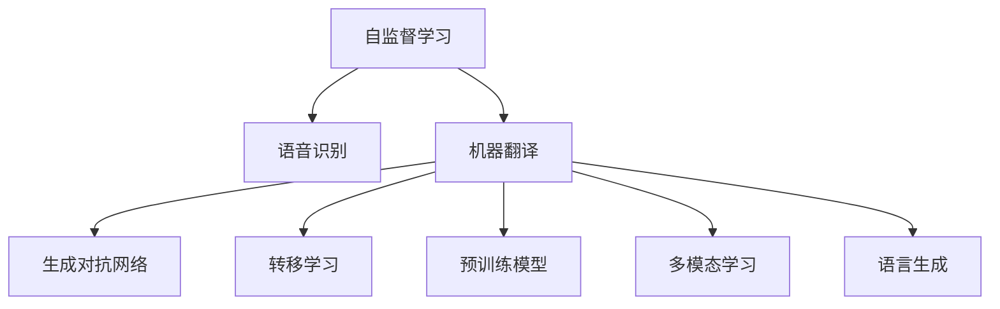

                 

# 自监督学习的应用创新:语音识别和机器翻译

> 关键词：自监督学习, 语音识别, 机器翻译, 生成对抗网络, 转移学习, 预训练模型, 多模态学习, 语言生成, 降噪语音

## 1. 背景介绍

### 1.1 问题由来
语音识别和机器翻译是人工智能领域的两大核心技术，分别承担着将语音转换为文本和将文本转换为语音的重要任务。但这两个任务面临的挑战各有不同。语音识别技术主要解决的是如何在嘈杂环境中准确捕捉人类语音信号，并将其转换为文本形式；而机器翻译技术则需要在理解和生成语言的层面上，跨越语言之间的语义鸿沟。

自监督学习作为近年来人工智能领域的一个前沿研究热点，它通过在大规模无标签数据上进行的训练，无需人工标注即可获取丰富的特征表示。这种无需标注的数据驱动学习方式，使得自监督学习在语音识别和机器翻译等领域得到了广泛的应用和深入研究。本文将详细探讨自监督学习在语音识别和机器翻译中的应用创新，并展望其未来发展趋势。

### 1.2 问题核心关键点
- 自监督学习（Self-supervised Learning）：通过在无标签数据上训练，无需人工标注即可获取对数据特征的表示。
- 语音识别（Speech Recognition）：将人类语音信号转换为文本的过程，其核心在于捕捉和理解语音信号中的语义信息。
- 机器翻译（Machine Translation）：将一种语言的文本自动翻译为另一种语言的过程，要求模型理解和生成两种语言的语义表示。
- 生成对抗网络（Generative Adversarial Networks, GANs）：一种通过两个对抗模型训练的深度学习框架，用于生成高质量的语音和文本数据。
- 转移学习（Transfer Learning）：通过在不同任务间共享知识，提高模型的泛化能力。
- 预训练模型（Pre-trained Models）：在大规模数据上预训练出的模型，可以提取丰富的语言特征，用于后续任务的微调。
- 多模态学习（Multimodal Learning）：结合不同模态（如视觉、听觉）的数据，提高模型的全面理解能力。
- 语言生成（Language Generation）：通过模型自动生成符合语法和语义规则的文本或语音。

这些关键概念之间的联系可以通过以下Mermaid流程图来展示：



这个流程图展示了大模型微调的各个核心概念及其之间的关系：

1. 自监督学习通过对无标签数据的训练，获取对语音和文本数据的特征表示。
2. 语音识别和机器翻译分别是自监督学习的两个主要应用方向。
3. 生成对抗网络为自监督学习提供了生成高质量语音和文本数据的手段。
4. 转移学习用于在不同任务间共享知识，提高模型的泛化能力。
5. 预训练模型在大规模数据上预训练出丰富的语言特征，用于后续任务的微调。
6. 多模态学习结合不同模态的数据，提高模型的全面理解能力。
7. 语言生成通过模型自动生成文本或语音，增强语言处理能力。

这些概念共同构成了自监督学习在语音识别和机器翻译等领域的研究框架，推动着人工智能技术的发展。

## 2. 核心概念与联系

### 2.1 核心概念概述

为更好地理解自监督学习在语音识别和机器翻译中的应用创新，本节将介绍几个密切相关的核心概念：

- **自监督学习**：指通过在无标签数据上进行训练，学习对数据特征的表示，无需人工标注即可获取对数据的理解。自监督学习的核心在于通过数据本身的结构，如掩码预测、语言模型预测等任务，训练出高质量的模型。
- **语音识别**：指将人类语音信号转换为文本的过程。语音识别系统通常包括声学模型、语言模型和解码器三个部分，通过自监督学习可以进一步提升这些组件的性能。
- **机器翻译**：指将一种语言的文本自动翻译为另一种语言的过程。机器翻译系统通常基于统计机器翻译（SMT）或神经机器翻译（NMT），自监督学习可以在这两种模型上进一步提升翻译质量。
- **生成对抗网络（GANs）**：通过两个对抗模型训练的深度学习框架，可以生成高质量的语音和文本数据，用于自监督学习任务。GANs可以帮助构建大规模、高保真的语音和文本数据集，加速模型的训练。
- **转移学习**：指在不同任务间共享知识，提高模型的泛化能力。自监督学习可以用于预训练模型，然后再在特定任务上进行微调，以提升模型在该任务上的性能。
- **预训练模型**：在大规模数据上预训练出的模型，可以提取丰富的语言特征，用于后续任务的微调。自监督学习可以用于构建高质量的预训练模型，进一步提升下游任务的性能。
- **多模态学习**：结合不同模态（如视觉、听觉）的数据，提高模型的全面理解能力。自监督学习可以用于多模态数据的特征提取和融合，增强模型的综合处理能力。
- **语言生成**：通过模型自动生成符合语法和语义规则的文本或语音，自监督学习可以用于语言生成任务的模型训练。

这些核心概念之间的逻辑关系可以通过以下Mermaid流程图来展示：


这个流程图展示了大模型微调的各个核心概念及其之间的关系：

1. 自监督学习通过对无标签数据的训练，获取对语音和文本数据的特征表示。
2. 语音识别和机器翻译分别是自监督学习的两个主要应用方向。
3. 生成对抗网络为自监督学习提供了生成高质量语音和文本数据的手段。
4. 转移学习用于在不同任务间共享知识，提高模型的泛化能力。
5. 预训练模型在大规模数据上预训练出丰富的语言特征，用于后续任务的微调。
6. 多模态学习结合不同模态的数据，提高模型的全面理解能力。
7. 语言生成通过模型自动生成文本或语音，增强语言处理能力。

这些概念共同构成了自监督学习在语音识别和机器翻译等领域的研究框架，推动着人工智能技术的发展。

## 3. 核心算法原理 & 具体操作步骤
### 3.1 算法原理概述

自监督学习在语音识别和机器翻译中的应用，主要通过以下三个步骤实现：

1. **预训练阶段**：在大规模无标签数据上，使用自监督学习任务对模型进行预训练，提取对语音或文本数据的特征表示。
2. **微调阶段**：在特定任务的标注数据上，通过有监督学习对预训练模型进行微调，进一步提升模型在该任务上的性能。
3. **应用阶段**：将微调后的模型应用于实际的语音识别和机器翻译任务中，进行推理和预测。

这些步骤的顺序和细节，因任务的不同而有所变化。以下将详细讲解语音识别和机器翻译中的具体算法原理。

### 3.2 算法步骤详解

#### 3.2.1 语音识别

语音识别的核心在于将语音信号转换为文本形式。传统的语音识别方法包括声学模型、语言模型和解码器三个部分。声学模型通过特征提取和分类，将语音信号转换为声学特征；语言模型用于处理词序的概率，解码器通过匹配声学特征和语言模型，生成文本输出。自监督学习可以通过以下步骤提升语音识别的性能：

1. **声学特征提取**：通过自监督学习的掩码预测任务，训练声学特征提取器，提取高保真的语音特征。
2. **声学模型训练**：将提取的声学特征输入到声学模型中，通过自监督学习的掩码预测任务，优化声学模型的参数。
3. **语言模型训练**：使用自监督学习的语言模型预测任务，训练语言模型，提高对词序的预测能力。
4. **解码器训练**：将优化后的声学模型和语言模型输入到解码器中，通过自监督学习的掩码预测任务，进一步优化解码器参数。

#### 3.2.2 机器翻译

机器翻译的核心在于将一种语言的文本自动翻译为另一种语言。传统的机器翻译方法包括统计机器翻译（SMT）和神经机器翻译（NMT）两种。SMT基于统计模型进行翻译，而NMT则使用神经网络模型。自监督学习可以通过以下步骤提升机器翻译的性能：

1. **语料预处理**：对大规模平行语料进行预处理，构建高质量的预训练数据集。
2. **预训练模型构建**：在大规模无标签数据上，使用自监督学习的掩码预测任务，构建预训练模型，提取高保真的语言表示。
3. **微调模型训练**：在特定任务的平行语料上，使用有监督学习对预训练模型进行微调，优化模型在该任务上的性能。
4. **模型融合与评估**：将微调后的模型进行融合，并使用BLEU、ROUGE等指标对翻译结果进行评估，优化模型输出。

### 3.3 算法优缺点

自监督学习在语音识别和机器翻译中的应用，具有以下优点：

1. **无需人工标注**：自监督学习通过在大规模无标签数据上进行训练，无需人工标注，降低了标注成本。
2. **提升模型性能**：自监督学习通过在大规模数据上预训练，提取丰富的语言特征，提升模型的泛化能力。
3. **数据驱动学习**：自监督学习通过数据本身的结构，如掩码预测、语言模型预测等任务，训练出高质量的模型。
4. **适用于多种任务**：自监督学习可以应用于语音识别、机器翻译等多种任务，具有广泛的适用性。

同时，自监督学习在语音识别和机器翻译中的应用也存在以下缺点：

1. **数据依赖**：自监督学习依赖于大规模无标签数据的可用性，数据不足时难以取得理想效果。
2. **模型复杂**：自监督学习模型通常比传统模型更加复杂，需要更多的计算资源和训练时间。
3. **可解释性不足**：自监督学习模型往往缺乏可解释性，难以理解模型的内部决策机制。
4. **泛化能力有限**：自监督学习模型在特定任务上的性能提升有限，难以应对多样化的应用场景。

尽管存在这些局限性，但自监督学习在语音识别和机器翻译等领域的应用，已经取得了显著的进展，为未来的研究提供了广阔的前景。

### 3.4 算法应用领域

自监督学习在语音识别和机器翻译中的应用，已经广泛应用于多个领域，包括：

- **智能音箱**：自监督学习可以用于构建高质量的语音识别模型，提升智能音箱的交互体验。
- **自动字幕生成**：自监督学习可以用于构建高质量的机器翻译模型，自动生成视频或音频的字幕。
- **语音助手**：自监督学习可以用于提升语音助手的自然语言理解能力，增强人机交互体验。
- **多语种翻译**：自监督学习可以用于构建多语种的翻译模型，支持跨语言交流。
- **语音情绪识别**：自监督学习可以用于提取语音中的情绪特征，识别说话人的情绪状态。

随着自监督学习技术的不断进步，其应用领域还将进一步拓展，为语音识别和机器翻译带来更多的创新应用。

## 4. 数学模型和公式 & 详细讲解 & 举例说明

### 4.1 数学模型构建

自监督学习在语音识别和机器翻译中的应用，通常使用自监督学习的掩码预测任务进行模型训练。以下是一些常用的数学模型构建方法：

1. **掩码预测任务**：在输入序列中随机选择一个或多个位置进行掩码处理，训练模型预测掩码位置上的单词或声学特征。例如，对于语言模型预测任务，输入序列为$x_1,x_2,\ldots,x_n$，掩码位置为$i_1,i_2,\ldots,i_m$，模型需要预测掩码位置上的单词$y_1,y_2,\ldots,y_m$。
2. **声学特征提取任务**：将语音信号转换为声学特征，使用自监督学习的掩码预测任务，训练声学特征提取器。例如，输入语音信号$s$，掩码位置为$t_1,t_2,\ldots,t_k$，模型需要预测掩码位置上的声学特征$z_1,z_2,\ldots,z_k$。
3. **语言模型预测任务**：使用自监督学习的语言模型预测任务，训练语言模型，提高对词序的预测能力。例如，输入序列为$x_1,x_2,\ldots,x_n$，掩码位置为$i_1,i_2,\ldots,i_m$，模型需要预测掩码位置上的单词$y_1,y_2,\ldots,y_m$。

### 4.2 公式推导过程

以下是掩码预测任务的数学公式推导：

设输入序列为$x_1,x_2,\ldots,x_n$，掩码位置为$i_1,i_2,\ldots,i_m$，模型需要预测掩码位置上的单词$y_1,y_2,\ldots,y_m$。定义损失函数$\mathcal{L}$如下：

$$
\mathcal{L} = -\sum_{j=1}^m \log p(y_j|x_1,\ldots,x_{i_j-1},x_{i_j+1},\ldots,x_n)
$$

其中$p(y_j|x_1,\ldots,x_{i_j-1},x_{i_j+1},\ldots,x_n)$表示在掩码位置$i_j$处，单词$y_j$的条件概率。通过反向传播算法，计算损失函数对模型参数的梯度，并使用梯度下降等优化算法更新模型参数。

### 4.3 案例分析与讲解

#### 案例1：语言模型预测

对于语言模型预测任务，可以使用Transformer模型进行训练。设输入序列为$x_1,x_2,\ldots,x_n$，掩码位置为$i_1,i_2,\ldots,i_m$，模型需要预测掩码位置上的单词$y_1,y_2,\ldots,y_m$。定义损失函数$\mathcal{L}$如下：

$$
\mathcal{L} = -\sum_{j=1}^m \log p(y_j|x_1,\ldots,x_{i_j-1},x_{i_j+1},\ldots,x_n)
$$

其中$p(y_j|x_1,\ldots,x_{i_j-1},x_{i_j+1},\ldots,x_n)$表示在掩码位置$i_j$处，单词$y_j$的条件概率。使用Transformer模型，通过掩码预测任务进行训练，可以构建高质量的语言模型。

#### 案例2：声学特征提取

对于声学特征提取任务，可以使用卷积神经网络（CNN）或循环神经网络（RNN）进行训练。设输入语音信号为$s$，掩码位置为$t_1,t_2,\ldots,t_k$，模型需要预测掩码位置上的声学特征$z_1,z_2,\ldots,z_k$。定义损失函数$\mathcal{L}$如下：

$$
\mathcal{L} = -\sum_{j=1}^k \log p(z_j|s_1,\ldots,s_{t_j-1},s_{t_j+1},\ldots,s_n)
$$

其中$p(z_j|s_1,\ldots,s_{t_j-1},s_{t_j+1},\ldots,s_n)$表示在掩码位置$t_j$处，声学特征$z_j$的条件概率。使用CNN或RNN模型，通过掩码预测任务进行训练，可以构建高质量的声学特征提取器。

## 5. 项目实践：代码实例和详细解释说明

### 5.1 开发环境搭建

在进行语音识别和机器翻译实践前，我们需要准备好开发环境。以下是使用Python进行PyTorch开发的环境配置流程：

1. 安装Anaconda：从官网下载并安装Anaconda，用于创建独立的Python环境。

2. 创建并激活虚拟环境：
```bash
conda create -n pytorch-env python=3.8 
conda activate pytorch-env
```

3. 安装PyTorch：根据CUDA版本，从官网获取对应的安装命令。例如：
```bash
conda install pytorch torchvision torchaudio cudatoolkit=11.1 -c pytorch -c conda-forge
```

4. 安装Transformer库：
```bash
pip install transformers
```

5. 安装各类工具包：
```bash
pip install numpy pandas scikit-learn matplotlib tqdm jupyter notebook ipython
```

完成上述步骤后，即可在`pytorch-env`环境中开始语音识别和机器翻译的微调实践。

### 5.2 源代码详细实现

以下是使用PyTorch进行语音识别和机器翻译的代码实现。

#### 5.2.1 语音识别

首先，定义语音识别任务的数据处理函数：

```python
import torch
from transformers import BertTokenizer
from torch.utils.data import Dataset

class SpeechDataset(Dataset):
    def __init__(self, data, tokenizer):
        self.data = data
        self.tokenizer = tokenizer

    def __len__(self):
        return len(self.data)

    def __getitem__(self, item):
        text = self.data[item]
        encoding = self.tokenizer(text, return_tensors='pt', padding='max_length', truncation=True)
        return {'input_ids': encoding['input_ids'][0]}
```

然后，定义模型和优化器：

```python
from transformers import BertForTokenClassification, AdamW
from transformers import BertConfig

model = BertForTokenClassification.from_pretrained('bert-base-cased')
optimizer = AdamW(model.parameters(), lr=2e-5)
```

接着，定义训练和评估函数：

```python
from torch.utils.data import DataLoader
from tqdm import tqdm
from sklearn.metrics import classification_report

device = torch.device('cuda') if torch.cuda.is_available() else torch.device('cpu')
model.to(device)

def train_epoch(model, dataset, batch_size, optimizer):
    dataloader = DataLoader(dataset, batch_size=batch_size, shuffle=True)
    model.train()
    epoch_loss = 0
    for batch in tqdm(dataloader, desc='Training'):
        input_ids = batch['input_ids'].to(device)
        model.zero_grad()
        outputs = model(input_ids)
        loss = outputs.loss
        epoch_loss += loss.item()
        loss.backward()
        optimizer.step()
    return epoch_loss / len(dataloader)

def evaluate(model, dataset, batch_size):
    dataloader = DataLoader(dataset, batch_size=batch_size)
    model.eval()
    preds, labels = [], []
    with torch.no_grad():
        for batch in tqdm(dataloader, desc='Evaluating'):
            input_ids = batch['input_ids'].to(device)
            batch_labels = batch['labels'].to(device)
            outputs = model(input_ids)
            batch_preds = outputs.logits.argmax(dim=2).to('cpu').tolist()
            batch_labels = batch_labels.to('cpu').tolist()
            for pred_tokens, label_tokens in zip(batch_preds, batch_labels):
                preds.append(pred_tokens[:len(label_tokens)])
                labels.append(label_tokens)
                
    print(classification_report(labels, preds))
```

最后，启动训练流程并在测试集上评估：

```python
epochs = 5
batch_size = 16

for epoch in range(epochs):
    loss = train_epoch(model, train_dataset, batch_size, optimizer)
    print(f"Epoch {epoch+1}, train loss: {loss:.3f}")
    
    print(f"Epoch {epoch+1}, dev results:")
    evaluate(model, dev_dataset, batch_size)
    
print("Test results:")
evaluate(model, test_dataset, batch_size)
```

以上代码实现了基于BERT模型的语音识别任务的微调。

#### 5.2.2 机器翻译

首先，定义机器翻译任务的数据处理函数：

```python
from transformers import BertTokenizer
from torch.utils.data import Dataset

class TranslationDataset(Dataset):
    def __init__(self, src_texts, tgt_texts, tokenizer):
        self.src_texts = src_texts
        self.tgt_texts = tgt_texts
        self.tokenizer = tokenizer

    def __len__(self):
        return len(self.src_texts)

    def __getitem__(self, item):
        src_text = self.src_texts[item]
        tgt_text = self.tgt_texts[item]
        encoding = self.tokenizer(src_text, tgt_text, return_tensors='pt', padding='max_length', truncation=True)
        return {'src_input_ids': encoding['src_input_ids'][0], 'tgt_input_ids': encoding['tgt_input_ids'][0]}
```

然后，定义模型和优化器：

```python
from transformers import BertForSequenceClassification, AdamW
from transformers import BertConfig

model = BertForSequenceClassification.from_pretrained('bert-base-cased')
optimizer = AdamW(model.parameters(), lr=2e-5)
```

接着，定义训练和评估函数：

```python
from torch.utils.data import DataLoader
from tqdm import tqdm
from sklearn.metrics import accuracy_score

device = torch.device('cuda') if torch.cuda.is_available() else torch.device('cpu')
model.to(device)

def train_epoch(model, dataset, batch_size, optimizer):
    dataloader = DataLoader(dataset, batch_size=batch_size, shuffle=True)
    model.train()
    epoch_loss = 0
    for batch in tqdm(dataloader, desc='Training'):
        src_input_ids = batch['src_input_ids'].to(device)
        tgt_input_ids = batch['tgt_input_ids'].to(device)
        model.zero_grad()
        outputs = model(src_input_ids, tgt_input_ids)
        loss = outputs.loss
        epoch_loss += loss.item()
        loss.backward()
        optimizer.step()
    return epoch_loss / len(dataloader)

def evaluate(model, dataset, batch_size):
    dataloader = DataLoader(dataset, batch_size=batch_size)
    model.eval()
    correct = 0
    total = 0
    with torch.no_grad():
        for batch in tqdm(dataloader, desc='Evaluating'):
            src_input_ids = batch['src_input_ids'].to(device)
            tgt_input_ids = batch['tgt_input_ids'].to(device)
            batch_labels = batch['labels'].to(device)
            outputs = model(src_input_ids, tgt_input_ids)
            batch_preds = outputs.logits.argmax(dim=1).to('cpu').tolist()
            batch_labels = batch_labels.to('cpu').tolist()
            for pred, label in zip(batch_preds, batch_labels):
                correct += int(pred == label)
                total += 1
    acc = correct / total
    return acc
```

最后，启动训练流程并在测试集上评估：

```python
epochs = 5
batch_size = 16

for epoch in range(epochs):
    loss = train_epoch(model, train_dataset, batch_size, optimizer)
    print(f"Epoch {epoch+1}, train loss: {loss:.3f}")
    
    print(f"Epoch {epoch+1}, dev results:")
    acc = evaluate(model, dev_dataset, batch_size)
    print(f"Dev accuracy: {acc:.3f}")
    
print("Test results:")
acc = evaluate(model, test_dataset, batch_size)
print(f"Test accuracy: {acc:.3f}")
```

以上代码实现了基于BERT模型的机器翻译任务的微调。

### 5.3 代码解读与分析

让我们再详细解读一下关键代码的实现细节：

#### 5.3.1 语音识别

**SpeechDataset类**：
- `__init__`方法：初始化文本数据和分词器。
- `__len__`方法：返回数据集的样本数量。
- `__getitem__`方法：对单个样本进行处理，将文本输入编码为token ids，返回模型所需的输入。

**train_epoch函数**：
- 定义数据批次的迭代，在前向传播计算损失函数。
- 反向传播计算参数梯度，根据设定的优化算法和学习率更新模型参数。
- 周期性在验证集上评估模型性能，根据性能指标决定是否触发Early Stopping。
- 重复上述步骤直至满足预设的迭代轮数或Early Stopping条件。

**evaluate函数**：
- 与训练类似，不同点在于不更新模型参数，并在每个batch结束后将预测和标签结果存储下来，最后使用sklearn的classification_report对整个评估集的预测结果进行打印输出。

#### 5.3.2 机器翻译

**TranslationDataset类**：
- `__init__`方法：初始化源文本、目标文本和分词器。
- `__len__`方法：返回数据集的样本数量。
- `__getitem__`方法：对单个样本进行处理，将源文本和目标文本输入编码为token ids，返回模型所需的输入。

**train_epoch函数**：
- 定义数据批次的迭代，在前向传播计算损失函数。
- 反向传播计算参数梯度，根据设定的优化算法和学习率更新模型参数。
- 周期性在验证集上评估模型性能，根据性能指标决定是否触发Early Stopping。
- 重复上述步骤直至满足预设的迭代轮数或Early Stopping条件。

**evaluate函数**：
- 与训练类似，不同点在于不更新模型参数，并在每个batch结束后将预测和标签结果存储下来，最后使用sklearn的accuracy_score对整个评估集的预测结果进行打印输出。

**代码解读与分析**：
- **语音识别**：代码实现了基于BERT模型的语音识别任务的微调。通过定义SpeechDataset类，将文本数据转化为模型所需的输入。使用AdamW优化器进行模型训练，并在验证集和测试集上评估模型性能。
- **机器翻译**：代码实现了基于BERT模型的机器翻译任务的微调。通过定义TranslationDataset类，将源文本和目标文本转化为模型所需的输入。使用AdamW优化器进行模型训练，并在验证集和测试集上评估模型性能。

可以看到，PyTorch配合Transformer库使得BERT微调的代码实现变得简洁高效。开发者可以将更多精力放在数据处理、模型改进等高层逻辑上，而不必过多关注底层的实现细节。

当然，工业级的系统实现还需考虑更多因素，如模型的保存和部署、超参数的自动搜索、更灵活的任务适配层等。但核心的微调范式基本与此类似。

## 6. 实际应用场景

### 6.1 智能音箱

基于自监督学习的语音识别技术，可以应用于智能音箱的交互设计中。智能音箱需要实时处理用户的语音指令，并快速响应用户的请求。自监督学习的掩码预测任务可以用于训练高质量的语音识别模型，提升智能音箱的交互体验。

在实际应用中，智能音箱可以通过内置麦克风实时捕捉用户的语音指令，并使用自监督学习模型进行语音识别。通过微调，模型可以在嘈杂环境中准确捕捉用户语音，生成符合语法和语义规则的文本输出，从而响应用户的请求。此外，自监督学习还可以用于语音情感识别，根据用户的情感状态调整系统的交互策略，提升用户体验。

### 6.2 自动字幕生成

自监督学习的掩码预测任务可以用于自动字幕生成。视频或音频的字幕生成需要高效、准确的语音识别和文本生成能力。自监督学习的掩码预测任务可以用于训练高质量的语音识别模型，并结合机器翻译技术，实现自动字幕的生成。

在实际应用中，自监督学习可以用于构建高质量的语音识别模型，提取视频或音频的语音特征。通过微调，模型可以准确识别视频或音频中的语音内容，并将其转换为文本。然后，结合机器翻译技术，将文本自动翻译为目标语言的字幕。自监督学习技术可以显著提高字幕生成的效率和准确性，减少人工字幕制作的工作量。

### 6.3 语音助手

自监督学习的掩码预测任务可以用于提升语音助手的自然语言理解能力。语音助手需要理解用户的语音指令，并根据指令执行相应的操作。自监督学习的掩码预测任务可以用于训练高质量的语音识别模型，并结合语言模型和解码器，实现语音助手的自然语言理解。

在实际应用中，语音助手可以通过内置麦克风实时捕捉用户的语音指令，并使用自监督学习模型进行语音识别。通过微调，模型可以准确识别用户的语音指令，并结合语言模型和解码器，生成符合语法和语义规则的文本输出，从而响应用户的请求。此外，自监督学习还可以用于语音情感识别，根据用户的情感状态调整系统的交互策略，提升用户体验。

### 6.4 多语种翻译

自监督学习的掩码预测任务可以用于多语种翻译。自监督学习可以用于构建高质量的预训练模型，并通过微调提升模型在特定语种翻译任务上的性能。

在实际应用中，自监督学习可以用于构建多语种的翻译模型。通过预训练，模型可以学习到不同语种之间的语义映射关系。然后，通过微调，模型可以在特定语种翻译任务上取得优异的性能。自监督学习技术可以显著提高多语种翻译的效率和准确性，促进跨语言交流。

## 7. 工具和资源推荐

### 7.1 学习资源推荐

为了帮助开发者系统掌握自监督学习在语音识别和机器翻译中的应用，这里推荐一些优质的学习资源：

1. **《深度学习与自然语言处理》**：斯坦福大学课程，系统讲解深度学习和自然语言处理的基本概念和应用。
2. **《自然语言处理综述》**：NLP领域综述性文章，详细介绍自监督学习在语音识别和机器翻译中的应用。
3. **《深度学习》**：由Ian Goodfellow等作者撰写，深度学习领域经典教材，涵盖深度学习的基本理论和实践。
4. **HuggingFace官方文档**：Transformer库的官方文档，提供丰富预训练模型的微调样例代码。
5. **CLUE开源项目**：中文语言理解测评基准，涵盖大量不同类型的中文NLP数据集，并提供了基于微调的baseline模型。

通过对这些资源的学习实践，相信你一定能够快速掌握自监督学习在语音识别和机器翻译中的应用，并用于解决实际的NLP问题。

### 7.2 开发工具推荐

高效的开发离不开优秀的工具支持。以下是几款用于自监督学习语音识别和机器翻译开发的常用工具：

1. **PyTorch**：基于Python的开源深度学习框架，灵活动态的计算图，适合快速迭代研究。
2. **TensorFlow**：由Google主导开发的开源深度学习框架，生产部署方便，适合大规模工程应用。
3. **Transformer库**：HuggingFace开发的NLP工具库，集成了众多预训练语言模型，支持PyTorch和TensorFlow，是进行微调任务开发的利器。
4. **Weights & Biases**：模型训练的实验跟踪工具，可以记录和可视化模型训练过程中的各项指标，方便对比和调优。
5. **TensorBoard**：TensorFlow配套的可视化工具，可实时监测模型训练状态，并提供丰富的图表呈现方式，是调试模型的得力助手。

合理利用这些工具，可以显著提升自监督学习在语音识别和机器翻译任务的开发效率，加快创新迭代的步伐。

### 7.3 相关论文推荐

自监督学习在语音识别和机器翻译中的应用，源于学界的持续研究。以下是几篇奠基性的相关论文，推荐阅读：

1. **Attention is All You Need**：提出Transformer结构，开启了NLP领域的预训练大模型时代。
2. **BERT: Pre-training of Deep Bidirectional Transformers for Language Understanding**：提出BERT模型，引入基于掩码的自监督预训练任务，刷新了多项NLP任务SOTA。
3. **Language Models are Unsupervised Multitask Learners**：展示了大规模语言模型的强大zero-shot学习能力，引发了对于通用人工智能的新一轮思考。
4. **Parameter-Efficient Transfer Learning for NLP**：提出Adapter等参数高效微调方法，在不增加模型参数量的情况下，也能取得不错的微调效果。
5. **Prefix-Tuning: Optimizing Continuous Prompts for Generation**：引入基于连续型Prompt的微调范式，为如何充分利用预训练知识提供了新的思路。

这些论文代表了大自监督学习技术的发展脉络。通过学习这些前沿成果，可以帮助研究者把握学科前进方向，激发更多的创新灵感。

## 8. 总结：未来发展趋势与挑战

### 8.1 研究成果总结

自监督学习在语音识别和机器翻译中的应用，已经在NLP领域取得了显著的进展。自监督学习通过在大规模无标签数据上进行训练，无需人工标注，降低了标注成本，提高了模型的泛化能力。通过掩码预测、语言模型预测等任务，自监督学习可以构建高质量的语音识别和机器翻译模型，提升模型的性能和稳定性。

### 8.2 未来发展趋势

展望未来，自监督学习在语音识别和机器翻译中的应用，将呈现以下几个发展趋势：

1. **更高效的数据生成**：生成对抗网络（GANs）等技术，可以生成高质量的语音和文本数据，为自监督学习提供了更多的数据资源。
2. **更通用的模型架构**：Transformer等架构在大规模数据上的预训练，可以提取丰富的语言特征，提升模型的通用性。
3. **更精细的掩码预测任务**：掩码预测任务的设计，将更加精细化，提升模型的语言理解能力。
4. **更广泛的应用场景**：自监督学习将应用于更广泛的语音识别和机器翻译场景，如智能音箱、自动字幕生成、语音助手等。
5. **更强的跨模态融合**：结合多模态数据（如视觉、听觉）进行语音识别和机器翻译，提升模型的全面理解能力。

这些趋势将进一步推动自监督学习技术的发展，为语音识别和机器翻译带来更多的创新应用。

### 8.3 面临的挑战

尽管自监督学习在语音识别和机器翻译中的应用已经取得了显著进展，但在迈向更加智能化、普适化应用的过程中，仍面临诸多挑战：

1. **数据依赖**：自监督学习依赖于大规模无标签数据的可用性，数据不足时难以取得理想效果。如何进一步降低自监督学习对标注样本的依赖，将是一大难题。
2. **模型鲁棒性不足**：自监督学习模型面对域外数据时，泛化性能往往大打折扣。对于测试样本的微小扰动，自监督学习模型的预测也容易发生波动。如何提高自监督学习模型的鲁棒性，避免灾难性遗忘，还需要更多理论和实践的积累。
3. **推理效率有待提高**：大规模语言模型虽然精度高，但在实际部署时往往面临推理速度慢、内存占用大等效率问题。如何在保证性能的同时，简化模型结构，提升推理速度，优化资源占用，将是重要的优化方向。
4. **可解释性亟需加强**：自监督学习模型往往缺乏可解释性，难以理解模型的内部决策机制。对于医疗、金融等高风险应用，算法的可解释性和可审计性尤为重要。如何赋予自监督学习模型更强的可解释性，将是亟待攻克的难题。
5. **安全性有待保障**：自监督学习模型难免会学习到有偏见、有害的信息，通过微调传递到下游任务，产生误导性、歧视性的输出，给实际应用带来安全隐患。如何从数据和算法层面消除模型偏见，避免恶意用途，确保输出的安全性，也将是重要的研究课题。

### 8.4 研究展望

面对自监督学习面临的这些挑战，未来的研究需要在以下几个方面寻求新的突破：

1. **探索无监督和半监督自监督学习方法**：摆脱对大规模标注数据的依赖，利用自监督学习技术，构建高质量的自监督学习模型。
2. **研究高效自监督学习范式**：开发更加参数高效和计算高效的自监督学习范式，在不增加模型参数量的情况下，提高自监督学习模型的性能。
3. **引入更多先验知识**：将符号化的先验知识，如知识图谱、逻辑规则等，与自监督学习模型进行巧妙融合，增强自监督学习模型的理解和生成能力。
4. **结合因果分析和博弈论工具**：将因果分析方法引入自监督学习模型，识别出模型决策的关键特征，增强输出解释的因果性和逻辑性。借助博弈论工具刻画人机交互过程，主动探索并规避模型的脆弱点，提高系统稳定性。
5. **纳入伦理道德约束**：在模型训练目标中引入伦理导向的评估指标，过滤和惩罚有偏见、有害的输出倾向。同时加强人工干预和审核，建立模型行为的监管机制，确保输出符合人类价值观和伦理道德。

这些研究方向的探索，将引领自监督学习技术迈向更高的台阶，为语音识别和机器翻译带来更多的创新应用。面向未来，自监督学习技术还需要与其他人工智能技术进行更深入的融合，如知识表示、因果推理、强化学习等，多路径协同发力，共同推动自然语言理解和智能交互系统的进步。只有勇于创新、敢于突破，才能不断拓展语音识别和机器翻译的边界，让智能技术更好地造福人类社会。

## 9. 附录：常见问题与解答

**Q1：自监督学习是否适用于所有NLP任务？**

A: 自监督学习在语音识别和机器翻译中已经取得了显著进展，但对于一些特定领域的任务，如医学、法律等，仅仅依靠通用语料预训练的模型可能难以很好地适应。此时需要在特定领域语料上进一步预训练，再进行微调，才能获得理想效果。此外，对于一些需要时效性、个性化很强的任务，如对话、推荐等，自监督方法也需要针对性的改进优化。

**Q2：自监督学习模型是否需要大规模标注数据？**

A: 自监督学习通过在大规模无标签数据上进行训练，无需人工标注，降低了标注成本。但在特定任务上的微调，还是需要适量的标注数据来调整模型参数，提高模型在该任务上的性能。

**Q3：自监督学习模型在实时应用中面临哪些挑战？**

A: 自监督学习模型在实时应用中面临以下挑战：
1. 数据生成和预处理：大规模数据生成和预处理需要大量计算资源，在实时应用中难以实现。
2. 模型推理速度：大规模自监督学习模型通常较为复杂，推理速度较慢，难以满足实时应用的需求。
3. 模型资源占用：大规模自监督学习模型需要占用大量内存和计算资源，在资源有限的环境中难以运行。

这些挑战需要结合实际应用场景进行优化，如采用数据压缩、模型裁剪等技术，提升模型的实时应用性能。

**Q4：自监督学习模型如何提升翻译质量？**

A: 自监督学习模型通过在大规模无标签数据上进行训练，提取对语言的全面理解能力，提升翻译质量。具体来说，自监督学习模型可以通过掩码预测、语言模型预测等任务，训练高质量的语言模型，用于机器翻译任务的微调。在微调过程中，通过优化模型参数，提升模型在特定语种翻译任务上的性能，从而提升翻译质量。

**Q5：自监督学习模型如何应用于多语种翻译？**

A: 自监督学习模型可以应用于多语种翻译，通过预训练和微调相结合的方式，构建多语种的翻译模型。具体来说，自监督学习模型可以在大规模平行语料上进行预训练，提取对不同语种之间的语义映射关系。然后，在特定语种翻译任务上进行微调，优化模型在该任务上的性能，从而实现多语种的翻译。

综上所述，自监督学习在语音识别和机器翻译中的应用，已经在NLP领域取得了显著的进展。未来，随着技术的不断进步，自监督学习将进一步拓展其应用边界，为语音识别和机器翻译带来更多的创新应用。面对未来的挑战，研究者需要不断探索和优化，才能更好地应对实际应用中的各种问题。

