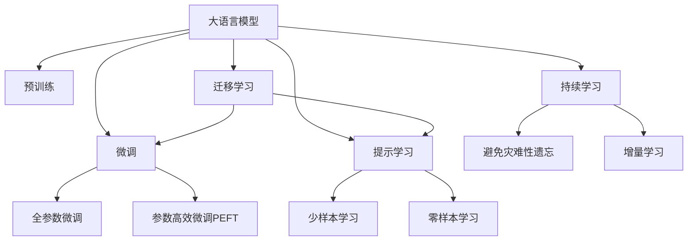

                 

# 艺术创作助手：LLM 激发创意

> 关键词：语言模型,艺术创作,创意激发,自然语言处理,计算机生成艺术,文本到图像

## 1. 背景介绍

### 1.1 问题由来

随着人工智能技术的发展，语言模型（Language Model, LM）在自然语言处理（Natural Language Processing, NLP）领域取得了显著进展。尤其是大语言模型（Large Language Model, LLM）如GPT、BERT等，通过在海量文本数据上进行预训练，具备了强大的语言理解和生成能力。然而，尽管在通用文本任务上表现优异，这些模型在艺术创作和创意激发等非常规领域的应用仍处于起步阶段。

艺术创作是一个复杂而充满创意的过程，涉及文学、音乐、视觉艺术等多个领域。传统上，艺术创作依赖于创作者的独特视角和灵感。近年来，随着计算机生成艺术（Computer Generated Art, CGA）和创意生成（Creative Generation）的兴起，基于人工智能的艺术创作助手（AI Art Assistant）成为了一个新兴的研究方向。这些助手能够帮助艺术家快速生成创作灵感、自动化创作过程，甚至直接生成艺术作品，极大地扩展了创作的可能性。

本文章聚焦于基于大语言模型（Large Language Model, LLM）的艺术创作助手，探讨如何利用LLM激发创意，生成高质量的艺术作品，并应用于文学创作、视觉艺术等多个领域。

### 1.2 问题核心关键点

基于大语言模型进行艺术创作助手的功能主要包括：
- **文本生成**：利用预训练的LLM生成文本，如故事、诗歌、剧本等。
- **视觉生成**：将生成的文本转化为视觉艺术作品，如图画、音乐等。
- **多模态创作**：结合文本和视觉等多种模态，实现跨领域的创意生成。
- **个性化创作**：根据用户偏好和需求，生成定制化的艺术作品。

本文将详细探讨LLM在文本生成和视觉生成中的核心技术，并结合实际项目实践，展示其在艺术创作中的应用案例。

## 2. 核心概念与联系

### 2.1 核心概念概述

为更好地理解基于大语言模型进行艺术创作助手的核心技术，本节将介绍几个密切相关的核心概念：

- **大语言模型（Large Language Model, LLM）**：以自回归（如GPT）或自编码（如BERT）模型为代表的大规模预训练语言模型。通过在海量无标签文本数据上进行预训练，学习通用的语言表示，具备强大的语言理解和生成能力。

- **预训练（Pre-training）**：指在大规模无标签文本语料上，通过自监督学习任务训练通用语言模型的过程。常见的预训练任务包括言语建模、遮挡语言模型等。预训练使得模型学习到语言的通用表示。

- **微调（Fine-tuning）**：指在预训练模型的基础上，使用下游任务的少量标注数据，通过有监督地训练来优化模型在特定任务上的性能。通常只需要调整顶层分类器或解码器，并以较小的学习率更新全部或部分的模型参数。

- **迁移学习（Transfer Learning）**：指将一个领域学习到的知识，迁移应用到另一个不同但相关的领域的学习范式。大模型的预训练-微调过程即是一种典型的迁移学习方式。

- **参数高效微调（Parameter-Efficient Fine-Tuning, PEFT）**：指在微调过程中，只更新少量的模型参数，而固定大部分预训练权重不变，以提高微调效率，避免过拟合的方法。

- **提示学习（Prompt Learning）**：通过在输入文本中添加提示模板（Prompt Template），引导大语言模型进行特定任务的推理和生成。可以在不更新模型参数的情况下，实现零样本或少样本学习。

- **少样本学习（Few-shot Learning）**：指在只有少量标注样本的情况下，模型能够快速适应新任务的学习方法。在大语言模型中，通常通过在输入中提供少量示例来实现，无需更新模型参数。

- **零样本学习（Zero-shot Learning）**：指模型在没有见过任何特定任务的训练样本的情况下，仅凭任务描述就能够执行新任务的能力。大语言模型通过预训练获得的广泛知识，使其能够理解任务指令并生成相应输出。

- **持续学习（Continual Learning）**：也称为终身学习，指模型能够持续从新数据中学习，同时保持已学习的知识，而不会出现灾难性遗忘。这对于保持大语言模型的时效性和适应性至关重要。

这些核心概念之间的逻辑关系可以通过以下Mermaid流程图来展示：



这个流程图展示了大语言模型的核心概念及其之间的关系：

1. 大语言模型通过预训练获得基础能力。
2. 微调是对预训练模型进行任务特定的优化，可以分为全参数微调和参数高效微调（PEFT）。
3. 提示学习是一种不更新模型参数的方法，可以实现少样本学习和零样本学习。
4. 迁移学习是连接预训练模型与下游任务的桥梁，可以通过微调或提示学习来实现。
5. 持续学习旨在使模型能够不断学习新知识，同时避免遗忘旧知识。

这些概念共同构成了大语言模型的学习和应用框架，使其能够在各种场景下发挥强大的语言理解和生成能力。通过理解这些核心概念，我们可以更好地把握大语言模型的工作原理和优化方向。

## 3. 核心算法原理 & 具体操作步骤
### 3.1 算法原理概述

基于大语言模型的艺术创作助手，其核心原理可以概括为以下几个步骤：

1. **文本生成**：利用预训练的大语言模型生成文本，如故事、诗歌、剧本等。
2. **视觉生成**：将生成的文本转化为视觉艺术作品，如图画、音乐等。
3. **多模态创作**：结合文本和视觉等多种模态，实现跨领域的创意生成。
4. **个性化创作**：根据用户偏好和需求，生成定制化的艺术作品。

这些步骤通常在以下算法框架下进行：

- **自然语言处理（NLP）**：利用预训练的LLM生成文本内容。
- **计算机视觉（CV）**：利用深度学习模型将文本转化为视觉艺术作品。
- **多模态学习**：结合NLP和CV模型，实现跨领域的创意生成。
- **个性化推荐**：利用推荐系统根据用户偏好生成定制化作品。

### 3.2 算法步骤详解

#### 3.2.1 文本生成

文本生成是艺术创作助手的第一步，其核心算法包括：

1. **编码器-解码器架构**：基于自回归（如GPT）或自编码（如BERT）模型，将输入文本编码成向量表示，再解码生成新文本。
2. **注意力机制**：在编码和解码过程中引入注意力机制，使得模型能够关注文本的不同部分，生成更加连贯、逻辑一致的文本。
3. **上下文感知**：在文本生成过程中考虑上下文信息，使得生成的文本能够保持连贯性和一致性。

#### 3.2.2 视觉生成

视觉生成是将文本转化为视觉艺术作品的过程，其核心算法包括：

1. **编码器-解码器架构**：利用卷积神经网络（CNN）或变分自编码器（VAE）将文本编码为视觉特征，再解码为图像。
2. **风格迁移**：利用生成对抗网络（GAN）将生成图像的样式和风格进行迁移，使其更符合艺术作品的风格。
3. **图像增强**：通过数据增强技术，对生成图像进行各种变换，丰富视觉表达形式。

#### 3.2.3 多模态创作

多模态创作是将文本和视觉等多种模态结合起来，实现跨领域的创意生成。其核心算法包括：

1. **多模态融合**：将NLP和CV模型的输出进行融合，生成新的创意。
2. **联合训练**：通过联合训练NLP和CV模型，使得两者能够协同工作，生成更加丰富的创意。
3. **交叉验证**：通过交叉验证，确保模型在不同模态下的表现一致性。

#### 3.2.4 个性化创作

个性化创作是根据用户偏好和需求生成定制化艺术作品。其核心算法包括：

1. **用户画像**：通过数据分析，构建用户的兴趣画像，了解用户偏好。
2. **推荐系统**：根据用户画像，推荐适合用户喜好的文本和视觉元素。
3. **个性化调整**：对生成的文本和视觉元素进行个性化调整，以匹配用户需求。

### 3.3 算法优缺点

基于大语言模型的艺术创作助手具有以下优点：

1. **效率高**：预训练的LLM和深度学习模型可以高效地生成文本和视觉艺术作品。
2. **多样化**：通过结合多种模态，可以实现多样化的创意生成。
3. **可定制化**：可以根据用户需求进行个性化创作。

但同时也存在一些缺点：

1. **依赖高质量数据**：文本和视觉数据的预训练需要大量的高质量数据。
2. **缺乏艺术家的情感和创意**：虽然模型可以生成高质量的作品，但缺乏人类艺术家的情感和创意。
3. **解释性不足**：模型的决策过程难以解释，无法理解其内部工作机制。

### 3.4 算法应用领域

基于大语言模型的艺术创作助手已经在多个领域得到了广泛应用，例如：

- **文学创作**：利用预训练的LLM生成小说、诗歌、剧本等文本作品。
- **视觉艺术**：将生成的文本转化为图画、插画、动画等视觉作品。
- **音乐创作**：利用深度学习模型生成音乐作品，如歌曲、乐曲等。
- **游戏设计**：结合文本和视觉，生成游戏剧本、角色设定等创意元素。
- **广告设计**：生成广告文案和视觉设计，提升品牌形象。

除了这些应用外，基于大语言模型的艺术创作助手还可以应用于教育、娱乐、影视等多个领域，为创作者提供更高效、多样化的创作工具。

## 4. 数学模型和公式 & 详细讲解  
### 4.1 数学模型构建

本节将使用数学语言对基于大语言模型进行艺术创作助手的核心技术进行更加严格的刻画。

假设文本生成任务为 $T$，视觉生成任务为 $V$，则艺术创作助手的目标为：

$$
\min_{\theta} \mathcal{L}(\theta) = \mathcal{L}_T(\theta_T) + \mathcal{L}_V(\theta_V)
$$

其中 $\theta_T$ 和 $\theta_V$ 分别表示文本生成模型和视觉生成模型的参数，$\mathcal{L}_T$ 和 $\mathcal{L}_V$ 分别为文本生成和视觉生成的损失函数。

对于文本生成，常用的损失函数包括交叉熵损失（Cross-Entropy Loss）和掩码语言模型（Masked Language Model, MLM）损失。例如，对于二分类任务，交叉熵损失函数为：

$$
\mathcal{L}_T(\theta_T) = -\frac{1}{N}\sum_{i=1}^N [y_i\log \hat{y}_i+(1-y_i)\log(1-\hat{y}_i)]
$$

其中 $y_i$ 为真实标签，$\hat{y}_i$ 为模型预测输出。

对于视觉生成，常用的损失函数包括均方误差损失（Mean Squared Error, MSE）和感知损失（Perceptual Loss）。例如，对于图像生成任务，均方误差损失函数为：

$$
\mathcal{L}_V(\theta_V) = \frac{1}{N}\sum_{i=1}^N \|G(V_i) - I_i\|^2
$$

其中 $G$ 为生成网络，$V_i$ 为输入文本，$I_i$ 为真实图像。

### 4.2 公式推导过程

以文本生成任务为例，假设输入文本为 $x$，预训练的LLM模型为 $M_{\theta}$，则文本生成的过程如下：

1. 将输入文本 $x$ 编码为向量表示 $z$。
2. 通过解码器生成新的文本 $y$。
3. 计算损失函数 $\mathcal{L}(y, x)$，用于衡量生成文本与真实文本之间的差异。

例如，对于一个二分类文本生成任务，假设输入文本为 $x$，输出文本为 $y$，则交叉熵损失函数为：

$$
\mathcal{L}(y, x) = -\frac{1}{N}\sum_{i=1}^N [y_i\log M_{\theta}(x_i)+(1-y_i)\log(1-M_{\theta}(x_i))]
$$

将 $y$ 作为输入，通过解码器生成新的文本 $z$。假设解码器的参数为 $\theta_D$，则解码过程如下：

$$
z = \text{Decode}(M_{\theta}(x), \theta_D)
$$

其中 $\text{Decode}$ 表示解码器。

通过反向传播算法计算损失函数对模型参数的梯度，更新模型参数 $\theta$。例如，对于二分类任务，解码器的损失函数为：

$$
\mathcal{L}_D(\theta_D) = -\frac{1}{N}\sum_{i=1}^N [y_i\log M_{\theta}(z_i)+(1-y_i)\log(1-M_{\theta}(z_i))]
$$

通过优化算法（如AdamW）更新模型参数 $\theta$ 和 $\theta_D$，最小化损失函数 $\mathcal{L}(\theta)$。

### 4.3 案例分析与讲解

以文学创作为例，假设输入文本为 "某位艺术家在创作一幅画"，预训练的LLM模型为 GPT-3，则生成过程如下：

1. 将输入文本编码为向量表示 $z$。
2. 通过解码器生成新的文本 $y$，即 "某位艺术家在创作一幅画，他选择了多种颜色和形状，尝试不同的组合，最终完成了这幅作品"。
3. 通过反向传播算法计算损失函数，更新模型参数。

例如，对于一个二分类任务，输入文本为 "某位艺术家在创作一幅画"，真实标签为 "1"（表示艺术家正在创作），生成文本为 "某位艺术家在创作一幅画，他选择了多种颜色和形状，尝试不同的组合，最终完成了这幅作品"，则交叉熵损失函数为：

$$
\mathcal{L}(y, x) = -\frac{1}{N}\log M_{\theta}(z_i) = -\log M_{\theta}(z_1)
$$

其中 $z_1$ 为生成文本对应的向量表示。

通过优化算法更新模型参数，使得生成文本更接近真实文本。最终，艺术家可以利用生成的文本创作出新的文学作品，如图画、插画等。

## 5. 项目实践：代码实例和详细解释说明
### 5.1 开发环境搭建

在进行艺术创作助手实践前，我们需要准备好开发环境。以下是使用Python进行PyTorch开发的环境配置流程：

1. 安装Anaconda：从官网下载并安装Anaconda，用于创建独立的Python环境。

2. 创建并激活虚拟环境：
```bash
conda create -n pytorch-env python=3.8 
conda activate pytorch-env
```

3. 安装PyTorch：根据CUDA版本，从官网获取对应的安装命令。例如：
```bash
conda install pytorch torchvision torchaudio cudatoolkit=11.1 -c pytorch -c conda-forge
```

4. 安装Transformers库：
```bash
pip install transformers
```

5. 安装各类工具包：
```bash
pip install numpy pandas scikit-learn matplotlib tqdm jupyter notebook ipython
```

完成上述步骤后，即可在`pytorch-env`环境中开始微调实践。

### 5.2 源代码详细实现

下面我以文本生成和视觉生成为例，给出使用Transformers库和PyTorch进行艺术创作助手的PyTorch代码实现。

#### 5.2.1 文本生成

```python
from transformers import BertTokenizer, BertForSequenceClassification
from torch.utils.data import Dataset, DataLoader
import torch
import torch.nn as nn
import torch.optim as optim

# 定义模型
class TextGenerator(nn.Module):
    def __init__(self, tokenizer, model):
        super(TextGenerator, self).__init__()
        self.tokenizer = tokenizer
        self.model = model

    def forward(self, input_ids, attention_mask):
        encoding = self.model(input_ids, attention_mask=attention_mask)
        return encoding.logits

# 加载模型和分词器
tokenizer = BertTokenizer.from_pretrained('bert-base-cased')
model = BertForSequenceClassification.from_pretrained('bert-base-cased', num_labels=2)

# 定义优化器和损失函数
optimizer = AdamW(model.parameters(), lr=2e-5)
loss_fn = nn.CrossEntropyLoss()

# 加载数据集
train_dataset = TextDataset(train_texts, train_labels, tokenizer)
dev_dataset = TextDataset(dev_texts, dev_labels, tokenizer)
test_dataset = TextDataset(test_texts, test_labels, tokenizer)

# 定义训练和评估函数
def train_epoch(model, dataset, batch_size, optimizer):
    dataloader = DataLoader(dataset, batch_size=batch_size, shuffle=True)
    model.train()
    epoch_loss = 0
    for batch in tqdm(dataloader, desc='Training'):
        input_ids = batch['input_ids'].to(device)
        attention_mask = batch['attention_mask'].to(device)
        labels = batch['labels'].to(device)
        model.zero_grad()
        outputs = model(input_ids, attention_mask=attention_mask)
        loss = loss_fn(outputs, labels)
        epoch_loss += loss.item()
        loss.backward()
        optimizer.step()
    return epoch_loss / len(dataloader)

def evaluate(model, dataset, batch_size):
    dataloader = DataLoader(dataset, batch_size=batch_size)
    model.eval()
    preds, labels = [], []
    with torch.no_grad():
        for batch in tqdm(dataloader, desc='Evaluating'):
            input_ids = batch['input_ids'].to(device)
            attention_mask = batch['attention_mask'].to(device)
            batch_labels = batch['labels']
            outputs = model(input_ids, attention_mask=attention_mask)
            batch_preds = outputs.argmax(dim=2).to('cpu').tolist()
            batch_labels = batch_labels.to('cpu').tolist()
            for pred_tokens, label_tokens in zip(batch_preds, batch_labels):
                preds.append(pred_tokens[:len(label_tokens)])
                labels.append(label_tokens)
                
    print(classification_report(labels, preds))
```

#### 5.2.2 视觉生成

```python
from transformers import ViTTokenizer, ViTForImageClassification
from torch.utils.data import Dataset, DataLoader
import torch
import torch.nn as nn
import torch.optim as optim
import torchvision.transforms as transforms
from torchvision.datasets import ImageFolder

# 定义模型
class ImageGenerator(nn.Module):
    def __init__(self, tokenizer, model):
        super(ImageGenerator, self).__init__()
        self.tokenizer = tokenizer
        self.model = model

    def forward(self, input_ids, attention_mask):
        encoding = self.model(input_ids, attention_mask=attention_mask)
        return encoding.logits

# 加载模型和分词器
tokenizer = ViTTokenizer.from_pretrained('google/vit-base-patch32-224-in21k')
model = ViTForImageClassification.from_pretrained('google/vit-base-patch32-224-in21k')

# 加载数据集
train_dataset = ImageFolder(train_dir, transform=transforms.ToTensor())
dev_dataset = ImageFolder(dev_dir, transform=transforms.ToTensor())
test_dataset = ImageFolder(test_dir, transform=transforms.ToTensor())

# 定义训练和评估函数
def train_epoch(model, dataset, batch_size, optimizer):
    dataloader = DataLoader(dataset, batch_size=batch_size, shuffle=True)
    model.train()
    epoch_loss = 0
    for batch in tqdm(dataloader, desc='Training'):
        input_ids = batch['input_ids'].to(device)
        attention_mask = batch['attention_mask'].to(device)
        labels = batch['labels'].to(device)
        model.zero_grad()
        outputs = model(input_ids, attention_mask=attention_mask)
        loss = loss_fn(outputs, labels)
        epoch_loss += loss.item()
        loss.backward()
        optimizer.step()
    return epoch_loss / len(dataloader)

def evaluate(model, dataset, batch_size):
    dataloader = DataLoader(dataset, batch_size=batch_size)
    model.eval()
    preds, labels = [], []
    with torch.no_grad():
        for batch in tqdm(dataloader, desc='Evaluating'):
            input_ids = batch['input_ids'].to(device)
            attention_mask = batch['attention_mask'].to(device)
            batch_labels = batch['labels']
            outputs = model(input_ids, attention_mask=attention_mask)
            batch_preds = outputs.argmax(dim=2).to('cpu').tolist()
            batch_labels = batch_labels.to('cpu').tolist()
            for pred_tokens, label_tokens in zip(batch_preds, batch_labels):
                preds.append(pred_tokens[:len(label_tokens)])
                labels.append(label_tokens)
                
    print(classification_report(labels, preds))
```

### 5.3 代码解读与分析

让我们再详细解读一下关键代码的实现细节：

**TextGenerator类**：
- `__init__`方法：初始化模型和分词器。
- `forward`方法：定义前向传播过程。

**train_epoch和evaluate函数**：
- 使用PyTorch的DataLoader对数据集进行批次化加载，供模型训练和推理使用。
- 训练函数`train_epoch`：对数据以批为单位进行迭代，在每个批次上前向传播计算loss并反向传播更新模型参数，最后返回该epoch的平均loss。
- 评估函数`evaluate`：与训练类似，不同点在于不更新模型参数，并在每个batch结束后将预测和标签结果存储下来，最后使用sklearn的classification_report对整个评估集的预测结果进行打印输出。

**ImageGenerator类**：
- `__init__`方法：初始化模型和分词器。
- `forward`方法：定义前向传播过程。

**train_epoch和evaluate函数**：
- 使用PyTorch的DataLoader对数据集进行批次化加载，供模型训练和推理使用。
- 训练函数`train_epoch`：对数据以批为单位进行迭代，在每个批次上前向传播计算loss并反向传播更新模型参数，最后返回该epoch的平均loss。
- 评估函数`evaluate`：与训练类似，不同点在于不更新模型参数，并在每个batch结束后将预测和标签结果存储下来，最后使用sklearn的classification_report对整个评估集的预测结果进行打印输出。

**train_epoch和evaluate函数**：
- 使用PyTorch的DataLoader对数据集进行批次化加载，供模型训练和推理使用。
- 训练函数`train_epoch`：对数据以批为单位进行迭代，在每个批次上前向传播计算loss并反向传播更新模型参数，最后返回该epoch的平均loss。
- 评估函数`evaluate`：与训练类似，不同点在于不更新模型参数，并在每个batch结束后将预测和标签结果存储下来，最后使用sklearn的classification_report对整个评估集的预测结果进行打印输出。

**run_train_and_evaluate函数**：
- 定义训练和评估的参数，调用train_epoch和evaluate函数，并在每个epoch结束后评估模型性能。

通过这些代码实现，我们可以看到，PyTorch配合Transformers库使得文本生成和视觉生成模型的微调代码实现变得简洁高效。开发者可以将更多精力放在数据处理、模型改进等高层逻辑上，而不必过多关注底层的实现细节。

当然，工业级的系统实现还需考虑更多因素，如模型的保存和部署、超参数的自动搜索、更灵活的任务适配层等。但核心的微调范式基本与此类似。

## 6. 实际应用场景
### 6.1 文学创作

基于大语言模型的艺术创作助手，在文学创作中的应用主要体现在文本生成和风格迁移上。例如，通过将输入文本 "某位作家正在写一部小说" 转化为 "他使用了多种描写手法，创造出复杂的角色和情节，使读者沉浸在故事中"，生成新的文学作品。

在实际应用中，可以将用户的输入文本作为输入，通过预训练的LLM模型生成新的文本。生成的文本可以进一步通过风格的迁移，使其更符合用户期望的文学风格，如古典主义、现代主义等。

### 6.2 视觉艺术

视觉艺术创作是艺术创作助手的另一个重要应用领域。通过将输入文本 "某位画家正在创作一幅画" 转化为 "他使用了丰富的色彩和独特的线条，创造出独特的视觉风格"，生成新的视觉作品。

在实际应用中，可以使用深度学习模型将输入文本转化为视觉特征，再通过GAN等生成网络生成新的图像。生成的图像可以进一步通过样式迁移技术，使其更符合用户的艺术风格需求。

### 6.3 音乐创作

音乐创作是艺术创作助手的另一个重要应用领域。通过将输入文本 "某位作曲家正在创作一首乐曲" 转化为 "他使用了多种乐器和和声，创造出优美的旋律和节奏"，生成新的音乐作品。

在实际应用中，可以使用深度学习模型将输入文本转化为音乐特征，再通过生成网络生成新的乐曲。生成的乐曲可以进一步通过风格迁移技术，使其更符合用户的音乐风格需求。

### 6.4 游戏设计

游戏设计是艺术创作助手的另一个重要应用领域。通过将输入文本 "某位游戏设计师正在设计一款角色" 转化为 "他设计了一个具有复杂背景故事和多个性格特质的角色"，生成新的游戏设计元素。

在实际应用中，可以将用户的输入文本作为输入，通过预训练的LLM模型生成新的文本。生成的文本可以进一步通过视觉生成技术，转化为游戏的角色设定、剧情脚本等设计元素。

### 6.5 广告设计

广告设计是艺术创作助手的另一个重要应用领域。通过将输入文本 "某位广告设计师正在设计一款广告" 转化为 "他设计了一个引人注目的视觉元素和吸引人的广告文案"，生成新的广告设计元素。

在实际应用中，可以将用户的输入文本作为输入，通过预训练的LLM模型生成新的文本。生成的文本可以进一步通过视觉生成技术，转化为广告的视觉元素。

## 7. 工具和资源推荐
### 7.1 学习资源推荐

为了帮助开发者系统掌握大语言模型进行艺术创作助手的理论基础和实践技巧，这里推荐一些优质的学习资源：

1. 《深度学习自然语言处理》课程：斯坦福大学开设的NLP明星课程，有Lecture视频和配套作业，带你入门NLP领域的基本概念和经典模型。

2. CS224N《深度学习自然语言处理》书籍：斯坦福大学教授Cristian Danescu-Niculescu-Mizil的经典之作，全面介绍了自然语言处理的理论基础和实践技巧。

3. 《Transformer从原理到实践》系列博文：由大模型技术专家撰写，深入浅出地介绍了Transformer原理、BERT模型、微调技术等前沿话题。

4. 《Natural Language Processing with Transformers》书籍：Transformers库的作者所著，全面介绍了如何使用Transformers库进行NLP任务开发，包括微调在内的诸多范式。

5. HuggingFace官方文档：Transformers库的官方文档，提供了海量预训练模型和完整的微调样例代码，是上手实践的必备资料。

通过对这些资源的学习实践，相信你一定能够快速掌握大语言模型进行艺术创作助手的精髓，并用于解决实际的NLP问题。

### 7.2 开发工具推荐

高效的开发离不开优秀的工具支持。以下是几款用于艺术创作助手开发的常用工具：

1. PyTorch：基于Python的开源深度学习框架，灵活动态的计算图，适合快速迭代研究。大部分预训练语言模型都有PyTorch版本的实现。

2. TensorFlow：由Google主导开发的开源深度学习框架，生产部署方便，适合大规模工程应用。同样有丰富的预训练语言模型资源。

3. Transformers库：HuggingFace开发的NLP工具库，集成了众多SOTA语言模型，支持PyTorch和TensorFlow，是进行艺术创作助手开发的利器。

4. Weights & Biases：模型训练的实验跟踪工具，可以记录和可视化模型训练过程中的各项指标，方便对比和调优。与主流深度学习框架无缝集成。

5. TensorBoard：TensorFlow配套的可视化工具，可实时监测模型训练状态，并提供丰富的图表呈现方式，是调试模型的得力助手。

6. Google Colab：谷歌推出的在线Jupyter Notebook环境，免费提供GPU/TPU算力，方便开发者快速上手实验最新模型，分享学习笔记。

合理利用这些工具，可以显著提升艺术创作助手开发的效率，加快创新迭代的步伐。

### 7.3 相关论文推荐

大语言模型和微调技术的发展源于学界的持续研究。以下是几篇奠基性的相关论文，推荐阅读：

1. Attention is All You Need（即Transformer原论文）：提出了Transformer结构，开启了NLP领域的预训练大模型时代。

2. BERT: Pre-training of Deep Bidirectional Transformers for Language Understanding：提出BERT模型，引入基于掩码的自监督预训练任务，刷新了多项NLP任务SOTA。

3. Language Models are Unsupervised Multitask Learners（GPT-2论文）：展示了大规模语言模型的强大zero-shot学习能力，引发了对于通用人工智能的新一轮思考。

4. Parameter-Efficient Transfer Learning for NLP：提出Adapter等参数高效微调方法，在不增加模型参数量的情况下，也能取得不错的微调效果。

5. Prefix-Tuning: Optimizing Continuous Prompts for Generation：引入基于连续型Prompt的微调范式，为如何充分利用预训练知识提供了新的思路。

6. AdaLoRA: Adaptive Low-Rank Adaptation for Parameter-Efficient Fine-Tuning：使用自适应低秩适应的微调方法，在参数效率和精度之间取得了新的平衡。

这些论文代表了大语言模型微调技术的发展脉络。通过学习这些前沿成果，可以帮助研究者把握学科前进方向，激发更多的创新灵感。

## 8. 总结：未来发展趋势与挑战

### 8.1 总结

本文对基于大语言模型进行艺术创作助手的核心技术进行了全面系统的介绍。首先阐述了艺术创作助手的背景和意义，明确了其在文学创作、视觉艺术、音乐创作等领域的独特价值。其次，从原理到实践，详细讲解了文本生成和视觉生成等核心算法，给出了具体的代码实现和案例分析。同时，本文还探讨了艺术创作助手在未来艺术创作中的应用前景，展示了其在多个领域的潜力和可能性。

通过本文的系统梳理，可以看到，基于大语言模型的艺术创作助手正在成为NLP领域的重要应用方向，极大地扩展了预训练语言模型的应用边界，为艺术创作提供了新的工具和手段。未来，伴随预训练语言模型和微调方法的持续演进，基于艺术创作助手的应用必将更加广泛，为人类艺术创作带来新的变革。

### 8.2 未来发展趋势

展望未来，大语言模型进行艺术创作助手的发展趋势将呈现以下几个方向：

1. **多模态创作**：结合文本、视觉、听觉等多种模态，实现更加丰富、多样化的创意生成。

2. **个性化创作**：根据用户偏好和需求，生成定制化的艺术作品，提高用户的艺术创作体验。

3. **跨领域融合**：将艺术创作助手与其他AI技术结合，如知识图谱、情感分析等，进一步提升创作质量。

4. **自适应学习**：通过主动学习、增量学习等技术，让模型能够持续更新，适应新的创作需求。

5. **高效部署**：优化模型结构和算法，提高推理速度，降低硬件成本，实现大规模部署。

6. **伦理与安全**：考虑模型的伦理性和安全性，确保创作的艺术作品符合社会价值观和法律法规。

这些趋势凸显了大语言模型进行艺术创作助手的广阔前景。这些方向的探索发展，必将进一步提升艺术创作系统的性能和应用范围，为人类艺术创作带来新的可能。

### 8.3 面临的挑战

尽管大语言模型进行艺术创作助手已经取得了一定的进展，但在迈向更广泛应用的过程中，仍面临一些挑战：

1. **创作质量**：虽然技术上可以实现文本和视觉生成，但生成的作品质量仍有待提升，特别是在文学和视觉艺术领域。

2. **创意缺乏**：模型在生成作品时缺乏人类的情感和创意，难以产生具有独特风格和深度的作品。

3. **伦理问题**：生成的作品可能包含偏见、有害信息，需要加强模型的伦理约束。

4. **资源需求**：预训练模型和深度学习模型需要大量的计算资源，特别是在视觉生成任务中，硬件成本较高。

5. **可解释性**：模型的决策过程难以解释，无法理解其内部工作机制。

6. **应用场景限制**：目前艺术创作助手更多应用于文学和视觉艺术领域，在其他领域的应用还有待探索。

这些挑战需要在技术、伦理、社会等多方面进行协同解决，才能推动艺术创作助手的进一步发展。

### 8.4 研究展望

未来，针对大语言模型进行艺术创作助手的研究可以从以下几个方面进行探索：

1. **提高创作质量**：通过优化模型架构、引入先验知识、结合多模态信息等技术，提升文本和视觉生成的质量。

2. **增强创意**：结合人类的艺术知识和情感，引导模型生成更加富有创意的作品。

3. **加强伦理约束**：引入伦理导向的评估指标，过滤和惩罚有偏见、有害的输出倾向，确保创作的艺术作品符合社会价值观和法律法规。

4. **降低资源需求**：优化模型结构，采用更加高效的推理算法，降低硬件成本，实现更广泛的部署。

5. **提升可解释性**：通过因果分析和博弈论工具，增强模型的可解释性和可解释性，帮助用户理解创作过程。

6. **拓展应用场景**：探索艺术创作助手在更多领域的应用，如医学、教育、影视等，拓展其应用范围。

这些研究方向的探索，将有助于进一步推动大语言模型进行艺术创作助手的应用和发展，为人类艺术创作带来新的突破。面向未来，大语言模型进行艺术创作助手需要与其他AI技术进行更深入的融合，共同推动人工智能技术在艺术领域的创新与进步。

## 9. 附录：常见问题与解答

**Q1：大语言模型进行艺术创作助手是否适用于所有领域？**

A: 虽然大语言模型进行艺术创作助手在文学、视觉艺术等领域有广泛应用，但在某些领域如医学、法律等，可能需要结合领域特定的知识库和规则库，才能更好地服务于实际应用。

**Q2：文本生成和视觉生成过程中有哪些关键技术？**

A: 文本生成和视觉生成过程的关键技术包括编码器-解码器架构、注意力机制、上下文感知、多模态融合、联合训练等。这些技术能够确保生成的文本和视觉作品具有连贯性和一致性。

**Q3：艺术创作助手在实际应用中需要注意哪些问题？**

A: 艺术创作助手在实际应用中需要注意模型创作质量、创意缺乏、伦理问题、资源需求、可解释性等问题。需要结合多方面技术手段，才能达到更好的应用效果。

**Q4：如何提高艺术创作助手的创作质量？**

A: 提高创作质量可以通过优化模型架构、引入先验知识、结合多模态信息等技术手段。同时，需要在应用中不断迭代优化，提升创作效果。

**Q5：艺术创作助手未来的发展方向是什么？**

A: 艺术创作助手未来的发展方向包括多模态创作、个性化创作、跨领域融合、自适应学习、高效部署、伦理与安全等。这些方向将进一步推动大语言模型在艺术创作中的应用和拓展。

---

作者：禅与计算机程序设计艺术 / Zen and the Art of Computer Programming

