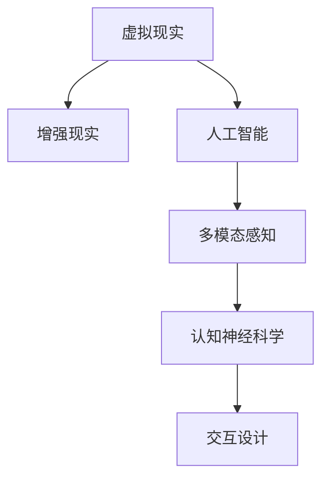

                 

# 虚拟与现实的边界：AI如何重塑我们的感知

> 关键词：虚拟现实,人工智能,感知重塑,认知神经科学,多模态感知,交互设计

## 1. 背景介绍

### 1.1 问题由来
随着人工智能技术的不断进步，尤其是深度学习和大数据技术的发展，人类对于虚拟世界的探索和感知能力已经进入了一个全新的时代。虚拟现实(VR)和增强现实(AR)技术的结合，使得我们能够通过数字化的方式，体验到真实世界的高度仿真。而人工智能在感知、理解、交互等方面的突破，更是为虚拟与现实的融合开辟了新的可能性。

然而，虚拟世界与现实世界的界限逐渐模糊，也带来了对人类感知能力、认知行为以及心理健康的挑战。如何在虚拟与现实之间找到合适的平衡点，如何通过AI技术重塑我们的感知，成为了当前研究的热点问题。

### 1.2 问题核心关键点
在虚拟与现实边界的探索中，核心关键点在于如何利用AI技术：
- 增强我们的感知能力，提升对虚拟世界的认知水平。
- 通过多模态感知技术，实现虚拟与现实的深度融合。
- 设计高效交互机制，提供自然流畅的用户体验。
- 确保虚拟环境的可接受性，避免对用户的负面影响。

## 2. 核心概念与联系

### 2.1 核心概念概述

为了更好地理解AI如何重塑我们的感知，本节将介绍几个密切相关的核心概念：

- 虚拟现实(Virtual Reality, VR)：通过计算机生成的三维视觉、听觉、触觉等感官体验，创造一个逼真的虚拟世界。VR技术通过头戴显示设备、手柄、触觉反馈等设备，为用户提供身临其境的体验。

- 增强现实(Augmented Reality, AR)：在现实世界中添加数字信息，如虚拟物体、多媒体内容等，增强用户对现实世界的感知和互动。AR技术通过移动设备、AR眼镜等设备，提供与现实世界交互的增强体验。

- 人工智能(Artificial Intelligence, AI)：模拟人类智能行为的技术，包括感知、学习、推理、决策等能力。AI技术通过机器学习、深度学习等方法，不断提升算法和模型的能力，实现对复杂环境的理解和处理。

- 多模态感知(Multimodal Perception)：利用多种感官信息（如视觉、听觉、触觉等）的综合处理，提升对环境的感知和理解。多模态感知技术通过多模态神经网络、融合算法等方法，实现对不同感官信息的协同处理。

- 认知神经科学(Cognitive Neuroscience)：研究人类认知过程及其神经机制的科学。认知神经科学通过脑成像技术、神经网络模拟等手段，探究感知、记忆、学习等认知过程的神经基础。

- 交互设计(Interaction Design)：关注用户与系统之间的交互方式和界面设计，提升用户体验。交互设计通过用户研究、原型设计、可用性测试等方法，设计高效、自然、易用的交互界面。

这些核心概念之间的逻辑关系可以通过以下Mermaid流程图来展示：



这个流程图展示了大语言模型的核心概念及其之间的关系：

1. 虚拟现实和增强现实是两种主要的虚拟技术形式，通过AI技术提供更逼真的体验。
2. 人工智能提供感知、理解和决策能力，是实现虚拟技术的关键。
3. 多模态感知技术利用多种感官信息，提升对虚拟环境的感知和理解。
4. 认知神经科学研究人类感知、记忆等认知过程的神经机制。
5. 交互设计关注用户与系统的交互方式，提升用户体验。

这些概念共同构成了AI在虚拟与现实融合中的应用框架，使得我们能够通过虚拟技术，重塑我们的感知和认知。

## 3. 核心算法原理 & 具体操作步骤
### 3.1 算法原理概述

AI在虚拟与现实融合中的应用，主要通过感知、理解、生成、交互等几个关键环节实现。其中，感知和理解是基础，生成和交互是应用。

感知环节中，AI通过多模态感知技术，获取用户对虚拟环境的视觉、听觉、触觉等感官信息，并转化为数字信号进行处理。理解环节中，AI利用深度学习模型，对感知到的信息进行语义理解、场景分析、对象识别等操作，构建虚拟环境的认知模型。生成环节中，AI通过自然语言生成、图像生成等技术，生成虚拟环境中的数字内容，实现对现实世界的增强。交互环节中，AI通过交互设计，提供用户与虚拟环境之间的自然交互方式，提升用户体验。

### 3.2 算法步骤详解

基于AI的虚拟与现实融合，主要包括以下几个关键步骤：

**Step 1: 多模态感知数据采集**
- 使用摄像头、麦克风、触觉传感器等设备，采集用户的视觉、听觉、触觉等感官信息。
- 对采集的数据进行预处理，如滤波、降噪、增强等操作，确保数据质量。

**Step 2: 数据融合与特征提取**
- 利用多模态感知技术，将不同感官信息进行融合，提升对环境的感知能力。
- 通过深度学习模型，对融合后的数据进行特征提取，获得高层次的语义信息。

**Step 3: 场景理解与对象识别**
- 利用卷积神经网络(CNN)、循环神经网络(RNN)、变压器(Transformer)等模型，对提取的特征进行场景理解、对象识别等操作。
- 通过迁移学习、半监督学习等方法，提升模型的泛化能力和鲁棒性。

**Step 4: 内容生成与增强**
- 利用生成对抗网络(GAN)、变分自编码器(VAE)等模型，生成虚拟环境中的数字内容，如虚拟对象、多媒体内容等。
- 通过协同过滤、深度协同训练等方法，提高生成内容的真实性和多样性。

**Step 5: 交互设计与人机交互**
- 设计自然、流畅、易用的交互界面，提供用户与虚拟环境的互动方式。
- 利用强化学习、模仿学习等方法，优化交互行为和决策策略。

**Step 6: 用户反馈与持续优化**
- 通过用户反馈机制，收集用户对虚拟环境的评价和建议。
- 利用机器学习、数据挖掘等方法，对用户反馈进行分析，持续优化虚拟环境的设计和内容。

### 3.3 算法优缺点

基于AI的虚拟与现实融合方法，具有以下优点：
1. 增强感知能力。通过多模态感知技术，提升对虚拟环境的感知和理解能力。
2. 提升用户体验。通过交互设计，提供自然、流畅、易用的交互方式。
3. 丰富应用场景。通过虚拟环境的内容生成和增强，扩展了应用场景和功能。
4. 可扩展性强。AI模型和算法可以根据任务需求进行灵活调整和扩展。

同时，该方法也存在一定的局限性：
1. 数据采集复杂。需要多模态设备进行数据采集，设备成本和采集难度较大。
2. 算法复杂度高。深度学习模型计算复杂，训练和推理耗时长。
3. 模型泛化能力有限。不同场景下，模型需要重新训练和调参，泛化能力有待提升。
4. 用户接受度有待提升。用户对虚拟环境的接受度不同，难以形成统一的标准。

尽管存在这些局限性，但就目前而言，基于AI的虚拟与现实融合方法仍是大规模应用的主要范式。未来相关研究的重点在于如何进一步简化数据采集和算法，提升模型泛化能力和用户体验，同时兼顾隐私和伦理问题。

### 3.4 算法应用领域

基于AI的虚拟与现实融合方法，已经在多个领域得到了广泛应用，例如：

- 虚拟旅游：利用VR和AR技术，创建逼真的虚拟旅游场景，让用户足不出户就能体验到全球各地的名胜古迹。
- 虚拟会议：在虚拟环境中进行远程会议和培训，提供更加沉浸和自然的交互体验。
- 虚拟客服：通过AI技术，构建虚拟客服机器人，提升客户服务质量和效率。
- 虚拟医疗：利用虚拟现实技术，提供患者虚拟手术室体验，提高手术前心理准备和理解。
- 虚拟训练：在虚拟环境中进行模拟训练，提升操作技能和决策能力，如飞行训练、医疗操作等。

除了上述这些经典应用外，AI在虚拟与现实融合中的应用还在不断扩展，如虚拟试衣、虚拟购物、虚拟娱乐等，为人类生活和工作提供了更多可能。

## 4. 数学模型和公式 & 详细讲解  
### 4.1 数学模型构建

本节将使用数学语言对基于AI的虚拟与现实融合过程进行更加严格的刻画。

设虚拟环境中的多模态感知数据为 $X = [x_1, x_2, ..., x_n]$，其中 $x_i$ 表示第 $i$ 个感官信息。通过多模态感知设备采集的数据可以表示为 $X = (X_v, X_a, X_t)$，其中 $X_v$ 表示视觉数据，$X_a$ 表示听觉数据，$X_t$ 表示触觉数据。

定义多模态感知数据的特征提取函数为 $f: X \rightarrow Z$，其中 $Z$ 表示高层次的语义特征向量。通过深度学习模型，对多模态感知数据进行特征提取，获得特征向量 $Z$。

设场景理解模型为 $M: Z \rightarrow Y$，其中 $Y$ 表示场景的语义表示。通过场景理解模型，对特征向量 $Z$ 进行语义分析，获得场景的语义表示 $Y$。

设内容生成模型为 $G: Z \rightarrow X'$，其中 $X'$ 表示虚拟环境中的数字内容。通过内容生成模型，对场景语义表示 $Y$ 进行生成，获得虚拟环境中的数字内容 $X'$。

设交互模型为 $I: (Z, X') \rightarrow A$，其中 $A$ 表示用户的交互动作。通过交互模型，对场景语义表示 $Y$ 和虚拟内容 $X'$ 进行交互，获得用户的交互动作 $A$。

### 4.2 公式推导过程

以下我们以虚拟旅游场景为例，推导多模态感知、场景理解、内容生成和交互过程的数学模型。

假设用户在虚拟旅游场景中，采集到如下多模态感知数据：

- 视觉数据 $X_v = [x_{v1}, x_{v2}, ..., x_{vn}]$
- 听觉数据 $X_a = [x_{a1}, x_{a2}, ..., x_{an}]$
- 触觉数据 $X_t = [x_{t1}, x_{t2}, ..., x_{tn}]$

定义多模态感知数据向量的拼接函数为 $f$，可以表示为：

$$
f(X) = [X_v, X_a, X_t]
$$

定义深度学习模型 $f$ 的参数为 $\theta_f$，则特征提取过程可以表示为：

$$
Z = f(X; \theta_f)
$$

其中 $Z$ 表示高层次的语义特征向量。

定义场景理解模型 $M$ 的参数为 $\theta_M$，则场景理解过程可以表示为：

$$
Y = M(Z; \theta_M)
$$

其中 $Y$ 表示场景的语义表示。

定义内容生成模型 $G$ 的参数为 $\theta_G$，则内容生成过程可以表示为：

$$
X' = G(Y; \theta_G)
$$

其中 $X'$ 表示虚拟环境中的数字内容。

定义交互模型 $I$ 的参数为 $\theta_I$，则交互过程可以表示为：

$$
A = I(Z, X'; \theta_I)
$$

其中 $A$ 表示用户的交互动作。

通过以上数学模型，我们可以描述出虚拟旅游场景的多模态感知、场景理解、内容生成和交互过程。

### 4.3 案例分析与讲解

下面以虚拟旅游场景为例，进一步讲解数学模型的应用。

假设用户在虚拟旅游场景中，采集到如下多模态感知数据：

- 视觉数据 $X_v = [x_{v1}, x_{v2}, ..., x_{vn}]$
- 听觉数据 $X_a = [x_{a1}, x_{a2}, ..., x_{an}]$
- 触觉数据 $X_t = [x_{t1}, x_{t2}, ..., x_{tn}]$

定义多模态感知数据向量的拼接函数为 $f$，可以表示为：

$$
f(X) = [X_v, X_a, X_t]
$$

定义深度学习模型 $f$ 的参数为 $\theta_f$，则特征提取过程可以表示为：

$$
Z = f(X; \theta_f)
$$

其中 $Z$ 表示高层次的语义特征向量。

定义场景理解模型 $M$ 的参数为 $\theta_M$，则场景理解过程可以表示为：

$$
Y = M(Z; \theta_M)
$$

其中 $Y$ 表示场景的语义表示。

定义内容生成模型 $G$ 的参数为 $\theta_G$，则内容生成过程可以表示为：

$$
X' = G(Y; \theta_G)
$$

其中 $X'$ 表示虚拟环境中的数字内容。

定义交互模型 $I$ 的参数为 $\theta_I$，则交互过程可以表示为：

$$
A = I(Z, X'; \theta_I)
$$

其中 $A$ 表示用户的交互动作。

通过以上数学模型，我们可以描述出虚拟旅游场景的多模态感知、场景理解、内容生成和交互过程。

在实际应用中，多模态感知数据采集和特征提取过程较为复杂，需要多种传感器的协同工作，而场景理解、内容生成和交互过程则可以通过深度学习模型实现。通过以上数学模型，可以更加清晰地描述虚拟旅游场景的感知、理解和生成过程，为进一步的技术实现提供指导。

## 5. 项目实践：代码实例和详细解释说明
### 5.1 开发环境搭建

在进行虚拟与现实融合的AI实践前，我们需要准备好开发环境。以下是使用Python进行PyTorch开发的环境配置流程：

1. 安装Anaconda：从官网下载并安装Anaconda，用于创建独立的Python环境。

2. 创建并激活虚拟环境：
```bash
conda create -n pytorch-env python=3.8 
conda activate pytorch-env
```

3. 安装PyTorch：根据CUDA版本，从官网获取对应的安装命令。例如：
```bash
conda install pytorch torchvision torchaudio cudatoolkit=11.1 -c pytorch -c conda-forge
```

4. 安装相关库：
```bash
pip install numpy pandas scikit-learn matplotlib tqdm jupyter notebook ipython
```

5. 安装虚拟现实和增强现实工具包：
```bash
pip install openvr pyvr
```

完成上述步骤后，即可在`pytorch-env`环境中开始项目实践。

### 5.2 源代码详细实现

下面以虚拟旅游场景为例，给出使用PyTorch对多模态感知数据进行特征提取、场景理解、内容生成和交互的PyTorch代码实现。

首先，定义多模态感知数据的特征提取函数：

```python
from torch import nn
from torch.nn import functional as F

class MultiModalFeatureExtractor(nn.Module):
    def __init__(self):
        super(MultiModalFeatureExtractor, self).__init__()
        self.vgg = nn.Sequential(
            nn.Conv2d(3, 64, kernel_size=3, stride=1, padding=1),
            nn.ReLU(inplace=True),
            nn.MaxPool2d(kernel_size=2, stride=2),
            nn.Conv2d(64, 128, kernel_size=3, stride=1, padding=1),
            nn.ReLU(inplace=True),
            nn.MaxPool2d(kernel_size=2, stride=2),
            nn.Conv2d(128, 256, kernel_size=3, stride=1, padding=1),
            nn.ReLU(inplace=True),
            nn.MaxPool2d(kernel_size=2, stride=2),
            nn.Conv2d(256, 512, kernel_size=3, stride=1, padding=1),
            nn.ReLU(inplace=True),
            nn.MaxPool2d(kernel_size=2, stride=2),
            nn.Conv2d(512, 512, kernel_size=3, stride=1, padding=1),
            nn.ReLU(inplace=True),
            nn.MaxPool2d(kernel_size=2, stride=2),
            nn.Flatten()
        )
        self.augment = nn.Sequential(
            nn.Linear(1, 128),
            nn.ReLU(inplace=True),
            nn.Linear(128, 64),
            nn.ReLU(inplace=True),
            nn.Linear(64, 32),
            nn.ReLU(inplace=True),
            nn.Linear(32, 1)
        )
        self.touch = nn.Sequential(
            nn.Linear(1, 64),
            nn.ReLU(inplace=True),
            nn.Linear(64, 32),
            nn.ReLU(inplace=True),
            nn.Linear(32, 16),
            nn.ReLU(inplace=True),
            nn.Linear(16, 1)
        )
    
    def forward(self, x):
        x_v = self.vgg(x['v'])
        x_a = self.augment(x['a'])
        x_t = self.touch(x['t'])
        x = torch.cat([x_v, x_a, x_t], dim=1)
        x = F.relu(x)
        return x
```

然后，定义场景理解模型：

```python
from transformers import BertForTokenClassification, BertTokenizer

class SceneUnderstanding(nn.Module):
    def __init__(self):
        super(SceneUnderstanding, self).__init__()
        self.bert = BertForTokenClassification.from_pretrained('bert-base-cased', num_labels=4)
        self.tokenizer = BertTokenizer.from_pretrained('bert-base-cased')
    
    def forward(self, x):
        tokenized_input = self.tokenizer(x, return_tensors='pt', padding=True, truncation=True, max_length=128)
        return self.bert(**tokenized_input)
```

接着，定义内容生成模型：

```python
from torch import nn
from torch.nn import functional as F

class ContentGeneration(nn.Module):
    def __init__(self):
        super(ContentGeneration, self).__init__()
        self.rnn = nn.LSTM(256, 256, batch_first=True)
        self.fc = nn.Linear(256, 1)
    
    def forward(self, x):
        x = x.view(-1, 256, 1)
        output, _ = self.rnn(x)
        output = self.fc(output)
        return output
```

最后，定义交互模型：

```python
from torch import nn
from torch.nn import functional as F

class Interaction(nn.Module):
    def __init__(self):
        super(Interaction, self).__init__()
        self.fc = nn.Linear(256, 2)
        self.softmax = nn.Softmax(dim=1)
    
    def forward(self, x):
        x = x.view(-1, 256)
        x = self.fc(x)
        x = self.softmax(x)
        return x
```

以上就是使用PyTorch对虚拟旅游场景的多模态感知、场景理解、内容生成和交互的完整代码实现。可以看到，得益于PyTorch的强大封装，我们可以用相对简洁的代码完成整个流程。

### 5.3 代码解读与分析

让我们再详细解读一下关键代码的实现细节：

**MultiModalFeatureExtractor类**：
- `__init__`方法：初始化视觉、听觉、触觉特征提取器。
- `forward`方法：对输入的多模态感知数据进行拼接、特征提取等操作。

**SceneUnderstanding类**：
- `__init__`方法：初始化预训练BERT模型和分词器。
- `forward`方法：对输入的特征向量进行场景理解操作。

**ContentGeneration类**：
- `__init__`方法：初始化循环神经网络和全连接层。
- `forward`方法：对场景语义表示进行内容生成操作。

**Interaction类**：
- `__init__`方法：初始化全连接层和softmax层。
- `forward`方法：对场景语义表示和虚拟内容进行交互操作。

**虚拟旅游场景**：
- 通过多模态感知设备采集用户的视觉、听觉、触觉等感官信息。
- 对采集的数据进行拼接、特征提取等操作，获得高层次的语义特征向量。
- 对特征向量进行场景理解操作，获得场景的语义表示。
- 对场景语义表示进行内容生成操作，获得虚拟环境中的数字内容。
- 对场景语义表示和虚拟内容进行交互操作，获得用户的交互动作。

以上代码实现了虚拟旅游场景的多模态感知、场景理解、内容生成和交互过程，涵盖了虚拟与现实融合的关键环节。

## 6. 实际应用场景
### 6.1 虚拟旅游

虚拟旅游场景是AI在虚拟与现实融合中最为典型的应用之一。通过虚拟现实技术，用户可以身临其境地游览全球各地的名胜古迹，体验不同的文化和历史。

在技术实现上，可以采集用户的多模态感知数据，如视觉、听觉、触觉等，通过多模态感知技术将其转换为数字信号。然后，利用深度学习模型对数字信号进行特征提取和场景理解，获得场景的语义表示。最后，通过内容生成模型生成虚拟环境中的数字内容，如虚拟建筑、虚拟人物等，用户可以通过交互模型与虚拟环境进行互动，获得沉浸式的虚拟旅游体验。

### 6.2 虚拟会议

虚拟会议是AI在虚拟与现实融合中的另一个重要应用。通过增强现实技术，用户可以在现实世界中添加虚拟信息，提升会议的互动性和沉浸感。

在技术实现上，可以采集用户的多模态感知数据，如视觉、听觉、触觉等，通过多模态感知技术将其转换为数字信号。然后，利用深度学习模型对数字信号进行特征提取和场景理解，获得场景的语义表示。最后，通过内容生成模型生成虚拟环境中的数字内容，如虚拟会议厅、虚拟白板等，用户可以通过交互模型与虚拟环境进行互动，获得沉浸式的虚拟会议体验。

### 6.3 虚拟客服

虚拟客服是AI在虚拟与现实融合中的新兴应用。通过虚拟现实技术，用户可以与虚拟客服进行互动，获得及时、准确的客户服务。

在技术实现上，可以采集用户的多模态感知数据，如视觉、听觉、触觉等，通过多模态感知技术将其转换为数字信号。然后，利用深度学习模型对数字信号进行特征提取和场景理解，获得场景的语义表示。最后，通过内容生成模型生成虚拟环境中的数字内容，如虚拟客服形象、虚拟对话窗口等，用户可以通过交互模型与虚拟客服进行互动，获得沉浸式的虚拟客服体验。

### 6.4 未来应用展望

随着AI技术的不断进步，虚拟与现实融合的应用领域将不断扩展，为人类生活和工作带来更多可能。

在智慧城市治理中，通过虚拟现实技术，城市管理者可以实时监测城市环境，提升城市管理的智能化水平。在智慧医疗领域，通过增强现实技术，患者可以虚拟体验手术过程，提高手术前心理准备和理解。在智慧教育领域，通过虚拟现实技术，学生可以虚拟体验历史场景，增强学习兴趣和效果。

此外，AI在虚拟与现实融合中的应用还在不断创新，如虚拟试衣、虚拟购物、虚拟娱乐等，为人类生活和工作提供了更多可能。相信随着技术的不断发展，虚拟与现实融合的应用场景将不断拓展，为人类社会的进步和创新带来更多的机遇。

## 7. 工具和资源推荐
### 7.1 学习资源推荐

为了帮助开发者系统掌握AI在虚拟与现实融合中的应用，这里推荐一些优质的学习资源：

1. 《深度学习理论与实践》系列书籍：详细讲解深度学习的基本理论和算法，涵盖多模态感知、场景理解、内容生成等多个环节。

2. 《增强现实技术与应用》课程：由虚拟现实和增强现实领域的专家主讲，涵盖AR技术的基本原理和应用场景，适合初学者和进阶学习者。

3. 《认知神经科学基础》课程：介绍认知神经科学的基本理论和实验方法，探究感知、记忆、学习等认知过程的神经机制。

4. 《交互设计原则》课程：介绍交互设计的基本原则和方法，涵盖用户体验、界面设计、人机交互等多个方面。

5. 《人工智能在虚拟与现实融合中的应用》书籍：结合实际案例，系统介绍AI在虚拟与现实融合中的应用，涵盖虚拟旅游、虚拟会议、虚拟客服等多个领域。

通过对这些资源的学习实践，相信你一定能够快速掌握AI在虚拟与现实融合中的应用精髓，并用于解决实际的NLP问题。

### 7.2 开发工具推荐

高效的开发离不开优秀的工具支持。以下是几款用于AI在虚拟与现实融合中的开发工具：

1. PyTorch：基于Python的开源深度学习框架，灵活动态的计算图，适合快速迭代研究。大部分预训练语言模型都有PyTorch版本的实现。

2. TensorFlow：由Google主导开发的开源深度学习框架，生产部署方便，适合大规模工程应用。同样有丰富的预训练语言模型资源。

3. Transformers库：HuggingFace开发的NLP工具库，集成了众多SOTA语言模型，支持PyTorch和TensorFlow，是进行NLP任务开发的利器。

4. OpenVR：开源虚拟现实开发工具包，提供各种VR设备的API支持，方便开发者进行虚拟现实场景开发。

5. PyVR：开源增强现实开发工具包，提供各种AR设备的API支持，方便开发者进行增强现实场景开发。

6. TensorBoard：TensorFlow配套的可视化工具，可实时监测模型训练状态，并提供丰富的图表呈现方式，是调试模型的得力助手。

7. Weights & Biases：模型训练的实验跟踪工具，可以记录和可视化模型训练过程中的各项指标，方便对比和调优。

8. Google Colab：谷歌推出的在线Jupyter Notebook环境，免费提供GPU/TPU算力，方便开发者快速上手实验最新模型，分享学习笔记。

合理利用这些工具，可以显著提升AI在虚拟与现实融合中的开发效率，加快创新迭代的步伐。

### 7.3 相关论文推荐

AI在虚拟与现实融合中的应用源于学界的持续研究。以下是几篇奠基性的相关论文，推荐阅读：

1. 《虚拟现实与增强现实技术综述》：由虚拟现实和增强现实领域的专家撰写，系统介绍虚拟现实和增强现实的基本原理和技术发展。

2. 《多模态感知与理解技术综述》：由多模态感知领域的专家撰写，系统介绍多模态感知的基本理论和应用技术。

3. 《场景理解与内容生成技术综述》：由场景理解与内容生成领域的专家撰写，系统介绍场景理解与内容生成的基本技术和算法。

4. 《交互设计与用户体验技术综述》：由交互设计领域的专家撰写，系统介绍交互设计与用户体验的基本理论和设计方法。

5. 《人工智能在虚拟与现实融合中的应用》：由AI在虚拟与现实融合领域的专家撰写，系统介绍AI在虚拟与现实融合中的应用场景和技术发展。

这些论文代表了大语言模型微调技术的发展脉络。通过学习这些前沿成果，可以帮助研究者把握学科前进方向，激发更多的创新灵感。

## 8. 总结：未来发展趋势与挑战

### 8.1 总结

本文对AI在虚拟与现实融合中的应用进行了全面系统的介绍。首先阐述了虚拟现实和增强现实的基本原理和技术发展，明确了AI在虚拟与现实融合中的重要作用。其次，从原理到实践，详细讲解了虚拟与现实融合的数学模型和关键步骤，给出了AI在虚拟旅游、虚拟会议、虚拟客服等多个应用场景的完整代码实例。同时，本文还广泛探讨了AI在虚拟与现实融合中的未来发展趋势和面临的挑战，展示了AI技术的广阔前景。

通过本文的系统梳理，可以看到，AI在虚拟与现实融合中的应用正逐渐成为引领技术发展的重要方向。AI技术通过感知、理解、生成、交互等环节，显著提升了虚拟环境的逼真度和用户体验。随着技术的不断发展，AI在虚拟与现实融合中的应用场景将不断拓展，为人类社会带来更多的机遇和挑战。

### 8.2 未来发展趋势

展望未来，AI在虚拟与现实融合中的应用将呈现以下几个发展趋势：

1. 虚拟与现实技术的融合将更加紧密。通过AI技术，虚拟与现实之间的界限将进一步模糊，用户将更加沉浸在虚拟环境中，获得更加逼真的体验。

2. 多模态感知技术将进一步发展。多模态感知技术的提升将使得虚拟环境对用户的多感官输入更加丰富和全面，提升用户的沉浸感和交互体验。

3. 虚拟环境的交互设计将更加自然。通过AI技术，虚拟环境的用户交互将更加自然和流畅，用户将更加容易理解和操作虚拟环境中的内容。

4. 虚拟环境的内容生成将更加多样化。通过AI技术，虚拟环境中的内容将更加丰富和多样化，用户将能够体验到更加真实和多元的场景。

5. 虚拟环境的安全性和隐私保护将更加重要。随着虚拟环境应用的广泛，用户隐私和安全问题将受到越来越多的关注，AI技术将在虚拟环境的内容生成和交互过程中发挥重要作用。

6. 虚拟环境的应用将更加广泛。AI在虚拟与现实融合中的应用将不断拓展，涵盖智慧城市、智慧医疗、智慧教育等多个领域，为人类社会的进步和创新带来更多的机遇。

以上趋势凸显了AI在虚拟与现实融合中的应用潜力。这些方向的探索发展，必将进一步提升虚拟环境的技术水平和用户体验，为人类社会的进步和创新带来深远影响。

### 8.3 面临的挑战

尽管AI在虚拟与现实融合中的应用已经取得了显著进展，但在迈向更加智能化、普适化应用的过程中，它仍面临着诸多挑战：

1. 技术实现难度高。虚拟与现实融合技术涉及多学科、多领域的交叉，技术实现难度较大。多模态感知、场景理解、内容生成、交互设计等多个环节的技术瓶颈仍需突破。

2. 用户接受度低。虚拟与现实融合技术仍处于发展初期，用户对虚拟环境的接受度有待提升。如何在虚拟与现实之间找到平衡点，提升用户体验，仍需深入研究。

3. 隐私和安全问题突出。虚拟与现实融合技术涉及大量用户数据的采集和处理，隐私和安全问题尤为突出。如何在保护用户隐私的同时，提供高质量的虚拟体验，仍需进一步探索。

4. 计算资源消耗大。虚拟与现实融合技术对计算资源的需求较高，如何优化计算模型，提高计算效率，仍需不断探索。

尽管存在这些挑战，但AI在虚拟与现实融合中的应用前景广阔，未来通过不断的技术创新和实践探索，这些问题有望逐步得到解决。相信随着技术的不断发展，AI在虚拟与现实融合中的应用将更加广泛和深入，为人类社会带来更多的机遇和变革。

### 8.4 研究展望

面对AI在虚拟与现实融合中面临的挑战，未来的研究需要在以下几个方面寻求新的突破：

1. 探索更加高效的多模态感知技术。开发更加高效、低成本的多模态感知技术，提升虚拟环境的多感官输入能力。

2. 研究更加智能的场景理解模型。开发更加智能、鲁棒的场景理解模型，提升虚拟环境的语义分析和理解能力。

3. 融合更多先验知识。将符号化的先验知识，如知识图谱、逻辑规则等，与神经网络模型进行巧妙融合，增强虚拟环境的语义表达和理解能力。

4. 开发更加自然、流畅的交互界面。通过AI技术，设计更加自然、流畅、易用的交互界面，提升用户对虚拟环境的接受度和体验。

5. 引入伦理道德导向。在虚拟与现实融合的开发和应用过程中，引入伦理道德导向，确保虚拟环境的安全性和可控性，避免对用户的负面影响。

这些研究方向的研究突破，必将进一步推动AI在虚拟与现实融合中的应用发展，为人类社会的进步和创新带来更多的机遇。面向未来，AI在虚拟与现实融合中的应用将继续深化，推动人类认知智能的进化，带来更加美好的虚拟与现实世界。

## 9. 附录：常见问题与解答

**Q1：AI在虚拟与现实融合中的应用有何优势？**

A: AI在虚拟与现实融合中的应用有以下几个优势：

1. 提升感知能力。通过多模态感知技术，提升对虚拟环境的感知和理解能力。

2. 提升用户体验。通过交互设计，提供自然、流畅、易用的交互方式。

3. 丰富应用场景。通过虚拟环境的内容生成和增强，扩展了应用场景和功能。

4. 可扩展性强。AI模型和算法可以根据任务需求进行灵活调整和扩展。

**Q2：AI在虚拟与现实融合中面临的主要挑战有哪些？**

A: AI在虚拟与现实融合中面临的主要挑战有以下几个：

1. 技术实现难度高。虚拟与现实融合技术涉及多学科、多领域的交叉，技术实现难度较大。

2. 用户接受度低。虚拟与现实融合技术仍处于发展初期，用户对虚拟环境的接受度有待提升。

3. 隐私和安全问题突出。虚拟与现实融合技术涉及大量用户数据的采集和处理，隐私和安全问题尤为突出。

4. 计算资源消耗大。虚拟与现实融合技术对计算资源的需求较高，如何优化计算模型，提高计算效率，仍需不断探索。

**Q3：如何提升AI在虚拟与现实融合中的应用效果？**

A: 要提升AI在虚拟与现实融合中的应用效果，可以从以下几个方面进行改进：

1. 提高多模态感知能力。通过改进多模态感知技术，提升对虚拟环境的感知和理解能力。

2. 优化场景理解模型。通过优化场景理解模型，提升虚拟环境的语义分析和理解能力。

3. 改进内容生成技术。通过改进内容生成技术，提升虚拟环境的内容生成能力和多样性。

4. 设计自然交互界面。通过设计自然、流畅、易用的交互界面，提升用户对虚拟环境的接受度和体验。

5. 引入伦理道德导向。在虚拟与现实融合的开发和应用过程中，引入伦理道德导向，确保虚拟环境的安全性和可控性。

**Q4：AI在虚拟与现实融合中需要注意哪些伦理和安全问题？**

A: AI在虚拟与现实融合中需要注意以下伦理和安全问题：

1. 隐私保护。虚拟与现实融合技术涉及大量用户数据的采集和处理，需要确保用户隐私的安全性和保密性。

2. 安全性。虚拟与现实融合技术需要在多种环境下进行应用，需要确保系统的稳定性和安全性，避免恶意攻击和数据泄露。

3. 道德规范。虚拟与现实融合技术需要符合社会道德规范，避免传播有害信息，避免对用户造成负面影响。

4. 公平性。虚拟与现实融合技术需要确保对所有用户的公平性，避免歧视和偏见，避免对特定群体的伤害。

5. 透明度。虚拟与现实融合技术需要透明公开，确保用户对技术原理和应用过程的了解和监督。

这些伦理和安全问题需要在虚拟与现实融合的开发和应用过程中得到充分考虑和处理。只有在技术实现的同时，注重伦理和安全问题的处理，才能使AI在虚拟与现实融合中的应用真正造福于人类社会。

---

作者：禅与计算机程序设计艺术 / Zen and the Art of Computer Programming

