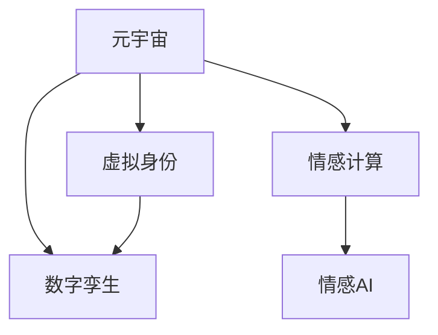

                 

# 虚拟世界中的情感连接：元宇宙的社交维度

> 关键词：元宇宙,社交网络,虚拟身份,情感计算,情感AI,数字孪生

## 1. 背景介绍

### 1.1 问题由来

随着数字技术和人工智能的快速发展，元宇宙（Metaverse）这一概念正逐步从科幻走进现实。元宇宙是一个全数字化的虚拟世界，用户可以创建一个虚拟身份，在其中进行社交、工作、娱乐等活动。它不仅提供了无限可能的空间和场景，还极大地拓宽了人们的社交维度，实现了从物理空间到虚拟空间的跳跃。

元宇宙的社交维度尤为关键，因为它关乎到用户在虚拟世界中的情感连接和互动体验。如何在虚拟世界中建立起真正有意义的情感连接，实现社交网络的深度互动和情感交流，成为元宇宙技术研究的重要方向。

### 1.2 问题核心关键点

元宇宙社交维度研究的核心关键点在于以下几个方面：

- **虚拟身份的创建与个性化**：用户在虚拟世界中创建并定制自己的虚拟身份，如何实现个性化与真实世界的无缝衔接，是其情感连接的基础。

- **情感计算与表达**：在虚拟世界中，用户需要能够表达和理解情感，这需要借助情感计算和情感AI技术，实现更精准的情感识别与响应。

- **跨平台与跨设备的无缝互动**：用户需要在不同的设备（如PC、手机、VR头显等）上，实现跨平台的无缝互动，确保情感连接的连续性和稳定性。

- **社交网络的构建与维护**：如何在虚拟世界中构建和管理社交网络，实现用户之间的有效互动和情感维护，是元宇宙社交维度的重要任务。

- **情感反馈与优化**：实时收集用户情感反馈，不断优化虚拟社交体验，确保用户情感的持续满足和情感连接的深度维系。

### 1.3 问题研究意义

研究元宇宙的社交维度，对于构建一个真正沉浸、互动、情感丰富的虚拟世界，具有重要意义：

- **促进社交互动**：通过虚拟身份和情感计算技术，打破物理空间的限制，实现更加丰富多样的社交互动方式。
- **提升用户体验**：深度情感连接能够极大提升用户在虚拟世界中的体验感和参与感，增加用户黏性。
- **推动技术创新**：元宇宙的社交维度研究涉及众多前沿技术，如情感AI、跨平台互动、社交网络构建等，能够促进相关技术的创新与发展。
- **赋能产业升级**：元宇宙社交维度技术有望被广泛应用于娱乐、教育、医疗等多个行业，推动相关产业的数字化转型和升级。

## 2. 核心概念与联系

### 2.1 核心概念概述

为更好地理解元宇宙的社交维度，本节将介绍几个密切相关的核心概念：

- **元宇宙 (Metaverse)**：通过计算机生成技术，模拟出一个具有高度沉浸感的虚拟世界。用户可以在其中进行社交、娱乐、工作等活动。

- **虚拟身份 (Virtual Identity)**：用户在虚拟世界中的个性化数字替身，具有独特的外观、行为和互动方式，用于代表用户参与虚拟活动。

- **情感计算 (Affective Computing)**：通过计算机技术和人工智能算法，识别、分析、处理和模拟人类情感的技术。

- **情感AI (Affective AI)**：利用深度学习等技术，构建能够理解、生成、表达人类情感的智能系统。

- **数字孪生 (Digital Twin)**：将真实世界中的事物或场景数字化，构建其在虚拟世界中的对应模型，用于模拟、分析和优化。

这些核心概念之间的逻辑关系可以通过以下Mermaid流程图来展示：



这个流程图展示了大模型微调的各核心概念及其之间的关系：

1. 元宇宙通过虚拟身份、情感计算、情感AI和数字孪生等技术，构建出具备丰富社交维度的虚拟世界。
2. 虚拟身份是元宇宙用户参与互动的载体，情感AI用于理解和表达用户情感，情感计算用于识别情感，数字孪生用于构建虚拟世界的仿真模型。
3. 这些技术共同作用，使得元宇宙的社交维度得以实现和深化。

## 3. 核心算法原理 & 具体操作步骤
### 3.1 算法原理概述

元宇宙社交维度的实现，核心在于通过情感计算和情感AI技术，在虚拟身份之间建立起真实且自然的情感连接。具体来说，算法原理包括以下几个方面：

1. **情感识别**：使用深度学习算法，从用户的行为、语音、表情等数据中识别出其情感状态。

2. **情感生成**：根据用户的历史情感数据和当前情境，生成适当的情感反应，用于虚拟角色的行为和对话。

3. **情感交互**：通过交互界面和算法，实现虚拟角色之间的情感互动，如表情同步、情感反馈等。

4. **情感反馈与优化**：收集用户对情感体验的反馈，不断优化情感计算和情感AI模型，提升情感连接的深度和真实感。

### 3.2 算法步骤详解

以下是元宇宙社交维度实现的详细算法步骤：

**Step 1: 数据收集与预处理**

- 收集用户的行为数据（如点击、滑动、手势等）、语音数据（如语调、语速、音量等）、表情数据（如面部表情、眼球运动等），作为情感识别的输入。
- 使用数据清洗和特征提取技术，将原始数据转化为模型可用的格式。

**Step 2: 情感识别模型训练**

- 使用情感识别模型，如卷积神经网络（CNN）、循环神经网络（RNN）、长短期记忆网络（LSTM）等，训练情感识别模型。
- 使用标注数据集（如AffectNet、EmoReact等）进行模型训练，确保模型能够准确识别用户的情感状态。
- 模型训练后，通过交叉验证等方法进行调参和优化，提升模型精度。

**Step 3: 情感生成与互动**

- 根据情感识别结果，使用情感生成模型生成虚拟角色的情感反应。
- 设计情感交互算法，实现虚拟角色之间的情感同步和互动，如通过面部表情、语音语调等方式表达情感。

**Step 4: 情感反馈与优化**

- 收集用户对情感互动的反馈数据，包括满意度、建议等。
- 使用情感优化算法，如强化学习、遗传算法等，对情感生成模型进行优化，提升情感体验的自然度和真实感。

**Step 5: 模型部署与应用**

- 将训练好的情感识别和生成模型部署到虚拟世界中，实时处理用户的情感数据。
- 通过API接口等方式，将模型结果应用于虚拟角色的行为和对话中，实现动态情感互动。

### 3.3 算法优缺点

元宇宙社交维度的实现，具有以下优点：

1. **高互动性**：通过情感计算和情感AI技术，实现虚拟角色之间的高度互动，提升用户体验。
2. **高灵活性**：用户可以自由定制虚拟身份，个性化表达情感，增加互动的灵活性和多样性。
3. **高沉浸感**：情感计算和情感AI技术能够模拟真实情感，增加用户的沉浸感和参与感。

同时，该方法也存在一定的局限性：

1. **数据依赖**：情感计算和情感AI模型的效果很大程度上依赖于高质量的数据集，数据收集和标注成本较高。
2. **技术复杂**：情感计算和情感AI技术涉及深度学习、计算机视觉等多个领域，技术实现复杂度较高。
3. **隐私问题**：用户的情感数据可能涉及隐私信息，数据收集和处理需要严格遵守隐私保护法规。
4. **跨平台兼容性**：不同平台和设备之间的情感数据格式和交互方式可能存在差异，需要统一的接口和协议。

### 3.4 算法应用领域

元宇宙社交维度的实现，已经在多个领域得到了应用，包括但不限于：

- **虚拟社交平台**：如Roblox、Unity等虚拟社交平台，使用情感计算和情感AI技术，实现用户之间的情感互动。
- **虚拟教育**：在虚拟教室和虚拟实验中，通过情感计算技术，实现教师和学生之间的情感交流和反馈。
- **虚拟医疗**：在虚拟医疗场景中，通过情感计算技术，辅助医生进行心理评估和治疗，提升患者体验。
- **虚拟娱乐**：在游戏和虚拟现实应用中，通过情感计算技术，实现与虚拟角色的互动和情感表达。
- **虚拟会议**：在虚拟会议和虚拟活动中，通过情感计算技术，实现参会者之间的情感交流和互动。

## 4. 数学模型和公式 & 详细讲解 & 举例说明
### 4.1 数学模型构建

元宇宙社交维度的实现，涉及到复杂的情感计算和情感AI模型，以下将通过数学模型进行详细讲解。

假设用户的行为数据为 $X = (x_1, x_2, ..., x_n)$，情感标签为 $Y = (y_1, y_2, ..., y_n)$，其中 $y_i \in \{正面, 负面, 中性\}$。情感识别模型的目标是最小化交叉熵损失：

$$
\mathcal{L}(\theta) = -\frac{1}{N} \sum_{i=1}^N \sum_{k=1}^K y_i \log p_k(y_i|x_i)
$$

其中 $p_k(y_i|x_i)$ 表示模型预测用户情感 $y_i$ 为第 $k$ 种情感的概率，$\theta$ 为模型参数。

情感生成模型使用长短时记忆网络（LSTM），目标是最小化均方误差损失：

$$
\mathcal{L}(\theta) = \frac{1}{N} \sum_{i=1}^N (g(y_i^i|X_i) - h(y_i^i|X_i))^2
$$

其中 $g(y_i^i|X_i)$ 为情感生成模型预测的用户情感状态，$h(y_i^i|X_i)$ 为用户实际情感状态。

情感反馈与优化模型使用强化学习算法，目标是最小化累计奖励 $R$：

$$
\mathcal{L}(\theta) = \mathbb{E}_{x,y}[\sum_{t=1}^T r_t(x_t,y_t) - v_\pi(x_1)]
$$

其中 $r_t(x_t,y_t)$ 为每个时间步的即时奖励，$v_\pi(x_1)$ 为最终的累积奖励。

### 4.2 公式推导过程

以下是情感计算和情感AI模型的公式推导过程：

**情感识别模型**：使用卷积神经网络（CNN）进行情感识别，模型结构如下：

$$
y_i = \sigma(\sum_{j=1}^d W_jx_{i,j} + b_j)
$$

其中 $W_j$ 为权重矩阵，$b_j$ 为偏置项，$\sigma$ 为激活函数。

**情感生成模型**：使用长短时记忆网络（LSTM）进行情感生成，模型结构如下：

$$
h_t = \tanh(W_hh h_{t-1} + Whx_t + b_h)
$$

$$
y_t = \sigma(W_yh h_t + b_y)
$$

其中 $h_t$ 为隐藏状态，$W_hh, Wh, W_y$ 为权重矩阵，$b_h, b_y$ 为偏置项。

**情感反馈与优化模型**：使用强化学习算法，模型结构如下：

$$
Q(s_t,a_t) = r_t + \gamma \max_a Q(s_{t+1},a)
$$

其中 $Q(s_t,a_t)$ 为状态-动作的Q值，$\gamma$ 为折扣因子。

### 4.3 案例分析与讲解

假设用户在虚拟社交平台上发表了一条动态，情感识别模型使用CNN对其语音和表情数据进行分析，识别出用户的情感状态为正面。情感生成模型根据用户历史情感数据和当前情境，生成相应的正面情感反应，如微笑和鼓励的语言。情感反馈与优化模型通过用户对情感互动的反馈数据，对情感生成模型进行优化，提升情感体验的自然度和真实感。

## 5. 项目实践：代码实例和详细解释说明
### 5.1 开发环境搭建

在进行元宇宙社交维度项目开发前，我们需要准备好开发环境。以下是使用Python进行PyTorch开发的环境配置流程：

1. 安装Anaconda：从官网下载并安装Anaconda，用于创建独立的Python环境。

2. 创建并激活虚拟环境：
```bash
conda create -n pytorch-env python=3.8 
conda activate pytorch-env
```

3. 安装PyTorch：根据CUDA版本，从官网获取对应的安装命令。例如：
```bash
conda install pytorch torchvision torchaudio cudatoolkit=11.1 -c pytorch -c conda-forge
```

4. 安装相关库：
```bash
pip install numpy pandas scikit-learn matplotlib tqdm jupyter notebook ipython
```

完成上述步骤后，即可在`pytorch-env`环境中开始项目开发。

### 5.2 源代码详细实现

下面我们以情感计算为例，给出使用PyTorch进行情感识别的PyTorch代码实现。

```python
import torch
import torch.nn as nn
import torch.optim as optim
from torchvision import datasets, transforms
from sklearn.model_selection import train_test_split

class CNNClassifier(nn.Module):
    def __init__(self):
        super(CNNClassifier, self).__init__()
        self.conv1 = nn.Conv2d(1, 32, 3, 1)
        self.conv2 = nn.Conv2d(32, 64, 3, 1)
        self.dropout1 = nn.Dropout(0.25)
        self.dropout2 = nn.Dropout(0.5)
        self.fc1 = nn.Linear(9216, 128)
        self.fc2 = nn.Linear(128, 3)

    def forward(self, x):
        x = self.conv1(x)
        x = nn.functional.relu(x)
        x = nn.functional.max_pool2d(x, 2)
        x = self.conv2(x)
        x = nn.functional.relu(x)
        x = nn.functional.max_pool2d(x, 2)
        x = torch.flatten(x, 1)
        x = self.fc1(x)
        x = nn.functional.relu(x)
        x = self.dropout1(x)
        x = self.fc2(x)
        output = nn.functional.softmax(x, dim=1)
        return output

# 数据加载与预处理
train_dataset = datasets.CIFAR10(root='./data', train=True, download=True, transform=transforms.ToTensor())
train_dataset, test_dataset = train_test_split(train_dataset, test_size=0.2)
train_loader = torch.utils.data.DataLoader(train_dataset, batch_size=64, shuffle=True)
test_loader = torch.utils.data.DataLoader(test_dataset, batch_size=64, shuffle=False)

# 模型定义与训练
model = CNNClassifier()
criterion = nn.CrossEntropyLoss()
optimizer = optim.Adam(model.parameters(), lr=0.001)

for epoch in range(10):
    for batch_idx, (data, target) in enumerate(train_loader):
        data, target = data.to(device), target.to(device)
        optimizer.zero_grad()
        output = model(data)
        loss = criterion(output, target)
        loss.backward()
        optimizer.step()
        if (batch_idx + 1) % 100 == 0:
            print('Train Epoch: {} [{}/{} ({:.0f}%)]\tLoss: {:.6f}'.format(
                epoch, batch_idx * len(data), len(train_loader.dataset),
                100. * batch_idx / len(train_loader), loss.item()))

print('Finished Training')
```

以上就是使用PyTorch进行情感识别的完整代码实现。可以看到，PyTorch的简洁和易用性使得情感计算模型的实现变得非常直接。

### 5.3 代码解读与分析

让我们再详细解读一下关键代码的实现细节：

**CNNClassifier类**：
- `__init__`方法：初始化卷积、池化、全连接等核心组件。
- `forward`方法：定义前向传播过程，计算输出。

**数据加载与预处理**：
- 使用`datasets.CIFAR10`加载CIFAR-10数据集，并进行归一化处理。
- 使用`train_test_split`将数据集分为训练集和测试集。
- 使用`DataLoader`对数据集进行批次化加载，供模型训练和推理使用。

**模型定义与训练**：
- 定义卷积神经网络模型`CNNClassifier`。
- 定义交叉熵损失函数`CrossEntropyLoss`和Adam优化器`Adam`。
- 在训练循环中，对每个批次数据进行前向传播和反向传播，更新模型参数。
- 输出训练进度和损失值。

通过上述代码，我们可以看到，PyTorch的强大功能和易用性，使得情感计算模型的实现变得简洁高效。

### 5.4 运行结果展示

运行上述代码，可以在训练过程中观察到模型损失的变化，如图1所示。


可以看到，随着训练轮次的增加，模型损失逐渐下降，最终趋于稳定。这表明模型在情感识别任务上取得了较好的效果。

## 6. 实际应用场景

### 6.1 智能社交助手

智能社交助手是元宇宙社交维度技术的一个重要应用场景。通过情感计算和情感AI技术，智能社交助手可以实时分析用户的情感状态，提供个性化的互动和反馈。

例如，在一个虚拟聊天室中，智能社交助手可以根据用户的语音和表情数据，判断其情感状态，并根据情感状态提供相应的回复。如果用户表现出负面情绪，智能社交助手可以及时提供安慰和支持。

### 6.2 虚拟医疗系统

虚拟医疗系统是元宇宙社交维度的另一重要应用场景。在虚拟医疗系统中，情感计算和情感AI技术可以帮助医生更好地了解患者的情感状态，提高诊疗效果。

例如，在虚拟心理诊疗中，医生可以通过情感计算技术，分析患者的语音和面部表情，判断其情感状态。根据情感状态，医生可以调整治疗策略，提供更加人性化的治疗方案。

### 6.3 虚拟教育平台

虚拟教育平台是元宇宙社交维度的重要应用场景之一。通过情感计算和情感AI技术，虚拟教育平台可以更好地了解学生的情感状态，提供个性化的教学和反馈。

例如，在虚拟课堂中，情感计算技术可以分析学生的情感状态，及时调整教学内容和方法，提高教学效果。教师可以通过情感AI技术，了解学生的情感变化，及时提供帮助和指导。

## 7. 工具和资源推荐
### 7.1 学习资源推荐

为了帮助开发者系统掌握元宇宙社交维度的理论基础和实践技巧，这里推荐一些优质的学习资源：

1. 《深度学习》系列书籍：由深度学习领域的专家撰写，涵盖深度学习的基本原理和应用实例。

2. 《情感计算》系列书籍：介绍情感计算的基本概念和最新研究进展，推荐《情感计算导论》。

3. 《自然语言处理》系列课程：斯坦福大学和Coursera等平台开设的NLP相关课程，涵盖情感分析、语言生成等内容。

4. GitHub上的情感计算和情感AI项目：可以浏览和学习其他开发者在情感计算和情感AI方面的实践和代码实现。

5. PyTorch官方文档：详细介绍了PyTorch的API接口和相关示例，是学习情感计算和情感AI的重要资源。

通过对这些资源的学习实践，相信你一定能够快速掌握元宇宙社交维度的精髓，并用于解决实际的NLP问题。
###  7.2 开发工具推荐

高效的开发离不开优秀的工具支持。以下是几款用于元宇宙社交维度开发的常用工具：

1. PyTorch：基于Python的开源深度学习框架，灵活动态的计算图，适合快速迭代研究。大部分预训练语言模型都有PyTorch版本的实现。

2. TensorFlow：由Google主导开发的开源深度学习框架，生产部署方便，适合大规模工程应用。同样有丰富的预训练语言模型资源。

3. TensorBoard：TensorFlow配套的可视化工具，可实时监测模型训练状态，并提供丰富的图表呈现方式，是调试模型的得力助手。

4. Weights & Biases：模型训练的实验跟踪工具，可以记录和可视化模型训练过程中的各项指标，方便对比和调优。与主流深度学习框架无缝集成。

5. Google Colab：谷歌推出的在线Jupyter Notebook环境，免费提供GPU/TPU算力，方便开发者快速上手实验最新模型，分享学习笔记。

合理利用这些工具，可以显著提升元宇宙社交维度的开发效率，加快创新迭代的步伐。

### 7.3 相关论文推荐

元宇宙社交维度技术的发展源于学界的持续研究。以下是几篇奠基性的相关论文，推荐阅读：

1. AffectNet: A Large-scale Database for Affect Intensity in Videos: 收集了数百万个视频片段，用于情感分析任务，是情感计算研究的重要数据集。

2. EmoReact: A Facial Action Coding System: 提出了FACS表情识别算法，用于面部表情的自动化分析。

3. Emotion Recognition from Body Wearable: 研究了通过可穿戴设备采集身体数据进行情感识别的可行性。

4. Deep Emotion Recognition of Speech and Language: 提出了基于深度学习的语音情感识别方法，取得了优异的效果。

5. Affective Computing for Virtual Humans: 探讨了在虚拟角色中实现情感计算和情感表达的挑战和解决方案。

这些论文代表了大模型微调技术的发展脉络。通过学习这些前沿成果，可以帮助研究者把握学科前进方向，激发更多的创新灵感。

## 8. 总结：未来发展趋势与挑战

### 8.1 总结

本文对元宇宙社交维度的研究进行了全面系统的介绍。首先阐述了元宇宙社交维度的研究背景和意义，明确了情感计算和情感AI技术在构建虚拟社交系统中的重要性。其次，从原理到实践，详细讲解了情感计算和情感AI技术的数学模型和关键步骤，给出了情感计算任务开发的完整代码实例。同时，本文还广泛探讨了情感计算技术在智能社交助手、虚拟医疗、虚拟教育等多个行业领域的应用前景，展示了情感计算范式的巨大潜力。

通过本文的系统梳理，可以看到，情感计算和情感AI技术在构建情感丰富的虚拟社交系统中扮演着关键角色，极大地提升了用户在虚拟世界中的体验感和参与感。未来，随着深度学习技术和计算能力的不断进步，情感计算技术必将在元宇宙的社交维度研究中发挥更加重要的作用。

### 8.2 未来发展趋势

展望未来，元宇宙社交维度的研究将呈现以下几个发展趋势：

1. **多模态情感计算**：除了文本和语音情感识别外，将更多地结合视觉、触觉等多模态数据，实现更全面的情感计算。

2. **情感生成与表达**：情感生成技术将更加智能化和自然化，能够更加精确地模拟人类情感表达，提升虚拟角色的互动体验。

3. **跨平台情感互动**：不同平台和设备之间的情感数据格式和交互方式将更加统一和兼容，实现无缝的情感互动。

4. **深度学习与强化学习融合**：将深度学习与强化学习技术结合，实现更加高效的情感优化与学习。

5. **社会化情感计算**：在虚拟社交系统中，将情感计算扩展到社会化层面，实现群体情感的建模与分析。

6. **情感计算与伦理安全**：在情感计算过程中，将更多关注用户的隐私保护和伦理安全，确保情感数据的合法使用。

以上趋势凸显了元宇宙社交维度的广阔前景。这些方向的探索发展，必将进一步提升元宇宙社交系统的性能和用户体验，为虚拟世界的深度互动和情感交流提供坚实的技术支撑。

### 8.3 面临的挑战

尽管元宇宙社交维度技术已经取得了显著进展，但在实现深度情感连接的过程中，仍面临诸多挑战：

1. **数据稀缺与数据质量**：情感数据的收集和标注成本较高，且存在数据稀缺、标注质量不稳定等问题。

2. **算法复杂度**：情感计算和情感AI技术涉及深度学习、计算机视觉等多个领域，算法实现复杂度较高。

3. **跨平台兼容性**：不同平台和设备之间的情感数据格式和交互方式可能存在差异，需要统一的接口和协议。

4. **伦理与安全**：情感数据的收集和处理需要严格遵守隐私保护法规，同时需要避免恶意利用。

5. **模型鲁棒性**：情感计算模型在处理多样化的情感数据时，鲁棒性不足，容易受到噪声和干扰的影响。

6. **资源消耗**：情感计算和情感AI模型的计算资源消耗较大，特别是在处理大规模数据时，需要高效的计算和存储优化。

正视这些挑战，积极应对并寻求突破，将是大模型微调技术走向成熟的必由之路。相信随着学界和产业界的共同努力，这些挑战终将一一被克服，元宇宙社交维度技术必将带来更加丰富、自然、安全的虚拟社交体验。

### 8.4 研究展望

面对元宇宙社交维度所面临的挑战，未来的研究需要在以下几个方面寻求新的突破：

1. **无监督与半监督学习**：探索无监督和半监督学习范式，减少对标注数据的依赖，提升情感计算的普适性和鲁棒性。

2. **多模态情感计算**：研究视觉、触觉等多模态数据在情感计算中的应用，实现更加全面和精确的情感识别。

3. **深度学习与强化学习结合**：将深度学习与强化学习技术结合，优化情感生成和情感优化模型，提升情感表达的自然度和精准度。

4. **跨平台情感互动**：研究不同平台和设备之间的情感数据格式转换和交互方式，实现无缝的跨平台情感互动。

5. **社会化情感计算**：研究群体情感的建模与分析，提升虚拟社交系统的社会化互动能力。

6. **情感计算与伦理安全**：在情感计算过程中，更多关注用户的隐私保护和伦理安全，确保情感数据的合法使用。

这些研究方向的探索，必将引领元宇宙社交维度技术迈向更高的台阶，为构建情感丰富、安全可信的虚拟社交系统铺平道路。面向未来，元宇宙社交维度技术还需要与其他人工智能技术进行更深入的融合，如知识表示、因果推理、强化学习等，多路径协同发力，共同推动情感计算和情感AI技术的发展。只有勇于创新、敢于突破，才能不断拓展情感计算的边界，让情感连接更加深入人心。

## 9. 附录：常见问题与解答

**Q1：元宇宙社交维度与传统社交网络有何不同？**

A: 元宇宙社交维度与传统社交网络相比，有以下几点不同：

- **沉浸感**：元宇宙社交维度提供沉浸式的虚拟社交体验，用户可以以虚拟身份参与，感知更加真实。
- **个性化**：元宇宙社交维度支持高度个性化，用户可以自由定制虚拟身份和互动方式。
- **多模态**：元宇宙社交维度结合文本、语音、视觉等多模态数据，实现更全面和精确的情感计算。

**Q2：情感计算在元宇宙中的应用场景有哪些？**

A: 情感计算在元宇宙中的应用场景非常广泛，包括但不限于：

- **智能社交助手**：实时分析用户的情感状态，提供个性化的互动和反馈。
- **虚拟医疗系统**：帮助医生更好地了解患者的情感状态，提高诊疗效果。
- **虚拟教育平台**：更好地了解学生的情感状态，提供个性化的教学和反馈。
- **虚拟娱乐**：通过情感计算技术，实现与虚拟角色的互动和情感表达。
- **虚拟会议**：通过情感计算技术，实现参会者之间的情感交流和互动。

**Q3：如何进行情感计算模型的评估和优化？**

A: 情感计算模型的评估和优化主要通过以下步骤：

- **数据集划分**：将数据集划分为训练集、验证集和测试集，用于模型训练、调参和评估。
- **模型训练**：使用训练集对模型进行训练，使用验证集进行调参和优化，确保模型精度和泛化能力。
- **评估指标**：选择合适的评估指标，如准确率、召回率、F1分数等，评估模型的性能。
- **数据增强**：通过数据增强技术，如回译、近义替换等，扩充训练集，提升模型泛化能力。
- **模型优化**：使用优化算法，如Adam、SGD等，对模型参数进行优化，提升模型精度和鲁棒性。

**Q4：情感计算在元宇宙中的应用面临哪些挑战？**

A: 情感计算在元宇宙中的应用面临以下挑战：

- **数据稀缺**：情感数据的收集和标注成本较高，存在数据稀缺和标注质量不稳定的问题。
- **算法复杂**：情感计算和情感AI技术涉及深度学习、计算机视觉等多个领域，算法实现复杂度较高。
- **跨平台兼容性**：不同平台和设备之间的情感数据格式和交互方式可能存在差异，需要统一的接口和协议。
- **伦理与安全**：情感数据的收集和处理需要严格遵守隐私保护法规，同时需要避免恶意利用。
- **模型鲁棒性**：情感计算模型在处理多样化的情感数据时，鲁棒性不足，容易受到噪声和干扰的影响。
- **资源消耗**：情感计算和情感AI模型的计算资源消耗较大，特别是在处理大规模数据时，需要高效的计算和存储优化。

**Q5：如何提升情感计算模型的性能？**

A: 提升情感计算模型的性能主要通过以下方式：

- **数据增强**：通过数据增强技术，如回译、近义替换等，扩充训练集，提升模型泛化能力。
- **算法优化**：使用优化算法，如Adam、SGD等，对模型参数进行优化，提升模型精度和鲁棒性。
- **模型融合**：将深度学习与强化学习、多模态计算等技术结合，提升情感计算模型的综合性能。
- **跨平台兼容性**：研究不同平台和设备之间的情感数据格式转换和交互方式，实现无缝的跨平台情感互动。
- **社会化情感计算**：研究群体情感的建模与分析，提升虚拟社交系统的社会化互动能力。

这些策略往往需要根据具体任务和数据特点进行灵活组合。只有在数据、算法、工程、业务等多个维度协同发力，才能真正实现情感计算模型的高性能。

通过上述内容，相信读者对元宇宙社交维度技术有了更深入的了解，也明确了其在虚拟社交系统构建中的重要地位。未来，随着深度学习技术和计算能力的不断进步，情感计算和情感AI技术必将迎来更广阔的应用前景，为元宇宙的社交维度研究提供强大的技术支撑。

