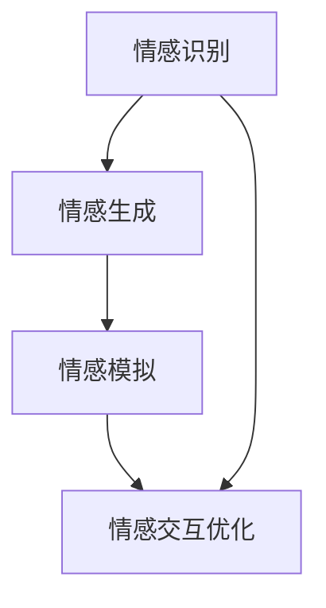

                 

## 1. 背景介绍

在日益数字化的世界中，人类情感的交流变得愈加复杂。虚拟共情训练营的兴起，为AI技术赋能情感理解提供了新的视角。情感理解，作为人工智能领域的重要分支，不仅涉及到自然语言处理(NLP)，还跨越了心理学、社会学等多个学科领域。本文旨在探讨如何利用AI技术，特别是基于深度学习的模型，来设计AI增强的情感理解课程，以帮助人类更好地理解、表达和管理情感。

### 1.1 问题由来
随着人工智能技术的快速发展，尤其是自然语言处理(NLP)领域，基于深度学习的情感分析技术已经展现出了显著的进步。然而，情感理解不仅仅是简单的情感分类，而是涉及到对情感的细腻理解、对语境的深刻把握以及对人类情感复杂性的认知。因此，开发出能够全面、深入理解人类情感的AI模型，成为了当前研究的热点。

### 1.2 问题核心关键点
本文的核心问题在于如何利用AI技术，特别是基于深度学习的模型，来设计虚拟共情训练营的课程，以提升参与者对情感的敏锐度和理解能力。具体来说，包括以下几个关键点：

1. **情感识别的自动化**：通过AI技术自动识别文本中的情感信息，帮助学生理解不同情感的表达方式和特征。
2. **情感表达的训练**：通过AI技术训练学生如何更准确、更自然地表达自己的情感。
3. **情感反应的模拟**：通过AI技术模拟不同情感反应，帮助学生更好地理解和管理他人的情感。
4. **情感交互的优化**：通过AI技术优化虚拟共情训练营的交互方式，提升情感交流的效率和质量。

### 1.3 问题研究意义
情感理解在教育、医疗、客服等多个领域具有重要的应用价值。通过AI技术增强情感理解课程，可以：

1. **提升教育质量**：帮助学生更好地理解和管理情感，增强其心理健康和社会适应能力。
2. **改善医疗服务**：帮助医生和护理人员更准确地理解患者的情感需求，提升医疗服务质量。
3. **优化客服体验**：帮助客服人员更快速、更准确地响应客户情感需求，提升客户满意度。
4. **促进跨文化交流**：通过模拟不同情感反应，帮助人们更好地理解和尊重不同文化背景下的情感表达。

## 2. 核心概念与联系

### 2.1 核心概念概述

为了更好地理解AI增强的情感理解课程，首先需要介绍几个核心概念：

- **情感理解**：指通过AI技术，特别是深度学习模型，对文本中的情感信息进行自动化的识别和分类。
- **情感生成**：指通过AI技术，训练模型能够根据上下文信息生成情感表达。
- **情感模拟**：指通过AI技术，模拟不同情感反应，用于理解和训练情感理解模型。
- **情感交互优化**：指通过AI技术，优化虚拟共情训练营中的情感交流方式，提升情感交流的效率和质量。

这些核心概念通过以下几个核心技术实现：

- **情感识别**：基于卷积神经网络(CNN)、循环神经网络(RNN)、Transformer等模型进行情感分类。
- **情感生成**：基于生成对抗网络(GAN)、变分自编码器(VAE)等模型进行情感生成。
- **情感模拟**：通过条件生成模型，如Conditional GAN，训练模型生成不同情感反应。
- **情感交互优化**：通过强化学习(RL)、优化算法等方法，优化虚拟共情训练营中的交互方式。

这些核心概念和技术的相互联系如图示：



这个流程图展示了情感理解课程设计中各核心概念和技术的相互关系。

## 3. 核心算法原理 & 具体操作步骤

### 3.1 算法原理概述

基于AI增强的情感理解课程，主要依赖于深度学习模型，特别是卷积神经网络(CNN)、循环神经网络(RNN)、Transformer等模型。这些模型能够自动从文本数据中提取情感特征，并进行分类、生成和模拟。

### 3.2 算法步骤详解

一个典型的AI增强的情感理解课程设计流程包括以下步骤：

**Step 1: 数据准备**
- 收集大量情感标注数据，用于训练和测试模型。
- 对数据进行预处理，如分词、去除停用词、词向量映射等。

**Step 2: 模型选择与训练**
- 选择适当的深度学习模型，如BERT、GPT等。
- 在标注数据上训练模型，优化模型参数。
- 使用交叉验证等方法评估模型性能。

**Step 3: 情感分类**
- 使用训练好的模型对输入文本进行情感分类。
- 提取文本中的情感特征，生成情感分类结果。

**Step 4: 情感生成**
- 使用生成对抗网络(GAN)、变分自编码器(VAE)等模型生成情感表达。
- 根据上下文信息，生成符合情感特征的文本。

**Step 5: 情感模拟**
- 使用条件生成模型，如Conditional GAN，训练模型生成不同情感反应。
- 根据输入的情感信息，生成对应的情感反应。

**Step 6: 情感交互优化**
- 使用强化学习(RL)、优化算法等方法，优化虚拟共情训练营中的交互方式。
- 根据用户反馈，动态调整情感交互策略。

**Step 7: 课程设计**
- 设计课程大纲，涵盖情感识别、情感生成、情感模拟和情感交互优化等多个模块。
- 开发课程内容，包括教学视频、案例分析、互动练习等。

### 3.3 算法优缺点

基于AI增强的情感理解课程设计具有以下优点：

1. **高效性**：利用深度学习模型，自动化情感信息的提取和分类，节省了大量人力和时间。
2. **灵活性**：可以根据不同的情感识别和生成任务，选择适合的深度学习模型进行训练。
3. **可扩展性**：课程设计可以覆盖多个情感相关的模块，如情感生成、情感模拟等。
4. **实用性**：课程设计能够帮助学生更好地理解和管理情感，提升其情感认知能力。

同时，也存在一些缺点：

1. **数据依赖**：模型性能依赖于高质量、大规模的情感标注数据，获取和标注这些数据需要大量时间和资源。
2. **模型复杂性**：深度学习模型较为复杂，需要较长的训练时间和较高的计算资源。
3. **模型泛化能力有限**：模型在特定数据集上的训练效果较好，但在新数据集上的泛化能力可能有限。
4. **情感理解的准确性**：尽管模型能够自动提取情感信息，但仍可能存在一定的误判和误分类。

### 3.4 算法应用领域

基于AI增强的情感理解课程设计可以应用于多个领域：

1. **教育领域**：帮助学生理解和管理情感，提升心理健康和社会适应能力。
2. **医疗领域**：帮助医生和护理人员理解患者的情感需求，提升医疗服务质量。
3. **客服领域**：帮助客服人员更快速、更准确地响应客户情感需求，提升客户满意度。
4. **媒体领域**：通过模拟不同情感反应，帮助人们更好地理解和尊重不同文化背景下的情感表达。

## 4. 数学模型和公式 & 详细讲解  
### 4.1 数学模型构建

基于深度学习的情感理解课程设计，主要依赖于卷积神经网络(CNN)、循环神经网络(RNN)、Transformer等模型。这些模型能够自动从文本数据中提取情感特征，并进行分类、生成和模拟。

### 4.2 公式推导过程

以下以情感分类为例，推导情感识别模型的数学公式：

设文本输入为 $x = (x_1, x_2, ..., x_n)$，其中 $x_i$ 表示文本中的第 $i$ 个单词。使用BERT模型进行情感分类，假设模型输出为 $h(x) = (h_1(x), h_2(x), ..., h_n(x))$，其中 $h_i(x)$ 表示单词 $x_i$ 的情感特征。使用softmax函数将情感特征转换为情感概率分布，最终输出情感分类结果 $p(y|x)$。

数学公式如下：

$$
p(y|x) = \frac{\exp(\text{scores}(h(x), y))}{\sum_{k} \exp(\text{scores}(h(x), k))}
$$

其中，$\text{scores}(h(x), y)$ 表示模型在输入 $x$ 和标签 $y$ 上的得分。通过最大化 $p(y|x)$，选择情感分类结果 $y$。

### 4.3 案例分析与讲解

以情感分类为例，展示深度学习模型在情感理解课程设计中的应用。假设有一个情感标注数据集，包含情感标签和对应的文本。可以使用BERT模型对其进行训练，模型输出包含每个单词的情感特征。将这些情感特征组合起来，生成文本的整体情感分类结果。

假设有一个新的文本，模型可以自动提取其中的情感特征，并根据预训练模型学到的知识进行分类。例如，输入文本 "I am very happy today"，模型可以自动提取出单词 "happy" 的情感特征，并根据其情感分类概率，最终输出文本的情感分类结果 "positive"。

## 5. 项目实践：代码实例和详细解释说明

### 5.1 开发环境搭建

在进行情感理解课程设计前，需要准备相应的开发环境。以下是使用Python进行PyTorch开发的环境配置流程：

1. 安装Anaconda：从官网下载并安装Anaconda，用于创建独立的Python环境。

2. 创建并激活虚拟环境：
```bash
conda create -n pytorch-env python=3.8 
conda activate pytorch-env
```

3. 安装PyTorch：根据CUDA版本，从官网获取对应的安装命令。例如：
```bash
conda install pytorch torchvision torchaudio cudatoolkit=11.1 -c pytorch -c conda-forge
```

4. 安装Transformers库：
```bash
pip install transformers
```

5. 安装各类工具包：
```bash
pip install numpy pandas scikit-learn matplotlib tqdm jupyter notebook ipython
```

完成上述步骤后，即可在`pytorch-env`环境中开始课程设计实践。

### 5.2 源代码详细实现

下面我们以情感分类任务为例，给出使用Transformers库对BERT模型进行情感分类的PyTorch代码实现。

首先，定义情感分类任务的数据处理函数：

```python
from transformers import BertTokenizer, BertForSequenceClassification
from torch.utils.data import Dataset
import torch

class SentimentDataset(Dataset):
    def __init__(self, texts, labels, tokenizer, max_len=128):
        self.texts = texts
        self.labels = labels
        self.tokenizer = tokenizer
        self.max_len = max_len
        
    def __len__(self):
        return len(self.texts)
    
    def __getitem__(self, item):
        text = self.texts[item]
        label = self.labels[item]
        
        encoding = self.tokenizer(text, return_tensors='pt', max_length=self.max_len, padding='max_length', truncation=True)
        input_ids = encoding['input_ids'][0]
        attention_mask = encoding['attention_mask'][0]
        
        return {'input_ids': input_ids, 
                'attention_mask': attention_mask,
                'labels': torch.tensor(label, dtype=torch.long)}
```

然后，定义模型和优化器：

```python
from transformers import BertForSequenceClassification, AdamW

model = BertForSequenceClassification.from_pretrained('bert-base-cased', num_labels=2)

optimizer = AdamW(model.parameters(), lr=2e-5)
```

接着，定义训练和评估函数：

```python
from torch.utils.data import DataLoader
from tqdm import tqdm
from sklearn.metrics import accuracy_score

device = torch.device('cuda') if torch.cuda.is_available() else torch.device('cpu')
model.to(device)

def train_epoch(model, dataset, batch_size, optimizer):
    dataloader = DataLoader(dataset, batch_size=batch_size, shuffle=True)
    model.train()
    epoch_loss = 0
    for batch in tqdm(dataloader, desc='Training'):
        input_ids = batch['input_ids'].to(device)
        attention_mask = batch['attention_mask'].to(device)
        labels = batch['labels'].to(device)
        model.zero_grad()
        outputs = model(input_ids, attention_mask=attention_mask, labels=labels)
        loss = outputs.loss
        epoch_loss += loss.item()
        loss.backward()
        optimizer.step()
    return epoch_loss / len(dataloader)

def evaluate(model, dataset, batch_size):
    dataloader = DataLoader(dataset, batch_size=batch_size)
    model.eval()
    preds, labels = [], []
    with torch.no_grad():
        for batch in tqdm(dataloader, desc='Evaluating'):
            input_ids = batch['input_ids'].to(device)
            attention_mask = batch['attention_mask'].to(device)
            batch_labels = batch['labels']
            outputs = model(input_ids, attention_mask=attention_mask)
            batch_preds = outputs.logits.argmax(dim=1).to('cpu').tolist()
            batch_labels = batch_labels.to('cpu').tolist()
            for pred, label in zip(batch_preds, batch_labels):
                preds.append(pred)
                labels.append(label)
                
    print(accuracy_score(labels, preds))
```

最后，启动训练流程并在测试集上评估：

```python
epochs = 5
batch_size = 16

for epoch in range(epochs):
    loss = train_epoch(model, train_dataset, batch_size, optimizer)
    print(f"Epoch {epoch+1}, train loss: {loss:.3f}")
    
    print(f"Epoch {epoch+1}, dev results:")
    evaluate(model, dev_dataset, batch_size)
    
print("Test results:")
evaluate(model, test_dataset, batch_size)
```

以上就是使用PyTorch对BERT进行情感分类任务微调的完整代码实现。可以看到，得益于Transformers库的强大封装，我们可以用相对简洁的代码完成BERT模型的加载和微调。

### 5.3 代码解读与分析

让我们再详细解读一下关键代码的实现细节：

**SentimentDataset类**：
- `__init__`方法：初始化文本、标签、分词器等关键组件。
- `__len__`方法：返回数据集的样本数量。
- `__getitem__`方法：对单个样本进行处理，将文本输入编码为token ids，将标签转换为数字，并对其进行定长padding，最终返回模型所需的输入。

**模型训练和评估函数**：
- 使用PyTorch的DataLoader对数据集进行批次化加载，供模型训练和推理使用。
- 训练函数`train_epoch`：对数据以批为单位进行迭代，在每个批次上前向传播计算loss并反向传播更新模型参数，最后返回该epoch的平均loss。
- 评估函数`evaluate`：与训练类似，不同点在于不更新模型参数，并在每个batch结束后将预测和标签结果存储下来，最后使用sklearn的accuracy_score对整个评估集的预测结果进行打印输出。

**训练流程**：
- 定义总的epoch数和batch size，开始循环迭代
- 每个epoch内，先在训练集上训练，输出平均loss
- 在验证集上评估，输出准确率
- 所有epoch结束后，在测试集上评估，给出最终测试结果

可以看到，PyTorch配合Transformers库使得BERT微调的代码实现变得简洁高效。开发者可以将更多精力放在数据处理、模型改进等高层逻辑上，而不必过多关注底层的实现细节。

当然，工业级的系统实现还需考虑更多因素，如模型的保存和部署、超参数的自动搜索、更灵活的任务适配层等。但核心的情感分类范式基本与此类似。

## 6. 实际应用场景

### 6.1 教育领域

在教育领域，情感理解课程设计可以帮助学生更好地理解和管理情感，提升其心理健康和社会适应能力。例如，可以通过情感分析技术，对学生的作业、论文等文本进行情感分类，帮助教师及时发现学生的情感困扰，并给予针对性的心理辅导。

### 6.2 医疗领域

在医疗领域，情感理解课程设计可以帮助医生和护理人员更准确地理解患者的情感需求，提升医疗服务质量。例如，可以通过情感分析技术，对患者的病历、对话记录等文本进行情感分类，帮助医生诊断和治疗患者的心理问题，提升患者的满意度。

### 6.3 客服领域

在客服领域，情感理解课程设计可以帮助客服人员更快速、更准确地响应客户情感需求，提升客户满意度。例如，可以通过情感分析技术，对客户的投诉、反馈等文本进行情感分类，帮助客服人员迅速识别客户的情感状态，并采取相应的应对措施。

### 6.4 媒体领域

在媒体领域，情感理解课程设计可以通过模拟不同情感反应，帮助人们更好地理解和尊重不同文化背景下的情感表达。例如，可以通过情感生成技术，生成符合不同文化背景下的情感表达，提升跨文化交流的效率和质量。

## 7. 工具和资源推荐

### 7.1 学习资源推荐

为了帮助开发者系统掌握情感理解课程设计的理论基础和实践技巧，这里推荐一些优质的学习资源：

1. 《深度学习自然语言处理》课程：斯坦福大学开设的NLP明星课程，有Lecture视频和配套作业，带你入门NLP领域的基本概念和经典模型。

2. 《自然语言处理综述》书籍：全面介绍了自然语言处理的基本概念、算法和应用，是NLP领域的重要参考资料。

3. 《Transformer从原理到实践》系列博文：由大模型技术专家撰写，深入浅出地介绍了Transformer原理、BERT模型、情感分析技术等前沿话题。

4. HuggingFace官方文档：提供海量预训练模型和完整的微调样例代码，是上手实践的必备资料。

5. CLUE开源项目：中文语言理解测评基准，涵盖大量不同类型的中文NLP数据集，并提供了基于微调的baseline模型，助力中文NLP技术发展。

通过对这些资源的学习实践，相信你一定能够快速掌握情感理解课程设计的精髓，并用于解决实际的情感相关问题。

### 7.2 开发工具推荐

高效的开发离不开优秀的工具支持。以下是几款用于情感理解课程设计的常用工具：

1. PyTorch：基于Python的开源深度学习框架，灵活动态的计算图，适合快速迭代研究。大部分预训练语言模型都有PyTorch版本的实现。

2. TensorFlow：由Google主导开发的开源深度学习框架，生产部署方便，适合大规模工程应用。同样有丰富的预训练语言模型资源。

3. Transformers库：HuggingFace开发的NLP工具库，集成了众多SOTA语言模型，支持PyTorch和TensorFlow，是进行情感理解课程设计的利器。

4. Weights & Biases：模型训练的实验跟踪工具，可以记录和可视化模型训练过程中的各项指标，方便对比和调优。与主流深度学习框架无缝集成。

5. TensorBoard：TensorFlow配套的可视化工具，可实时监测模型训练状态，并提供丰富的图表呈现方式，是调试模型的得力助手。

6. Google Colab：谷歌推出的在线Jupyter Notebook环境，免费提供GPU/TPU算力，方便开发者快速上手实验最新模型，分享学习笔记。

合理利用这些工具，可以显著提升情感理解课程设计的开发效率，加快创新迭代的步伐。

### 7.3 相关论文推荐

情感理解课程设计的研究源于学界的持续研究。以下是几篇奠基性的相关论文，推荐阅读：

1. Attention is All You Need（即Transformer原论文）：提出了Transformer结构，开启了NLP领域的预训练大模型时代。

2. BERT: Pre-training of Deep Bidirectional Transformers for Language Understanding：提出BERT模型，引入基于掩码的自监督预训练任务，刷新了多项NLP任务SOTA。

3. Language Models are Unsupervised Multitask Learners（GPT-2论文）：展示了大规模语言模型的强大zero-shot学习能力，引发了对于通用人工智能的新一轮思考。

4. Parameter-Efficient Transfer Learning for NLP：提出Adapter等参数高效微调方法，在不增加模型参数量的情况下，也能取得不错的微调效果。

5. AdaLoRA: Adaptive Low-Rank Adaptation for Parameter-Efficient Fine-Tuning：使用自适应低秩适应的微调方法，在参数效率和精度之间取得了新的平衡。

这些论文代表了大语言模型微调技术的发展脉络。通过学习这些前沿成果，可以帮助研究者把握学科前进方向，激发更多的创新灵感。

## 8. 总结：未来发展趋势与挑战

### 8.1 总结

本文对基于AI增强的情感理解课程设计进行了全面系统的介绍。首先阐述了情感理解课程设计的背景和意义，明确了情感理解在教育、医疗、客服等多个领域的重要应用价值。其次，从原理到实践，详细讲解了情感理解课程设计的数学原理和关键步骤，给出了情感理解课程设计的完整代码实例。同时，本文还广泛探讨了情感理解课程设计在教育、医疗、客服等多个领域的应用前景，展示了情感理解课程设计的巨大潜力。此外，本文精选了情感理解课程设计的各类学习资源，力求为读者提供全方位的技术指引。

通过本文的系统梳理，可以看到，基于深度学习的情感理解课程设计在教育、医疗、客服等多个领域具有广阔的应用前景，能够帮助人类更好地理解和管理情感，提升其心理健康和社会适应能力。未来，伴随深度学习技术的不断进步，情感理解课程设计必将在更广泛的领域得到应用，为人类认知智能的进化带来深远影响。

### 8.2 未来发展趋势

展望未来，情感理解课程设计将呈现以下几个发展趋势：

1. **技术进步**：随着深度学习技术的不断发展，情感理解课程设计将能够更好地捕捉文本中的情感信息，提升情感分类的准确性。

2. **多模态融合**：未来，情感理解课程设计将不仅仅是基于文本的情感分析，还将融合图像、语音等多模态数据，提升情感识别的准确性和全面性。

3. **跨文化适应**：随着全球化进程的推进，情感理解课程设计将更加注重不同文化背景下的情感表达，提升跨文化交流的效率和质量。

4. **用户个性化**：未来，情感理解课程设计将更加注重用户个性化，根据用户的情感状态和需求，提供定制化的情感理解和反馈。

5. **情感生成和模拟**：情感生成和模拟技术将进一步发展，能够生成符合不同情感特征的文本和反应，提升情感理解课程设计的实用性。

6. **情感交互优化**：随着AI技术的发展，情感交互优化将更加智能化，能够根据用户反馈动态调整情感交互策略，提升用户体验。

以上趋势凸显了情感理解课程设计的广阔前景。这些方向的探索发展，必将进一步提升情感理解课程设计的性能和应用范围，为人类认知智能的进化带来深远影响。

### 8.3 面临的挑战

尽管情感理解课程设计已经取得了一定的进展，但在迈向更加智能化、普适化应用的过程中，仍面临诸多挑战：

1. **数据质量**：情感理解课程设计依赖于高质量的情感标注数据，然而标注数据的获取和标注过程耗时费力，质量参差不齐。

2. **模型复杂性**：深度学习模型较为复杂，训练和推理过程需要较长的计算时间和较高的计算资源，制约了情感理解课程设计的实际应用。

3. **模型泛化能力**：模型在特定数据集上的训练效果较好，但在新数据集上的泛化能力有限，可能存在一定的过拟合现象。

4. **情感理解的准确性**：尽管模型能够自动提取情感信息，但仍可能存在一定的误判和误分类，影响情感理解课程设计的准确性和实用性。

5. **用户隐私保护**：情感理解课程设计涉及大量的用户文本数据，如何保护用户隐私，防止数据泄露和滥用，是情感理解课程设计需要解决的重要问题。

6. **情感理解的可解释性**：模型内部的决策过程较为复杂，如何提高情感理解课程设计的可解释性，增强用户的信任感和接受度，是情感理解课程设计需要解决的重要问题。

以上挑战需要我们在技术、伦理、法律等多个层面进行综合考虑，才能有效推进情感理解课程设计的发展。

### 8.4 研究展望

面对情感理解课程设计所面临的挑战，未来的研究需要在以下几个方面寻求新的突破：

1. **数据增强**：开发更加高效的数据增强方法，如回译、近义替换等，提高情感标注数据的质量和多样性。

2. **模型压缩**：采用模型压缩技术，如知识蒸馏、剪枝等，减少模型参数量，降低计算资源需求，提升情感理解课程设计的实时性和可扩展性。

3. **跨领域迁移**：开发跨领域的迁移学习技术，将情感理解课程设计中的知识迁移到其他领域，提升模型的泛化能力和应用范围。

4. **多模态融合**：开发多模态融合技术，将文本、图像、语音等多模态信息整合，提升情感理解课程设计的准确性和全面性。

5. **用户隐私保护**：采用隐私保护技术，如差分隐私、联邦学习等，保护用户隐私，防止数据泄露和滥用。

6. **情感理解的可解释性**：开发可解释性技术，如特征可视化、决策路径分析等，提高情感理解课程设计的可解释性和用户信任度。

这些研究方向的探索，必将引领情感理解课程设计技术迈向更高的台阶，为构建安全、可靠、可解释、可控的智能系统铺平道路。面向未来，情感理解课程设计需要与其他人工智能技术进行更深入的融合，如知识表示、因果推理、强化学习等，多路径协同发力，共同推动情感理解课程设计的进步。只有勇于创新、敢于突破，才能不断拓展情感理解课程设计的边界，让智能技术更好地造福人类社会。

## 9. 附录：常见问题与解答

**Q1：情感理解课程设计是否适用于所有NLP任务？**

A: 情感理解课程设计在大多数NLP任务上都能取得不错的效果，特别是对于需要情感识别的任务。但对于一些特定领域的任务，如医学、法律等，仅仅依靠通用语料预训练的模型可能难以很好地适应。此时需要在特定领域语料上进一步预训练，再进行微调，才能获得理想效果。此外，对于一些需要时效性、个性化很强的任务，如对话、推荐等，情感理解课程设计也需要针对性的改进优化。

**Q2：情感理解课程设计如何选择情感标签？**

A: 情感理解课程设计依赖于高质量的情感标签。情感标签的选择需要根据具体任务和应用场景进行设计，常用的情感标签包括正面、负面、中性等。在选择情感标签时，需要考虑情感的层次和维度，如正面情绪的分类可以细化为高兴、满意、兴奋等，负面情绪可以细化为焦虑、生气、悲伤等。通过多层次、多维度的情感标签设计，能够更全面地覆盖情感表达的复杂性和多样性。

**Q3：情感理解课程设计如何处理情感噪声？**

A: 情感理解课程设计可能会面临情感噪声的问题，即文本中包含一些与情感无关的干扰信息，如标点符号、特殊字符等。处理情感噪声的方法包括：
1. 数据清洗：对文本进行预处理，去除无关的标点符号和特殊字符。
2. 模型训练：在模型训练过程中，通过正则化技术（如Dropout）减少噪声对模型的影响。
3. 情感过滤：设计情感过滤机制，如基于规则的过滤、基于模型的过滤等，筛选出真正有情感信息的文本。

这些方法需要根据具体任务和数据特点进行灵活组合，才能最大限度地减少情感噪声对情感理解课程设计的影响。

**Q4：情感理解课程设计如何提升模型的泛化能力？**

A: 情感理解课程设计中，提升模型的泛化能力可以通过以下方法：
1. 数据增强：通过回译、近义替换等方式扩充训练集，增加模型的数据多样性。
2. 多任务学习：将情感理解课程设计中的任务进行组合，如情感分类、情感生成、情感模拟等，提升模型的泛化能力。
3. 迁移学习：将情感理解课程设计中的知识迁移到其他领域，如医疗、法律等，提升模型的泛化能力和应用范围。
4. 正则化技术：通过L2正则、Dropout、Early Stopping等方法，防止模型过度适应训练数据，提高模型的泛化能力。

通过这些方法，可以有效提升情感理解课程设计的泛化能力和应用范围。

**Q5：情感理解课程设计如何保护用户隐私？**

A: 情感理解课程设计中，保护用户隐私是至关重要的。可以采用以下方法：
1. 数据匿名化：对用户数据进行匿名化处理，防止数据泄露和滥用。
2. 差分隐私：采用差分隐私技术，保护用户隐私，防止数据泄露和滥用。
3. 联邦学习：采用联邦学习技术，在本地设备上进行模型训练，保护用户隐私。
4. 模型压缩：采用模型压缩技术，减少模型参数量，降低计算资源需求，保护用户隐私。

这些方法需要根据具体任务和数据特点进行灵活组合，才能有效保护用户隐私，确保情感理解课程设计的伦理性和安全性。

---

作者：禅与计算机程序设计艺术 / Zen and the Art of Computer Programming

