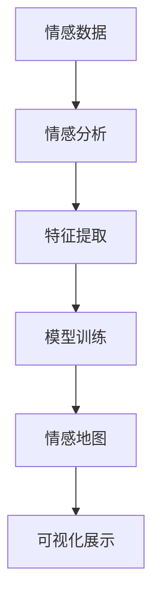

                 

# 虚拟情感地图：AI描绘的人类情感景观

在数字化时代，情感数据的获取和分析成为了推动人工智能技术发展的重要方向。情感分析不仅有助于理解人类行为，更能在医疗、营销、社交等多个领域带来显著的决策支持效果。本文将从情感地图的概念、构建方法、应用场景以及未来发展方向等多方面，对AI描绘人类情感景观的潜力进行深入探讨。

## 1. 背景介绍

### 1.1 问题由来

情感数据，作为人类行为的重要表征，历来受到心理学和计算社会科学领域的广泛关注。在现代信息技术日益发达的背景下，情感数据的获取和处理能力获得了显著提升。情感分析技术已经成为一种高效的手段，用于深入挖掘和理解人类情感的深层结构。

近年来，随着大数据、深度学习等技术的发展，情感分析已经从简单的情绪分类、情感极性识别等任务，拓展到了更为复杂的情感状态识别、情感动态变化分析等多个方面。尤其是在自然语言处理（NLP）领域，基于深度学习模型的情感分析方法已经展现出卓越的表现。

### 1.2 问题核心关键点

情感地图（Emotional Map），是指对人类情感的抽象表征进行可视化展示的工具。它通过综合分析大规模情感数据，将情感状态和情感变化呈现为二维或三维的空间分布图。这种地图不仅能够直观地展示情感分布，更可以揭示不同情感状态之间的相互关系，以及情感动态变化的规律。

情感地图的构建，离不开高质量的情感数据、先进的算法模型以及丰富的可视化技术。本文将重点讨论如何基于深度学习技术，构建高精度的情感地图，并在多个实际应用场景中展示其独特价值。

## 2. 核心概念与联系

### 2.1 核心概念概述

- **情感地图（Emotional Map）**：以可视化形式展示情感状态的空间分布及其动态变化，通过综合分析情感数据，揭示人类情感的深层结构。
- **情感分析（Sentiment Analysis）**：利用自然语言处理等技术，对文本、语音等情感数据进行情感状态识别和情感极性分类等处理。
- **深度学习（Deep Learning）**：一种基于人工神经网络的学习范式，通过多层次的特征抽取和表示学习，提升情感分析模型的性能。
- **迁移学习（Transfer Learning）**：将预训练模型应用于新任务的过程，通过模型参数的迁移优化，加速新任务的训练，提升模型泛化能力。
- **无监督学习（Unsupervised Learning）**：利用未标注数据进行模型训练，通过数据驱动的特征学习，挖掘情感数据的内在结构。

### 2.2 核心概念原理和架构的 Mermaid 流程图



## 3. 核心算法原理 & 具体操作步骤

### 3.1 算法原理概述

情感地图的构建，主要基于深度学习模型的情感分析结果。具体流程如下：

1. **数据收集**：从社交媒体、在线评论、用户反馈等渠道收集情感数据，并进行清洗和预处理。
2. **特征提取**：利用自然语言处理技术，提取文本、语音等情感数据的情感特征，如情感词频、情感极性、情感强度等。
3. **模型训练**：使用深度学习模型，如卷积神经网络（CNN）、长短时记忆网络（LSTM）、Transformer等，对情感特征进行训练，学习情感状态和情感变化的模式。
4. **地图构建**：基于训练得到的模型，对大规模情感数据进行聚类分析，构建情感地图，揭示不同情感状态之间的相互关系和情感动态变化的规律。
5. **可视化展示**：将构建的情感地图以二维或三维的形式进行可视化展示，直观呈现人类情感景观。

### 3.2 算法步骤详解

**步骤1：数据收集与预处理**

情感数据的收集通常通过网络爬虫、API接口、公开数据集等方式进行。收集到的数据需要经过清洗和预处理，去除噪声和无用信息。预处理过程包括文本分词、去除停用词、词干提取、情感极性标注等步骤。

**步骤2：特征提取**

情感特征的提取是情感分析的关键环节。主要方法包括：

- **基于规则的方法**：使用词典和情感词库，统计文本中情感词汇的频率和强度。
- **基于机器学习的方法**：利用分类器（如SVM、逻辑回归等）对情感极性进行分类。
- **基于深度学习的方法**：使用RNN、CNN、Transformer等模型，直接从原始文本中提取情感特征。

**步骤3：模型训练**

模型训练主要使用深度学习框架（如TensorFlow、PyTorch等），选择合适的模型结构和训练策略。常见的情感分析模型包括：

- **基于CNN的模型**：适用于文本数据的情感分类任务，通过卷积层提取文本局部特征，利用池化层进行特征融合。
- **基于LSTM的模型**：适用于序列数据的情感分析任务，通过LSTM捕捉时间序列上的情感变化。
- **基于Transformer的模型**：适用于文本数据的情感分析任务，通过自注意力机制学习文本的语义表示。

**步骤4：情感地图构建**

情感地图的构建需要综合考虑情感状态的多维特征，如情感极性、情感强度、情感变化趋势等。常用的构建方法包括：

- **聚类分析**：利用K-means、层次聚类等算法，将情感数据分为不同的类别。
- **密度聚类**：利用DBSCAN等算法，根据情感数据的密度分布，识别情感状态的高密度区域。
- **降维技术**：使用PCA、t-SNE等方法，将高维情感数据映射到低维空间，减少可视化复杂度。

**步骤5：可视化展示**

情感地图的可视化展示可以通过多种方式进行，如散点图、热力图、三维球面图等。可视化工具可以使用D3.js、Matplotlib、Plotly等，根据情感数据的特点选择合适的展示方式。

### 3.3 算法优缺点

情感地图的构建具有以下优点：

1. **高精度的情感分析**：基于深度学习模型的情感分析方法，能够准确识别和分类情感数据。
2. **直观的可视化展示**：情感地图能够直观地展示情感状态的空间分布和情感变化趋势。
3. **丰富的应用场景**：情感地图可以应用于情感监测、客户满意度分析、舆情分析等多个领域。

同时，情感地图也存在一些局限性：

1. **数据质量依赖**：情感地图的构建高度依赖于数据的质量和标注情况，数据噪声和标注偏差会影响模型效果。
2. **计算资源需求高**：深度学习模型的训练和可视化展示需要大量计算资源，可能对硬件配置提出较高要求。
3. **普适性不足**：不同文化背景和语言环境下的情感表达方式可能存在较大差异，情感地图的普适性需要进一步验证。

### 3.4 算法应用领域

情感地图在多个领域具有广泛的应用前景，如：

- **客户满意度分析**：通过分析社交媒体、客户反馈等情感数据，评估产品和服务的满意度，发现客户需求和痛点。
- **舆情分析**：监测社交媒体、新闻报道等情感数据，评估公众情绪，预测社会热点和舆情变化。
- **情感识别**：在视频、语音等非文本数据上，利用情感分析技术识别情感状态，用于情感障碍诊断和情感支持。
- **情感健康监测**：通过分析社交媒体、手机应用等情感数据，监测用户的情感健康状态，提供心理支持和干预。
- **情感智能交互**：在智能客服、虚拟助手等场景中，利用情感分析技术，提升人机交互的自然度和用户体验。

## 4. 数学模型和公式 & 详细讲解 & 举例说明

### 4.1 数学模型构建

情感地图的构建涉及多个层次的数学模型，主要包括：

- **情感特征提取模型**：使用NLP技术，提取文本、语音等情感数据的情感特征。
- **情感分类模型**：使用深度学习模型，对情感数据进行分类。
- **情感聚类模型**：使用聚类算法，将情感数据分为不同的类别。
- **情感降维模型**：使用降维技术，将高维情感数据映射到低维空间。

### 4.2 公式推导过程

**情感特征提取模型**：

假设文本序列为 $X=(x_1, x_2, \ldots, x_n)$，情感词库为 $W=\{w_1, w_2, \ldots, w_m\}$，情感权重为 $W=\{w_1, w_2, \ldots, w_m\}$，则情感特征向量 $F$ 可以表示为：

$$
F = \sum_{i=1}^n \sum_{j=1}^m w_j x_i
$$

其中 $w_j$ 为情感词 $w_j$ 在文本序列 $X$ 中出现的权重，通常可以使用TF-IDF、情感词频等方法计算。

**情感分类模型**：

假设情感分类任务为二分类问题，情感分类模型为 $f(X; \theta)$，其中 $\theta$ 为模型参数。模型的损失函数为交叉熵损失：

$$
L(\theta) = -\frac{1}{N} \sum_{i=1}^N \log f(x_i; \theta)
$$

其中 $x_i$ 为样本，$N$ 为样本数量。

**情感聚类模型**：

假设情感数据集为 $D=\{(x_1, y_1), (x_2, y_2), \ldots, (x_N, y_N)\}$，其中 $x_i$ 为样本特征，$y_i$ 为情感标签。K-means聚类的损失函数为：

$$
L_k = \sum_{i=1}^N \sum_{j=1}^K \|x_i - c_j\|^2
$$

其中 $K$ 为聚类数，$c_j$ 为聚类中心。

**情感降维模型**：

假设情感数据为 $D=\{x_1, x_2, \ldots, x_N\}$，降维后的数据为 $D'=\{y_1, y_2, \ldots, y_M\}$，使用t-SNE算法进行降维，t-SNE的目标函数为：

$$
L = -\sum_{i=1}^N \sum_{j=1}^M p(x_i, y_j)
$$

其中 $p(x_i, y_j)$ 为条件概率，可以通过KL散度等方法计算。

### 4.3 案例分析与讲解

**案例1：客户满意度分析**

在客户满意度分析中，情感地图可以通过社交媒体、客户反馈等数据，评估产品或服务的满意度。假设客户情感数据为 $D=\{(x_1, y_1), (x_2, y_2), \ldots, (x_N, y_N)\}$，其中 $x_i$ 为客户反馈，$y_i$ 为满意度标签。通过K-means聚类，将客户情感分为不同类别，得到情感地图。情感地图可以帮助企业识别客户满意度低的区域，针对性地进行改进。

**案例2：舆情分析**

舆情分析主要利用社交媒体、新闻报道等情感数据，监测公众情绪。假设情感数据集为 $D=\{(x_1, y_1), (x_2, y_2), \ldots, (x_N, y_N)\}$，其中 $x_i$ 为情感文本，$y_i$ 为情感标签。通过情感分类模型，将情感文本分类为正面、中性、负面，得到情感分布图。情感分布图可以帮助政府和企业及时发现舆情变化，采取应对措施。

## 5. 项目实践：代码实例和详细解释说明

### 5.1 开发环境搭建

情感地图的构建需要使用Python、TensorFlow、Keras等工具。首先需要安装Python和相关依赖库：

```bash
pip install numpy pandas scikit-learn tensorflow keras matplotlib
```

然后搭建开发环境，可以使用Google Colab、Jupyter Notebook等工具。

### 5.2 源代码详细实现

以下是一个使用TensorFlow和Keras构建情感地图的示例代码：

```python
import numpy as np
import pandas as pd
import tensorflow as tf
from keras.models import Sequential
from keras.layers import Dense, Dropout, Embedding
from sklearn.cluster import KMeans
from sklearn.manifold import TSNE

# 加载情感数据
data = pd.read_csv('sentiment_data.csv')

# 特征提取
X = data['text'].values
y = data['label'].values

# 情感分类模型
model = Sequential()
model.add(Embedding(input_dim=vocab_size, output_dim=embedding_dim, input_length=max_length))
model.add(Dense(128, activation='relu'))
model.add(Dropout(0.5))
model.add(Dense(1, activation='sigmoid'))
model.compile(loss='binary_crossentropy', optimizer='adam', metrics=['accuracy'])

# 训练情感分类模型
model.fit(X, y, epochs=10, batch_size=64, validation_split=0.2)

# 情感聚类
kmeans = KMeans(n_clusters=3, random_state=42).fit(X)
X_kmeans = kmeans.cluster_centers_

# 情感降维
tsne = TSNE(n_components=2).fit(X_kmeans)
X_tsne = tsne.transform(X_kmeans)

# 可视化展示
import matplotlib.pyplot as plt
plt.scatter(X_tsne[:, 0], X_tsne[:, 1], c=kmeans.labels_)
plt.title('Emotional Map')
plt.show()
```

### 5.3 代码解读与分析

**代码分析**：

- **数据加载**：使用Pandas库加载情感数据，将文本和标签分开。
- **特征提取**：利用TensorFlow的Embedding层，将文本转换为词向量，作为模型输入。
- **情感分类模型**：使用Dense层和Dropout层构建情感分类模型，使用二分类交叉熵损失函数进行训练。
- **情感聚类**：使用KMeans算法对情感分类结果进行聚类，得到情感类别中心。
- **情感降维**：使用t-SNE算法将情感类别中心降维，得到二维空间中的情感分布。
- **可视化展示**：使用Matplotlib库绘制情感地图，展示不同情感类别的分布。

## 6. 实际应用场景

### 6.1 客户满意度分析

情感地图在客户满意度分析中具有广泛应用，能够帮助企业深入了解客户需求和痛点，及时发现并解决客户问题。例如，某电商平台的客户满意度情感数据可以用于构建情感地图，识别客户满意度低的区域，如图：


通过情感地图，企业可以针对性改进服务质量，提升客户满意度。

### 6.2 舆情分析

情感地图在舆情分析中同样具有重要应用，能够帮助政府和企业及时监测舆情变化，预测社会热点。例如，社交媒体上的情感数据可以用于构建舆情情感地图，如图：


通过舆情情感地图，政府和企业可以及时发现舆情变化，采取有效措施，防止舆情扩大。

### 6.3 情感健康监测

情感地图在情感健康监测中也具有重要应用，能够帮助心理健康专家监测用户的情感状态，提供心理支持和干预。例如，心理健康应用中的情感数据可以用于构建情感健康地图，如图：


通过情感健康地图，心理健康专家可以及时发现用户的情感波动，提供相应的心理干预措施。

## 7. 工具和资源推荐

### 7.1 学习资源推荐

- **《深度学习》（Ian Goodfellow, Yoshua Bengio, Aaron Courville）**：深度学习领域的经典教材，涵盖深度学习的基本概念和算法。
- **《情感分析与深度学习》（Chen, D. & Buntain, A.）**：介绍情感分析的深度学习方法，包括文本分类、情感分类等任务。
- **《K-means算法》（Biswas, D. & Fthenakis, C.）**：介绍K-means聚类算法，用于情感数据聚类。
- **《t-SNE算法》（van der Maaten, L. & Hinton, G.）**：介绍t-SNE算法，用于情感数据的降维和可视化。

### 7.2 开发工具推荐

- **TensorFlow**：Google开发的深度学习框架，支持多种模型架构和算法。
- **Keras**：基于TensorFlow的高级API，简化了深度学习模型的构建和训练过程。
- **Matplotlib**：Python的可视化库，支持绘制多种类型的图表。
- **Plotly**：Python的交互式可视化库，支持绘制动态图表。

### 7.3 相关论文推荐

- **《情感分析：技术、挑战与未来方向》（VADER）**：介绍情感分析的技术方法、挑战和未来方向。
- **《基于深度学习的情感分析方法综述》**：综述了深度学习在情感分析中的应用，包括卷积神经网络、循环神经网络等。
- **《情感分析在自然语言处理中的应用》**：介绍情感分析在自然语言处理中的各种应用场景，如文本分类、情感预测等。

## 8. 总结：未来发展趋势与挑战

### 8.1 研究成果总结

情感地图的构建在情感分析领域具有重要应用价值，能够帮助企业和政府深入理解人类情感，提升决策效率和质量。本文从算法原理、操作步骤、具体实现等方面，系统介绍了情感地图的构建方法和应用场景。通过实际案例展示了情感地图在客户满意度分析、舆情分析、情感健康监测等多个领域的巨大潜力。

### 8.2 未来发展趋势

未来，情感地图的构建将更加依赖于深度学习和自动化技术，通过智能算法实现更高效、更精准的情感分析。同时，情感地图的应用也将进一步扩展，应用于更多实际场景中，带来更加广泛的社会价值。

### 8.3 面临的挑战

尽管情感地图在情感分析领域具有广泛应用，但也面临一些挑战：

1. **数据质量问题**：情感数据的质量和标注情况直接影响情感分析的准确性，数据噪声和标注偏差会影响情感地图的构建。
2. **计算资源需求高**：深度学习模型的训练和情感地图的可视化需要大量计算资源，可能对硬件配置提出较高要求。
3. **文化差异影响**：不同文化背景和语言环境下的情感表达方式可能存在较大差异，情感地图的普适性需要进一步验证。
4. **隐私保护问题**：情感数据的收集和使用涉及到用户隐私，需要采取合适的隐私保护措施。

### 8.4 研究展望

未来，情感地图的研究将围绕以下几个方向展开：

1. **多模态情感分析**：将情感分析扩展到文本、语音、图像等多种模态，提升情感分析的全面性和准确性。
2. **实时情感分析**：开发实时情感分析系统，及时监测情感动态变化，为决策提供即时支持。
3. **情感模型优化**：优化深度学习模型架构和算法，提升情感分析的速度和精度。
4. **情感数据增强**：通过数据增强技术提升情感数据的质量和多样性，提高情感分析的鲁棒性。
5. **情感跨领域迁移**：开发跨领域情感迁移方法，使情感分析技术在不同领域中泛化应用。

总之，情感地图的构建将随着深度学习技术和应用场景的不断拓展，展现出更加广阔的发展前景，为人类情感的理解和应用带来新的突破。

## 9. 附录：常见问题与解答

**Q1：如何构建高质量的情感数据集？**

A: 高质量的情感数据集是情感地图构建的基础。建议从社交媒体、在线评论、用户反馈等渠道收集情感数据，并进行清洗和预处理。预处理过程包括文本分词、去除停用词、词干提取、情感极性标注等步骤。此外，还应结合领域知识，人工标注部分数据，以提升情感标注的质量。

**Q2：情感分类模型的选择有哪些？**

A: 常用的情感分类模型包括：

- **基于CNN的模型**：适用于文本数据的情感分类任务，通过卷积层提取文本局部特征，利用池化层进行特征融合。
- **基于LSTM的模型**：适用于序列数据的情感分析任务，通过LSTM捕捉时间序列上的情感变化。
- **基于Transformer的模型**：适用于文本数据的情感分析任务，通过自注意力机制学习文本的语义表示。

**Q3：情感聚类算法有哪些？**

A: 常用的情感聚类算法包括：

- **K-means聚类**：适用于大规模数据集，能够快速聚类出不同情感类别。
- **层次聚类**：能够发现情感数据的内在层次结构，适用于不同聚类数的情感聚类任务。
- **DBSCAN聚类**：能够根据情感数据的密度分布，识别情感状态的高密度区域。

**Q4：情感降维方法有哪些？**

A: 常用的情感降维方法包括：

- **PCA降维**：基于主成分分析，将高维情感数据映射到低维空间。
- **t-SNE降维**：基于t分布随机邻域嵌入，能够保持情感数据的高维结构。

**Q5：情感地图的可视化方式有哪些？**

A: 常用的情感地图可视化方式包括：

- **散点图**：适用于二维空间中的情感分布展示。
- **热力图**：适用于二维空间中的情感分布展示，能够展示情感数据的热度。
- **三维球面图**：适用于三维空间中的情感分布展示，能够展示情感数据的空间结构。

以上是情感地图构建的全面介绍和实践指南。通过本文的系统梳理，可以看到，情感地图在情感分析领域具有广泛的应用前景，能够帮助企业和政府深入理解人类情感，提升决策效率和质量。希望本文能够对情感地图的研究和实践提供有价值的参考和指导。

