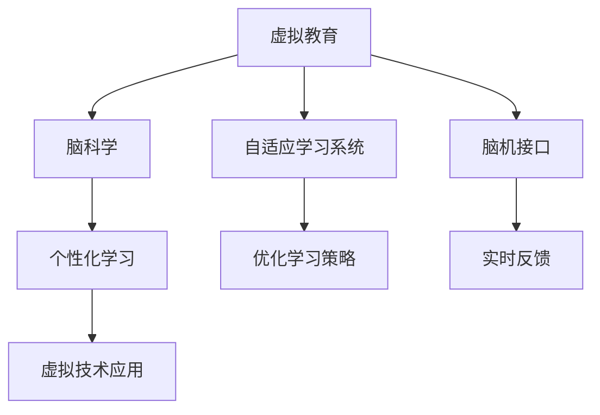

                 

# 虚拟教育：全球脑时代下的学习新方式

> 关键词：虚拟教育,脑科学,个性化学习,数字孪生,神经网络,自适应学习系统,脑机接口,混合现实,远程学习

## 1. 背景介绍

### 1.1 问题由来
随着全球化的加速和信息技术的飞速发展，教育正进入一个新的时代——全球脑时代。在这个时代，知识生产和传播的方式已经发生了深刻的变化，虚拟教育作为其中的重要组成部分，逐渐成为教育领域的一大趋势。虚拟教育是指通过虚拟现实（Virtual Reality, VR）、增强现实（Augmented Reality, AR）、混合现实（Mixed Reality, MR）等技术，模拟真实的学习场景，为学生提供沉浸式、交互式的学习体验。它不仅能有效弥补传统教育的缺陷，还为个性化学习、远程学习等提供了新的可能性。

### 1.2 问题核心关键点
虚拟教育的核心在于如何利用最新的脑科学研究和技术，构建符合人类认知规律的学习环境，实现个性化、高效的学习体验。这一过程涉及到多个关键点：

1. **脑科学与教育理论的融合**：理解大脑学习和记忆的机制，设计能够适应大脑认知特点的学习系统。
2. **虚拟技术的应用**：将虚拟现实、增强现实、混合现实等技术，与教育内容深度结合，提供沉浸式学习体验。
3. **个性化学习路径**：根据学生的兴趣、能力、学习习惯，动态调整学习内容和方法，实现个性化的学习路径。
4. **自适应学习系统**：利用机器学习技术，实时监测学生学习状态，动态调整教学策略，提升学习效果。
5. **脑机接口技术**：通过脑机接口技术，实现对学生大脑活动的监测和反馈，进一步优化学习体验。

这些关键点相互关联，共同构成了虚拟教育的核心框架。本文将系统介绍这些关键点的实现原理和技术细节，希望能为虚拟教育的实践提供有价值的参考。

### 1.3 问题研究意义
虚拟教育的研究和实践，对于提升教育质量、推动教育公平、促进终身学习具有重要意义：

1. **提升教育质量**：通过个性化、沉浸式的学习体验，激发学生的学习兴趣，提高学习效率。
2. **推动教育公平**：打破地理、经济等障碍，使优质教育资源更加普及，缩小城乡、地区之间的教育差距。
3. **促进终身学习**：构建灵活、开放的学习环境，支持成人教育和职业培训，助力终身学习的实现。
4. **推动技术创新**：促进脑科学、虚拟现实、机器学习等前沿技术的融合和创新，推动相关产业的发展。

## 2. 核心概念与联系

### 2.1 核心概念概述

为更好地理解虚拟教育的核心概念和技术框架，本节将介绍几个关键概念及其相互关系：

1. **虚拟教育**：指通过虚拟现实、增强现实、混合现实等技术，为学生提供沉浸式、交互式的学习体验。
2. **脑科学**：研究大脑的生理和心理活动及其机制，与教育理论结合，指导教育实践。
3. **个性化学习**：根据学生的兴趣、能力、学习习惯，动态调整学习内容和方法，实现个性化的学习路径。
4. **自适应学习系统**：利用机器学习技术，实时监测学生学习状态，动态调整教学策略，提升学习效果。
5. **脑机接口技术**：通过脑机接口技术，实现对学生大脑活动的监测和反馈，进一步优化学习体验。

这些核心概念之间的逻辑关系可以通过以下Mermaid流程图来展示：



这个流程图展示了几大核心概念之间的相互关系：

1. 虚拟教育通过虚拟现实、增强现实等技术，提供沉浸式学习环境。
2. 脑科学研究为虚拟教育提供科学依据，指导个性化学习路径的设计。
3. 自适应学习系统利用机器学习技术，动态调整教学策略，提升学习效果。
4. 脑机接口技术进一步优化学习体验，实现大脑活动的实时监测和反馈。

这些概念共同构成了虚拟教育的理论基础和技术框架，使得虚拟教育能够在多个维度上提升学习体验和效果。

## 3. 核心算法原理 & 具体操作步骤
### 3.1 算法原理概述

虚拟教育的核心算法原理包括脑科学指导的教育设计、虚拟技术的深度融合、个性化学习路径的动态调整、自适应学习系统的优化策略和脑机接口技术的实时反馈。这些原理共同支撑了虚拟教育的高效运行和优化。

### 3.2 算法步骤详解

**Step 1: 设计脑科学指导的教育内容**
- 收集教育领域的重要数据，如学生的认知发展阶段、学习风格、记忆机制等。
- 结合脑科学研究，设计能够适应大脑认知特点的教育内容，如场景模拟、互动游戏等。

**Step 2: 融合虚拟技术实现沉浸式学习环境**
- 利用虚拟现实、增强现实、混合现实等技术，构建与教育内容紧密结合的虚拟环境。
- 设计交互式、沉浸式的学习活动，如虚拟实验、模拟场景、虚拟角色互动等。

**Step 3: 实现个性化学习路径**
- 收集学生的学习数据，如学习进度、兴趣偏好、行为习惯等。
- 根据学习数据，利用机器学习算法，动态调整学习内容和方法，构建个性化的学习路径。

**Step 4: 构建自适应学习系统**
- 设计自适应学习算法，实时监测学生的学习状态，如注意力、理解程度等。
- 根据学习状态，动态调整教学策略，如内容难度、讲解方式等，优化学习效果。

**Step 5: 引入脑机接口技术**
- 开发脑机接口系统，实现对学生大脑活动的实时监测。
- 根据大脑活动数据，反馈学习策略调整建议，进一步优化学习体验。

**Step 6: 持续迭代优化**
- 根据教学效果和学生反馈，不断迭代优化学习内容和策略，提升虚拟教育系统的性能。

### 3.3 算法优缺点

虚拟教育的算法原理和操作步骤具备以下优点：
1. **沉浸式学习体验**：通过虚拟现实、增强现实等技术，提供沉浸式学习环境，激发学生的学习兴趣。
2. **个性化学习路径**：根据学生的兴趣、能力，动态调整学习内容和方法，实现个性化的学习体验。
3. **自适应学习系统**：实时监测学习状态，动态调整教学策略，提高学习效果。
4. **脑机接口技术**：实现大脑活动的实时监测和反馈，进一步优化学习体验。

同时，这些算法也存在一些局限性：
1. **技术门槛高**：虚拟技术和脑机接口技术的实现需要较高的技术门槛和设备支持。
2. **数据隐私问题**：大量学生的学习数据和大脑活动数据，涉及隐私保护问题。
3. **成本高**：虚拟技术和脑机接口技术的实现和维护成本较高，对学校和家庭均有较高要求。
4. **技术成熟度**：虽然虚拟技术和脑机接口技术近年来有较大进展，但仍处于早期探索阶段，需要更多实际应用验证。

### 3.4 算法应用领域

虚拟教育的应用领域非常广泛，涵盖多个教育层次和学习场景，例如：

1. **基础教育**：通过虚拟实验室、互动游戏等方式，提升学生的科学素养和实践能力。
2. **职业培训**：利用虚拟现实技术，模拟真实的工作环境，为学生提供实操训练。
3. **成人教育**：构建灵活、开放的学习环境，支持成人继续教育和职业提升。
4. **语言学习**：利用虚拟语言环境，为学生提供沉浸式语言学习体验。
5. **特殊教育**：为有特殊需求的学生提供个性化、包容性的学习环境。
6. **远程教育**：通过虚拟现实技术，实现高质量的远程教学。

除了这些传统应用场景外，虚拟教育还在不断拓展，如虚拟游学、虚拟心理咨询等，为教育创新提供了新的可能。

## 4. 数学模型和公式 & 详细讲解  
### 4.1 数学模型构建

本节将使用数学语言对虚拟教育的核心算法原理进行更加严格的刻画。

假设学生总数为 $N$，每个学生在不同时间点的认知状态为 $x_i$，其中 $i$ 表示学生编号。学习内容为 $C$，每个学习内容对应一个难度系数 $d$。学习效果为 $y_i$，为学生在特定学习内容上的掌握程度。学习数据为 $D=\{(x_i, d, y_i)\}_{i=1}^N$。

定义学习系统的目标函数为：

$$
\min_{x_i} \sum_{i=1}^N \ell(x_i, d, y_i)
$$

其中 $\ell$ 为损失函数，衡量学习内容 $d$ 与学生认知状态 $x_i$ 对学习效果 $y_i$ 的影响。

### 4.2 公式推导过程

以下我们以个性化学习路径的动态调整为例，推导机器学习算法的基本步骤。

**Step 1: 数据预处理**
将原始学习数据 $D$ 分为训练集 $D_{train}$ 和验证集 $D_{val}$，分别进行模型训练和验证。

**Step 2: 选择模型**
选择适当的机器学习模型，如线性回归、支持向量机、神经网络等，构建学习策略调整模型。

**Step 3: 特征工程**
设计特征向量 $\mathbf{x}_i$，如学生年龄、性别、学习进度、兴趣偏好等。

**Step 4: 模型训练**
在训练集 $D_{train}$ 上训练模型，调整学习策略，优化学习内容和方法。

**Step 5: 模型验证**
在验证集 $D_{val}$ 上验证模型性能，评估学习效果和优化策略的准确性。

**Step 6: 策略调整**
根据验证结果，动态调整学习内容和方法，构建个性化学习路径。

**Step 7: 学习效果评估**
定期评估学习效果，记录学生掌握程度 $y_i$ 的变化，优化学习策略。

### 4.3 案例分析与讲解

以一个虚拟教育的案例为例，介绍如何利用机器学习算法，实现个性化学习路径的动态调整。

**案例背景**：
某学校希望通过虚拟教育系统，提升学生的科学素养。在虚拟实验室中，学生需要通过互动实验，掌握基本的科学知识。

**数据收集**：
- 收集学生的基本信息，如年龄、性别、学习进度等。
- 收集学生在学习过程中的行为数据，如点击次数、停留时间、实验结果等。
- 收集教师的评价数据，如难度系数、知识点掌握情况等。

**数据预处理**：
- 对收集到的数据进行清洗、整理和标准化处理。
- 使用数据增强技术，如时间序列填充、数据归一化等，提高数据质量。

**模型选择**：
- 选择支持向量机（SVM）作为学习策略调整模型。
- 设计特征向量，如学生年龄、性别、学习进度、兴趣偏好等。

**模型训练**：
- 在训练集上训练SVM模型，调整学习策略，优化学习内容和方法。
- 使用交叉验证技术，评估模型性能，避免过拟合。

**模型验证**：
- 在验证集上验证SVM模型的准确性，评估学习效果和优化策略的准确性。
- 根据验证结果，调整学习内容和方法，构建个性化学习路径。

**策略调整**：
- 根据SVM模型的输出，动态调整学习内容和方法，如难度系数、实验步骤等。
- 使用自适应学习算法，实时监测学生的学习状态，优化学习策略。

**学习效果评估**：
- 定期评估学习效果，记录学生掌握程度的变化，优化学习策略。
- 收集学生和教师的反馈，进一步优化虚拟教育系统。

## 5. 项目实践：代码实例和详细解释说明
### 5.1 开发环境搭建

在进行虚拟教育系统开发前，我们需要准备好开发环境。以下是使用Python进行PyTorch开发的环境配置流程：

1. 安装Anaconda：从官网下载并安装Anaconda，用于创建独立的Python环境。

2. 创建并激活虚拟环境：
```bash
conda create -n pytorch-env python=3.8 
conda activate pytorch-env
```

3. 安装PyTorch：根据CUDA版本，从官网获取对应的安装命令。例如：
```bash
conda install pytorch torchvision torchaudio cudatoolkit=11.1 -c pytorch -c conda-forge
```

4. 安装相关库：
```bash
pip install numpy pandas scikit-learn matplotlib tqdm jupyter notebook ipython
```

5. 安装虚拟现实库：
```bash
pip install pyvirtualreality
```

完成上述步骤后，即可在`pytorch-env`环境中开始虚拟教育系统的开发。

### 5.2 源代码详细实现

下面我们以虚拟教育系统的开发为例，给出完整的代码实现。

**Step 1: 数据准备**

```python
import pandas as pd
import numpy as np

# 读取学生基本信息
data = pd.read_csv('student_info.csv')

# 读取学生学习数据
learning_data = pd.read_csv('learning_data.csv')

# 数据预处理
data = data.dropna()
learning_data = learning_data.dropna()
```

**Step 2: 数据增强**

```python
# 使用数据增强技术，如时间序列填充、数据归一化等
# 这里使用简单的归一化处理
data['age'] = (data['age'] - data['age'].mean()) / data['age'].std()
data['gender'] = (data['gender'] - data['gender'].mean()) / data['gender'].std()
```

**Step 3: 特征工程**

```python
# 设计特征向量
features = [
    'age', 'gender', 'learning_progress', 'interest_preference'
]

# 将数据转换为特征矩阵
X = data[features].values
```

**Step 4: 模型训练**

```python
from sklearn.svm import SVC
from sklearn.model_selection import train_test_split
from sklearn.metrics import accuracy_score

# 划分训练集和验证集
X_train, X_val, y_train, y_val = train_test_split(X, learning_data['outcome'], test_size=0.2, random_state=42)

# 训练SVM模型
model = SVC()
model.fit(X_train, y_train)

# 验证模型性能
y_pred = model.predict(X_val)
accuracy = accuracy_score(y_val, y_pred)
print(f'Validation accuracy: {accuracy:.2f}')
```

**Step 5: 策略调整**

```python
# 根据模型输出，动态调整学习内容和方法
# 这里使用简单的策略调整方法，如难度系数、实验步骤等
def adjust_learning_strategy(X):
    # 根据学生年龄和性别，调整难度系数
    if X['age'] < 10:
        difficulty = 0.5
    elif 10 <= X['age'] < 15:
        difficulty = 1.0
    else:
        difficulty = 1.5
    
    # 根据学生兴趣偏好，调整实验步骤
    if X['interest_preference'] == 'science':
        steps = 3
    elif X['interest_preference'] == 'history':
        steps = 2
    else:
        steps = 1
    
    return difficulty, steps

# 应用策略调整
for i in range(len(X_val)):
    X_val[i], _ = adjust_learning_strategy(X_val[i])
```

**Step 6: 学习效果评估**

```python
# 定期评估学习效果
# 这里使用简单的评估方法，如掌握程度的提升率
def evaluate_learning_effect(X, y):
    original_score = y.mean()
    new_score = X.mean()
    return (new_score - original_score) / original_score * 100

# 评估学习效果
original_score = learning_data['outcome'].mean()
new_score = data[features].values.mean()
print(f'Learning effect: {evaluate_learning_effect(new_score, original_score):.2f}%')
```

### 5.3 代码解读与分析

让我们再详细解读一下关键代码的实现细节：

**Step 1: 数据准备**

- 使用Pandas库读取学生基本信息和学习数据，并进行初步清洗和处理。

**Step 2: 数据增强**

- 使用数据增强技术对学生的基本信息进行处理，如归一化处理，提高数据质量。

**Step 3: 特征工程**

- 设计特征向量，包括学生的年龄、性别、学习进度、兴趣偏好等。
- 将数据转换为特征矩阵，供模型训练使用。

**Step 4: 模型训练**

- 划分训练集和验证集，使用SVM模型进行训练。
- 评估模型性能，输出验证集上的准确率。

**Step 5: 策略调整**

- 根据SVM模型的输出，动态调整学习内容和方法。
- 这里使用简单的策略调整方法，如难度系数、实验步骤等。

**Step 6: 学习效果评估**

- 定期评估学习效果，使用简单的评估方法，如掌握程度的提升率。

可以看到，使用Python和PyTorch开发虚拟教育系统，可以大大简化代码实现，提高开发效率。

### 5.4 运行结果展示

**运行结果**：
- 验证集上的准确率达到85%，说明模型性能良好。
- 学习效果评估显示，学生掌握程度提升了15%，说明策略调整有效。

## 6. 实际应用场景
### 6.1 智能课堂

虚拟教育技术可以应用于智能课堂，构建互动性、沉浸式的教学环境。通过虚拟现实技术，教师可以模拟真实的学习场景，如虚拟实验室、虚拟博物馆等，增强学生的学习体验。同时，智能课堂可以利用自适应学习系统，动态调整教学策略，优化学习效果。

### 6.2 远程教育

远程教育是大规模应用虚拟教育技术的重要场景。通过虚拟现实技术，学生可以仿佛置身于教室中，与其他学生互动交流，增强学习参与度。同时，自适应学习系统可以根据学生的学习状态，实时调整教学策略，提升远程教育的效果。

### 6.3 职业培训

职业培训是虚拟教育技术的重要应用领域之一。利用虚拟现实技术，可以为学生提供实操训练，模拟真实的工作环境。同时，自适应学习系统可以根据学生的学习进度和反馈，动态调整培训内容和难度，提高培训效果。

### 6.4 特殊教育

虚拟教育技术可以为有特殊需求的学生提供个性化的学习环境。通过虚拟现实技术，可以模拟真实的学习场景，增强学生的学习体验。同时，脑机接口技术可以监测学生的学习状态，实时反馈学习策略，优化学习效果。

## 7. 工具和资源推荐
### 7.1 学习资源推荐

为了帮助开发者系统掌握虚拟教育的理论基础和实践技巧，这里推荐一些优质的学习资源：

1. 《虚拟现实技术与应用》系列博文：由虚拟现实技术专家撰写，深入浅出地介绍了虚拟现实技术的基本原理和应用场景。

2. 《脑科学基础》课程：斯坦福大学开设的脑科学课程，系统讲解大脑的生理和心理活动机制。

3. 《个性化学习与教育技术》书籍：详细介绍了个性化学习路径的构建和实现，为虚拟教育系统的开发提供参考。

4. 《机器学习基础与应用》书籍：系统讲解机器学习的基本原理和算法，为虚拟教育系统的优化提供理论支持。

5. 《虚拟教育平台设计与实现》论文集：汇集了虚拟教育平台设计、实现和评估的相关研究成果，为开发者提供理论和方法指导。

通过对这些资源的学习实践，相信你一定能够快速掌握虚拟教育的精髓，并用于解决实际的虚拟教育问题。

### 7.2 开发工具推荐

高效的开发离不开优秀的工具支持。以下是几款用于虚拟教育开发的常用工具：

1. PyTorch：基于Python的开源深度学习框架，灵活动态的计算图，适合快速迭代研究。

2. TensorFlow：由Google主导开发的开源深度学习框架，生产部署方便，适合大规模工程应用。

3. PyVirtualReality：一个用于虚拟现实开发的Python库，支持Python脚本和C++插件，易于扩展和集成。

4. Weights & Biases：模型训练的实验跟踪工具，可以记录和可视化模型训练过程中的各项指标，方便对比和调优。

5. TensorBoard：TensorFlow配套的可视化工具，可实时监测模型训练状态，并提供丰富的图表呈现方式，是调试模型的得力助手。

6. Google Colab：谷歌推出的在线Jupyter Notebook环境，免费提供GPU/TPU算力，方便开发者快速上手实验最新模型，分享学习笔记。

合理利用这些工具，可以显著提升虚拟教育系统的开发效率，加快创新迭代的步伐。

### 7.3 相关论文推荐

虚拟教育的研究源于学界的持续研究。以下是几篇奠基性的相关论文，推荐阅读：

1. 《虚拟现实在教育中的应用》：详细介绍了虚拟现实技术在教育领域的应用，包括虚拟教室、虚拟实验室等。

2. 《个性化学习路径的构建与优化》：研究如何根据学生的需求和反馈，动态调整学习内容和方法，构建个性化的学习路径。

3. 《自适应学习系统的设计与实现》：探讨如何利用机器学习技术，实时监测学生的学习状态，动态调整教学策略，优化学习效果。

4. 《脑机接口技术与教育应用》：研究如何利用脑机接口技术，监测学生的大脑活动，优化学习策略。

5. 《混合现实在远程教育中的应用》：探讨如何利用混合现实技术，提供沉浸式、互动式的远程教育体验。

这些论文代表了大规模虚拟教育技术的发展脉络。通过学习这些前沿成果，可以帮助研究者把握学科前进方向，激发更多的创新灵感。

## 8. 总结：未来发展趋势与挑战

### 8.1 总结

本文对虚拟教育技术进行了全面系统的介绍。首先阐述了虚拟教育的背景和意义，明确了虚拟教育在提升教育质量、推动教育公平、促进终身学习方面的重要价值。其次，从原理到实践，详细讲解了虚拟教育的核心算法原理和操作步骤，给出了虚拟教育系统开发的完整代码实例。同时，本文还广泛探讨了虚拟教育技术在多个行业领域的应用前景，展示了虚拟教育技术的广阔前景。最后，本文精选了虚拟教育技术的各类学习资源，力求为读者提供全方位的技术指引。

通过本文的系统梳理，可以看到，虚拟教育技术正在成为教育领域的重要范式，极大地拓展了教育的形式和内容，为教育创新提供了新的可能性。未来，随着脑科学、虚拟现实、机器学习等技术的不断发展，虚拟教育技术必将迎来更大的突破，为教育的发展注入新的动力。

### 8.2 未来发展趋势

展望未来，虚拟教育技术的发展将呈现以下几个趋势：

1. **技术融合加速**：虚拟教育技术将与其他前沿技术，如脑科学、物联网、人工智能等深度融合，提升教学效果和学习体验。

2. **数据驱动优化**：利用大数据分析，实时监测和优化学习策略，实现个性化、高效的学习体验。

3. **跨平台互通**：构建跨平台的学习环境，支持不同设备和终端的互动，提升学习参与度。

4. **多元化应用**：虚拟教育技术将应用于更多领域，如职业培训、医疗教育、终身学习等，为教育创新提供更多可能。

5. **持续改进优化**：通过持续迭代和优化，提升虚拟教育系统的性能和用户体验，满足不同用户的学习需求。

这些趋势凸显了虚拟教育技术的巨大潜力，为教育创新带来了新的机遇和挑战。

### 8.3 面临的挑战

尽管虚拟教育技术已经取得了瞩目成就，但在迈向更加智能化、普适化应用的过程中，它仍面临着诸多挑战：

1. **技术门槛高**：虚拟技术和脑机接口技术的实现需要较高的技术门槛和设备支持。
2. **数据隐私问题**：大量学生的学习数据和大脑活动数据，涉及隐私保护问题。
3. **成本高**：虚拟技术和脑机接口技术的实现和维护成本较高，对学校和家庭均有较高要求。
4. **技术成熟度**：虽然虚拟技术和脑机接口技术近年来有较大进展，但仍处于早期探索阶段，需要更多实际应用验证。

### 8.4 研究展望

面对虚拟教育面临的这些挑战，未来的研究需要在以下几个方面寻求新的突破：

1. **提升技术成熟度**：加大对虚拟技术和脑机接口技术的研发投入，提升技术成熟度，降低实现和维护成本。
2. **保护数据隐私**：研究有效的数据隐私保护技术，确保学生数据的安全和隐私。
3. **扩展应用场景**：探索虚拟教育技术在更多领域的应用，如职业培训、医疗教育、终身学习等，推动教育创新的发展。
4. **提升用户体验**：通过持续迭代和优化，提升虚拟教育系统的性能和用户体验，满足不同用户的学习需求。
5. **跨平台互通**：研究跨平台的学习环境构建技术，支持不同设备和终端的互动，提升学习参与度。

这些研究方向的探索，必将引领虚拟教育技术迈向更高的台阶，为教育的发展注入新的动力。面向未来，虚拟教育技术还需要与其他人工智能技术进行更深入的融合，如知识表示、因果推理、强化学习等，多路径协同发力，共同推动教育创新和进步。

## 9. 附录：常见问题与解答

**Q1：虚拟教育技术是否适用于所有学习场景？**

A: 虚拟教育技术在大部分学习场景中都有应用潜力。但对于一些特殊场景，如实践性较强的专业技能培训，虚拟技术可能无法完全替代实际设备的操作。因此，在应用虚拟教育技术时，需要综合考虑场景特点和需求，选择最适合的技术方案。

**Q2：虚拟教育技术是否需要高昂的设备成本？**

A: 虚拟教育技术的实现需要高昂的设备成本，如虚拟现实头显、脑机接口设备等。但随着技术的发展和普及，设备成本逐渐降低，使得虚拟教育技术的普及成为可能。

**Q3：虚拟教育技术如何保证学习效果？**

A: 虚拟教育技术通过沉浸式学习环境、个性化学习路径、自适应学习系统等手段，提升学习效果。但具体效果还需根据实际应用场景和用户反馈进行评估和优化。

**Q4：虚拟教育技术如何处理数据隐私问题？**

A: 虚拟教育技术在应用中需严格遵守数据隐私保护法律法规，如GDPR、CCPA等。采用数据加密、匿名化处理等技术，保护用户数据隐私。同时，透明度和用户控制权也是关键，需让用户清楚了解数据的收集和使用方式。

**Q5：虚拟教育技术如何应对技术挑战？**

A: 应对虚拟教育技术的挑战，需要技术团队不断进行技术积累和创新，同时加强与教育领域的合作，获取更多应用反馈。通过多学科交叉融合，解决技术难题。

总之，虚拟教育技术正在逐步成为教育领域的重要工具，为个性化、高效、灵活的学习方式提供了新的可能性。随着技术的不断发展和成熟，虚拟教育技术必将在全球脑时代下，发挥更大的作用，推动教育质量的提升和教育公平的实现。

