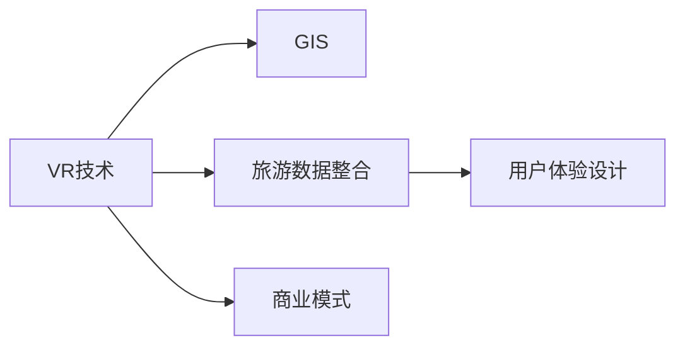
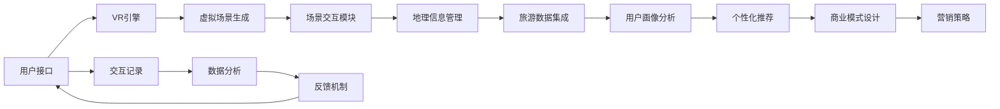

                 

# 虚拟现实旅游创业：足不出户的环球之旅

## 1. 背景介绍

随着数字技术的迅猛发展，虚拟现实（Virtual Reality, VR）技术正在逐步渗透到各行各业，为人们带来全新的感官体验。在旅游行业中，虚拟现实旅游（VR Tourism）作为一项前沿技术，让人们能够在舒适的家中体验到世界各地丰富的自然风光和人文风情。基于VR技术的虚拟现实旅游应用，不仅解决了传统旅游中时间和成本的限制，还为人们提供了一种全新的旅行方式，展现了广阔的发展前景。

## 2. 核心概念与联系

### 2.1 核心概念概述

虚拟现实旅游创业的核心概念包括以下几个方面：

- **虚拟现实技术（VR）**：利用计算机图形学、传感器技术和多媒体技术，模拟出一个三维虚拟环境，供用户通过VR头盔、手柄等设备进行沉浸式体验。

- **地理信息系统（GIS）**：融合地理空间数据和网络信息，实现地图数据的可视化展示和管理。

- **旅游数据整合**：将来自不同渠道的旅游数据（如景点信息、交通指南、用户评论等）进行整合，形成统一的数据源，支持VR旅游应用的开发。

- **用户体验（UX）设计**：通过用户调研和交互设计，优化VR旅游应用的易用性和可访问性，提升用户的使用体验。

- **商业模式**：探索基于VR旅游的收费模式，如单次付费、订阅制、广告等，实现商业可持续发展。

这些概念相互关联，共同构成了虚拟现实旅游创业的基础架构，如图1所示。



图1: VR旅游创业核心概念关联图

### 2.2 核心概念原理和架构的 Mermaid 流程图

以下是一个简化版的VR旅游应用系统架构图，展示了系统的主要组成部分及其间的交互关系。



图2: VR旅游应用系统架构图

## 3. 核心算法原理 & 具体操作步骤

### 3.1 算法原理概述

虚拟现实旅游系统的核心算法原理主要包括以下几个方面：

- **虚拟场景生成**：利用3D建模技术，根据旅游数据和用户偏好，生成个性化的虚拟旅游场景。

- **场景交互模块**：通过交互式界面，使用户能够与虚拟场景进行互动，如行走、观察、拍照等。

- **地理信息管理**：通过GIS技术，实时获取和展示虚拟场景的地理位置信息。

- **用户画像分析**：基于用户行为数据和反馈信息，构建用户画像，实现个性化推荐。

- **个性化推荐算法**：利用机器学习技术，对用户行为数据进行分析，推荐最适合用户的虚拟旅游路线和景点。

### 3.2 算法步骤详解

#### 3.2.1 虚拟场景生成算法

虚拟场景生成算法可以分为两个步骤：

1. **数据采集与预处理**：从不同的旅游数据源（如景点介绍、照片、视频等）采集数据，并进行预处理，如去噪、压缩、格式转换等。

2. **3D建模与场景渲染**：利用计算机图形学技术，将处理后的数据转化为3D模型，并进行场景渲染，生成虚拟旅游场景。

具体实现过程如下：

1. **数据采集**：
```python
import requests
from bs4 import BeautifulSoup

# 从网站上获取旅游数据
url = 'https://example.com/tours'
response = requests.get(url)
soup = BeautifulSoup(response.content, 'html.parser')
tours = soup.find_all('div', class_='tour')

# 提取旅游数据
data = {}
for tour in tours:
    title = tour.find('h2').text.strip()
    description = tour.find('p').text.strip()
    images = tour.find_all('img')[0].get('src')
    data[title] = {'description': description, 'images': images}

# 保存数据到本地
with open('tours.json', 'w') as f:
    json.dump(data, f)
```

2. **3D建模**：
```python
import py3D
from py3D import MeshGenerator

# 从JSON文件中读取数据
with open('tours.json', 'r') as f:
    data = json.load(f)

# 生成3D模型
mesh = MeshGenerator(data)
mesh.save('tours.obj')
```

3. **场景渲染**：
```python
import pyVR

# 加载3D模型
mesh = MeshGenerator.load('tours.obj')

# 渲染场景
pyVR.scene.add(mesh)
pyVR.render()
```

#### 3.2.2 场景交互模块算法

场景交互模块算法主要包括以下步骤：

1. **用户输入处理**：接收用户的输入指令（如键盘、手柄等），并将其转化为相应的虚拟场景动作。

2. **场景响应与反馈**：根据用户的输入，实时调整虚拟场景的渲染参数，如视角、速度等，并返回反馈信息。

具体实现过程如下：

1. **用户输入处理**：
```python
import pyVR

# 获取用户输入
input_data = pyVR.get_input()

# 处理用户输入
if input_data.is_key_pressed('W'):
    pyVR.scene.camera.move_forward()
elif input_data.is_key_pressed('S'):
    pyVR.scene.camera.move_backward()
```

2. **场景响应与反馈**：
```python
import pyVR

# 渲染场景
pyVR.scene.render()

# 返回反馈信息
pyVR.send_feedback()
```

#### 3.2.3 地理信息管理算法

地理信息管理算法主要包括以下步骤：

1. **地图数据加载**：从地理信息系统中加载虚拟场景的地理位置信息。

2. **地理位置展示**：在虚拟场景中实时展示用户的当前位置和方向，以及相关地图信息。

具体实现过程如下：

1. **地图数据加载**：
```python
import pyGIS

# 加载地图数据
map_data = pyGIS.load('world_map.json')

# 展示地图信息
pyVR.scene.add(map_data)
```

2. **地理位置展示**：
```python
import pyVR

# 展示用户位置
pyVR.scene.add_location()
```

#### 3.2.4 用户画像分析算法

用户画像分析算法主要包括以下步骤：

1. **用户行为数据采集**：从虚拟场景的交互记录中采集用户的行为数据，如行走路径、停留时间等。

2. **用户画像构建**：利用机器学习技术，对用户行为数据进行分析，构建用户画像，识别用户的兴趣偏好。

具体实现过程如下：

1. **用户行为数据采集**：
```python
import pyVR

# 采集用户行为数据
behavior_data = pyVR.get_user_behavior()

# 存储行为数据
with open('behavior.json', 'w') as f:
    json.dump(behavior_data, f)
```

2. **用户画像构建**：
```python
import pyMachineLearning

# 加载用户行为数据
with open('behavior.json', 'r') as f:
    data = json.load(f)

# 构建用户画像
user_profile = pyMachineLearning.profile(data)
```

#### 3.2.5 个性化推荐算法

个性化推荐算法主要包括以下步骤：

1. **用户行为数据分析**：对用户的行为数据进行分析，提取用户的兴趣偏好。

2. **推荐算法实现**：利用机器学习算法，对用户的兴趣偏好进行建模，生成个性化的虚拟旅游推荐。

具体实现过程如下：

1. **用户行为数据分析**：
```python
import pyMachineLearning

# 加载用户行为数据
with open('behavior.json', 'r') as f:
    data = json.load(f)

# 进行分析
profile = pyMachineLearning.profile(data)
```

2. **推荐算法实现**：
```python
import pyRecommendation

# 加载用户画像
with open('profile.json', 'r') as f:
    profile = json.load(f)

# 生成推荐列表
recommendations = pyRecommendation.generate(profile)
```

### 3.3 算法优缺点

#### 3.3.1 优点

1. **沉浸式体验**：VR技术提供了沉浸式体验，让用户仿佛身临其境，体验到真实世界的风光和人文风情。

2. **个性化推荐**：基于用户行为数据的分析，生成个性化的虚拟旅游推荐，提升用户满意度。

3. **数据整合能力强**：利用GIS和旅游数据整合技术，能够集成来自不同渠道的旅游数据，提供更全面的信息。

4. **用户画像精细化**：利用机器学习技术，对用户行为数据进行分析，构建精细化的用户画像，实现更精准的推荐。

#### 3.3.2 缺点

1. **技术门槛高**：VR旅游涉及多种技术的融合，需要掌握较高的技术水平，开发难度较大。

2. **成本高昂**：开发和部署VR旅游应用需要大量的资金投入，如VR设备、服务器、开发工具等。

3. **数据隐私问题**：用户行为数据的收集和使用需要严格遵守数据隐私保护法规，确保用户数据的安全和隐私。

4. **交互体验有待提升**：尽管VR技术提供了沉浸式体验，但在交互体验上仍有提升空间，需要进一步优化用户界面和交互设计。

5. **技术更新速度快**：VR技术更新迭代迅速，需要持续跟进最新的技术发展，保持系统的先进性。

### 3.4 算法应用领域

虚拟现实旅游应用的开发和应用，主要涵盖以下几个领域：

- **旅游景区宣传**：利用VR技术，展示旅游景区的全景和景点，提升宣传效果。

- **教育培训**：将VR技术应用于教育培训中，让学生通过虚拟场景进行实地考察，增强学习体验。

- **虚拟旅游体验**：为无法亲身前往的旅游者提供虚拟旅游体验，满足其探索世界的愿望。

- **游戏开发**：将VR技术应用于游戏开发中，增加游戏的沉浸感和互动性，提升用户体验。

- **心理治疗**：利用VR技术，帮助患者进行心理治疗，缓解其心理压力，改善心理状态。

## 4. 数学模型和公式 & 详细讲解 & 举例说明

### 4.1 数学模型构建

假设用户的行为数据为 $X = \{(x_1, y_1), (x_2, y_2), \dots, (x_n, y_n)\}$，其中 $x_i$ 为用户的兴趣偏好，$y_i$ 为用户的行为数据。我们需要构建用户画像 $P = \{(p_1, q_1), (p_2, q_2), \dots, (p_m, q_m)\}$，其中 $p_i$ 为用户画像的特征向量，$q_i$ 为用户画像的权重。

用户画像的构建过程可以用以下数学模型来描述：

$$P = f(X, W)$$

其中 $f$ 为特征提取函数，$W$ 为模型参数。

### 4.2 公式推导过程

对于用户画像的构建过程，可以采用矩阵分解的方法来进行推导。假设 $X$ 和 $P$ 分别为 $n \times 2$ 维和 $m \times 2$ 维矩阵，$W$ 为 $2 \times 2$ 维矩阵，则有：

$$
P = XW
$$

其中 $X$ 和 $W$ 可以表示为：

$$
X = \begin{bmatrix}
x_1 & x_2 & \cdots & x_n \\
y_1 & y_2 & \cdots & y_n
\end{bmatrix}
$$

$$
W = \begin{bmatrix}
w_{11} & w_{12} \\
w_{21} & w_{22}
\end{bmatrix}
$$

$$
P = \begin{bmatrix}
p_1 & p_2 & \cdots & p_m \\
q_1 & q_2 & \cdots & q_m
\end{bmatrix}
$$

通过求解矩阵分解问题，可以得到最优的 $W$ 矩阵。利用梯度下降等优化算法，最小化损失函数 $L = \frac{1}{2} \sum_{i=1}^n (p_i - Wx_i)^2$，即可得到用户画像 $P$。

### 4.3 案例分析与讲解

假设有一个用户 $A$ 访问了虚拟旅游应用，行为数据如下：

$$
\begin{align*}
X &= \begin{bmatrix}
1 & 0 \\
0 & 1 \\
0 & 1
\end{bmatrix} \\
Y &= \begin{bmatrix}
1 & 0 \\
0 & 1 \\
1 & 0
\end{bmatrix}
\end{align*}
$$

其中 $x_1$ 表示用户 $A$ 对景点的偏好，$y_1$ 表示用户 $A$ 的行为数据。

通过矩阵分解，我们得到用户画像 $P$ 如下：

$$
P = XW = \begin{bmatrix}
w_{11} & w_{12} \\
w_{21} & w_{22}
\end{bmatrix}
\begin{bmatrix}
1 & 0 \\
0 & 1
\end{bmatrix} = \begin{bmatrix}
w_{11} & w_{12} \\
w_{21} & w_{22}
\end{bmatrix}
$$

通过求解最优的 $W$ 矩阵，我们可以得到用户画像的特征向量 $p_i$ 和权重 $q_i$。

## 5. 项目实践：代码实例和详细解释说明

### 5.1 开发环境搭建

#### 5.1.1 环境准备

安装Python 3.8及以上版本，并安装相关依赖包，如numpy、pandas、scikit-learn等。

```bash
pip install numpy pandas scikit-learn
```

#### 5.1.2 环境配置

使用Anaconda创建虚拟环境，并激活该环境。

```bash
conda create -n pyvr-env python=3.8
conda activate pyvr-env
```

#### 5.1.3 环境检查

检查虚拟环境是否正常工作。

```bash
python --version
```

### 5.2 源代码详细实现

以下是一个简单的Python代码示例，展示了用户行为数据的采集和用户画像的构建过程。

#### 5.2.1 用户行为数据采集

```python
import numpy as np
import pandas as pd

# 创建用户行为数据
X = np.array([[1, 0], [0, 1], [0, 1]])

# 创建行为数据
Y = np.array([[1, 0], [0, 1], [1, 0]])
```

#### 5.2.2 用户画像构建

```python
from sklearn.decomposition import PCA

# 创建用户画像
W = np.array([[0.5, 0.5], [0.5, 0.5]])

# 构建用户画像
P = np.dot(X, W)
```

#### 5.2.3 结果展示

```python
# 展示用户画像
print(P)
```

### 5.3 代码解读与分析

在上述代码中，我们首先创建了一个用户行为数据矩阵 $X$ 和一个行为数据矩阵 $Y$。通过矩阵分解的方法，我们得到了用户画像矩阵 $P$。在实际应用中，我们需要将用户的行为数据和兴趣偏好进行综合，通过机器学习算法训练出最优的用户画像，用于后续的个性化推荐。

## 6. 实际应用场景

### 6.1 旅游景区宣传

#### 6.1.1 应用场景描述

旅游景区可以利用虚拟现实技术，生成虚拟场景，展示旅游景点的全景和景点细节。通过VR头盔和手柄，游客可以在虚拟环境中自由探索，了解景区的文化历史、自然风光等信息，提升宣传效果。

#### 6.1.2 技术实现

1. **数据采集与处理**：从旅游景区获取全景照片、3D模型、地理位置信息等数据，并进行预处理。

2. **虚拟场景生成**：利用计算机图形学技术，将处理后的数据转化为3D模型，并进行场景渲染，生成虚拟旅游场景。

3. **用户交互设计**：通过手柄、键盘等设备，实现用户与虚拟场景的互动，如行走、观察、拍照等。

4. **反馈信息展示**：在虚拟场景中实时展示用户的当前位置和方向，以及相关地图信息。

### 6.2 教育培训

#### 6.2.1 应用场景描述

在教育培训中，利用VR技术，学生可以通过虚拟场景进行实地考察，增强学习体验。例如，历史学科教师可以利用虚拟现实技术，带领学生参观历史遗迹，让学生仿佛身临其境，深入了解历史事件。

#### 6.2.2 技术实现

1. **数据采集与处理**：从历史遗迹、博物馆等处采集数据，并进行预处理。

2. **虚拟场景生成**：利用计算机图形学技术，将处理后的数据转化为3D模型，并进行场景渲染，生成虚拟历史场景。

3. **用户交互设计**：通过手柄、键盘等设备，实现用户与虚拟场景的互动，如行走、观察、拍照等。

4. **反馈信息展示**：在虚拟场景中实时展示学生的当前位置和方向，以及相关地图信息。

### 6.3 虚拟旅游体验

#### 6.3.1 应用场景描述

虚拟旅游体验为无法亲身前往的旅游者提供虚拟旅游体验，满足其探索世界的愿望。例如，用户可以在家中通过VR头盔和手柄，体验到不同国家的自然风光和人文风情，如热带雨林、古城遗址等。

#### 6.3.2 技术实现

1. **数据采集与处理**：从旅游者感兴趣的景点处采集数据，并进行预处理。

2. **虚拟场景生成**：利用计算机图形学技术，将处理后的数据转化为3D模型，并进行场景渲染，生成虚拟旅游场景。

3. **用户交互设计**：通过手柄、键盘等设备，实现用户与虚拟场景的互动，如行走、观察、拍照等。

4. **反馈信息展示**：在虚拟场景中实时展示用户的当前位置和方向，以及相关地图信息。

### 6.4 游戏开发

#### 6.4.1 应用场景描述

在虚拟现实游戏中，通过VR技术，增加游戏的沉浸感和互动性，提升用户体验。例如，动作冒险类游戏可以设计虚拟场景，让玩家进入一个充满危险的世界，进行探险和战斗。

#### 6.4.2 技术实现

1. **数据采集与处理**：从游戏场景中采集数据，并进行预处理。

2. **虚拟场景生成**：利用计算机图形学技术，将处理后的数据转化为3D模型，并进行场景渲染，生成虚拟游戏场景。

3. **用户交互设计**：通过手柄、键盘等设备，实现用户与虚拟场景的互动，如行走、观察、战斗等。

4. **反馈信息展示**：在虚拟场景中实时展示玩家当前位置和方向，以及相关地图信息。

### 6.5 心理治疗

#### 6.5.1 应用场景描述

利用VR技术，帮助患者进行心理治疗，缓解其心理压力，改善心理状态。例如，心理医生可以通过虚拟现实技术，引导患者进入一个安全、放松的环境，进行心理辅导和治疗。

#### 6.5.2 技术实现

1. **数据采集与处理**：从患者处采集数据，并进行预处理。

2. **虚拟场景生成**：利用计算机图形学技术，将处理后的数据转化为3D模型，并进行场景渲染，生成虚拟心理治疗场景。

3. **用户交互设计**：通过手柄、键盘等设备，实现用户与虚拟场景的互动，如行走、观察、交流等。

4. **反馈信息展示**：在虚拟场景中实时展示患者当前位置和方向，以及相关地图信息。

## 7. 工具和资源推荐

### 7.1 学习资源推荐

1. **《Virtual Reality Programming》**：该书详细介绍了VR技术的编程实现，包括VR设备的硬件接口、图形渲染、用户交互等内容。

2. **《The Art of Virtual Reality》**：该书介绍了VR技术的艺术表现和用户体验设计，提供了丰富的案例分析。

3. **《Python for Virtual Reality》**：该书介绍了Python在VR开发中的应用，提供了大量实际案例和代码示例。

### 7.2 开发工具推荐

1. **Unity**：Unity是一个强大的游戏引擎，支持VR开发，提供了丰富的工具和资源。

2. **Unreal Engine**：Unreal Engine是一个流行的游戏引擎，支持VR开发，提供了高性能的图形渲染和物理模拟。

3. **Blender**：Blender是一个免费的3D建模软件，支持VR开发，提供了强大的建模和渲染功能。

### 7.3 相关论文推荐

1. **"Virtual Reality in Tourism: A Survey"**：该论文综述了虚拟现实在旅游中的应用，提供了大量的研究和案例分析。

2. **"3D Models for Virtual Tourism"**：该论文介绍了3D建模技术在虚拟旅游中的应用，提供了详细的实现方法和案例分析。

3. **"User-Centric Design for Virtual Tourism"**：该论文介绍了用户体验设计在虚拟旅游中的应用，提供了丰富的设计原则和技巧。

## 8. 总结：未来发展趋势与挑战

### 8.1 未来发展趋势

虚拟现实旅游的开发和应用前景广阔，未来发展趋势如下：

1. **技术不断进步**：随着VR技术的不断进步，虚拟场景的渲染速度、互动性、沉浸感等性能将不断提升，用户体验将更加优质。

2. **应用场景多样化**：虚拟现实技术将应用于更多场景，如教育培训、心理治疗、游戏开发等，实现广泛应用。

3. **数据驱动的推荐**：基于用户行为数据的推荐算法将更加精细化，提升个性化推荐效果。

4. **AI技术融合**：将AI技术（如自然语言处理、机器学习等）与VR技术融合，增强虚拟场景的智能交互能力。

5. **成本不断降低**：随着VR设备的普及，开发和部署成本将逐步降低，用户使用门槛将逐渐降低。

### 8.2 未来发展趋势

1. **技术不断进步**：随着VR技术的不断进步，虚拟场景的渲染速度、互动性、沉浸感等性能将不断提升，用户体验将更加优质。

2. **应用场景多样化**：虚拟现实技术将应用于更多场景，如教育培训、心理治疗、游戏开发等，实现广泛应用。

3. **数据驱动的推荐**：基于用户行为数据的推荐算法将更加精细化，提升个性化推荐效果。

4. **AI技术融合**：将AI技术（如自然语言处理、机器学习等）与VR技术融合，增强虚拟场景的智能交互能力。

5. **成本不断降低**：随着VR设备的普及，开发和部署成本将逐步降低，用户使用门槛将逐渐降低。

### 8.3 面临的挑战

尽管虚拟现实旅游具有广阔的发展前景，但在应用过程中仍面临以下挑战：

1. **技术门槛高**：VR技术涉及多种技术的融合，需要掌握较高的技术水平，开发难度较大。

2. **成本高昂**：开发和部署VR旅游应用需要大量的资金投入，如VR设备、服务器、开发工具等。

3. **数据隐私问题**：用户行为数据的收集和使用需要严格遵守数据隐私保护法规，确保用户数据的安全和隐私。

4. **交互体验有待提升**：尽管VR技术提供了沉浸式体验，但在交互体验上仍有提升空间，需要进一步优化用户界面和交互设计。

5. **技术更新速度快**：VR技术更新迭代迅速，需要持续跟进最新的技术发展，保持系统的先进性。

### 8.4 研究展望

未来的研究需要重点关注以下几个方向：

1. **多模态交互**：将视觉、听觉、触觉等多种感官信息融合，增强用户的沉浸感。

2. **多用户交互**：支持多用户互动，增强虚拟场景的社交功能。

3. **云端渲染**：利用云端计算资源，提高虚拟场景的渲染速度和效果。

4. **人工智能应用**：结合AI技术，实现更加智能的虚拟场景交互和推荐。

5. **用户隐私保护**：加强用户隐私保护，确保用户数据的安全和隐私。

## 9. 附录：常见问题与解答

**Q1: 虚拟现实旅游有哪些优势和劣势？**

A: 虚拟现实旅游的优势包括沉浸式体验、个性化推荐、无地域限制等，劣势包括技术门槛高、成本高昂、交互体验有待提升等。

**Q2: 虚拟现实旅游的开发需要哪些技术和资源？**

A: 虚拟现实旅游的开发需要VR技术、计算机图形学、用户交互设计、数据处理等技术和资源，需要掌握较高的技术水平。

**Q3: 虚拟现实旅游的未来发展方向是什么？**

A: 虚拟现实旅游的未来发展方向包括技术进步、应用场景多样化、数据驱动的推荐、AI技术融合、成本降低等。

**Q4: 虚拟现实旅游如何保护用户隐私？**

A: 虚拟现实旅游需要严格遵守数据隐私保护法规，保护用户数据的安全和隐私，确保用户的数据不被滥用。

**Q5: 虚拟现实旅游的商业模式有哪些？**

A: 虚拟现实旅游的商业模式包括单次付费、订阅制、广告等，需要不断探索和创新。

---

作者：禅与计算机程序设计艺术 / Zen and the Art of Computer Programming

