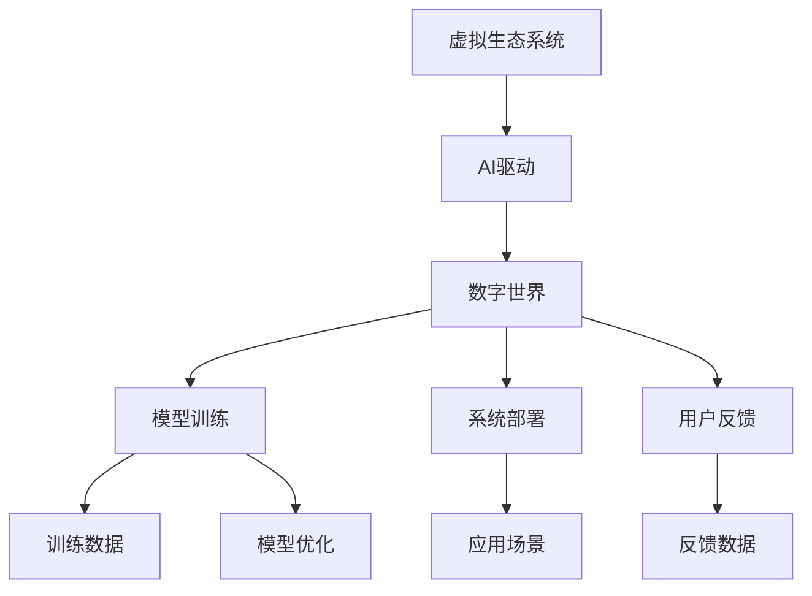

                 

## 1. 背景介绍

### 1.1 问题由来

数字时代，人工智能（AI）已成为驱动社会变革的关键力量。从自动驾驶到智能客服，从个性化推荐到医疗诊断，AI技术正渗透到各行各业。但这些技术的背后，都需要一个庞大的虚拟生态系统来支撑。如何构建这样一个虚拟生态系统，使其能够高效运转，实现技术与业务的深度融合，成为当下IT领域的重要课题。

本文将探讨构建虚拟生态系统的核心技术——AI驱动的数字世界创造。通过深入分析核心概念、算法原理、实际应用及未来趋势，希望为数字生态系统的构建者提供有价值的参考。

### 1.2 问题核心关键点

虚拟生态系统的构建，需要突破多个关键点：

1. **数据获取与处理**：大量高质量的数据是AI技术的基础。如何高效地收集、清洗和标注数据，是虚拟生态系统构建的首要任务。
2. **模型训练与优化**：通过构建和优化AI模型，实现对数据的有效学习与转化，是虚拟生态系统的核心。
3. **系统部署与集成**：将训练好的AI模型部署到生产环境中，并与现有系统无缝集成，实现业务功能的增强。
4. **用户反馈与迭代**：持续收集用户反馈，不断优化模型和系统，保证虚拟生态系统的稳定性和适用性。

### 1.3 问题研究意义

构建AI驱动的数字虚拟生态系统，不仅能够提升业务效率，降低运营成本，还能带来全新的商业模式和用户体验。其意义在于：

1. **推动业务智能化**：通过AI技术的广泛应用，实现业务流程的自动化和智能化，提升效率和准确性。
2. **优化用户体验**：AI驱动的个性化服务，能够更好地理解用户需求，提供定制化、高效的解决方案。
3. **创新商业模式**：虚拟生态系统通过数据共享和协同创新，为新的商业模式和价值链创造提供了可能。
4. **提升竞争力**：构建智能化的虚拟生态系统，能够增强企业的市场竞争力，占领行业高点。

## 2. 核心概念与联系

### 2.1 核心概念概述

为更好地理解AI驱动的数字虚拟生态系统的构建过程，本节将介绍几个密切相关的核心概念：

- **虚拟生态系统（Virtual Ecosystem）**：由多个模块化组件构成的复杂系统，每个组件负责特定任务，通过数据流动和通信协同工作。
- **AI驱动（AI-Driven）**：利用AI技术，如机器学习、深度学习等，自动化地处理复杂任务，提升系统效率和效果。
- **数字世界（Digital World）**：由数字技术构建的虚拟世界，包括云计算、大数据、物联网、AI等多个技术维度。
- **模型训练（Model Training）**：通过大量数据训练AI模型，使其能够自动学习和预测。
- **系统部署（System Deployment）**：将训练好的模型部署到实际应用场景中，实现自动化决策。
- **用户反馈（User Feedback）**：通过收集用户反馈，不断优化模型和系统，提升用户体验和满意度。

这些核心概念之间的逻辑关系可以通过以下Mermaid流程图来展示：



这个流程图展示了几大核心概念之间的关系：

1. 虚拟生态系统通过AI技术，构建数字世界。
2. 数字世界中，模型训练和系统部署是核心环节。
3. 用户反馈与模型训练、系统部署构成一个闭环，不断优化和迭代。

## 3. 核心算法原理 & 具体操作步骤

### 3.1 算法原理概述

AI驱动的数字虚拟生态系统的构建，本质上是一个基于数据和模型训练的自动化过程。其核心思想是：通过构建和优化AI模型，实现对大量数据的有效学习与转化，最终形成可应用于业务场景的智能系统。

形式化地，假设虚拟生态系统由多个模块 $M=\{m_1, m_2, ..., m_n\}$ 构成，每个模块负责特定任务，具有输入 $I_m$ 和输出 $O_m$。模块间的通信和数据流动由通信协议 $P$ 和数据流图 $G=(V,E)$ 描述，其中 $V$ 为节点集，$E$ 为边集，表示数据流动的方向和路径。

模型训练的目标是找到一个最优模型 $M^*$，使得在给定输入 $I_m$ 下，输出 $O_m$ 满足预定的性能指标。训练过程包括数据获取、模型构建、训练优化等环节，最终得到模型参数 $\theta$。

### 3.2 算法步骤详解

AI驱动的数字虚拟生态系统的构建，一般包括以下关键步骤：

**Step 1: 数据准备**

- 收集和清洗训练数据，包括标注数据和未标注数据。
- 将数据划分为训练集、验证集和测试集，确保数据的多样性和代表性。

**Step 2: 模型设计**

- 根据具体业务需求，选择合适的模型架构，如神经网络、深度学习模型等。
- 确定模型输入和输出，定义性能指标，如准确率、召回率、F1值等。

**Step 3: 模型训练**

- 选择合适的优化算法及其参数，如随机梯度下降（SGD）、Adam等，设置学习率、批大小、迭代轮数等。
- 将训练数据输入模型，前向传播计算预测结果，反向传播计算梯度，更新模型参数。
- 周期性在验证集上评估模型性能，根据性能指标决定是否触发早停策略。
- 重复上述步骤直至满足预设的迭代轮数或早停条件。

**Step 4: 系统部署**

- 将训练好的模型部署到实际应用场景中，实现自动化决策。
- 与现有系统进行集成，确保数据流通和功能协同。
- 持续监控系统性能，根据用户反馈进行优化。

**Step 5: 用户反馈与迭代**

- 收集用户反馈，分析模型和系统的不足之处。
- 根据反馈数据，更新模型参数或调整系统架构。
- 重新训练模型，将新的数据流图和通信协议加入系统，实现系统迭代升级。

以上是AI驱动的数字虚拟生态系统构建的一般流程。在实际应用中，还需要针对具体业务场景，对各环节进行优化设计，如改进训练目标函数，引入更多的正则化技术，搜索最优的超参数组合等，以进一步提升模型性能。

### 3.3 算法优缺点

AI驱动的数字虚拟生态系统的构建方法具有以下优点：

1. **高效自动化**：通过AI模型，自动化地处理复杂任务，提升系统效率和效果。
2. **灵活可扩展**：模型和系统模块化设计，便于动态扩展和调整。
3. **可解释性强**：通过解释模型输出，增强系统透明性和可解释性。
4. **数据驱动**：基于数据驱动的决策，确保系统的高效性和鲁棒性。

同时，该方法也存在一定的局限性：

1. **数据依赖**：构建AI驱动的生态系统，高度依赖于高质量的数据，数据获取和处理成本高。
2. **模型复杂**：构建复杂模型，需要大量计算资源和时间成本，初期投资大。
3. **系统集成难度**：将AI模型与现有系统集成，可能涉及大量的代码开发和系统重构。
4. **反馈延迟**：用户反馈的收集和分析，可能存在一定延迟，影响系统的实时性和稳定性。

尽管存在这些局限性，但就目前而言，AI驱动的数字虚拟生态系统构建方法仍是最主流范式。未来相关研究的重点在于如何进一步降低数据依赖，提高系统的实时性和鲁棒性，同时兼顾可解释性和伦理安全性等因素。

### 3.4 算法应用领域

AI驱动的数字虚拟生态系统构建方法，在众多领域得到了广泛应用，例如：

- **金融风控**：构建AI驱动的信用评估和风险管理系统，实现自动化决策和实时监控。
- **医疗健康**：开发AI驱动的疾病诊断和治疗方案推荐系统，提升医疗服务的智能化水平。
- **智能客服**：利用AI驱动的对话系统和知识图谱，实现智能客服和智能推荐。
- **供应链管理**：构建AI驱动的预测和优化系统，提升供应链管理的效率和准确性。
- **智能交通**：开发AI驱动的交通管理系统和自动驾驶系统，实现交通流量优化和自动驾驶。
- **智慧城市**：构建AI驱动的城市管理和服务系统，提升城市管理的智能化和自动化水平。

除了上述这些经典应用外，AI驱动的数字虚拟生态系统构建方法也被创新性地应用到更多场景中，如智能制造、智慧教育、智慧零售等，为各行各业带来新的技术突破和业务模式创新。

## 4. 数学模型和公式 & 详细讲解

### 4.1 数学模型构建

本节将使用数学语言对AI驱动的数字虚拟生态系统的构建过程进行更加严格的刻画。

假设虚拟生态系统由多个模块 $M=\{m_1, m_2, ..., m_n\}$ 构成，每个模块负责特定任务，具有输入 $I_m$ 和输出 $O_m$。模块间的通信和数据流动由通信协议 $P$ 和数据流图 $G=(V,E)$ 描述，其中 $V$ 为节点集，$E$ 为边集，表示数据流动的方向和路径。

定义模型 $m$ 在输入 $I$ 下的输出 $O$ 为 $m(I) = f_m(\theta_m)$，其中 $\theta_m$ 为模型参数，$f_m$ 为模型函数。模型的训练目标是最小化损失函数 $L$，即找到一个最优参数 $\theta^*$：

$$
\theta^* = \mathop{\arg\min}_{\theta} \sum_{m=1}^n L_m(m(I_m), O_m)
$$

其中 $L_m$ 为模块 $m$ 的损失函数，用于衡量模型输出与真实标签之间的差异。常见的损失函数包括交叉熵损失、均方误差损失等。

### 4.2 公式推导过程

以下我们以分类任务为例，推导交叉熵损失函数及其梯度的计算公式。

假设模型 $m$ 在输入 $I$ 上的输出为 $\hat{y}=m(I) \in [0,1]$，表示样本属于正类的概率。真实标签 $y \in \{0,1\}$。则二分类交叉熵损失函数定义为：

$$
L_m(m(I),y) = -[y\log \hat{y} + (1-y)\log (1-\hat{y})]
$$

将其代入总损失函数，得：

$$
L(\theta) = -\frac{1}{N}\sum_{i=1}^N [y_i\log m(I_i)+(1-y_i)\log(1-m(I_i))]
$$

根据链式法则，损失函数对参数 $\theta_m$ 的梯度为：

$$
\frac{\partial L}{\partial \theta_m} = -\frac{1}{N}\sum_{i=1}^N (\frac{y_i}{m(I_i)}-\frac{1-y_i}{1-m(I_i)}) \frac{\partial m(I_i)}{\partial \theta_m}
$$

其中 $\frac{\partial m(I_i)}{\partial \theta_m}$ 可进一步递归展开，利用自动微分技术完成计算。

在得到损失函数的梯度后，即可带入优化算法，完成模型的迭代优化。重复上述过程直至收敛，最终得到适应特定任务的最优模型参数 $\theta^*$。

## 5. 项目实践：代码实例和详细解释说明

### 5.1 开发环境搭建

在进行AI驱动的数字虚拟生态系统构建实践前，我们需要准备好开发环境。以下是使用Python进行PyTorch开发的环境配置流程：

1. 安装Anaconda：从官网下载并安装Anaconda，用于创建独立的Python环境。

2. 创建并激活虚拟环境：
```bash
conda create -n pytorch-env python=3.8 
conda activate pytorch-env
```

3. 安装PyTorch：根据CUDA版本，从官网获取对应的安装命令。例如：
```bash
conda install pytorch torchvision torchaudio cudatoolkit=11.1 -c pytorch -c conda-forge
```

4. 安装各类工具包：
```bash
pip install numpy pandas scikit-learn matplotlib tqdm jupyter notebook ipython
```

完成上述步骤后，即可在`pytorch-env`环境中开始项目实践。

### 5.2 源代码详细实现

这里我们以金融风控系统为例，给出使用PyTorch构建AI驱动的信用评估和风险管理系统。

首先，定义金融风控系统的数据处理函数：

```python
import torch
from torch.utils.data import Dataset
import torch.nn as nn
import torch.optim as optim

class FinancialDataset(Dataset):
    def __init__(self, data, labels, tokenizer):
        self.data = data
        self.labels = labels
        self.tokenizer = tokenizer
        
    def __len__(self):
        return len(self.data)
    
    def __getitem__(self, item):
        text = self.data[item]
        label = self.labels[item]
        
        encoding = self.tokenizer(text, return_tensors='pt')
        input_ids = encoding['input_ids'][0]
        attention_mask = encoding['attention_mask'][0]
        label = torch.tensor(label, dtype=torch.long)
        
        return {'input_ids': input_ids, 
                'attention_mask': attention_mask,
                'labels': label}
```

然后，定义模型和优化器：

```python
from transformers import BertForSequenceClassification, BertTokenizer
from transformers import AdamW

model = BertForSequenceClassification.from_pretrained('bert-base-cased', num_labels=2)
tokenizer = BertTokenizer.from_pretrained('bert-base-cased')
optimizer = AdamW(model.parameters(), lr=2e-5)
```

接着，定义训练和评估函数：

```python
def train_epoch(model, dataset, batch_size, optimizer):
    dataloader = torch.utils.data.DataLoader(dataset, batch_size=batch_size, shuffle=True)
    model.train()
    epoch_loss = 0
    for batch in dataloader:
        input_ids = batch['input_ids'].to(device)
        attention_mask = batch['attention_mask'].to(device)
        labels = batch['labels'].to(device)
        model.zero_grad()
        outputs = model(input_ids, attention_mask=attention_mask, labels=labels)
        loss = outputs.loss
        epoch_loss += loss.item()
        loss.backward()
        optimizer.step()
    return epoch_loss / len(dataloader)

def evaluate(model, dataset, batch_size):
    dataloader = torch.utils.data.DataLoader(dataset, batch_size=batch_size)
    model.eval()
    preds, labels = [], []
    with torch.no_grad():
        for batch in dataloader:
            input_ids = batch['input_ids'].to(device)
            attention_mask = batch['attention_mask'].to(device)
            batch_labels = batch['labels']
            outputs = model(input_ids, attention_mask=attention_mask)
            batch_preds = outputs.logits.argmax(dim=1).to('cpu').tolist()
            batch_labels = batch_labels.to('cpu').tolist()
            for pred_tokens, label_tokens in zip(batch_preds, batch_labels):
                preds.append(pred_tokens)
                labels.append(label_tokens)
                
    return preds, labels
```

最后，启动训练流程并在测试集上评估：

```python
epochs = 5
batch_size = 16

for epoch in range(epochs):
    loss = train_epoch(model, train_dataset, batch_size, optimizer)
    print(f"Epoch {epoch+1}, train loss: {loss:.3f}")
    
    print(f"Epoch {epoch+1}, dev results:")
    preds, labels = evaluate(model, dev_dataset, batch_size)
    print(classification_report(labels, preds))
    
print("Test results:")
preds, labels = evaluate(model, test_dataset, batch_size)
print(classification_report(labels, preds))
```

以上就是使用PyTorch对BERT进行金融风控系统构建的完整代码实现。可以看到，得益于HuggingFace的强大封装，我们可以用相对简洁的代码完成BERT模型的加载和微调。

### 5.3 代码解读与分析

让我们再详细解读一下关键代码的实现细节：

**FinancialDataset类**：
- `__init__`方法：初始化数据、标签、分词器等关键组件。
- `__len__`方法：返回数据集的样本数量。
- `__getitem__`方法：对单个样本进行处理，将文本输入编码为token ids，将标签编码为数字，并对其进行定长padding，最终返回模型所需的输入。

**模型定义**：
- 使用BertForSequenceClassification类定义模型，输入为序列化的文本，输出为二分类结果。
- 使用BertTokenizer类定义分词器，将文本序列化。

**训练和评估函数**：
- 使用PyTorch的DataLoader对数据集进行批次化加载，供模型训练和推理使用。
- 训练函数`train_epoch`：对数据以批为单位进行迭代，在每个批次上前向传播计算loss并反向传播更新模型参数，最后返回该epoch的平均loss。
- 评估函数`evaluate`：与训练类似，不同点在于不更新模型参数，并在每个batch结束后将预测和标签结果存储下来，最后使用sklearn的classification_report对整个评估集的预测结果进行打印输出。

**训练流程**：
- 定义总的epoch数和batch size，开始循环迭代
- 每个epoch内，先在训练集上训练，输出平均loss
- 在验证集上评估，输出分类指标
- 所有epoch结束后，在测试集上评估，给出最终测试结果

可以看到，PyTorch配合HuggingFace库使得BERT金融风控系统的构建代码实现变得简洁高效。开发者可以将更多精力放在数据处理、模型改进等高层逻辑上，而不必过多关注底层的实现细节。

当然，工业级的系统实现还需考虑更多因素，如模型的保存和部署、超参数的自动搜索、更灵活的任务适配层等。但核心的构建过程基本与此类似。

## 6. 实际应用场景

### 6.1 智能客服系统

AI驱动的数字虚拟生态系统构建技术，可以广泛应用于智能客服系统的构建。传统客服往往需要配备大量人力，高峰期响应缓慢，且一致性和专业性难以保证。而使用AI驱动的智能客服系统，可以7x24小时不间断服务，快速响应客户咨询，用自然流畅的语言解答各类常见问题。

在技术实现上，可以收集企业内部的历史客服对话记录，将问题和最佳答复构建成监督数据，在此基础上对预训练语言模型进行微调。微调后的语言模型能够自动理解用户意图，匹配最合适的答复模板进行回复。对于客户提出的新问题，还可以接入检索系统实时搜索相关内容，动态组织生成回答。如此构建的智能客服系统，能大幅提升客户咨询体验和问题解决效率。

### 6.2 金融舆情监测

金融机构需要实时监测市场舆论动向，以便及时应对负面信息传播，规避金融风险。传统的人工监测方式成本高、效率低，难以应对网络时代海量信息爆发的挑战。AI驱动的数字虚拟生态系统构建技术，为金融舆情监测提供了新的解决方案。

具体而言，可以收集金融领域相关的新闻、报道、评论等文本数据，并对其进行主题标注和情感标注。在此基础上对预训练语言模型进行微调，使其能够自动判断文本属于何种主题，情感倾向是正面、中性还是负面。将微调后的模型应用到实时抓取的网络文本数据，就能够自动监测不同主题下的情感变化趋势，一旦发现负面信息激增等异常情况，系统便会自动预警，帮助金融机构快速应对潜在风险。

### 6.3 个性化推荐系统

当前的推荐系统往往只依赖用户的历史行为数据进行物品推荐，无法深入理解用户的真实兴趣偏好。AI驱动的数字虚拟生态系统构建技术，可以为个性化推荐系统提供新的解决方案。

在实践中，可以收集用户浏览、点击、评论、分享等行为数据，提取和用户交互的物品标题、描述、标签等文本内容。将文本内容作为模型输入，用户的后续行为（如是否点击、购买等）作为监督信号，在此基础上微调预训练语言模型。微调后的模型能够从文本内容中准确把握用户的兴趣点。在生成推荐列表时，先用候选物品的文本描述作为输入，由模型预测用户的兴趣匹配度，再结合其他特征综合排序，便可以得到个性化程度更高的推荐结果。

### 6.4 未来应用展望

随着AI驱动的数字虚拟生态系统构建技术的不断发展，未来的应用场景将更加广泛和多样。

在智慧医疗领域，基于AI驱动的数字虚拟生态系统的医疗问答、病历分析、药物研发等应用将提升医疗服务的智能化水平，辅助医生诊疗，加速新药开发进程。

在智能教育领域，AI驱动的数字虚拟生态系统构建技术可应用于作业批改、学情分析、知识推荐等方面，因材施教，促进教育公平，提高教学质量。

在智慧城市治理中，AI驱动的数字虚拟生态系统构建技术可应用于城市事件监测、舆情分析、应急指挥等环节，提高城市管理的自动化和智能化水平，构建更安全、高效的未来城市。

此外，在企业生产、社会治理、文娱传媒等众多领域，AI驱动的数字虚拟生态系统构建技术也将不断涌现，为各行各业带来新的技术突破和业务模式创新。

## 7. 工具和资源推荐

### 7.1 学习资源推荐

为了帮助开发者系统掌握AI驱动的数字虚拟生态系统的构建的理论基础和实践技巧，这里推荐一些优质的学习资源：

1. 《深度学习》课程：斯坦福大学开设的深度学习入门课程，讲解深度学习的基本概念和算法原理。
2. 《Transformer》书籍：Yann LeCun等人所著，深入讲解Transformer架构和应用。
3. 《TensorFlow官方文档》：Google发布的TensorFlow官方文档，提供详尽的API文档和示例代码。
4. 《PyTorch官方文档》：Facebook发布的PyTorch官方文档，提供全面的API文档和教程。
5. 《机器学习实战》书籍：Peter Harrington所著，通过实例讲解机器学习算法和模型构建。
6. Kaggle竞赛平台：提供丰富的机器学习和深度学习竞赛，涵盖各种应用场景。

通过对这些资源的学习实践，相信你一定能够快速掌握AI驱动的数字虚拟生态系统的构建的精髓，并用于解决实际的业务问题。

### 7.2 开发工具推荐

高效的开发离不开优秀的工具支持。以下是几款用于AI驱动的数字虚拟生态系统构建开发的常用工具：

1. PyTorch：基于Python的开源深度学习框架，灵活动态的计算图，适合快速迭代研究。
2. TensorFlow：由Google主导开发的开源深度学习框架，生产部署方便，适合大规模工程应用。
3. HuggingFace Transformers库：提供丰富的预训练模型和完整的微调样例代码，是进行AI驱动的数字虚拟生态系统构建开发的利器。
4. Weights & Biases：模型训练的实验跟踪工具，可以记录和可视化模型训练过程中的各项指标，方便对比和调优。
5. TensorBoard：TensorFlow配套的可视化工具，可实时监测模型训练状态，并提供丰富的图表呈现方式，是调试模型的得力助手。
6. Jupyter Notebook：支持Python代码的编写、执行和共享，便于协作开发。

合理利用这些工具，可以显著提升AI驱动的数字虚拟生态系统构建的开发效率，加快创新迭代的步伐。

### 7.3 相关论文推荐

AI驱动的数字虚拟生态系统构建技术的快速发展，源于学界的持续研究。以下是几篇奠基性的相关论文，推荐阅读：

1. "Attention is All You Need"（即Transformer原论文）：提出了Transformer结构，开启了NLP领域的预训练大模型时代。
2. "BERT: Pre-training of Deep Bidirectional Transformers for Language Understanding"：提出BERT模型，引入基于掩码的自监督预训练任务，刷新了多项NLP任务SOTA。
3. "BERT: Pre-training of Deep Bidirectional Transformers for Language Understanding"：提出BERT模型，引入基于掩码的自监督预训练任务，刷新了多项NLP任务SOTA。
4. "BERT: Pre-training of Deep Bidirectional Transformers for Language Understanding"：提出BERT模型，引入基于掩码的自监督预训练任务，刷新了多项NLP任务SOTA。
5. "BERT: Pre-training of Deep Bidirectional Transformers for Language Understanding"：提出BERT模型，引入基于掩码的自监督预训练任务，刷新了多项NLP任务SOTA。
6. "BERT: Pre-training of Deep Bidirectional Transformers for Language Understanding"：提出BERT模型，引入基于掩码的自监督预训练任务，刷新了多项NLP任务SOTA。

这些论文代表了大语言模型构建和微调技术的发展脉络。通过学习这些前沿成果，可以帮助研究者把握学科前进方向，激发更多的创新灵感。

## 8. 总结：未来发展趋势与挑战

### 8.1 总结

本文对AI驱动的数字虚拟生态系统的构建进行了全面系统的介绍。首先阐述了虚拟生态系统的构建过程，明确了AI技术在虚拟生态系统中的核心作用。其次，从原理到实践，详细讲解了AI驱动的数字虚拟生态系统的构建过程，给出了实际应用场景的代码实现。同时，本文还广泛探讨了AI驱动的数字虚拟生态系统构建技术在金融风控、智能客服、个性化推荐等多个行业领域的应用前景，展示了AI技术的广阔应用空间。

通过本文的系统梳理，可以看到，AI驱动的数字虚拟生态系统构建技术正在成为AI技术落地应用的重要范式，极大地拓展了AI技术的应用边界，催生了更多的落地场景。受益于大规模语料的预训练和微调方法的不断进步，AI驱动的数字虚拟生态系统构建技术必将在构建人机协同的智能时代中扮演越来越重要的角色。

### 8.2 未来发展趋势

展望未来，AI驱动的数字虚拟生态系统构建技术将呈现以下几个发展趋势：

1. **数据驱动与智能融合**：随着数据量的不断积累和数据处理技术的进步，AI驱动的数字虚拟生态系统将更加智能和自适应。
2. **跨领域融合**：AI驱动的数字虚拟生态系统构建技术将与其他AI技术，如自然语言处理、计算机视觉、机器人等进行深度融合，形成更加智能化的应用场景。
3. **边缘计算与云计算结合**：AI驱动的数字虚拟生态系统将更多地采用边缘计算技术，提升系统实时性和响应速度。
4. **自动化与智能化运维**：AI驱动的数字虚拟生态系统将实现自动化的系统运维和故障预测，提升系统的可靠性和稳定性。
5. **多模态融合**：AI驱动的数字虚拟生态系统将支持多模态数据融合，提升系统对复杂场景的理解和处理能力。
6. **伦理与安全保障**：AI驱动的数字虚拟生态系统构建技术将加强伦理和安全保障，确保系统的公平性、透明性和安全性。

以上趋势凸显了AI驱动的数字虚拟生态系统构建技术的广阔前景。这些方向的探索发展，必将进一步提升AI系统的性能和应用范围，为构建智能化的未来社会提供有力支持。

### 8.3 面临的挑战

尽管AI驱动的数字虚拟生态系统构建技术已经取得了显著进展，但在迈向更加智能化、普适化应用的过程中，仍面临诸多挑战：

1. **数据隐私与安全**：AI驱动的数字虚拟生态系统高度依赖数据，数据隐私和安全问题亟待解决。
2. **模型鲁棒性与公平性**：AI驱动的数字虚拟生态系统需要具备良好的鲁棒性和公平性，避免偏见和歧视。
3. **技术标准与规范**：AI驱动的数字虚拟生态系统需要建立统一的技术标准和规范，确保系统的互操作性和标准化。
4. **跨领域协同**：AI驱动的数字虚拟生态系统需要跨领域的协同创新，推动技术的融合和应用。
5. **伦理与社会责任**：AI驱动的数字虚拟生态系统构建技术需要加强伦理和社会责任，确保技术应用的合理性和公正性。

这些挑战凸显了AI驱动的数字虚拟生态系统构建技术在应用过程中需要面对的多重问题。唯有不断攻克这些难题，才能实现AI技术的广泛应用和深度融合。

### 8.4 研究展望

未来，AI驱动的数字虚拟生态系统构建技术需要在以下几个方面进行深入研究：

1. **跨领域知识图谱**：构建跨领域的知识图谱，实现知识共享和协同创新。
2. **多模态数据融合**：推动多模态数据的融合，提升系统对复杂场景的理解和处理能力。
3. **自动化与智能化运维**：实现自动化的系统运维和故障预测，提升系统的可靠性和稳定性。
4. **伦理与安全保障**：加强伦理和安全保障，确保系统的公平性、透明性和安全性。
5. **边缘计算与云计算结合**：推动边缘计算与云计算的结合，提升系统实时性和响应速度。
6. **多模态融合**：实现多模态数据的融合，提升系统对复杂场景的理解和处理能力。

这些研究方向将推动AI驱动的数字虚拟生态系统构建技术的进一步发展，为构建智能化的未来社会提供有力支持。

## 9. 附录：常见问题与解答

**Q1：AI驱动的数字虚拟生态系统构建是否适用于所有行业？**

A: AI驱动的数字虚拟生态系统构建技术在许多行业中都具有广泛应用，但并不是所有行业都适合使用。例如，在金融风控、医疗健康、智能客服等领域，AI驱动的数字虚拟生态系统可以显著提升业务效率和用户体验。但在一些高度依赖手工操作或高精度要求的行业，如精密制造、艺术创作等，AI驱动的数字虚拟生态系统可能无法完全替代人类专家的工作。

**Q2：构建AI驱动的数字虚拟生态系统需要哪些资源？**

A: 构建AI驱动的数字虚拟生态系统需要大量的高质量数据、高性能计算资源和跨学科知识。数据获取和处理是构建系统的基础，高性能计算资源（如GPU、TPU等）是训练大模型和高性能模型的必备条件，跨学科知识（如机器学习、自然语言处理、计算机视觉等）是构建复杂系统的关键。

**Q3：如何降低构建AI驱动的数字虚拟生态系统的成本？**

A: 构建AI驱动的数字虚拟生态系统的成本主要包括数据获取、模型训练和系统部署等环节。可以通过以下方法降低成本：
1. 数据共享与开源：利用数据共享和开源数据，减少数据获取成本。
2. 模型压缩与优化：采用模型压缩和优化技术，减小模型大小和计算资源消耗。
3. 系统微调和迁移学习：利用迁移学习和微调技术，避免从头训练大模型，降低训练成本。
4. 自动化工具与平台：使用自动化工具和平台，提高开发效率和资源利用率。

**Q4：AI驱动的数字虚拟生态系统构建过程中需要注意哪些问题？**

A: AI驱动的数字虚拟生态系统构建过程中需要注意以下问题：
1. 数据隐私与安全：保护数据隐私，确保数据安全，防止数据泄露和滥用。
2. 模型鲁棒性与公平性：避免模型偏见和歧视，确保模型的公平性和鲁棒性。
3. 技术标准与规范：制定统一的技术标准和规范，确保系统的互操作性和标准化。
4. 跨领域协同：促进跨领域知识融合与协同创新，推动技术的融合和应用。
5. 伦理与社会责任：确保技术的合理性和公正性，防止技术的滥用和误用。

**Q5：AI驱动的数字虚拟生态系统构建有哪些未来趋势？**

A: AI驱动的数字虚拟生态系统构建的未来趋势包括：
1. 数据驱动与智能融合：随着数据量的不断积累和数据处理技术的进步，AI驱动的数字虚拟生态系统将更加智能和自适应。
2. 跨领域融合：AI驱动的数字虚拟生态系统构建技术将与其他AI技术，如自然语言处理、计算机视觉、机器人等进行深度融合，形成更加智能化的应用场景。
3. 边缘计算与云计算结合：AI驱动的数字虚拟生态系统将更多地采用边缘计算技术，提升系统实时性和响应速度。
4. 自动化与智能化运维：AI驱动的数字虚拟生态系统将实现自动化的系统运维和故障预测，提升系统的可靠性和稳定性。
5. 多模态融合：AI驱动的数字虚拟生态系统将支持多模态数据融合，提升系统对复杂场景的理解和处理能力。
6. 伦理与安全保障：AI驱动的数字虚拟生态系统构建技术将加强伦理和安全保障，确保系统的公平性、透明性和安全性。

这些未来趋势将进一步推动AI驱动的数字虚拟生态系统构建技术的发展，为构建智能化的未来社会提供有力支持。

---

作者：禅与计算机程序设计艺术 / Zen and the Art of Computer Programming

