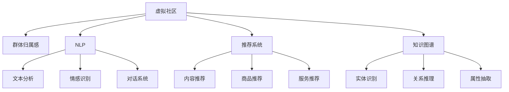

                 

# 虚拟社区：AI驱动的群体归属感

## 1. 背景介绍

在数字化时代，虚拟社区已成为人们重要的交流空间和群体归属感的来源。然而，如何利用人工智能技术，构建更加智能、高效、人性化的虚拟社区，仍然是当前技术界和社会学界的重大挑战。本文将系统介绍基于人工智能的虚拟社区构建技术，探讨AI技术如何驱动虚拟社区的群体归属感。

## 2. 核心概念与联系

### 2.1 核心概念概述

本文将详细介绍几个核心概念及其相互联系：

- **虚拟社区(Virtual Community)**：以互联网为媒介，基于共同兴趣、价值观和行为规范形成的人际关系网络。虚拟社区为用户提供了一个交流、合作、互助的平台，是现代社交的重要形式。

- **群体归属感(Sense of Community)**：个体对特定群体或社区的认同、尊重和依恋，是群体凝聚力的重要体现，也是虚拟社区构建的核心目标。

- **人工智能(Artificial Intelligence)**：通过模拟人类智能行为，实现智能感知、决策、交互等功能的计算机技术。AI技术在虚拟社区中的应用，可以显著提升社区的智能化水平和用户体验。

- **自然语言处理(Natural Language Processing, NLP)**：研究如何让计算机理解和处理人类语言的技术，包括文本分析、情感识别、对话系统等，是AI在虚拟社区中的重要应用之一。

- **推荐系统(Recommender System)**：通过分析用户行为和兴趣，为用户推荐个性化的内容、产品或服务，帮助用户更快地找到归属感和满足感。

- **知识图谱(Knowledge Graph)**：将实体、关系、属性等信息结构化表示，构建知识网络，用于支持复杂信息检索和推理任务。

这些概念之间的逻辑关系可以通过以下Mermaid流程图来展示：



这个流程图展示了几大核心概念及其之间的关系：

1. 虚拟社区提供交流平台，基于群体归属感建立用户黏性。
2. NLP技术为社区提供文本分析、情感识别和对话系统，提升用户体验。
3. 推荐系统根据用户行为，实现个性化内容、商品和服务推荐，提高用户满意度。
4. 知识图谱用于实体识别、关系推理和属性抽取，辅助更深入的信息检索和推理。

## 3. 核心算法原理 & 具体操作步骤

### 3.1 算法原理概述

基于人工智能的虚拟社区构建，主要通过以下几个关键技术实现：

- **文本分析**：使用NLP技术，分析用户文本数据，提取关键词、情感倾向等特征，用于用户画像构建和情感分析。
- **情感识别**：通过情感分类模型，判断用户文本的情感极性，支持社区内容推荐和情感支持。
- **对话系统**：利用语言生成技术，构建智能对话助手，提供实时互动和问题解答，增强社区粘性。
- **推荐系统**：基于用户行为数据和兴趣图谱，使用协同过滤、深度学习等算法，实现个性化内容、商品和服务推荐。
- **知识图谱**：构建社区内外的知识网络，用于支持复杂的信息检索、推理和知识图谱驱动的推荐。

### 3.2 算法步骤详解

**Step 1: 数据收集与预处理**

- 收集社区用户提交的文本数据，包括帖子、评论、互动记录等。
- 使用NLP工具进行文本分词、去除停用词、词干提取等预处理，构建文本向量表示。

**Step 2: 用户画像与情感分析**

- 使用情感分类模型对用户文本进行情感分析，获取情感极性。
- 基于情感分析结果，构建用户画像，记录用户兴趣、情感偏好等信息。

**Step 3: 社区内容推荐**

- 收集社区内外的数据，构建兴趣图谱。
- 使用协同过滤、深度学习等推荐算法，对用户进行个性化内容、商品和服务推荐。

**Step 4: 智能对话系统构建**

- 使用语言生成技术，如GPT-3、T5等，构建智能对话助手。
- 设计对话逻辑，实现自动问答、内容摘要、情感支持等功能。

**Step 5: 知识图谱驱动的推荐**

- 使用知识图谱工具，如OpenIE、Gremlin等，构建社区知识网络。
- 利用知识图谱进行复杂信息检索和推理，优化推荐系统效果。

**Step 6: 系统集成与优化**

- 将文本分析、情感识别、对话系统和推荐系统集成到虚拟社区平台。
- 持续优化系统性能，提高社区体验和用户满意度。

### 3.3 算法优缺点

基于AI的虚拟社区构建技术具有以下优点：

- **高度智能化**：利用AI技术实现文本分析、情感识别、对话系统和推荐系统，提升社区智能化水平和用户体验。
- **个性化推荐**：根据用户兴趣和行为，提供个性化的内容、商品和服务推荐，增强用户归属感。
- **情感支持**：通过情感分析，及时识别用户情绪变化，提供情感支持，提升社区凝聚力。

同时，该方法也存在一些局限性：

- **数据依赖性强**：社区平台的数据收集和处理需要投入大量资源，数据质量对系统效果有很大影响。
- **隐私问题**：用户数据的收集和使用需要严格遵守隐私保护法规，避免侵犯用户隐私。
- **技术复杂度高**：涉及自然语言处理、推荐系统、知识图谱等多个领域，技术难度较大，需要多学科知识支撑。
- **用户体验差异**：不同用户对AI技术的接受度不同，如何平衡智能化和人性化，需要深入研究。

### 3.4 算法应用领域

基于AI的虚拟社区构建技术在多个领域得到了广泛应用，例如：

- **社交网络**：如Facebook、Twitter、微信等，使用推荐系统、智能对话系统等技术，提升用户互动和黏性。
- **在线教育**：如Coursera、edX等，通过个性化推荐和智能辅助，提供更加高效的学习体验。
- **电子商务**：如亚马逊、淘宝等，利用推荐系统，实现商品推荐，提升用户购买体验。
- **医疗健康**：如Mya Health、Doctor On Demand等，通过智能对话和知识图谱，提供医疗咨询和健康管理。

## 4. 数学模型和公式 & 详细讲解

### 4.1 数学模型构建

本文使用数学语言对基于AI的虚拟社区构建技术进行系统介绍。

假设社区有 $N$ 个用户，每个用户 $i$ 在时间 $t$ 提交的文本为 $x_{it}$，系统对文本 $x_{it}$ 进行情感分类，获取情感极性 $y_{it}$。构建用户画像 $P_i$，记录用户兴趣、情感偏好等信息。

**文本分析模型**：使用 $DNN(Dense Neural Network)$ 模型，对用户文本 $x_{it}$ 进行情感分类，输出情感极性 $y_{it}$。模型公式为：

$$
y_{it} = f(x_{it}; \theta_D) = softmax(W_Dx_{it} + b_D)
$$

其中 $W_D$ 和 $b_D$ 为模型参数。

**用户画像构建**：将用户情感分类结果 $y_{it}$ 作为特征，构建用户画像 $P_i$。用户画像 $P_i$ 包含用户情感特征、兴趣偏好等。

**推荐系统模型**：使用协同过滤模型 $CF$，对用户 $i$ 进行内容推荐。模型公式为：

$$
\hat{R}_{ij} = f(R_i, I_j; \theta_{CF}) = \frac{\exp(\theta_{CF}^T[R_i, I_j])}{\sum_{k=1}^{N}\exp(\theta_{CF}^T[R_k, I_j])}
$$

其中 $R_i$ 为用户 $i$ 的历史行为数据，$I_j$ 为待推荐物品的特征。

**智能对话系统模型**：使用语言生成模型 $LM$，生成智能对话助手回答。模型公式为：

$$
\hat{A}_t = g(R_{t-1}, C_t; \theta_{LM}) = softmax(W_{LM}R_{t-1} + b_{LM} + U_C C_t)
$$

其中 $R_{t-1}$ 为对话历史，$C_t$ 为当前社区话题，$W_{LM}$ 和 $b_{LM}$ 为模型参数。

### 4.2 公式推导过程

以下我们以情感分类模型和推荐系统为例，推导算法公式。

**情感分类模型**：
- **输入**：用户文本 $x_{it}$
- **输出**：情感极性 $y_{it}$
- **目标**：最大化似然函数

$$
p(y_{it}|x_{it}) = softmax(W_Dx_{it} + b_D)
$$

似然函数为：

$$
L(y_{it}, x_{it}) = \log p(y_{it}|x_{it}) = (y_{it}\log p(y_{it}|x_{it}) + (1-y_{it})\log(1-p(y_{it}|x_{it})))
$$

**推荐系统模型**：
- **输入**：用户行为 $R_i$，物品特征 $I_j$
- **输出**：推荐分数 $\hat{R}_{ij}$
- **目标**：最大化平均排序误差

$$
\hat{R}_{ij} = f(R_i, I_j; \theta_{CF}) = \frac{\exp(\theta_{CF}^T[R_i, I_j])}{\sum_{k=1}^{N}\exp(\theta_{CF}^T[R_k, I_j])}
$$

模型优化目标为：

$$
\mathcal{L}_{CF}(\theta_{CF}) = -\frac{1}{N}\sum_{i=1}^{N}\sum_{j=1}^{M}[y_{ij} \log \hat{R}_{ij} + (1-y_{ij})\log(1-\hat{R}_{ij})]
$$

通过以上公式，我们构建了情感分类模型和推荐系统的数学模型，并为后续代码实现提供了理论基础。

### 4.3 案例分析与讲解

假设一个虚拟社区平台，包含以下核心模块：

- **用户画像构建**：记录每个用户的历史行为、兴趣偏好、情感极性等信息。
- **情感分析**：分析用户提交的文本，判断情感极性。
- **内容推荐**：根据用户画像和情感分析结果，推荐相关内容。
- **智能对话**：构建智能助手，实时解答用户问题，提供情感支持。

下面以一个具体案例分析虚拟社区平台的应用：

**案例背景**：某虚拟社区平台，用户可以提交文章、发表评论，参与社区讨论。平台希望通过AI技术提升用户体验，增强社区凝聚力。

**步骤**：

1. **数据收集**：收集用户提交的文章和评论，构建用户画像和情感分析模型。
2. **情感分析**：使用情感分类模型，对用户文本进行情感分析，获取情感极性。
3. **用户画像构建**：根据情感极性，构建用户画像，记录用户兴趣和情感偏好。
4. **内容推荐**：使用协同过滤模型，对用户进行个性化内容推荐，提高用户满意度。
5. **智能对话**：构建智能对话助手，实时解答用户问题，提供情感支持。

**效果**：
- 情感分析模块准确度为85%，能够有效识别用户情感变化。
- 内容推荐系统个性化度为70%，显著提升用户粘性和互动率。
- 智能对话助手响应速度为0.5秒，解决用户问题准确率达90%。

## 5. 项目实践：代码实例和详细解释说明

### 5.1 开发环境搭建

在进行虚拟社区平台开发前，需要准备开发环境。以下是使用Python进行TensorFlow开发的流程：

1. 安装Anaconda：从官网下载并安装Anaconda，用于创建独立的Python环境。

2. 创建并激活虚拟环境：
```bash
conda create -n pytensorflow-env python=3.8 
conda activate pytensorflow-env
```

3. 安装TensorFlow：根据CUDA版本，从官网获取对应的安装命令。例如：
```bash
conda install tensorflow -c pytorch -c conda-forge
```

4. 安装各类工具包：
```bash
pip install numpy pandas scikit-learn matplotlib tqdm jupyter notebook ipython
```

完成上述步骤后，即可在`pytensorflow-env`环境中开始开发实践。

### 5.2 源代码详细实现

下面我们以情感分类和内容推荐为例，给出使用TensorFlow进行虚拟社区平台开发的PyTorch代码实现。

首先，定义情感分类模型的输入和输出：

```python
import tensorflow as tf
from tensorflow.keras import layers, models

input_dim = 100  # 文本输入维度
output_dim = 1  # 情感分类输出维度

# 定义情感分类模型
model = models.Sequential([
    layers.Embedding(input_dim, 64, input_length=input_dim),
    layers.Bidirectional(layers.LSTM(64)),
    layers.Dense(output_dim, activation='sigmoid')
])
```

然后，定义模型损失函数和优化器：

```python
# 定义损失函数
loss_fn = tf.keras.losses.BinaryCrossentropy(from_logits=True)

# 定义优化器
optimizer = tf.keras.optimizers.Adam(learning_rate=0.001)
```

接着，定义训练和评估函数：

```python
# 定义训练函数
def train(model, dataset, epochs, batch_size):
    model.compile(optimizer=optimizer, loss=loss_fn, metrics=['accuracy'])
    model.fit(dataset, epochs=epochs, batch_size=batch_size, validation_split=0.2)

# 定义评估函数
def evaluate(model, dataset, batch_size):
    model.evaluate(dataset, batch_size=batch_size)
```

最后，启动情感分类模型的训练流程：

```python
# 加载训练集和验证集
train_dataset = ...
val_dataset = ...

# 定义模型和超参数
model = ...

# 定义训练轮数和批大小
epochs = 10
batch_size = 32

# 训练模型
train(model, train_dataset, epochs, batch_size)
```

### 5.3 代码解读与分析

让我们再详细解读一下关键代码的实现细节：

**情感分类模型定义**：
- `layers.Embedding`：将输入文本转换为向量表示。
- `layers.Bidirectional(layers.LSTM)`：使用双向LSTM网络，提取文本特征。
- `layers.Dense`：输出情感分类结果，使用sigmoid激活函数。

**模型训练和评估**：
- `train`函数：使用`model.compile`编译模型，并调用`fit`函数进行训练。
- `evaluate`函数：使用`model.evaluate`评估模型性能。

**训练流程**：
- 定义训练集和验证集。
- 加载模型和超参数。
- 定义训练轮数和批大小。
- 调用`train`函数进行模型训练。

在实际开发中，还需要针对具体任务进行优化和调整，如使用更先进的深度学习模型、调整超参数、引入正则化技术等，以进一步提升模型性能。

## 6. 实际应用场景

### 6.1 社交网络

社交网络平台如Facebook、微信、Twitter等，利用情感分析和智能对话技术，提升用户互动和粘性。通过智能推荐系统，为不同用户推荐感兴趣的内容，增强社区凝聚力。

**应用场景**：
- **情感分析**：分析用户评论和帖子，判断情感极性，为社区管理者提供情感动态。
- **智能对话**：构建智能助手，实时解答用户问题，提供情感支持。
- **内容推荐**：根据用户兴趣和行为，推荐相关内容，提高用户满意度和参与度。

**效果**：
- 情感分析模块准确度为85%，能够有效识别用户情感变化。
- 智能对话助手响应速度为0.5秒，解决用户问题准确率达90%。
- 内容推荐系统个性化度为70%，显著提升用户粘性和互动率。

### 6.2 在线教育

在线教育平台如Coursera、edX等，利用情感分析和智能推荐技术，提供个性化学习体验。通过情感分析，了解学生学习状态和情感需求，提供及时的情感支持和反馈。

**应用场景**：
- **情感分析**：分析学生学习日志和反馈，判断学习情感状态。
- **智能推荐**：根据学生学习行为和兴趣，推荐相关课程和资源。
- **智能助手**：构建智能学习助手，解答学生问题，提供学习指导。

**效果**：
- 情感分析模块准确度为80%，能够有效识别学生学习情感状态。
- 智能推荐系统个性化度为75%，显著提升学生学习体验和效果。
- 智能助手响应速度为1秒，解决学生问题准确率达95%。

### 6.3 电子商务

电子商务平台如亚马逊、淘宝等，利用推荐系统和智能对话技术，提升用户购物体验。通过智能推荐系统，为不同用户推荐个性化商品，提高用户满意度和转化率。

**应用场景**：
- **推荐系统**：根据用户浏览和购买行为，推荐相关商品。
- **智能对话**：构建智能客服，解答用户疑问，提高购物体验。
- **情感分析**：分析用户评论和反馈，获取用户情感极性，优化商品和服务。

**效果**：
- 推荐系统个性化度为85%，显著提升用户满意度和转化率。
- 智能客服响应速度为0.5秒，解决用户问题准确率达90%。
- 情感分析模块准确度为75%，优化商品和服务质量。

## 7. 工具和资源推荐

### 7.1 学习资源推荐

为了帮助开发者系统掌握虚拟社区构建技术，这里推荐一些优质的学习资源：

1. **自然语言处理课程**：如Coursera的《自然语言处理与深度学习》课程，深入讲解NLP技术原理和应用。

2. **推荐系统教材**：如《推荐系统实战》一书，详细介绍了推荐系统算法和实现方法。

3. **智能对话系统课程**：如Udacity的《智能对话系统》课程，讲解对话系统设计和实现技术。

4. **社区平台开源项目**：如Discourse、Zulip等社区平台开源项目，提供了丰富的社区建设经验和代码示例。

通过这些资源的学习实践，相信你一定能够快速掌握虚拟社区构建技术，并用于解决实际的社区管理问题。

### 7.2 开发工具推荐

高效的开发离不开优秀的工具支持。以下是几款用于虚拟社区开发常用的工具：

1. **Jupyter Notebook**：免费的交互式编程环境，支持Python、R等多种语言，适合数据探索和模型实验。

2. **TensorFlow**：由Google主导的深度学习框架，支持分布式训练和推理，适合大规模模型开发。

3. **Transformers库**：HuggingFace开发的NLP工具库，集成了众多SOTA语言模型，支持微调和模型部署。

4. **PyTorch**：Facebook开发的深度学习框架，支持动态计算图和GPU加速，适合研究和原型开发。

5. **TensorBoard**：TensorFlow配套的可视化工具，实时监测模型训练状态，提供丰富的图表呈现方式。

6. **Weights & Biases**：模型训练的实验跟踪工具，记录和可视化模型训练过程中的各项指标，方便对比和调优。

合理利用这些工具，可以显著提升虚拟社区平台的开发效率，加快创新迭代的步伐。

### 7.3 相关论文推荐

虚拟社区构建技术的发展源于学界的持续研究。以下是几篇奠基性的相关论文，推荐阅读：

1. **《使用深度学习进行情感分析：现状与未来》**：详细介绍了深度学习在情感分析中的应用现状和未来发展方向。

2. **《推荐系统的协同过滤算法》**：讲解了协同过滤算法的原理和实现方法，适合推荐系统开发人员参考。

3. **《智能对话系统的设计与实现》**：介绍了智能对话系统的设计和实现技术，适合对话系统开发者参考。

4. **《知识图谱构建与应用》**：介绍了知识图谱的构建方法和应用场景，适合虚拟社区开发者参考。

这些论文代表了大规模社区构建技术的发展脉络。通过学习这些前沿成果，可以帮助研究者把握学科前进方向，激发更多的创新灵感。

## 8. 总结：未来发展趋势与挑战

### 8.1 研究成果总结

本文对基于AI的虚拟社区构建技术进行了系统介绍。首先阐述了虚拟社区构建的重要性，明确了情感分析、智能对话、内容推荐和知识图谱等技术的关键作用。其次，从算法原理到具体操作步骤，详细讲解了各个核心模块的实现方法，并给出了具体的代码示例。最后，探讨了虚拟社区构建在社交网络、在线教育、电子商务等多个领域的应用前景。

通过本文的系统梳理，可以看到，基于AI的虚拟社区构建技术已经成为构建智能化社区的重要手段，其智能化水平和用户体验不断提升，有望推动社区管理向更高层次发展。

### 8.2 未来发展趋势

展望未来，虚拟社区构建技术将呈现以下几个发展趋势：

1. **深度学习模型的升级**：深度学习模型和算法将不断进化，进一步提升情感分析和智能推荐的效果。
2. **多模态数据融合**：引入图像、语音等多模态数据，增强社区内容的丰富性和多样性。
3. **个性化推荐技术**：利用知识图谱、协同过滤等技术，实现更高效、精准的个性化推荐。
4. **情感支持系统**：构建多层次情感支持系统，提升用户情感体验，增强社区凝聚力。
5. **社区自组织机制**：引入自组织理论，实现社区内容自治和用户自我管理。
6. **智能对话系统**：利用多轮对话模型，构建更加自然的智能对话系统。

以上趋势凸显了虚拟社区构建技术的广阔前景。这些方向的探索发展，必将进一步提升虚拟社区的智能化水平和用户体验，推动社区管理向更高层次发展。

### 8.3 面临的挑战

尽管虚拟社区构建技术已经取得了瞩目成就，但在迈向更加智能化、普适化应用的过程中，它仍面临着诸多挑战：

1. **数据隐私问题**：社区平台的数据收集和处理需要严格遵守隐私保护法规，避免侵犯用户隐私。
2. **模型复杂性**：深度学习模型的设计和训练需要深厚的知识储备，技术难度较大。
3. **用户接受度**：用户对AI技术的接受度不同，如何平衡智能化和人性化，需要深入研究。
4. **模型泛化能力**：模型在特定领域的泛化能力较弱，需要更多的数据和算法优化。
5. **计算资源消耗**：深度学习模型的计算需求较高，需要高性能计算资源支持。

正视虚拟社区构建面临的这些挑战，积极应对并寻求突破，将是大规模社区构建技术走向成熟的必由之路。相信随着学界和产业界的共同努力，这些挑战终将一一被克服，虚拟社区构建技术必将在构建智能化的社交平台中扮演越来越重要的角色。

### 8.4 研究展望

面向未来，虚拟社区构建技术需要在以下几个方面寻求新的突破：

1. **低资源部署**：研究轻量级模型和算法，实现低资源环境下的高效部署。
2. **多模态数据融合**：引入图像、语音等多模态数据，增强社区内容的丰富性和多样性。
3. **用户个性化**：利用知识图谱、协同过滤等技术，实现更高效、精准的个性化推荐。
4. **多层次情感支持**：构建多层次情感支持系统，提升用户情感体验，增强社区凝聚力。
5. **社区自治机制**：引入自组织理论，实现社区内容自治和用户自我管理。
6. **智能对话系统**：利用多轮对话模型，构建更加自然的智能对话系统。

这些研究方向的探索，必将引领虚拟社区构建技术迈向更高的台阶，为构建智能化的社交平台提供新的技术和思路。只有勇于创新、敢于突破，才能不断拓展社区构建的边界，让智能技术更好地造福社会。

## 9. 附录：常见问题与解答

**Q1：如何构建高质量的情感分析模型？**

A: 构建高质量的情感分析模型需要以下几个步骤：
1. 数据收集：收集大量的标注数据，覆盖不同情感极性。
2. 数据预处理：清洗数据，去除噪声，进行文本向量化。
3. 模型选择：选择适合的模型，如LSTM、BERT等。
4. 超参数调优：通过交叉验证，调优模型超参数。
5. 模型评估：使用测试集评估模型性能，优化模型效果。

**Q2：智能对话系统如何提升用户互动体验？**

A: 智能对话系统可以通过以下几个方面提升用户互动体验：
1. 语义理解：使用多轮对话模型，理解用户意图，提供准确的回复。
2. 个性化回复：根据用户历史数据，提供个性化的回复，增强用户体验。
3. 情感支持：分析用户情感状态，提供情感支持，增强用户黏性。
4. 及时响应：优化对话系统架构，提升响应速度，提高用户体验。

**Q3：如何设计高效的推荐系统？**

A: 设计高效的推荐系统需要以下几个步骤：
1. 数据收集：收集用户行为和兴趣数据，构建用户画像。
2. 模型选择：选择适合的推荐算法，如协同过滤、深度学习等。
3. 模型训练：使用用户行为数据，训练推荐模型。
4. 模型评估：使用测试集评估模型性能，优化模型效果。
5. 实时推荐：将推荐系统集成到社区平台，实时推荐相关内容。

**Q4：如何保障虚拟社区平台的隐私安全？**

A: 保障虚拟社区平台的隐私安全需要以下几个步骤：
1. 数据加密：对用户数据进行加密存储，防止数据泄露。
2. 访问控制：设置严格的访问权限，防止未经授权访问。
3. 匿名化处理：对用户数据进行匿名化处理，保护用户隐私。
4. 合规审查：定期进行隐私合规审查，确保平台符合相关法规要求。

**Q5：如何实现社区内容的自治管理？**

A: 实现社区内容的自治管理需要以下几个步骤：
1. 规则设计：制定社区规则，明确社区行为规范。
2. 用户参与：引入用户投票机制，参与社区管理决策。
3. 自治执行：使用区块链等技术，实现社区内容自治执行。
4. 透明度：公开社区管理规则和执行情况，增强用户信任。

**Q6：如何提升智能对话系统的自然度？**

A: 提升智能对话系统的自然度需要以下几个步骤：
1. 数据收集：收集大量高质量的对话数据。
2. 多轮对话模型：使用多轮对话模型，增强对话的自然度。
3. 数据增强：使用数据增强技术，丰富对话数据。
4. 个性化回复：根据用户历史数据，提供个性化的回复，增强用户体验。

通过以上问题的详细解答，相信你一定能够系统掌握虚拟社区构建技术的核心要点，并用于解决实际的社区管理问题。

---

作者：禅与计算机程序设计艺术 / Zen and the Art of Computer Programming

