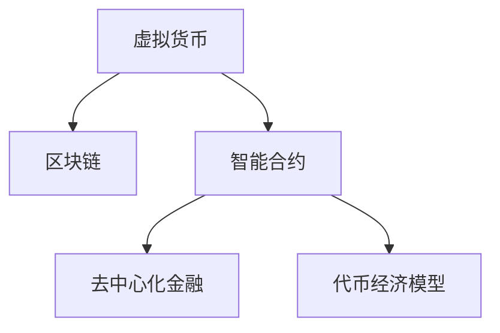

                 

# 虚拟货币与全球脑:去中心化金融的未来图景

在数字货币和区块链技术迅猛发展的当下，去中心化金融(DeFi)正以前所未有的速度崛起，逐渐重塑全球金融生态。本文将深入探讨虚拟货币背后的技术原理，及其与全球大脑共同构建的未来金融图景，揭示去中心化金融的革命性意义。

## 1. 背景介绍

### 1.1 问题由来
近年来，数字货币和区块链技术蓬勃发展，以比特币、以太坊为代表的虚拟货币成为颠覆传统金融体系的利器。这些虚拟货币通过去中心化的账本——区块链，实现了无需中介、不可篡改的交易记录。然而，随着虚拟货币的广泛应用，其背后的去中心化金融生态也逐渐形成，这一新兴金融体系正逐步影响着全球金融市场的运作模式。

### 1.2 问题核心关键点
去中心化金融(DeFi)的崛起，不仅依赖于虚拟货币和区块链技术的发展，还需依赖于智能合约、代币经济模型等关键技术手段。这些技术手段共同构成了去中心化金融的底层架构，并推动其在全球范围内的广泛应用。

本文将深入剖析虚拟货币和区块链技术，探索其与智能合约、代币经济模型的内在联系，并展望去中心化金融的未来趋势。

## 2. 核心概念与联系

### 2.1 核心概念概述

为更好地理解去中心化金融的演变，本节将介绍几个核心概念及其相互之间的联系：

- **虚拟货币(Virtual Currency)**：基于区块链技术，以密码学算法为保障，无需中介的电子支付系统。
- **区块链(Blockchain)**：一种分布式数据库技术，通过去中心化的方式记录和验证交易数据，确保数据的不可篡改性。
- **智能合约(Smart Contract)**：基于区块链技术的自动化合约，当满足预设条件时自动执行，确保交易透明、可信。
- **去中心化金融(DeFi)**：通过智能合约和区块链技术，构建无需中介、自主运行的新型金融体系。
- **代币经济模型(Token Economy Model)**：通过代币发行、分配、流转等规则，构建虚拟货币的激励机制，促进其应用和发展。

这些核心概念之间的逻辑关系可以通过以下Mermaid流程图来展示：



这个流程图展示了大规模虚拟货币系统及其核心技术之间的内在联系：

1. 虚拟货币基于区块链技术，通过去中心化的方式实现价值传递。
2. 智能合约在区块链上构建交易逻辑，自动化执行交易，确保过程透明可信。
3. 去中心化金融利用智能合约和区块链，构建无需中介的金融服务体系。
4. 代币经济模型为虚拟货币赋予内在价值，通过激励机制促进其应用。

## 3. 核心算法原理 & 具体操作步骤

### 3.1 算法原理概述

去中心化金融(DeFi)的核心算法原理基于智能合约和区块链技术。智能合约通过代码实现交易逻辑，区块链确保交易的不可篡改性和分布式存储。这些技术手段共同构成了一个无需中介、自主运行的金融系统，为去中心化金融的崛起奠定了技术基础。

### 3.2 算法步骤详解

去中心化金融的构建过程可以分为以下几个关键步骤：

**Step 1: 准备区块链平台**
- 选择适合的区块链平台，如以太坊(Ethereum)，确保其支持智能合约功能。
- 在区块链平台上创建智能合约地址，存储交易规则和参数。

**Step 2: 设计智能合约**
- 确定智能合约的功能和逻辑，如自动交易、借贷、保险等。
- 使用Solidity等编程语言编写智能合约代码，并进行测试。
- 部署智能合约到区块链平台上，使其在满足预设条件时自动执行。

**Step 3: 发行和管理代币**
- 选择适合的代币标准，如ERC20或EIP-721。
- 在智能合约中定义代币的发行和分配规则，如初始发行数量、销毁机制等。
- 通过智能合约自动完成代币的发行和管理，确保其安全性和透明性。

**Step 4: 构建金融服务**
- 基于智能合约构建金融服务，如借贷、交易、保险等。
- 设计激励机制，如利率、手续费、奖励等，吸引用户参与。
- 通过区块链的分布式账本和智能合约的自动化执行，确保金融服务的可信度和效率。

### 3.3 算法优缺点

去中心化金融具有以下优点：
1. 无需中介，交易透明度高。区块链的去中心化特性保证了交易的可信性和透明性。
2. 自动化执行，运行效率高。智能合约的自动化执行避免了传统金融中介的延时和低效。
3. 开源透明，社区驱动。智能合约的开源特性吸引了众多开发者和用户参与，共同推动平台发展。
4. 去中心化管理，降低运营成本。无需中心化机构的管理，减少了金融服务的运营成本。

同时，该方法也存在一定的局限性：
1. 技术复杂，开发难度大。智能合约的开发需要编程技能，缺乏统一的开发规范。
2. 安全风险，易受攻击。区块链的去中心化特性也意味着其安全性需要高度保障，防止被攻击。
3. 法律监管，存在争议。去中心化金融的法律地位和监管方式尚未明确，存在一定的法律风险。
4. 市场波动，风险较高。虚拟货币市场的波动性大，可能带来较高的投资风险。

尽管存在这些局限性，但就目前而言，去中心化金融仍是大规模虚拟货币应用的核心方向。未来相关研究的重点在于如何进一步降低开发门槛，提高平台安全性，增强法律合规性，同时降低市场波动带来的风险。

### 3.4 算法应用领域

去中心化金融已经在多个领域得到了应用，包括但不限于：

- 借贷与存取：通过智能合约实现借贷和还款的自动化，降低传统银行业的运营成本。
- 自动化交易：通过智能合约实现复杂的交易逻辑，如DeFi AMM(自动做市商)、DeFi DEX(去中心化交易所)等。
- 保险与风险管理：通过智能合约和代币经济模型，构建无需中介的保险和风险管理系统。
- 稳定币：通过算法稳定机制，发行与法币挂钩的稳定币，缓解虚拟货币市场的波动性。
- DeFi 金融衍生品：基于智能合约构建衍生品合约，如期货、期权、掉期等，拓展金融市场的应用场景。

除了上述这些经典应用外，去中心化金融还在不断拓展新的领域，如供应链金融、资产证券化等，为金融市场带来更多创新可能。

## 4. 数学模型和公式 & 详细讲解

### 4.1 数学模型构建

去中心化金融的核心数学模型主要围绕智能合约和区块链技术展开。这里我们以借贷合约为例，构建一个简单的数学模型。

假设用户A希望向用户B借贷一定数量的代币C，智能合约的执行条件包括：
- 用户A持有足够数量的代币C。
- 用户B同意接受A的贷款。
- 用户A同意在约定时间内偿还本金和利息。

在智能合约中，我们可以使用如下代码定义借贷合约的执行逻辑：

```solidity
contract Loan {
    address payable owner;
    uint256 principal;
    uint256 rate;
    uint256 timeLock;
    uint256 repayment;
    uint256 interest;
    mapping(uint256 => address) repayees;

    event LoanRepaid(uint256 amount, address indexed repayor);
    event RepaymentClaimed(address indexed claimer);

    function initialize(uint256 _owner, uint256 _principal, uint256 _rate, uint256 _timeLock, uint256 _repayment, uint256 _interest) public {
        owner = _owner;
        principal = _principal;
        rate = _rate;
        timeLock = _timeLock;
        repayment = _repayment;
        interest = _interest;
        timeLock *= 10**18; // 将单位转换为以太坊的微秒
    }

    function repay(uint256 _amount) public {
        require(_amount == 0 || _amount == principal, "Amount must be zero or equal to principal");
        require(msg.sender == owner, "Not the contract owner");
        require(msg.value == principal * rate * timeLock / 100, "Insufficient amount paid as interest");
        repayees[msg.sender] = msg.sender;
        emit LoanRepaid(principal, msg.sender);
    }

    function claim(uint256 _amount) public {
        require(msg.sender != owner, "Cannot claim by owner");
        require(msg.sender == repayees[msg.sender], "Not authorized to claim");
        require(msg.value == _amount, "Incorrect amount paid");
        emit RepaymentClaimed(msg.sender);
    }
}
```

在这个代码中，我们定义了借贷合约的执行逻辑，包括初始化、还款和索赔等功能。同时，使用以太坊中的`event`机制记录合约执行的日志，确保交易的透明性和可追溯性。

### 4.2 公式推导过程

以借贷合约中的利息计算为例，假设用户A向用户B借贷100个代币C，年利率为5%，还款期限为2年，即730天。则根据合约逻辑，利息计算公式为：

$$
\text{Interest} = \text{Principal} \times \text{Rate} \times \text{TimeLock} / 100
$$

其中，$\text{Principal}=100$，$\text{Rate}=5\%$，$\text{TimeLock}=730$天。将这些值代入公式，可得：

$$
\text{Interest} = 100 \times 5\% \times 730 / 100 = 37.5
$$

根据合约逻辑，用户A需要支付利息37.5个代币C。在智能合约中，利息的计算和支付会自动执行，确保了交易的准确性和高效性。

### 4.3 案例分析与讲解

假设用户A希望向用户B借贷100个代币C，年利率为5%，还款期限为2年。以下是借贷合约的执行过程：

1. 用户A向智能合约发起借贷请求，支付100个代币C作为本金。
2. 智能合约记录借款信息，并在区块链上广播交易记录。
3. 用户B同意接受贷款，则智能合约将100个代币C转账给用户B，并记录还款时间和还款规则。
4. 用户B在约定时间内支付利息37.5个代币C。
5. 智能合约记录利息支付信息，并在区块链上广播交易记录。
6. 用户A在约定时间内偿还100个代币C，智能合约记录还款信息，并在区块链上广播交易记录。
7. 智能合约支付剩余利息，并在区块链上广播交易记录。

通过以上案例，可以看到智能合约和区块链技术如何高效地实现借贷合约的自动化执行，确保了交易的透明性和可信性。

## 5. 项目实践：代码实例和详细解释说明

### 5.1 开发环境搭建

在进行去中心化金融的开发前，我们需要准备好开发环境。以下是使用Solidity进行智能合约开发的环境配置流程：

1. 安装Truffle Suite：从官网下载并安装Truffle Suite，用于创建和管理区块链项目。

2. 创建并激活Truffle环境：
```bash
truffle init
```

3. 安装Solidity编译器：
```bash
npm install -g solc
```

4. 配置Truffle：
```bash
truffle compile
truffle migrate
```

完成上述步骤后，即可在Truffle环境中开始智能合约的开发和测试。

### 5.2 源代码详细实现

下面我们以借贷合约为例，给出使用Solidity语言进行智能合约开发的PyTorch代码实现。

```solidity
pragma solidity ^0.8.0;

contract Loan {
    address payable owner;
    uint256 principal;
    uint256 rate;
    uint256 timeLock;
    uint256 repayment;
    uint256 interest;
    mapping(uint256 => address) repayees;

    event LoanRepaid(uint256 amount, address indexed repayor);
    event RepaymentClaimed(address indexed claimer);

    constructor(uint256 _owner, uint256 _principal, uint256 _rate, uint256 _timeLock, uint256 _repayment, uint256 _interest) {
        owner = _owner;
        principal = _principal;
        rate = _rate;
        timeLock = _timeLock;
        repayment = _repayment;
        interest = _interest;
        timeLock *= 10**18; // 将单位转换为以太坊的微秒
    }

    function repay(uint256 _amount) public {
        require(_amount == 0 || _amount == principal, "Amount must be zero or equal to principal");
        require(msg.sender == owner, "Not the contract owner");
        require(msg.value == principal * rate * timeLock / 100, "Insufficient amount paid as interest");
        repayees[msg.sender] = msg.sender;
        emit LoanRepaid(principal, msg.sender);
    }

    function claim(uint256 _amount) public {
        require(msg.sender != owner, "Cannot claim by owner");
        require(msg.sender == repayees[msg.sender], "Not authorized to claim");
        require(msg.value == _amount, "Incorrect amount paid");
        emit RepaymentClaimed(msg.sender);
    }
}
```

### 5.3 代码解读与分析

让我们再详细解读一下关键代码的实现细节：

**Loan合约类**：
- `constructor`方法：初始化智能合约，设置合约参数，包括借款人、本金、利率、还款期限、还款总额和利息总额。同时将还款期限转换为以太坊的微秒。
- `repay`方法：借款人偿还本金和利息，需要验证还款金额是否正确，并将还款记录保存到合约中。
- `claim`方法：借款人索赔本金，需要验证索赔金额是否正确，并将索赔记录保存到合约中。

**timeLock变量**：
- 将还款期限转换为以太坊的微秒，确保时间戳的精度。

**事件机制**：
- `LoanRepaid`事件：记录借款人还款的信息，确保交易的透明性和可追溯性。
- `RepaymentClaimed`事件：记录借款人索赔的信息，确保交易的透明性和可追溯性。

**require关键字**：
- 确保合约执行的正确性，避免非法操作。

**Truffle环境搭建**：
- 通过Truffle Suite，可以方便地创建和管理区块链项目，进行智能合约的开发、测试和部署。

## 6. 实际应用场景

### 6.1 去中心化借贷

去中心化借贷是去中心化金融的核心应用之一。传统银行借贷往往需要较高的手续费和复杂的审核流程，而去中心化借贷则通过智能合约和区块链技术，降低了借贷成本，提高了借贷效率。

在实际应用中，用户可以创建借贷合约，设置借贷条件和利率。借贷合约通过智能合约自动执行，确保交易的透明性和可信性。同时，用户可以通过区块链平台获取借贷历史记录，确保自身的信誉和权益。

### 6.2 去中心化交易所

去中心化交易所(DeFi DEX)是去中心化金融的重要组成部分，通过智能合约实现自动做市和交易撮合。去中心化交易所无需中心化机构的干预，交易完全由智能合约自动化执行，提高了交易的效率和安全性。

在实际应用中，用户可以创建自动做市商合约，设置初始资金和交易规则。用户通过智能合约进行交易，智能合约自动完成资金转移和交易记录，确保交易的透明性和可信性。同时，用户可以自由退出合约，将资金返还，确保自身的资金安全和自由度。

### 6.3 去中心化保险

去中心化保险是去中心化金融的重要应用场景之一，通过智能合约和区块链技术，构建无需中介的保险和风险管理系统。去中心化保险可以为用户提供更加公平、透明的保险服务，降低传统保险的运营成本。

在实际应用中，用户可以创建保险合约，设置保险条件和保费。保险合约通过智能合约自动执行，确保交易的透明性和可信性。同时，用户可以通过区块链平台获取保险历史记录，确保自身的权益和保障。

### 6.4 未来应用展望

随着去中心化金融的不断发展，未来其应用场景将更加广阔。以下是几个可能的方向：

- **去中心化资产管理**：通过智能合约和区块链技术，构建无需中介的资产管理平台，实现自动化的投资组合管理。
- **去中心化金融衍生品**：基于智能合约和区块链技术，构建衍生品合约，如期货、期权、掉期等，拓展金融市场的应用场景。
- **去中心化身份认证**：通过区块链技术，构建去中心化的身份认证系统，提高身份认证的安全性和隐私保护。
- **去中心化供应链金融**：通过智能合约和区块链技术，构建去中心化的供应链金融平台，实现供应链各环节的协同管理。

## 7. 工具和资源推荐

### 7.1 学习资源推荐

为了帮助开发者系统掌握去中心化金融的理论基础和实践技巧，这里推荐一些优质的学习资源：

1. 《Solidity: Smart Contract Development》系列书籍：由Solidity官方编写，详细介绍了Solidity智能合约的开发和应用。
2. ConsenSys Academy《Ethereum Developer Course》课程：由ConsenSys提供，涵盖智能合约、去中心化金融、以太坊等领域的深入学习。
3. Ethereum官网文档：详细介绍了以太坊平台的开发和应用，包括智能合约、Web3.js、Truffle等工具的使用。
4. CryptoZombies游戏：通过互动游戏的方式，帮助初学者了解智能合约和区块链技术，轻松上手开发。
5. CryptoMiniLab平台：提供了基于Solidity的开发环境，支持智能合约的测试和部署，适合新手进行实验和开发。

通过对这些资源的学习实践，相信你一定能够快速掌握去中心化金融的精髓，并用于解决实际的区块链问题。

### 7.2 开发工具推荐

高效的开发离不开优秀的工具支持。以下是几款用于去中心化金融开发的常用工具：

1. Solidity编译器(Solc)：用于编译和验证智能合约代码，支持Ethereum平台。
2. Truffle Suite：基于Web3.js的开发框架，支持智能合约的开发、测试和部署。
3. Web3.js库：用于与Ethereum平台交互的JavaScript库，支持智能合约的调用和操作。
4. Remix IDE：集成Solidity编译器和测试环境的开发环境，支持智能合约的快速迭代和实验。
5. MetaMask浏览器插件：支持Ethereum平台的浏览器扩展，方便用户进行钱包管理和智能合约操作。

合理利用这些工具，可以显著提升去中心化金融应用的开发效率，加速区块链技术的应用落地。

### 7.3 相关论文推荐

去中心化金融的发展离不开学界的持续研究。以下是几篇奠基性的相关论文，推荐阅读：

1. "Solidity Smart Contracts: A Real-Life Decentralized Application"：介绍Solidity智能合约的开发和应用，涵盖智能合约的编写、测试和部署等细节。
2. "Smart Contracts: Platforms, Protocols and Anarchies"：探讨智能合约在去中心化金融中的作用，分析其潜在的法律和伦理问题。
3. "Bitcoin and Cryptocurrency Technologies"：介绍比特币和区块链技术的原理和应用，深入分析其背后的去中心化思想。
4. "The Economics of Smart Contracts"：从经济学的角度探讨智能合约的运作机制，分析其对金融市场的影响。
5. "Blockchain & Smart Contracts"：详细介绍区块链和智能合约技术，涵盖其应用场景和开发实践。

这些论文代表了大规模虚拟货币系统及其核心技术的发展脉络。通过学习这些前沿成果，可以帮助研究者把握学科前进方向，激发更多的创新灵感。

## 8. 总结：未来发展趋势与挑战

### 8.1 总结

本文对去中心化金融(DeFi)的演变进行了全面系统的介绍。首先阐述了虚拟货币和区块链技术的研究背景和意义，明确了大规模虚拟货币系统及其核心技术的内在联系。其次，从原理到实践，详细讲解了去中心化金融的数学模型和智能合约的开发过程，给出了智能合约开发和测试的完整代码实例。同时，本文还广泛探讨了去中心化金融在多个行业领域的应用前景，展示了其广阔的发展空间。

通过本文的系统梳理，可以看到，去中心化金融正通过智能合约和区块链技术，逐步构建无需中介、自主运行的金融系统，对传统金融体系带来深远影响。未来，伴随区块链技术的持续演进，去中心化金融必将在全球金融市场中扮演越来越重要的角色，重塑金融生态的格局。

### 8.2 未来发展趋势

展望未来，去中心化金融将呈现以下几个发展趋势：

1. **技术创新**：随着区块链技术的持续发展，去中心化金融将不断涌现新的技术创新，如跨链技术、链上治理等，提升系统的安全性和效率。
2. **应用拓展**：去中心化金融的应用场景将不断拓展，涵盖更广泛的社会和经济领域，如供应链金融、医疗健康、社交娱乐等。
3. **市场成熟**：随着去中心化金融的普及，市场参与者将不断增加，行业规范和标准将逐步建立，提升系统的稳定性和可信度。
4. **合规与监管**：各国政府和监管机构将逐步关注去中心化金融的发展，出台相应的监管政策和法规，确保系统的合法性和合规性。
5. **技术普及**：随着区块链技术的普及，更多人将了解和使用去中心化金融，推动其在全球范围内的广泛应用。

以上趋势凸显了去中心化金融的广阔前景。这些方向的探索发展，必将进一步提升去中心化金融系统的性能和应用范围，为全球金融市场带来新的变革。

### 8.3 面临的挑战

尽管去中心化金融已经取得了显著进展，但在迈向更加智能化、普适化应用的过程中，它仍面临着诸多挑战：

1. **技术复杂性**：智能合约的开发和维护需要较高的编程技能，存在一定的学习门槛和技术难度。
2. **安全风险**：去中心化金融的安全性需要高度保障，防止被攻击和篡改，确保系统的稳定性和可信性。
3. **法律合规性**：去中心化金融的法律地位和监管方式尚未明确，存在一定的法律风险。
4. **市场波动**：虚拟货币市场的波动性大，可能带来较高的投资风险，需要有效的风险管理措施。
5. **用户体验**：去中心化金融的界面和操作复杂，用户体验有待提升，需要更好的交互设计和用户引导。

这些挑战将对去中心化金融的未来发展带来一定的阻碍，但也是不断进步的动力。通过不断的技术创新和经验积累，相信这些挑战终将一一被克服，去中心化金融必将在构建安全、可靠、可控的智能系统上取得新的突破。

### 8.4 研究展望

面对去中心化金融所面临的挑战，未来的研究需要在以下几个方面寻求新的突破：

1. **开发工具优化**：开发更易用、更高效的智能合约开发工具，降低技术门槛，提升开发效率。
2. **安全机制增强**：开发更先进的安全机制，如零知识证明、多方计算等，增强系统的安全性。
3. **法规和标准建立**：积极参与和推动去中心化金融的法规和标准制定，确保系统的合规性和稳定性。
4. **用户体验改进**：设计更简洁、更友好的用户界面和交互流程，提升用户体验和操作便捷性。
5. **跨链技术发展**：推动跨链技术的发展，实现不同区块链平台之间的互联互通，增强系统的可扩展性和灵活性。

这些研究方向的探索，必将引领去中心化金融技术迈向更高的台阶，为全球金融市场带来新的变革。面向未来，去中心化金融技术还需要与其他人工智能技术进行更深入的融合，如知识表示、因果推理、强化学习等，多路径协同发力，共同推动自然语言理解和智能交互系统的进步。只有勇于创新、敢于突破，才能不断拓展去中心化金融的边界，让智能技术更好地造福人类社会。

## 9. 附录：常见问题与解答

**Q1：去中心化金融的应用场景有哪些？**

A: 去中心化金融的应用场景非常广泛，包括但不限于：
1. **去中心化借贷**：通过智能合约实现借贷合同的自动化执行，降低借贷成本和复杂度。
2. **去中心化交易所**：通过智能合约实现自动做市和交易撮合，提高交易效率和安全性。
3. **去中心化保险**：通过智能合约实现无需中介的保险合同，降低保险成本和复杂度。
4. **去中心化资产管理**：通过智能合约实现自动化的投资组合管理，提高投资效率和透明度。
5. **去中心化供应链金融**：通过智能合约实现供应链各环节的协同管理，提高供应链效率和可控性。
6. **去中心化身份认证**：通过区块链技术，构建去中心化的身份认证系统，提高身份认证的安全性和隐私保护。

**Q2：去中心化金融与传统金融的区别是什么？**

A: 去中心化金融与传统金融的区别主要体现在以下几个方面：
1. **中介角色的去除**：去中心化金融通过智能合约和区块链技术，实现无需中介的自动执行，降低交易成本和复杂度。
2. **透明性和可信性**：去中心化金融的交易记录在区块链上公开透明，确保交易的可信性和可追溯性。
3. **自主性和灵活性**：去中心化金融的合同和规则由智能合约自动化执行，具有更高的自主性和灵活性。
4. **可扩展性和可扩展性**：去中心化金融可以在不同的区块链平台和智能合约之间无缝切换，具有更强的可扩展性和灵活性。
5. **去中心化管理**：去中心化金融不需要中心化机构的管理，降低运营成本和风险。

这些区别展示了去中心化金融的革命性意义，也带来了新的挑战和机遇。

**Q3：去中心化金融的安全性如何保障？**

A: 去中心化金融的安全性主要通过以下几个方面保障：
1. **智能合约的安全性**：通过严格的软件测试和代码审计，确保智能合约的安全性和可靠性。
2. **区块链的不可篡改性**：通过区块链的去中心化和不可篡改特性，确保交易记录的安全性和透明性。
3. **多方签名机制**：通过多方签名机制，增加交易的复杂性和安全性，防止单点攻击。
4. **代币经济模型的设计**：通过合理的代币经济模型，设计激励机制，增强系统的稳定性和安全性。
5. **隐私保护机制**：通过隐私保护机制，确保用户数据的隐私和安全。

这些措施的综合运用，可以最大限度地保障去中心化金融的安全性和可信度。

**Q4：如何评估去中心化金融项目的风险？**

A: 评估去中心化金融项目的风险主要从以下几个方面进行：
1. **智能合约的代码审计**：对智能合约进行详细的代码审计，查找潜在的漏洞和安全问题。
2. **系统的测试和验证**：通过模拟攻击和压力测试，验证系统的鲁棒性和稳定性。
3. **法律合规性评估**：评估项目的法律合规性，确保其符合当地法律法规和监管要求。
4. **市场分析**：分析项目的市场前景和潜在风险，评估其在市场的竞争力和可持续性。
5. **技术团队的背景和经验**：评估技术团队的背景和经验，确保其具备相应的技术能力和项目管理经验。

通过全面评估，可以有效识别和规避去中心化金融项目的风险，确保项目的成功和稳定。

**Q5：去中心化金融的未来发展方向是什么？**

A: 去中心化金融的未来发展方向主要体现在以下几个方面：
1. **技术创新**：推动区块链技术的持续创新，如跨链技术、隐私保护技术等，提升系统的安全性和效率。
2. **应用拓展**：拓展去中心化金融的应用场景，涵盖更广泛的社会和经济领域，如医疗健康、社交娱乐等。
3. **市场成熟**：推动去中心化金融的市场成熟和普及，提高用户参与度和接受度。
4. **法规和标准建立**：积极参与和推动去中心化金融的法规和标准制定，确保系统的合规性和稳定性。
5. **用户体验改进**：设计更简洁、更友好的用户界面和交互流程，提升用户体验和操作便捷性。

这些方向将推动去中心化金融技术的不断进步和应用，为全球金融市场带来新的变革和机遇。

---

作者：禅与计算机程序设计艺术 / Zen and the Art of Computer Programming

