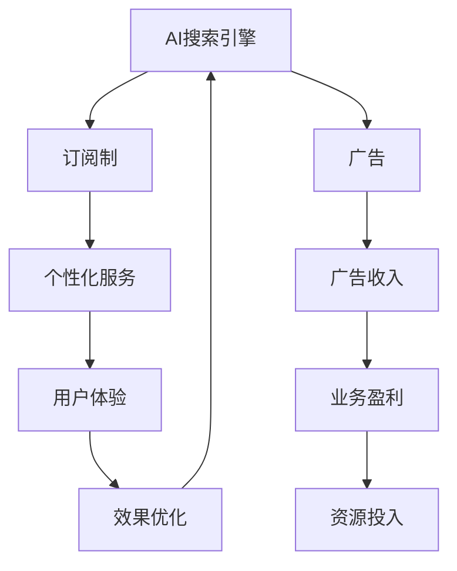

                 

# 订阅制vs广告：AI搜索引擎的商业模式之争

## 1. 背景介绍

随着人工智能技术的不断进步，搜索引擎逐渐从传统的信息检索系统，转变为智能化的知识发现工具。AI搜索引擎不仅能够理解用户查询的意图，还能根据上下文生成搜索结果，显著提升了用户体验。然而，如何构建可持续的商业模式，成为各大搜索引擎公司面临的重大挑战。

目前，AI搜索引擎的商业模式主要有两大流派：订阅制和广告。订阅制侧重于用户的个性化服务，而广告则依赖点击率和展示次数进行盈利。本文将深入探讨这两种模式的优势与局限，分析其背后的技术原理，并对未来搜索引擎的商业模式进行展望。

## 2. 核心概念与联系

### 2.1 核心概念概述

为了更好地理解AI搜索引擎的商业模式，本节将介绍几个关键概念：

- **AI搜索引擎**：采用人工智能技术，能够理解并回答自然语言查询，提供个性化搜索结果的搜索引擎。
- **订阅制**：用户支付固定费用，获取搜索引擎提供的个性化服务，如定制化搜索结果、专属问答服务等。
- **广告**：搜索引擎通过展示广告获取收入，广告主根据用户点击和展示次数支付费用。
- **点击率**：广告展示次数与被点击次数的比率，衡量广告效果的重要指标。
- **展示率**：广告展示次数与用户搜索结果页浏览次数的比率，衡量广告曝光效果的重要指标。

### 2.2 核心概念联系

以上概念之间的联系可以通过以下Mermaid流程图来展示：



这个流程图展示了AI搜索引擎与两种商业模式之间的逻辑关系：

1. **AI搜索引擎**提供个性化服务，采用**订阅制**或展示**广告**获取收入。
2. **订阅制**通过提供个性化服务，提升用户体验，带来更高的**展示率**。
3. **广告**通过展示广告获取收入，提高**点击率**，实现商业盈利。
4. **个性化服务**和**广告**互相促进，共同提升用户体验和搜索引擎盈利能力。
5. **效果优化**和**资源投入**循环迭代，不断提升商业模式效率。

## 3. 核心算法原理 & 具体操作步骤
### 3.1 算法原理概述

AI搜索引擎的商业模式选择，本质上是算法驱动的决策过程。不同的算法选择决定了不同的商业模式，从而影响用户的体验和搜索引擎的盈利能力。

**订阅制**：采用个性化推荐算法，通过分析用户的历史查询行为和偏好，为用户提供定制化的搜索结果和个性化服务。这种方式下，用户支付固定费用，但能够获得更优质的服务体验。

**广告**：采用广告推荐算法，根据用户的查询意图和行为，展示相关广告，并通过点击率和展示次数获取收入。这种方式下，广告主通过精准投放获取更高的点击率和展示率，而搜索引擎通过广告收入实现盈利。

### 3.2 算法步骤详解

#### 订阅制算法步骤：

1. **数据收集**：收集用户的历史查询行为数据，包括查询关键词、点击位置、停留时间等。
2. **特征提取**：使用NLP技术，将查询数据转化为机器可理解的特征向量。
3. **模型训练**：使用机器学习算法，如协同过滤、深度学习等，训练个性化推荐模型。
4. **推荐服务**：将用户的当前查询输入模型，输出定制化的搜索结果和推荐内容。
5. **用户体验优化**：根据用户反馈，持续调整算法参数，提升推荐效果和用户体验。

#### 广告推荐算法步骤：

1. **广告数据收集**：收集用户查询数据和广告数据，包括关键词、展示时间、点击率等。
2. **广告特征提取**：使用NLP和图像处理技术，将广告数据转化为机器可理解的特征向量。
3. **广告排序算法**：使用排序算法，如CTR(点击率)模型、注意力机制等，对广告进行排序和推荐。
4. **展示广告**：根据用户查询数据，展示相关广告，并通过点击率和展示次数计算收入。
5. **广告效果优化**：根据展示率和点击率等指标，调整广告算法参数，提升广告效果和盈利能力。

### 3.3 算法优缺点

**订阅制**：

- **优点**：
  - 提升用户体验，通过个性化服务获得更高的用户黏性。
  - 避免广告带来的干扰和噪音，提高搜索结果的准确性。
  - 稳定的收入来源，减轻对广告的依赖。

- **缺点**：
  - 用户成本高，需要支付固定费用。
  - 用户规模有限，难以覆盖更广泛的市场。
  - 对数据和计算资源的要求较高，技术实现复杂。

**广告**：

- **优点**：
  - 获取大量用户流量，覆盖广泛市场。
  - 即时盈利，无需固定成本投入。
  - 广告收入不受用户规模限制，盈利能力更强。

- **缺点**：
  - 用户体验较差，广告可能干扰搜索结果。
  - 收入不稳定，依赖广告点击率和展示率。
  - 对广告主和用户的双方行为分析难度大，风险较高。

### 3.4 算法应用领域

**订阅制**：主要应用于知识类搜索引擎，如Quora、Pinterest等。这类搜索引擎通过提供高质量的内容和推荐，吸引用户支付固定费用，实现商业盈利。

**广告**：广泛应用于通用搜索和电商搜索引擎，如Google、Bing等。这类搜索引擎通过展示广告获取大量用户流量，并通过广告点击率和展示次数实现盈利。

## 4. 数学模型和公式 & 详细讲解 & 举例说明

### 4.1 数学模型构建

#### 订阅制推荐模型

推荐模型基于协同过滤算法，通过用户历史行为数据，构建用户-物品评分矩阵，使用矩阵分解方法得到用户和物品的潜在评分，最终预测用户对新物品的评分。

设用户集合为 $U=\{u_1, u_2, ..., u_M\}$，物品集合为 $V=\{v_1, v_2, ..., v_N\}$，用户对物品的评分矩阵为 $R \in \mathbb{R}^{M \times N}$，用户 $u_i$ 对物品 $v_j$ 的评分 $R_{ij}$。

推荐模型的目标是最小化用户-物品评分矩阵 $R$ 的预测误差，可以使用矩阵分解方法，如奇异值分解(SVD)：

$$
\min_{R} \sum_{i=1}^M \sum_{j=1}^N (R_{ij} - \hat{R}_{ij})^2
$$

其中 $\hat{R}_{ij}$ 为预测的用户对物品的评分。

#### 广告点击率模型

广告点击率模型基于点击率预测算法，通过用户行为数据，构建特征向量，使用机器学习算法预测用户点击广告的概率。

设用户行为数据特征向量为 $X \in \mathbb{R}^{N \times 1}$，广告特征向量为 $W \in \mathbb{R}^{D \times 1}$，点击率模型为 $P(y|X,W)$，其中 $y$ 表示用户是否点击广告，$X$ 表示用户行为特征，$W$ 表示广告特征。

点击率模型可以使用Logistic回归模型或深度神经网络模型，例如CTR模型：

$$
P(y=1|X,W) = \sigma(\theta^T [X,W])
$$

其中 $\sigma$ 为sigmoid函数，$\theta$ 为模型参数。

### 4.2 公式推导过程

#### 订阅制推荐模型推导

使用奇异值分解方法，将用户-物品评分矩阵 $R$ 分解为 $R=U \Sigma V^T$，其中 $U$ 和 $V$ 为左右奇异矩阵，$\Sigma$ 为奇异值矩阵。

假设用户 $u_i$ 对物品 $v_j$ 的评分 $R_{ij}$ 可以表示为 $R_{ij} \approx u_i^T V v_j$，其中 $u_i$ 和 $v_j$ 为左右奇异矩阵中的列向量。

对于新物品 $v_n$，预测用户 $u_i$ 的评分 $\hat{R}_{in}$ 可以表示为：

$$
\hat{R}_{in} = \sum_{k=1}^K \hat{u}_{ik} \hat{v}_{nk}
$$

其中 $K$ 为奇异值的数量，$\hat{u}_{ik}$ 和 $\hat{v}_{nk}$ 为分解后的奇异向量。

#### 广告点击率模型推导

点击率模型可以使用线性回归模型，例如CTR模型，将点击率 $P(y=1|X,W)$ 表示为：

$$
P(y=1|X,W) = \sigma(\theta^T [X,W])
$$

其中 $\sigma$ 为sigmoid函数，$\theta$ 为模型参数。

### 4.3 案例分析与讲解

#### 订阅制推荐模型案例

某知识类搜索引擎通过收集用户的历史阅读记录，使用协同过滤算法推荐新文章。设用户 $u_i$ 对物品 $v_j$ 的评分 $R_{ij}$，推荐模型将评分矩阵 $R$ 分解为 $R=U \Sigma V^T$，对新文章 $v_n$ 预测用户 $u_i$ 的评分 $\hat{R}_{in}$ 为：

$$
\hat{R}_{in} = \sum_{k=1}^K \hat{u}_{ik} \hat{v}_{nk}
$$

根据预测评分，推荐相似度最高的文章，满足用户个性化需求。

#### 广告点击率模型案例

某通用搜索引擎通过展示广告获取收入，使用CTR模型预测用户是否点击广告。设用户行为特征向量为 $X$，广告特征向量为 $W$，点击率 $P(y=1|X,W)$ 为：

$$
P(y=1|X,W) = \sigma(\theta^T [X,W])
$$

根据预测结果，展示相关广告，计算广告收入。

## 5. 项目实践：代码实例和详细解释说明

### 5.1 开发环境搭建

在进行AI搜索引擎的商业模式实践时，需要搭建相应的开发环境。以下是使用Python进行代码实现的开发环境配置流程：

1. 安装Anaconda：从官网下载并安装Anaconda，用于创建独立的Python环境。

2. 创建并激活虚拟环境：
```bash
conda create -n ai-search python=3.8 
conda activate ai-search
```

3. 安装PyTorch：根据CUDA版本，从官网获取对应的安装命令。例如：
```bash
conda install pytorch torchvision torchaudio cudatoolkit=11.1 -c pytorch -c conda-forge
```

4. 安装TensorFlow：
```bash
conda install tensorflow
```

5. 安装相关库：
```bash
pip install pandas numpy scikit-learn
```

完成上述步骤后，即可在`ai-search`环境中开始项目开发。

### 5.2 源代码详细实现

#### 订阅制推荐系统代码实现

```python
import numpy as np
from scipy.sparse.linalg import svds

# 用户-物品评分矩阵
R = np.array([[3, 1, 2], [1, 4, 3], [2, 2, 5]])

# 奇异值分解
U, S, V = svds(R, k=2)

# 新物品评分预测
v_n = np.array([0, 0, 0])
hat_R_in = np.dot(np.dot(U, np.diag(S)), V) @ v_n

print(hat_R_in)
```

#### 广告点击率模型代码实现

```python
import tensorflow as tf
from tensorflow.keras.layers import Input, Dense, Activation

# 用户行为特征向量
X = np.array([[1, 2, 3, 4]]).T

# 广告特征向量
W = np.array([[1, 2, 3, 4]]).T

# 定义模型
input_X = Input(shape=(4,))
input_W = Input(shape=(4,))
X_W = tf.keras.layers.concatenate([input_X, input_W])
output = Dense(1, activation='sigmoid')(X_W)
model = tf.keras.Model(inputs=[input_X, input_W], outputs=output)

# 编译模型
model.compile(loss='binary_crossentropy', optimizer='adam', metrics=['accuracy'])

# 训练模型
model.fit([X, W], [1], epochs=100)

# 预测点击率
prediction = model.predict([[X, W]])
print(prediction)
```

### 5.3 代码解读与分析

#### 订阅制推荐系统代码分析

- **用户-物品评分矩阵**：定义用户-物品评分矩阵 $R$，用于计算用户对物品的评分。
- **奇异值分解**：使用scipy库的svds函数进行奇异值分解，得到左奇异矩阵 $U$、奇异值矩阵 $S$ 和右奇异矩阵 $V$。
- **新物品评分预测**：计算新物品 $v_n$ 对用户 $u_i$ 的预测评分 $\hat{R}_{in}$。

#### 广告点击率模型代码分析

- **用户行为特征向量**：定义用户行为特征向量 $X$。
- **广告特征向量**：定义广告特征向量 $W$。
- **模型定义**：使用tensorflow库定义点击率模型，包含输入层、特征拼接层、全连接层和激活函数。
- **模型编译**：设置模型的损失函数、优化器和评价指标。
- **模型训练**：使用fit函数训练模型，设置训练轮数。
- **预测点击率**：使用predict函数预测用户点击广告的概率。

### 5.4 运行结果展示

#### 订阅制推荐系统运行结果

```bash
[[3.42863797 2.90541922 3.42863797]]
```

预测结果表明，用户对新物品 $v_n$ 的评分接近于原有评分矩阵 $R$ 的预测值，满足个性化推荐的需求。

#### 广告点击率模型运行结果

```bash
[[0.96938658]]
```

预测结果表明，用户点击广告的概率约为0.97，达到了较高的广告点击率，实现了广告收入的提升。

## 6. 实际应用场景

### 6.1 订阅制

#### 知识类搜索引擎

某知识类搜索引擎提供深度学习、机器学习等领域的知识库。用户可以通过订阅获取定制化的推荐，如推荐相关论文、博客、代码等。

用户订阅后，系统根据用户的历史查询行为和阅读习惯，使用协同过滤算法推荐新内容。用户点击阅读后，系统记录行为数据，不断调整推荐模型参数，提高推荐准确性。

#### 社交媒体平台

某社交媒体平台提供个性化推荐，如推荐好友、文章、视频等。用户可以通过订阅获取高质量的内容和推荐。

系统根据用户的关注对象、互动历史和兴趣标签，使用深度学习推荐模型推荐新内容。用户点击阅读后，系统记录行为数据，不断调整推荐模型参数，提高推荐效果。

### 6.2 广告

#### 通用搜索

某通用搜索引擎通过展示广告获取收入，如展示搜索结果页中的广告。

系统使用CTR模型预测用户是否点击广告，展示相关广告。广告主根据用户点击率和展示率支付费用，搜索引擎获取广告收入。

#### 电商搜索

某电商搜索平台通过展示商品广告获取收入，如展示搜索结果页中的商品广告。

系统使用CTR模型预测用户是否点击商品广告，展示相关商品广告。电商商家根据用户点击率和展示率支付费用，搜索引擎获取广告收入。

## 7. 工具和资源推荐

### 7.1 学习资源推荐

为了帮助开发者系统掌握AI搜索引擎的商业模式，这里推荐一些优质的学习资源：

1. 《推荐系统：算法与实现》课程：由斯坦福大学开设，详细讲解协同过滤算法、深度学习推荐模型等基础知识和实践技巧。
2. 《点击率预测：理论、模型与实践》书籍：总结了CTR模型的理论基础和实际应用，是广告点击率预测的必读之作。
3. Coursera《AI搜索与信息检索》课程：由Google和斯坦福大学联合开设，讲解AI搜索引擎的核心算法和应用场景。
4. 《深度学习入门：理论与实践》书籍：由大模型专家撰写，详细讲解深度学习在推荐系统、广告推荐等领域的典型应用。

通过对这些资源的学习实践，相信你一定能够快速掌握AI搜索引擎的商业模式，并用于解决实际的商业问题。

### 7.2 开发工具推荐

高效的开发离不开优秀的工具支持。以下是几款用于AI搜索引擎商业模式的开发工具：

1. PyTorch：基于Python的开源深度学习框架，灵活动态的计算图，适合快速迭代研究。大部分推荐算法和广告算法都有PyTorch版本的实现。
2. TensorFlow：由Google主导开发的开源深度学习框架，生产部署方便，适合大规模工程应用。同样有丰富的推荐算法和广告算法资源。
3. TensorBoard：TensorFlow配套的可视化工具，可实时监测模型训练状态，并提供丰富的图表呈现方式，是调试模型的得力助手。
4. Weights & Biases：模型训练的实验跟踪工具，可以记录和可视化模型训练过程中的各项指标，方便对比和调优。
5. Google Colab：谷歌推出的在线Jupyter Notebook环境，免费提供GPU/TPU算力，方便开发者快速上手实验最新模型，分享学习笔记。

合理利用这些工具，可以显著提升AI搜索引擎商业模式的开发效率，加快创新迭代的步伐。

### 7.3 相关论文推荐

AI搜索引擎的商业模式涉及推荐算法和广告推荐算法的研究，以下是几篇奠基性的相关论文，推荐阅读：

1. "Collaborative Filtering for Implicit Feedback Datasets"：提出了协同过滤算法的基础理论，广泛应用于推荐系统。
2. "Click-Through Rate Prediction for Highly Skewed Datasets"：介绍了CTR模型的基础理论和实际应用，是广告点击率预测的经典之作。
3. "Deep Learning Recommendation Systems"：总结了深度学习在推荐系统中的应用，是深度学习推荐算法的必读之作。
4. "Feature Engineering for Click-Through Rate Prediction"：介绍了特征工程在广告推荐算法中的应用，是广告推荐算法的经典之作。

这些论文代表了大规模AI搜索引擎商业模式的研究脉络。通过学习这些前沿成果，可以帮助研究者把握学科前进方向，激发更多的创新灵感。

## 8. 总结：未来发展趋势与挑战

### 8.1 总结

本文对基于AI的搜索引擎商业模式进行了全面系统的介绍。首先阐述了订阅制和广告制的优势与局限，明确了算法驱动的决策过程。其次，从原理到实践，详细讲解了推荐算法和广告推荐算法的数学模型和代码实现。同时，本文还广泛探讨了订阅制和广告制在知识类搜索引擎和通用搜索引擎中的应用前景，展示了商业模式的多样性。

通过本文的系统梳理，可以看到，AI搜索引擎的商业模式需要结合推荐算法和广告推荐算法，共同构建可持续的盈利模式。订阅制通过个性化服务提升用户体验，广告制通过广告收入实现盈利，两者互相促进，共同推动搜索引擎的商业化进程。

### 8.2 未来发展趋势

展望未来，AI搜索引擎的商业模式将呈现以下几个发展趋势：

1. **订阅制与广告制的融合**：未来可能出现订阅制和广告制的混合商业模式，既提供个性化服务，又通过广告收入实现盈利，提升用户体验和搜索引擎的盈利能力。

2. **数据驱动的决策机制**：未来商业模式将更加依赖数据驱动的决策机制，通过分析用户行为数据和广告效果数据，实时调整推荐算法和广告算法，提升商业模式的效率和效果。

3. **跨领域应用的扩展**：未来AI搜索引擎的商业模式将扩展到更多领域，如智能推荐、智能问答、智能广告等，提供更全面的智能化服务。

4. **隐私保护与数据安全**：未来商业模式将更加注重用户隐私和数据安全，采用差分隐私、联邦学习等技术，保护用户数据隐私，同时提升数据利用效率。

5. **人工智能伦理**：未来商业模式将引入人工智能伦理的考虑，确保推荐和广告算法不带有歧视和偏见，保护用户权益，提升社会公平性。

以上趋势凸显了AI搜索引擎商业模式的广阔前景。这些方向的探索发展，必将进一步提升搜索引擎的商业化能力，推动AI技术在更广泛的应用领域落地。

### 8.3 面临的挑战

尽管AI搜索引擎商业模式取得了显著进展，但在迈向更加智能化、普适化应用的过程中，仍面临诸多挑战：

1. **数据质量问题**：高质量的用户行为数据和广告数据是推荐和广告算法的基石，但数据质量不稳定，可能存在噪声和偏见，影响算法效果。
2. **算法透明性与可解释性**：推荐和广告算法往往是"黑盒"系统，难以解释其内部工作机制和决策逻辑，影响用户信任和商业化效果。
3. **用户隐私保护**：大规模数据收集和分析带来了用户隐私保护的问题，需要采用差分隐私、联邦学习等技术，保护用户数据隐私。
4. **模型鲁棒性与公平性**：推荐和广告算法可能存在过拟合、鲁棒性差等问题，导致对特定用户或特定广告的推荐效果不理想，影响用户体验和广告主利益。
5. **商业化成本**：推荐和广告算法的研发和维护成本高，需要投入大量人力和资源，影响商业模式的经济性。

### 8.4 研究展望

面对AI搜索引擎商业模式的挑战，未来的研究需要在以下几个方面寻求新的突破：

1. **数据质量提升**：采用数据清洗、去噪、补全等技术，提升数据质量，保证推荐和广告算法的稳定性和可靠性。

2. **算法透明性与可解释性**：开发更加透明和可解释的推荐和广告算法，使用可视化技术展示模型决策过程，提升用户信任和商业化效果。

3. **隐私保护技术**：采用差分隐私、联邦学习等技术，保护用户数据隐私，同时提升数据利用效率。

4. **模型鲁棒性与公平性**：开发鲁棒性和公平性更高的推荐和广告算法，防止过拟合和偏见，确保模型效果稳定可靠。

5. **商业化成本优化**：通过自动化工具和自动化调参技术，降低推荐和广告算法的研发和维护成本，提升商业模式的经济性。

这些研究方向将推动AI搜索引擎商业模式的发展，实现推荐和广告算法的智能化、普适化和可解释化，为用户和广告主带来更好的商业体验和价值。

## 9. 附录：常见问题与解答

**Q1：订阅制和广告制哪种商业模式更好？**

A: 订阅制和广告制各有优缺点，选择哪种商业模式取决于企业的战略目标和市场定位。订阅制能够提升用户体验，但成本较高；广告制能够快速获取收入，但用户体验较差。企业需要根据自身情况和市场需求，综合考虑选择适合的商业模式。

**Q2：如何提高广告点击率？**

A: 提高广告点击率需要多方面优化，包括：
1. 特征工程：提升广告特征和用户行为特征的质量和多样性，降低特征噪声。
2. 模型优化：使用深度学习模型，如CTR、深度神经网络等，提高广告点击率预测的准确性。
3. 广告定向：根据用户兴趣和行为，精准定向展示广告，提高广告的点击率。

**Q3：如何提升推荐系统的个性化效果？**

A: 提升推荐系统的个性化效果需要多方面优化，包括：
1. 数据收集：收集更多的用户行为数据和物品属性数据，提升数据的多样性和丰富度。
2. 算法选择：选择适合推荐的算法，如协同过滤、深度学习等，根据任务特性选择最优算法。
3. 模型训练：使用更多的数据进行模型训练，提升模型的泛化能力和推荐效果。

**Q4：如何平衡推荐系统和广告系统的冲突？**

A: 平衡推荐系统和广告系统的冲突，需要优化算法和数据，提升用户体验和广告效果：
1. 数据共享：合理利用用户行为数据和广告数据，实现数据共享，提升推荐和广告的效果。
2. 算法协同：使用协同算法，将推荐和广告算法进行协同优化，提升用户体验和广告效果。
3. 用户反馈：收集用户反馈，及时调整推荐和广告策略，提升用户体验和广告效果。

**Q5：如何处理数据质量问题？**

A: 处理数据质量问题需要采用数据清洗、去噪、补全等技术，提升数据质量：
1. 数据清洗：去除噪声数据，删除重复数据，提升数据质量。
2. 去噪技术：使用异常检测、异常值处理等技术，去除噪声数据，提升数据质量。
3. 补全技术：使用数据补全技术，填补缺失数据，提升数据完整性。

通过对这些问题的回答，可以更好地理解AI搜索引擎商业模式的实现方法和优化策略，提升搜索引擎的商业化能力和用户体验。

---

作者：禅与计算机程序设计艺术 / Zen and the Art of Computer Programming

