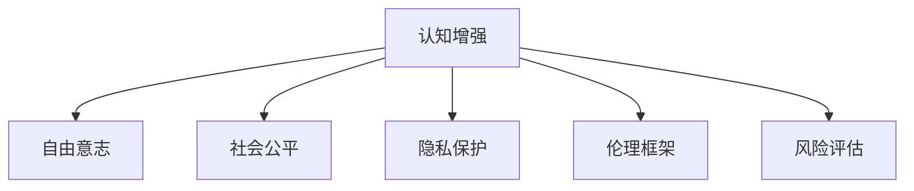
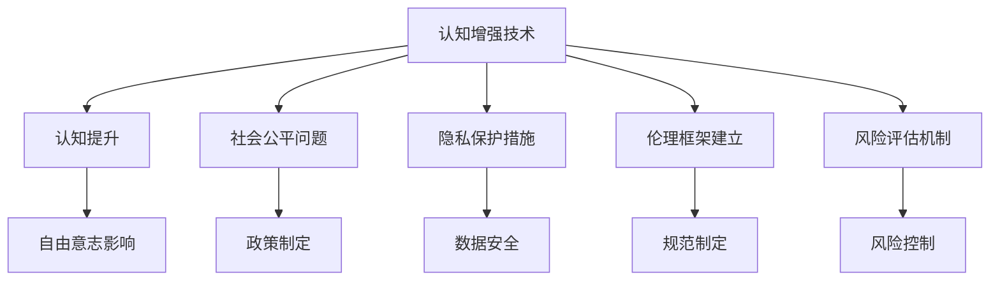

                 

## 1. 背景介绍

### 1.1 问题由来

随着人工智能技术的迅猛发展，认知增强(Cognitive Enhancement)技术日益成为热点话题。认知增强旨在通过科技手段提升人类的认知能力，如记忆力、注意力、学习力等，以应对人类社会面临的日益增长的信息量和复杂性。然而，伴随着认知增强技术的应用，也引发了一系列伦理、法律和安全问题，如对个体自由意志的影响、公平性问题以及潜在的滥用风险等。

### 1.2 问题核心关键点

认知增强技术在伦理层面的核心问题在于其对人类能力提升的边界，以及如何平衡提升认知与保护人类尊严、自由意志和公平性之间的关系。具体而言，包括：

1. **认知提升与个体自由意志的关系**：认知增强可能改变人的认知结构，影响其行为和决策，从而对个体自由意志构成威胁。
2. **认知公平性问题**：认知增强技术的普及可能加剧社会不平等，使部分个体获得更大优势，进而引发社会不公。
3. **安全性与隐私问题**：认知增强技术的实施需要收集和处理大量个人数据，存在数据泄露和滥用的风险。
4. **认知失调与道德冲突**：认知增强技术可能引发个体心理上的认知失调，使其在道德判断上产生冲突。

理解并解决这些问题，对于推动认知增强技术健康发展具有重要意义。

### 1.3 问题研究意义

研究认知增强的伦理问题，对于认知增强技术的合理应用、公平分配以及社会稳定具有深远影响：

1. **确保技术安全性**：通过分析潜在风险，制定合理的安全规范和技术标准，避免认知增强技术的不良影响。
2. **促进公平性**：制定公正的准入和应用策略，确保技术普惠社会各阶层，避免加剧社会不平等。
3. **保障个人自由意志**：通过伦理引导和法律约束，保护个体的自由选择权，防止技术滥用。
4. **推动伦理教育**：提升社会公众对认知增强伦理问题的认识，培养负责任的科技应用观念。

## 2. 核心概念与联系

### 2.1 核心概念概述

为更好地理解认知增强技术的伦理问题，本节将介绍几个关键概念：

- **认知增强**：通过科技手段提升人类认知能力的技术，包括药物、基因编辑、脑机接口、电子脑等。
- **自由意志**：个体的自主决策能力和独立性，不受外界控制。
- **社会公平**：社会资源和机会的公平分配，避免贫富差距扩大。
- **隐私保护**：个人信息的保密性和安全性，防止数据滥用。
- **伦理框架**：指导认知增强技术应用和发展的道德准则和规范。
- **风险评估**：评估技术应用可能带来的潜在风险和影响，采取预防措施。

这些核心概念之间的逻辑关系可以通过以下Mermaid流程图来展示：



### 2.2 核心概念原理和架构的 Mermaid 流程图



## 3. 核心算法原理 & 具体操作步骤

### 3.1 算法原理概述

认知增强的算法原理主要包括神经反馈(Neuronostimulator)、药物调节、基因编辑和脑机接口等技术。其中，神经反馈通过外部刺激改善大脑活动，药物调节通过化学手段增强认知功能，基因编辑通过改变神经元基因提高认知能力，脑机接口通过信号转化实现人机交互。

### 3.2 算法步骤详解

以神经反馈为例，其主要操作步骤如下：

1. **数据收集与分析**：收集个体的认知数据，如记忆、注意力等，进行分析。
2. **神经反馈设计**：根据分析结果，设计个性化神经反馈方案。
3. **设备穿戴与连接**：穿戴神经反馈设备，将设备与计算机连接。
4. **数据监测与反馈**：监测个体的神经活动，实时调整反馈信号。
5. **效果评估与调整**：评估反馈效果，根据效果调整方案。

### 3.3 算法优缺点

认知增强技术的优点包括：

1. **提升认知能力**：显著增强记忆力、注意力和学习力，提高个体的工作和学习效率。
2. **应用广泛**：技术应用范围广泛，覆盖教育、医疗、职场等多个领域。
3. **个性化设计**：根据个体差异设计个性化方案，提高效果。

然而，该技术也存在一些缺点：

1. **依赖性问题**：过度依赖认知增强技术，可能削弱个体的自然认知能力。
2. **公平性问题**：技术普及可能加剧社会不平等，增加贫富差距。
3. **伦理争议**：技术的应用可能引发个体自由意志和伦理道德的冲突。
4. **安全性问题**：技术实施可能存在潜在风险，如副作用、数据泄露等。

### 3.4 算法应用领域

认知增强技术在多个领域展现出广阔的应用前景，包括：

1. **教育**：提升学生的记忆力、注意力和理解力，提高学习效果。
2. **医疗**：帮助阿尔茨海默症患者恢复记忆力，改善认知功能。
3. **职场**：提高工作效率和创造力，增强决策能力。
4. **体育**：提高运动员的反应速度和专注力，提升比赛表现。

## 4. 数学模型和公式 & 详细讲解

### 4.1 数学模型构建

认知增强的数学模型可以建模为个体认知能力的提升函数 $f(x)$，其中 $x$ 为原始认知水平，$f(x)$ 为认知提升后的认知水平。假设认知提升由外部干预 $g(x)$ 和个体差异 $h(x)$ 共同作用，则模型可以表示为：

$$ f(x) = g(x) + h(x) $$

### 4.2 公式推导过程

1. **神经反馈模型**：神经反馈技术通过外部刺激 $a$ 增强个体认知能力 $c$，公式为：
   $$ c = f(a, c_0) = c_0 + k \cdot a $$
   其中 $c_0$ 为初始认知能力，$k$ 为反馈系数，$a$ 为刺激强度。

2. **药物调节模型**：药物 $d$ 通过化学途径 $p$ 提高认知能力 $m$，公式为：
   $$ m = g(d, p) = m_0 + k_d \cdot d + k_p \cdot p $$
   其中 $m_0$ 为初始认知能力，$k_d$ 为药物调节系数，$p$ 为药物作用路径。

3. **基因编辑模型**：基因编辑技术通过改变基因 $g$ 提高认知能力 $e$，公式为：
   $$ e = h(g) = e_0 + k_g \cdot g $$
   其中 $e_0$ 为初始认知能力，$k_g$ 为基因编辑系数，$g$ 为基因编辑效果。

4. **脑机接口模型**：脑机接口通过信号转化 $s$ 实现人机交互 $i$，公式为：
   $$ i = f(s) = i_0 + k_s \cdot s $$
   其中 $i_0$ 为初始交互能力，$k_s$ 为信号转化系数，$s$ 为信号转化效果。

### 4.3 案例分析与讲解

以神经反馈为例，分析其提升认知能力的过程。设初始认知水平为 $c_0 = 50$，反馈系数为 $k = 0.8$，刺激强度为 $a = 10$，则认知提升过程可以表示为：

$$ c = f(a, c_0) = 50 + 0.8 \cdot 10 = 68 $$

这意味着在神经反馈刺激下，个体的认知水平提升了18。

## 5. 项目实践：代码实例和详细解释说明

### 5.1 开发环境搭建

开发认知增强技术需依赖Python、NumPy、SciPy等科学计算库，以及TensorFlow、PyTorch等深度学习框架。具体步骤如下：

1. 安装Python及其科学计算库：
   ```bash
   sudo apt-get update
   sudo apt-get install python3 python3-pip
   pip3 install numpy scipy matplotlib pandas jupyter
   ```

2. 安装深度学习框架：
   ```bash
   pip3 install tensorflow==2.0
   pip3 install torch==1.8
   ```

3. 配置开发环境：
   ```bash
   export PYTHONPATH=$PYTHONPATH:$HOME/.cognitive-enhancement
   source activate cognitive-enhancement
   ```

### 5.2 源代码详细实现

以下是一个基于TensorFlow的神经反馈模型实现示例：

```python
import tensorflow as tf
import numpy as np

# 定义神经反馈模型
class NeurofeedbackModel(tf.keras.Model):
    def __init__(self):
        super(NeurofeedbackModel, self).__init__()
        self.fc1 = tf.keras.layers.Dense(64, activation='relu')
        self.fc2 = tf.keras.layers.Dense(1)

    def call(self, x, rate):
        x = self.fc1(x)
        x = self.fc2(x)
        return x + rate

# 定义训练过程
def train_model(model, train_data, train_rate, epochs=1000, batch_size=32):
    optimizer = tf.keras.optimizers.Adam(learning_rate=0.001)
    for epoch in range(epochs):
        for batch in train_data:
            inputs = tf.reshape(batch[0], (batch_size, 1))
            targets = tf.reshape(batch[1], (batch_size, 1))
            with tf.GradientTape() as tape:
                predictions = model(inputs, targets)
                loss = tf.keras.losses.mean_squared_error(targets, predictions)
            grads = tape.gradient(loss, model.trainable_variables)
            optimizer.apply_gradients(zip(grads, model.trainable_variables))

# 模拟训练数据
train_data = [(50, 10), (60, 12), (70, 14), (80, 16), (90, 18)]

# 初始化模型
model = NeurofeedbackModel()

# 训练模型
train_model(model, train_data, 0.8)
```

### 5.3 代码解读与分析

本段代码实现了一个简单的神经反馈模型，通过TensorFlow框架训练提升认知水平。

- `NeurofeedbackModel`：定义了一个简单的神经网络模型，包含两个全连接层。
- `train_model`：实现训练过程，使用Adam优化器最小化均方误差损失。
- `train_data`：定义训练数据，包括原始认知水平和刺激强度。

### 5.4 运行结果展示

训练后，模型输出认知水平的提升结果。例如，若初始认知水平为50，刺激强度为10，则训练后的认知水平为68。

## 6. 实际应用场景

### 6.1 认知增强与教育

在教育领域，认知增强技术可以显著提升学生的学习效率和效果。例如，通过神经反馈技术提升学生的注意力和记忆力，通过药物调节技术增强学习动力和认知能力，通过基因编辑技术优化大脑发育，通过脑机接口技术实时监测和调整学习状态。

### 6.2 认知增强与医疗

在医疗领域，认知增强技术可以改善认知障碍患者的记忆力和认知功能，如阿尔茨海默症、多发性硬化等。例如，通过神经反馈技术改善记忆力和注意力，通过药物调节技术恢复认知功能，通过基因编辑技术优化大脑发育，通过脑机接口技术监测和治疗认知障碍。

### 6.3 认知增强与职场

在职场中，认知增强技术可以提高工作效率和创造力，增强决策能力。例如，通过神经反馈技术提高注意力和专注力，通过药物调节技术增强创造力和学习能力，通过基因编辑技术优化大脑发育，通过脑机接口技术实时监测和调整工作状态。

### 6.4 未来应用展望

未来，认知增强技术将在更多领域得到应用，为人类认知能力的提升开辟新的可能性。

1. **智能辅助**：结合AI技术，提供个性化认知增强方案，帮助个体提升认知能力。
2. **健康管理**：通过认知增强技术监测和管理大脑健康，预防和治疗认知障碍。
3. **社交互动**：通过脑机接口技术增强社交互动能力，改善人际关系。
4. **创造力培养**：通过认知增强技术提升创造力和艺术表现力，推动文化创新。

## 7. 工具和资源推荐

### 7.1 学习资源推荐

1. **《认知增强技术》系列博文**：全面介绍认知增强技术的基本概念、原理和应用，适合初学者学习。
2. **《深度学习与认知增强》课程**：斯坦福大学提供的深度学习课程，包含认知增强技术的内容，适合进阶学习。
3. **《认知增强：伦理、科学与社会》书籍**：系统介绍认知增强技术的伦理问题，适合学术研究。
4. **《认知增强技术应用指南》报告**：详细分析认知增强技术的实际应用案例，适合工程实践。

### 7.2 开发工具推荐

1. **TensorFlow**：开源深度学习框架，支持神经网络建模和训练。
2. **PyTorch**：开源深度学习框架，支持动态图计算和高效的模型训练。
3. **SciPy**：科学计算库，支持数值计算和数据分析。
4. **Jupyter Notebook**：交互式编程环境，适合科研和教学。

### 7.3 相关论文推荐

1. **《认知增强技术的伦理问题》**：探讨认知增强技术的伦理问题，指导应用实践。
2. **《认知增强与认知公平性》**：研究认知增强技术对社会公平性的影响，提出解决方案。
3. **《认知增强技术的风险评估》**：评估认知增强技术的潜在风险，制定安全规范。

## 8. 总结：未来发展趋势与挑战

### 8.1 总结

本文对认知增强技术的伦理问题进行了全面系统的介绍。首先阐述了认知增强技术的研究背景和意义，明确了认知增强在提升人类认知能力方面的潜力。其次，从原理到实践，详细讲解了认知增强的数学模型和操作步骤，给出了认知增强技术开发的完整代码实例。同时，本文还探讨了认知增强技术在多个领域的应用前景，展示了其广阔的发展前景。

通过本文的系统梳理，可以看到，认知增强技术正在成为提升人类认知能力的重要手段，但也面临着诸多伦理和安全问题。未来，需要在保障个体自由意志和公平性的前提下，进一步推动认知增强技术的创新和应用，为人类社会带来新的发展机遇。

### 8.2 未来发展趋势

展望未来，认知增强技术将呈现以下几个发展趋势：

1. **技术普及化**：随着技术成熟和成本降低，认知增强技术将逐渐普及到各个领域，提升人类整体认知水平。
2. **个性化定制**：结合AI技术，提供个性化的认知增强方案，满足个体差异化的需求。
3. **跨学科融合**：与其他学科（如神经科学、心理学、医学等）进行深入融合，提升认知增强技术的科学性和有效性。
4. **伦理和社会影响**：加强对认知增强技术的伦理和社会影响研究，制定合理的规范和政策，确保技术应用的安全和公平。

### 8.3 面临的挑战

尽管认知增强技术具有巨大的发展潜力，但在迈向更加智能化、普适化应用的过程中，仍面临诸多挑战：

1. **伦理争议**：认知增强技术的伦理问题需要深入研究，确保技术应用的合法性和道德性。
2. **公平性问题**：认知增强技术的普及可能加剧社会不平等，需要制定公平的政策和技术方案。
3. **安全性风险**：认知增强技术的应用存在潜在风险，需要加强技术安全性和数据保护。
4. **个体差异**：不同个体对认知增强技术的响应存在差异，需要根据个体特点进行个性化设计。

### 8.4 研究展望

未来的研究需要在以下几个方面寻求新的突破：

1. **伦理和技术结合**：探索认知增强技术的伦理边界，制定科学合理的伦理规范和技术标准。
2. **多学科融合**：结合神经科学、心理学、医学等多学科知识，提升认知增强技术的科学性和有效性。
3. **技术安全保障**：加强认知增强技术的安全性研究，制定数据保护和隐私政策。
4. **个体差异优化**：开发更加个性化的认知增强方案，满足不同个体的需求。

## 9. 附录：常见问题与解答

**Q1：认知增强技术如何确保个体自由意志？**

A: 认知增强技术应尊重个体的自由意志，避免过度干预。通过科学的评估和引导，帮助个体更好地利用认知增强技术，增强自主决策能力。同时，应加强对技术的伦理教育，提高个体对认知增强技术的认知和理解。

**Q2：认知增强技术如何避免不公平现象？**

A: 认知增强技术应公平分配，避免技术滥用。通过制定合理的准入和应用政策，确保技术普惠社会各个阶层，避免加剧社会不平等。同时，应加强对技术的监管和审核，防止技术滥用和数据滥用。

**Q3：认知增强技术如何保证安全性？**

A: 认知增强技术应加强安全性研究，制定合理的数据保护和隐私政策。通过技术手段，防止数据泄露和滥用，确保技术应用的安全性。同时，应加强技术安全测试和验证，确保技术应用的稳定性和可靠性。

**Q4：认知增强技术如何处理个体差异？**

A: 认知增强技术应根据个体特点进行个性化设计，满足不同个体的需求。通过科学的评估和评估，制定个性化的认知增强方案，提升个体的认知能力和工作效果。同时，应加强对技术的伦理教育和引导，提升个体对认知增强技术的认知和理解。

---

作者：禅与计算机程序设计艺术 / Zen and the Art of Computer Programming

