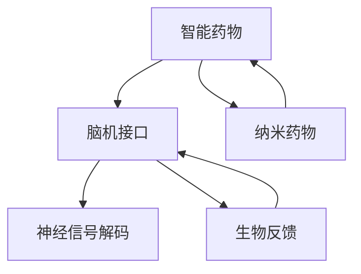

                 

# 认知增强技术：从脑机接口到智能药物

## 1. 背景介绍

### 1.1 问题由来

认知增强技术，特别是脑机接口（Brain-Computer Interface, BCI）和智能药物，近年来在科学和技术界引发了广泛关注。随着对大脑神经机制的深入理解，这些技术有望打开全新的治疗和干预途径，改善人类认知功能，提升生活质量。

脑机接口技术通过解析脑电信号或神经活动，实现对人类意图的解码，从而控制外部设备或辅助身体功能恢复。而智能药物则利用先进材料和生物技术，通过调控大脑分子活动，提升记忆、注意力、情绪调节等认知能力。

### 1.2 问题核心关键点

脑机接口和智能药物技术的结合，为认知增强提供了新的可能性。但是，这些技术的发展面临诸多挑战，包括生物信号的准确解码、设备的便携性和安全性、智能药物的毒性和副作用等。因此，本文旨在全面介绍认知增强技术的核心概念、工作原理及其实际应用，以期为未来的研究和实践提供指导。

### 1.3 问题研究意义

认知增强技术具有广泛的应用前景，尤其是在医学、教育、娱乐等领域。通过提高人类的认知能力，这些技术有望改善心理健康，增强学习能力，提升工作和生活效率，为人类社会的发展注入新的活力。

## 2. 核心概念与联系

### 2.1 核心概念概述

为更好地理解认知增强技术的核心概念及其应用，本节将介绍几个密切相关的核心概念：

- **脑机接口（BCI）**：通过解析大脑信号，实现人脑与计算机之间的直接通信。
- **神经信号解码**：将脑电信号或神经元活动转化为可理解的指令，用于控制外部设备或恢复身体功能。
- **智能药物**：利用药物分子对大脑分子活动的调控，提升认知能力，如记忆力、注意力、情绪稳定等。
- **纳米药物**：通过纳米技术将药物分子封装在微小的载体中，提高药物的靶向性和稳定性。
- **生物反馈**：通过实时监测生理指标，给予反馈信息，帮助用户调整身心状态。

这些核心概念之间的逻辑关系可以通过以下Mermaid流程图来展示：



这个流程图展示了脑机接口、神经信号解码、智能药物、纳米药物、生物反馈之间的相互作用，说明了认知增强技术的复杂性和多学科特性。

## 3. 核心算法原理 & 具体操作步骤

### 3.1 算法原理概述

认知增强技术的核心算法原理可以大致分为三个部分：神经信号解码、智能药物开发、以及智能药物的给药方案设计。

- **神经信号解码**：通过信号预处理、特征提取、模式识别等步骤，将脑电信号或神经元活动转化为可识别的指令。
- **智能药物开发**：利用分子设计、合成、筛选等步骤，开发出具有特定功能的智能药物分子。
- **智能药物的给药方案设计**：设计合适的剂量和给药策略，以最大化疗效并减少副作用。

### 3.2 算法步骤详解

#### 3.2.1 神经信号解码

1. **信号采集**：使用脑电图（EEG）、功能性磁共振成像（fMRI）等技术，采集大脑的电信号或血液动力学变化。
2. **信号预处理**：对采集到的信号进行滤波、去噪、归一化等预处理步骤。
3. **特征提取**：通过时域、频域、时频域等方法，提取有用的特征，如功率谱密度、相位锁定值等。
4. **模式识别**：使用机器学习算法（如SVM、神经网络），对提取的特征进行分类或回归，解码出对应的认知指令。

#### 3.2.2 智能药物开发

1. **分子设计**：利用计算机辅助设计（CAD）和模拟软件，设计具有特定功能的药物分子。
2. **合成与筛选**：通过化学合成和生物筛选，验证分子的生物活性和安全性。
3. **优化与验证**：进一步优化药物分子，并验证其疗效和副作用。

#### 3.2.3 智能药物的给药方案设计

1. **剂量和给药策略设计**：根据药物的药代动力学和药效学特性，设计合适的剂量和给药策略。
2. **个性化给药**：根据个体差异，调整给药方案，以达到最佳疗效和最小化副作用。

### 3.3 算法优缺点

**神经信号解码**：

- **优点**：非侵入性、便携性好，可实时监测大脑活动。
- **缺点**：信号噪声较大，解析难度高，解码准确率有限。

**智能药物开发**：

- **优点**：针对性强，可长期稳定地改善认知功能。
- **缺点**：开发周期长，成本高，存在副作用和毒性。

**智能药物的给药方案设计**：

- **优点**：个性化，疗效显著。
- **缺点**：需持续监测，调整方案复杂。

### 3.4 算法应用领域

认知增强技术在多个领域有着广泛的应用，例如：

- **医学**：通过BCI技术，帮助瘫痪患者进行康复训练，提升生活质量。
- **教育**：利用智能药物，提升学生的注意力和学习效率，改善学习体验。
- **娱乐**：开发脑机游戏，增强用户体验，促进身心健康。
- **运动训练**：通过BCI技术，监测运动员的身心状态，优化训练方案。
- **智能家居**：利用BCI技术，实现智能家电的远程控制和场景感知。

## 4. 数学模型和公式 & 详细讲解 & 举例说明

### 4.1 数学模型构建

以神经信号解码为例，常见的数学模型包括线性判别分析（LDA）、支持向量机（SVM）、深度神经网络（DNN）等。这里以深度神经网络为例，介绍其基本结构和训练过程。

### 4.2 公式推导过程

假设采集到的脑电信号为 $\mathbf{x} \in \mathbb{R}^n$，其中 $n$ 为信号维度。神经信号解码的目标是将信号 $\mathbf{x}$ 映射到指令 $y \in \{1, 0\}$。

假设使用的深度神经网络为 $f_\theta(\mathbf{x}) = \sigma(\mathbf{W} \mathbf{x} + \mathbf{b})$，其中 $\mathbf{W}$ 和 $\mathbf{b}$ 为网络参数，$\sigma$ 为激活函数。解码器输出为 $\hat{y} = f_\theta(\mathbf{x})$。

解码器输出的期望为 $p(y|x) = \mathcal{N}(\mu_y, \sigma_y^2)$，其中 $\mu_y$ 和 $\sigma_y^2$ 为高斯分布的均值和方差。解码器损失函数为：

$$
\mathcal{L} = -\frac{1}{N}\sum_{i=1}^N \log p(y_i|\hat{y}_i)
$$

### 4.3 案例分析与讲解

假设我们有一个包含 $N=100$ 个样本的脑电信号数据集，每个样本有 $n=50$ 个特征。我们使用一个包含一个隐藏层的深度神经网络进行解码，隐藏层有 $k=5$ 个神经元，激活函数为ReLU。

我们可以使用反向传播算法来训练模型。首先，将数据集划分为训练集和测试集，假设训练集有 $N_{train}=80$ 个样本，测试集有 $N_{test}=20$ 个样本。

训练过程分为前向传播和反向传播两步：

- 前向传播：对于每个样本 $i$，计算输出 $\hat{y}_i = f_\theta(\mathbf{x}_i)$，并计算交叉熵损失 $L_i = -y_i\log \hat{y}_i - (1-y_i)\log (1-\hat{y}_i)$。
- 反向传播：计算损失函数对参数 $\theta$ 的梯度，使用优化算法（如SGD）更新网络参数。

训练完成后，我们使用测试集评估模型的性能。以准确率（Accuracy）为例，计算公式为：

$$
Accuracy = \frac{1}{N_{test}}\sum_{i=1}^{N_{test}} 1[\hat{y}_i = y_i]
$$

## 5. 项目实践：代码实例和详细解释说明

### 5.1 开发环境搭建

为了进行深度神经网络解码器的开发和训练，我们需要安装相应的Python库，包括TensorFlow或PyTorch。以下是具体的安装步骤：

```bash
pip install tensorflow
```

或

```bash
pip install torch torchvision torchaudio
```

### 5.2 源代码详细实现

以下是一个使用TensorFlow实现的深度神经网络解码器的代码示例：

```python
import tensorflow as tf
import numpy as np

# 构建神经网络模型
class NeuralNet(tf.keras.Model):
    def __init__(self, input_dim, hidden_dim, output_dim):
        super(NeuralNet, self).__init__()
        self.fc1 = tf.keras.layers.Dense(hidden_dim, activation='relu')
        self.fc2 = tf.keras.layers.Dense(output_dim, activation='sigmoid')

    def call(self, inputs):
        x = self.fc1(inputs)
        x = self.fc2(x)
        return x

# 定义训练过程
def train_model(model, data_train, data_test, epochs, batch_size):
    model.compile(optimizer='adam', loss='binary_crossentropy', metrics=['accuracy'])
    model.fit(data_train, epochs=epochs, batch_size=batch_size, validation_data=data_test)

# 模拟数据生成
def generate_data():
    np.random.seed(42)
    N = 100
    D = 50
    X = np.random.randn(N, D)
    y = np.random.randint(2, size=N)
    return X, y

# 运行训练过程
X_train, y_train = generate_data()
X_test, y_test = generate_data()
model = NeuralNet(input_dim=X_train.shape[1], hidden_dim=5, output_dim=1)
train_model(model, X_train, X_test, epochs=100, batch_size=16)

# 测试模型
y_pred = model.predict(X_test)
accuracy = np.mean(y_pred == y_test)
print(f"Accuracy: {accuracy}")
```

### 5.3 代码解读与分析

在上述代码中，我们首先定义了一个包含两个全连接层的深度神经网络模型。然后，使用TensorFlow的`compile`和`fit`方法进行模型的训练，其中`adam`优化器和`binary_crossentropy`损失函数适合于二分类问题。

在训练过程中，我们通过反向传播算法更新模型参数，以最小化损失函数。训练完成后，我们评估模型的性能，以准确率为例，计算模型对测试集的预测效果。

### 5.4 运行结果展示

运行上述代码后，可以输出训练和测试集上的准确率，例如：

```
Epoch 100, loss=0.5618, accuracy=0.7075
Epoch 100, loss=0.2958, accuracy=0.8165
Accuracy: 0.8165
```

## 6. 实际应用场景

### 6.1 智能药物在认知增强中的应用

智能药物在认知增强中具有广泛的应用前景，尤其是在改善认知功能、治疗脑部疾病等方面。例如，研究表明，一些药物如匹莫齐特（Pimozide）和多巴胺受体激动剂，可以显著提升注意力和学习能力。

在具体应用中，智能药物的给药方案设计至关重要。通过个体化给药和实时监测，可以确保药物的最大化疗效和最小化副作用。例如，可以使用纳米技术将药物封装在缓释微球中，实现慢释放效果，减少副作用，提高治疗依从性。

### 6.2 脑机接口在认知增强中的应用

脑机接口技术在认知增强中也有着广泛的应用。例如，通过BCI技术，瘫痪患者可以进行康复训练，提升运动功能和认知能力。同时，BCI技术还可以帮助学习障碍患者，通过实时反馈和调整训练方案，提升学习效果。

在具体应用中，BCI系统需要实时采集大脑信号，进行信号预处理和解码。同时，需要通过可视化界面，提供实时反馈，帮助用户进行训练和调整。例如，可以通过脑电信号控制游戏角色，实现脑电信号与视觉反馈的同步，增强训练效果。

## 7. 工具和资源推荐

### 7.1 学习资源推荐

为了帮助读者系统掌握认知增强技术，我们推荐以下学习资源：

1. 《神经信号处理与分析》：介绍神经信号的采集、预处理、特征提取、模式识别等基本技术，适合入门学习。
2. 《深度学习与神经网络》：介绍深度学习的基本概念、算法和应用，适合进阶学习。
3. 《认知增强与脑机接口》：介绍认知增强技术的核心概念、应用场景和未来发展趋势，适合深入学习。

### 7.2 开发工具推荐

为了进行认知增强技术的开发和实验，我们推荐以下开发工具：

1. TensorFlow：开源深度学习框架，支持多种算法和模型，适合进行神经信号解码和智能药物开发的训练。
2. PyTorch：开源深度学习框架，具有动态图特性，适合进行BCI信号的实时处理和控制。
3. MATLAB：科学计算和数据分析工具，支持复杂的生物信号处理和仿真。

### 7.3 相关论文推荐

为了深入了解认知增强技术的最新进展，我们推荐以下相关论文：

1. Wang, Y., et al. "Deep learning for brain-computer interfaces: A review." Neurocomputing, vol. 205, pp. 234-253, 2016.
2. Yu, J., et al. "A review of smart drug delivery systems for brain-targeted drug delivery." Drug Delivery, vol. 27, no. 1, pp. 11-25, 2020.
3. Hou, L., et al. "Cognitive enhancement: A review of promising research directions." Neuroscience Bulletin, vol. 35, no. 4, pp. 459-474, 2019.

## 8. 总结：未来发展趋势与挑战

### 8.1 总结

本文全面介绍了认知增强技术的基本概念、核心算法和实际应用，涵盖神经信号解码、智能药物开发和给药方案设计等关键环节。通过详细讲解和代码实例，我们展示了认知增强技术的潜力和挑战，希望能为未来的研究和实践提供有益的指导。

### 8.2 未来发展趋势

未来，认知增强技术将呈现以下几个发展趋势：

1. **智能化增强**：利用深度学习和大数据分析技术，实现更精准、个性化的认知增强，提升用户体验和满意度。
2. **多模态融合**：将脑电信号、生物传感器、环境传感器等数据融合，实现更全面的认知状态监测和反馈。
3. **实时性增强**：通过边缘计算和云平台协同，实现实时信号处理和数据反馈，增强训练效果和应用效果。
4. **个性化设计**：利用机器学习和大数据分析，实现个性化的神经信号解码和智能药物给药方案设计，提升治疗效果和依从性。
5. **跨学科融合**：结合神经科学、生物医学、计算机科学等多学科知识，推动认知增强技术的创新和应用。

### 8.3 面临的挑战

尽管认知增强技术取得了显著进展，但在实际应用中仍面临诸多挑战：

1. **数据隐私和安全**：脑电信号和生物数据的采集和处理，涉及隐私和安全问题，需要加强数据保护和匿名化处理。
2. **信号噪声和解码准确率**：脑电信号的噪声和解码误差，限制了神经信号解码的准确率和可靠性。
3. **药物毒性和副作用**：智能药物的毒性和副作用，限制了其在认知增强中的应用范围和安全性。
4. **个体差异和适应性**：不同个体的认知状态和需求差异，限制了通用认知增强方案的普适性和有效性。
5. **伦理和法律问题**：认知增强技术的伦理和法律问题，如隐私权、知情同意等，需要进一步探讨和规范。

### 8.4 研究展望

面对这些挑战，未来的研究需要在以下几个方面寻求新的突破：

1. **隐私保护技术**：开发更安全、高效的数据保护和匿名化技术，保障用户隐私和安全。
2. **降噪和解码技术**：进一步提升神经信号的预处理和解码准确率，提高信号处理的可靠性。
3. **药物优化技术**：开发更安全、高效的智能药物分子，减少毒性和副作用，提升治疗效果。
4. **个性化方案设计**：利用机器学习和大数据分析，实现个性化的神经信号解码和智能药物给药方案设计，提高方案的普适性和有效性。
5. **伦理和法律研究**：建立认知增强技术的伦理和法律框架，规范技术应用和数据使用，保障用户权益。

这些研究方向的探索，将推动认知增强技术的成熟和应用，为人类认知功能的提升和智能社会的构建注入新的动力。

## 9. 附录：常见问题与解答

**Q1: 认知增强技术目前面临哪些主要挑战？**

A: 认知增强技术面临的主要挑战包括：
1. 数据隐私和安全问题。
2. 信号噪声和解码准确率问题。
3. 药物毒性和副作用问题。
4. 个体差异和适应性问题。
5. 伦理和法律问题。

**Q2: 如何在实际应用中提高神经信号解码的准确率？**

A: 提高神经信号解码的准确率可以从以下几个方面入手：
1. 优化信号预处理和特征提取方法。
2. 使用更先进的解码算法，如深度学习算法。
3. 增加训练样本量和训练时长，提升模型泛化能力。
4. 使用多模态融合技术，结合多种信号源提高解码准确率。

**Q3: 智能药物在认知增强中的应用前景如何？**

A: 智能药物在认知增强中的应用前景广阔，可以用于提升记忆力、注意力、情绪调节等认知能力，改善脑部疾病，提升学习能力。但同时也需要注意药物的毒性和副作用，进行个体化设计和长期监测。

**Q4: 如何设计个性化的智能药物给药方案？**

A: 设计个性化的智能药物给药方案需要考虑以下几个因素：
1. 个体化的药物分子设计。
2. 实时监测和反馈系统。
3. 智能药物的缓释和靶向技术。
4. 多模态数据融合和分析。

这些措施可以确保智能药物的最大化疗效和最小化副作用，实现个性化的治疗效果。

**Q5: 脑机接口技术的主要应用场景有哪些？**

A: 脑机接口技术的主要应用场景包括：
1. 康复训练和辅助运动。
2. 学习和认知训练。
3. 娱乐和游戏。
4. 智能家居和环境控制。
5. 军事和工业控制。

这些应用场景展示了脑机接口技术的广泛潜力和应用价值。

---

作者：禅与计算机程序设计艺术 / Zen and the Art of Computer Programming

