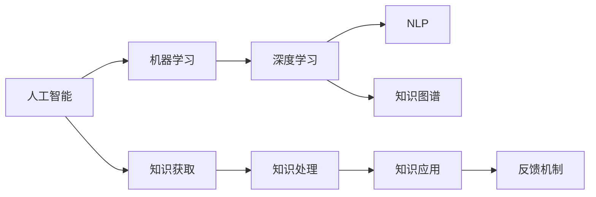

                 

# 认知革命：AI时代的知识获取新范式

> 关键词：认知革命,知识获取,人工智能,机器学习,深度学习,大数据,智能搜索

## 1. 背景介绍

### 1.1 问题由来

随着科技的迅猛发展和信息时代的到来，人类知识的总量呈现爆炸式增长。据统计，人类知识总量每2.5年翻一番。然而，面对庞大的知识体系，传统教育体系已难以承担普及知识的重任。信息过载、知识碎片化、学习负担加重等问题亟待解决。

如何从浩如烟海的知识海洋中迅速获取、整合、应用知识，成为迫切需要解决的问题。人工智能（AI）技术的崛起，为这一问题带来了新的解决思路。AI技术，尤其是机器学习和深度学习，能够帮助人们高效、准确地从海量数据中提取出有价值的信息，从而实现知识获取的自动化、智能化。

### 1.2 问题核心关键点

本节将介绍认知革命的核心概念及其与人工智能技术的联系。认知革命是指通过AI技术实现认知的突破，即在知识获取、处理和应用过程中，超越人类现有认知能力，达到更加高效、精准和全面。这一过程主要包括三个关键步骤：

- **知识获取**：从各种数据源（如书籍、网页、论文、视频等）中快速、准确地提取有用信息。
- **知识处理**：通过算法和模型对获取到的信息进行加工、整合、分析，形成结构化知识库。
- **知识应用**：将处理后的知识应用于决策、推理、创新等实际任务中，实现知识价值的最大化。

人工智能技术通过强大的算法和模型，能够自动完成上述过程，极大地提升知识获取的效率和质量。本文将重点探讨AI时代下的知识获取新范式，帮助读者掌握认知革命的关键技术和方法。

## 2. 核心概念与联系

### 2.1 核心概念概述

认知革命的核心在于利用AI技术，实现知识获取和处理的自动化和智能化。其核心概念包括：

- **人工智能**：通过模拟人类智能，使机器能够自动执行复杂任务，包括感知、理解、学习、推理和决策等。
- **机器学习**：通过算法让机器从数据中学习，不断提高其在特定任务上的性能。
- **深度学习**：一种特殊的机器学习算法，通过多层次的神经网络实现对数据的高效提取和处理。
- **自然语言处理（NLP）**：使机器能够理解、处理和生成自然语言，从而实现与人类语言的无缝交互。
- **知识图谱**：一种结构化的知识表示方法，通过节点和边连接实体及其关系，构建知识网络。

这些概念之间存在着紧密的联系，共同构成了认知革命的技术基础。

### 2.2 核心概念原理和架构的 Mermaid 流程图



该流程图展示了认知革命中各个概念之间的逻辑关系：

1. 人工智能是认知革命的总体框架，涵盖了机器学习、深度学习、NLP、知识图谱等核心技术。
2. 机器学习是实现人工智能的关键技术，通过数据驱动的算法实现知识获取和处理。
3. 深度学习是机器学习的高级形式，通过多层次神经网络实现对数据的深度理解。
4. NLP使机器能够处理自然语言，实现与人类语言的交互。
5. 知识图谱将知识表示为结构化的网络，便于机器理解和应用。
6. 知识获取、处理和应用构成认知革命的主要流程，通过反馈机制不断优化和改进。

## 3. 核心算法原理 & 具体操作步骤

### 3.1 算法原理概述

认知革命中的知识获取主要依赖于深度学习模型和大数据技术。其核心算法包括：

- **卷积神经网络（CNN）**：用于处理图像、文本等结构化数据，提取特征和模式。
- **循环神经网络（RNN）**：用于处理序列数据，如时间序列、文本序列等。
- **自注意力机制**：通过关注输入序列中不同位置的信息，实现对序列的高效编码和表示。
- **Transformer**：一种基于自注意力机制的神经网络结构，用于处理多模态数据，具有较强的并行处理能力。

这些算法通过深度学习模型对大规模数据进行处理和分析，自动提取有用信息，为后续的知识处理和应用奠定基础。

### 3.2 算法步骤详解

认知革命中的知识获取大致分为以下几个步骤：

1. **数据采集**：从各种数据源中收集原始数据，如书籍、网页、论文、视频等。
2. **数据预处理**：清洗、归一化、标注数据，使其符合深度学习模型的输入要求。
3. **特征提取**：使用CNN、RNN、Transformer等深度学习模型，提取数据中的有用特征和模式。
4. **知识表示**：将提取到的特征和模式转换为结构化的知识表示，如向量、图谱等。
5. **知识存储**：将处理后的知识存储到知识库中，便于后续的应用和检索。
6. **模型训练**：通过大规模标注数据，训练深度学习模型，提升知识获取的准确性和效率。

### 3.3 算法优缺点

深度学习模型在知识获取中具有以下优点：

- **高效性**：能够自动从大规模数据中提取有用信息，无需人工标注。
- **准确性**：通过学习大量数据，深度学习模型能够自适应不同的数据分布，准确性较高。
- **可扩展性**：适用于多种数据类型，包括文本、图像、视频等，具有较强的泛化能力。

然而，深度学习模型也存在一些缺点：

- **数据依赖性强**：需要大量标注数据进行训练，数据质量对模型性能影响较大。
- **模型复杂度高**：深度学习模型参数量巨大，训练和推理速度较慢。
- **解释性差**：深度学习模型的决策过程难以解释，缺乏透明度。

### 3.4 算法应用领域

深度学习模型在知识获取中的应用领域非常广泛，涵盖了以下几个方面：

- **信息检索**：通过文本匹配技术，从大量数据中快速找到相关信息。
- **文本分类**：将文本数据分类到不同的类别中，如新闻分类、情感分析等。
- **图像识别**：从图像中识别出物体、场景等，并进行标注和分类。
- **视频分析**：对视频数据进行关键帧提取、行为识别等处理，提取有用信息。
- **语音识别**：将语音数据转换为文本，进行语音到文本的转换。

## 4. 数学模型和公式 & 详细讲解 & 举例说明

### 4.1 数学模型构建

在认知革命中，深度学习模型的构建通常包括以下几个步骤：

1. **模型选择**：根据任务类型选择合适的深度学习模型，如CNN、RNN、Transformer等。
2. **网络设计**：设计多层次的神经网络结构，定义每个层的输入、输出和激活函数。
3. **损失函数**：定义模型预测与真实标签之间的损失函数，用于衡量模型的预测误差。
4. **优化器**：选择适当的优化算法，如Adam、SGD等，用于更新模型参数。

### 4.2 公式推导过程

以卷积神经网络（CNN）为例，其核心公式如下：

$$
f(x) = \sum_{i=1}^k w_i g(x \ast h_i) + b
$$

其中 $f(x)$ 表示卷积核的输出，$x$ 为输入数据，$w_i$ 为卷积核权重，$g$ 为激活函数，$h_i$ 为滤波器，$b$ 为偏置项。

通过卷积操作，CNN能够自动提取输入数据中的局部特征，实现对数据的高效表示。

### 4.3 案例分析与讲解

假设有一个文本分类任务，目标是将新闻文章分为政治、体育、娱乐三类。使用CNN模型进行处理，其输入为文章文本，输出为三类标签的概率分布。通过训练，模型能够自动学习文本中的关键词和短语，并根据这些特征进行分类。

## 5. 项目实践：代码实例和详细解释说明

### 5.1 开发环境搭建

要实现认知革命中的知识获取，需要搭建相应的开发环境。以下是使用Python和TensorFlow进行开发的流程：

1. **安装Python和TensorFlow**：
   ```bash
   pip install tensorflow
   ```

2. **创建Python虚拟环境**：
   ```bash
   conda create --name myenv python=3.7
   conda activate myenv
   ```

3. **安装必要的库**：
   ```bash
   pip install numpy scipy matplotlib pandas scikit-learn
   ```

### 5.2 源代码详细实现

以下是一个简单的文本分类项目的代码实现，用于展示如何使用CNN模型进行文本分类：

```python
import tensorflow as tf
from tensorflow.keras.layers import Input, Embedding, Conv1D, GlobalMaxPooling1D, Dense
from tensorflow.keras.models import Model
from tensorflow.keras.preprocessing.text import Tokenizer
from tensorflow.keras.preprocessing.sequence import pad_sequences

# 加载数据
input_data = ['This is a sample text for testing', 'Another sample text', 'Third sample text']
labels = [0, 1, 2]  # 三分类任务

# 数据预处理
tokenizer = Tokenizer(num_words=10000)
tokenizer.fit_on_texts(input_data)
sequences = tokenizer.texts_to_sequences(input_data)
padded_sequences = pad_sequences(sequences, maxlen=10)

# 构建模型
input_layer = Input(shape=(10,))
embedding_layer = Embedding(10000, 16)(input_layer)
conv_layer = Conv1D(32, 3, activation='relu')(embedding_layer)
pooling_layer = GlobalMaxPooling1D()(conv_layer)
output_layer = Dense(3, activation='softmax')(pooling_layer)

model = Model(inputs=input_layer, outputs=output_layer)
model.compile(loss='categorical_crossentropy', optimizer='adam', metrics=['accuracy'])

# 训练模型
model.fit(padded_sequences, tf.keras.utils.to_categorical(labels), epochs=10, batch_size=16)
```

### 5.3 代码解读与分析

- **数据加载与预处理**：使用TensorFlow的Tokenizer将文本转换为数字序列，并进行填充处理，确保所有输入序列长度一致。
- **模型构建**：使用CNN模型处理输入的文本序列，通过卷积层和池化层提取特征，最后通过全连接层输出三类标签的概率分布。
- **模型训练**：使用交叉熵损失函数和Adam优化器，在数据集上进行模型训练。

## 6. 实际应用场景

### 6.1 智能问答系统

智能问答系统是认知革命中知识获取的重要应用场景。通过深度学习模型和大数据技术，智能问答系统能够快速响应用户问题，提供准确、有用的答案。

例如，某电商平台希望构建一个智能客服系统，用于回答用户常见问题。该系统通过采集大量的客户咨询记录，使用NLP技术进行预处理和分析，构建了一个基于BERT的问答模型。模型能够自动理解用户输入，从知识库中检索出最相关的信息，并生成回答。

### 6.2 智能推荐系统

智能推荐系统也是知识获取的重要应用场景。通过深度学习模型和知识图谱技术，推荐系统能够自动分析用户的行为数据和兴趣偏好，生成个性化的推荐内容。

例如，某视频网站希望通过推荐系统提高用户留存率。该系统使用深度学习模型对用户行为数据进行特征提取和分析，构建了一个基于GRU的推荐模型。模型能够自动学习用户的历史行为和偏好，并根据知识图谱中的信息生成推荐结果。

### 6.3 知识图谱构建

知识图谱是认知革命中知识处理的重要组成部分，通过结构化的方式表示知识，便于机器理解和应用。

例如，某知识图谱构建项目需要从大量的百科全书、学术论文等数据源中抽取实体和关系，构建知识图谱。项目组使用深度学习模型和自然语言处理技术，从文本中自动提取实体和关系，并进行实体消歧和关系分类。最终构建了一个包含数百万个实体的知识图谱，用于支持各种智能应用。

## 7. 工具和资源推荐

### 7.1 学习资源推荐

要深入理解认知革命中的知识获取技术，以下是一些推荐的资源：

1. **《深度学习》书籍**：由Ian Goodfellow等著，介绍了深度学习的基本原理和应用，适合初学者和进阶者阅读。
2. **《自然语言处理综论》书籍**：由Daniel Jurafsky等著，涵盖了NLP的基本概念和技术，适合了解NLP基础知识。
3. **Coursera自然语言处理课程**：由斯坦福大学和IBM联合开设，涵盖了NLP的基本概念、技术和应用。
4. **Kaggle深度学习竞赛**：Kaggle平台上有许多深度学习竞赛，通过实践项目，可以快速提升技能。

### 7.2 开发工具推荐

开发深度学习模型和知识获取系统，需要使用一些专业的工具：

1. **TensorFlow**：由Google开源的深度学习框架，功能强大，易于使用，适合各种规模的项目。
2. **PyTorch**：由Facebook开源的深度学习框架，灵活性高，适合研究和实验。
3. **Jupyter Notebook**：用于编写和运行Python代码，适合快速迭代和实验。
4. **TensorBoard**：用于可视化深度学习模型的训练过程和结果，便于调试和优化。

### 7.3 相关论文推荐

为了深入了解认知革命中的知识获取技术，以下是一些推荐的论文：

1. **《Attention is All You Need》论文**：由Google等机构发表，提出Transformer结构，开启了大规模预训练语言模型时代。
2. **《BERT: Pre-training of Deep Bidirectional Transformers for Language Understanding》论文**：由Google等机构发表，提出BERT模型，通过自监督预训练任务提升模型性能。
3. **《Knowledge Graph Embeddings and Their Application to Recommender Systems》论文**：由腾讯等机构发表，探讨了知识图谱在推荐系统中的应用。
4. **《A Survey on Deep Learning for Natural Language Processing》论文**：由Vanderbilt University等机构发表，全面综述了深度学习在NLP中的应用。

## 8. 总结：未来发展趋势与挑战

### 8.1 研究成果总结

认知革命中的知识获取技术在过去几年中取得了显著的进展，主要体现在以下几个方面：

- **模型规模不断扩大**：深度学习模型的参数量不断增加，处理能力不断增强。
- **数据来源更加多样化**：除了传统的文本和图像数据，视频、音频等多模态数据也得到了广泛应用。
- **应用场景更加丰富**：智能问答、推荐系统、知识图谱等应用场景不断涌现，推动了认知革命的发展。

### 8.2 未来发展趋势

未来，认知革命中的知识获取技术将呈现以下几个发展趋势：

1. **多模态融合**：将文本、图像、视频等多种数据类型融合，实现多模态知识获取。
2. **自监督学习**：通过无监督学习方式，从非标注数据中提取有用信息，提高知识获取的效率和质量。
3. **知识图谱深化**：构建更复杂、更丰富的知识图谱，实现更加深入的推理和应用。
4. **分布式计算**：采用分布式计算技术，提升知识获取的计算能力和处理速度。
5. **可解释性增强**：提高模型的透明度和可解释性，便于人工理解和调试。

### 8.3 面临的挑战

尽管认知革命中的知识获取技术取得了显著进展，但仍面临一些挑战：

1. **数据质量问题**：数据标注的准确性和多样性对模型的性能有重要影响，需要投入大量人力和时间进行数据清洗和标注。
2. **模型复杂度问题**：深度学习模型参数量巨大，训练和推理速度较慢，需要优化算法和硬件配置。
3. **隐私和安全问题**：在知识获取过程中，需要保护用户的隐私和数据安全，防止数据泄露和滥用。

### 8.4 研究展望

未来，认知革命中的知识获取技术需要在以下几个方面进行深入研究：

1. **自监督学习技术**：研究无监督和半监督学习方式，降低对标注数据的依赖，提高知识获取的效率。
2. **知识融合技术**：研究如何更好地融合多种数据类型，实现多模态知识获取和应用。
3. **模型可解释性技术**：研究提高模型的透明度和可解释性，便于人工理解和调试。
4. **隐私保护技术**：研究如何保护用户的隐私和数据安全，防止数据泄露和滥用。

通过持续的技术创新和突破，认知革命中的知识获取技术必将迈向更加智能化、高效化、普适化的发展方向，为人工智能技术的应用带来新的突破和机遇。

## 9. 附录：常见问题与解答

**Q1: 深度学习模型在知识获取中是否适用于所有数据类型？**

A: 深度学习模型在处理图像、文本等结构化数据时表现良好，但对于非结构化数据（如音频、视频等），需要先进行预处理和转换，才能有效地提取特征。

**Q2: 如何选择合适的深度学习模型？**

A: 选择合适的深度学习模型需要考虑数据类型、任务需求等因素。对于图像数据，CNN模型表现较好；对于序列数据，RNN和Transformer模型表现较好。

**Q3: 数据预处理过程中需要注意哪些问题？**

A: 数据预处理是深度学习模型成功的关键。需要注意去除噪声、归一化、填充等操作，确保输入数据的一致性和有效性。

**Q4: 如何评估深度学习模型的性能？**

A: 评估深度学习模型通常使用精度、召回率、F1值等指标。此外，还可以通过混淆矩阵、ROC曲线等方法进行可视化分析。

**Q5: 深度学习模型在实际应用中需要注意哪些问题？**

A: 在实际应用中，深度学习模型需要考虑模型的可解释性、隐私保护、资源消耗等问题。需要在算法和工程层面进行优化和改进。

通过以上系统地介绍认知革命中的知识获取技术，希望能帮助读者掌握深度学习在知识获取中的应用，为未来的人工智能发展提供新的思路和方向。

