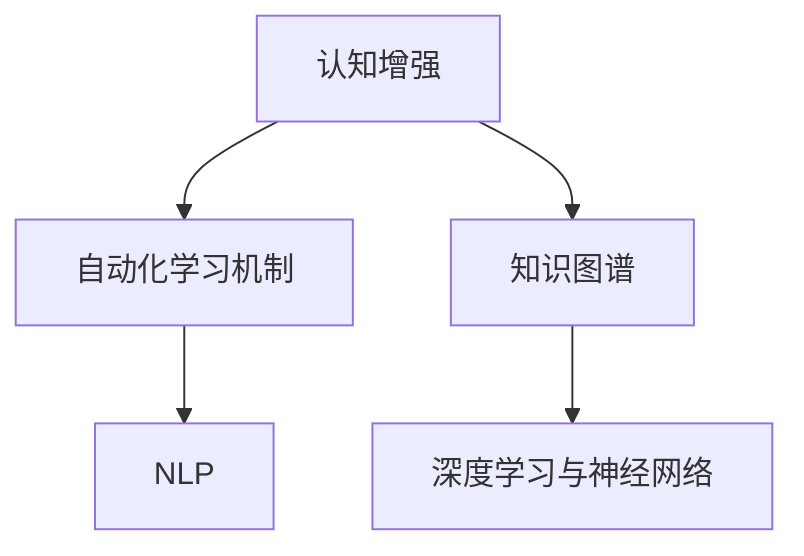

                 

# 认知革命：AI时代的知识获取新范式

> 关键词：认知革命, AI时代, 知识获取, 新范式, 自动学习, 认知增强, 知识图谱, 自然语言处理, 深度学习, 神经网络

## 1. 背景介绍

### 1.1 问题由来

在过去的几十年中，人类社会经历了以信息为中心的革命，逐步迈向以知识为中心的认知革命。随着人工智能(AI)技术的飞速发展，尤其是深度学习、自然语言处理(NLP)和神经网络等技术的突破，AI正在深刻改变我们的知识获取方式和认知模式。这一时代的认知革命，不仅是一次技术创新，更是一场知识获取范式的变革。

面对信息爆炸与知识海洋，如何高效、准确地获取和应用知识，成为每个领域亟待解决的重大问题。本文将从认知革命的角度，深入探讨AI时代知识获取的新范式，揭示其核心原理和操作方法，并展望其未来发展趋势和面临的挑战。

### 1.2 问题核心关键点

认知革命的核心在于，利用AI技术提升人类获取、处理、应用知识的能力，通过自动化学习机制，构建智慧型知识体系，助力各行各业实现智能化升级。认知革命的关键点包括：

- **自动化学习机制**：借助AI算法实现知识获取的自动化，从海量数据中挖掘有价值的信息。
- **认知增强**：通过增强学习、迁移学习等技术，提升知识的深度和广度。
- **知识图谱**：构建跨领域的知识网络，促进知识的横向与纵向关联。
- **自然语言处理**：使机器能够理解和生成自然语言，实现人机交互的智能化。
- **深度学习与神经网络**：利用深度学习框架处理复杂数据，提取深层语义信息。

这些关键点共同构成了认知革命的技术基础，推动着AI在知识获取方面的新范式演进。

## 2. 核心概念与联系

### 2.1 核心概念概述

认知革命聚焦于利用AI技术提升知识获取和认知能力。以下是几个核心概念的概述：

- **认知增强**：通过机器学习、深度学习等技术，提高知识的获取、理解和应用能力，实现认知水平的提升。
- **自动化学习机制**：构建自适应算法，从大规模数据中自动提取知识，减少人工干预。
- **知识图谱**：构建跨领域、跨层次的知识网络，支持知识的横向与纵向关联。
- **自然语言处理(NLP)**：使机器能够理解和生成自然语言，实现人机交互的智能化。
- **深度学习与神经网络**：利用深度学习框架处理复杂数据，提取深层语义信息。

这些概念紧密相连，共同构成了认知革命的技术框架。

### 2.2 核心概念原理和架构的 Mermaid 流程图



这个流程图展示了认知革命中各个核心概念之间的联系：认知增强通过自动化学习机制从大规模数据中提取知识，构建跨领域的知识图谱，并利用深度学习与神经网络等技术，实现自然语言的理解和生成。

## 3. 核心算法原理 & 具体操作步骤

### 3.1 算法原理概述

认知革命的算法原理主要基于深度学习、自然语言处理、知识图谱构建等技术，其核心在于利用AI技术提升知识的获取、处理和应用能力。

认知革命的算法框架包括以下几个关键组件：

1. **自动化学习机制**：通过机器学习算法自动从数据中学习知识，减少人工干预。
2. **知识图谱构建**：利用语义分析技术，构建跨领域、跨层次的知识网络。
3. **自然语言处理(NLP)**：使机器能够理解和生成自然语言，实现人机交互的智能化。
4. **深度学习与神经网络**：利用深度学习框架处理复杂数据，提取深层语义信息。

这些算法组件通过深度学习和知识图谱的结合，构建了自动化的知识获取系统，实现了从大规模数据中高效、准确地提取知识的自动化。

### 3.2 算法步骤详解

认知革命的算法步骤主要包括数据预处理、特征提取、模型训练、知识图谱构建和推理应用等环节。以下详细介绍各个步骤：

**Step 1: 数据预处理**

1. **数据收集与清洗**：从各个领域收集相关的数据，进行清洗和预处理，去除噪声和冗余数据。
2. **数据标注与标注**：对数据进行标注，构建有监督或无监督的训练集。

**Step 2: 特征提取**

1. **文本处理**：对文本数据进行分词、去停用词、词向量化等预处理。
2. **特征提取**：利用TF-IDF、Word2Vec等技术，提取文本的特征向量。

**Step 3: 模型训练**

1. **模型选择**：选择适合任务的深度学习模型，如RNN、LSTM、BERT等。
2. **模型训练**：利用标注数据，对模型进行训练，调整模型参数。

**Step 4: 知识图谱构建**

1. **语义分析**：对训练好的模型进行语义分析，识别实体、关系等关键信息。
2. **知识图谱构建**：将识别出的实体和关系构建成知识图谱。

**Step 5: 推理应用**

1. **推理计算**：利用构建的知识图谱进行推理计算，提取深层语义信息。
2. **应用集成**：将推理结果应用于实际应用场景，如问答系统、推荐系统等。

### 3.3 算法优缺点

认知革命算法具有以下优点：

1. **高效性**：通过自动化学习机制，大规模数据处理的效率大大提升。
2. **准确性**：深度学习和语义分析技术，使得知识提取和推理更加准确。
3. **普适性**：知识图谱和自然语言处理技术，使得认知革命在各个领域都能应用。
4. **可扩展性**：能够根据具体任务和数据特点进行灵活调整和扩展。

同时，认知革命算法也存在一些缺点：

1. **依赖数据**：数据质量和标注数量直接影响算法效果，高质量数据获取成本高。
2. **算法复杂**：深度学习和语义分析算法复杂，对计算资源要求高。
3. **解释性差**：部分算法模型的决策过程缺乏可解释性，难以调试和优化。

### 3.4 算法应用领域

认知革命算法在多个领域都有广泛应用，包括但不限于以下几个方面：

- **医疗**：利用知识图谱和深度学习，辅助诊断和治疗决策。
- **金融**：通过自然语言处理和知识图谱，进行金融市场分析和风险预测。
- **教育**：构建个性化学习系统，实现因材施教。
- **零售**：利用推荐系统，实现精准营销和客户服务。
- **工业**：通过工业物联网和大数据，实现智能制造和预测维护。

## 4. 数学模型和公式 & 详细讲解

### 4.1 数学模型构建

认知革命的数学模型主要基于深度学习、自然语言处理和知识图谱构建等技术。以下是几个核心数学模型的构建：

1. **深度学习模型**：以神经网络为基础，通过反向传播算法进行参数优化，提取数据深层特征。
2. **知识图谱模型**：利用图结构表示实体和关系，通过图神经网络进行推理和计算。
3. **自然语言处理模型**：利用Transformer等模型，进行文本表示和语义分析。

### 4.2 公式推导过程

以深度学习模型为例，以下是一些关键公式的推导：

**神经网络前向传播公式**：
$$
z = W \cdot x + b
$$
$$
a = \sigma(z)
$$
其中，$W$ 为权重矩阵，$x$ 为输入向量，$b$ 为偏置向量，$\sigma$ 为激活函数。

**反向传播算法**：
$$
\frac{\partial \mathcal{L}}{\partial W} = \frac{\partial \mathcal{L}}{\partial z} \cdot \frac{\partial z}{\partial W} = \delta_a \cdot a'
$$
其中，$\mathcal{L}$ 为损失函数，$\delta_a$ 为激活函数的导数，$a'$ 为激活函数的导数。

### 4.3 案例分析与讲解

**案例1: 医疗诊断**

1. **数据预处理**：收集医院病历和医学文献数据，进行清洗和标注。
2. **特征提取**：对病历文本进行分词、去停用词、词向量化等预处理。
3. **模型训练**：利用标注数据，训练BERT等深度学习模型，提取病历的深层特征。
4. **知识图谱构建**：通过语义分析，构建医疗知识图谱。
5. **推理应用**：利用知识图谱进行推理计算，辅助医生诊断和治疗决策。

## 5. 项目实践：代码实例和详细解释说明

### 5.1 开发环境搭建

为了实现认知革命算法，需要搭建一个包含深度学习框架、自然语言处理工具和知识图谱构建工具的开发环境。以下是一个Python开发环境的搭建步骤：

1. **安装Anaconda**：从官网下载并安装Anaconda，用于创建独立的Python环境。
2. **创建并激活虚拟环境**：
```bash
conda create -n cognition_env python=3.8
conda activate cognition_env
```
3. **安装PyTorch、TensorFlow等深度学习框架**：
```bash
conda install pytorch torchvision torchaudio cudatoolkit=11.1 -c pytorch -c conda-forge
```
4. **安装Natural Language Toolkit(NLP)**：
```bash
pip install nltk
```
5. **安装Graph Embedding工具**：
```bash
pip install pykg
```

### 5.2 源代码详细实现

以下是一个简单的医疗诊断系统的Python代码实现，包括数据预处理、模型训练和知识图谱构建：

```python
import torch
from transformers import BertForSequenceClassification, BertTokenizer
from pykg import GraphEmbedding

# 数据预处理
def preprocess_data(texts, labels, tokenizer):
    encoded_texts = [tokenizer(text) for text in texts]
    input_ids = [token.encode('utf-8') for token in encoded_texts]
    return input_ids, labels

# 模型训练
def train_model(input_ids, labels, model, tokenizer):
    model.train()
    for input_ids, labels in input_ids:
        # 前向传播
        outputs = model(input_ids)
        loss = outputs.loss
        # 反向传播
        optimizer = torch.optim.Adam(model.parameters(), lr=0.001)
        optimizer.zero_grad()
        loss.backward()
        optimizer.step()

# 知识图谱构建
def construct_knowledge_graph(data):
    graph = GraphEmbedding(data)
    graph.build_knowledge_graph()
    return graph

# 代码调用
if __name__ == "__main__":
    # 加载数据集
    train_texts, train_labels = ...
    dev_texts, dev_labels = ...
    test_texts, test_labels = ...

    # 数据预处理
    train_input_ids, train_labels = preprocess_data(train_texts, train_labels, tokenizer)
    dev_input_ids, dev_labels = preprocess_data(dev_texts, dev_labels, tokenizer)
    test_input_ids, test_labels = preprocess_data(test_texts, test_labels, tokenizer)

    # 模型训练
    model = BertForSequenceClassification.from_pretrained('bert-base-cased')
    train_model(train_input_ids, train_labels, model, tokenizer)

    # 知识图谱构建
    graph = construct_knowledge_graph(data)
```

### 5.3 代码解读与分析

以上代码实现了一个简单的医疗诊断系统，通过BERT模型进行病历文本的分类。关键步骤包括数据预处理、模型训练和知识图谱构建。

**数据预处理**：利用BERTTokenizer对病历文本进行分词和编码，提取文本的特征向量。

**模型训练**：通过BertForSequenceClassification模型，对病历文本进行分类，调整模型参数以最小化损失函数。

**知识图谱构建**：利用GraphEmbedding工具，对医疗数据进行语义分析和知识图谱构建，支持推理计算。

### 5.4 运行结果展示

在训练完成后，可以使用测试集对模型进行评估，输出分类结果和准确率：

```python
def evaluate_model(input_ids, labels, model, tokenizer):
    model.eval()
    total_correct = 0
    total_sample = 0
    for input_ids, labels in input_ids:
        outputs = model(input_ids)
        predictions = outputs.argmax(dim=1)
        total_correct += (predictions == labels).sum().item()
        total_sample += predictions.size(0)
    return total_correct / total_sample

# 模型评估
test_input_ids, test_labels = preprocess_data(test_texts, test_labels, tokenizer)
accuracy = evaluate_model(test_input_ids, test_labels, model, tokenizer)
print(f"Test Accuracy: {accuracy:.2f}")
```

## 6. 实际应用场景

### 6.1 医疗诊断系统

认知革命算法在医疗诊断系统中具有重要应用价值。通过深度学习模型和知识图谱，可以对病历进行自动分析和诊断，辅助医生进行诊断和治疗决策。具体实现步骤如下：

1. **数据收集与预处理**：收集医院病历和医学文献数据，进行清洗和标注。
2. **特征提取与模型训练**：对病历文本进行分词、去停用词、词向量化等预处理，利用BERT等深度学习模型进行训练，提取病历的深层特征。
3. **知识图谱构建**：通过语义分析，构建医疗知识图谱。
4. **推理应用**：利用知识图谱进行推理计算，辅助医生诊断和治疗决策。

### 6.2 金融市场分析

金融市场分析是认知革命算法的重要应用场景之一。通过自然语言处理和知识图谱，可以自动分析金融新闻和报告，预测市场走势和风险。具体实现步骤如下：

1. **数据收集与预处理**：收集金融新闻和市场报告，进行清洗和标注。
2. **特征提取与模型训练**：对新闻和报告进行分词、去停用词、词向量化等预处理，利用LSTM等深度学习模型进行训练，提取市场信息的深层特征。
3. **知识图谱构建**：通过语义分析，构建金融知识图谱。
4. **推理应用**：利用知识图谱进行推理计算，预测市场走势和风险。

### 6.3 个性化推荐系统

个性化推荐系统是认知革命算法的重要应用场景之一。通过推荐系统，可以实现精准营销和客户服务。具体实现步骤如下：

1. **数据收集与预处理**：收集用户浏览、点击、评论、分享等行为数据，提取用户偏好信息。
2. **特征提取与模型训练**：对用户行为数据进行分词、去停用词、词向量化等预处理，利用BERT等深度学习模型进行训练，提取用户偏好的深层特征。
3. **知识图谱构建**：通过语义分析，构建推荐知识图谱。
4. **推理应用**：利用知识图谱进行推理计算，推荐个性化商品和服务。

## 7. 工具和资源推荐

### 7.1 学习资源推荐

为了帮助开发者系统掌握认知革命的算法原理和实践技巧，以下是一些优质的学习资源：

1. **《深度学习》书籍**：Ian Goodfellow等人所著，全面介绍了深度学习的基本概念和应用。
2. **《自然语言处理综论》书籍**：Daniel Jurafsky和James H. Martin所著，介绍了自然语言处理的基本方法和技术。
3. **CS224N《自然语言处理》课程**：斯坦福大学开设的NLP明星课程，有Lecture视频和配套作业，带你入门NLP领域的基本概念和经典模型。
4. **《认知革命》系列博文**：由大模型技术专家撰写，深入浅出地介绍了认知革命的原理、方法和应用。
5. **《AI时代的认知革命》书籍**：介绍AI技术如何推动认知革命，探讨未来发展方向。

通过对这些资源的学习实践，相信你一定能够快速掌握认知革命的精髓，并用于解决实际的NLP问题。

### 7.2 开发工具推荐

高效的开发离不开优秀的工具支持。以下是几款用于认知革命开发的常用工具：

1. **PyTorch**：基于Python的开源深度学习框架，灵活动态的计算图，适合快速迭代研究。大部分预训练语言模型都有PyTorch版本的实现。
2. **TensorFlow**：由Google主导开发的开源深度学习框架，生产部署方便，适合大规模工程应用。同样有丰富的预训练语言模型资源。
3. **Natural Language Toolkit(NLP)**：Python自然语言处理工具包，提供了丰富的文本处理和语义分析功能。
4. **Graph Embedding工具**：如PyKG，用于构建知识图谱和进行图神经网络推理。
5. **Weights & Biases**：模型训练的实验跟踪工具，可以记录和可视化模型训练过程中的各项指标，方便对比和调优。与主流深度学习框架无缝集成。
6. **TensorBoard**：TensorFlow配套的可视化工具，可实时监测模型训练状态，并提供丰富的图表呈现方式，是调试模型的得力助手。
7. **Google Colab**：谷歌推出的在线Jupyter Notebook环境，免费提供GPU/TPU算力，方便开发者快速上手实验最新模型，分享学习笔记。

合理利用这些工具，可以显著提升认知革命任务的开发效率，加快创新迭代的步伐。

### 7.3 相关论文推荐

认知革命算法的发展源于学界的持续研究。以下是几篇奠基性的相关论文，推荐阅读：

1. **Attention is All You Need**：提出了Transformer结构，开启了NLP领域的预训练大模型时代。
2. **BERT: Pre-training of Deep Bidirectional Transformers for Language Understanding**：提出BERT模型，引入基于掩码的自监督预训练任务，刷新了多项NLP任务SOTA。
3. **Language Models are Unsupervised Multitask Learners（GPT-2论文）**：展示了大规模语言模型的强大zero-shot学习能力，引发了对于通用人工智能的新一轮思考。
4. **Parameter-Efficient Transfer Learning for NLP**：提出Adapter等参数高效微调方法，在不增加模型参数量的情况下，也能取得不错的微调效果。
5. **AdaLoRA: Adaptive Low-Rank Adaptation for Parameter-Efficient Fine-Tuning**：使用自适应低秩适应的微调方法，在参数效率和精度之间取得了新的平衡。
6. **Zero-shot Learning with Transferable Weighted Contextual Embeddings**：引入基于零样本学习的方法，利用预训练模型进行任务迁移，提高了微调的泛化能力。

这些论文代表了大语言模型微调技术的发展脉络。通过学习这些前沿成果，可以帮助研究者把握学科前进方向，激发更多的创新灵感。

## 8. 总结：未来发展趋势与挑战

### 8.1 总结

本文对认知革命算法进行了全面系统的介绍。首先阐述了认知革命的背景和意义，明确了认知增强、自动化学习机制、知识图谱、自然语言处理和深度学习等核心概念的联系。其次，从原理到实践，详细讲解了认知革命的数学模型和算法步骤，给出了认知革命任务开发的完整代码实例。同时，本文还广泛探讨了认知革命算法在医疗、金融、推荐等多个领域的应用前景，展示了认知革命算法的广阔应用空间。

通过本文的系统梳理，可以看到，认知革命算法正在成为AI时代知识获取的重要范式，极大地拓展了深度学习和大数据的应用边界，催生了更多的落地场景。

### 8.2 未来发展趋势

展望未来，认知革命算法将呈现以下几个发展趋势：

1. **模型规模持续增大**：随着算力成本的下降和数据规模的扩张，预训练语言模型的参数量还将持续增长。超大规模语言模型蕴含的丰富语言知识，有望支撑更加复杂多变的下游任务。
2. **认知增强能力提升**：通过更加先进的深度学习算法和知识图谱技术，提升认知革命算法的知识和推理能力。
3. **自动化学习机制优化**：开发更加高效、灵活的自动化学习算法，适应不同领域和任务的需求。
4. **跨领域知识整合**：构建更加全面、多模态的知识图谱，促进跨领域知识的整合和应用。
5. **人机交互智能化**：利用自然语言处理和知识图谱技术，实现更加智能和高效的人机交互体验。

以上趋势凸显了认知革命算法的广阔前景。这些方向的探索发展，必将进一步提升认知革命算法在知识获取、推理和应用方面的能力，为各个领域带来更深层次的智能化变革。

### 8.3 面临的挑战

尽管认知革命算法已经取得了瞩目成就，但在迈向更加智能化、普适化应用的过程中，它仍面临诸多挑战：

1. **数据依赖性**：认知革命算法的性能很大程度上依赖于高质量的数据和标注，数据获取和标注成本高。
2. **算法复杂度**：深度学习算法复杂，对计算资源要求高，难以在大规模数据上高效训练。
3. **可解释性**：部分认知革命算法模型的决策过程缺乏可解释性，难以调试和优化。
4. **安全性**：认知革命算法可能学习到有害信息和偏见，给应用场景带来安全隐患。
5. **跨领域适应性**：不同领域的应用场景和数据特点差异大，难以构建通用的认知革命算法。

正视认知革命面临的这些挑战，积极应对并寻求突破，将是认知革命算法走向成熟的必由之路。相信随着学界和产业界的共同努力，这些挑战终将一一被克服，认知革命算法必将在构建智能社会中扮演越来越重要的角色。

### 8.4 研究展望

面向未来，认知革命算法的研究方向包括：

1. **知识图谱和语义分析**：探索更加高效、准确的知识图谱构建和语义分析方法，提升认知革命算法的知识获取能力。
2. **深度学习与自然语言处理**：开发更加高效、灵活的深度学习算法和自然语言处理技术，提升认知革命算法的推理和应用能力。
3. **跨领域知识整合**：构建更加全面、多模态的知识图谱，促进跨领域知识的整合和应用。
4. **人机交互智能化**：利用自然语言处理和知识图谱技术，实现更加智能和高效的人机交互体验。
5. **认知增强与认知革命的融合**：将认知增强和认知革命算法进行深度融合，构建更加全面、智能的知识获取系统。

这些研究方向将推动认知革命算法不断突破现有技术瓶颈，提升其在各个领域的应用效果，为未来智能社会的发展奠定坚实基础。

## 9. 附录：常见问题与解答

**Q1: 认知革命算法是否适用于所有NLP任务？**

A: 认知革命算法在大多数NLP任务上都能取得不错的效果，特别是对于数据量较小的任务。但对于一些特定领域的任务，如医学、法律等，仅仅依靠通用语料预训练的模型可能难以很好地适应。此时需要在特定领域语料上进一步预训练，再进行微调，才能获得理想效果。

**Q2: 认知革命算法在实际应用中如何优化？**

A: 认知革命算法在实际应用中，可以通过以下几个方面进行优化：

1. **数据预处理**：对数据进行清洗、标注和预处理，去除噪声和冗余数据。
2. **特征提取**：利用TF-IDF、Word2Vec等技术，提取文本的深层特征。
3. **模型选择与调参**：选择合适的深度学习模型，调整学习率、批大小等参数，进行超参数调优。
4. **知识图谱构建**：通过语义分析，构建跨领域、跨层次的知识图谱。
5. **推理计算**：利用知识图谱进行推理计算，提取深层语义信息。

这些优化措施可以帮助提升认知革命算法的性能和稳定性。

**Q3: 认知革命算法在部署时需要注意哪些问题？**

A: 将认知革命算法转化为实际应用，还需要考虑以下问题：

1. **模型裁剪与优化**：去除不必要的层和参数，减小模型尺寸，加快推理速度。
2. **量化加速**：将浮点模型转为定点模型，压缩存储空间，提高计算效率。
3. **服务化封装**：将模型封装为标准化服务接口，便于集成调用。
4. **弹性伸缩**：根据请求流量动态调整资源配置，平衡服务质量和成本。
5. **监控告警**：实时采集系统指标，设置异常告警阈值，确保服务稳定性。
6. **安全防护**：采用访问鉴权、数据脱敏等措施，保障数据和模型安全。

合理解决这些问题，可以确保认知革命算法在实际应用中的高效性和安全性。

---

作者：禅与计算机程序设计艺术 / Zen and the Art of Computer Programming

