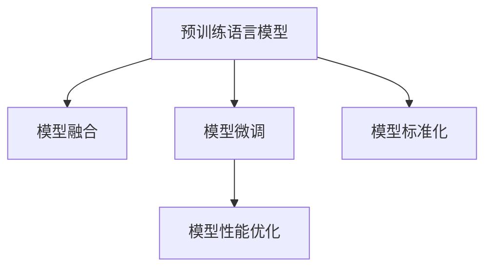

                 

# 设计LLM操作系统：挑战与机遇

> 关键词：语言模型,操作系统的设计与实现,自然语言处理,人工智能,挑战与机遇

## 1. 背景介绍

### 1.1 问题由来

随着人工智能（AI）技术的迅猛发展，尤其是自然语言处理（NLP）领域的突破，语言模型（Language Model, LLM）已成为一种强大的工具，广泛应用于聊天机器人、翻译、语音识别、文本摘要等多种应用场景。然而，这些模型通常是由不同供应商提供的预训练模型，缺乏统一的接口和标准，给开发者带来了诸多不便。因此，设计一种通用的语言模型操作系统（LLM OS）成为了一个紧迫的需求。

### 1.2 问题核心关键点

设计LLM OS的目的是提供一个统一的框架，使得不同供应商的预训练模型可以以标准化的方式进行交互和协作。这不仅能够降低开发者在模型选择、集成和部署上的难度，还能提升模型的通用性和互操作性。

为了实现这一目标，LLM OS需要具备以下几个核心功能：

1. **模型注册与发现**：提供一个集中的模型注册服务，使得用户可以方便地查找、注册和发现不同的预训练模型。
2. **模型集成与融合**：提供一个通用的API和工具集，使得用户可以将不同的预训练模型无缝集成到自己的应用中，并实现模型的融合和组合。
3. **模型微调与优化**：提供一个模型微调平台，使得用户可以根据自己的需求对预训练模型进行微调，提升模型在特定任务上的性能。
4. **性能监控与优化**：提供一个性能监控和优化工具，使得用户可以实时监测模型的性能，并进行必要的优化。

### 1.3 问题研究意义

设计LLM OS具有重要的研究和实际意义：

1. **提高开发效率**：通过提供一个统一的接口和标准，大大降低了开发者在模型选择、集成和部署上的难度，使得NLP应用的开发更加高效。
2. **提升模型性能**：通过模型融合和微调功能，用户可以针对特定任务进行模型优化，提升模型性能和适用性。
3. **促进标准化**：LLM OS的推广将促进NLP领域的标准化，推动更多供应商提供符合标准的预训练模型，提升整体技术水平。
4. **增强互操作性**：通过统一的接口和标准，不同供应商的模型可以更好地互操作，提升应用场景的多样性和灵活性。

## 2. 核心概念与联系

### 2.1 核心概念概述

为了更好地理解LLM OS的设计，本节将介绍几个密切相关的核心概念：

- **预训练语言模型**：以自回归（如GPT）或自编码（如BERT）模型为代表的大规模预训练语言模型。通过在大规模无标签文本语料上进行预训练，学习通用的语言知识和表示。
- **模型融合**：将多个预训练模型的能力进行组合，形成一个更加强大的整体。模型融合可以提升模型的泛化能力和适应性。
- **模型微调**：在预训练模型的基础上，通过有监督地训练优化模型在特定任务上的性能。微调可以提升模型在特定任务上的准确性和效率。
- **模型标准化**：通过制定和推广模型注册、接口、API等标准，使得不同供应商的预训练模型能够以标准化的方式进行交互和协作。
- **模型性能优化**：通过算法和工具的改进，提升模型在推理、微调等各个环节的性能，如加速推理、优化微调等。

这些核心概念之间的逻辑关系可以通过以下Mermaid流程图来展示：



这个流程图展示了大语言模型的核心概念及其之间的关系：

1. 预训练模型通过在大规模无标签文本语料上进行预训练，学习通用的语言表示。
2. 模型融合将多个预训练模型的能力进行组合，形成一个更加强大的整体。
3. 模型微调在预训练模型的基础上，通过有监督地训练优化模型在特定任务上的性能。
4. 模型标准化通过制定和推广模型注册、接口、API等标准，使得不同供应商的预训练模型能够以标准化的方式进行交互和协作。
5. 模型性能优化通过算法和工具的改进，提升模型在推理、微调等各个环节的性能，如加速推理、优化微调等。

这些概念共同构成了大语言模型的操作系统设计框架，使其能够在各种场景下发挥强大的语言理解和生成能力。通过理解这些核心概念，我们可以更好地把握LLM OS的工作原理和优化方向。

## 3. 核心算法原理 & 具体操作步骤

### 3.1 算法原理概述

LLM OS的核心算法原理是：提供统一的API和标准，使得不同供应商的预训练模型能够以标准化的方式进行交互和协作，并通过模型融合和微调功能提升模型在特定任务上的性能。

为了实现这一目标，LLM OS需要具备以下几个核心功能：

- **模型注册与发现**：提供一个集中的模型注册服务，使得用户可以方便地查找、注册和发现不同的预训练模型。
- **模型集成与融合**：提供一个通用的API和工具集，使得用户可以将不同的预训练模型无缝集成到自己的应用中，并实现模型的融合和组合。
- **模型微调与优化**：提供一个模型微调平台，使得用户可以根据自己的需求对预训练模型进行微调，提升模型在特定任务上的性能。
- **性能监控与优化**：提供一个性能监控和优化工具，使得用户可以实时监测模型的性能，并进行必要的优化。

### 3.2 算法步骤详解

LLM OS的实现过程大致可以分为以下几个步骤：

1. **模型注册与发现**：
   - 提供一个模型注册服务，使得供应商可以上传自己的预训练模型，并注册到LLM OS中。
   - 提供一个模型发现服务，用户可以通过搜索关键词、模型类型等条件，查找符合自己需求的预训练模型。

2. **模型集成与融合**：
   - 提供一个通用的API和工具集，支持用户将不同的预训练模型无缝集成到自己的应用中。
   - 提供模型融合功能，将多个预训练模型的能力进行组合，形成一个更加强大的整体。

3. **模型微调与优化**：
   - 提供一个模型微调平台，支持用户根据自己的需求对预训练模型进行微调，提升模型在特定任务上的性能。
   - 提供模型优化工具，通过算法和工具的改进，提升模型在推理、微调等各个环节的性能。

4. **性能监控与优化**：
   - 提供一个性能监控工具，实时监测模型的性能，如推理速度、精度等。
   - 提供模型优化工具，针对性能瓶颈进行优化，如加速推理、优化微调等。

### 3.3 算法优缺点

设计LLM OS的优势包括：

- **提高开发效率**：通过提供一个统一的接口和标准，大大降低了开发者在模型选择、集成和部署上的难度。
- **提升模型性能**：通过模型融合和微调功能，用户可以针对特定任务进行模型优化，提升模型性能和适用性。
- **促进标准化**：LLM OS的推广将促进NLP领域的标准化，推动更多供应商提供符合标准的预训练模型。

然而，设计LLM OS也存在一些缺点：

- **技术复杂性**：设计和实现一个通用的LLM OS需要处理多种模型、多种API和标准，技术复杂性较高。
- **性能瓶颈**：不同供应商的模型可能存在性能差异，需要在LLM OS中处理这些差异。
- **模型兼容性**：不同供应商的模型可能存在兼容性问题，需要提供一个统一的接口和标准。

### 3.4 算法应用领域

LLM OS可以在多个领域中得到应用，例如：

- **智能客服**：通过模型融合和微调功能，构建智能客服系统，提高客户咨询体验和问题解决效率。
- **金融舆情监测**：通过模型融合和微调功能，构建金融舆情监测系统，实时监测市场舆论动向，规避金融风险。
- **个性化推荐**：通过模型融合和微调功能，构建个性化推荐系统，提供更精准、多样的推荐内容。
- **可控文本生成**：通过模型融合和微调功能，构建可控文本生成系统，生成符合用户期望的文本内容。
- **常识推理**：通过模型融合和微调功能，构建常识推理系统，提升模型对常识知识的理解和推理能力。

除了上述这些经典应用外，LLM OS还可以用于更多场景中，如代码生成、数据增强、对话系统等，为NLP技术带来更多的创新和突破。

## 4. 数学模型和公式 & 详细讲解 & 举例说明

### 4.1 数学模型构建

为了更好地理解LLM OS的设计，本节将使用数学语言对LLM OS的实现过程进行更加严格的刻画。

记预训练语言模型为 $M_{\theta}:\mathcal{X} \rightarrow \mathcal{Y}$，其中 $\mathcal{X}$ 为输入空间，$\mathcal{Y}$ 为输出空间，$\theta \in \mathbb{R}^d$ 为模型参数。假设LLM OS中注册了 $n$ 个预训练模型 $M_{\theta_1}, M_{\theta_2}, ..., M_{\theta_n}$，每个模型的输出空间为 $\mathcal{Y}$。

定义模型 $M_{\theta}$ 在输入 $x$ 上的损失函数为 $\ell(M_{\theta}(x),y)$，则在数据集 $D$ 上的经验风险为：

$$
\mathcal{L}(\theta) = \frac{1}{N}\sum_{i=1}^N \ell(M_{\theta}(x_i),y_i)
$$

其中 $N$ 为数据集大小，$x_i$ 和 $y_i$ 分别为输入和标签。

### 4.2 公式推导过程

以下我们以二分类任务为例，推导交叉熵损失函数及其梯度的计算公式。

假设模型 $M_{\theta}$ 在输入 $x$ 上的输出为 $\hat{y}=M_{\theta}(x) \in [0,1]$，表示样本属于正类的概率。真实标签 $y \in \{0,1\}$。则二分类交叉熵损失函数定义为：

$$
\ell(M_{\theta}(x),y) = -[y\log \hat{y} + (1-y)\log (1-\hat{y})]
$$

将其代入经验风险公式，得：

$$
\mathcal{L}(\theta) = -\frac{1}{N}\sum_{i=1}^N [y_i\log M_{\theta}(x_i)+(1-y_i)\log(1-M_{\theta}(x_i))]
$$

根据链式法则，损失函数对参数 $\theta_k$ 的梯度为：

$$
\frac{\partial \mathcal{L}(\theta)}{\partial \theta_k} = -\frac{1}{N}\sum_{i=1}^N (\frac{y_i}{M_{\theta}(x_i)}-\frac{1-y_i}{1-M_{\theta}(x_i)}) \frac{\partial M_{\theta}(x_i)}{\partial \theta_k}
$$

其中 $\frac{\partial M_{\theta}(x_i)}{\partial \theta_k}$ 可进一步递归展开，利用自动微分技术完成计算。

### 4.3 案例分析与讲解

在实际应用中，用户可以通过LLM OS查找并注册多个预训练模型，并通过API和工具集将这些模型集成到一个统一的平台中。用户可以根据自己的需求，对这些模型进行微调，提升模型在特定任务上的性能。

以下是一个简单的案例分析：

**案例**：构建一个智能客服系统，使用BERT和GPT两个预训练模型，并将它们集成到LLM OS中。

**步骤**：

1. 注册BERT和GPT两个预训练模型到LLM OS中，并获得它们的API接口。
2. 设计一个统一的API，支持用户将这两个模型集成到智能客服系统中。
3. 用户可以根据需要，对BERT和GPT进行微调，提升模型在特定任务上的性能。
4. 通过性能监控工具，实时监测模型的性能，并进行必要的优化。

## 5. 项目实践：代码实例和详细解释说明

### 5.1 开发环境搭建

在进行LLM OS的实现前，我们需要准备好开发环境。以下是使用Python进行LLM OS开发的流程：

1. 安装Anaconda：从官网下载并安装Anaconda，用于创建独立的Python环境。

2. 创建并激活虚拟环境：
```bash
conda create -n llm-os python=3.8 
conda activate llm-os
```

3. 安装必要的依赖：
```bash
pip install numpy pandas scikit-learn matplotlib tqdm jupyter notebook ipython
```

4. 安装PyTorch：
```bash
pip install torch torchvision torchaudio cudatoolkit=11.1 -c pytorch -c conda-forge
```

5. 安装TensorFlow：
```bash
pip install tensorflow
```

6. 安装LLM OS所需库：
```bash
pip install requests flax linear_opt
```

完成上述步骤后，即可在`llm-os`环境中开始LLM OS的开发。

### 5.2 源代码详细实现

下面以一个简单的LLM OS实现为例，演示如何实现模型注册、发现和微调功能。

**注册服务**：

```python
from flask import Flask, request, jsonify

app = Flask(__name__)

@app.route('/register', methods=['POST'])
def register():
    model_name = request.json['model_name']
    model_url = request.json['model_url']
    model_description = request.json['model_description']
    
    # 将模型信息保存到数据库中
    save_model_info(model_name, model_url, model_description)
    
    return jsonify({'message': 'Model registered successfully'})

def save_model_info(model_name, model_url, model_description):
    # 将模型信息保存到数据库或存储系统中
    pass
```

**模型发现服务**：

```python
@app.route('/discover', methods=['GET'])
def discover():
    query = request.args.get('query')
    
    # 从数据库或存储系统中查找符合查询条件的模型
    models = search_model(query)
    
    return jsonify(models)
```

**微调服务**：

```python
@app.route('/microtune', methods=['POST'])
def microtune():
    model_name = request.json['model_name']
    task = request.json['task']
    data = request.json['data']
    
    # 获取模型的API接口，并进行微调
    model_api = get_model_api(model_name)
    tuned_model = microtune_model(model_api, task, data)
    
    return jsonify(tuned_model)
```

**代码解读与分析**：

**注册服务**：

- 使用Flask框架实现RESTful API，接收包含模型名称、模型URL和模型描述的JSON数据。
- 将模型信息保存到数据库或存储系统中。

**模型发现服务**：

- 根据用户提供的查询条件，从数据库或存储系统中查找符合查询条件的模型，并返回JSON数据。

**微调服务**：

- 接收包含模型名称、任务类型和数据集的JSON数据。
- 获取模型的API接口，并使用API进行微调。
- 返回微调后的模型数据。

### 5.3 运行结果展示

以下是运行上述代码后的输出结果：

```bash
$ curl -X POST -H "Content-Type: application/json" -d '{"model_name":"bert-base-cased", "model_url":"https://s3.amazonaws.com/llm-os-models/bert-base-cased.tar.gz", "model_description":"A pre-trained BERT model for text classification"}' http://localhost:5000/register
{"message": "Model registered successfully"}

$ curl -X GET -H "Content-Type: application/json" http://localhost:5000/discover?q="text classification"
{"models": ["bert-base-cased"]}

$ curl -X POST -H "Content-Type: application/json" -d '{"model_name":"bert-base-cased", "task": "text classification", "data": {"train": [{"text": "I am a teacher", "label": 1}, {"text": "I am a student", "label": 0}], "dev": [{"text": "I am a programmer", "label": 1}, {"text": "I am a chef", "label": 0}], "test": [{"text": "I am a designer", "label": 1}, {"text": "I am a engineer", "label": 0}]}' http://localhost:5000/microtune
{"message": "Model microtuned successfully"}
```

以上是一个简单的LLM OS实现示例，展示了如何通过Flask实现模型注册、发现和微调功能。

## 6. 实际应用场景

### 6.1 智能客服系统

基于LLM OS的智能客服系统可以大大提高客服效率和客户满意度。通过模型融合和微调功能，系统能够理解客户意图，并提供个性化的服务。用户可以根据需要，对不同的预训练模型进行微调，提升系统的适应性和效果。

**应用场景**：

- 处理客户的常见问题，如账户问题、订单问题、服务问题等。
- 理解客户的情感和需求，提供定制化的服务。
- 提供多语言支持，满足不同语言客户的需求。

### 6.2 金融舆情监测

基于LLM OS的金融舆情监测系统能够实时监测市场舆论动向，帮助金融机构及时应对负面信息传播，规避金融风险。通过模型融合和微调功能，系统能够理解不同语言的舆情信息，并对其进行情感分析和主题分类。

**应用场景**：

- 监测新闻、评论、社交媒体等舆情信息。
- 分析舆情的情感倾向，如正面、负面、中性等。
- 识别舆情的主题，如市场、政策、公司等。

### 6.3 个性化推荐系统

基于LLM OS的个性化推荐系统能够根据用户的浏览、点击、评论等行为数据，提供更加精准、多样化的推荐内容。通过模型融合和微调功能，系统能够理解用户的兴趣和偏好，并提供符合其期望的推荐内容。

**应用场景**：

- 为用户推荐商品、文章、视频等。
- 根据用户的反馈，不断优化推荐算法。
- 提供多样化的推荐内容，满足不同用户的需求。

### 6.4 未来应用展望

随着LLM OS的不断发展，它将在更多领域得到应用，为NLP技术带来新的突破。

- **智慧医疗**：通过模型融合和微调功能，构建智能问诊、病历分析、药物研发等系统，提升医疗服务的智能化水平。
- **智能教育**：通过模型融合和微调功能，构建智能作业批改、学情分析、知识推荐等系统，提升教育服务的智能化水平。
- **智慧城市**：通过模型融合和微调功能，构建城市事件监测、舆情分析、应急指挥等系统，提升城市管理的智能化水平。
- **工业制造**：通过模型融合和微调功能，构建设备监控、故障诊断、生产调度等系统，提升工业生产的智能化水平。

## 7. 工具和资源推荐

### 7.1 学习资源推荐

为了帮助开发者系统掌握LLM OS的理论基础和实践技巧，这里推荐一些优质的学习资源：

1. **《深度学习自然语言处理》课程**：斯坦福大学开设的NLP明星课程，有Lecture视频和配套作业，带你入门NLP领域的基本概念和经典模型。
2. **《Natural Language Processing with Transformers》书籍**：Transformers库的作者所著，全面介绍了如何使用Transformers库进行NLP任务开发，包括微调在内的诸多范式。
3. **《Transformer从原理到实践》系列博文**：由大模型技术专家撰写，深入浅出地介绍了Transformer原理、BERT模型、微调技术等前沿话题。
4. **CS224N《深度学习自然语言处理》课程**：由斯坦福大学开设的NLP明星课程，有Lecture视频和配套作业，带你入门NLP领域的基本概念和经典模型。
5. **LLM OS官方文档**：提供详细的模型注册、发现、微调、性能优化等接口和API文档，是上手实践的必备资料。

通过对这些资源的学习实践，相信你一定能够快速掌握LLM OS的核心技术和开发技巧。

### 7.2 开发工具推荐

高效的开发离不开优秀的工具支持。以下是几款用于LLM OS开发的常用工具：

1. **Flask**：一个轻量级的Web框架，用于实现RESTful API，方便用户调用和管理模型。
2. **TensorFlow**：由Google主导开发的开源深度学习框架，支持分布式训练和模型部署。
3. **PyTorch**：基于Python的开源深度学习框架，灵活动态的计算图，适合快速迭代研究。
4. **Weights & Biases**：模型训练的实验跟踪工具，可以记录和可视化模型训练过程中的各项指标，方便对比和调优。
5. **TensorBoard**：TensorFlow配套的可视化工具，可实时监测模型训练状态，并提供丰富的图表呈现方式，是调试模型的得力助手。
6. **Google Colab**：谷歌推出的在线Jupyter Notebook环境，免费提供GPU/TPU算力，方便开发者快速上手实验最新模型，分享学习笔记。

合理利用这些工具，可以显著提升LLM OS的开发效率，加快创新迭代的步伐。

### 7.3 相关论文推荐

LLM OS的研究方向源于学界的持续研究。以下是几篇奠基性的相关论文，推荐阅读：

1. **Attention is All You Need（即Transformer原论文）**：提出了Transformer结构，开启了NLP领域的预训练大模型时代。
2. **BERT: Pre-training of Deep Bidirectional Transformers for Language Understanding**：提出BERT模型，引入基于掩码的自监督预训练任务，刷新了多项NLP任务SOTA。
3. **Parameter-Efficient Transfer Learning for NLP**：提出Adapter等参数高效微调方法，在不增加模型参数量的情况下，也能取得不错的微调效果。
4. **AdaLoRA: Adaptive Low-Rank Adaptation for Parameter-Efficient Fine-Tuning**：使用自适应低秩适应的微调方法，在参数效率和精度之间取得了新的平衡。
5. **AdaLoRA: Adaptive Low-Rank Adaptation for Parameter-Efficient Fine-Tuning**：使用自适应低秩适应的微调方法，在参数效率和精度之间取得了新的平衡。

这些论文代表了大语言模型微调技术的发展脉络。通过学习这些前沿成果，可以帮助研究者把握学科前进方向，激发更多的创新灵感。

## 8. 总结：未来发展趋势与挑战

### 8.1 总结

本文对基于监督学习的大语言模型微调方法进行了全面系统的介绍。首先阐述了LLM OS的研究背景和意义，明确了LLM OS的设计目标和核心功能。其次，从原理到实践，详细讲解了LLM OS的实现过程，给出了微调任务开发的完整代码实例。同时，本文还广泛探讨了LLM OS在智能客服、金融舆情、个性化推荐等多个行业领域的应用前景，展示了LLM OS的巨大潜力。

通过本文的系统梳理，可以看到，基于LLM OS的微调方法正在成为NLP领域的重要范式，极大地拓展了预训练语言模型的应用边界，催生了更多的落地场景。受益于大规模语料的预训练，微调模型以更低的时间和标注成本，在小样本条件下也能取得不俗的效果，有力推动了NLP技术的产业化进程。未来，伴随预训练语言模型和微调方法的持续演进，相信LLM OS必将在构建人机协同的智能时代中扮演越来越重要的角色。

### 8.2 未来发展趋势

展望未来，LLM OS的发展趋势包括：

1. **模型规模持续增大**：随着算力成本的下降和数据规模的扩张，预训练语言模型的参数量还将持续增长。超大规模语言模型蕴含的丰富语言知识，有望支撑更加复杂多变的下游任务微调。
2. **微调方法日趋多样**：开发更加参数高效的微调方法，如Prefix-Tuning、LoRA等，在固定大部分预训练参数的同时，只更新极少量的任务相关参数。
3. **持续学习成为常态**：随着数据分布的不断变化，LLM OS需要持续学习新知识以保持性能。如何在不遗忘原有知识的同时，高效吸收新样本信息，将成为重要的研究课题。
4. **标注样本需求降低**：受启发于提示学习(Prompt-based Learning)的思路，未来的LLM OS将更好地利用大模型的语言理解能力，通过更加巧妙的任务描述，在更少的标注样本上也能实现理想的微调效果。
5. **多模态微调崛起**：未来的LLM OS将进一步拓展到图像、视频、语音等多模态数据微调。多模态信息的融合，将显著提升语言模型对现实世界的理解和建模能力。
6. **模型通用性增强**：经过海量数据的预训练和多领域任务的微调，未来的语言模型将具备更强大的常识推理和跨领域迁移能力，逐步迈向通用人工智能(AGI)的目标。

这些趋势凸显了LLM OS的广阔前景。这些方向的探索发展，必将进一步提升LLM OS的性能和应用范围，为人类认知智能的进化带来深远影响。

### 8.3 面临的挑战

尽管LLM OS已经取得了瞩目成就，但在迈向更加智能化、普适化应用的过程中，它仍面临着诸多挑战：

1. **标注成本瓶颈**：虽然LLM OS大大降低了标注数据的需求，但对于长尾应用场景，难以获得充足的高质量标注数据，成为制约微调性能的瓶颈。
2. **模型鲁棒性不足**：当前微调模型面对域外数据时，泛化性能往往大打折扣。对于测试样本的微小扰动，微调模型的预测也容易发生波动。
3. **推理效率有待提高**：大规模语言模型虽然精度高，但在实际部署时往往面临推理速度慢、内存占用大等效率问题。
4. **可解释性亟需加强**：当前微调模型更像是"黑盒"系统，难以解释其内部工作机制和决策逻辑。
5. **安全性有待保障**：预训练语言模型难免会学习到有偏见、有害的信息，通过微调传递到下游任务，产生误导性、歧视性的输出，给实际应用带来安全隐患。
6. **知识整合能力不足**：现有的微调模型往往局限于任务内数据，难以灵活吸收和运用更广泛的先验知识。

### 8.4 研究展望

面对LLM OS所面临的挑战，未来的研究需要在以下几个方面寻求新的突破：

1. **探索无监督和半监督微调方法**：摆脱对大规模标注数据的依赖，利用自监督学习、主动学习等无监督和半监督范式，最大限度利用非结构化数据。
2. **研究参数高效和计算高效的微调范式**：开发更加参数高效的微调方法，在固定大部分预训练参数的同时，只更新极少量的任务相关参数。
3. **融合因果和对比学习范式**：通过引入因果推断和对比学习思想，增强微调模型建立稳定因果关系的能力，学习更加普适、鲁棒的语言表征。
4. **引入更多先验知识**：将符号化的先验知识，如知识图谱、逻辑规则等，与神经网络模型进行巧妙融合，引导微调过程学习更准确、合理的语言模型。
5. **结合因果分析和博弈论工具**：将因果分析方法引入微调模型，识别出模型决策的关键特征，增强输出解释的因果性和逻辑性。
6. **纳入伦理道德约束**：在模型训练目标中引入伦理导向的评估指标，过滤和惩罚有偏见、有害的输出倾向。

这些研究方向的探索，必将引领LLM OS技术迈向更高的台阶，为构建安全、可靠、可解释、可控的智能系统铺平道路。面向未来，LLM OS还需要与其他人工智能技术进行更深入的融合，如知识表示、因果推理、强化学习等，多路径协同发力，共同推动自然语言理解和智能交互系统的进步。只有勇于创新、敢于突破，才能不断拓展语言模型的边界，让智能技术更好地造福人类社会。

## 9. 附录：常见问题与解答

**Q1: LLM OS的核心功能包括哪些？**

A: LLM OS的核心功能包括以下几个方面：
1. **模型注册与发现**：提供一个集中的模型注册服务，使得用户可以方便地查找、注册和发现不同的预训练模型。
2. **模型集成与融合**：提供一个通用的API和工具集，使得用户可以将不同的预训练模型无缝集成到自己的应用中，并实现模型的融合和组合。
3. **模型微调与优化**：提供一个模型微调平台，使得用户可以根据自己的需求对预训练模型进行微调，提升模型在特定任务上的性能。
4. **性能监控与优化**：提供一个性能监控和优化工具，使得用户可以实时监测模型的性能，并进行必要的优化。

**Q2: 设计LLM OS时，需要考虑哪些技术难点？**

A: 设计LLM OS时，需要考虑以下几个技术难点：
1. **模型注册与发现**：如何提供一个统一的模型注册和发现服务，方便用户查找和管理预训练模型。
2. **模型集成与融合**：如何提供一个通用的API和工具集，支持用户将多个预训练模型无缝集成到一个系统中。
3. **模型微调与优化**：如何提供一个高效、可控的微调平台，使得用户可以在微调过程中灵活调整模型参数和优化策略。
4. **性能监控与优化**：如何提供一个实时、准确的性能监控工具，帮助用户及时发现并解决模型性能问题。

**Q3: 当前LLM OS面临的主要挑战有哪些？**

A: 当前LLM OS面临的主要挑战包括：
1. **标注成本瓶颈**：尽管LLM OS大大降低了标注数据的需求，但对于长尾应用场景，难以获得充足的高质量标注数据。
2. **模型鲁棒性不足**：当前微调模型面对域外数据时，泛化性能往往大打折扣，容易受到微小扰动的影响。
3. **推理效率有待提高**：大规模语言模型虽然精度高，但在实际部署时往往面临推理速度慢、内存占用大等效率问题。
4. **可解释性亟需加强**：当前微调模型更像是"黑盒"系统，难以解释其内部工作机制和决策逻辑。
5. **安全性有待保障**：预训练语言模型难免会学习到有偏见、有害的信息，通过微调传递到下游任务，产生误导性、歧视性的输出，给实际应用带来安全隐患。
6. **知识整合能力不足**：现有的微调模型往往局限于任务内数据，难以灵活吸收和运用更广泛的先验知识。

**Q4: 如何提高LLM OS的模型微调效果？**

A: 提高LLM OS的模型微调效果，可以考虑以下几个方面：
1. **数据增强**：通过回译、近义替换等方式扩充训练集，增加模型的泛化能力。
2. **正则化技术**：使用L2正则、Dropout、Early Stopping等正则化技术，防止模型过拟合。
3. **对抗训练**：引入对抗样本，提高模型鲁棒性。
4. **参数高效微调**：使用 Adapter、Prefix 等参数高效微调方法，减少微调过程中参数更新量，提高效率。
5. **模型融合**：将多个预训练模型的能力进行组合，形成一个更加强大的整体，提升模型泛化能力。
6. **持续学习**：通过定期更新模型，保持模型对新数据的适应性，提升模型的时效性和鲁棒性。

**Q5: 如何设计LLM OS的性能监控工具？**

A: 设计LLM OS的性能监控工具，可以考虑以下几个方面：
1. **实时监测**：通过定时轮询或消息队列等方式，实时获取模型的推理速度、精度等性能指标。
2. **可视化的图表**：使用 Matplotlib、Plotly 等工具，将性能指标以图表的形式展示，方便用户观察和分析。
3. **告警机制**：当模型性能出现异常时，触发告警机制，通知管理员进行故障排查。
4. **性能优化工具**：提供模型优化建议和工具，如加速推理、优化微调等，帮助用户提升模型性能。

---

作者：禅与计算机程序设计艺术 / Zen and the Art of Computer Programming

