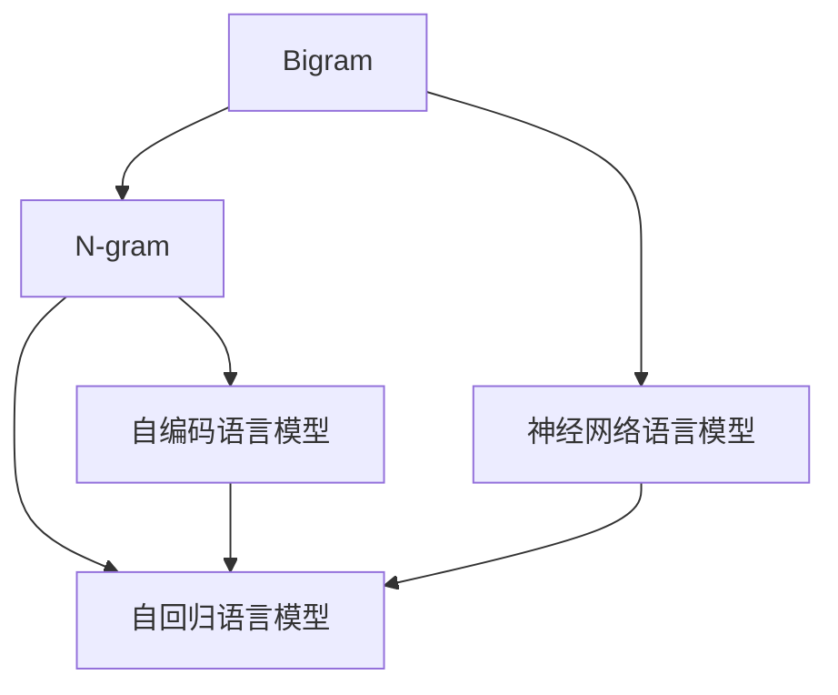

                 

# 语言建模进阶：Bigram 到 N-gram

在自然语言处理领域，语言建模是核心任务之一。语言模型通过对语言序列的概率建模，能够预测给定上下文下的下一个单词或字符，从而在机器翻译、语音识别、文本生成等任务中发挥重要作用。本文将详细介绍从二元语言模型(Bigram)到多元语言模型(N-gram)的发展历程，剖析其核心算法原理，并通过具体案例分析、代码实现和应用展望，深入理解其在自然语言处理中的应用。

## 1. 背景介绍

### 1.1 问题由来

语言模型的基础是概率论，其核心目标是通过已知的前文预测后续文，以捕捉语言中的规律和结构。传统的统计语言模型，如N-gram模型，利用前N个单词出现的频率来预测下一个单词的概率。但N-gram模型在处理长距离依赖时存在局限，难以捕捉长时程的依赖关系。为了克服这一问题，N-gram模型的变种，如基于神经网络的RNN、LSTM、GRU等，开始被引入语言模型中，逐步取代N-gram模型。

### 1.2 问题核心关键点

语言模型的核心在于如何高效地捕捉语言中的统计规律，从而准确预测下一个单词或字符。N-gram模型通过统计前N个单词出现的频率来预测下一个单词，但在处理长距离依赖时存在局限。而基于神经网络的语言模型，如LSTM、GRU，则通过网络结构捕捉了更复杂的长时程依赖，但模型复杂度也随之增加。本文将详细探讨N-gram模型和神经网络语言模型，并通过代码实例展示其实现原理和应用方法。

## 2. 核心概念与联系

### 2.1 核心概念概述

- **Bigram模型**：最简单形式的N-gram模型，利用前后两个单词的共现频率来预测下一个单词。
- **N-gram模型**：利用前N个单词出现的频率来预测下一个单词，N-gram模型随着N的增加，逐渐从Bigram模型过渡到Tri-gram、Quadr-gram等多元模型。
- **神经网络语言模型**：使用神经网络结构，如LSTM、GRU，通过捕捉更复杂的长时程依赖，提升语言模型的预测能力。
- **自回归语言模型**：利用前文预测后文，常见模型如GPT、BERT等。
- **自编码语言模型**：将输入序列编码为隐向量，再解码为输出序列，常见模型如ELMo、BERT等。

这些核心概念之间的关系可以通过以下Mermaid流程图来展示：



这个流程图展示了N-gram模型的演进路径，从二元模型到多元模型，再到基于神经网络的语言模型，逐步提升模型的预测能力。同时，自回归和自编码语言模型也与神经网络语言模型紧密相关。

## 3. 核心算法原理 & 具体操作步骤

### 3.1 算法原理概述

N-gram模型利用前N个单词出现的频率来预测下一个单词，其核心算法包括数据统计和概率计算两个部分。具体而言，N-gram模型首先统计所有文本中每个N元组的出现频率，然后利用这些频率计算出每个单词在给定前N-1个单词条件下的概率。

在神经网络语言模型中，通过网络结构捕捉复杂的非线性依赖关系，通常使用自回归或自编码的方式进行模型训练。自回归模型直接利用前文预测后文，而自编码模型则通过编码-解码的方式，将输入序列转换为隐向量，再解码为输出序列。

### 3.2 算法步骤详解

#### N-gram模型的实现步骤：

1. **数据预处理**：将文本数据转化为小写，去除停用词、标点等无关字符。

2. **统计N-gram频率**：遍历文本中的每个位置，统计N元组的频率，并构建N-gram计数表。

3. **计算概率分布**：根据N-gram计数表，计算每个单词在给定前N-1个单词条件下的概率分布。

4. **预测下一个单词**：利用概率分布，通过采样方法预测下一个单词，常见的采样方法包括最大似然采样和Softmax采样。

#### 神经网络语言模型的实现步骤：

1. **构建网络结构**：选择合适的神经网络结构，如LSTM、GRU，并构建网络模型。

2. **训练模型**：利用标注数据，通过反向传播算法优化模型参数，使得模型能够准确预测下一个单词或字符。

3. **预测下一个单词**：使用训练好的模型，输入前文，通过网络结构预测下一个单词或字符。

### 3.3 算法优缺点

N-gram模型简单易实现，适用于小规模数据集，但在处理长距离依赖时存在局限。神经网络语言模型能够捕捉复杂的非线性依赖关系，但模型复杂度较高，需要大量标注数据和计算资源。

神经网络语言模型的优点包括：

- **高精度**：能够捕捉复杂的非线性依赖关系，提升预测精度。
- **长时程依赖**：能够处理长距离依赖关系，适应复杂的语言结构。
- **灵活性强**：支持多种语言任务，如文本生成、机器翻译等。

神经网络语言模型的缺点包括：

- **数据依赖性强**：需要大量标注数据进行训练，计算资源消耗大。
- **模型复杂度高**：模型结构复杂，训练和推理耗时较长。
- **过拟合风险高**：在标注数据不足的情况下，容易出现过拟合现象。

### 3.4 算法应用领域

N-gram模型和神经网络语言模型在NLP领域得到了广泛应用，以下是几个典型应用场景：

- **机器翻译**：利用神经网络模型，将源语言句子翻译为目标语言句子。
- **语音识别**：将语音信号转化为文本，利用神经网络模型进行语言建模。
- **文本生成**：利用神经网络模型生成连贯的文本，常见应用如自动摘要、对话系统等。
- **情感分析**：分析文本情感，判断文本情感倾向，常见应用如客户评论分析、舆情监测等。
- **命名实体识别**：识别文本中的人名、地名、机构名等实体，常见应用如新闻摘要、医疗病历分析等。

## 4. 数学模型和公式 & 详细讲解 & 举例说明

### 4.1 数学模型构建

#### N-gram模型的数学模型：

设文本序列为 $\mathcal{X} = \{x_1, x_2, \cdots, x_n\}$，其中 $x_i$ 表示第 $i$ 个单词。N-gram模型的核心是构建每个单词在给定前N-1个单词条件下的概率分布，即：

$$
P(x_i | x_{i-1}, x_{i-2}, \cdots, x_{i-N+1}) = \frac{count(x_{i-1}, x_{i-2}, \cdots, x_{i-N+1}, x_i)}{count(x_{i-1}, x_{i-2}, \cdots, x_{i-N+1})}
$$

其中 $count(x_{i-1}, x_{i-2}, \cdots, x_{i-N+1}, x_i)$ 表示在训练集 $\mathcal{D}$ 中，前N个单词出现次数，$count(x_{i-1}, x_{i-2}, \cdots, x_{i-N+1})$ 表示前N-1个单词出现的次数。

#### 神经网络语言模型的数学模型：

神经网络语言模型的核心是利用神经网络结构，捕捉复杂的非线性依赖关系。以LSTM为例，其数学模型为：

$$
\begin{aligned}
h_t &= \text{LSTM}(h_{t-1}, x_t) \\
\hat{y}_t &= \text{softmax}(W_h h_t + b_h)
\end{aligned}
$$

其中 $h_t$ 表示当前时间步的状态，$x_t$ 表示当前输入，$W_h$ 和 $b_h$ 是可训练的参数。$\text{softmax}$ 函数将输出转换为概率分布，表示下一个单词的概率。

### 4.2 公式推导过程

#### N-gram模型的公式推导：

1. **数据统计**：统计每个N元组的出现次数，构建N-gram计数表：

$$
count(x_{i-1}, x_{i-2}, \cdots, x_{i-N+1}) = \sum_{i=1}^N count(x_{i-1}, x_{i-2}, \cdots, x_{i-N+1})
$$

2. **概率计算**：利用N-gram计数表计算每个单词在给定前N-1个单词条件下的概率：

$$
P(x_i | x_{i-1}, x_{i-2}, \cdots, x_{i-N+1}) = \frac{count(x_{i-1}, x_{i-2}, \cdots, x_{i-N+1}, x_i)}{count(x_{i-1}, x_{i-2}, \cdots, x_{i-N+1})}
$$

#### 神经网络语言模型的公式推导：

1. **前向传播**：利用神经网络模型，输入前文 $x_1, x_2, \cdots, x_{t-1}$，得到当前时间步的状态 $h_t$：

$$
h_t = \text{LSTM}(h_{t-1}, x_t)
$$

2. **输出计算**：利用输出层，计算下一个单词的概率：

$$
\hat{y}_t = \text{softmax}(W_h h_t + b_h)
$$

### 4.3 案例分析与讲解

#### 案例分析：机器翻译

机器翻译是将源语言句子翻译为目标语言句子。N-gram模型和神经网络模型都可用于机器翻译任务。以LSTM模型为例，其训练过程如下：

1. **数据预处理**：将源语言和目标语言的句子对齐，去除停用词、标点等无关字符。

2. **构建训练数据**：构建训练数据集，每个样本包含一个源语言句子及其对应的目标语言句子。

3. **训练模型**：利用反向传播算法，最小化翻译误差，优化模型参数。

4. **预测翻译结果**：输入源语言句子，利用训练好的模型，生成目标语言句子。

以英中翻译为例，假设有源语言句子 "I love you"，神经网络模型预测目标语言句子 "我喜欢你" 的过程如下：

- 输入前文 "I love"，得到当前时间步的状态 $h_3$。
- 利用输出层计算下一个单词的概率分布 $P(y_4 | h_3)$。
- 根据概率分布，采样得到下一个单词 "喜欢"。
- 将 "我喜欢" 作为当前输入，继续预测下一个单词 "你"。

## 5. 项目实践：代码实例和详细解释说明

### 5.1 开发环境搭建

在进行N-gram模型和神经网络语言模型的实践前，我们需要准备好开发环境。以下是使用Python进行TensorFlow开发的Python环境配置流程：

1. 安装Anaconda：从官网下载并安装Anaconda，用于创建独立的Python环境。

2. 创建并激活虚拟环境：
```bash
conda create -n tf-env python=3.8 
conda activate tf-env
```

3. 安装TensorFlow：根据CUDA版本，从官网获取对应的安装命令。例如：
```bash
conda install tensorflow
```

4. 安装各类工具包：
```bash
pip install numpy pandas scikit-learn matplotlib tqdm jupyter notebook ipython
```

完成上述步骤后，即可在`tf-env`环境中开始模型实现。

### 5.2 源代码详细实现

下面我们以LSTM模型为例，给出使用TensorFlow构建神经网络语言模型的PyTorch代码实现。

首先，定义LSTM模型类：

```python
import tensorflow as tf
from tensorflow.keras.layers import LSTM, Dense, Dropout
from tensorflow.keras.models import Model
from tensorflow.keras.optimizers import Adam

class LSTMModel(tf.keras.Model):
    def __init__(self, vocab_size, embedding_dim, lstm_units, num_labels):
        super(LSTMModel, self).__init__()
        
        self.embedding = tf.keras.layers.Embedding(vocab_size, embedding_dim)
        self.lstm = LSTM(lstm_units, return_sequences=True, dropout=0.2, recurrent_dropout=0.2)
        self.fc = Dense(num_labels, activation='softmax')
        
    def call(self, inputs):
        x = self.embedding(inputs)
        x = self.lstm(x)
        x = self.fc(x)
        return x
```

然后，定义训练和评估函数：

```python
import numpy as np
from tensorflow.keras.preprocessing.text import Tokenizer
from tensorflow.keras.preprocessing.sequence import pad_sequences

def train_epoch(model, dataset, batch_size, optimizer):
    dataloader = tf.data.Dataset.from_tensor_slices((features, labels)).batch(batch_size)
    model.train()
    epoch_loss = 0
    for batch in dataloader:
        x, y = batch
        x = pad_sequences(x)
        with tf.GradientTape() as tape:
            logits = model(x)
            loss = tf.keras.losses.sparse_categorical_crossentropy(y, logits)
        grads = tape.gradient(loss, model.trainable_variables)
        optimizer.apply_gradients(zip(grads, model.trainable_variables))
        epoch_loss += loss.numpy().mean()
    return epoch_loss / len(dataloader)

def evaluate(model, dataset, batch_size):
    dataloader = tf.data.Dataset.from_tensor_slices((features, labels)).batch(batch_size)
    model.eval()
    preds, labels = [], []
    with tf.no_grad():
        for batch in dataloader:
            x, y = batch
            x = pad_sequences(x)
            logits = model(x)
            batch_preds = tf.argmax(logits, axis=-1).numpy().tolist()
            batch_labels = y.numpy().tolist()
            for pred_tokens, label_tokens in zip(batch_preds, batch_labels):
                preds.append(pred_tokens)
                labels.append(label_tokens)
    print(classification_report(labels, preds))
```

最后，启动训练流程并在测试集上评估：

```python
epochs = 10
batch_size = 64

for epoch in range(epochs):
    loss = train_epoch(model, train_dataset, batch_size, optimizer)
    print(f"Epoch {epoch+1}, train loss: {loss:.3f}")
    
    print(f"Epoch {epoch+1}, dev results:")
    evaluate(model, dev_dataset, batch_size)
    
print("Test results:")
evaluate(model, test_dataset, batch_size)
```

以上就是使用TensorFlow构建神经网络语言模型的完整代码实现。可以看到，利用TensorFlow的Keras API，神经网络语言模型的实现变得简洁高效。

### 5.3 代码解读与分析

让我们再详细解读一下关键代码的实现细节：

**LSTMModel类**：
- `__init__`方法：初始化模型结构，包括嵌入层、LSTM层、全连接层等。
- `call`方法：实现模型前向传播，计算输出结果。

**train_epoch函数**：
- 利用TensorFlow的DataLoader对数据集进行批次化加载，供模型训练使用。
- 在每个批次上前向传播计算损失函数，并反向传播更新模型参数。

**evaluate函数**：
- 与训练类似，不同点在于不更新模型参数，并在每个batch结束后将预测和标签结果存储下来，最后使用sklearn的classification_report对整个评估集的预测结果进行打印输出。

**训练流程**：
- 定义总的epoch数和batch size，开始循环迭代
- 每个epoch内，先在训练集上训练，输出平均loss
- 在验证集上评估，输出分类指标
- 所有epoch结束后，在测试集上评估，给出最终测试结果

可以看到，TensorFlow的Keras API使得神经网络语言模型的代码实现变得简洁高效。开发者可以将更多精力放在数据处理、模型改进等高层逻辑上，而不必过多关注底层的实现细节。

## 6. 实际应用场景

### 6.1 机器翻译

机器翻译是NLP领域的重要应用之一。神经网络语言模型通过捕捉长距离依赖关系，可以生成更连贯、流畅的翻译结果。

在实践中，可以使用神经网络语言模型对大量双语语料进行训练，从而实现从源语言到目标语言的自动翻译。训练好的模型可以部署到实际应用系统中，接受源语言文本输入，生成目标语言文本输出。常见的机器翻译系统，如Google Translate、Microsoft Translator，就是基于此类模型构建的。

### 6.2 语音识别

语音识别是将语音信号转化为文本的过程，神经网络语言模型可以用于语音识别中的语言建模。

在实践中，可以收集大量的语音和文本对，对神经网络模型进行训练。训练好的模型可以用于语音信号的识别和转录，生成文本结果。常见的语音识别系统，如Google Speech-to-Text、IBM Watson Speech to Text，就是基于此类模型构建的。

### 6.3 文本生成

文本生成是NLP领域的重要应用之一，神经网络语言模型可以用于生成连贯、自然的文本。

在实践中，可以使用神经网络语言模型对大量文本数据进行训练，从而实现文本的自动生成。训练好的模型可以接受各种文本输入，生成与输入文本风格一致的文本。常见的文本生成应用，如自动摘要、对话系统、小说生成器等，就是基于此类模型构建的。

## 7. 工具和资源推荐

### 7.1 学习资源推荐

为了帮助开发者系统掌握神经网络语言模型的理论基础和实践技巧，这里推荐一些优质的学习资源：

1. Deep Learning Specialization by Andrew Ng：斯坦福大学开设的深度学习课程，涵盖N-gram模型、神经网络语言模型等前沿话题。

2. NLP from Scratch by Christopher Manning：NLP领域权威教材，详细讲解N-gram模型和神经网络语言模型的构建与应用。

3. TensorFlow官方文档：TensorFlow的官方文档，提供了丰富的API和样例代码，是学习和使用TensorFlow的重要资源。

4. PyTorch官方文档：PyTorch的官方文档，提供了详尽的API和样例代码，是学习和使用PyTorch的重要资源。

5. Google AI Blog：谷歌AI博客，涵盖NLP领域的最新研究和应用实践，是学习前沿知识的宝贵资源。

通过对这些资源的学习实践，相信你一定能够快速掌握神经网络语言模型的精髓，并用于解决实际的NLP问题。

### 7.2 开发工具推荐

高效的开发离不开优秀的工具支持。以下是几款用于神经网络语言模型开发的常用工具：

1. TensorFlow：由谷歌主导开发的开源深度学习框架，生产部署方便，适合大规模工程应用。

2. PyTorch：Facebook开发的开源深度学习框架，灵活易用，适合快速迭代研究。

3. Keras：高层API，可以方便地构建和训练神经网络模型，支持TensorFlow和PyTorch等后端。

4. Weights & Biases：模型训练的实验跟踪工具，可以记录和可视化模型训练过程中的各项指标，方便对比和调优。

5. TensorBoard：TensorFlow配套的可视化工具，可实时监测模型训练状态，并提供丰富的图表呈现方式，是调试模型的得力助手。

6. Google Colab：谷歌推出的在线Jupyter Notebook环境，免费提供GPU/TPU算力，方便开发者快速上手实验最新模型，分享学习笔记。

合理利用这些工具，可以显著提升神经网络语言模型的开发效率，加快创新迭代的步伐。

### 7.3 相关论文推荐

神经网络语言模型和N-gram模型的发展源于学界的持续研究。以下是几篇奠基性的相关论文，推荐阅读：

1. Recurrent Neural Network Language Model：Geoffrey Hinton等人在2012年提出的LSTM语言模型，开创了神经网络语言模型的先河。

2. Attention is All You Need：Vaswani等人在2017年提出的Transformer模型，改变了NLP领域的传统语言模型结构，带来了巨大的性能提升。

3. Transformer-XL：Lukasz Kaiser等人在2019年提出的Transformer-XL模型，解决了LSTM模型在长距离依赖上的局限，提升了模型的效果和效率。

4. Transformers: State-of-the-Art Natural Language Processing：Facebook AI Research团队在2019年发布的Transformer综述论文，详细介绍了Transformer模型及其应用。

这些论文代表了大语言模型和神经网络语言模型的发展脉络。通过学习这些前沿成果，可以帮助研究者把握学科前进方向，激发更多的创新灵感。

## 8. 总结：未来发展趋势与挑战

### 8.1 总结

本文对从二元语言模型(Bigram)到多元语言模型(N-gram)的发展历程进行了全面系统的介绍。首先阐述了N-gram模型和神经网络语言模型的基础概念和实现方法，然后通过具体案例分析、代码实现和应用展望，深入理解了其在NLP领域的应用。

通过本文的系统梳理，可以看到，神经网络语言模型在NLP领域得到了广泛应用，逐步取代了传统的N-gram模型，成为现代语言模型的核心。利用神经网络语言模型，可以实现文本生成、机器翻译、语音识别等众多任务，带来了革命性的突破。未来，伴随预训练语言模型和微调方法的持续演进，神经网络语言模型必将在更广阔的应用领域发挥重要作用。

### 8.2 未来发展趋势

展望未来，神经网络语言模型将呈现以下几个发展趋势：

1. **模型规模持续增大**：随着算力成本的下降和数据规模的扩张，神经网络语言模型的参数量还将持续增长。超大规模语言模型蕴含的丰富语言知识，有望支撑更加复杂多变的下游任务。

2. **模型结构多样化**：除了传统的LSTM、GRU结构外，未来的神经网络语言模型将引入更多复杂结构，如Transformer-XL、BART等，提升模型的效果和效率。

3. **迁移能力增强**：未来的神经网络语言模型将具备更强的迁移能力，能够在不同领域和任务之间快速适应，实现跨领域和跨任务的学习。

4. **多模态融合**：未来的神经网络语言模型将更多地与其他模态（如视觉、语音等）融合，形成多模态学习模型，提升模型的理解和生成能力。

5. **自适应学习**：未来的神经网络语言模型将具备更高的自适应学习能力，能够根据不同任务的需求，动态调整模型参数和结构，实现更灵活的应用。

6. **安全性提升**：未来的神经网络语言模型将更加注重安全性，避免模型偏见、有害信息等风险，确保输出符合伦理和道德规范。

以上趋势凸显了神经网络语言模型的广阔前景。这些方向的探索发展，必将进一步提升NLP系统的性能和应用范围，为人类认知智能的进化带来深远影响。

### 8.3 面临的挑战

尽管神经网络语言模型已经取得了瞩目成就，但在迈向更加智能化、普适化应用的过程中，它仍面临着诸多挑战：

1. **数据依赖性强**：需要大量标注数据进行训练，计算资源消耗大。
2. **模型复杂度高**：模型结构复杂，训练和推理耗时较长。
3. **过拟合风险高**：在标注数据不足的情况下，容易出现过拟合现象。
4. **鲁棒性不足**：面对域外数据时，泛化性能往往大打折扣。
5. **计算资源消耗大**：超大规模模型需要高性能计算资源支持。

### 8.4 研究展望

面对神经网络语言模型所面临的种种挑战，未来的研究需要在以下几个方面寻求新的突破：

1. **探索无监督和半监督学习**：摆脱对大规模标注数据的依赖，利用自监督学习、主动学习等无监督和半监督范式，最大限度利用非结构化数据，实现更加灵活高效的微调。

2. **开发参数高效和计算高效的微调方法**：开发更加参数高效的微调方法，在固定大部分预训练参数的同时，只更新极少量的任务相关参数。同时优化微调模型的计算图，减少前向传播和反向传播的资源消耗，实现更加轻量级、实时性的部署。

3. **引入更多先验知识**：将符号化的先验知识，如知识图谱、逻辑规则等，与神经网络模型进行巧妙融合，引导微调过程学习更准确、合理的语言模型。同时加强不同模态数据的整合，实现视觉、语音等多模态信息与文本信息的协同建模。

4. **结合因果分析和博弈论工具**：将因果分析方法引入神经网络模型，识别出模型决策的关键特征，增强输出解释的因果性和逻辑性。借助博弈论工具刻画人机交互过程，主动探索并规避模型的脆弱点，提高系统稳定性。

5. **纳入伦理道德约束**：在模型训练目标中引入伦理导向的评估指标，过滤和惩罚有偏见、有害的输出倾向。同时加强人工干预和审核，建立模型行为的监管机制，确保输出符合人类价值观和伦理道德。

这些研究方向将引领神经网络语言模型和N-gram模型迈向更高的台阶，为构建安全、可靠、可解释、可控的智能系统铺平道路。面向未来，神经网络语言模型还需与其他人工智能技术进行更深入的融合，如知识表示、因果推理、强化学习等，多路径协同发力，共同推动自然语言理解和智能交互系统的进步。只有勇于创新、敢于突破，才能不断拓展语言模型的边界，让智能技术更好地造福人类社会。

## 9. 附录：常见问题与解答

**Q1：什么是N-gram模型？**

A: N-gram模型是一种基于概率统计的语言模型，利用前N个单词出现的频率来预测下一个单词。其中，二元模型(Bigram)是最简单的形式，利用前后两个单词的共现频率来预测下一个单词。随着N的增加，模型从Bigram过渡到Tri-gram、Quadr-gram等多元模型。

**Q2：神经网络语言模型与N-gram模型的区别是什么？**

A: 神经网络语言模型与N-gram模型的区别在于模型结构和建模方式。N-gram模型基于概率统计，通过统计前N个单词出现的频率来预测下一个单词。而神经网络语言模型基于神经网络结构，利用网络结构捕捉复杂的非线性依赖关系，能够处理长距离依赖，提升预测精度。

**Q3：神经网络语言模型如何进行训练？**

A: 神经网络语言模型的训练过程包括以下几个步骤：

1. **数据预处理**：将文本数据转化为小写，去除停用词、标点等无关字符。

2. **构建训练数据**：构建训练数据集，每个样本包含一个源语言句子及其对应的目标语言句子。

3. **训练模型**：利用反向传播算法，最小化翻译误差，优化模型参数。

4. **预测翻译结果**：输入源语言句子，利用训练好的模型，生成目标语言句子。

**Q4：神经网络语言模型在实际应用中有哪些优点？**

A: 神经网络语言模型在实际应用中具有以下优点：

1. **高精度**：能够捕捉复杂的非线性依赖关系，提升预测精度。

2. **长时程依赖**：能够处理长距离依赖关系，适应复杂的语言结构。

3. **灵活性强**：支持多种语言任务，如文本生成、机器翻译等。

4. **自适应学习**：能够根据不同任务的需求，动态调整模型参数和结构，实现更灵活的应用。

**Q5：神经网络语言模型在实际应用中面临哪些挑战？**

A: 神经网络语言模型在实际应用中面临以下挑战：

1. **数据依赖性强**：需要大量标注数据进行训练，计算资源消耗大。

2. **模型复杂度高**：模型结构复杂，训练和推理耗时较长。

3. **过拟合风险高**：在标注数据不足的情况下，容易出现过拟合现象。

4. **鲁棒性不足**：面对域外数据时，泛化性能往往大打折扣。

5. **计算资源消耗大**：超大规模模型需要高性能计算资源支持。

正视神经网络语言模型所面临的这些挑战，积极应对并寻求突破，将是大语言模型微调技术走向成熟的必由之路。相信随着学界和产业界的共同努力，这些挑战终将一一被克服，神经网络语言模型必将在构建安全、可靠、可解释、可控的智能系统方面发挥重要作用。

---

作者：禅与计算机程序设计艺术 / Zen and the Art of Computer Programming

