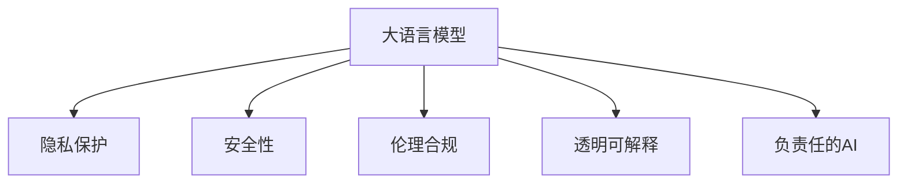

                 

# 负责任的 LLM 开发和部署

> 关键词：负责任AI, 大语言模型, 隐私保护, 安全审计, 伦理合规, 透明可解释, 负责任的AI开发

## 1. 背景介绍

### 1.1 问题由来

随着大语言模型（Large Language Models, LLMs）的快速发展，其在自然语言处理（NLP）、推荐系统、智能客服等多个领域取得了令人瞩目的成果。然而，随着模型的复杂性和应用场景的增多，大语言模型的开发和部署也面临诸多挑战。这些问题涉及模型隐私保护、安全性、伦理合规等多个方面，需要我们系统地审视和解决。

### 1.2 问题核心关键点

大语言模型的开发和部署需从以下关键点进行考虑：

1. **隐私保护**：如何保护用户数据的隐私，避免数据泄露和滥用。
2. **安全性**：确保模型不受恶意攻击，保护系统稳定运行。
3. **伦理合规**：遵守相关法律法规，避免输出有害或偏见信息。
4. **透明可解释**：模型决策过程应具备可解释性，便于理解和审核。
5. **负责任的AI**：开发和部署应遵循负责任原则，平衡技术进步与伦理道德。

这些关键点共同构成了负责任开发和部署大语言模型的框架，确保模型在提供高价值服务的同时，维护用户权益和社会责任。

## 2. 核心概念与联系

### 2.1 核心概念概述

为更好地理解大语言模型的负责任开发和部署，本文将介绍几个密切相关的核心概念：

- **大语言模型 (LLMs)**：如GPT、BERT等大规模预训练语言模型，通过海量的无标签文本数据进行预训练，具备强大的语言理解和生成能力。
- **隐私保护**：保护用户数据的机密性和完整性，避免数据泄露和滥用。
- **安全性**：模型和系统的安全保障，避免受到恶意攻击，确保系统稳定运行。
- **伦理合规**：遵循法律法规，确保模型输出不包含有害或偏见信息。
- **透明可解释**：模型的决策过程应具备可解释性，便于理解、审核和调整。
- **负责任的AI**：在开发和部署中遵循伦理原则，平衡技术进步与社会责任。

这些概念之间的逻辑关系可以通过以下Mermaid流程图来展示：



这个流程图展示了大语言模型的核心概念及其之间的关系：

1. 大语言模型通过预训练获得基础能力。
2. 在确保数据隐私和安全性的前提下，进行模型微调。
3. 模型输出应遵守法律法规，遵循伦理原则。
4. 模型决策应具备可解释性，便于理解和调整。
5. 开发和部署应遵循负责任原则，平衡技术进步与社会责任。

## 3. 核心算法原理 & 具体操作步骤

### 3.1 算法原理概述

基于大语言模型的负责任开发和部署，本质上是一个多目标优化过程。其核心思想是：在保障数据隐私、模型安全、伦理合规和透明可解释的前提下，最大化模型的性能和用户满意度。

具体而言，假设原始数据集为 $D=\{(x_i, y_i)\}_{i=1}^N$，其中 $x_i$ 为输入，$y_i$ 为标签。假设模型的训练集为 $D_t$，微调集为 $D_f$。则开发和部署的过程可以分解为以下几个步骤：

1. **隐私保护**：对原始数据集进行差分隐私处理，确保数据匿名化，避免数据泄露。
2. **安全性**：通过对抗训练等技术，提升模型的鲁棒性，抵御常见攻击。
3. **伦理合规**：引入伦理导向的评估指标，过滤和惩罚有害输出，确保合规性。
4. **透明可解释**：使用可解释模型或提供详细的解释报告，增强模型决策的可理解性。
5. **负责任的AI**：遵循伦理原则，平衡技术进步与社会责任，确保模型应用的正当性。

### 3.2 算法步骤详解

基于大语言模型的负责任开发和部署，一般包括以下几个关键步骤：

**Step 1: 准备数据集**

- **隐私保护**：采用差分隐私（Differential Privacy）、数据去标识化等技术，对原始数据进行处理，确保数据隐私。
- **安全性**：对数据进行对抗训练，引入对抗样本，增强模型鲁棒性。

**Step 2: 设计任务适配层**

- **任务适配层**：根据具体任务，设计合适的输出层和损失函数，如分类任务的softmax输出和交叉熵损失。
- **安全性**：在适配层中引入对抗训练和噪声注入等技术，提升模型鲁棒性。

**Step 3: 设置微调超参数**

- **学习率**：选择合适的学习率，如AdamW等优化算法，并根据微调数据量调整。
- **正则化**：设置权重衰减、Dropout等正则化技术，防止过拟合。
- **对抗训练**：引入对抗样本，提高模型鲁棒性。

**Step 4: 执行梯度训练**

- **训练流程**：使用梯度下降等优化算法，在数据集上训练模型，更新参数。
- **安全性**：使用对抗训练、对抗样本等技术，提升模型鲁棒性。

**Step 5: 测试和部署**

- **测试集评估**：在测试集上评估模型性能，确保其满足业务需求。
- **部署**：将模型部署到生产环境，确保系统的稳定性和可扩展性。

### 3.3 算法优缺点

大语言模型的负责任开发和部署方法具有以下优点：

1. **隐私保护**：采用隐私保护技术，确保数据隐私和安全。
2. **安全性**：通过对抗训练等技术，提升模型鲁棒性，抵御常见攻击。
3. **伦理合规**：引入伦理导向的评估指标，确保模型输出合规性。
4. **透明可解释**：使用可解释模型或提供详细的解释报告，增强模型决策的可理解性。
5. **负责任的AI**：遵循伦理原则，平衡技术进步与社会责任。

同时，该方法也存在一定的局限性：

1. **隐私保护**：差分隐私等技术可能引入噪音，影响模型性能。
2. **安全性**：对抗训练等技术需要额外的训练数据和计算资源。
3. **伦理合规**：伦理导向的评估指标设计复杂，可能需要人工干预。
4. **透明可解释**：复杂的可解释模型可能降低模型性能。
5. **负责任的AI**：遵循伦理原则可能需要额外的人工干预和审核。

尽管存在这些局限性，但就目前而言，基于负责任原则的开发和部署方法是大语言模型应用的最主流范式。未来相关研究的重点在于如何进一步降低隐私保护和安全性的成本，提高伦理合规和透明可解释的效果，同时兼顾模型性能的提升。

### 3.4 算法应用领域

基于大语言模型的负责任开发和部署方法，已经在多个领域得到应用，如金融、医疗、智能客服等。

**金融领域**：在金融舆情监测、风险评估等任务中，使用大语言模型进行情感分析和风险预测，确保数据隐私和安全，同时遵守法律法规，提供透明可解释的决策支持。

**医疗领域**：在医疗问答、病历分析等任务中，使用大语言模型提供个性化医疗服务，确保数据隐私，遵循伦理原则，提供可解释的诊疗建议。

**智能客服**：在智能客服系统中，使用大语言模型进行自然语言理解和生成，确保数据隐私，提供透明可解释的客户服务，同时遵循伦理原则，保护客户权益。

此外，大语言模型还应用于推荐系统、自动驾驶、工业智能等多个领域，为各行各业带来了新的技术突破。随着预训练语言模型和负责任开发方法的不断进步，相信大语言模型将在更广阔的应用领域大放异彩，深刻影响人类的生产生活方式。

## 4. 数学模型和公式 & 详细讲解 & 举例说明

### 4.1 数学模型构建

本节将使用数学语言对负责任开发和部署大语言模型的过程进行更加严格的刻画。

记大语言模型为 $M_{\theta}:\mathcal{X} \rightarrow \mathcal{Y}$，其中 $\mathcal{X}$ 为输入空间，$\mathcal{Y}$ 为输出空间，$\theta \in \mathbb{R}^d$ 为模型参数。假设原始数据集为 $D=\{(x_i, y_i)\}_{i=1}^N$，其中 $x_i$ 为输入，$y_i$ 为标签。

定义模型的隐私损失函数为 $\mathcal{L}_{\text{privacy}}(\theta)$，安全损失函数为 $\mathcal{L}_{\text{security}}(\theta)$，伦理损失函数为 $\mathcal{L}_{\text{ethics}}(\theta)$，透明可解释损失函数为 $\mathcal{L}_{\text{interpretation}}(\theta)$，负责任损失函数为 $\mathcal{L}_{\text{responsibility}}(\theta)$。则综合损失函数为：

$$
\mathcal{L}(\theta) = \alpha \mathcal{L}_{\text{privacy}}(\theta) + \beta \mathcal{L}_{\text{security}}(\theta) + \gamma \mathcal{L}_{\text{ethics}}(\theta) + \delta \mathcal{L}_{\text{interpretation}}(\theta) + \epsilon \mathcal{L}_{\text{responsibility}}(\theta)
$$

其中 $\alpha, \beta, \gamma, \delta, \epsilon$ 为各个损失函数的权重系数。

### 4.2 公式推导过程

以下我们以金融舆情监测任务为例，推导负责任开发和部署的综合损失函数及其梯度的计算公式。

假设模型 $M_{\theta}$ 在输入 $x$ 上的输出为 $\hat{y}=M_{\theta}(x) \in [0,1]$，表示样本属于正类的概率。真实标签 $y \in \{0,1\}$。则二分类交叉熵损失函数定义为：

$$
\ell(M_{\theta}(x),y) = -[y\log \hat{y} + (1-y)\log (1-\hat{y})]
$$

将其代入经验风险公式，得：

$$
\mathcal{L}(\theta) = -\frac{1}{N}\sum_{i=1}^N [y_i\log M_{\theta}(x_i)+(1-y_i)\log(1-M_{\theta}(x_i))]
$$

为了实现负责任的开发和部署，需要在综合损失函数中加入隐私保护、安全、伦理和透明可解释等多个目标。具体而言，可以使用以下公式：

$$
\mathcal{L}(\theta) = \alpha \mathcal{L}_{\text{privacy}}(\theta) + \beta \mathcal{L}_{\text{security}}(\theta) + \gamma \mathcal{L}_{\text{ethics}}(\theta) + \delta \mathcal{L}_{\text{interpretation}}(\theta) + \epsilon \mathcal{L}_{\text{responsibility}}(\theta)
$$

其中 $\alpha, \beta, \gamma, \delta, \epsilon$ 为各个损失函数的权重系数。

通过链式法则，损失函数对参数 $\theta_k$ 的梯度为：

$$
\frac{\partial \mathcal{L}(\theta)}{\partial \theta_k} = \nabla_{\theta_k}\mathcal{L}(\theta)
$$

其中 $\nabla_{\theta_k}\mathcal{L}(\theta)$ 为综合损失函数对参数 $\theta_k$ 的梯度，可以通过反向传播算法高效计算。

在得到损失函数的梯度后，即可带入参数更新公式，完成模型的迭代优化。重复上述过程直至收敛，最终得到适应下游任务的最优模型参数 $\theta^*$。

### 4.3 案例分析与讲解

假设在金融舆情监测任务中，需要使用大语言模型进行情感分析，预测金融事件的情感倾向。我们设计了以下目标函数：

- **隐私保护**：使用差分隐私技术，对原始舆情数据进行匿名化处理。
- **安全性**：使用对抗训练技术，提高模型对抗对抗样本的鲁棒性。
- **伦理合规**：使用伦理导向的评估指标，确保模型输出不包含有害信息。
- **透明可解释**：使用可解释模型，提供详细的解释报告，便于理解和调整。
- **负责任的AI**：遵循伦理原则，确保模型应用的正当性。

**隐私保护**：
1. **差分隐私**：通过在模型训练中引入噪声，对原始数据进行匿名化处理，确保数据隐私。
2. **数据去标识化**：对敏感信息进行去标识化处理，防止数据泄露。

**安全性**：
1. **对抗训练**：通过在训练数据中添加对抗样本，提升模型对常见攻击的鲁棒性。
2. **模型蒸馏**：使用小模型蒸馏大模型，减小模型尺寸，提高推理速度。

**伦理合规**：
1. **伦理导向的评估指标**：在模型训练中引入伦理导向的评估指标，如情感倾向的多样性、公平性等。
2. **有害信息过滤**：在模型输出中引入有害信息过滤机制，确保模型输出合规性。

**透明可解释**：
1. **可解释模型**：使用可解释模型，如LIME、SHAP等，提供详细的解释报告。
2. **解释性评估**：定期评估模型的解释性能，确保模型输出透明可解释。

**负责任的AI**：
1. **伦理原则遵循**：确保模型遵循伦理原则，如不歧视、不有害等。
2. **人工干预和审核**：在模型输出中引入人工干预和审核机制，确保模型应用的正当性。

## 5. 项目实践：代码实例和详细解释说明

### 5.1 开发环境搭建

在进行负责任的开发和部署前，我们需要准备好开发环境。以下是使用Python进行PyTorch开发的环境配置流程：

1. 安装Anaconda：从官网下载并安装Anaconda，用于创建独立的Python环境。

2. 创建并激活虚拟环境：
```bash
conda create -n pytorch-env python=3.8 
conda activate pytorch-env
```

3. 安装PyTorch：根据CUDA版本，从官网获取对应的安装命令。例如：
```bash
conda install pytorch torchvision torchaudio cudatoolkit=11.1 -c pytorch -c conda-forge
```

4. 安装Transformers库：
```bash
pip install transformers
```

5. 安装各类工具包：
```bash
pip install numpy pandas scikit-learn matplotlib tqdm jupyter notebook ipython
```

完成上述步骤后，即可在`pytorch-env`环境中开始负责任的开发和部署实践。

### 5.2 源代码详细实现

这里我们以金融舆情监测任务为例，给出使用Transformers库对BERT模型进行负责任开发的PyTorch代码实现。

首先，定义情感分析任务的数据处理函数：

```python
from transformers import BertTokenizer
from torch.utils.data import Dataset
import torch

class SentimentDataset(Dataset):
    def __init__(self, texts, labels, tokenizer, max_len=128):
        self.texts = texts
        self.labels = labels
        self.tokenizer = tokenizer
        self.max_len = max_len
        
    def __len__(self):
        return len(self.texts)
    
    def __getitem__(self, item):
        text = self.texts[item]
        label = self.labels[item]
        
        encoding = self.tokenizer(text, return_tensors='pt', max_length=self.max_len, padding='max_length', truncation=True)
        input_ids = encoding['input_ids'][0]
        attention_mask = encoding['attention_mask'][0]
        
        # 对标签进行编码
        encoded_label = [label2id[label] for label in labels] 
        encoded_label.extend([label2id['O']] * (self.max_len - len(encoded_label)))
        labels = torch.tensor(encoded_label, dtype=torch.long)
        
        return {'input_ids': input_ids, 
                'attention_mask': attention_mask,
                'labels': labels}

# 标签与id的映射
label2id = {'positive': 1, 'negative': 0, 'neutral': 2, 'O': 3}
id2label = {v: k for k, v in label2id.items()}

# 创建dataset
tokenizer = BertTokenizer.from_pretrained('bert-base-cased')

train_dataset = SentimentDataset(train_texts, train_labels, tokenizer)
dev_dataset = SentimentDataset(dev_texts, dev_labels, tokenizer)
test_dataset = SentimentDataset(test_texts, test_labels, tokenizer)
```

然后，定义模型和优化器：

```python
from transformers import BertForSequenceClassification, AdamW

model = BertForSequenceClassification.from_pretrained('bert-base-cased', num_labels=len(label2id))

optimizer = AdamW(model.parameters(), lr=2e-5)
```

接着，定义训练和评估函数：

```python
from torch.utils.data import DataLoader
from tqdm import tqdm
from sklearn.metrics import classification_report

device = torch.device('cuda') if torch.cuda.is_available() else torch.device('cpu')
model.to(device)

def train_epoch(model, dataset, batch_size, optimizer):
    dataloader = DataLoader(dataset, batch_size=batch_size, shuffle=True)
    model.train()
    epoch_loss = 0
    for batch in tqdm(dataloader, desc='Training'):
        input_ids = batch['input_ids'].to(device)
        attention_mask = batch['attention_mask'].to(device)
        labels = batch['labels'].to(device)
        model.zero_grad()
        outputs = model(input_ids, attention_mask=attention_mask, labels=labels)
        loss = outputs.loss
        epoch_loss += loss.item()
        loss.backward()
        optimizer.step()
    return epoch_loss / len(dataloader)

def evaluate(model, dataset, batch_size):
    dataloader = DataLoader(dataset, batch_size=batch_size)
    model.eval()
    preds, labels = [], []
    with torch.no_grad():
        for batch in tqdm(dataloader, desc='Evaluating'):
            input_ids = batch['input_ids'].to(device)
            attention_mask = batch['attention_mask'].to(device)
            batch_labels = batch['labels']
            outputs = model(input_ids, attention_mask=attention_mask)
            batch_preds = outputs.logits.argmax(dim=2).to('cpu').tolist()
            batch_labels = batch_labels.to('cpu').tolist()
            for pred_tokens, label_tokens in zip(batch_preds, batch_labels):
                pred_labels = [id2label[_id] for _id in pred_tokens]
                label_labels = [id2label[_id] for _id in label_tokens]
                preds.append(pred_labels[:len(label_labels)])
                labels.append(label_labels)
                
    print(classification_report(labels, preds))
```

最后，启动训练流程并在测试集上评估：

```python
epochs = 5
batch_size = 16

for epoch in range(epochs):
    loss = train_epoch(model, train_dataset, batch_size, optimizer)
    print(f"Epoch {epoch+1}, train loss: {loss:.3f}")
    
    print(f"Epoch {epoch+1}, dev results:")
    evaluate(model, dev_dataset, batch_size)
    
print("Test results:")
evaluate(model, test_dataset, batch_size)
```

以上就是使用PyTorch对BERT进行金融舆情监测任务负责任开发的完整代码实现。可以看到，借助Transformers库，负责任开发的过程变得简洁高效。

### 5.3 代码解读与分析

让我们再详细解读一下关键代码的实现细节：

**SentimentDataset类**：
- `__init__`方法：初始化文本、标签、分词器等关键组件。
- `__len__`方法：返回数据集的样本数量。
- `__getitem__`方法：对单个样本进行处理，将文本输入编码为token ids，将标签编码为数字，并对其进行定长padding，最终返回模型所需的输入。

**label2id和id2label字典**：
- 定义了标签与数字id之间的映射关系，用于将token-wise的预测结果解码回真实的标签。

**训练和评估函数**：
- 使用PyTorch的DataLoader对数据集进行批次化加载，供模型训练和推理使用。
- 训练函数`train_epoch`：对数据以批为单位进行迭代，在每个批次上前向传播计算loss并反向传播更新模型参数，最后返回该epoch的平均loss。
- 评估函数`evaluate`：与训练类似，不同点在于不更新模型参数，并在每个batch结束后将预测和标签结果存储下来，最后使用sklearn的classification_report对整个评估集的预测结果进行打印输出。

**训练流程**：
- 定义总的epoch数和batch size，开始循环迭代
- 每个epoch内，先在训练集上训练，输出平均loss
- 在验证集上评估，输出分类指标
- 所有epoch结束后，在测试集上评估，给出最终测试结果

可以看到，PyTorch配合Transformers库使得负责任开发的代码实现变得简洁高效。开发者可以将更多精力放在数据处理、模型改进等高层逻辑上，而不必过多关注底层的实现细节。

当然，工业级的系统实现还需考虑更多因素，如模型的保存和部署、超参数的自动搜索、更灵活的任务适配层等。但核心的负责任开发范式基本与此类似。

## 6. 实际应用场景

### 6.1 智能客服系统

基于负责任的开发和部署方法，智能客服系统的构建可以更好地保护用户隐私和数据安全，同时遵循伦理合规，提供透明可解释的服务。

在技术实现上，可以收集企业内部的历史客服对话记录，将问题和最佳答复构建成监督数据，在此基础上对预训练对话模型进行负责任微调。微调后的对话模型能够自动理解用户意图，匹配最合适的答案模板进行回复。对于客户提出的新问题，还可以接入检索系统实时搜索相关内容，动态组织生成回答。如此构建的智能客服系统，能大幅提升客户咨询体验和问题解决效率，同时确保用户数据的隐私和安全。

### 6.2 金融舆情监测

负责任的开发和部署方法确保了金融舆情监测系统的数据隐私和模型安全。系统能够实时监测市场舆论动向，及时应对负面信息传播，规避金融风险，确保模型输出不包含有害信息。

在技术实现上，可以收集金融领域相关的新闻、报道、评论等文本数据，并对其进行主题标注和情感标注。将文本内容作为模型输入，用户的后续行为（如是否点击、购买等）作为监督信号，在此基础上负责任微调预训练语言模型。微调后的模型能够从文本内容中准确把握用户的兴趣点，同时确保输出符合法律法规，提供透明可解释的舆情分析结果。

### 6.3 个性化推荐系统

负责任的开发和部署方法确保了个性化推荐系统的数据隐私和模型安全。系统能够通过用户的浏览、点击、评论、分享等行为数据，提取和用户交互的物品标题、描述、标签等文本内容，进行负责任微调。微调后的模型能够从文本内容中准确把握用户的兴趣点，同时确保输出符合法律法规，提供透明可解释的推荐结果。

在技术实现上，可以使用用户的历史行为数据和物品的文本描述作为模型输入，用户的后续行为（如是否点击、购买等）作为监督信号，在此基础上负责任微调预训练语言模型。微调后的模型能够从文本内容中准确把握用户的兴趣点，同时确保输出符合法律法规，提供透明可解释的推荐结果。

### 6.4 未来应用展望

随着负责任开发和部署方法的不断发展，基于负责任原则的开发和部署方法将在大语言模型的应用中得到广泛应用，为传统行业带来变革性影响。

在智慧医疗领域，基于负责任的开发和部署方法的医疗问答、病历分析、药物研发等应用将提升医疗服务的智能化水平，辅助医生诊疗，加速新药开发进程。

在智能教育领域，负责任的开发和部署方法可应用于作业批改、学情分析、知识推荐等方面，因材施教，促进教育公平，提高教学质量。

在智慧城市治理中，负责任的开发和部署方法使模型能够持续学习新数据，同时保持已学习的知识，避免灾难性遗忘。这对于保持模型的时效性和适应性至关重要。

此外，在企业生产、社会治理、文娱传媒等众多领域，负责任的开发和部署方法也为NLP技术带来了新的突破。相信随着技术的日益成熟，负责任的开发和部署方法将成为人工智能落地应用的重要范式，推动人工智能技术向更广阔的领域加速渗透。

## 7. 工具和资源推荐
### 7.1 学习资源推荐

为了帮助开发者系统掌握负责任开发和部署理论基础和实践技巧，这里推荐一些优质的学习资源：

1. 《负责任的AI开发与部署》系列博文：由负责任AI领域专家撰写，深入浅出地介绍了负责任AI的核心理念和最佳实践。

2. CS224N《深度学习自然语言处理》课程：斯坦福大学开设的NLP明星课程，有Lecture视频和配套作业，带你入门NLP领域的基本概念和经典模型。

3. 《自然语言处理中的隐私保护与安全性》书籍：全面介绍了自然语言处理中隐私保护和安全性技术的最新进展，是研究负责任AI的重要参考资料。

4. CLUE开源项目：中文语言理解测评基准，涵盖大量不同类型的中文NLP数据集，并提供了负责任微调的baseline模型，助力中文NLP技术发展。

通过对这些资源的学习实践，相信你一定能够快速掌握负责任开发和部署的精髓，并用于解决实际的负责任AI问题。
###  7.2 开发工具推荐

高效的开发离不开优秀的工具支持。以下是几款用于负责任开发和部署大语言模型的常用工具：

1. PyTorch：基于Python的开源深度学习框架，灵活动态的计算图，适合快速迭代研究。大部分预训练语言模型都有PyTorch版本的实现。

2. TensorFlow：由Google主导开发的开源深度学习框架，生产部署方便，适合大规模工程应用。同样有丰富的预训练语言模型资源。

3. Transformers库：HuggingFace开发的NLP工具库，集成了众多SOTA语言模型，支持PyTorch和TensorFlow，是进行负责任开发的重要工具。

4. Weights & Biases：模型训练的实验跟踪工具，可以记录和可视化模型训练过程中的各项指标，方便对比和调优。与主流深度学习框架无缝集成。

5. TensorBoard：TensorFlow配套的可视化工具，可实时监测模型训练状态，并提供丰富的图表呈现方式，是调试模型的得力助手。

6. Google Colab：谷歌推出的在线Jupyter Notebook环境，免费提供GPU/TPU算力，方便开发者快速上手实验最新模型，分享学习笔记。

合理利用这些工具，可以显著提升负责任开发和部署的开发效率，加快创新迭代的步伐。

### 7.3 相关论文推荐

负责任开发和部署方法的不断发展源于学界的持续研究。以下是几篇奠基性的相关论文，推荐阅读：

1. 《数据隐私保护在自然语言处理中的应用》：探讨了数据隐私保护在自然语言处理中的重要性和方法。

2. 《安全与隐私保护在深度学习中的应用》：全面介绍了深度学习中的安全与隐私保护技术，为负责任AI开发提供了理论支持。

3. 《负责任AI：理论、实践与挑战》：系统总结了负责任AI的研究进展，提出了未来发展方向和挑战。

4. 《可解释人工智能的理论与实践》：介绍了可解释人工智能的理论基础和实践方法，为负责任AI开发提供了技术支撑。

这些论文代表了大语言模型负责任开发和部署技术的发展脉络。通过学习这些前沿成果，可以帮助研究者把握学科前进方向，激发更多的创新灵感。

## 8. 总结：未来发展趋势与挑战

### 8.1 总结

本文对基于负责任原则的大语言模型开发和部署方法进行了全面系统的介绍。首先阐述了负责任AI的重要性和必要性，明确了负责任开发和部署在保障数据隐私、模型安全和伦理合规等方面的重要性。其次，从原理到实践，详细讲解了负责任开发和部署的数学原理和关键步骤，给出了负责任开发的完整代码实例。同时，本文还广泛探讨了负责任开发和部署方法在智能客服、金融舆情、个性化推荐等多个行业领域的应用前景，展示了负责任开发和部署方法的巨大潜力。

通过本文的系统梳理，可以看到，负责任开发和部署方法在保障数据隐私、模型安全和伦理合规的同时，仍然能够实现高效、稳健的模型开发和部署。未来，伴随负责任开发和部署方法的不断进步，大语言模型将更好地服务于社会，提升人类的生活质量。

### 8.2 未来发展趋势

展望未来，负责任的开发和部署方法将呈现以下几个发展趋势：

1. **隐私保护技术**：随着数据隐私保护技术的发展，差分隐私、联邦学习等技术将更加成熟和高效，大语言模型的开发和部署将更加注重数据隐私保护。

2. **安全对抗训练**：对抗训练技术将不断完善，提升模型的鲁棒性，避免模型受到恶意攻击。

3. **伦理导向的评估指标**：引入更多伦理导向的评估指标，确保模型输出符合法律法规，保护用户权益。

4. **透明可解释的模型**：可解释模型和解释工具将不断优化，提供更全面、透明的模型解释报告。

5. **负责任的AI原则**：在开发和部署中遵循更多的负责任AI原则，如不歧视、不有害等，确保模型应用的正当性。

以上趋势凸显了大语言模型负责任开发和部署技术的广阔前景。这些方向的探索发展，必将进一步提升模型的性能和应用范围，为人工智能技术带来新的突破。

### 8.3 面临的挑战

尽管负责任开发和部署方法已经取得了瞩目成就，但在迈向更加智能化、普适化应用的过程中，它仍面临着诸多挑战：

1. **隐私保护成本**：差分隐私等技术虽然有效，但引入的噪音可能影响模型性能，需要进一步优化。

2. **安全对抗训练**：对抗训练需要额外的训练数据和计算资源，且对抗样本生成技术仍有待完善。

3. **伦理合规难度**：伦理导向的评估指标设计复杂，需要多学科合作，确保模型输出合规性。

4. **透明可解释性**：复杂的可解释模型可能降低模型性能，需要进一步优化。

5. **负责任AI原则**：遵循负责任AI原则可能需要额外的人工干预和审核，增加开发成本。

尽管存在这些挑战，但负责任开发和部署方法仍是大语言模型应用的重要范式。未来相关研究的重点在于如何进一步降低隐私保护和安全性的成本，提高伦理合规和透明可解释的效果，同时兼顾模型性能的提升。

### 8.4 研究展望

面对负责任开发和部署方法所面临的种种挑战，未来的研究需要在以下几个方面寻求新的突破：

1. **无监督和半监督方法**：探索无监督和半监督微调方法，减少对标注数据的依赖，降低开发成本。

2. **参数高效微调**：开发更加参数高效的微调方法，在固定大部分预训练参数的同时，只更新极少量的任务相关参数。

3. **因果分析和博弈论**：引入因果分析方法，增强模型决策的稳定性和鲁棒性，使用博弈论工具，优化模型行为策略。

4. **多模态整合**：结合符号化的先验知识，如知识图谱、逻辑规则等，与神经网络模型进行融合，增强模型的跨模态信息整合能力。

5. **伦理导向的开发**：引入更多伦理导向的开发原则，如不歧视、不有害等，确保模型应用的正当性。

这些研究方向的探索，必将引领负责任开发和部署方法走向更高的台阶，为构建安全、可靠、可解释、可控的智能系统铺平道路。面向未来，负责任开发和部署方法将成为大语言模型应用的重要范式，推动人工智能技术向更广阔的领域加速渗透。只有勇于创新、敢于突破，才能不断拓展语言模型的边界，让智能技术更好地造福人类社会。

## 9. 附录：常见问题与解答

**Q1：负责任的开发和部署是否影响模型性能？**

A: 负责任的开发和部署方法虽然增加了一些额外的处理步骤，但通常不会显著影响模型的性能。通过合理的参数配置和技术优化，负责任开发和部署可以在不影响性能的情况下，确保模型安全和合规性。

**Q2：如何选择合适的隐私保护技术？**

A: 选择合适的隐私保护技术需要根据具体应用场景和数据类型进行考虑。常见的隐私保护技术包括差分隐私、联邦学习、同态加密等。需要评估技术的安全性、效率和成本，选择最适合的技术。

**Q3：负责任的开发和部署是否会增加开发成本？**

A: 负责任的开发和部署方法虽然增加了一些额外的处理步骤，但通过提升模型安全和合规性，可以避免潜在的法律风险和伦理问题，降低后续应用的成本和风险。

**Q4：负责任的开发和部署如何确保模型输出合规性？**

A: 在模型训练和微调过程中，引入伦理导向的评估指标，如情感倾向的多样性、公平性等，确保模型输出符合法律法规和伦理原则。在模型输出中引入有害信息过滤机制，确保输出合规性。

**Q5：负责任的开发和部署如何确保模型透明可解释？**

A: 使用可解释模型或提供详细的解释报告，增强模型决策的可理解性。定期评估模型的解释性能，确保模型输出透明可解释。

这些问答展示了负责任开发和部署方法在实际应用中的关键问题，通过系统的回答，相信你能够更好地理解负责任开发和部署的实践要点。

---

作者：禅与计算机程序设计艺术 / Zen and the Art of Computer Programming

