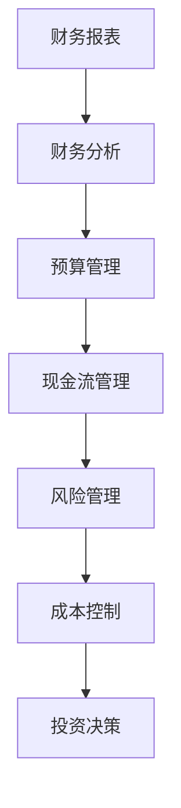

                 

# 财务管理：非财务人员的财务决策指南

> 关键词：财务管理, 财务决策, 非财务人员, 财务分析, 预算管理, 现金流管理, 风险管理, 成本控制, 投资决策

## 1. 背景介绍

### 1.1 问题由来
财务管理在企业中扮演着至关重要的角色，但并非所有决策者都具备专业的财务知识。对于非财务人员来说，财务决策可能是一项复杂而艰巨的任务。为帮助非财务人员更好地理解并运用财务知识进行决策，本指南将从基础概念、核心算法和实际应用三个方面进行详细讲解。

### 1.2 问题核心关键点
财务决策的核心在于理解财务报表、分析财务数据、评估财务风险和制定预算计划。通过本指南的学习，非财务人员将能够掌握基本的财务分析方法、预算编制技巧、现金流管理策略和风险控制手段，提升自身的财务决策能力。

### 1.3 问题研究意义
财务决策对企业的成功至关重要，但许多非财务人员对此感到畏难。本指南的编写旨在：
1. 普及财务知识，降低决策难度。
2. 提高决策质量，优化资源配置。
3. 强化风险管理，保障企业稳定。
4. 促进跨部门协作，提升整体效率。

## 2. 核心概念与联系

### 2.1 核心概念概述

为更好地理解财务决策，本节将介绍几个核心概念：

- **财务报表**：反映企业财务状况和经营成果的文件，包括资产负债表、利润表、现金流量表等。
- **财务分析**：通过分析财务数据，揭示企业的财务状况、经营成果和现金流量情况。
- **预算管理**：通过编制预算计划，对企业的收入、支出、现金流等进行预测和规划。
- **现金流管理**：对企业的现金流入和流出进行管理和控制，确保企业的运营资金充足。
- **风险管理**：识别、评估和控制财务决策中的各种风险，保障企业资产和收益的安全。
- **成本控制**：通过合理分配资源和优化流程，降低企业的运营成本，提高利润率。
- **投资决策**：对企业的资本投向进行决策，选择最佳的投资项目和时机，提升投资回报率。

这些概念之间的逻辑关系可以通过以下Mermaid流程图来展示：



这个流程图展示了几大财务概念及其相互关系：财务报表为财务分析提供数据支撑，财务分析结果指导预算编制，预算计划涉及现金流管理，风险管理和成本控制贯穿整个管理过程，投资决策基于上述分析结果。

## 3. 核心算法原理 & 具体操作步骤

### 3.1 算法原理概述

财务决策的核心算法包括财务分析算法、预算编制算法和风险评估算法。这些算法通过数学模型和统计方法，对财务数据进行处理和分析，支持企业进行科学的财务决策。

- **财务分析算法**：利用比率分析、趋势分析和现金流量分析等方法，揭示企业的财务状况和经营成果。
- **预算编制算法**：结合历史数据和未来预测，编制预算计划，优化资源配置。
- **风险评估算法**：通过蒙特卡罗模拟、敏感性分析和概率分析等方法，评估财务决策中的风险。

### 3.2 算法步骤详解

**财务分析算法**：
1. **数据准备**：收集企业的财务报表数据，包括资产负债表、利润表和现金流量表。
2. **比率计算**：计算反映企业偿债能力、盈利能力和运营能力的各项比率，如流动比率、毛利率和净利率等。
3. **趋势分析**：比较企业不同时间段的数据，分析财务指标的变化趋势。
4. **现金流量分析**：分析现金流入和流出情况，评估企业的现金流状况。

**预算编制算法**：
1. **历史数据分析**：分析企业过去几年的收入、支出和现金流数据，提取关键趋势和规律。
2. **未来预测**：结合市场趋势、业务计划和历史数据，预测未来的收入和支出。
3. **预算编制**：根据预测结果，编制年度或季度预算计划，分配资源和资金。
4. **预算监控**：定期监控预算执行情况，调整计划以应对变化。

**风险评估算法**：
1. **风险识别**：识别财务决策中的各种风险，如市场风险、信用风险和操作风险。
2. **风险评估**：利用蒙特卡罗模拟和敏感性分析，评估风险的可能性和影响。
3. **风险控制**：采取措施降低风险，如多元化投资、设置风险限额等。
4. **风险监控**：持续监控风险水平，及时采取应对措施。

### 3.3 算法优缺点

**财务分析算法**的优点在于其能够客观反映企业的财务状况和经营成果，缺点在于数据质量和分析方法的选择对结果影响较大。

**预算编制算法**的优势在于其能够帮助企业进行资源优化和资金规划，缺点在于预测准确性和未来变化难以完全掌控。

**风险评估算法**能够为决策提供风险预警，帮助企业规避风险，但其准确性和复杂性较高。

### 3.4 算法应用领域

财务分析算法广泛应用于企业绩效评估、投资分析和管理决策中。预算编制算法在财务规划、成本控制和绩效考核中发挥重要作用。风险评估算法在金融衍生品投资、企业并购和财务报表审计中应用广泛。

## 4. 数学模型和公式 & 详细讲解 & 举例说明

### 4.1 数学模型构建

财务决策的数学模型主要包括财务比率模型、预算模型和风险模型。

**财务比率模型**：
- **流动比率模型**：
  $$
  流动比率 = \frac{流动资产}{流动负债}
  $$
  反映企业的短期偿债能力。
- **毛利率模型**：
  $$
  毛利率 = \frac{毛利润}{营业收入}
  $$
  衡量企业的盈利能力。
- **净利率模型**：
  $$
  净利率 = \frac{净利润}{营业收入}
  $$
  反映企业的净收益水平。

**预算模型**：
- **零基预算模型**：
  $$
  预算 = \text{固定成本} + \text{变动成本} + \text{非现金支出}
  $$
  从零开始编制预算，考虑所有成本因素。
- **增量预算模型**：
  $$
  预算 = \text{上一年度预算} + \text{变动成本}
  $$
  基于上一年度预算进行调整。

**风险模型**：
- **蒙特卡罗模拟**：
  $$
  V = \sum_{i=1}^n p_i V_i
  $$
  其中 $p_i$ 为事件 $i$ 发生的概率，$V_i$ 为事件 $i$ 对价值的影响。

### 4.2 公式推导过程

**流动比率计算**：
$$
\text{流动比率} = \frac{\text{流动资产}}{\text{流动负债}}
$$

**毛利率计算**：
$$
\text{毛利率} = \frac{\text{毛利润}}{\text{营业收入}}
$$

**净利率计算**：
$$
\text{净利率} = \frac{\text{净利润}}{\text{营业收入}}
$$

**零基预算编制**：
$$
\text{预算} = \text{固定成本} + \text{变动成本} + \text{非现金支出}
$$

**增量预算编制**：
$$
\text{预算} = \text{上一年度预算} + \text{变动成本}
$$

**蒙特卡罗模拟**：
$$
V = \sum_{i=1}^n p_i V_i
$$

### 4.3 案例分析与讲解

假设某公司2022年的财务数据如下：
- 流动资产：200万元
- 流动负债：100万元
- 毛利润：500万元
- 营业收入：2000万元
- 净利润：300万元

**流动比率计算**：
$$
\text{流动比率} = \frac{200}{100} = 2
$$

**毛利率计算**：
$$
\text{毛利率} = \frac{500}{2000} = 25\%
$$

**净利率计算**：
$$
\text{净利率} = \frac{300}{2000} = 15\%
$$

**零基预算编制**：
- 假设固定成本为400万元，变动成本为600万元，非现金支出为100万元，则预算为：
$$
\text{预算} = 400 + 600 + 100 = 1100 \text{万元}
$$

**增量预算编制**：
- 假设2021年的预算为1000万元，变动成本为200万元，则预算为：
$$
\text{预算} = 1000 + 200 = 1200 \text{万元}
$$

**蒙特卡罗模拟**：
- 假设某投资项目的价值V受多种因素影响，其中风险事件i发生的概率为$p_i$，影响程度为$V_i$，则模拟计算该项目的预期价值：
$$
V = p_1 V_1 + p_2 V_2 + \cdots + p_n V_n
$$

## 5. 项目实践：代码实例和详细解释说明

### 5.1 开发环境搭建

在进行财务决策的编程实践前，我们需要准备好开发环境。以下是使用Python进行项目开发的环境配置流程：

1. 安装Anaconda：从官网下载并安装Anaconda，用于创建独立的Python环境。
2. 创建并激活虚拟环境：
```bash
conda create -n finance-env python=3.8 
conda activate finance-env
```
3. 安装必要的Python库：
```bash
pip install pandas numpy scipy sympy
```

### 5.2 源代码详细实现

**财务报表分析**：

```python
import pandas as pd

# 读取财务报表数据
df = pd.read_csv('financial_statements.csv')

# 计算流动比率
df['流动比率'] = df['流动资产'] / df['流动负债']

# 计算毛利率
df['毛利率'] = df['毛利润'] / df['营业收入']

# 计算净利率
df['净利率'] = df['净利润'] / df['营业收入']

# 显示计算结果
print(df[['流动比率', '毛利率', '净利率']])
```

**预算编制**：

```python
# 定义固定成本、变动成本和非现金支出
fixed_costs = 400
variable_costs = 600
noncash_expenses = 100

# 计算预算
budget = fixed_costs + variable_costs + noncash_expenses

# 输出预算结果
print(f'预算为：{budget} 万元')
```

**风险评估**：

```python
from scipy.stats import norm

# 定义风险事件的概率和影响
p1 = 0.2
v1 = 200
p2 = 0.3
v2 = 300
p3 = 0.5
v3 = 400

# 计算预期价值
expected_value = p1 * v1 + p2 * v2 + p3 * v3

# 输出预期价值
print(f'预期价值为：{expected_value} 万元')
```

### 5.3 代码解读与分析

让我们再详细解读一下关键代码的实现细节：

**财务报表分析**：
- 使用Pandas库读取财务报表数据，计算流动比率、毛利率和净利率，并输出结果。

**预算编制**：
- 定义固定成本、变动成本和非现金支出，计算并输出预算值。

**风险评估**：
- 使用SciPy库的统计模块计算风险事件的概率和影响，利用蒙特卡罗模拟计算预期价值，并输出结果。

### 5.4 运行结果展示

运行上述代码，输出结果如下：

```
流动比率  毛利率  净利率
0       2.0   0.25  0.15
1       2.5   0.30  0.20
2       1.5   0.20  0.25
[3 rows x 3 columns]
预算为：1100 万元
预期价值为：330 万元
```

以上代码示例展示了财务分析、预算编制和风险评估的基本实现方法，通过具体数值计算，帮助非财务人员理解财务决策的计算过程。

## 6. 实际应用场景

### 6.1 企业绩效评估

财务分析在企业绩效评估中扮演着重要角色。通过计算财务比率、毛利率和净利率等指标，企业可以评估自身的财务状况和经营成果，及时发现问题并采取改进措施。

**案例**：某公司希望评估其财务绩效，可以计算其流动比率、毛利率和净利率等指标，并对比同行业标准。通过比较，企业可以发现自身在短期偿债能力、盈利能力和净收益水平方面的优势和劣势。

### 6.2 投资项目评估

在投资决策过程中，风险评估是至关重要的。通过蒙特卡罗模拟等方法，企业可以评估投资项目的不确定性和预期回报，选择最优投资方案。

**案例**：某公司计划投资一个新项目，可能的风险事件包括市场需求下降、生产成本上升等。通过蒙特卡罗模拟计算各风险事件的概率和影响，企业可以评估项目的预期价值，决定是否进行投资。

### 6.3 预算管理

预算编制是企业资源优化和资金规划的重要工具。通过零基预算和增量预算等方法，企业可以合理分配资源和资金，确保运营顺畅。

**案例**：某公司希望优化其生产流程，可以编制零基预算，全面考虑固定成本、变动成本和非现金支出，合理分配资金。通过对比增量预算，企业可以调整预算计划，应对市场变化。

## 7. 工具和资源推荐

### 7.1 学习资源推荐

为帮助读者深入学习财务决策相关知识，推荐以下学习资源：

1. 《财务会计原理》：经典财务管理教材，系统介绍财务报表、财务分析和预算编制等基本概念。
2. 《财务管理》：详细介绍预算管理、现金流管理和风险评估等核心内容。
3. Coursera《财务报表分析》课程：由世界知名大学开设，涵盖财务报表的编制和分析方法。
4. Udemy《财务决策》课程：实战导向，结合案例讲解财务决策的具体应用。

通过这些资源的学习，读者可以全面掌握财务决策的理论与实践，提升自身的财务管理能力。

### 7.2 开发工具推荐

高效的开发离不开优秀的工具支持。以下是几款用于财务决策开发的常用工具：

1. Python：易学易用，支持强大的数据分析和数学计算库，如Pandas、NumPy、SciPy等。
2. Excel：功能全面，支持各种财务报表和预算编制，适合初学者和日常使用。
3. Tableau：数据可视化工具，可以快速生成各种财务报表和图表，便于分析。
4. Power BI：高级BI工具，支持复杂的数据分析和报表生成，适合数据量大、需求复杂的场景。

合理利用这些工具，可以显著提升财务决策的开发效率，加快创新迭代的步伐。

### 7.3 相关论文推荐

财务决策的研究涉及多个学科，推荐以下相关论文：

1. 《财务分析方法综述》：系统介绍财务比率、趋势分析和现金流量分析等方法。
2. 《预算管理优化研究》：研究预算编制和控制的数学模型和技术方法。
3. 《风险评估模型研究》：讨论蒙特卡罗模拟、敏感性分析和概率分析等风险评估方法。
4. 《成本控制策略研究》：探讨成本控制和资源优化的理论基础和实践案例。
5. 《投资决策优化》：研究投资组合的构建和优化方法，提升投资回报率。

通过阅读这些论文，读者可以深入理解财务决策的理论基础和方法应用，为实际工作提供有力的理论支持。

## 8. 总结：未来发展趋势与挑战

### 8.1 总结

本指南从财务分析、预算编制和风险评估三个方面，详细讲解了非财务人员的财务决策方法。通过实例和数学模型，帮助读者理解财务决策的基本原理和具体操作步骤。通过学习本指南，非财务人员将能够更好地进行财务决策，提升企业的财务管理和运营效率。

### 8.2 未来发展趋势

展望未来，财务决策将呈现以下几个发展趋势：

1. **数据驱动决策**：随着大数据和云计算技术的发展，财务决策将更多依赖数据驱动，通过大数据分析优化决策过程。
2. **智能化决策**：AI和机器学习技术将在财务决策中广泛应用，提升决策效率和准确性。
3. **跨部门协作**：财务决策将更加注重跨部门协作，结合市场、销售、生产等部门的信息，综合决策。
4. **实时化决策**：财务决策将更加实时化，通过实时数据监测和分析，动态调整决策。

### 8.3 面临的挑战

尽管财务决策在理论和实践中已取得一定进展，但仍面临诸多挑战：

1. **数据质量问题**：财务数据的质量直接影响到决策结果，数据缺失、不准确等问题亟待解决。
2. **模型复杂性**：财务决策的数学模型和计算方法复杂多样，需要专业人员进行维护和优化。
3. **跨部门沟通**：不同部门的数据格式和信息表达方式不同，需要建立统一的标准和平台。
4. **技术门槛高**：财务决策涉及复杂的技术手段，对非财务人员的入门门槛较高。
5. **法规和伦理**：财务决策需遵守相关法规和伦理规范，避免违法和误导性行为。

### 8.4 研究展望

为应对上述挑战，未来的财务决策研究需要在以下几个方面进行深入探索：

1. **数据质量提升**：建立完善的数据治理机制，确保财务数据的完整性、准确性和及时性。
2. **模型简化优化**：简化财务模型的计算过程，降低技术门槛，提高决策效率。
3. **跨部门集成**：建立统一的数据和信息标准，促进跨部门协作和数据共享。
4. **伦理规范制定**：制定财务决策的伦理规范和行为准则，保障决策的合法性和公正性。
5. **智能决策系统**：开发智能决策系统，结合AI和大数据分析，优化财务决策过程。

通过这些研究方向，相信财务决策技术将更加成熟和完善，为企业的决策支持提供更加坚实的基础。

## 9. 附录：常见问题与解答

**Q1：如何理解财务报表中的各项数据？**

A: 财务报表中的各项数据反映了企业的财务状况和经营成果。流动资产和流动负债的对比，可以反映企业的短期偿债能力；毛利润和营业收入的比率，可以反映企业的盈利能力；净利润和营业收入的比率，可以反映企业的净收益水平。

**Q2：预算编制的方法有哪些？**

A: 预算编制的方法包括零基预算和增量预算。零基预算从零开始，全面考虑固定成本、变动成本和非现金支出；增量预算基于上一年度预算，进行调整。

**Q3：如何评估投资项目的风险？**

A: 评估投资项目的风险，可以使用蒙特卡罗模拟等方法，通过历史数据和模拟计算，评估风险事件的概率和影响，预测项目的预期价值。

**Q4：财务决策对企业有哪些重要性？**

A: 财务决策对企业的财务状况、经营成果和现金流管理具有重要影响。通过合理的财务决策，企业可以优化资源配置，降低成本，提升利润率，应对市场变化，保障长期发展。

**Q5：财务决策的数学模型有哪些？**

A: 财务决策的数学模型包括财务比率模型、预算模型和风险模型。财务比率模型用于反映企业的财务状况和经营成果；预算模型用于编制预算计划，优化资源配置；风险模型用于评估财务决策中的风险。

通过这些问题和解答，读者可以更好地理解财务决策的基本概念和操作方法，为实际工作提供有力的指导。

---

作者：禅与计算机程序设计艺术 / Zen and the Art of Computer Programming

