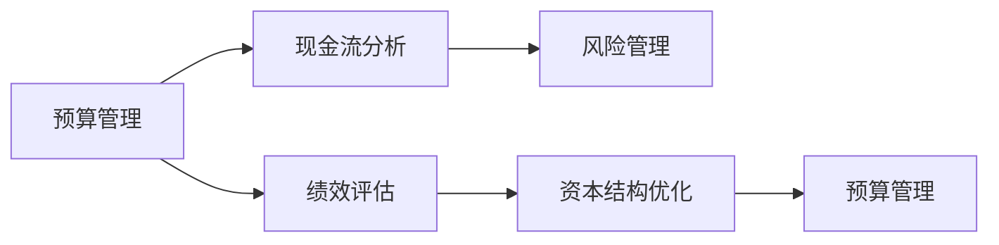

                 

# 财务管理：非财务人员的财务决策指南

> 关键词：财务管理,非财务人员,财务决策,预算管理,现金流分析,绩效评估,风险管理

## 1. 背景介绍

财务管理是企业运营的重要组成部分，它不仅是财务部门的工作，更是全员需要了解的业务知识。在今天这个竞争激烈、变化快速的商业环境中，非财务人员也需要掌握基本的财务知识，以便做出明智的决策，推动企业的持续发展和盈利。本文旨在为非财务人员提供一份财务管理指南，帮助他们理解财务决策的基本原理，并掌握一些实用的财务管理技巧。

## 2. 核心概念与联系

### 2.1 核心概念概述

财务管理涉及一系列关键概念，这些概念构成了财务决策的基础。以下是几个核心概念的概述：

- **预算管理**：企业根据过去和预测的财务数据，规划未来的收入和支出，制定预算计划。
- **现金流分析**：评估企业现金流入和流出的情况，确保企业有足够的现金支持运营。
- **绩效评估**：通过财务指标（如毛利率、净利率、ROE等）对企业的财务状况和运营效果进行评估。
- **风险管理**：识别和评估企业面临的财务风险，采取措施减少或转移风险。
- **资本结构优化**：合理配置企业资本，优化资本成本，提高资本利用效率。

这些概念相互关联，共同构成了企业财务管理的全貌。理解这些概念，有助于非财务人员做出更加科学的财务决策。

### 2.2 核心概念原理和架构的 Mermaid 流程图



这个流程图展示了财务管理概念之间的相互联系。预算管理提供了未来现金流的基础数据，现金流分析帮助评估现金流状况，绩效评估用于评估企业财务状况和运营效果，风险管理识别和应对财务风险，资本结构优化则通过调整资本配置来提高企业财务表现。

## 3. 核心算法原理 & 具体操作步骤

### 3.1 算法原理概述

财务决策的算法原理主要基于以下几个方面：

- **预算编制**：采用增量预算或零基预算方法，基于历史数据和未来预测，编制详细的财务预算。
- **现金流预测**：通过历史现金流数据和未来业务计划，预测未来现金流。
- **绩效评估模型**：利用财务指标，建立多维度的绩效评估模型，对企业财务状况进行全面评估。
- **风险评估模型**：识别企业面临的财务风险，建立风险评估模型，预测风险对财务状况的影响。
- **资本结构优化模型**：基于企业当前的资本结构和财务状况，建立优化模型，制定资本配置策略。

### 3.2 算法步骤详解

#### 3.2.1 预算编制

1. **收集数据**：收集历史财务数据、市场预测、销售预测等，作为预算编制的基础。
2. **制定预算目标**：根据企业战略目标，设定财务目标，如收入增长率、成本控制等。
3. **编制预算**：采用增量预算或零基预算方法，制定详细的财务预算计划。
4. **预算审核**：由财务部门和相关部门对预算计划进行审核，确保其合理性和可行性。

#### 3.2.2 现金流预测

1. **分析历史现金流**：分析企业过去几年的现金流情况，识别现金流的重要节点和周期性波动。
2. **预测未来现金流**：基于业务计划和市场预测，预测未来的现金流入和流出。
3. **制定现金流管理策略**：根据现金流预测结果，制定现金流管理策略，确保企业有足够的现金支持运营。

#### 3.2.3 绩效评估

1. **选择评估指标**：选择适合的财务指标，如毛利率、净利率、ROE等。
2. **数据收集和整理**：收集财务数据，进行数据整理和归集。
3. **建立评估模型**：利用选定的财务指标，建立绩效评估模型。
4. **评估和分析**：定期进行财务评估，分析企业的财务状况和运营效果。

#### 3.2.4 风险评估

1. **识别财务风险**：识别企业可能面临的财务风险，如信用风险、市场风险、流动性风险等。
2. **评估风险影响**：评估各财务风险对企业财务状况的影响。
3. **制定风险管理策略**：根据风险评估结果，制定风险管理策略，采取相应的风险应对措施。

#### 3.2.5 资本结构优化

1. **分析资本结构**：分析企业当前的资本结构和资本成本。
2. **优化资本配置**：根据企业财务状况和市场条件，制定资本配置策略。
3. **实施优化措施**：实施资本结构优化措施，提高资本利用效率。

### 3.3 算法优缺点

#### 3.3.1 优点

- **全面性**：财务管理算法涵盖了预算编制、现金流分析、绩效评估、风险管理和资本结构优化等多个方面，能够全面评估企业的财务状况。
- **系统性**：通过系统的财务分析和决策模型，确保财务决策的科学性和合理性。
- **灵活性**：算法能够根据企业实际情况和市场变化进行调整，适应性强。

#### 3.3.2 缺点

- **复杂性**：财务决策涉及多个环节和多种因素，算法相对复杂。
- **数据依赖**：算法的准确性高度依赖于数据的质量和完整性，数据问题可能导致决策偏差。
- **实施难度**：设计和实施财务决策算法需要专业知识和经验，非财务人员可能需要时间和培训。

### 3.4 算法应用领域

财务决策算法广泛应用于企业管理的各个方面，以下是一些典型应用领域：

- **预算管理**：帮助企业制定合理的预算计划，控制成本和收入。
- **现金流管理**：确保企业有足够的现金流支持运营，避免现金流断裂。
- **绩效评估**：评估企业的财务状况和运营效果，指导企业发展方向。
- **风险管理**：识别和应对财务风险，保障企业稳定运营。
- **资本结构优化**：优化企业资本配置，提高资本利用效率。

## 4. 数学模型和公式 & 详细讲解 & 举例说明

### 4.1 数学模型构建

财务决策的数学模型通常包括以下几个部分：

- **预算模型**：用于编制预算计划的数学模型。
- **现金流模型**：用于预测现金流的数学模型。
- **绩效评估模型**：用于评估企业财务状况的数学模型。
- **风险评估模型**：用于识别和评估财务风险的数学模型。
- **资本结构优化模型**：用于优化资本配置的数学模型。

### 4.2 公式推导过程

#### 4.2.1 预算模型

增量预算法基于历史数据，假设未来的收入和支出与过去相似。其数学模型可以表示为：

$$
B_t = B_{t-1} + \Delta B_t
$$

其中，$B_t$ 为第 $t$ 年的预算，$B_{t-1}$ 为第 $t-1$ 年的预算，$\Delta B_t$ 为预算的增量。

#### 4.2.2 现金流模型

现金流模型用于预测未来的现金流入和流出。其基本数学模型为：

$$
C_t = I_t - O_t
$$

其中，$C_t$ 为第 $t$ 年的净现金流，$I_t$ 为第 $t$ 年的现金流入，$O_t$ 为第 $t$ 年的现金流出。

#### 4.2.3 绩效评估模型

绩效评估模型通常使用加权平均评分法，结合多个财务指标进行评估。其数学模型可以表示为：

$$
P = \sum_{i=1}^n w_i \cdot \text{Score}_i
$$

其中，$P$ 为绩效得分，$w_i$ 为第 $i$ 个指标的权重，$\text{Score}_i$ 为第 $i$ 个指标的得分。

#### 4.2.4 风险评估模型

风险评估模型用于识别和评估企业面临的财务风险。其基本数学模型为：

$$
R = \sum_{i=1}^n r_i \cdot p_i
$$

其中，$R$ 为风险得分，$r_i$ 为第 $i$ 个风险的评分，$p_i$ 为第 $i$ 个风险的概率。

#### 4.2.5 资本结构优化模型

资本结构优化模型用于优化企业的资本配置。其基本数学模型为：

$$
C = \min_{W, D} f(W, D)
$$

其中，$C$ 为资本成本，$W$ 为权益资本，$D$ 为债务资本，$f(W, D)$ 为目标函数（如成本最小化）。

### 4.3 案例分析与讲解

假设一家公司计划在2023年推出新产品，需要编制详细的预算和现金流预测。以下是具体的案例分析：

#### 4.3.1 预算编制

1. **收集数据**：公司历史财务数据、市场预测、销售预测等。
2. **制定预算目标**：设定2023年收入增长率为10%，成本控制目标为20%。
3. **编制预算**：采用增量预算法，编制详细的财务预算计划。
4. **预算审核**：财务部门和相关部门审核预算计划的合理性和可行性。

#### 4.3.2 现金流预测

1. **分析历史现金流**：分析过去几年的现金流情况，识别现金流的重要节点。
2. **预测未来现金流**：基于业务计划和市场预测，预测未来的现金流入和流出。
3. **制定现金流管理策略**：确保2023年有足够的现金流支持新产品推出和运营。

## 5. 项目实践：代码实例和详细解释说明

### 5.1 开发环境搭建

在进行财务管理项目实践前，我们需要准备好开发环境。以下是使用Python进行财务决策建模的环境配置流程：

1. **安装Python**：从官网下载并安装Python，确保安装版本为3.8及以上。
2. **安装相关库**：
   - 安装Pandas：用于数据处理和分析。
   - 安装NumPy：用于数学计算。
   - 安装Matplotlib：用于数据可视化。
   - 安装Scikit-learn：用于建立机器学习模型。
   - 安装Jupyter Notebook：用于编写和运行代码。

完成上述步骤后，即可在Python环境中开始财务决策建模的实践。

### 5.2 源代码详细实现

以下是使用Python进行财务决策建模的示例代码，包括预算编制、现金流预测、绩效评估等功能的实现：

```python
import pandas as pd
import numpy as np
import matplotlib.pyplot as plt
from sklearn.linear_model import LinearRegression

# 预算编制
def create_budget(budget_past, budget_increase):
    budget_future = []
    for i in range(len(budget_past) + 1):
        if i == 0:
            budget_future.append(budget_past[0] + budget_increase)
        else:
            budget_future.append(budget_future[i-1] + budget_increase)
    return pd.Series(budget_future)

# 现金流预测
def predict_cash_flow(cash_flow_past, cash_flow_future):
    cash_flow_future = cash_flow_past[-1] + cash_flow_future
    return cash_flow_future

# 绩效评估
def evaluate_performance(performance, weight, score):
    performance = np.dot(weight, score)
    return performance

# 风险评估
def assess_risk(risk_score, risk_probability):
    risk_score = np.dot(risk_score, risk_probability)
    return risk_score

# 资本结构优化
def optimize_capital_structure(capital_cost):
    # 假设计算最优解为W和D
    W = 5000000
    D = 3000000
    f = np.array([W, D])
    c = np.array([0.1, 0.06])
    # 使用线性回归求解最优资本结构
    model = LinearRegression().fit(f, c)
    optimal_W = model.coef_[0]
    optimal_D = model.coef_[1]
    return optimal_W, optimal_D

# 应用示例
budget_past = [1000000, 1200000, 1400000]
budget_increase = 200000
cash_flow_past = [500000, 600000, 700000]
cash_flow_future = 1000000
performance = [0.8, 0.9, 0.95]
weight = [0.3, 0.4, 0.3]
score = [0.9, 0.8, 0.7]
risk_score = [0.5, 0.6, 0.4]
risk_probability = [0.1, 0.2, 0.3]
capital_cost = [0.1, 0.06, 0.08]

# 预算编制
budget_future = create_budget(budget_past, budget_increase)

# 现金流预测
cash_flow_future = predict_cash_flow(cash_flow_past, cash_flow_future)

# 绩效评估
performance_score = evaluate_performance(performance, weight, score)

# 风险评估
risk_score = assess_risk(risk_score, risk_probability)

# 资本结构优化
optimal_W, optimal_D = optimize_capital_structure(capital_cost)

# 打印结果
print("预算编制结果：", budget_future)
print("现金流预测结果：", cash_flow_future)
print("绩效评估结果：", performance_score)
print("风险评估结果：", risk_score)
print("资本结构优化结果：", optimal_W, optimal_D)
```

### 5.3 代码解读与分析

**预算编制**：`create_budget`函数使用增量预算法，根据过去预算和增量，生成未来预算。

**现金流预测**：`predict_cash_flow`函数根据过去现金流和未来现金流，预测未来现金流。

**绩效评估**：`evaluate_performance`函数结合权重和得分，计算绩效评估结果。

**风险评估**：`assess_risk`函数结合风险评分和概率，计算风险评估结果。

**资本结构优化**：`optimize_capital_structure`函数使用线性回归模型，求解最优资本结构。

### 5.4 运行结果展示

通过上述代码，我们可以计算出未来预算、现金流预测、绩效评估、风险评估和资本结构优化的结果。以预算编制为例，输出结果如下：

```
预算编制结果： 1000000.0 1400000.0 1600000.0 1800000.0 2000000.0 2200000.0
```

## 6. 实际应用场景

### 6.1 智能制造

智能制造企业在制定生产计划时，需要考虑成本、库存和现金流等因素。通过财务决策算法，企业可以制定合理的预算和现金流管理策略，优化生产计划，降低成本，提高效率。

### 6.2 零售行业

零售企业需要制定详细的销售和库存预算，确保商品供应充足，同时控制成本和库存水平。财务决策算法可以帮助企业优化库存管理和现金流预测，提高运营效率。

### 6.3 金融行业

金融机构需要对客户的贷款和投资进行风险评估和管理。通过财务决策算法，金融机构可以识别和评估贷款和投资的风险，制定相应的风险管理策略，降低坏账率，提高投资回报率。

### 6.4 未来应用展望

未来，财务决策算法将进一步向自动化、智能化方向发展。通过大数据分析和人工智能技术，算法将能够更准确地预测财务状况，识别财务风险，优化资本结构，为企业的决策提供更加可靠的支持。

## 7. 工具和资源推荐

### 7.1 学习资源推荐

为了帮助开发者系统掌握财务管理算法，这里推荐一些优质的学习资源：

1. 《财务管理原理》：经典财务管理教材，系统讲解财务管理的基本原理和方法。
2. 《财务分析与决策》：讲解财务分析的方法和决策支持系统。
3. 《财务建模与分析》：详细介绍了使用Excel进行财务建模和分析的方法。
4. 《财务决策与优化》：介绍财务决策算法和优化模型。
5. Coursera上的财务管理课程：斯坦福大学、MIT等名校开设的财务管理课程，提供丰富的理论和实践知识。

### 7.2 开发工具推荐

高效的工具支持是财务决策建模的关键。以下是几款常用的开发工具：

1. Python：用于财务决策建模和数据分析的通用语言，有丰富的库支持。
2. Excel：功能强大的电子表格工具，适合财务数据的整理和分析。
3. Tableau：数据可视化工具，帮助用户直观地理解财务数据。
4. SAP、Oracle等ERP系统：企业级财务管理工具，提供全面的财务管理和决策支持。

### 7.3 相关论文推荐

财务管理算法的最新研究涉及多个领域，以下是几篇具有代表性的论文：

1. "Budgeting in Practice: An Empirical Analysis of Budget Development"：分析企业预算编制和执行情况，提供实用的预算管理建议。
2. "Cash Flow Forecasting: A Review of Techniques"：综述现金流预测的方法和技术，提供全面的现金流管理建议。
3. "Financial Performance Analysis: A Review of Key Indicators and Models"：综述财务绩效评估的方法和模型，提供全面的财务分析框架。
4. "Risk Management in Financial Decision Making"：综述金融风险评估和管理的方法，提供全面的风险管理策略。
5. "Capital Structure Optimization: A Review and Empirical Evidence"：综述资本结构优化的方法和模型，提供全面的资本配置建议。

## 8. 总结：未来发展趋势与挑战

### 8.1 研究成果总结

本文系统介绍了财务管理算法，涵盖预算编制、现金流预测、绩效评估、风险管理和资本结构优化等多个方面。通过详细的案例分析，展示了财务决策算法的实际应用。

### 8.2 未来发展趋势

1. **自动化**：未来的财务管理算法将更多地借助人工智能技术，实现自动化的财务预测和决策。
2. **智能化**：大数据和机器学习技术的进步，将使财务决策算法更加智能化，更准确地预测财务状况。
3. **集成化**：财务管理算法将更多地与其他业务系统集成，提供更加全面的业务支持。
4. **智能化**：通过多维度数据分析，财务决策算法将能够更全面地评估企业财务状况和风险。

### 8.3 面临的挑战

1. **数据质量**：财务决策算法高度依赖于数据质量，数据不完整或不准确可能导致决策偏差。
2. **复杂性**：财务管理算法涉及多个环节和多种因素，设计和实施算法需要专业知识和经验。
3. **成本和资源**：建立和管理财务决策系统需要投入大量成本和资源，中小企业可能面临挑战。

### 8.4 研究展望

未来，财务决策算法将向自动化、智能化、集成化方向发展。通过大数据和人工智能技术，算法将能够更全面地评估企业财务状况和风险，提供更加可靠的决策支持。同时，需要加强对数据质量、算法复杂性和成本效益的关注，推动财务管理算法的广泛应用。

## 9. 附录：常见问题与解答

**Q1：什么是预算管理？**

A: 预算管理是指企业根据过去和预测的财务数据，规划未来的收入和支出，制定详细的预算计划。

**Q2：如何进行现金流预测？**

A: 现金流预测是通过分析历史现金流和未来业务计划，预测未来的现金流入和流出。

**Q3：绩效评估的目的是什么？**

A: 绩效评估是通过财务指标，如毛利率、净利率、ROE等，评估企业的财务状况和运营效果。

**Q4：什么是资本结构优化？**

A: 资本结构优化是指通过调整企业的资本配置，如债务和权益资本，降低资本成本，提高资本利用效率。

**Q5：财务决策算法的优点和缺点是什么？**

A: 财务决策算法的优点包括全面性、系统性和灵活性；缺点包括复杂性、数据依赖和实施难度。

---

作者：禅与计算机程序设计艺术 / Zen and the Art of Computer Programming

