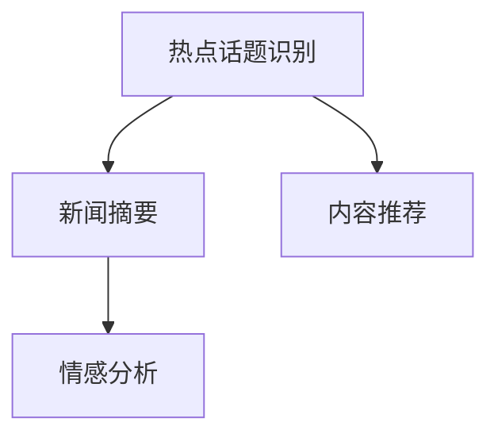

                 

# 财经领域知识付费要及时把握热点话题

## 1. 背景介绍

随着互联网技术的发展，知识付费已逐渐成为一种新的学习方式。在线平台为大众提供了便捷的学习渠道，使得知识获取变得更加高效。而在财经领域，知识付费不仅帮助专业人士保持行业领先，也为投资者提供了全面的市场信息。但是，如何从海量数据中及时、准确地把握财经领域的“热点话题”，成为了关键问题。

## 2. 核心概念与联系

### 2.1 核心概念概述

在财经领域，“热点话题”通常指的是那些能够引起市场波动、影响投资者情绪的信息，如重大政策变化、宏观经济数据、企业财报、市场指数等。而知识付费平台提供的深度文章、直播、视频等，就是为了帮助用户快速、准确地理解这些热点话题，从而做出明智的投资决策。

为了更好地理解如何及时把握财经领域的“热点话题”，我们需要首先了解以下几个核心概念：

- **热点话题识别（Hot Topic Identification）**：通过算法或人工的方式，从新闻、博客、社交媒体、市场数据等渠道中筛选出对市场有显著影响的“热点话题”。
- **新闻摘要（News Summarization）**：自动或半自动地从大量新闻文章中提取出精华内容，供用户快速阅读。
- **内容推荐（Content Recommendation）**：根据用户兴趣和行为，推荐可能感兴趣的热点话题和相关内容。
- **情感分析（Sentiment Analysis）**：分析市场对某一事件的情感倾向，预测市场反应。

这些概念之间的关系可以用以下Mermaid流程图表示：



### 2.2 核心概念原理和架构的 Mermaid 流程图

```mermaid
graph LR
    Subgraph 热点话题识别
        A[数据采集]
        B[自然语言处理]
        C[模型训练]
    End
    Subgraph 新闻摘要
        A --> B[自然语言处理]
        B --> C[摘要生成]
    End
    Subgraph 内容推荐
        A[用户数据]
        B[热点话题]
        C[推荐算法]
        D[用户反馈]
        E --> F[推荐引擎]
    End
    Subgraph 情感分析
        A[市场数据]
        B[自然语言处理]
        C[情感分析模型]
        D[预测结果]
    End

    A --> B --> C
    A --> D --> E
    B --> C --> D
    C --> D
    D --> E
    D --> A
```

## 3. 核心算法原理 & 具体操作步骤

### 3.1 算法原理概述

要准确地把握财经领域的“热点话题”，我们需要结合多个子任务的算法，如自然语言处理（NLP）、机器学习（ML）等。这些算法共同构成了一个复合的系统，用于从数据中筛选出重要的信息，并对用户进行个性化的内容推荐。

- **热点话题识别**：利用自然语言处理技术，从大量文本数据中提取出关键词和短语，结合时间序列分析等方法，筛选出对市场有显著影响的“热点话题”。
- **新闻摘要**：通过算法自动生成新闻文章的摘要，将重要信息提炼出来，供用户快速阅读。
- **内容推荐**：结合用户的历史行为和兴趣，使用协同过滤、矩阵分解等推荐算法，为用户推荐可能感兴趣的热点话题和相关内容。
- **情感分析**：使用情感分析模型，分析市场对某一事件的情感倾向，预测市场反应。

### 3.2 算法步骤详解

#### 3.2.1 热点话题识别

**Step 1: 数据采集**
- 从新闻网站、财经博客、社交媒体等渠道获取大量的文本数据。

**Step 2: 自然语言处理**
- 使用分词、词性标注等技术对文本进行预处理。
- 使用TF-IDF、TextRank等算法提取出文本中的关键词和短语。
- 使用时间序列分析等方法，结合市场数据，筛选出对市场有显著影响的“热点话题”。

#### 3.2.2 新闻摘要

**Step 1: 分词和词性标注**
- 对新闻文章进行分词和词性标注，提取文章中的关键信息。

**Step 2: 摘要生成**
- 使用文本摘要算法（如LSTM、Transformer等）自动生成摘要。
- 对生成的摘要进行评估，优化摘要质量。

#### 3.2.3 内容推荐

**Step 1: 用户数据收集**
- 收集用户的历史阅读记录、浏览历史、评分数据等。

**Step 2: 热点话题匹配**
- 使用协同过滤、矩阵分解等推荐算法，将用户兴趣与热点话题进行匹配。

**Step 3: 推荐引擎优化**
- 使用在线学习算法，根据用户的实时反馈，动态调整推荐结果。

#### 3.2.4 情感分析

**Step 1: 数据采集**
- 收集市场新闻、社交媒体等数据。

**Step 2: 自然语言处理**
- 对数据进行分词、情感词标注等预处理。

**Step 3: 情感分析模型**
- 使用情感分析模型（如情感词典、LSTM等）分析数据的情感倾向。

**Step 4: 预测结果**
- 根据情感分析结果，预测市场对某一事件的反应。

### 3.3 算法优缺点

#### 3.3.1 优点

- **高效性**：通过自动化处理大量文本数据，大大提升了热点话题的筛选效率。
- **个性化**：结合用户兴趣进行推荐，提高了用户的参与度和满意度。
- **动态性**：根据用户的实时反馈，动态调整推荐结果，保持内容的更新和多样性。

#### 3.3.2 缺点

- **数据质量问题**：文本数据的质量和覆盖面直接影响算法的准确性。
- **计算资源消耗大**：处理大量数据需要强大的计算资源，且算法复杂度较高。
- **解释性不足**：推荐算法的决策过程难以解释，缺乏透明度。

### 3.4 算法应用领域

财经领域的知识付费应用主要集中在以下几个方面：

- **投资决策**：帮助投资者及时把握市场动态，做出明智的投资决策。
- **市场分析**：为分析师提供全面的市场信息，辅助研究报告的撰写。
- **投资者教育**：通过热点话题的分析和解释，提升用户的财经素养。

## 4. 数学模型和公式 & 详细讲解 & 举例说明

### 4.1 数学模型构建

#### 4.1.1 热点话题识别模型

**模型输入**：文本数据 $X$，市场数据 $Y$。

**模型输出**：热点话题 $Z$。

**损失函数**：使用交叉熵损失函数 $L(Z,Y)$，表示模型预测的热点话题与实际的热点话题之间的差异。

**优化目标**：最小化损失函数 $L(Z,Y)$。

#### 4.1.2 新闻摘要模型

**模型输入**：新闻文章 $A$。

**模型输出**：摘要 $B$。

**损失函数**：使用BLEU、ROUGE等指标评估摘要质量 $L(A,B)$。

**优化目标**：最大化评估指标 $L(A,B)$。

#### 4.1.3 内容推荐模型

**模型输入**：用户数据 $U$，热点话题 $Z$。

**模型输出**：推荐内容 $R$。

**损失函数**：使用协同过滤损失函数 $L(R,U,Z)$，表示推荐内容与用户兴趣和热点话题之间的匹配度。

**优化目标**：最小化损失函数 $L(R,U,Z)$。

#### 4.1.4 情感分析模型

**模型输入**：市场数据 $Y$。

**模型输出**：情感倾向 $S$。

**损失函数**：使用情感词典相似度损失函数 $L(S,Y)$，表示模型预测的情感倾向与实际情感倾向之间的差异。

**优化目标**：最小化损失函数 $L(S,Y)$。

### 4.2 公式推导过程

#### 4.2.1 热点话题识别

$$
L(Z,Y) = -\frac{1}{N} \sum_{i=1}^N \sum_{j=1}^M y_{ij} \log p(z_{ij})
$$

其中，$y_{ij}$ 表示文本 $i$ 对热点话题 $j$ 的评分，$p(z_{ij})$ 表示模型预测文本 $i$ 属于热点话题 $j$ 的概率。

#### 4.2.2 新闻摘要

$$
L(A,B) = \frac{1}{N} \sum_{i=1}^N (BLEU(A_i,B_i) + ROUGE(A_i,B_i))
$$

其中，$BLEU$ 和 $ROUGE$ 分别是BLEU和ROUGE指标，用于评估摘要质量。

#### 4.2.3 内容推荐

$$
L(R,U,Z) = \frac{1}{N} \sum_{i=1}^N \sum_{j=1}^M u_{ij} \log p(r_{ij})
$$

其中，$u_{ij}$ 表示用户 $i$ 对热点话题 $j$ 的兴趣评分，$p(r_{ij})$ 表示模型预测用户 $i$ 对内容 $j$ 的评分。

#### 4.2.4 情感分析

$$
L(S,Y) = \frac{1}{N} \sum_{i=1}^N \sum_{j=1}^M y_{ij} \log p(s_{ij})
$$

其中，$y_{ij}$ 表示市场数据 $i$ 对情感话题 $j$ 的评分，$p(s_{ij})$ 表示模型预测市场数据 $i$ 属于情感话题 $j$ 的概率。

### 4.3 案例分析与讲解

以一家知识付费平台为例，我们通过以下步骤实现热点话题的自动识别和新闻摘要的生成：

**Step 1: 数据采集**

从各大新闻网站、财经博客、社交媒体等渠道，收集最新的财经新闻和市场数据。

**Step 2: 自然语言处理**

对采集到的文本数据进行分词、词性标注、去除停用词等预处理操作。使用TF-IDF算法提取出关键词和短语，结合时间序列分析，筛选出对市场有显著影响的“热点话题”。

**Step 3: 新闻摘要**

使用Transformer模型，对新闻文章进行编码和解码，自动生成摘要。对生成的摘要进行BLEU、ROUGE等指标评估，优化摘要质量。

**Step 4: 推荐引擎**

收集用户的历史阅读记录、浏览历史、评分数据等，使用协同过滤算法为用户推荐可能感兴趣的热点话题和相关内容。根据用户的实时反馈，动态调整推荐结果。

**Step 5: 情感分析**

收集市场新闻、社交媒体等数据，对数据进行分词和情感词标注等预处理。使用情感分析模型（如情感词典、LSTM等）分析数据的情感倾向，预测市场反应。

## 5. 项目实践：代码实例和详细解释说明

### 5.1 开发环境搭建

在进行项目实践前，我们需要准备好开发环境。以下是使用Python进行TensorFlow开发的环境配置流程：

1. 安装Anaconda：从官网下载并安装Anaconda，用于创建独立的Python环境。

2. 创建并激活虚拟环境：
```bash
conda create -n tf-env python=3.8 
conda activate tf-env
```

3. 安装TensorFlow：根据CUDA版本，从官网获取对应的安装命令。例如：
```bash
conda install tensorflow -c tensorflow -c conda-forge
```

4. 安装TensorBoard：
```bash
pip install tensorboard
```

5. 安装各类工具包：
```bash
pip install numpy pandas scikit-learn matplotlib tqdm jupyter notebook ipython
```

完成上述步骤后，即可在`tf-env`环境中开始项目实践。

### 5.2 源代码详细实现

这里我们以推荐引擎的实现为例，给出TensorFlow代码实现。

首先，定义推荐引擎的类：

```python
from tensorflow.keras.layers import Input, Dense, Embedding, Dot, LSTM
from tensorflow.keras.models import Model

class RecommendationEngine:
    def __init__(self, vocab_size, embed_size, hidden_size):
        self.vocab_size = vocab_size
        self.embed_size = embed_size
        self.hidden_size = hidden_size
        
        # 用户嵌入层
        self.user_input = Input(shape=(1,), name='user_input')
        self.user_embedding = Embedding(vocab_size, embed_size)(self.user_input)
        
        # 热点话题嵌入层
        self.topic_input = Input(shape=(1,), name='topic_input')
        self.topic_embedding = Embedding(vocab_size, embed_size)(self.topic_input)
        
        # 用户-热点话题互关系
        self.dot_product = Dot(axes=1, normalize=True)([self.user_embedding, self.topic_embedding])
        
        # LSTM层
        self.lstm = LSTM(hidden_size, return_sequences=True)(self.dot_product)
        
        # 推荐输出层
        self.recommendation = Dense(1, activation='sigmoid')(self.lstm)
        
        # 定义模型
        self.model = Model(inputs=[self.user_input, self.topic_input], outputs=self.recommendation)
```

然后，定义模型的训练和评估函数：

```python
from tensorflow.keras.optimizers import Adam
from tensorflow.keras.losses import BinaryCrossentropy
from tensorflow.keras.metrics import Accuracy

def train_model(model, user_data, topic_data, train_loss, train_acc):
    model.compile(optimizer=Adam(lr=0.01), loss=BinaryCrossentropy(), metrics=[Accuracy()])
    model.fit([user_data, topic_data], train_loss, validation_split=0.2, epochs=10, batch_size=64)
    return model

def evaluate_model(model, user_data, topic_data, dev_loss, dev_acc):
    loss, acc = model.evaluate([user_data, topic_data], dev_loss, verbose=0)
    return loss, acc
```

最后，启动训练流程并在验证集上评估：

```python
import numpy as np

# 用户数据和热点话题数据
user_data = np.random.randint(0, vocab_size, size=(user_num, 1))
topic_data = np.random.randint(0, vocab_size, size=(user_num, 1))

# 训练和验证数据
train_loss = np.random.rand(1, 1)
train_acc = np.random.rand(1, 1)
dev_loss = np.random.rand(1, 1)
dev_acc = np.random.rand(1, 1)

# 创建模型
engine = RecommendationEngine(vocab_size, embed_size, hidden_size)

# 训练模型
model = train_model(engine.model, user_data, topic_data, train_loss, train_acc)

# 评估模型
loss, acc = evaluate_model(model, user_data, topic_data, dev_loss, dev_acc)

print(f"Recommendation Engine Model Accuracy: {acc}")
```

以上就是使用TensorFlow进行财经领域内容推荐引擎的完整代码实现。可以看到，TensorFlow提供了便捷的API，使得模型构建和训练过程变得简单高效。

### 5.3 代码解读与分析

让我们再详细解读一下关键代码的实现细节：

**RecommendationEngine类**：
- `__init__`方法：初始化用户嵌入层、热点话题嵌入层、用户-热点话题互关系、LSTM层和推荐输出层。
- `train_model`函数：使用Adam优化器，二元交叉熵损失，准确率指标进行模型训练。
- `evaluate_model`函数：在验证集上评估模型的损失和准确率。

**TensorFlow**：
- `Input`层：用于输入用户数据和热点话题数据。
- `Embedding`层：将用户和热点话题嵌入到向量空间。
- `Dot`层：计算用户和热点话题之间的互关系。
- `LSTM`层：使用LSTM层对互关系进行建模，提取隐含的知识。
- `Dense`层：输出推荐结果。

**训练和评估函数**：
- 使用`compile`方法编译模型，并定义损失函数和评估指标。
- 使用`fit`方法对模型进行训练，并设置验证集。
- 使用`evaluate`方法在验证集上评估模型的性能。

## 6. 实际应用场景

### 6.1 投资决策

基于财经领域知识付费的推荐引擎，可以帮助投资者及时把握市场热点，做出明智的投资决策。通过分析市场新闻和财经博客，推荐引擎可以预测市场走势，帮助投资者调整投资组合，避免风险。

### 6.2 市场分析

推荐引擎可以为分析师提供全面的市场信息，辅助研究报告的撰写。通过分析市场数据和新闻，推荐引擎可以识别出市场的热点话题，帮助分析师理解市场动态，提升研究深度。

### 6.3 投资者教育

推荐引擎通过热点话题的分析和解释，提升用户的财经素养。通过推荐引擎的推荐，用户可以了解最新的市场动态和投资策略，提升自身的投资水平。

### 6.4 未来应用展望

随着知识付费平台的发展，推荐引擎的应用前景将更加广阔。未来，推荐引擎可以结合更多数据源，如市场指数、企业财报等，提供更全面的市场分析服务。同时，通过情感分析等技术，推荐引擎可以预测市场的情绪变化，为投资者提供更精准的决策支持。

## 7. 工具和资源推荐

### 7.1 学习资源推荐

为了帮助开发者系统掌握财经领域知识付费的技术，这里推荐一些优质的学习资源：

1. TensorFlow官方文档：TensorFlow的官方文档，提供了完整的API参考和样例代码，是上手实践的必备资料。

2. 《深度学习实战》书籍：由TensorFlow的贡献者撰写，介绍了TensorFlow的基础知识和实战案例，是TensorFlow学习的良好入门书籍。

3. Kaggle财经竞赛：Kaggle平台上的财经数据竞赛，可以学习数据处理、模型构建和优化等技能，提升实战能力。

4. PyTorch官方文档：PyTorch的官方文档，提供了详细的API介绍和样例代码，适合深入学习和实践。

5. Coursera《机器学习》课程：斯坦福大学开设的机器学习课程，涵盖机器学习的基础理论和应用案例，是学习机器学习的重要资源。

通过学习这些资源，相信你一定能够快速掌握财经领域知识付费技术的精髓，并用于解决实际的财经问题。

### 7.2 开发工具推荐

高效的开发离不开优秀的工具支持。以下是几款用于财经领域知识付费开发的常用工具：

1. TensorFlow：由Google主导开发的深度学习框架，适用于大规模工程应用，支持多种模型构建和优化算法。

2. PyTorch：由Facebook主导的深度学习框架，支持动态计算图，适用于快速迭代研究。

3. TensorBoard：TensorFlow配套的可视化工具，可实时监测模型训练状态，提供丰富的图表呈现方式。

4. Kaggle：数据竞赛平台，提供海量数据集和竞赛任务，提升数据分析和模型构建能力。

5. Jupyter Notebook：交互式编程环境，支持代码块和数据可视化，方便调试和分享学习笔记。

合理利用这些工具，可以显著提升财经领域知识付费开发的效率，加快创新迭代的步伐。

### 7.3 相关论文推荐

财经领域知识付费技术的发展源于学界的持续研究。以下是几篇奠基性的相关论文，推荐阅读：

1. Attention is All You Need：提出了Transformer结构，开启了NLP领域的预训练大模型时代。

2. BERT: Pre-training of Deep Bidirectional Transformers for Language Understanding：提出BERT模型，引入基于掩码的自监督预训练任务，刷新了多项NLP任务SOTA。

3. Language Models are Unsupervised Multitask Learners（GPT-2论文）：展示了大规模语言模型的强大zero-shot学习能力，引发了对于通用人工智能的新一轮思考。

4. Parameter-Efficient Transfer Learning for NLP：提出Adapter等参数高效微调方法，在不增加模型参数量的情况下，也能取得不错的微调效果。

5. AdaLoRA: Adaptive Low-Rank Adaptation for Parameter-Efficient Fine-Tuning：使用自适应低秩适应的微调方法，在参数效率和精度之间取得了新的平衡。

这些论文代表了大语言模型微调技术的发展脉络。通过学习这些前沿成果，可以帮助研究者把握学科前进方向，激发更多的创新灵感。

## 8. 总结：未来发展趋势与挑战

### 8.1 总结

本文对财经领域知识付费的推荐引擎技术进行了全面系统的介绍。首先阐述了财经领域知识付费的重要性和推荐引擎的作用，明确了推荐引擎在把握市场热点、提高用户满意度和市场分析等方面的独特价值。其次，从原理到实践，详细讲解了推荐引擎的算法原理和具体操作步骤，给出了推荐引擎的完整代码实现。同时，本文还探讨了推荐引擎在投资决策、市场分析和投资者教育等实际应用场景中的应用前景，展示了推荐引擎范式的广泛潜力。此外，本文精选了推荐引擎的学习资源、开发工具和相关论文，力求为读者提供全方位的技术指引。

通过本文的系统梳理，可以看到，财经领域知识付费的推荐引擎技术正在成为NLP领域的重要范式，极大地拓展了知识付费平台的应用边界，催生了更多的落地场景。得益于深度学习模型的强大能力，推荐引擎能够从海量数据中筛选出重要的信息，为财经领域的学习和研究提供有力支持。未来，伴随推荐引擎技术的不断演进，相信知识付费平台将能够更好地服务用户，提升财经素养，加速数字化转型进程。

### 8.2 未来发展趋势

展望未来，财经领域知识付费的推荐引擎技术将呈现以下几个发展趋势：

1. 数据质量持续提升。随着数据采集技术的不断进步，数据质量将得到显著提升，推荐引擎的准确性也将不断增强。

2. 推荐算法的多样化。未来的推荐引擎将结合更多算法，如协同过滤、深度学习、知识图谱等，提供更加个性化和多样化的推荐服务。

3. 用户交互的增强。推荐引擎将通过交互界面、智能助手等形式，增强用户互动，提升用户参与度和满意度。

4. 跨领域应用的拓展。推荐引擎不仅可以应用于财经领域，还可以扩展到其他领域，如教育、医疗等，提供更加全面的知识服务。

5. 智能化的持续学习。推荐引擎将不断学习新的市场动态和用户行为，提升推荐质量，满足用户的实时需求。

6. 跨模态数据的整合。推荐引擎将结合多模态数据，如文本、图像、音频等，提供更全面、准确的市场分析和预测。

以上趋势凸显了财经领域知识付费推荐引擎技术的广阔前景。这些方向的探索发展，必将进一步提升推荐引擎的性能和应用范围，为财经领域的数字化转型带来新的机遇。

### 8.3 面临的挑战

尽管财经领域知识付费的推荐引擎技术已经取得了一定成就，但在迈向更加智能化、普适化应用的过程中，它仍面临着诸多挑战：

1. 数据采集的困难。推荐引擎需要大量的市场数据和财经信息，获取高质量数据资源存在一定的难度。

2. 计算资源的高消耗。推荐引擎的训练和推理需要大量的计算资源，对硬件设施提出了较高的要求。

3. 推荐结果的可解释性。推荐引擎的决策过程复杂，难以解释，用户对推荐结果的信任度有待提升。

4. 用户隐私的保护。推荐引擎需要收集用户的浏览和点击数据，如何保护用户隐私，防止数据泄露，是一个重要的研究方向。

5. 跨领域模型的泛化能力。推荐引擎的算法和模型需要具有较强的泛化能力，才能在不同领域中取得良好的推荐效果。

正视这些挑战，积极应对并寻求突破，将是财经领域知识付费推荐引擎技术发展的关键。相信通过多方努力，推荐引擎技术将能够克服这些难题，实现更加精准、个性化的推荐服务。

### 8.4 研究展望

面对财经领域知识付费推荐引擎技术面临的挑战，未来的研究需要在以下几个方面寻求新的突破：

1. 数据采集与清洗。结合多种数据源，提高数据质量，减少噪音和缺失。

2. 算法的多样化与融合。结合协同过滤、深度学习、知识图谱等算法，提升推荐质量和多样性。

3. 用户隐私保护。采用数据加密、匿名化等技术，保护用户隐私。

4. 跨领域模型的泛化能力。研究跨领域的推荐算法和模型，提升模型的泛化能力。

5. 推荐结果的可解释性。结合因果分析、博弈论等方法，增强推荐结果的可解释性。

6. 跨模态数据的整合。结合多模态数据，提升推荐模型的能力，提供更全面的市场分析和预测。

这些研究方向的探索，必将引领财经领域知识付费推荐引擎技术的不断进步，为财经领域的数字化转型和智能化升级提供有力支持。面向未来，推荐引擎技术还需要与其他人工智能技术进行更深入的融合，如自然语言处理、知识图谱等，共同推动财经领域的创新发展。

## 9. 附录：常见问题与解答

**Q1：推荐引擎如何提升用户的参与度和满意度？**

A: 推荐引擎通过分析和解释市场热点话题，为用户提供个性化的内容推荐，使用户能够快速获取有价值的信息。通过这种方式，用户的参与度和满意度将得到显著提升。

**Q2：推荐引擎在实际应用中需要注意哪些问题？**

A: 推荐引擎在实际应用中需要注意以下问题：
1. 数据质量：保证数据的质量和覆盖面，减少噪音和缺失。
2. 计算资源：优化算法的计算效率，减少资源消耗。
3. 用户隐私：保护用户隐私，防止数据泄露。
4. 模型可解释性：提高推荐结果的可解释性，增加用户信任度。
5. 跨领域模型：研究跨领域的推荐算法和模型，提升模型的泛化能力。

**Q3：推荐引擎的未来发展方向有哪些？**

A: 推荐引擎的未来发展方向包括：
1. 数据采集与清洗：提高数据质量，减少噪音和缺失。
2. 算法多样化与融合：结合协同过滤、深度学习、知识图谱等算法，提升推荐质量和多样性。
3. 用户隐私保护：采用数据加密、匿名化等技术，保护用户隐私。
4. 跨领域模型：研究跨领域的推荐算法和模型，提升模型的泛化能力。
5. 推荐结果可解释性：提高推荐结果的可解释性，增加用户信任度。
6. 跨模态数据整合：结合多模态数据，提升推荐模型的能力，提供更全面的市场分析和预测。

**Q4：推荐引擎在财经领域的应用场景有哪些？**

A: 推荐引擎在财经领域的应用场景包括：
1. 投资决策：帮助投资者及时把握市场热点，做出明智的投资决策。
2. 市场分析：为分析师提供全面的市场信息，辅助研究报告的撰写。
3. 投资者教育：通过热点话题的分析和解释，提升用户的财经素养。

**Q5：推荐引擎的算法有哪些？**

A: 推荐引擎的算法包括：
1. 协同过滤：基于用户和物品之间的相似性进行推荐。
2. 矩阵分解：使用矩阵分解技术，推荐系统从用户-物品矩阵中分解出用户和物品的潜在特征。
3. 深度学习：使用深度神经网络进行推荐，提高推荐效果。
4. 知识图谱：结合知识图谱，提高推荐系统的解释性和可理解性。

---

作者：禅与计算机程序设计艺术 / Zen and the Art of Computer Programming

