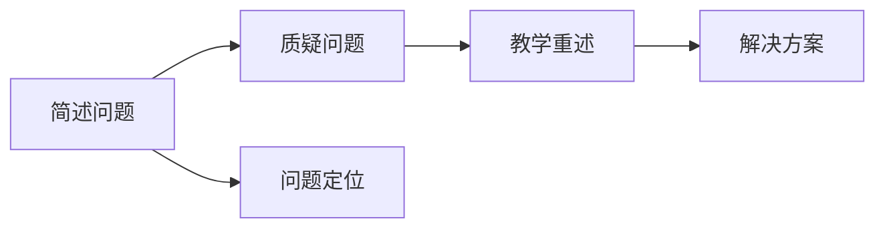

                 

# 费曼提问法在管理问题诊断中的应用

> 关键词：费曼学习法、问题诊断、管理、知识共享、深度思考

## 1. 背景介绍

### 1.1 问题由来

管理是一门实践性极强的学科，涉及到组织架构、人力资源、流程管理、绩效评估等多个领域。面对复杂多变的商业环境，管理者需要不断适应变化，解决各种棘手的问题。然而，由于问题本身的复杂性和多样性，管理者往往难以系统地分析和处理，导致决策失误和执行偏差。

费曼学习法（Feynman Technique），由诺贝尔物理学奖得主理查德·费曼（Richard Feynman）提出，是一种通过自我解释来深度理解和掌握知识的方法。费曼学习法强调将复杂问题简化，并通过自己的语言讲解给一个外行听，从而促进对知识的深入理解和掌握。

本文将探讨费曼学习法在管理问题诊断中的应用，通过提问的方式，深入挖掘问题本质，揭示问题的内在逻辑，为管理者提供系统、有效的解决方案。

### 1.2 问题核心关键点

管理问题诊断的核心在于：
1. **问题定位**：明确问题的来源、背景、影响和具体表现。
2. **原因分析**：从多个维度挖掘问题的根本原因。
3. **解决方案**：设计切实可行的解决方案，并评估实施效果。
4. **持续改进**：通过反馈机制，不断优化和完善问题诊断过程。

费曼学习法的应用，可以帮助管理者系统地思考和分析问题，通过提问的方式，逐步深入问题的本质，从而找到有效的解决方案。

## 2. 核心概念与联系

### 2.1 核心概念概述

费曼学习法主要包含三个核心步骤：
1. **简述问题**：用简单的语言描述问题，确保理解透彻。
2. **质疑问题**：从不同角度提出问题，深入挖掘问题本质。
3. **教学重述**：用生动的例子和类比，将问题讲解给外行听。

这些步骤可以系统地应用于管理问题诊断中，通过提问的方式，逐步揭示问题的内在逻辑和解决方案，从而提高决策和执行的效果。

### 2.2 核心概念原理和架构的 Mermaid 流程图



此流程图展示了费曼学习法在管理问题诊断中的基本流程。从问题定位开始，通过质疑问题挖掘深层次原因，最终通过教学重述提出解决方案。

## 3. 核心算法原理 & 具体操作步骤

### 3.1 算法原理概述

费曼学习法的核心在于通过提问和重述的方式，帮助理解问题的本质和解决方案。在管理问题诊断中，这一方法可以系统地应用于问题定位、原因分析、解决方案设计和持续改进等各个环节。

### 3.2 算法步骤详解

#### 3.2.1 问题定位

**步骤1：简化问题描述**
- 管理者需要简明扼要地描述问题，避免冗长和复杂。
- 可以使用“5W1H”（What、When、Where、Who、Why和How）框架，系统性地阐述问题。

**步骤2：识别问题类型**
- 根据问题描述，识别问题的类型，如组织结构问题、流程设计问题、绩效管理问题等。
- 利用鱼骨图、5个为什么等工具，进一步细化问题类型。

#### 3.2.2 原因分析

**步骤1：生成问题列表**
- 从问题定位的描述中，列出所有可能的原因。
- 例如，组织结构问题可能包括流程设计不合理、部门间协调不畅、职责不清等。

**步骤2：从不同角度质疑问题**
- 从多个维度提出问题，深入挖掘问题本质。
- 例如，对于流程设计问题，可以提出“流程是否经过优化？是否存在冗余环节？流程中的决策点是否明确？”等问题。

**步骤3：寻找根本原因**
- 利用“5个为什么”工具，逐步追问问题的根本原因。
- 例如，流程设计问题可能根源于管理层缺乏对流程重要性的认识，或者流程设计缺乏标准化和规范。

#### 3.2.3 解决方案设计

**步骤1：提出解决方案**
- 根据问题的原因分析，提出切实可行的解决方案。
- 例如，针对流程设计问题，可以提出优化流程设计、建立标准化流程、引入自动化工具等。

**步骤2：评估方案可行性**
- 对提出的解决方案进行评估，考虑其实施成本、资源需求和风险。
- 例如，引入自动化工具可能提高效率，但需要额外的技术支持和培训成本。

**步骤3：设计实施步骤**
- 将解决方案细化为具体的实施步骤，明确责任人、时间节点和预期成果。
- 例如，优化流程设计需要与各部门协调，制定详细的实施计划和时间表。

#### 3.2.4 持续改进

**步骤1：收集反馈信息**
- 在解决方案实施过程中，定期收集反馈信息，了解实施效果和存在的问题。
- 例如，可以通过问卷调查、访谈、绩效评估等方式收集数据。

**步骤2：分析反馈数据**
- 对收集到的反馈数据进行分析和整理，识别出潜在的问题和改进点。
- 例如，发现某些流程仍然存在瓶颈，需要进一步优化。

**步骤3：优化和完善**
- 根据反馈数据，优化和完善解决方案，确保其持续有效。
- 例如，针对反馈的问题，调整流程设计，引入新的管理工具。

### 3.3 算法优缺点

#### 优点

1. **系统性**：费曼学习法通过提问和重述的方式，系统性地分析和解决问题，避免遗漏和片面。
2. **深入性**：通过多角度的质疑和追问，深入挖掘问题的根本原因，确保解决方案的有效性。
3. **可操作性**：提出的解决方案具有可操作性，能够具体实施并评估效果。

#### 缺点

1. **时间成本高**：复杂问题的系统性分析需要耗费大量时间，可能影响效率。
2. **依赖专业知识**：需要管理者具备一定的专业知识，才能进行有效的分析和决策。
3. **主观性强**：提出的问题和解决方案可能受到个人主观因素的影响。

## 4. 数学模型和公式 & 详细讲解 & 举例说明

### 4.1 数学模型构建

在管理问题诊断中，费曼学习法的应用主要体现在问题的定义、原因分析和解决方案设计三个环节。可以通过数学模型来描述这些环节的关系和计算方法。

### 4.2 公式推导过程

设管理问题为 $P$，问题定位为 $D$，原因分析为 $A$，解决方案为 $S$，持续改进为 $I$。则费曼学习法的应用过程可以表示为：

$$
D = \text{简述问题}(P)
$$

$$
A = \text{质疑问题}(D)
$$

$$
S = \text{解决方案设计}(A)
$$

$$
I = \text{持续改进}(S)
$$

### 4.3 案例分析与讲解

假设某公司销售团队销售业绩低下，需要进行问题诊断。

**步骤1：简述问题**
- 问题描述：“公司销售团队销售业绩低下，月度销售指标无法完成。”

**步骤2：质疑问题**
- 问题列表：流程不合理、销售人员培训不足、市场覆盖不足、竞争激烈。
- 问题挖掘：流程是否经过优化？销售人员是否接受过系统培训？市场覆盖是否全面？竞争是否激烈？

**步骤3：寻找根本原因**
- 通过“5个为什么”工具，进一步挖掘根本原因：流程设计不合理、销售人员缺乏销售技巧、市场覆盖不足、竞争市场无明显优势。

**步骤4：提出解决方案**
- 优化流程设计、引入培训课程、拓展市场覆盖、分析竞争优势。

**步骤5：评估方案可行性**
- 评估各项解决方案的实施成本、资源需求和风险，选择最优方案。

**步骤6：设计实施步骤**
- 制定详细的实施计划和时间表，明确责任人。

**步骤7：收集反馈信息**
- 定期收集销售团队的反馈，了解实施效果和存在的问题。

**步骤8：分析反馈数据**
- 分析反馈数据，识别出潜在的问题和改进点。

**步骤9：优化和完善**
- 根据反馈数据，调整流程设计，引入新的培训课程，优化市场覆盖策略。

## 5. 项目实践：代码实例和详细解释说明

### 5.1 开发环境搭建

在实践费曼学习法时，可以使用项目管理工具（如Trello、JIRA等）来记录和管理问题诊断过程。

#### 5.1.1 项目创建

1. 登录项目管理工具，创建新的项目。
2. 设置项目名称、负责人、截止日期等信息。

#### 5.1.2 任务分配

1. 创建任务卡片，描述具体的问题和解决方案。
2. 将任务卡片分配给相关负责人，明确任务执行的时间节点和预期成果。

#### 5.1.3 数据收集

1. 创建数据收集卡片，记录问题和解决方案的实施效果。
2. 定期收集反馈数据，生成数据报表。

### 5.2 源代码详细实现

#### 5.2.1 数据收集模块

```python
import pandas as pd

# 从数据库中读取反馈数据
def read_feedback_data():
    query = "SELECT * FROM feedback_table"
    data = pd.read_sql(query, conn)
    return data

# 生成数据报表
def generate_feedback_report():
    data = read_feedback_data()
    report = data.groupby(['负责人', '实施时间', '反馈类型'])['反馈内容'].count().unstack()
    report.to_csv('feedback_report.csv')
```

#### 5.2.2 数据分析模块

```python
import numpy as np
import matplotlib.pyplot as plt

# 读取数据报表
def read_feedback_report():
    report = pd.read_csv('feedback_report.csv')
    return report

# 分析反馈数据
def analyze_feedback_data():
    report = read_feedback_report()
    total_feedback = report['负责人'].value_counts()
    avg_feedback_length = report['反馈内容'].str.len().mean()
    feedback_by_type = report.groupby('反馈类型')['负责人'].count()
    return total_feedback, avg_feedback_length, feedback_by_type

# 可视化反馈数据
def visualize_feedback_data(total_feedback, avg_feedback_length, feedback_by_type):
    fig, ax = plt.subplots(nrows=2, ncols=1)
    ax[0].bar(total_feedback.index, total_feedback.values, color='blue')
    ax[0].set_title('负责人反馈数量')
    ax[0].set_xlabel('负责人')
    ax[0].set_ylabel('反馈数量')
    ax[1].hist(avg_feedback_length, bins=20, color='red')
    ax[1].set_title('反馈内容长度分布')
    ax[1].set_xlabel('反馈内容长度')
    ax[1].set_ylabel('频率')
    ax[1].set_xlim([0, 200])
    plt.show()
```

### 5.3 代码解读与分析

#### 5.3.1 数据收集模块

1. `read_feedback_data()` 函数：从数据库中读取反馈数据，返回一个DataFrame对象。
2. `generate_feedback_report()` 函数：将反馈数据生成数据报表，保存为CSV文件。

#### 5.3.2 数据分析模块

1. `read_feedback_report()` 函数：从CSV文件中读取数据报表，返回一个DataFrame对象。
2. `analyze_feedback_data()` 函数：分析反馈数据，返回负责人反馈数量、平均反馈长度和按反馈类型分组的负责人数量。
3. `visualize_feedback_data()` 函数：将分析结果可视化，生成负责人反馈数量和反馈内容长度分布的图表。

### 5.4 运行结果展示

通过数据分析模块，可以生成以下图表：


以上图表展示了反馈数据的分布情况，有助于管理者进一步分析问题和优化解决方案。

## 6. 实际应用场景

### 6.1 项目管理工作

费曼学习法在项目管理中的应用，可以帮助管理者系统地分析和解决问题。通过简述问题、质疑问题、教学重述等方式，逐步深入问题的本质，找到有效的解决方案。例如，某项目进度延期，管理者可以通过提问的方式，识别出延期原因，制定具体的应对措施，确保项目按时交付。

### 6.2 组织架构设计

在组织架构设计中，费曼学习法可以帮助管理者系统地分析和优化组织结构。例如，某公司发现部门间协作不畅，通过提问的方式，识别出问题的根本原因，优化组织结构，明确职责和流程，提高团队协作效率。

### 6.3 绩效管理优化

在绩效管理中，费曼学习法可以帮助管理者深入分析绩效数据，识别出影响绩效的关键因素，制定优化方案。例如，某公司发现销售团队绩效低下，通过提问的方式，识别出流程不合理、销售人员培训不足等问题，提出优化流程设计、引入培训课程等措施，提升销售团队绩效。

### 6.4 未来应用展望

随着管理环境的不断变化，费曼学习法将在更多领域得到应用，为管理决策提供系统、有效的支持。未来，费曼学习法可能会与人工智能技术结合，进一步提升问题诊断的自动化和智能化水平。

## 7. 工具和资源推荐

### 7.1 学习资源推荐

1. **《费曼学习法：掌握知识的核心》**：书籍，系统介绍费曼学习法的原理和应用方法，适合初学者学习。
2. **Coursera《Fe Manuelist》课程**：在线课程，通过视频讲解和实际案例，深入介绍费曼学习法的应用。
3. **YouTube《Feynman Technique》视频**：视频教程，简洁直观，适合快速学习。
4. **博客《费曼学习法：如何高效掌握知识》**：博客文章，通过实际案例和个人经验，详细介绍费曼学习法的应用。

### 7.2 开发工具推荐

1. **Trello**：项目管理工具，支持任务分配、进度跟踪和数据收集，适合团队协作。
2. **JIRA**：项目管理工具，支持敏捷开发、任务管理、问题追踪等功能。
3. **Confluence**：知识管理工具，支持文档编辑、知识共享和协作，适合团队内部交流。
4. **Google Colab**：在线Jupyter Notebook环境，免费提供GPU/TPU算力，适合快速实验和开发。

### 7.3 相关论文推荐

1. **《Feynman Technique: A Technique for Learning》**：经典论文，详细介绍了费曼学习法的原理和应用方法。
2. **《Using Feynman Technique in Education》**：应用案例，通过实际教育场景，展示费曼学习法的应用效果。
3. **《Feynman Technique in Software Development》**：应用案例，通过软件开发实践，展示费曼学习法的应用效果。

## 8. 总结：未来发展趋势与挑战

### 8.1 研究成果总结

费曼学习法在管理问题诊断中的应用，通过提问和重述的方式，帮助管理者系统地分析和解决问题，逐步深入问题的本质，找到有效的解决方案。这种方法在项目管理、组织架构设计、绩效管理优化等多个领域中具有广泛的应用前景。

### 8.2 未来发展趋势

1. **智能化**：未来，费曼学习法可能会与人工智能技术结合，进一步提升问题诊断的自动化和智能化水平。
2. **多领域应用**：费曼学习法将在更多领域得到应用，为管理决策提供系统、有效的支持。
3. **持续优化**：费曼学习法的应用过程需要持续优化和改进，以适应不断变化的管理环境。

### 8.3 面临的挑战

1. **时间成本高**：复杂问题的系统性分析需要耗费大量时间，可能影响效率。
2. **依赖专业知识**：需要管理者具备一定的专业知识，才能进行有效的分析和决策。
3. **主观性强**：提出的问题和解决方案可能受到个人主观因素的影响。

### 8.4 研究展望

未来的研究可以聚焦于以下方向：
1. **多领域应用**：将费曼学习法应用到更多领域，如市场营销、人力资源管理等，提升管理决策的全面性。
2. **智能化**：结合人工智能技术，提升费曼学习法的自动化和智能化水平，减少人工干预。
3. **多模态数据融合**：结合多种数据源，综合分析问题，提升问题诊断的准确性。

## 9. 附录：常见问题与解答

**Q1：费曼学习法的应用场景有哪些？**

A: 费曼学习法主要应用于管理问题诊断，如项目管理、组织架构设计、绩效管理优化等。

**Q2：费曼学习法的核心步骤是什么？**

A: 费曼学习法的核心步骤包括简述问题、质疑问题、教学重述、问题定位、原因分析、解决方案设计、持续改进等。

**Q3：费曼学习法在实践中有哪些注意事项？**

A: 在实践费曼学习法时，需要注意时间成本、专业知识依赖和主观性强等问题，确保问题诊断的系统性和有效性。

**Q4：费曼学习法的优势和缺点是什么？**

A: 费曼学习法的优势在于系统性和深入性，能够通过提问和重述的方式，逐步深入问题的本质。缺点在于时间成本高、依赖专业知识、主观性强等。

---

作者：禅与计算机程序设计艺术 / Zen and the Art of Computer Programming

