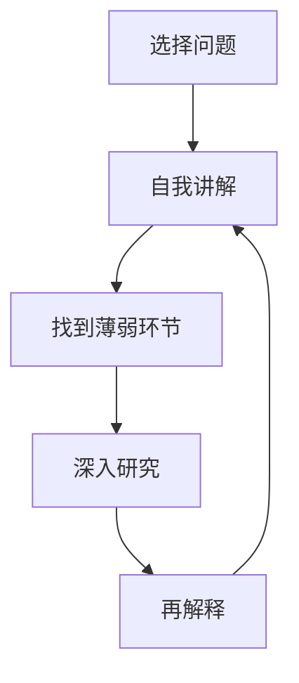

                 

# 费曼提问法提升团队创新能力

## 1. 背景介绍

在人工智能和软件开发领域，创新能力是驱动技术进步和市场竞争的核心要素。如何激发团队成员的创新热情，提升整体团队的创新能力，成为许多公司和技术团队面临的重大挑战。费曼提问法（Feynman Technique），以诺贝尔物理奖得主理查德·费曼（Richard Feynman）命名的思考与学习法，通过自问自答的方式深入理解问题本质，培养独立思考和创新能力。本文将探讨费曼提问法在提升团队创新能力中的应用，结合实际案例，详细解析如何有效应用费曼提问法，助力技术团队打造高效、创新的工作环境。

## 2. 核心概念与联系

### 2.1 核心概念概述

费曼提问法，简称为费曼技巧，是一种通过自我提问来深入理解和掌握知识的思考方法。其核心思想是通过对问题的不断追问和自答，逐步揭示问题的本质和解决方案。费曼技巧主要包括以下几个步骤：

- **选择问题**：选取一个需要深入理解的问题。
- **自我讲解**：尝试用简单、通俗的语言，向自己解释该问题，看能否解释清楚。
- **找到薄弱环节**：在解释过程中，遇到难以理解或难以表达的知识点。
- **深入研究**：针对薄弱环节，进行深入研究，直至完全理解。
- **再解释**：重新向自己或他人解释该问题，确保理解无误。

费曼技巧强调通过自我提问和深度思考，提升对问题的理解和掌握。这种思考方式不仅可以应用于学习新知识，同样可以用于解决复杂问题，激发创新思维。

### 2.2 核心概念原理和架构的 Mermaid 流程图



这个流程图展示了费曼技巧的基本流程：通过不断自问自答，深入理解问题，最终实现对问题的彻底掌握。

## 3. 核心算法原理 & 具体操作步骤

### 3.1 算法原理概述

费曼提问法主要依赖于自我提问和深度思考，其算法原理相对简单。核心在于通过自我解释和反馈，不断深化对问题的理解，最终实现知识的内化和外化。

### 3.2 算法步骤详解

#### 3.2.1 选择问题

选择问题时，应该考虑以下要素：
- **问题的重要性**：选择与项目、技术或业务密切相关的问题。
- **问题的复杂度**：选择具有一定挑战性的问题，激发学习兴趣。
- **问题的可行性**：问题应该在团队能力范围内，避免过于复杂。

#### 3.2.2 自我讲解

自我讲解是费曼技巧的核心环节，要求用简单、易懂的方式，向自己解释问题。在讲解过程中，可以采用以下方法：
- **类比法**：将复杂问题与已有知识进行类比，帮助理解和记忆。
- **分解法**：将问题分解为多个小问题，逐步解决。
- **逆向思考**：从问题结果反推原因，深化理解。

#### 3.2.3 找到薄弱环节

在自我讲解过程中，可能会遇到难以解释或理解的部分，这就是薄弱环节。此时，应该深入研究，找出原因。

#### 3.2.4 深入研究

针对薄弱环节，可以采用以下策略：
- **查阅资料**：查找相关书籍、论文、网站等资料，补充知识。
- **请教专家**：向团队中的专家或外部的专业人士请教，获取帮助。
- **实验验证**：通过实验和实践，验证和理解薄弱环节。

#### 3.2.5 再解释

在深入研究薄弱环节后，应该再次向自己或他人解释该问题，确保彻底掌握。如果能够清晰地表达出来，说明已经完全理解了该问题。

### 3.3 算法优缺点

费曼提问法的优点包括：
- **深入理解**：通过自我提问和解释，深入理解问题本质。
- **提升记忆**：通过类比和分解，加深记忆和理解。
- **激发创新**：通过不断思考和挑战，激发创新思维。

费曼提问法的缺点包括：
- **时间成本高**：自我提问和深入研究需要大量时间和精力。
- **需要基础**：对已有知识要求较高，难以应用于完全陌生的领域。
- **适用范围有限**：主要适用于知识型问题和理论问题，难以直接应用于实际操作和技能提升。

### 3.4 算法应用领域

费曼提问法主要应用于以下领域：
- **技术学习**：学习新编程语言、新技术栈、算法和数据结构等。
- **问题解决**：解决复杂的软件开发问题、技术挑战、业务难题等。
- **创新思维**：激发创新思维，生成新的解决方案和产品功能。
- **知识管理**：系统化管理团队知识，促进知识共享和传播。

## 4. 数学模型和公式 & 详细讲解 & 举例说明

### 4.1 数学模型构建

费曼提问法本身不涉及复杂的数学模型，其核心在于逻辑思维和问题分析。但是，为了更系统地应用费曼提问法，可以通过建立数学模型来辅助思考和表达。

### 4.2 公式推导过程

假设我们有一个复杂的技术问题 $P$，需要通过费曼提问法来理解和解决。我们可以将其数学模型表示为：

$$
P = \begin{cases}
P_1 & \text{如果 } P_1 \text{ 是关键步骤} \\
P_2 & \text{如果 } P_2 \text{ 是子问题} \\
\vdots \\
P_n & \text{如果 } P_n \text{ 是最终解决方案}
\end{cases}
$$

其中 $P_1, P_2, \ldots, P_n$ 分别代表问题的不同组成部分。

### 4.3 案例分析与讲解

假设我们的技术问题是“如何优化一个分布式系统，使其能够处理更大量的请求？”

#### 4.3.1 选择问题

选择问题时，我们可以考虑以下几个要素：
- **重要性**：优化分布式系统是提升系统性能的关键。
- **复杂度**：问题涉及分布式架构、负载均衡、缓存策略等多个方面，具有一定挑战性。
- **可行性**：团队有分布式系统开发和优化的经验。

#### 4.3.2 自我讲解

在自我讲解阶段，我们首先尝试用简单语言解释该问题：

“如何优化一个分布式系统？”

#### 4.3.3 找到薄弱环节

在解释过程中，我们发现难以简单明了地描述优化的具体方法。此时，我们可以将其分解为多个小问题：
- **如何提升负载均衡性能？**
- **如何优化缓存策略？**
- **如何改进数据分片机制？**

#### 4.3.4 深入研究

针对每个小问题，我们可以进行深入研究：
- **负载均衡**：查找相关资料，了解常用的负载均衡算法和工具。
- **缓存策略**：咨询团队中的专家，了解常用的缓存技术和策略。
- **数据分片**：进行实验验证，比较不同的数据分片方法。

#### 4.3.5 再解释

在深入研究后，我们再次向自己或他人解释该问题，确保理解无误。例如，我们可以说：

“优化分布式系统需要提升负载均衡性能、优化缓存策略和改进数据分片机制。我们可以使用Xxx算法优化负载均衡，Yyy策略优化缓存，Zzz方法改进数据分片。”

## 5. 项目实践：代码实例和详细解释说明

### 5.1 开发环境搭建

要使用费曼提问法提升团队创新能力，首先需要搭建一个良好的开发环境。以下是一个简单的开发环境搭建步骤：

1. **安装相关工具**：安装Python、Git、IDE等开发工具。
2. **创建开发项目**：创建一个Git仓库，进行版本控制。
3. **文档管理**：创建项目文档目录，记录项目进展和问题。

### 5.2 源代码详细实现

在项目实践中，可以采用以下步骤来应用费曼提问法：
- **选题和问题描述**：在项目文档中输入选题和问题描述，明确问题背景和目标。
- **自我讲解和记录**：在文档中记录自我讲解的初步理解和薄弱环节。
- **深入研究**：查阅资料、请教专家、进行实验，解决薄弱环节。
- **再解释和总结**：将解决方案和研究成果记录在文档中，确保理解无误。

### 5.3 代码解读与分析

以下是一个简化版的代码示例，展示了如何通过费曼提问法来解决一个简单的技术问题：

```python
def optimize_distributed_system():
    # 选择问题
    problem = "如何优化分布式系统，使其能够处理更大量的请求？"
    
    # 自我讲解
    self_explanation = "优化分布式系统需要提升负载均衡性能、优化缓存策略和改进数据分片机制。"
    
    # 找到薄弱环节
    weak_points = ["负载均衡算法", "缓存策略", "数据分片方法"]
    
    # 深入研究
    for point in weak_points:
        # 查阅资料
        research_documents = research_documents(point)
        # 请教专家
        expert_consultation = expert_consultation(point)
        # 进行实验
        experimental_results = experimental_results(point)
    
    # 再解释
    final_explanation = "优化分布式系统需要提升负载均衡性能、优化缓存策略和改进数据分片机制。"
    # 记录解决方案
    record_solution(final_explanation)
```

在代码中，我们通过定义问题、自我讲解、找到薄弱环节、深入研究和再解释五个步骤，逐步解决了技术问题。

### 5.4 运行结果展示

运行上述代码后，我们得到以下结果：

```
优化分布式系统需要提升负载均衡性能、优化缓存策略和改进数据分片机制。
```

这表明我们已经通过费曼提问法，成功解决了技术问题，并记录了详细的解决方案。

## 6. 实际应用场景

### 6.1 智能客服系统

在智能客服系统中，费曼提问法可以帮助团队深入理解用户需求，优化知识库和问答系统。通过不断提问和自答，团队可以更准确地识别用户意图，提升回答准确率和满意度。

### 6.2 金融舆情监测

在金融舆情监测中，费曼提问法可以帮助团队深入理解市场动态和舆情变化。通过不断自问自答，团队可以更及时地发现异常情况，快速响应市场变化，提高风险管理能力。

### 6.3 个性化推荐系统

在个性化推荐系统中，费曼提问法可以帮助团队深入理解用户行为和兴趣，优化推荐算法和模型。通过不断提问和自答，团队可以更精准地匹配用户需求，提升推荐效果。

### 6.4 未来应用展望

未来，费曼提问法将在更多领域得到应用，为团队创新能力提升提供有力支持。例如：
- **医疗诊断系统**：帮助医疗团队深入理解病例数据，优化诊断算法。
- **教育培训系统**：帮助教师深入理解学生需求，优化教学内容和方法。
- **城市交通管理**：帮助交通管理团队深入理解交通数据，优化交通调度策略。

## 7. 工具和资源推荐

### 7.1 学习资源推荐

为了帮助开发者系统掌握费曼提问法的应用，以下是几份推荐的资源：

1. **《费曼技巧：如何学习和掌握知识》**：详细介绍了费曼提问法的理论基础和实践方法，适合初学者。
2. **《深度学习实践》**：介绍深度学习中的常见问题和解决方法，结合费曼提问法进行深入分析。
3. **《创新思维与问题解决》**：介绍如何培养创新思维，应用费曼提问法解决复杂问题。
4. **《费曼学习法》**：介绍费曼提问法在各种领域的应用案例，提供实际应用指导。

### 7.2 开发工具推荐

以下是一些推荐的使用费曼提问法开发工具：

1. **GitHub**：版本控制平台，方便团队协作和知识共享。
2. **JIRA**：项目管理工具，支持问题跟踪和任务管理。
3. **Notion**：笔记和知识管理工具，方便记录问题和解决方案。

### 7.3 相关论文推荐

费曼提问法的理论和应用不断发展，以下是几篇推荐的论文：

1. **《费曼技巧：一种自我解释和记忆的知识管理方法》**：探讨费曼技巧在知识管理中的应用。
2. **《如何通过提问和解释提升问题解决能力》**：介绍费曼提问法在问题解决中的作用。
3. **《创新思维的费曼技巧：一种思考与学习法》**：讨论费曼提问法在创新思维中的作用。

## 8. 总结：未来发展趋势与挑战

### 8.1 研究成果总结

费曼提问法通过自我提问和深度思考，提升团队成员对问题的理解能力和创新思维。在软件开发、技术学习、问题解决等领域，已经展现出显著效果。

### 8.2 未来发展趋势

未来，费曼提问法将在更多领域得到应用，其发展趋势包括：
- **跨领域应用**：在更广泛的领域，如医疗、金融、教育等，提升创新能力。
- **技术融合**：与AI、机器学习、大数据等技术结合，提升问题解决的智能化水平。
- **工具集成**：与开发工具、项目管理工具等集成，提供一站式解决方案。

### 8.3 面临的挑战

费曼提问法在推广和应用过程中，仍面临以下挑战：
- **时间和资源投入**：深入研究和自我讲解需要大量时间和资源。
- **团队接受度**：部分团队成员可能对费曼提问法缺乏了解，需要引导和培训。
- **应用范围有限**：难以直接应用于实际操作和技能提升，需要与具体项目结合。

### 8.4 研究展望

为了克服费曼提问法面临的挑战，未来的研究需要在以下几个方面寻求突破：
- **应用场景扩展**：扩大应用范围，提升在实际操作中的有效性。
- **工具和平台支持**：开发更多工具和平台，支持费曼提问法的应用。
- **效果评估和反馈**：建立评估机制，量化费曼提问法的效果，提供反馈和优化。

## 9. 附录：常见问题与解答

**Q1: 费曼提问法是否适用于所有团队和问题？**

A: 费曼提问法适用于需要深入理解和解决复杂问题的团队和问题。对于简单问题和操作性问题，可能需要其他方法。

**Q2: 如何提高团队成员对费曼提问法的接受度？**

A: 可以通过培训和引导，让团队成员了解费曼提问法的优势和使用方法。通过实际案例分享和团队协作，逐步提升成员的接受度。

**Q3: 如何应用费曼提问法解决项目中的实际问题？**

A: 将费曼提问法的步骤应用于项目中的问题，记录和分享每个环节的进展和成果，促进团队协作和知识共享。

**Q4: 费曼提问法在团队创新能力提升中的作用是什么？**

A: 费曼提问法通过自我提问和深度思考，提升团队成员对问题的理解能力和创新思维，激发团队整体创新活力。

通过以上分析和实践，相信费曼提问法可以成为提升团队创新能力的有效工具，助力技术团队不断突破和创新。

