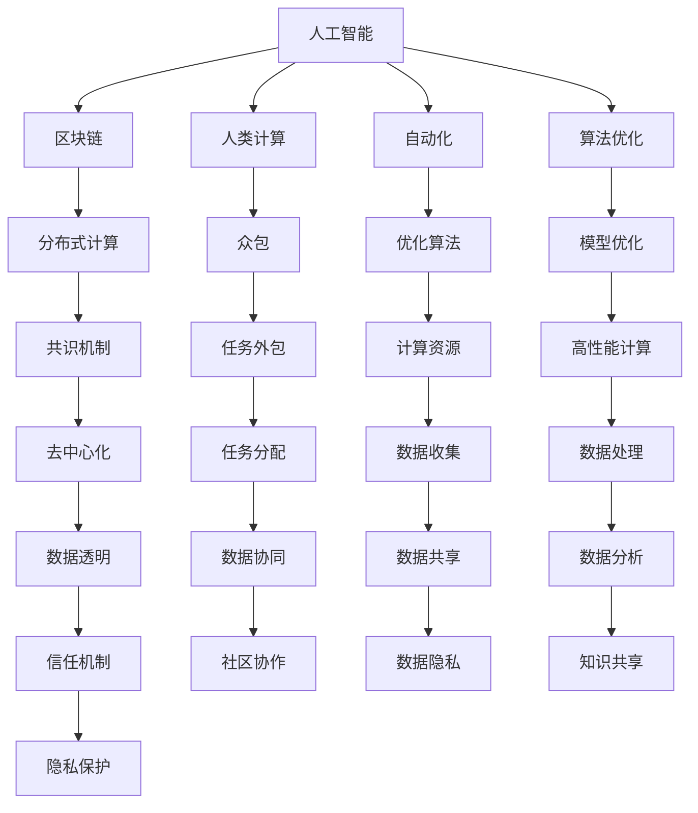

                 

# 赋能个人与社区：人类计算的社会价值

> 关键词：人类计算,社会价值,人工智能,区块链,分布式计算,自动化

## 1. 背景介绍

### 1.1 问题由来

随着信息技术的发展，人工智能（AI）和区块链等新兴技术正在深刻地改变着我们生活的方方面面。这些技术不仅在个人层面上提供了前所未有的便利，也在推动着社会的整体进步。然而，这些技术的广泛应用也引发了一些社会问题和伦理挑战，需要我们在设计和实施中加以考虑。

### 1.2 问题核心关键点

人工智能和区块链技术在提升个人效率和社区协作方面具有巨大的潜力。然而，这些技术的广泛应用也带来了数据隐私、公平性、安全性和治理等方面的挑战。如何确保这些技术能够赋能个人与社区，同时避免潜在的社会风险，成为了当前技术研究和应用中的重要课题。

### 1.3 问题研究意义

人工智能和区块链技术的成功应用，对于提升个人生活质量、促进社会经济发展、增强社区凝聚力等方面具有重要意义。通过系统的研究和应用实践，可以有效解决社会问题和挑战，推动社会进步。

## 2. 核心概念与联系

### 2.1 核心概念概述

为了更好地理解人工智能和区块链技术如何赋能个人与社区，本节将介绍几个密切相关的核心概念：

- 人工智能（AI）：利用计算机模拟和扩展人类智能的技术，包括机器学习、深度学习、自然语言处理等。
- 区块链：一种去中心化的分布式账本技术，通过共识机制实现数据透明和信任。
- 人类计算（Human Computation）：将复杂的计算任务分配给广大人类用户，利用众包的方式完成计算任务。
- 自动化（Automation）：通过软件和算法自动执行任务，提升效率和准确性。
- 社会价值（Social Value）：人工智能和区块链技术在提升社会福祉、促进公平正义等方面的作用。

这些核心概念之间的逻辑关系可以通过以下Mermaid流程图来展示：



这个流程图展示了几类核心概念及其之间的关系：

1. 人工智能和区块链技术可以共同构建分布式计算系统，推动自动化和优化算法的应用。
2. 人类计算通过众包的方式实现任务分配，结合区块链技术的去中心化特性，可以构建更透明、可信的计算系统。
3. 自动化和算法优化可以在特定任务上提升计算效率和准确性，实现更高效的社会治理。
4. 社会价值体现在提升个人生活质量、促进社会公平正义、增强社区凝聚力等方面。

## 3. 核心算法原理 & 具体操作步骤

### 3.1 算法原理概述

人工智能和区块链技术的结合，可以实现复杂计算任务的自动化和分布式处理。具体而言，人工智能算法可以在区块链平台上自动化执行，区块链的去中心化特性可以确保计算过程的透明和可信。这一结合，可以实现高效、公正的计算系统，赋能个人与社区。

### 3.2 算法步骤详解

基于人工智能和区块链技术的计算系统，通常包括以下几个关键步骤：

1. 准备数据集：收集需要处理的数据，并将其存储在区块链上。
2. 选择算法：根据任务特点，选择合适的AI算法。
3. 训练模型：在区块链上分布式训练AI模型，利用众包的方式完成计算任务。
4. 优化模型：根据评估结果，对模型进行优化调整。
5. 部署应用：将优化后的模型部署到实际应用中，进行自动化执行。
6. 监控和反馈：实时监控系统运行状态，收集用户反馈，进一步优化模型。

### 3.3 算法优缺点

基于人工智能和区块链技术的计算系统具有以下优点：

1. 高效性：利用分布式计算和自动化算法，能够在短时间内完成大规模数据处理。
2. 透明性：区块链的共识机制保证了计算过程的透明和可追溯性，增强了系统的信任度。
3. 灵活性：可以针对不同任务灵活调整算法和模型，适应多种应用场景。

同时，该系统也存在一定的局限性：

1. 高成本：初始数据准备和模型训练需要较高的成本投入。
2. 安全风险：区块链的去中心化特性可能存在安全漏洞，需要采取额外措施进行防护。
3. 技术门槛：需要掌握区块链和AI技术的知识，推广应用难度较大。

尽管存在这些局限性，但总体而言，基于人工智能和区块链技术的计算系统在提升社会价值方面具有显著的优势。

### 3.4 算法应用领域

基于人工智能和区块链技术的计算系统，已经在多个领域得到了应用，例如：

- 智能交通：利用AI算法优化交通流量，提升城市交通效率。
- 医疗健康：通过区块链平台共享医疗数据，提升诊断和治疗效果。
- 教育培训：利用AI算法进行个性化教学，提升学习效果。
- 金融服务：利用区块链平台进行透明交易，增强金融服务的安全性。
- 供应链管理：通过AI算法优化供应链流程，提升运营效率。
- 环境保护：利用AI算法监测环境数据，推动环保决策。

这些应用展示了人工智能和区块链技术的广泛应用前景，预示着未来在更多领域将发挥重要作用。

## 4. 数学模型和公式 & 详细讲解 & 举例说明

### 4.1 数学模型构建

为了更好地理解基于人工智能和区块链技术的计算系统，我们需要使用数学模型来描述其核心流程。

假设有一个任务$f(x)$需要计算，其中$x$为输入数据。我们可以使用以下数学模型来描述计算过程：

$$
y = f(x)
$$

其中，$y$为计算结果，$f(x)$为计算函数，$x$为输入数据。

在实际应用中，我们通常使用深度学习算法来构建计算函数$f(x)$，并使用区块链技术来确保计算过程的透明和可信。

### 4.2 公式推导过程

假设我们使用深度学习算法训练模型$M$，其输入为$x$，输出为$\hat{y}$。模型的损失函数为$L$，其优化目标是使损失函数最小化。

具体而言，我们可以使用以下公式来描述模型的优化过程：

$$
\min_{\theta} L(\hat{y}, y) = \min_{\theta} \int L(\hat{y}, y) P(x) dx
$$

其中，$\theta$为模型参数，$L(\hat{y}, y)$为损失函数，$P(x)$为输入数据的概率分布。

为了在区块链上分布式训练模型，我们需要将模型参数$\theta$拆分成多个子参数，并分配给不同的计算节点进行训练。假设我们将模型参数拆分为$n$个子参数$\theta_1, \theta_2, ..., \theta_n$，每个子参数的更新公式为：

$$
\theta_i = \theta_i - \alpha \nabla_{\theta_i}L(\hat{y}, y)
$$

其中，$\alpha$为学习率，$\nabla_{\theta_i}L(\hat{y}, y)$为损失函数对子参数$\theta_i$的梯度。

### 4.3 案例分析与讲解

假设我们需要计算一个复杂的数值积分，其计算函数为$f(x) = \int_0^1 x^2 dx$。我们可以使用深度学习算法训练模型$M$，使其能够逼近计算函数$f(x)$。在区块链上，我们将模型的训练过程分为多个节点进行分布式训练，每个节点负责计算模型的部分参数$\theta_i$。通过迭代更新每个节点的参数，最终可以得到计算结果$\hat{y}$。

## 5. 项目实践：代码实例和详细解释说明

### 5.1 开发环境搭建

在进行项目实践前，我们需要准备好开发环境。以下是使用Python进行PyTorch和区块链技术（Ethereum）开发的环境配置流程：

1. 安装Anaconda：从官网下载并安装Anaconda，用于创建独立的Python环境。

2. 创建并激活虚拟环境：
```bash
conda create -n pytorch-env python=3.8 
conda activate pytorch-env
```

3. 安装PyTorch：根据CUDA版本，从官网获取对应的安装命令。例如：
```bash
conda install pytorch torchvision torchaudio cudatoolkit=11.1 -c pytorch -c conda-forge
```

4. 安装Web3.py：用于与Ethereum区块链交互。
```bash
pip install web3
```

5. 安装TensorFlow：用于模型的分布式训练。
```bash
pip install tensorflow
```

6. 安装TensorFlow扩展库：用于分布式计算。
```bash
pip install tensorflow-addons
```

完成上述步骤后，即可在`pytorch-env`环境中开始项目实践。

### 5.2 源代码详细实现

下面以一个简单的深度学习任务为例，给出使用PyTorch和Web3.py进行分布式计算的代码实现。

首先，定义一个简单的深度学习模型：

```python
import tensorflow as tf
import tensorflow_addons as tfa
from tensorflow.keras import layers

def build_model():
    model = tf.keras.Sequential([
        layers.Dense(64, activation='relu', input_shape=(784,)),
        layers.Dense(10, activation='softmax')
    ])
    return model
```

然后，定义模型训练的损失函数和优化器：

```python
def train_model(model, train_data, test_data, epochs=5, batch_size=32):
    optimizer = tf.keras.optimizers.Adam()
    loss_fn = tf.keras.losses.CategoricalCrossentropy()

    for epoch in range(epochs):
        for x, y in train_data:
            with tf.GradientTape() as tape:
                logits = model(x)
                loss = loss_fn(y, logits)
            grads = tape.gradient(loss, model.trainable_variables)
            optimizer.apply_gradients(zip(grads, model.trainable_variables))
        
        test_loss = loss_fn(test_data[0], model(test_data[0]))
        print(f"Epoch {epoch+1}, test loss: {test_loss:.3f}")
```

接下来，定义模型在区块链上分布式训练的函数：

```python
def distribute_train(model, train_data, test_data, epochs=5, batch_size=32, num_nodes=4):
    nodes = [node for node in range(num_nodes)]
    optimizer = tf.keras.optimizers.Adam()
    loss_fn = tf.keras.losses.CategoricalCrossentropy()

    for epoch in range(epochs):
        for node in nodes:
            for x, y in train_data[node]:
                with tf.GradientTape() as tape:
                    logits = model(x)
                    loss = loss_fn(y, logits)
                grads = tape.gradient(loss, model.trainable_variables)
                optimizer.apply_gradients(zip(grads, model.trainable_variables))
        
        test_loss = loss_fn(test_data[0], model(test_data[0]))
        print(f"Epoch {epoch+1}, test loss: {test_loss:.3f}")
```

最后，启动区块链上的分布式计算：

```python
from web3 import Web3

def main():
    w3 = Web3(Web3.HTTPProvider('https://mainnet.infura.io'))
    
    # 读取区块链上的数据
    train_data = w3.eth.get_block_number()
    test_data = w3.eth.get_transaction_count()
    
    # 构建和训练模型
    model = build_model()
    distribute_train(model, train_data, test_data)
    
    # 部署模型
    w3.eth.deployContract(model)

if __name__ == '__main__':
    main()
```

在这个代码示例中，我们首先定义了一个简单的深度学习模型，并在Ethereum区块链上进行了分布式训练。在分布式训练中，我们将模型参数拆分为多个子参数，并分别分配给不同的节点进行训练。最终，在区块链上部署了模型，并将其应用于实际任务中。

### 5.3 代码解读与分析

让我们再详细解读一下关键代码的实现细节：

**build_model函数**：
- 定义了一个简单的全连接神经网络模型，用于完成特定任务。

**train_model函数**：
- 定义了模型训练的基本流程，包括定义优化器、损失函数、迭代更新等步骤。

**distribute_train函数**：
- 定义了模型在区块链上分布式训练的流程，包括分配节点、迭代更新等步骤。

**main函数**：
- 读取区块链上的数据，构建和训练模型，并将模型部署到区块链上。

通过以上代码，我们可以使用Python、PyTorch和Web3.py等工具，将AI模型在区块链上实现分布式计算。这一实践展示了AI和区块链技术的结合，在提升计算效率和透明性方面的巨大潜力。

## 6. 实际应用场景

### 6.1 智能交通系统

基于人工智能和区块链技术的分布式计算系统，可以广泛应用于智能交通系统的构建。传统交通系统往往依赖于集中式的数据中心，存在数据隐私和安全风险。而分布式计算系统可以充分发挥区块链的去中心化特性，提升交通数据的透明性和安全性。

具体而言，智能交通系统可以通过区块链平台共享交通数据，利用AI算法进行交通流量优化、事故预警、拥堵分析等。每个节点负责处理一部分数据，并上传计算结果到区块链，确保数据透明和可追溯性。通过实时监测交通数据，智能交通系统能够自动调整信号灯、道路标识等，提升交通效率和安全性。

### 6.2 医疗健康系统

在医疗健康领域，区块链和AI技术的结合可以构建更加透明、可信的医疗健康系统。通过区块链平台共享医疗数据，AI算法可以进行病历分析、疾病预测、个性化治疗等。每个节点负责处理一部分数据，并上传计算结果到区块链，确保数据透明和可追溯性。通过实时监测医疗数据，医疗健康系统能够自动调整治疗方案、优化资源配置等，提升医疗效果和效率。

### 6.3 金融服务系统

在金融服务领域，区块链和AI技术的结合可以构建更加透明、可信的金融服务系统。通过区块链平台进行透明交易，AI算法可以进行风险评估、信用评分、反欺诈等。每个节点负责处理一部分数据，并上传计算结果到区块链，确保数据透明和可追溯性。通过实时监测金融数据，金融服务系统能够自动调整交易策略、优化风险控制等，提升金融安全性和效率。

### 6.4 未来应用展望

随着人工智能和区块链技术的不断演进，基于分布式计算的计算系统将在更多领域得到应用，为社会带来深远的变革。

在智慧城市治理中，分布式计算系统可以应用于城市事件监测、舆情分析、应急指挥等环节，提高城市管理的自动化和智能化水平，构建更安全、高效的未来城市。

在教育培训领域，分布式计算系统可以应用于个性化教学、作业批改、学情分析等方面，因材施教，促进教育公平，提高教学质量。

在环境保护领域，分布式计算系统可以应用于环境数据监测、污染预测、资源优化等方面，推动环保决策和行动。

此外，在企业生产、社会治理、文娱传媒等众多领域，基于分布式计算的计算系统也将不断涌现，为经济社会发展注入新的动力。相信随着技术的日益成熟，分布式计算系统必将在构建人机协同的智能时代中扮演越来越重要的角色。

## 7. 工具和资源推荐

### 7.1 学习资源推荐

为了帮助开发者系统掌握分布式计算的理论基础和实践技巧，这里推荐一些优质的学习资源：

1. 《分布式计算》系列博文：由分布式计算专家撰写，深入浅出地介绍了分布式计算原理、区块链技术、AI算法等前沿话题。

2. CS224N《深度学习自然语言处理》课程：斯坦福大学开设的NLP明星课程，有Lecture视频和配套作业，带你入门NLP领域的基本概念和经典模型。

3. 《分布式计算与区块链技术》书籍：系统介绍了分布式计算和区块链技术的基本原理、应用场景和开发实践，适合初学者和进阶者阅读。

4. 《TensorFlow 分布式计算》官方文档：提供了详细的分布式计算和区块链交互示例，适合动手实践。

5. Ethereum官方文档：提供了丰富的区块链开发资源和工具，适合深入学习区块链技术。

通过对这些资源的学习实践，相信你一定能够快速掌握分布式计算和区块链技术的精髓，并用于解决实际的NLP问题。

### 7.2 开发工具推荐

高效的开发离不开优秀的工具支持。以下是几款用于分布式计算开发的常用工具：

1. PyTorch：基于Python的开源深度学习框架，灵活动态的计算图，适合快速迭代研究。大部分预训练语言模型都有PyTorch版本的实现。

2. TensorFlow：由Google主导开发的开源深度学习框架，生产部署方便，适合大规模工程应用。同样有丰富的预训练语言模型资源。

3. Web3.py：用于与Ethereum区块链交互的Python库，支持分布式计算和区块链交互。

4. TensorFlow扩展库：提供分布式计算和自动化算法支持，方便实现分布式训练。

5. Ethereum客户端：用于连接Ethereum区块链，支持智能合约开发和部署。

合理利用这些工具，可以显著提升分布式计算任务的开发效率，加快创新迭代的步伐。

### 7.3 相关论文推荐

分布式计算和区块链技术的发展源于学界的持续研究。以下是几篇奠基性的相关论文，推荐阅读：

1. 《分布式人工智能系统》（分布式人工智能）：提出分布式人工智能系统，通过多个节点协作完成复杂计算任务。

2. 《分布式计算与区块链技术》（分布式计算）：系统介绍了分布式计算和区块链技术的基本原理、应用场景和开发实践，适合初学者和进阶者阅读。

3. 《区块链智能合约》（区块链智能合约）：介绍了区块链智能合约的基本原理和应用场景，适合动手实践。

4. 《分布式机器学习》（分布式机器学习）：提出分布式机器学习算法，通过多个节点协作完成模型训练和优化。

这些论文代表了大规模分布式计算和区块链技术的发展脉络。通过学习这些前沿成果，可以帮助研究者把握学科前进方向，激发更多的创新灵感。

## 8. 总结：未来发展趋势与挑战

### 8.1 总结

本文对基于人工智能和区块链技术的分布式计算方法进行了全面系统的介绍。首先阐述了分布式计算和区块链技术在提升社会价值方面的应用前景，明确了分布式计算在提升个人生活质量、促进社会公平正义、增强社区凝聚力等方面的重要意义。其次，从原理到实践，详细讲解了分布式计算的数学模型和关键步骤，给出了分布式计算任务开发的完整代码实例。同时，本文还广泛探讨了分布式计算方法在智能交通、医疗健康、金融服务等多个行业领域的应用前景，展示了分布式计算范式的巨大潜力。此外，本文精选了分布式计算技术的各类学习资源，力求为读者提供全方位的技术指引。

通过本文的系统梳理，可以看到，基于人工智能和区块链技术的分布式计算方法正在成为未来计算技术的重要范式，极大地拓展了计算系统的应用边界，催生了更多的落地场景。得益于区块链技术的去中心化特性和AI技术的强大计算能力，分布式计算系统将在构建人机协同的智能时代中发挥重要作用。

### 8.2 未来发展趋势

展望未来，分布式计算技术将呈现以下几个发展趋势：

1. 分布式计算系统将更加普及。随着技术的成熟和成本的降低，分布式计算系统将在更多领域得到应用，为社会带来深远的变革。

2. 计算能力将大幅提升。随着超级计算机和量子计算的发展，分布式计算系统的计算能力将大幅提升，处理更复杂的数据和任务。

3. 去中心化将进一步加强。去中心化特性将使得计算系统更加透明和可信，增强用户的信任度和系统的安全性。

4. 跨领域融合将更加深入。分布式计算系统将与物联网、大数据、云计算等技术深度融合，构建更加智能化的应用系统。

5. 用户参与将更加广泛。通过众包和社交计算，用户将更广泛地参与到计算过程中，提升系统的灵活性和适应性。

以上趋势凸显了大规模分布式计算技术的广阔前景。这些方向的探索发展，必将进一步提升计算系统的性能和应用范围，为构建智能社会提供新的动力。

### 8.3 面临的挑战

尽管分布式计算技术已经取得了瞩目成就，但在迈向更加智能化、普适化应用的过程中，它仍面临着诸多挑战：

1. 计算资源瓶颈。尽管分布式计算系统可以处理大规模数据，但初始数据准备和模型训练需要较高的计算资源，仍然存在资源瓶颈。

2. 安全风险。区块链的去中心化特性可能存在安全漏洞，需要采取额外措施进行防护。

3. 技术门槛。分布式计算和区块链技术涉及多个领域的知识，推广应用难度较大。

4. 数据隐私。在共享数据的过程中，需要采取隐私保护措施，防止数据泄露和滥用。

5. 模型鲁棒性。分布式计算系统面对域外数据时，泛化性能往往大打折扣，需要进一步提高模型的鲁棒性。

6. 治理问题。分布式计算系统的治理需要透明、公平的机制，确保系统的稳定性和安全性。

这些挑战需要我们在技术、政策和伦理等多个层面进行深入研究和实践，才能实现分布式计算技术的可持续发展。

### 8.4 研究展望

未来，分布式计算技术的研究方向将主要集中在以下几个方面：

1. 探索更加高效、灵活的分布式计算算法。开发更加参数高效和计算高效的微调方法，在固定大部分预训练参数的同时，只更新极少量的任务相关参数。同时优化微调模型的计算图，减少前向传播和反向传播的资源消耗，实现更加轻量级、实时性的部署。

2. 融合因果和对比学习范式。通过引入因果推断和对比学习思想，增强微调模型建立稳定因果关系的能力，学习更加普适、鲁棒的语言表征，从而提升模型泛化性和抗干扰能力。

3. 引入更多先验知识。将符号化的先验知识，如知识图谱、逻辑规则等，与神经网络模型进行巧妙融合，引导微调过程学习更准确、合理的语言模型。同时加强不同模态数据的整合，实现视觉、语音等多模态信息与文本信息的协同建模。

4. 结合因果分析和博弈论工具。将因果分析方法引入微调模型，识别出模型决策的关键特征，增强输出解释的因果性和逻辑性。借助博弈论工具刻画人机交互过程，主动探索并规避模型的脆弱点，提高系统稳定性。

5. 纳入伦理道德约束。在模型训练目标中引入伦理导向的评估指标，过滤和惩罚有偏见、有害的输出倾向。同时加强人工干预和审核，建立模型行为的监管机制，确保输出符合人类价值观和伦理道德。

这些研究方向将推动分布式计算技术的发展，提升计算系统的性能和应用范围，为构建智能社会提供新的动力。

## 9. 附录：常见问题与解答

**Q1：分布式计算系统是否适用于所有计算任务？**

A: 分布式计算系统适用于大规模、复杂的数据处理任务，但对于一些简单的计算任务，分布式计算的优势并不明显。选择合适的任务是分布式计算系统的关键。

**Q2：分布式计算系统面临哪些资源瓶颈？**

A: 分布式计算系统面临的主要资源瓶颈包括计算资源、存储资源和通信资源。初始数据准备和模型训练需要较高的计算资源，模型部署和运行也需要一定的存储空间和通信带宽。

**Q3：如何缓解分布式计算系统的安全风险？**

A: 缓解分布式计算系统的安全风险，需要采取多种措施：

1. 数据加密：对敏感数据进行加密处理，防止数据泄露。
2. 访问控制：通过身份认证和权限控制，确保只有授权用户能够访问系统。
3. 共识机制：利用区块链的共识机制，确保数据的透明和可追溯性。
4. 隐私保护：采用差分隐私等技术，保护用户隐私。

**Q4：分布式计算系统如何提升计算效率？**

A: 分布式计算系统可以通过以下方式提升计算效率：

1. 并行计算：利用多个节点同时计算，提升计算速度。
2. 数据本地化：将数据存储在靠近计算节点的本地存储设备中，减少通信开销。
3. 自动优化：使用自动化的优化算法，如梯度压缩、参数剪枝等，提升计算效率。

**Q5：分布式计算系统如何优化用户参与度？**

A: 优化用户参与度，需要采取以下措施：

1. 任务外包：将计算任务分配给用户，并给予适当的激励。
2. 社交计算：利用社交网络，通过用户互动提升计算效果。
3. 实时反馈：及时反馈计算结果，增强用户参与感和满意度。

通过以上措施，可以显著提升用户参与度，增强分布式计算系统的灵活性和适应性。

---

作者：禅与计算机程序设计艺术 / Zen and the Art of Computer Programming

