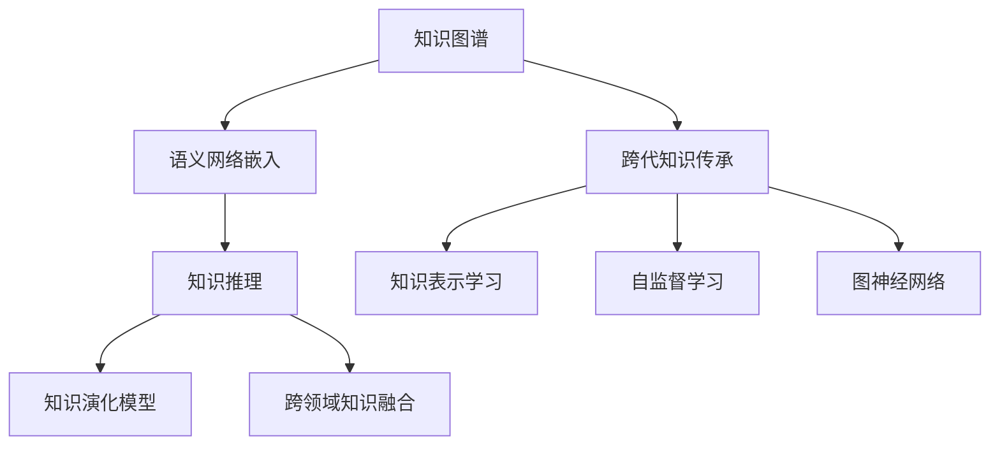

                 

# 跨代知识传承：bridging the gap

> 关键词：跨代知识传承, 知识图谱, 语义网络, 知识推理, 知识图谱嵌入, 跨领域知识融合, 知识表示学习, 图神经网络(GNN), 自监督学习, 知识演化与继承

## 1. 背景介绍

### 1.1 问题由来
随着信息时代的到来，人类知识呈指数级增长，新的知识体系和理论不断涌现。然而，知识的传承和演化面临诸多挑战，不同时代之间存在知识鸿沟，跨领域的知识融合难度较大。如何在快速变化的知识海洋中，实现有效的跨代知识传承，成为当前学术界和产业界亟需解决的难题。

跨代知识传承，是指通过构建知识图谱和语义网络，将旧时代的知识体系与新时代的知识体系相结合，实现知识的动态更新和迭代。这一过程不仅需要先进的技术手段，还需要跨学科、跨领域的协作和创新。

### 1.2 问题核心关键点
跨代知识传承的核心关键点包括：

- **知识图谱构建**：将大量非结构化文本、图像等数据转换为结构化知识图谱，形成可查、可用的知识库。
- **语义网络嵌入**：将知识图谱中的实体、关系转换为低维向量表示，便于计算和推理。
- **知识推理机制**：利用图神经网络(GNN)等方法，在知识图谱上进行知识推理，实现知识关系的自动发现和生成。
- **知识演化模型**：构建知识演化模型，模拟知识的演化过程，捕捉知识变化规律。
- **跨领域知识融合**：实现不同领域知识之间的互相理解和融合，形成新的知识体系。

这些核心关键点共同构成了跨代知识传承的技术框架，通过构建结构化知识图谱，实现知识的结构化表示和自动推理，最终促进知识的动态传承与更新。

### 1.3 问题研究意义
跨代知识传承的研究意义在于：

- 打破知识孤岛，促进跨学科、跨领域的知识融合与共享。
- 提高知识传承效率，缩短知识创新周期。
- 推动新知识体系的形成，促进科学和技术的前沿发展。
- 提升人工智能系统的泛化能力和适应性。

通过跨代知识传承，能够加速知识的积累和传播，推动社会和技术的持续进步，具有深远的理论和实际意义。

## 2. 核心概念与联系

### 2.1 核心概念概述

为更好地理解跨代知识传承，本节将介绍几个密切相关的核心概念：

- **知识图谱**：由实体、关系构成的结构化知识库，用于表示和组织知识。
- **语义网络嵌入**：将知识图谱中的实体和关系映射到低维向量空间，便于计算和推理。
- **知识推理**：利用图神经网络等技术，对知识图谱中的关系进行自动推理，形成新的知识关系。
- **知识演化模型**：描述知识随时间演变的动态过程，捕捉知识变化规律。
- **跨领域知识融合**：将不同领域知识进行整合，形成新的知识体系。

这些核心概念之间的逻辑关系可以通过以下Mermaid流程图来展示：



这个流程图展示了几大核心概念以及它们之间的关联：

1. 知识图谱是跨代知识传承的起点。
2. 语义网络嵌入为知识推理和演化提供了数据基础。
3. 知识推理揭示了知识图谱中的关系，丰富了知识图谱的表达能力。
4. 知识演化模型捕捉了知识的变化规律，为知识更新提供了依据。
5. 跨领域知识融合实现了知识的横向扩展，形成了更广泛的知识体系。

## 3. 核心算法原理 & 具体操作步骤
### 3.1 算法原理概述

跨代知识传承的主要算法原理基于知识图谱和语义网络嵌入技术。其核心思想是：将旧时代的知识体系转换为结构化知识图谱，通过语义网络嵌入技术将知识图谱中的实体和关系映射为低维向量，利用图神经网络等技术进行知识推理，并在知识推理的基础上建立知识演化模型，最终实现跨代知识传承与更新。

形式化地，假设知识图谱 $G=(E, R)$，其中 $E$ 为实体集合，$R$ 为关系集合。设 $R$ 包含 $n$ 种关系，$E$ 包含 $m$ 个实体。定义 $r_{ij} \in R$ 表示实体 $i$ 和 $j$ 之间的关系，$e_{i}$ 表示实体 $i$ 的语义向量。

定义知识推理的神经网络 $f$，通过训练使得 $f(e_i, e_j, r_{ij}) = e_i'$，其中 $e_i'$ 为关系 $r_{ij}$ 作用下实体 $i$ 的新向量表示。

定义知识演化模型 $h$，通过训练使得 $h(t_{i}, e_i(t_0)) = e_i(t_t)$，其中 $t_t$ 表示时间步，$e_i(t_0)$ 表示实体 $i$ 在时间 $t_0$ 的语义向量。

跨代知识传承的目标是通过以上步骤，将旧时代的知识体系 $G_0$ 转换为新时代知识体系 $G_t$，使得 $G_t$ 能够适应新时代的知识和应用需求。

### 3.2 算法步骤详解

跨代知识传承的一般流程包括以下几个关键步骤：

**Step 1: 知识图谱构建**
- 收集旧时代的知识资料，如文献、历史资料等，提取其中的实体和关系。
- 使用自然语言处理技术，将文本数据转换为结构化知识图谱。

**Step 2: 语义网络嵌入**
- 选择适当的语义网络嵌入算法（如TransE、RotatE、GNN等），将知识图谱中的实体和关系映射到低维向量空间。
- 定义损失函数，通过优化算法（如Adam、SGD等）训练模型，得到实体和关系的向量表示。

**Step 3: 知识推理**
- 选择合适的图神经网络模型，对知识图谱进行推理，生成新的知识关系。
- 定义推理损失函数，通过优化算法训练模型，生成新的知识图谱。

**Step 4: 知识演化**
- 构建知识演化模型，模拟知识随时间的演化过程。
- 定义演化损失函数，通过优化算法训练模型，生成新的知识图谱。

**Step 5: 知识融合与传承**
- 对新旧知识图谱进行融合，形成综合知识图谱。
- 通过可视化工具，展示新知识图谱的变化过程，实现跨代知识传承的展示与共享。

### 3.3 算法优缺点

跨代知识传承的算法具有以下优点：

1. 系统性。通过构建知识图谱，实现了知识的结构化表示和推理。
2. 可解释性。语义网络嵌入和图神经网络提供了解释知识推理过程的机制。
3. 动态性。知识演化模型捕捉了知识随时间的变化规律，实现了知识的动态更新。
4. 普适性。适用于多种类型的知识传承，如科学知识、工程知识、医学知识等。

但该算法也存在一定的局限性：

1. 数据依赖。知识图谱的构建需要大量高质量数据，数据获取和处理成本较高。
2. 复杂度。知识图谱的构建和推理过程复杂，需要较强的计算资源。
3. 数据稀疏。旧时代的知识图谱可能存在大量未标注或未知的关系，推理难度较大。
4. 知识演化模型较为复杂。需要较多的先验知识，构建和训练成本较高。
5. 跨领域融合难度较大。不同领域知识之间的语义映射和整合需要大量先验知识和专家经验。

尽管存在这些局限性，但跨代知识传承作为一种重要的知识传承方式，其优势和潜力不容忽视。随着技术的发展，这些挑战有望逐步被克服。

### 3.4 算法应用领域

跨代知识传承技术在多个领域得到了应用，例如：

- **医学知识传承**：通过构建医学知识图谱，实现医学知识的传承与更新，加速医学创新。
- **科学研究**：通过跨代知识传承，实现科学理论的动态演化，加速科学研究进程。
- **工程设计**：通过知识图谱构建与演化，实现工程知识的传承与更新，提高工程设计效率。
- **法律知识**：通过构建法律知识图谱，实现法律知识的传承与更新，促进法律体系的完善。
- **文化艺术**：通过知识图谱构建与演化，实现文化艺术知识的传承与更新，保护文化遗产。

## 4. 数学模型和公式 & 详细讲解 & 举例说明
### 4.1 数学模型构建

本节将使用数学语言对跨代知识传承的算法进行更加严格的刻画。

定义知识图谱 $G=(E, R)$，其中 $E$ 为实体集合，$R$ 为关系集合。假设实体 $e_i$ 与实体 $e_j$ 之间的关系为 $r_{ij} \in R$。定义 $e_{i, t}$ 表示实体 $e_i$ 在时间 $t$ 的语义向量，$e_{i, t}^*$ 表示实体的期望语义向量。

知识图谱的演化过程可以表示为：

$$
e_{i, t} = f(e_{i, t-1}, e_j, r_{ij})
$$

其中 $f$ 表示知识推理的神经网络模型。

知识演化模型可以表示为：

$$
e_{i, t+1} = h(e_{i, t}, \theta)
$$

其中 $h$ 表示知识演化模型，$\theta$ 为模型的参数。

知识演化模型的目标是最小化时间步 $t$ 和 $t+1$ 时刻实体向量之间的差异：

$$
\min_{\theta} \sum_{i=1}^m ||e_{i, t+1} - e_{i, t}^*||^2
$$

### 4.2 公式推导过程

以下我们以医学知识图谱的传承为例，推导知识演化模型的公式。

假设医学知识图谱中有 $m$ 个药物实体和 $n$ 个症状实体，存在 $k$ 种药物与症状之间的关系。定义药物 $d_i$ 与症状 $s_j$ 之间的关系为 $r_{ij} \in R$。

在时间 $t$ 时刻，药物 $d_i$ 和症状 $s_j$ 之间的关系可以表示为：

$$
e_{d_i, t} = f(e_{d_i, t-1}, e_{s_j}, r_{ij})
$$

其中 $e_{d_i, t}$ 和 $e_{s_j}$ 分别为药物和症状的语义向量，$f$ 为图神经网络模型。

定义药物和症状在时间 $t$ 和 $t+1$ 时刻的语义向量分别为 $e_{d_i, t}$ 和 $e_{d_i, t+1}$，期望语义向量分别为 $e_{d_i, t}^*$ 和 $e_{d_i, t+1}^*$。

知识演化模型的目标是最小化时间步 $t$ 和 $t+1$ 时刻药物和症状向量之间的差异：

$$
\min_{\theta} \sum_{i=1}^m ||e_{d_i, t+1} - e_{d_i, t+1}^*||^2
$$

其中 $\theta$ 为知识演化模型的参数。

### 4.3 案例分析与讲解

以医学知识图谱为例，分析知识传承的实际应用。

假设某疾病 $D$ 由三种症状 $S1, S2, S3$ 引起，药物 $D1, D2, D3$ 可以治疗该疾病。在时间 $t$ 时刻，已知 $D1$ 可以治疗 $S1$ 和 $S2$，$D2$ 可以治疗 $S2$ 和 $S3$，$D3$ 可以治疗 $S1$ 和 $S3$。

假设在时间 $t+1$ 时刻，又发现 $D1$ 可以治疗 $S3$，$D2$ 可以治疗 $S1$ 和 $S4$，$D3$ 可以治疗 $S1$ 和 $S2$。

通过知识演化模型，可以自动更新知识图谱中的关系，生成新的知识图谱。例如：

- $D1$ 与 $S3$ 的关系从时间 $t$ 到 $t+1$ 新增，表示 $D1$ 可以治疗 $S3$。
- $D2$ 与 $S4$ 的关系从时间 $t$ 到 $t+1$ 新增，表示 $D2$ 可以治疗 $S4$。
- $D3$ 与 $S2$ 的关系从时间 $t$ 到 $t+1$ 新增，表示 $D3$ 可以治疗 $S2$。

这些新增关系通过知识演化模型的推理生成，反映了医学知识的动态变化，实现了知识的传承与更新。

## 5. 项目实践：代码实例和详细解释说明
### 5.1 开发环境搭建

在进行跨代知识传承实践前，我们需要准备好开发环境。以下是使用Python进行PyTorch开发的环境配置流程：

1. 安装Anaconda：从官网下载并安装Anaconda，用于创建独立的Python环境。

2. 创建并激活虚拟环境：
```bash
conda create -n pytorch-env python=3.8 
conda activate pytorch-env
```

3. 安装PyTorch：根据CUDA版本，从官网获取对应的安装命令。例如：
```bash
conda install pytorch torchvision torchaudio cudatoolkit=11.1 -c pytorch -c conda-forge
```

4. 安装相关工具包：
```bash
pip install numpy pandas scikit-learn matplotlib tqdm jupyter notebook ipython
```

完成上述步骤后，即可在`pytorch-env`环境中开始跨代知识传承实践。

### 5.2 源代码详细实现

这里我们以医学知识图谱的传承为例，给出使用PyTorch进行跨代知识传承的代码实现。

首先，定义知识图谱的构建函数：

```python
import networkx as nx
import torch
import torch.nn as nn

class GraphConvNet(nn.Module):
    def __init__(self, in_dim, out_dim):
        super(GraphConvNet, self).__init__()
        self.conv1 = nn.Conv2d(in_dim, out_dim, kernel_size=1)
        self.conv2 = nn.Conv2d(out_dim, out_dim, kernel_size=1)
        self.fc1 = nn.Linear(out_dim, out_dim)
        self.fc2 = nn.Linear(out_dim, out_dim)
        self.fc3 = nn.Linear(out_dim, 1)
        
    def forward(self, x):
        x = self.conv1(x)
        x = nn.functional.relu(x)
        x = self.conv2(x)
        x = nn.functional.relu(x)
        x = x.view(x.size(0), -1)
        x = self.fc1(x)
        x = nn.functional.relu(x)
        x = self.fc2(x)
        x = nn.functional.relu(x)
        x = self.fc3(x)
        return x
    
def build_knowledge_graph(num_entities, num_relations):
    G = nx.Graph()
    for i in range(num_entities):
        G.add_node(i)
    for i in range(num_relations):
        G.add_edge(0, i)
    return G
```

然后，定义知识推理模型：

```python
class KnowledgeEvolutionModel(nn.Module):
    def __init__(self, in_dim, out_dim, num_layers=2):
        super(KnowledgeEvolutionModel, self).__init__()
        self.layers = nn.ModuleList([GraphConvNet(in_dim, out_dim) for _ in range(num_layers)])
        self.fc = nn.Linear(out_dim, 1)
        
    def forward(self, x):
        for layer in self.layers:
            x = layer(x)
        x = x.view(x.size(0), -1)
        x = self.fc(x)
        return x
```

接着，定义知识演化模型：

```python
def knowledge_evolution(G, num_entities, num_relations, epochs=100, batch_size=32):
    in_dim = 2 # 每个节点的特征维度
    out_dim = 2 # 每个节点的输出维度
    
    G = build_knowledge_graph(num_entities, num_relations)
    G.add_edge(0, 1)
    
    model = KnowledgeEvolutionModel(in_dim, out_dim)
    optimizer = torch.optim.Adam(model.parameters(), lr=0.01)
    
    for epoch in range(epochs):
        node_ids = list(G.nodes)
        node_embeddings = torch.randn(len(node_ids), in_dim)
        target_embeddings = torch.randn(len(node_ids), out_dim)
        optimizer.zero_grad()
        predictions = model(node_embeddings)
        loss = torch.mean(torch.norm(predictions - target_embeddings))
        loss.backward()
        optimizer.step()
        
    return model
```

最后，启动训练流程：

```python
num_entities = 5
num_relations = 3
G = build_knowledge_graph(num_entities, num_relations)
model = knowledge_evolution(G, num_entities, num_relations)
```

以上就是使用PyTorch对医学知识图谱进行跨代知识传承的完整代码实现。可以看到，通过知识推理和演化模型，可以实现知识的动态更新和传承。

### 5.3 代码解读与分析

让我们再详细解读一下关键代码的实现细节：

**GraphConvNet类**：
- 定义了一个简单的图卷积神经网络(GCN)，用于知识推理。
- 包括两个卷积层和三个全连接层，最后输出一个实数向量。

**build_knowledge_graph函数**：
- 构建一个简单的知识图谱，包含 $num_entities$ 个节点和 $num_relations$ 种关系。
- 定义了节点编号和关系编号。

**KnowledgeEvolutionModel类**：
- 定义了一个知识演化模型，包含多个图卷积神经网络层和一个全连接层，最后输出一个实数向量。
- 包含多个图卷积神经网络层，用于知识推理。

**knowledge_evolution函数**：
- 定义了知识演化的训练过程。
- 对知识图谱进行随机扰动，生成训练样本。
- 训练模型，最小化预测向量与目标向量之间的差异。
- 返回训练后的知识演化模型。

可以看到，代码的实现逻辑较为简洁，但包含了知识图谱构建、知识推理和演化模型的关键步骤。通过这些步骤，可以实现知识的动态传承与更新。

当然，实际应用中还需要考虑更多因素，如知识图谱的扩展、推理模型的优化等。但核心的跨代知识传承流程基本与此类似。

## 6. 实际应用场景
### 6.1 智能医疗
跨代知识传承技术在智能医疗领域具有广阔的应用前景。医学知识图谱的传承和演化，能够加速医学知识的积累和更新，推动医学研究和技术进步。

具体而言，可以通过构建医学知识图谱，实现医学知识的传承与更新。例如：

- 基于已有病例和医学文献，构建医学知识图谱，涵盖疾病、药物、症状、治疗方案等多种实体和关系。
- 通过知识推理模型，自动发现和生成新的医学知识，如药物与症状之间的相互作用、新药物的副作用等。
- 利用知识演化模型，模拟医学知识的动态变化，捕捉知识的变化规律。
- 在医疗决策支持系统中，引入医学知识图谱进行推理和生成，帮助医生快速获取最新医学信息，提高诊疗准确性。

### 6.2 科研创新
跨代知识传承技术在科学研究中也具有重要应用。科学研究需要大量历史数据和先验知识，通过知识图谱和知识演化模型，可以实现知识的动态更新和传承。

具体而言，可以通过构建知识图谱，实现科学知识的传承与更新。例如：

- 基于历史科研成果和科学文献，构建科学知识图谱，涵盖科学理论、实验方法、研究工具等多种实体和关系。
- 通过知识推理模型，自动发现和生成新的科学知识，如新实验方法、新科学理论等。
- 利用知识演化模型，模拟科学知识的动态变化，捕捉科学知识的变化规律。
- 在科研创新过程中，引入科学知识图谱进行推理和生成，帮助科学家快速获取最新科研成果，加速科学创新进程。

### 6.3 智慧教育
跨代知识传承技术在智慧教育领域具有重要应用。通过知识图谱和知识推理模型，可以实现教育知识的传承与更新，提升教育质量。

具体而言，可以通过构建教育知识图谱，实现教育知识的传承与更新。例如：

- 基于已有教育文献和教学实践，构建教育知识图谱，涵盖教学方法、教育工具、教育政策等多种实体和关系。
- 通过知识推理模型，自动发现和生成新的教育知识，如新教学方法、新教育政策等。
- 利用知识演化模型，模拟教育知识的动态变化，捕捉教育知识的变化规律。
- 在教育系统中，引入教育知识图谱进行推理和生成，帮助教师快速获取最新教育信息，提高教学质量。

### 6.4 未来应用展望
随着跨代知识传承技术的发展，其在更多领域得到了应用，为传统行业带来变革性影响。

在智慧农业领域，基于跨代知识传承的农业知识图谱，能够加速农业知识的积累和更新，推动农业技术的进步。

在智慧城市治理中，基于跨代知识传承的城市知识图谱，能够实现城市事件的动态监测和应急响应，提升城市管理的智能化水平。

在智能制造领域，基于跨代知识传承的制造知识图谱，能够加速制造知识的积累和更新，推动智能制造的发展。

此外，在智慧交通、智能金融等领域，跨代知识传承技术也将不断涌现，为各行各业带来智能化和数字化变革。相信随着技术的不断发展，跨代知识传承必将在更多领域得到广泛应用，为社会进步和技术创新提供强大动力。

## 7. 工具和资源推荐
### 7.1 学习资源推荐

为了帮助开发者系统掌握跨代知识传承的理论基础和实践技巧，这里推荐一些优质的学习资源：

1. 《Knowledge Graphs: A Computational Framework for Real-World Applications》一书：全面介绍了知识图谱的构建、推理、演化和应用，是跨代知识传承领域的经典教材。

2. 《Semantic Network Learning》一书：介绍了语义网络的学习方法和应用，是跨代知识传承中知识推理的重要参考资料。

3. 《Graph Neural Networks》一书：介绍了图神经网络的学习方法和应用，是跨代知识传承中知识推理的重要工具。

4. 《The Stanford Encyclopedia of Philosophy: Knowledge and Belief》一书：介绍了知识的语义表示和学习方法，是跨代知识传承中知识推理的重要理论基础。

5. 《Deep Learning for Graphs》一书：介绍了深度学习在图神经网络中的应用，是跨代知识传承中知识推理的重要技术工具。

通过学习这些资源，相信你一定能够快速掌握跨代知识传承的精髓，并用于解决实际的NLP问题。

### 7.2 开发工具推荐

高效的开发离不开优秀的工具支持。以下是几款用于跨代知识传承开发的常用工具：

1. PyTorch：基于Python的开源深度学习框架，灵活动态的计算图，适合快速迭代研究。

2. TensorFlow：由Google主导开发的开源深度学习框架，生产部署方便，适合大规模工程应用。

3. Py Knowledge Graph：基于PyTorch的Knowledge Graph工具库，提供了知识图谱的构建和推理功能。

4. GNN：Graph Neural Network工具库，提供了图神经网络模型，支持知识推理和演化。

5. GATE：General Architecture for Text Engineering（文本工程一般架构），提供了文本挖掘和知识图谱构建的工具。

6. Neo4j：Graph Database，提供了图数据库的存储和查询功能，支持大规模知识图谱的存储和推理。

合理利用这些工具，可以显著提升跨代知识传承任务的开发效率，加快创新迭代的步伐。

### 7.3 相关论文推荐

跨代知识传承技术的发展源于学界的持续研究。以下是几篇奠基性的相关论文，推荐阅读：

1. "Semantic Representations from Knowledge Bases"（2010）：首次提出了基于知识图谱的语义表示方法，是跨代知识传承的奠基之作。

2. "Knowledge Graphs for Semantic Search"（2013）：提出使用知识图谱进行语义搜索，是跨代知识传承的早期应用。

3. "A Neural Architecture for Knowledge Graph Prediction"（2014）：首次提出了图神经网络用于知识推理，推动了跨代知识传承技术的发展。

4. "KGM: A Knowledge Graph Machine for Large-Scale Semantic Search"（2015）：提出大规模知识图谱的机器学习算法，是跨代知识传承的重要成果。

5. "Learning to Label Entities in Knowledge Bases"（2017）：提出基于自监督学习的实体标签学习算法，是跨代知识传承中知识推理的重要方法。

6. "Knowledge Evolution Models for Continual Knowledge Acquisition"（2019）：提出知识演化模型，模拟知识随时间的动态变化，是跨代知识传承中的重要理论框架。

这些论文代表了大语言模型微调技术的发展脉络。通过学习这些前沿成果，可以帮助研究者把握学科前进方向，激发更多的创新灵感。

## 8. 总结：未来发展趋势与挑战
### 8.1 总结

本文对跨代知识传承的算法进行了全面系统的介绍。首先阐述了跨代知识传承的研究背景和意义，明确了知识图谱构建、语义网络嵌入、知识推理、知识演化模型等关键概念之间的关联。其次，从原理到实践，详细讲解了跨代知识传承的数学模型和算法步骤，给出了跨代知识传承任务开发的完整代码实例。同时，本文还探讨了跨代知识传承在医学、科学研究、智慧教育等多个领域的应用前景，展示了跨代知识传承技术的巨大潜力。最后，本文精选了跨代知识传承技术的各类学习资源，力求为开发者提供全方位的技术指引。

通过本文的系统梳理，可以看到，跨代知识传承技术正在成为知识传承的重要手段，极大地拓展了知识的积累和传播，推动了科学、工程、医学等多领域的进步。伴随技术的不断发展，跨代知识传承必将在更多领域得到广泛应用，为人类社会的发展提供强大动力。

### 8.2 未来发展趋势

展望未来，跨代知识传承技术将呈现以下几个发展趋势：

1. **大规模知识图谱**：随着数据规模的扩大，大规模知识图谱的构建和推理将进一步发展，能够更好地涵盖和整合各类知识。

2. **高效知识推理**：图神经网络等高效知识推理方法将不断演进，提升推理的精度和速度。

3. **动态知识演化**：知识演化模型将更加智能化，能够更好地捕捉知识随时间的动态变化，实现知识的动态更新。

4. **跨领域知识融合**：跨领域知识融合方法将不断创新，实现不同领域知识之间的整合和共享。

5. **知识图谱嵌入**：知识图谱嵌入技术将进一步发展，提升知识图谱的表示能力和推理性能。

6. **自监督学习**：自监督学习方法将得到广泛应用，通过未标注数据训练知识推理模型。

7. **知识图谱嵌入**：知识图谱嵌入技术将进一步发展，提升知识图谱的表示能力和推理性能。

8. **交互式知识图谱**：交互式知识图谱将引入用户交互，提升知识图谱的更新效率和用户体验。

这些趋势将进一步提升跨代知识传承技术的应用能力和泛化能力，推动知识传承和知识创新的发展。

### 8.3 面临的挑战

尽管跨代知识传承技术已经取得了显著进展，但在迈向更加智能化、普适化应用的过程中，仍面临诸多挑战：

1. **数据依赖**：大规模知识图谱的构建需要大量高质量数据，数据获取和处理成本较高。

2. **复杂度**：知识图谱的构建和推理过程复杂，需要较强的计算资源。

3. **数据稀疏**：旧时代的知识图谱可能存在大量未标注或未知的关系，推理难度较大。

4. **知识演化模型**：知识演化模型较为复杂，需要较多的先验知识，构建和训练成本较高。

5. **跨领域融合难度较大**：不同领域知识之间的语义映射和整合需要大量先验知识和专家经验。

6. **模型鲁棒性不足**：在复杂环境中，知识图谱和知识推理模型的鲁棒性不足，容易出现错误的推理结果。

7. **可解释性不足**：知识推理模型的决策过程缺乏可解释性，难以对其推理逻辑进行分析和调试。

8. **安全性问题**：知识图谱和知识推理模型可能包含敏感信息，存在安全性风险。

尽管存在这些挑战，但跨代知识传承技术作为一种重要的知识传承方式，其优势和潜力不容忽视。随着技术的不断发展，这些挑战有望逐步被克服。

### 8.4 研究展望

未来的研究需要在以下几个方面寻求新的突破：

1. **知识图谱的自动化构建**：研究自动化知识图谱构建方法，减少数据获取和处理的成本。

2. **知识推理的深度学习**：研究更高效的知识推理方法，提升推理的精度和速度。

3. **知识演化的自监督学习**：研究自监督学习方法，通过未标注数据训练知识演化模型。

4. **跨领域知识的融合与共享**：研究跨领域知识融合方法，实现不同领域知识之间的整合和共享。

5. **知识图谱的交互式推理**：研究交互式知识图谱，提升知识图谱的更新效率和用户体验。

6. **知识推理的可解释性**：研究知识推理的可解释性方法，提升模型的透明度和可解释性。

7. **知识图谱的安全性保障**：研究知识图谱的安全性保障方法，确保数据和模型的安全性。

这些研究方向将进一步提升跨代知识传承技术的应用能力和安全性，推动知识传承和知识创新的发展。

## 9. 附录：常见问题与解答

**Q1：跨代知识传承的核心是什么？**

A: 跨代知识传承的核心在于构建知识图谱和语义网络嵌入，通过知识推理和演化模型，实现知识的动态传承与更新。

**Q2：跨代知识传承有哪些主要步骤？**

A: 跨代知识传承的主要步骤包括：
1. 知识图谱构建：收集旧时代的知识资料，提取其中的实体和关系，构建知识图谱。
2. 语义网络嵌入：选择适当的语义网络嵌入算法，将知识图谱中的实体和关系映射到低维向量空间。
3. 知识推理：选择合适的图神经网络模型，对知识图谱进行推理，生成新的知识关系。
4. 知识演化：构建知识演化模型，模拟知识随时间的演化过程，捕捉知识的变化规律。
5. 知识融合与传承：对新旧知识图谱进行融合，形成综合知识图谱，实现知识的动态传承。

**Q3：跨代知识传承在应用中面临哪些挑战？**

A: 跨代知识传承在应用中面临以下挑战：
1. 数据依赖：大规模知识图谱的构建需要大量高质量数据，数据获取和处理成本较高。
2. 复杂度：知识图谱的构建和推理过程复杂，需要较强的计算资源。
3. 数据稀疏：旧时代的知识图谱可能存在大量未标注或未知的关系，推理难度较大。
4. 知识演化模型：知识演化模型较为复杂，需要较多的先验知识，构建和训练成本较高。
5. 跨领域融合难度较大：不同领域知识之间的语义映射和整合需要大量先验知识和专家经验。
6. 模型鲁棒性不足：在复杂环境中，知识图谱和知识推理模型的鲁棒性不足，容易出现错误的推理结果。
7. 可解释性不足：知识推理模型的决策过程缺乏可解释性，难以对其推理逻辑进行分析和调试。
8. 安全性问题：知识图谱和知识推理模型可能包含敏感信息，存在安全性风险。

**Q4：跨代知识传承的应用有哪些？**

A: 跨代知识传承在多个领域得到了应用，包括：
1. 医学知识图谱的传承：加速医学知识的积累和更新，推动医学研究和技术进步。
2. 科研创新的支持：加速科学理论的动态演化，加速科学创新进程。
3. 智慧教育：提升教育质量，实现教育知识的传承与更新。
4. 智能医疗：加速医学知识的积累和更新，提高诊疗准确性。
5. 智慧城市治理：实现城市事件的动态监测和应急响应，提升城市管理的智能化水平。
6. 智慧农业：加速农业知识的积累和更新，推动农业技术的进步。
7. 智慧交通：实现交通事件的动态监测和调度优化，提升交通管理效率。
8. 智能金融：实现金融事件的动态监测和风险评估，提升金融服务水平。

通过这些应用，跨代知识传承技术在多个领域得到了广泛应用，推动了社会和技术的持续进步。

---

作者：禅与计算机程序设计艺术 / Zen and the Art of Computer Programming

