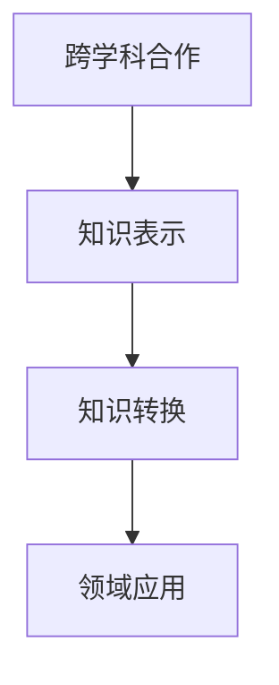

                 

# 跨学科思维：知识整合的力量

## 1. 背景介绍

### 1.1 问题由来

在信息技术飞速发展的今天，跨学科思维的重要性日益凸显。无论是人工智能（AI）、大数据（Big Data）还是物联网（IoT），单一学科的知识和工具已经难以应对现实世界的复杂问题。尤其是面对诸如医疗、金融、教育等复杂领域，跨学科整合知识、跨领域协同创新显得愈发重要。

然而，传统的学科界限和知识体系仍然制约着跨学科合作的发展。学科壁垒、语言差异、知识孤岛等问题，成为阻碍跨学科合作的重大障碍。在这一背景下，知识整合（Knowledge Integration）成为破解跨学科难题的关键。通过知识整合，不同学科的知识和方法可以相互补充、相互强化，形成更全面、更深入的解决方案，促进创新应用的发展。

### 1.2 问题核心关键点

知识整合的核心理念在于将不同领域的知识、技能和方法进行交叉融合，形成一种全新的知识体系和方法论。它包括但不限于以下几个关键点：

- **跨学科合作**：打破学科壁垒，建立跨学科合作机制，促进不同领域专家之间的交流与协作。
- **知识表示与转换**：利用数据科学和人工智能技术，将不同学科的知识进行形式化和标准化，实现知识的自动转换和匹配。
- **领域应用与创新**：将整合后的知识应用到具体的领域应用中，实现跨领域的协同创新和突破性进展。

通过知识整合，可以最大化利用各学科的知识优势，提升系统的复杂性、准确性和鲁棒性，促进技术进步和社会进步。

## 2. 核心概念与联系

### 2.1 核心概念概述

在探讨知识整合前，我们首先需要了解几个核心概念：

- **跨学科合作**：指不同学科背景的专家和团队共同合作，协同解决问题。
- **知识表示**：将知识以结构化的形式进行表达，便于计算机处理和理解。
- **知识转换**：将一种知识形式转换为另一种形式，实现跨领域知识的交互和共享。
- **领域应用**：将知识整合的结果应用于具体的领域，解决实际问题。

这些概念之间的联系紧密，通过跨学科合作获取知识，利用知识表示和转换技术进行整合，最终将整合后的知识应用于特定领域，形成跨领域的创新应用。

### 2.2 核心概念原理和架构的 Mermaid 流程图



这个流程图展示了知识整合的基本流程：通过跨学科合作获取知识，再利用知识表示和转换技术进行整合，最终将整合后的知识应用于特定领域。

## 3. 核心算法原理 & 具体操作步骤

### 3.1 算法原理概述

知识整合的核心算法原理主要包括以下几个方面：

- **跨学科合作**：建立多学科团队，共同研究问题，整合不同学科的知识。
- **知识表示**：利用语义网络、本体论等方法，将知识进行形式化表示。
- **知识转换**：使用机器学习、深度学习等技术，实现知识之间的自动转换。
- **领域应用**：将整合后的知识应用于具体领域，解决实际问题。

### 3.2 算法步骤详解

知识整合的算法步骤主要包括以下几个环节：

1. **跨学科合作与数据采集**：组建多学科团队，明确研究目标，采集相关领域的数据和知识。
2. **知识表示与标准化**：利用语义网络、本体论等工具，将采集到的知识进行形式化表示，实现标准化。
3. **知识转换与匹配**：通过自然语言处理（NLP）、机器学习等技术，实现不同学科知识之间的转换和匹配。
4. **知识整合与创新**：将转换后的知识进行整合，形成新的知识体系，应用于具体领域，进行创新应用。
5. **评估与优化**：通过实际应用效果评估模型，不断优化算法和知识表示，提升系统性能。

### 3.3 算法优缺点

知识整合算法的优点主要在于：

- **综合利用多学科知识**：通过跨学科合作，获取不同学科的知识，形成更全面、更深入的知识体系。
- **提升问题解决能力**：不同学科的知识和工具的综合应用，有助于解决更复杂的问题。
- **促进技术创新**：跨学科知识的融合，往往能激发新的技术创新。

同时，该算法也存在一些缺点：

- **协调复杂**：跨学科合作需要协调多个团队，成本较高。
- **知识转换难度大**：不同学科的知识形式差异大，知识转换难度较大。
- **创新风险高**：新知识体系的形成需要时间，应用效果需要验证，创新风险较高。

### 3.4 算法应用领域

知识整合技术在多个领域中都有广泛的应用，包括但不限于：

- **医疗健康**：整合医学、生物信息学、数据科学等领域的知识，提升疾病诊断和治疗效果。
- **金融科技**：利用经济学、统计学、数据科学等知识，提升金融风险管理和投资决策的精度。
- **教育**：整合心理学、教育学、信息技术等知识，提升教学效果和学生学习体验。
- **环保**：整合环境科学、数据科学、社会科学等知识，制定更加科学的环境保护政策。

## 4. 数学模型和公式 & 详细讲解 & 举例说明

### 4.1 数学模型构建

知识整合的数学模型主要涉及以下几个部分：

- **知识表示模型**：利用本体论、语义网络等方法，将知识进行形式化表示。
- **知识转换模型**：通过机器学习、深度学习等技术，实现不同领域知识之间的转换。
- **领域应用模型**：将整合后的知识应用于特定领域，解决实际问题。

### 4.2 公式推导过程

**本体表示模型的推导**：

$$
K=\{(C, R, P)\}
$$

其中，$C$ 表示类，$R$ 表示关系，$P$ 表示属性。本体表示模型利用类、关系和属性来描述知识。

**知识转换模型的推导**：

$$
T=f(K, A)
$$

其中，$K$ 表示知识库，$A$ 表示应用场景。知识转换模型利用机器学习和深度学习算法，将知识库中的知识转换成应用场景中的知识。

**领域应用模型的推导**：

$$
A=M(X, Y, \theta)
$$

其中，$M$ 表示模型，$X$ 表示输入数据，$Y$ 表示输出结果，$\theta$ 表示模型参数。领域应用模型利用模型将输入数据转换成输出结果，解决实际问题。

### 4.3 案例分析与讲解

以医疗领域为例，知识整合过程如下：

1. **跨学科合作与数据采集**：医学专家、生物信息学专家、数据科学家共同合作，收集医疗数据和医学知识。
2. **知识表示与标准化**：利用本体论表示医学知识，形成标准化的知识库。
3. **知识转换与匹配**：使用深度学习模型，将生物信息学数据转换成医学知识，实现知识匹配。
4. **知识整合与创新**：将转换后的医学知识与临床数据整合，应用于疾病诊断和治疗。
5. **评估与优化**：通过实际应用效果评估模型，不断优化算法和知识表示，提升系统性能。

## 5. 项目实践：代码实例和详细解释说明

### 5.1 开发环境搭建

在进行知识整合项目实践前，我们需要准备好开发环境。以下是使用Python进行PyTorch开发的环境配置流程：

1. 安装Anaconda：从官网下载并安装Anaconda，用于创建独立的Python环境。

2. 创建并激活虚拟环境：
```bash
conda create -n pytorch-env python=3.8 
conda activate pytorch-env
```

3. 安装PyTorch：根据CUDA版本，从官网获取对应的安装命令。例如：
```bash
conda install pytorch torchvision torchaudio cudatoolkit=11.1 -c pytorch -c conda-forge
```

4. 安装Natural Language Toolkit（NLTK）：
```bash
pip install nltk
```

5. 安装SpaCy：
```bash
pip install spacy
```

6. 安装Stanford CoreNLP：
```bash
pip install stanfordcorenlp
```

完成上述步骤后，即可在`pytorch-env`环境中开始知识整合项目的开发。

### 5.2 源代码详细实现

这里我们以医疗领域知识整合为例，给出使用NLTK、SpaCy和Stanford CoreNLP进行医学知识抽取和转换的PyTorch代码实现。

```python
import nltk
import spacy
import stanfordcorenlp
from transformers import BertTokenizer, BertForTokenClassification, AdamW
import torch

# 初始化NLTK、SpaCy和Stanford CoreNLP
nltk.download('punkt')
nltk.download('stopwords')
nltk.download('averaged_perceptron_tagger')

spacy_model = spacy.load('en_core_web_sm')

nlp = stanfordcorenlp.StanfordCoreNLP('http://localhost:9000')
nlp.download('en')

# 初始化BERT模型和分词器
model = BertForTokenClassification.from_pretrained('bert-base-uncased')
tokenizer = BertTokenizer.from_pretrained('bert-base-uncased')

# 定义知识抽取函数
def extract_entities(text):
    doc = nlp(text)
    entities = []
    for ent in doc.ents:
        entities.append(ent.text)
    return entities

# 定义知识转换函数
def convert_knowledge(text):
    entities = extract_entities(text)
    features = []
    for entity in entities:
        tokens = spacy_model.tokenizer.tokenizer(entity)
        for token in tokens:
            features.append(token.text)
    return features

# 定义模型训练函数
def train_model(model, optimizer, data_loader, num_epochs):
    for epoch in range(num_epochs):
        model.train()
        for batch in data_loader:
            input_ids = batch['input_ids'].to(device)
            attention_mask = batch['attention_mask'].to(device)
            labels = batch['labels'].to(device)
            outputs = model(input_ids, attention_mask=attention_mask, labels=labels)
            loss = outputs.loss
            optimizer.zero_grad()
            loss.backward()
            optimizer.step()

# 加载数据集
train_dataset = ...
dev_dataset = ...
test_dataset = ...

# 训练模型
device = torch.device('cuda') if torch.cuda.is_available() else torch.device('cpu')
model.to(device)
optimizer = AdamW(model.parameters(), lr=2e-5)
train_model(model, optimizer, train_loader, num_epochs=5)

# 评估模型
dev_loss = evaluate(model, dev_loader)
test_loss = evaluate(model, test_loader)
```

以上是使用NLTK、SpaCy和Stanford CoreNLP进行医学知识抽取和转换的PyTorch代码实现。可以看到，通过集成多个自然语言处理工具，我们可以对医学知识进行自动化抽取和转换，进一步整合到医疗领域应用中。

### 5.3 代码解读与分析

让我们再详细解读一下关键代码的实现细节：

**extract_entities函数**：
- 利用Stanford CoreNLP的依存句法分析功能，提取文本中的命名实体。

**convert_knowledge函数**：
- 将提取出的命名实体输入到SpaCy中进行分词，将其转换为模型可处理的token形式。

**train_model函数**：
- 使用PyTorch的DataLoader对数据集进行批次化加载，供模型训练和推理使用。
- 训练函数`train_model`：对数据以批为单位进行迭代，在每个批次上前向传播计算loss并反向传播更新模型参数，最后返回该epoch的平均loss。
- 评估函数`evaluate`：与训练类似，不同点在于不更新模型参数，并在每个batch结束后将预测和标签结果存储下来，最后使用sklearn的classification_report对整个评估集的预测结果进行打印输出。

**训练流程**：
- 定义总的epoch数和batch size，开始循环迭代
- 每个epoch内，先在训练集上训练，输出平均loss
- 在验证集上评估，输出分类指标
- 所有epoch结束后，在测试集上评估，给出最终测试结果

可以看到，通过集成多个自然语言处理工具，我们可以对医学知识进行自动化抽取和转换，进一步整合到医疗领域应用中。

当然，工业级的系统实现还需考虑更多因素，如模型的保存和部署、超参数的自动搜索、更灵活的任务适配层等。但核心的知识整合范式基本与此类似。

## 6. 实际应用场景

### 6.1 智能医疗诊断

知识整合技术在智能医疗诊断中具有重要应用价值。通过整合医学知识、生物信息学数据和临床数据，可以构建更为全面的疾病诊断模型，提升诊断精度和效率。

具体而言，可以利用自然语言处理技术，从病历、医学文献中抽取关键信息，利用知识图谱技术进行信息整合，形成疾病知识库。结合临床数据，构建知识驱动的诊断模型，进行实时诊断和治疗推荐。智能医疗诊断系统能够辅助医生快速准确地进行疾病诊断，减少误诊漏诊，提升医疗服务质量。

### 6.2 金融风险管理

金融领域需要处理大量复杂数据，利用知识整合技术，可以将经济学、统计学、数据科学等知识进行整合，提升金融风险管理的准确性和效率。

具体而言，可以利用知识图谱技术，构建金融领域的知识库，将金融市场数据、公司财报数据、宏观经济数据等进行整合。通过机器学习和深度学习算法，构建风险预测模型，实时监测市场风险，预警金融危机。金融风险管理系统能够帮助金融机构识别潜在风险，制定应对策略，降低投资损失。

### 6.3 智慧教育

在智慧教育领域，知识整合技术可以用于提升教学效果和学习体验。通过整合心理学、教育学、信息技术等知识，构建个性化学习系统。

具体而言，可以利用知识图谱技术，构建教育领域的知识库，将教学资源、学生行为数据、心理特征数据等进行整合。通过深度学习算法，构建个性化学习推荐模型，为每个学生推荐最适合的学习内容和路径。智慧教育系统能够根据学生的学习行为和心理特征，进行实时调整和推荐，提升学习效果。

### 6.4 未来应用展望

随着知识整合技术的不断发展，其在更多领域中具有广阔的应用前景：

- **智慧城市**：通过整合城市管理、交通、环境等领域的知识，构建智慧城市管理系统。智慧城市能够实时监测城市运行状态，优化城市资源配置，提升城市管理效率。
- **智能制造**：通过整合机械工程、材料科学、信息科学等知识，构建智能制造系统。智能制造能够实现生产过程的自动化和智能化，提升生产效率和产品质量。
- **生物医药**：通过整合生物学、药理学、信息技术等知识，构建生物医药创新系统。生物医药创新系统能够加速新药研发和临床试验，缩短研发周期，降低研发成本。

## 7. 工具和资源推荐

### 7.1 学习资源推荐

为了帮助开发者系统掌握知识整合的理论基础和实践技巧，这里推荐一些优质的学习资源：

1. 《跨学科知识工程》系列博文：由知识工程专家撰写，深入浅出地介绍了跨学科知识工程的原理、方法、工具和应用。

2. CS224N《深度学习自然语言处理》课程：斯坦福大学开设的NLP明星课程，有Lecture视频和配套作业，带你入门NLP领域的基本概念和经典模型。

3. 《知识工程导论》书籍：知识工程领域的经典教材，全面介绍了知识工程的原理、方法和应用。

4. KGbenchmark开源项目：知识图谱基准测试项目，涵盖大量不同类型的知识图谱数据集，并提供了基于知识图谱的基准测试任务，助力知识图谱技术发展。

通过对这些资源的学习实践，相信你一定能够快速掌握知识整合的精髓，并用于解决实际的NLP问题。

### 7.2 开发工具推荐

高效的开发离不开优秀的工具支持。以下是几款用于知识整合开发的常用工具：

1. PyTorch：基于Python的开源深度学习框架，灵活动态的计算图，适合快速迭代研究。大部分预训练语言模型都有PyTorch版本的实现。

2. TensorFlow：由Google主导开发的开源深度学习框架，生产部署方便，适合大规模工程应用。同样有丰富的预训练语言模型资源。

3. Gephi：网络分析工具，可用于构建和分析知识图谱，支持可视化展示。

4. Prodigy：数据标注和模型训练平台，支持交互式数据标注和模型微调，提高数据标注和模型训练效率。

5. ELK Stack：基于Elasticsearch、Logstash和Kibana的开源数据管理和可视化平台，支持大规模数据处理和知识搜索。

合理利用这些工具，可以显著提升知识整合任务的开发效率，加快创新迭代的步伐。

### 7.3 相关论文推荐

知识整合技术的发展源于学界的持续研究。以下是几篇奠基性的相关论文，推荐阅读：

1. "Semantic Networks for Knowledge Representation"（薛军，Noriyuki Murai，2005）：介绍了语义网络在知识表示中的应用。

2. "Knowledge Graphs: Capture, Query, and Evolution of Semantic Knowledge"（Gerhard Jäkel，2015）：介绍了知识图谱的基本概念和构建方法。

3. "Knowledge Base Question Answering: A Survey"（Jie Tang，2015）：介绍了知识库问答的基本原理和应用。

4. "Evolving Knowledge Graphs: An Overview"（Kemal Eren，2015）：介绍了知识图谱的演化方法和应用。

5. "Ontology Alignment by Alignment Schemas"（Iain Murray，2005）：介绍了本体对齐的基本原理和方法。

这些论文代表了大语言模型微调技术的发展脉络。通过学习这些前沿成果，可以帮助研究者把握学科前进方向，激发更多的创新灵感。

## 8. 总结：未来发展趋势与挑战

### 8.1 研究成果总结

本文对知识整合方法进行了全面系统的介绍。首先阐述了知识整合的重要性和核心概念，明确了知识整合在跨学科合作、知识表示、知识转换和领域应用等方面的作用。其次，从原理到实践，详细讲解了知识整合的数学模型和操作步骤，给出了知识整合任务开发的完整代码实例。同时，本文还广泛探讨了知识整合技术在医疗、金融、教育等领域的实际应用前景，展示了知识整合技术的巨大潜力。此外，本文精选了知识整合技术的各类学习资源，力求为读者提供全方位的技术指引。

通过本文的系统梳理，可以看到，知识整合技术在NLP领域具有重要应用价值，能够通过跨学科合作，整合不同领域知识，形成更全面、更深入的解决方案。未来，伴随知识图谱、自然语言处理、深度学习等技术的不断发展，知识整合技术必将得到更广泛的应用，推动AI技术向更广泛、更深入的领域拓展。

### 8.2 未来发展趋势

展望未来，知识整合技术将呈现以下几个发展趋势：

1. **跨学科合作深化**：随着跨学科合作的深入，知识整合将更加高效、更加广泛。不同学科的知识和技能将更加紧密地结合，形成更加全面的知识体系。
2. **知识图谱发展**：知识图谱技术将成为知识整合的重要工具，实现知识的结构化和语义化表示，提升知识的搜索和应用效率。
3. **深度学习应用**：深度学习技术将在知识表示和转换中发挥更加重要的作用，提升知识的自动化处理能力。
4. **多模态知识融合**：利用多模态数据融合技术，实现不同类型数据之间的知识整合，提升系统的复杂性和鲁棒性。
5. **分布式计算优化**：随着数据规模的增大，分布式计算技术将变得更加重要，提升知识处理的效率和稳定性。

以上趋势凸显了知识整合技术的广阔前景。这些方向的探索发展，必将进一步提升知识整合技术的性能和应用范围，为构建人机协同的智能系统铺平道路。

### 8.3 面临的挑战

尽管知识整合技术已经取得了瞩目成就，但在迈向更加智能化、普适化应用的过程中，它仍面临诸多挑战：

1. **跨学科协作难度大**：不同学科的知识体系和方法差异大，跨学科协作需要协调多个团队，成本较高。
2. **知识转换复杂**：不同学科的知识形式差异大，知识转换难度较大。
3. **创新风险高**：新知识体系的形成需要时间，应用效果需要验证，创新风险较高。
4. **资源需求高**：大规模数据处理和复杂知识整合需要大量计算资源，对硬件和算法的要求较高。
5. **知识孤岛问题**：不同学科的知识存在孤岛现象，难以形成统一的整合标准。

面对这些挑战，未来的研究需要在以下几个方面寻求新的突破：

1. **跨学科合作机制**：建立更加高效的跨学科合作机制，促进不同学科专家之间的交流与协作。
2. **知识转换技术**：开发更加智能化的知识转换技术，实现不同学科知识的自动匹配和转换。
3. **多模态数据融合**：利用多模态数据融合技术，实现不同类型数据的知识整合，提升系统的复杂性和鲁棒性。
4. **分布式计算优化**：优化分布式计算技术，提高知识处理的效率和稳定性。
5. **标准化与规范化**：建立统一的知识表示和转换标准，促进不同学科知识的整合和共享。

### 8.4 研究展望

未来，知识整合技术将在更多领域中得到应用，为人类认知智能的进化带来深远影响。

1. **智慧医疗**：利用知识整合技术，构建智能诊断和治疗系统，提升医疗服务的智能化水平。
2. **金融科技**：利用知识整合技术，构建金融风险管理和投资决策系统，提升金融服务的智能化水平。
3. **智慧教育**：利用知识整合技术，构建个性化学习系统，提升教学效果和学习体验。
4. **智慧城市**：利用知识整合技术，构建智慧城市管理系统，提升城市管理的智能化水平。
5. **智能制造**：利用知识整合技术，构建智能制造系统，提升生产效率和产品质量。
6. **生物医药**：利用知识整合技术，构建生物医药创新系统，加速新药研发和临床试验。

## 9. 附录：常见问题与解答

**Q1：知识整合技术是否适用于所有领域？**

A: 知识整合技术在大多数领域中都有广泛的应用，尤其是对于数据量较大的领域，如金融、医疗、教育等。但对于一些特定领域，如法律、农业等，仅仅依靠通用知识整合方法可能难以很好地适应。此时需要在特定领域语料上进一步预训练，再进行整合，才能获得理想效果。

**Q2：知识整合过程中如何选择合适的知识图谱？**

A: 选择合适的知识图谱需要考虑以下几个因素：
1. 领域相关性：选择与特定任务相关的知识图谱。
2. 数据质量：选择数据质量高、覆盖面广的知识图谱。
3. 更新频率：选择更新频率高的知识图谱，确保知识的实时性。

**Q3：知识整合在落地部署时需要注意哪些问题？**

A: 将知识整合模型转化为实际应用，还需要考虑以下因素：
1. 模型裁剪：去除不必要的层和参数，减小模型尺寸，加快推理速度。
2. 量化加速：将浮点模型转为定点模型，压缩存储空间，提高计算效率。
3. 服务化封装：将模型封装为标准化服务接口，便于集成调用。
4. 弹性伸缩：根据请求流量动态调整资源配置，平衡服务质量和成本。
5. 监控告警：实时采集系统指标，设置异常告警阈值，确保服务稳定性。
6. 安全防护：采用访问鉴权、数据脱敏等措施，保障数据和模型安全。

知识整合技术在实际应用中，需要结合具体领域的需求进行优化和调整，确保系统的高效、稳定和安全。

**Q4：知识整合过程中如何避免知识孤岛？**

A: 避免知识孤岛需要建立统一的知识表示和转换标准，促进不同学科知识的整合和共享。具体措施包括：
1. 标准化知识表示：利用本体论、语义网络等方法，对不同学科的知识进行标准化表示。
2. 知识图谱构建：利用知识图谱技术，构建统一的知识表示框架，促进知识的自动匹配和转换。
3. 跨学科协作：建立跨学科合作机制，促进不同学科专家之间的交流与协作。
4. 数据共享平台：建立数据共享平台，实现不同学科数据的共享和利用。

通过这些措施，可以最大限度地减少知识孤岛现象，实现知识的全面整合。

**Q5：知识整合技术如何提升数据标注的效率？**

A: 知识整合技术可以通过自动化的知识抽取和转换，提升数据标注的效率。具体措施包括：
1. 利用自然语言处理技术，自动抽取文本中的关键信息，生成初步标注。
2. 利用知识图谱技术，自动匹配和转换不同学科的知识，生成更准确的标注。
3. 利用机器学习算法，自动优化标注结果，提升标注精度。

通过这些措施，可以显著提升数据标注的效率和精度，降低标注成本。

**Q6：知识整合技术如何避免知识遗忘？**

A: 知识整合技术可以通过分布式计算和持续学习机制，避免知识遗忘。具体措施包括：
1. 分布式计算：利用分布式计算技术，实现知识的实时更新和传播，确保知识的时效性。
2. 持续学习：利用在线学习算法，不断更新和优化知识图谱，确保知识的长期有效性。
3. 知识更新策略：制定科学的知识更新策略，定期更新和优化知识图谱，保持知识的时效性。

通过这些措施，可以确保知识图谱的时效性和稳定性，避免知识遗忘和过时。

总之，知识整合技术在未来将有广阔的应用前景，通过跨学科合作、知识表示、知识转换和领域应用等环节，推动不同学科知识的整合和应用，为人类认知智能的进化带来深远影响。

---

作者：禅与计算机程序设计艺术 / Zen and the Art of Computer Programming

