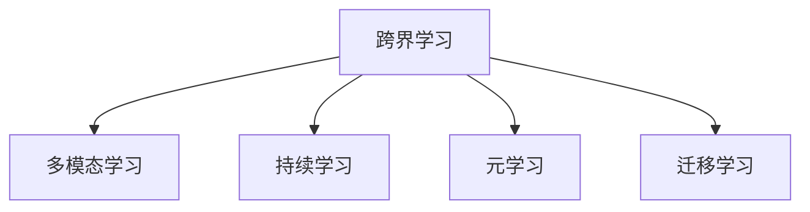

                 

# 跨界学习：拓宽职业发展空间

在这个快速变化的数字时代，技术的不断演进和各领域之间的交叉融合，让跨界学习成为了个人和组织获取新技能、提升竞争力的重要手段。本文将深入探讨跨界学习的概念、原理、实践方法和应用场景，并通过详细的案例分析和工具推荐，帮助读者系统理解这一趋势，掌握跨界学习的策略和方法。

## 1. 背景介绍

### 1.1 问题由来

在过去几十年里，技术的发展已经深刻改变了各行各业的面貌。人工智能、大数据、区块链等新兴技术不断涌现，为传统行业带来了全新的机遇和挑战。与此同时，技术的边界也在不断模糊，各种学科之间的交叉和融合日益频繁。在这样的背景下，跨界学习变得越来越重要，它不仅能够帮助个人获取跨领域的知识和技能，还能够为组织创新带来新的活力。

### 1.2 问题核心关键点

跨界学习的核心在于打破学科壁垒，通过学习和实践不同领域的知识和技术，提升个人的综合素质和创新能力。其关键点包括：
- 多领域知识的整合与创新
- 跨学科技能的交叉与融合
- 新技术的快速学习与应用
- 持续的学习与自我迭代

## 2. 核心概念与联系

### 2.1 核心概念概述

为更好地理解跨界学习的原理和架构，本节将介绍几个密切相关的核心概念：

- 跨界学习(Cross-Disciplinary Learning)：指通过学习和实践不同领域的知识，提升个人的综合素质和创新能力。

- 多模态学习(Multimodal Learning)：指同时利用多种数据类型（如文本、图像、音频等）进行学习，提升模型的综合理解能力。

- 持续学习(Continual Learning)：指模型能够持续从新数据中学习，同时保持已学习的知识，避免灾难性遗忘。

- 元学习(Meta-Learning)：指模型能够学习如何学习，即在不同的任务中快速适应新环境。

- 迁移学习(Transfer Learning)：指将在一个领域学到的知识，迁移到另一个不同但相关的领域进行学习。

这些核心概念之间的逻辑关系可以通过以下Mermaid流程图来展示：



这个流程图展示了几大核心概念之间的逻辑关系：

1. 跨界学习是通过多学科的整合和创新，实现知识的广泛应用。
2. 多模态学习是在跨界学习中，通过多种数据类型的融合，提升模型的综合理解能力。
3. 持续学习是在跨界学习中，保持模型的知识更新和稳定性。
4. 元学习是在跨界学习中，提升模型的快速适应能力和学习效率。
5. 迁移学习是在跨界学习中，通过知识的迁移应用，提升模型在不同场景下的表现。

这些概念共同构成了跨界学习的理论基础，使其成为个人和组织在数字化转型中获取竞争优势的重要策略。

## 3. 核心算法原理 & 具体操作步骤

### 3.1 算法原理概述

跨界学习的过程可以分为两个阶段：首先是知识获取阶段，通过多学科的学习获取相关的知识和技能；其次是知识应用阶段，将这些知识和技能应用到实际问题中，进行创新和优化。

在知识获取阶段，可以采用监督学习、无监督学习或强化学习等方法，从大量数据中学习和提取相关知识。在知识应用阶段，可以通过迁移学习、元学习等技术，将获取的知识迁移到新的任务或环境中，实现知识的泛化应用。

### 3.2 算法步骤详解

跨界学习的具体操作可以分为以下几个关键步骤：

**Step 1: 确定学习目标和领域**

- 明确学习的目标和需要掌握的核心技能。
- 确定要学习的相关领域，如数据科学、人工智能、区块链等。

**Step 2: 收集和处理数据**

- 从相关领域收集高质量的数据集。
- 对数据进行预处理，包括数据清洗、特征提取、数据增强等。

**Step 3: 选择学习方法和工具**

- 根据学习目标选择适合的学习方法和工具，如深度学习框架、机器学习算法等。
- 选择合适的学习算法和模型，如卷积神经网络、循环神经网络、生成对抗网络等。

**Step 4: 实施学习计划**

- 按照学习计划逐步进行学习和实践，记录学习过程和心得。
- 通过项目实践、代码实现等方式，将理论知识应用到实际问题中。

**Step 5: 评估和优化**

- 定期评估学习效果，通过测试和实验验证所学知识的实际应用效果。
- 根据评估结果调整学习计划和方法，进行优化和迭代。

### 3.3 算法优缺点

跨界学习具有以下优点：
1. 提升综合素质：通过多学科的学习，获取更广泛的知识和技能，提升个人的综合素质。
2. 促进创新：跨界学习能够带来新的视角和方法，激发创新思维和创新能力。
3. 适应性强：跨界学习者能够快速适应新的技术和市场变化，保持竞争力。
4. 推动组织创新：跨界学习能够促进组织内部的知识共享和创新，提升组织整体实力。

同时，跨界学习也存在一些局限性：
1. 学习成本高：跨界学习需要投入大量时间和精力，学习成本较高。
2. 知识融合难度大：不同领域的知识结构和思维方式差异较大，进行知识融合和应用需要较强的整合能力。
3. 应用效果不确定：跨界学习的实际应用效果具有不确定性，需要大量的试验和调整。

尽管存在这些局限性，但跨界学习对于个人和组织在数字化转型中的竞争优势至关重要。

### 3.4 算法应用领域

跨界学习广泛应用于多个领域，包括但不限于：

- 数据科学：通过学习数学、统计学、编程等知识，提升数据处理和分析能力。
- 人工智能：通过学习算法、模型、编程等知识，提升机器学习和深度学习能力。
- 区块链：通过学习密码学、分布式系统、编程等知识，提升区块链技术应用能力。
- 自然语言处理：通过学习语言学、计算机科学、统计学等知识，提升自然语言理解和生成能力。
- 物联网：通过学习电子工程、计算机科学、网络通信等知识，提升物联网技术应用能力。

## 4. 数学模型和公式 & 详细讲解 & 举例说明

### 4.1 数学模型构建

本节将使用数学语言对跨界学习的过程进行更加严格的刻画。

假设要学习的数据集为 $D=\{(x_i,y_i)\}_{i=1}^N$，其中 $x_i$ 为输入数据，$y_i$ 为标签。设 $f$ 为模型，目标是通过学习数据集 $D$ 来逼近函数 $f$。

### 4.2 公式推导过程

在监督学习中，模型 $f$ 的损失函数 $L$ 定义为：

$$
L(f) = \frac{1}{N} \sum_{i=1}^N \ell(f(x_i), y_i)
$$

其中 $\ell$ 为损失函数，常见的损失函数包括均方误差损失、交叉熵损失等。目标是最小化损失函数 $L$，即找到最优的模型参数 $\theta$：

$$
\theta^* = \mathop{\arg\min}_{\theta} L(f_\theta)
$$

在无监督学习中，目标是通过学习数据的分布特征，寻找最优的模型参数 $\theta$：

$$
\theta^* = \mathop{\arg\min}_{\theta} \mathcal{L}(\theta)
$$

其中 $\mathcal{L}$ 为无监督学习的损失函数。

### 4.3 案例分析与讲解

以自然语言处理领域为例，假设要学习中文分词任务，数据集为 $D=\{(x_i,y_i)\}_{i=1}^N$，其中 $x_i$ 为中文文本，$y_i$ 为分词结果。

设模型 $f$ 为基于深度学习的方法，如 BiLSTM-CRF。在模型训练中，需要定义损失函数 $L$ 为：

$$
L(f) = -\frac{1}{N} \sum_{i=1}^N \log P(y_i | x_i)
$$

其中 $P(y_i | x_i)$ 为模型对分词结果 $y_i$ 的预测概率。在模型评估中，可以计算 F1-score 等指标，评估模型性能。

## 5. 项目实践：代码实例和详细解释说明

### 5.1 开发环境搭建

在进行跨界学习实践前，我们需要准备好开发环境。以下是使用Python进行PyTorch开发的环境配置流程：

1. 安装Anaconda：从官网下载并安装Anaconda，用于创建独立的Python环境。

2. 创建并激活虚拟环境：
```bash
conda create -n pytorch-env python=3.8 
conda activate pytorch-env
```

3. 安装PyTorch：根据CUDA版本，从官网获取对应的安装命令。例如：
```bash
conda install pytorch torchvision torchaudio cudatoolkit=11.1 -c pytorch -c conda-forge
```

4. 安装Transformers库：
```bash
pip install transformers
```

5. 安装各类工具包：
```bash
pip install numpy pandas scikit-learn matplotlib tqdm jupyter notebook ipython
```

完成上述步骤后，即可在`pytorch-env`环境中开始跨界学习实践。

### 5.2 源代码详细实现

这里我们以自然语言处理领域为例，展示如何使用PyTorch进行中文分词任务的跨界学习。

首先，定义分词数据处理函数：

```python
from transformers import BertTokenizer
from torch.utils.data import Dataset
import torch

class ChineseWordSegmentationDataset(Dataset):
    def __init__(self, texts, labels, tokenizer, max_len=128):
        self.texts = texts
        self.labels = labels
        self.tokenizer = tokenizer
        self.max_len = max_len
        
    def __len__(self):
        return len(self.texts)
    
    def __getitem__(self, item):
        text = self.texts[item]
        label = self.labels[item]
        
        encoding = self.tokenizer(text, return_tensors='pt', max_length=self.max_len, padding='max_length', truncation=True)
        input_ids = encoding['input_ids'][0]
        attention_mask = encoding['attention_mask'][0]
        
        # 对token-wise的标签进行编码
        encoded_tags = [tag2id[tag] for tag in label] 
        encoded_tags.extend([tag2id['O']] * (self.max_len - len(encoded_tags)))
        labels = torch.tensor(encoded_tags, dtype=torch.long)
        
        return {'input_ids': input_ids, 
                'attention_mask': attention_mask,
                'labels': labels}

# 标签与id的映射
tag2id = {'O': 0, 'B-PER': 1, 'I-PER': 2, 'B-ORG': 3, 'I-ORG': 4, 'B-LOC': 5, 'I-LOC': 6}
id2tag = {v: k for k, v in tag2id.items()}

# 创建dataset
tokenizer = BertTokenizer.from_pretrained('bert-base-cased')

train_dataset = ChineseWordSegmentationDataset(train_texts, train_tags, tokenizer)
dev_dataset = ChineseWordSegmentationDataset(dev_texts, dev_tags, tokenizer)
test_dataset = ChineseWordSegmentationDataset(test_texts, test_tags, tokenizer)
```

然后，定义模型和优化器：

```python
from transformers import BertForTokenClassification, AdamW

model = BertForTokenClassification.from_pretrained('bert-base-cased', num_labels=len(tag2id))

optimizer = AdamW(model.parameters(), lr=2e-5)
```

接着，定义训练和评估函数：

```python
from torch.utils.data import DataLoader
from tqdm import tqdm
from sklearn.metrics import classification_report

device = torch.device('cuda') if torch.cuda.is_available() else torch.device('cpu')
model.to(device)

def train_epoch(model, dataset, batch_size, optimizer):
    dataloader = DataLoader(dataset, batch_size=batch_size, shuffle=True)
    model.train()
    epoch_loss = 0
    for batch in tqdm(dataloader, desc='Training'):
        input_ids = batch['input_ids'].to(device)
        attention_mask = batch['attention_mask'].to(device)
        labels = batch['labels'].to(device)
        model.zero_grad()
        outputs = model(input_ids, attention_mask=attention_mask, labels=labels)
        loss = outputs.loss
        epoch_loss += loss.item()
        loss.backward()
        optimizer.step()
    return epoch_loss / len(dataloader)

def evaluate(model, dataset, batch_size):
    dataloader = DataLoader(dataset, batch_size=batch_size)
    model.eval()
    preds, labels = [], []
    with torch.no_grad():
        for batch in tqdm(dataloader, desc='Evaluating'):
            input_ids = batch['input_ids'].to(device)
            attention_mask = batch['attention_mask'].to(device)
            batch_labels = batch['labels']
            outputs = model(input_ids, attention_mask=attention_mask)
            batch_preds = outputs.logits.argmax(dim=2).to('cpu').tolist()
            batch_labels = batch_labels.to('cpu').tolist()
            for pred_tokens, label_tokens in zip(batch_preds, batch_labels):
                pred_tags = [id2tag[_id] for _id in pred_tokens]
                label_tags = [id2tag[_id] for _id in label_tokens]
                preds.append(pred_tags[:len(label_tokens)])
                labels.append(label_tags)
                
    print(classification_report(labels, preds))
```

最后，启动训练流程并在测试集上评估：

```python
epochs = 5
batch_size = 16

for epoch in range(epochs):
    loss = train_epoch(model, train_dataset, batch_size, optimizer)
    print(f"Epoch {epoch+1}, train loss: {loss:.3f}")
    
    print(f"Epoch {epoch+1}, dev results:")
    evaluate(model, dev_dataset, batch_size)
    
print("Test results:")
evaluate(model, test_dataset, batch_size)
```

以上就是使用PyTorch对BERT进行中文分词任务跨界学习的完整代码实现。可以看到，得益于Transformers库的强大封装，我们可以用相对简洁的代码完成BERT模型的加载和微调。

### 5.3 代码解读与分析

让我们再详细解读一下关键代码的实现细节：

**ChineseWordSegmentationDataset类**：
- `__init__`方法：初始化文本、标签、分词器等关键组件。
- `__len__`方法：返回数据集的样本数量。
- `__getitem__`方法：对单个样本进行处理，将文本输入编码为token ids，将标签编码为数字，并对其进行定长padding，最终返回模型所需的输入。

**tag2id和id2tag字典**：
- 定义了标签与数字id之间的映射关系，用于将token-wise的预测结果解码回真实的标签。

**训练和评估函数**：
- 使用PyTorch的DataLoader对数据集进行批次化加载，供模型训练和推理使用。
- 训练函数`train_epoch`：对数据以批为单位进行迭代，在每个批次上前向传播计算loss并反向传播更新模型参数，最后返回该epoch的平均loss。
- 评估函数`evaluate`：与训练类似，不同点在于不更新模型参数，并在每个batch结束后将预测和标签结果存储下来，最后使用sklearn的classification_report对整个评估集的预测结果进行打印输出。

**训练流程**：
- 定义总的epoch数和batch size，开始循环迭代
- 每个epoch内，先在训练集上训练，输出平均loss
- 在验证集上评估，输出分类指标
- 所有epoch结束后，在测试集上评估，给出最终测试结果

可以看到，PyTorch配合Transformers库使得BERT跨界学习的代码实现变得简洁高效。开发者可以将更多精力放在数据处理、模型改进等高层逻辑上，而不必过多关注底层的实现细节。

当然，工业级的系统实现还需考虑更多因素，如模型的保存和部署、超参数的自动搜索、更灵活的任务适配层等。但核心的跨界学习流程基本与此类似。

## 6. 实际应用场景

### 6.1 智能客服系统

基于跨界学习的对话技术，可以广泛应用于智能客服系统的构建。传统客服往往需要配备大量人力，高峰期响应缓慢，且一致性和专业性难以保证。而通过跨界学习，能够构建跨学科、多模态的智能客服系统，实现7x24小时不间断服务，快速响应客户咨询，用自然流畅的语言解答各类常见问题。

在技术实现上，可以收集企业内部的历史客服对话记录，将问题和最佳答复构建成监督数据，在此基础上对预训练模型进行跨界学习。学习后的对话模型能够自动理解用户意图，匹配最合适的答案模板进行回复。对于客户提出的新问题，还可以接入检索系统实时搜索相关内容，动态组织生成回答。如此构建的智能客服系统，能大幅提升客户咨询体验和问题解决效率。

### 6.2 金融舆情监测

金融机构需要实时监测市场舆论动向，以便及时应对负面信息传播，规避金融风险。传统的人工监测方式成本高、效率低，难以应对网络时代海量信息爆发的挑战。基于跨界学习的文本分类和情感分析技术，为金融舆情监测提供了新的解决方案。

具体而言，可以收集金融领域相关的新闻、报道、评论等文本数据，并对其进行主题标注和情感标注。在此基础上对预训练语言模型进行跨界学习，使其能够自动判断文本属于何种主题，情感倾向是正面、中性还是负面。将学习后的模型应用到实时抓取的网络文本数据，就能够自动监测不同主题下的情感变化趋势，一旦发现负面信息激增等异常情况，系统便会自动预警，帮助金融机构快速应对潜在风险。

### 6.3 个性化推荐系统

当前的推荐系统往往只依赖用户的历史行为数据进行物品推荐，无法深入理解用户的真实兴趣偏好。基于跨界学习的个性化推荐系统可以更好地挖掘用户行为背后的语义信息，从而提供更精准、多样的推荐内容。

在实践中，可以收集用户浏览、点击、评论、分享等行为数据，提取和用户交互的物品标题、描述、标签等文本内容。将文本内容作为模型输入，用户的后续行为（如是否点击、购买等）作为监督信号，在此基础上跨界学习预训练语言模型。学习后的模型能够从文本内容中准确把握用户的兴趣点。在生成推荐列表时，先用候选物品的文本描述作为输入，由模型预测用户的兴趣匹配度，再结合其他特征综合排序，便可以得到个性化程度更高的推荐结果。

### 6.4 未来应用展望

随着跨界学习的不断发展，未来将在更多领域得到应用，为传统行业带来变革性影响。

在智慧医疗领域，基于跨界学习的医疗问答、病历分析、药物研发等应用将提升医疗服务的智能化水平，辅助医生诊疗，加速新药开发进程。

在智能教育领域，跨界学习可应用于作业批改、学情分析、知识推荐等方面，因材施教，促进教育公平，提高教学质量。

在智慧城市治理中，跨界学习可应用于城市事件监测、舆情分析、应急指挥等环节，提高城市管理的自动化和智能化水平，构建更安全、高效的未来城市。

此外，在企业生产、社会治理、文娱传媒等众多领域，跨界学习的应用也将不断涌现，为NLP技术带来全新的突破。相信随着预训练语言模型和跨界学习方法的不断进步，跨界学习必将在构建人机协同的智能时代中扮演越来越重要的角色。

## 7. 工具和资源推荐
### 7.1 学习资源推荐

为了帮助开发者系统掌握跨界学习的理论基础和实践技巧，这里推荐一些优质的学习资源：

1. 《深度学习》系列博文：由大模型技术专家撰写，深入浅出地介绍了深度学习的基本概念和应用场景。

2. Coursera《深度学习专项课程》：由斯坦福大学开设的深度学习在线课程，包含多个主题，从基础到高级，适合不同层次的学习者。

3. 《动手学深度学习》书籍：由李沐等人编写，涵盖了深度学习从理论到实践的全面内容，是入门学习的重要参考资料。

4. HuggingFace官方文档：Transformers库的官方文档，提供了海量预训练模型和完整的跨界学习样例代码，是上手实践的必备资料。

5. Kaggle开源项目：包含大量跨界学习相关的数据集和竞赛，能够提供丰富的实践机会和挑战。

通过对这些资源的学习实践，相信你一定能够快速掌握跨界学习的精髓，并用于解决实际的NLP问题。

### 7.2 开发工具推荐

高效的开发离不开优秀的工具支持。以下是几款用于跨界学习开发的常用工具：

1. PyTorch：基于Python的开源深度学习框架，灵活动态的计算图，适合快速迭代研究。

2. TensorFlow：由Google主导开发的开源深度学习框架，生产部署方便，适合大规模工程应用。

3. Transformers库：HuggingFace开发的NLP工具库，集成了众多SOTA语言模型，支持PyTorch和TensorFlow，是进行跨界学习任务的开发的利器。

4. Weights & Biases：模型训练的实验跟踪工具，可以记录和可视化模型训练过程中的各项指标，方便对比和调优。

5. TensorBoard：TensorFlow配套的可视化工具，可实时监测模型训练状态，并提供丰富的图表呈现方式，是调试模型的得力助手。

6. Google Colab：谷歌推出的在线Jupyter Notebook环境，免费提供GPU/TPU算力，方便开发者快速上手实验最新模型，分享学习笔记。

合理利用这些工具，可以显著提升跨界学习的开发效率，加快创新迭代的步伐。

### 7.3 相关论文推荐

跨界学习的研究源于学界的持续研究。以下是几篇奠基性的相关论文，推荐阅读：

1. Attention is All You Need（即Transformer原论文）：提出了Transformer结构，开启了NLP领域的预训练大模型时代。

2. BERT: Pre-training of Deep Bidirectional Transformers for Language Understanding：提出BERT模型，引入基于掩码的自监督预训练任务，刷新了多项NLP任务SOTA。

3. Transformer-XL: Attentive Language Models Beyond a Fixed-Length Context：提出了Transformer-XL模型，解决了长序列建模问题。

4. Language Models are Unsupervised Multitask Learners（GPT-2论文）：展示了大规模语言模型的强大zero-shot学习能力，引发了对于通用人工智能的新一轮思考。

5. Meta-Learning in Neural Networks：提出元学习理论，研究模型如何从少量数据中快速学习。

6. Transfer Learning with Multi-task Learning: A Survey and Tutorial on Transfer Learning in NLP：对跨界学习的原理和应用进行了全面综述，适合初学者系统学习。

这些论文代表了大模型和跨界学习的最新进展。通过学习这些前沿成果，可以帮助研究者把握学科前进方向，激发更多的创新灵感。

## 8. 总结：未来发展趋势与挑战

### 8.1 总结

本文对跨界学习的概念、原理、实践方法和应用场景进行了全面系统的介绍。首先阐述了跨界学习在数字化转型中的重要性，明确了跨界学习对于提升个人和组织竞争力的关键作用。其次，从原理到实践，详细讲解了跨界学习的数学模型、关键步骤和操作技巧，并通过详细的代码实例展示了跨界学习的具体实现。同时，本文还广泛探讨了跨界学习在多个领域的应用前景，展示了跨界学习的广阔应用空间。

通过本文的系统梳理，可以看到，跨界学习是数字化转型时代的重要工具，对于个人和组织在多学科交叉融合中获取新技能、提升创新能力具有重要意义。

### 8.2 未来发展趋势

展望未来，跨界学习将呈现以下几个发展趋势：

1. 跨学科知识的深度融合：未来的跨界学习将更加注重不同学科知识的深度整合和创新，形成跨领域的知识体系。

2. 多模态学习的应用扩展：随着技术的进步，多模态学习的应用将越来越广泛，涵盖更多类型的数据，提升模型的综合理解能力。

3. 持续学习和元学习的结合：未来的跨界学习将更加注重持续学习和元学习的应用，提升模型的快速适应能力和学习效率。

4. 自动化和智能化的提升：跨界学习将与自动化和智能化技术结合，如自动调参、自适应学习等，提升学习效率和效果。

5. 跨界学习的生态系统构建：跨界学习将与更多的工具和平台结合，形成跨界学习的生态系统，促进跨学科知识的应用和共享。

这些趋势凸显了跨界学习在数字化转型中的重要性和广阔前景，必将为个人和组织带来更多的机遇和挑战。

### 8.3 面临的挑战

尽管跨界学习已经取得了显著进展，但在迈向更加智能化、普适化应用的过程中，它仍面临着诸多挑战：

1. 知识融合的复杂性：不同学科的知识结构和思维方式差异较大，进行知识融合和应用需要较强的整合能力。

2. 跨界学习的门槛高：跨界学习需要掌握多个领域的知识和技能，学习成本较高，门槛较大。

3. 应用效果的稳定性：跨界学习的实际应用效果具有不确定性，需要大量的试验和调整。

4. 模型的可解释性和可控性：跨界学习模型往往较为复杂，其决策过程和输出结果缺乏可解释性和可控性，难以满足高风险应用的需求。

5. 技术的集成和应用：跨界学习需要与其他技术进行深度集成，如知识表示、因果推理、强化学习等，多路径协同发力，才能实现最佳效果。

这些挑战是跨界学习发展过程中必须面对的问题，需要通过不断的研究和实践，逐步克服。

### 8.4 研究展望

未来的研究需要在以下几个方面寻求新的突破：

1. 跨学科知识表示和理解：研究如何更好地融合不同学科的知识，形成一致的知识表示框架，提升跨界学习的效率和效果。

2. 多模态学习与融合：研究如何将不同类型的数据进行有效融合，提升模型的综合理解能力。

3. 持续学习和元学习的理论和方法：研究如何通过持续学习和元学习提升模型的快速适应能力和学习效率，提升跨界学习的鲁棒性和可扩展性。

4. 跨界学习的自动化和智能化：研究如何通过自动化和智能化技术提升跨界学习的效率和效果，降低学习成本和门槛。

5. 跨界学习的效果评估和优化：研究如何建立科学的效果评估指标和优化方法，确保跨界学习的效果和可靠性。

这些研究方向将引领跨界学习技术迈向更高的台阶，为构建安全、可靠、可解释、可控的智能系统铺平道路。面向未来，跨界学习技术还需要与其他人工智能技术进行更深入的融合，如知识表示、因果推理、强化学习等，多路径协同发力，共同推动人工智能技术的发展。只有勇于创新、敢于突破，才能不断拓展跨界学习的边界，让人工智能技术更好地造福人类社会。

## 9. 附录：常见问题与解答

**Q1：跨界学习是否适用于所有学科？**

A: 跨界学习适用于大部分学科，尤其是那些交叉性强、应用广泛的领域。但对于一些特定领域的学科，如物理学、化学等，跨界学习的难度和效果可能会受到限制。因此，在实际应用中，需要根据具体情况进行评估和选择。

**Q2：如何进行跨界学习的项目实践？**

A: 进行跨界学习的项目实践需要以下步骤：

1. 确定学习目标和领域。
2. 收集和处理数据。
3. 选择学习方法和工具。
4. 实施学习计划。
5. 评估和优化学习效果。

每个步骤都需要仔细规划和执行，并记录学习过程和心得。通过不断的实践和优化，逐步提升跨界学习的效果和效率。

**Q3：跨界学习在实际应用中需要注意哪些问题？**

A: 在实际应用中，需要注意以下问题：

1. 数据质量和多样性：跨界学习依赖于高质量、多样性的数据，需要注重数据的选择和处理。

2. 模型复杂度和计算资源：跨界学习模型往往较为复杂，需要大量的计算资源和时间，需要合理规划计算资源。

3. 模型的可解释性和可控性：跨界学习模型缺乏可解释性，需要研究如何提升模型的可解释性和可控性。

4. 应用的稳定性和可靠性：跨界学习模型需要经过大量的试验和调整，确保其稳定性和可靠性。

5. 跨学科知识的融合和应用：跨界学习需要注重不同学科知识的融合和应用，确保跨界学习的实际效果。

这些问题是跨界学习在实际应用中需要注意的关键点，需要通过不断的研究和实践逐步解决。

**Q4：如何提升跨界学习的效果？**

A: 提升跨界学习的效果需要以下策略：

1. 选择合适的方法和工具。
2. 注重数据的质量和多样性。
3. 合理规划计算资源。
4. 进行多轮学习和优化。
5. 注重模型的可解释性和可控性。

通过科学的方法和策略，可以有效提升跨界学习的效果和效率。

---

作者：禅与计算机程序设计艺术 / Zen and the Art of Computer Programming

