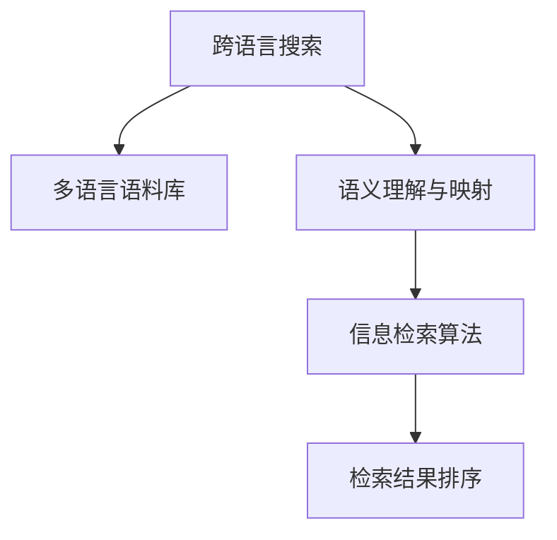

                 

## 1. 背景介绍

### 1.1 问题由来
在互联网时代，全球信息呈爆炸性增长，人们在获取信息时面临着语言障碍。为了解决这一问题，跨语言搜索技术应运而生。跨语言搜索不仅能够跨越语言和地域的限制，还能帮助用户快速找到所需信息，提高信息获取效率。在AI技术的加持下，跨语言搜索技术更是得到了飞速发展，成为了现代信息检索的强大工具。

### 1.2 问题核心关键点
跨语言搜索的核心在于如何跨越语言障碍，实现多语言信息的高效检索。其难点在于：
- 不同语言之间的语义差异
- 语言结构与语义的映射
- 多语言数据的融合与检索算法
- 跨语言检索的准确性与效率

### 1.3 问题研究意义
跨语言搜索技术不仅能够提升信息检索的效率，还能增强多语言用户的信息获取能力，推动全球化进程。具体意义包括：
- 促进全球信息共享与交流
- 增强多语言用户的信息获取能力
- 促进跨语言应用场景的发展
- 推动全球化进程

## 2. 核心概念与联系

### 2.1 核心概念概述

跨语言搜索技术的核心概念包括：

- **跨语言搜索**：指能够跨越不同语言和地域限制，实现多语言信息高效检索的技术。
- **多语言语料库**：收集并标注多个语言的数据，为跨语言检索提供丰富的语料基础。
- **语义理解与映射**：利用AI技术理解不同语言间的语义，实现语义映射与转换。
- **信息检索算法**：利用算法将用户查询与多语言语料库中的信息进行匹配，返回相关结果。
- **检索结果排序**：根据不同语言特点，对检索结果进行排序，提升检索质量。

这些核心概念通过一系列技术手段联系起来，形成了一个完整的跨语言搜索系统。

### 2.2 核心概念原理和架构的 Mermaid 流程图



### 2.3 核心概念之间的逻辑关系

- **多语言语料库**是跨语言搜索的基础，提供了检索所需的多语言数据。
- **语义理解与映射**是跨语言检索的关键，通过理解不同语言之间的语义，实现信息转换和匹配。
- **信息检索算法**将用户查询与语料库中的信息进行匹配，返回相关结果。
- **检索结果排序**对不同语言的结果进行排序，提升检索质量。

这些核心概念共同构成了一个完整的跨语言搜索系统。

## 3. 核心算法原理 & 具体操作步骤

### 3.1 算法原理概述

跨语言搜索技术主要利用AI技术理解不同语言之间的语义，实现信息转换和匹配。其核心算法包括：

- **语义理解与映射算法**：利用自然语言处理技术理解不同语言之间的语义，实现语义映射与转换。
- **信息检索算法**：将用户查询与多语言语料库中的信息进行匹配，返回相关结果。
- **检索结果排序算法**：根据不同语言特点，对检索结果进行排序，提升检索质量。

### 3.2 算法步骤详解

**Step 1: 收集与标注多语言语料库**

- 收集多语言文本数据，如新闻、文章、网页等。
- 对多语言文本进行标注，形成多语言语料库。

**Step 2: 语义理解与映射**

- 利用预训练语言模型（如BERT、GPT等）对多语言语料库进行预训练，学习语言表示。
- 通过语义相似度计算，实现不同语言之间的语义映射与转换。

**Step 3: 信息检索**

- 将用户查询进行分词、去除停用词等预处理。
- 利用信息检索算法（如向量空间模型、BM25等），将用户查询与多语言语料库中的信息进行匹配，返回相关结果。

**Step 4: 检索结果排序**

- 根据不同语言特点，对检索结果进行排序。
- 利用排序算法（如PageRank、DocCosine等），提升检索质量。

**Step 5: 检索结果呈现**

- 将检索结果进行去重、合并等处理。
- 将结果呈现给用户，方便用户快速获取所需信息。

### 3.3 算法优缺点

**优点**：
- 跨越语言障碍，实现多语言信息的高效检索。
- 利用AI技术提升检索准确性与效率。
- 促进全球信息共享与交流。

**缺点**：
- 多语言语料库建设成本高，需要大量人力、物力。
- 语义映射与转换技术复杂，效果受限于语言结构和语义理解。
- 检索结果排序算法需要不断优化，以适应不同语言的特点。

### 3.4 算法应用领域

跨语言搜索技术在多个领域得到了广泛应用，如：

- **全球化电商**：利用跨语言搜索技术，帮助用户快速找到全球范围内的商品信息。
- **多语言搜索引擎**：如Google、百度等，提供多语言搜索服务，方便用户快速获取信息。
- **国际新闻聚合**：利用跨语言搜索技术，聚合全球各地的新闻信息，提供多语言新闻服务。
- **跨语言学术研究**：利用跨语言搜索技术，帮助学术研究人员快速获取不同语言的相关文献。

## 4. 数学模型和公式 & 详细讲解 & 举例说明

### 4.1 数学模型构建

**多语言语料库构建**：假设收集了$L$种语言的数据，每种语言的数据量为$n_i$。构建多语言语料库时，需要将不同语言的数据进行统一处理，形成标准化的语料格式。

**语义理解与映射**：利用预训练语言模型对多语言语料库进行预训练，学习语言表示。假设预训练模型为$f$，输入为$x_i$，输出为$y_i$，则$f$的数学模型可以表示为：

$$
y_i = f(x_i; \theta)
$$

其中，$\theta$为模型的可训练参数。

**信息检索**：利用信息检索算法将用户查询$q$与多语言语料库中的信息进行匹配。假设信息检索算法为$IR$，则匹配过程可以表示为：

$$
\text{Rank}(q, D) = IR(q, D; \phi)
$$

其中，$D$为多语言语料库，$\phi$为算法的可训练参数。

**检索结果排序**：对检索结果进行排序，提升检索质量。假设排序算法为$SR$，则排序过程可以表示为：

$$
\text{Result} = SR(\text{Rank}(q, D); \psi)
$$

其中，$\psi$为排序算法的可训练参数。

### 4.2 公式推导过程

**多语言语料库构建**：

$$
D = \{(x_i, y_i)\}_{i=1}^{L \times n}
$$

**语义理解与映射**：

$$
y_i = f(x_i; \theta) = \sum_k \theta_k \cdot g_k(x_i)
$$

其中，$g_k$为预训练模型的可训练函数。

**信息检索**：

$$
\text{Rank}(q, D) = \text{IR}(q, D; \phi) = \text{sim}(q, \{y_i\}_{i=1}^L)
$$

其中，$\text{sim}$为相似度计算函数。

**检索结果排序**：

$$
\text{Result} = \text{SR}(\text{Rank}(q, D); \psi) = \text{TopK}(\text{Rank}(q, D), K)
$$

其中，$\text{TopK}$为选取前$K$个结果的函数。

### 4.3 案例分析与讲解

假设收集了英文和中文的新闻数据，每种语言的数据量均为$n=10000$。利用BERT模型对多语言语料库进行预训练，学习语言表示。假设预训练模型为$f_{BERT}$，输入为$x_i$，输出为$y_i$，则$f_{BERT}$的数学模型可以表示为：

$$
y_i = f_{BERT}(x_i; \theta_{BERT})
$$

假设用户查询为$q$，要求检索新闻信息。利用BM25算法将$q$与多语言语料库进行匹配，计算相似度得分。假设匹配结果为$\text{Rank}_{BM25}$，则：

$$
\text{Rank}_{BM25} = IR(q, D; \phi_{BM25}) = \sum_k \phi_{BM25}_k \cdot \text{sim}_{BM25}(q, \{y_i\}_{i=1}^L)
$$

假设排序算法为DocCosine，则检索结果排序过程可以表示为：

$$
\text{Result} = SR(\text{Rank}_{BM25}; \psi_{DocCosine}) = \text{TopK}(\text{Rank}_{BM25}, K)
$$

## 5. 项目实践：代码实例和详细解释说明

### 5.1 开发环境搭建

在开始代码实践前，我们需要准备好开发环境。以下是使用Python进行跨语言搜索系统开发的常用环境配置流程：

1. 安装Anaconda：从官网下载并安装Anaconda，用于创建独立的Python环境。

2. 创建并激活虚拟环境：
```bash
conda create -n cross_language_env python=3.8 
conda activate cross_language_env
```

3. 安装必要的依赖包：
```bash
pip install transformers numpy pandas scikit-learn elasticsearch
```

4. 安装Elasticsearch：用于构建多语言语料库，并进行信息检索。
```bash
conda install elasticsearch
```

5. 安装必要的数据集和工具：
```bash
pip install datasets
```

### 5.2 源代码详细实现

以下是一个基于Python的跨语言搜索系统实现示例。假设我们收集了英文和中文的新闻数据，每种语言的数据量均为$n=10000$。利用BERT模型对多语言语料库进行预训练，学习语言表示。假设预训练模型为$f_{BERT}$，输入为$x_i$，输出为$y_i$，则$f_{BERT}$的数学模型可以表示为：

```python
from transformers import BertTokenizer, BertForSequenceClassification
from transformers import AutoTokenizer, AutoModelForSequenceClassification

# 加载预训练模型和tokenizer
model_name = 'bert-base-cased'
tokenizer = BertTokenizer.from_pretrained(model_name)
model = BertForSequenceClassification.from_pretrained(model_name)

# 构建多语言语料库
english_docs = []
chinese_docs = []
for i in range(1, n+1):
    # 加载英文和中文数据
    english_doc = load_english_doc(i)
    chinese_doc = load_chinese_doc(i)
    
    # 构建文档
    english_doc = tokenizer(english_doc, return_tensors='pt')
    chinese_doc = tokenizer(chinese_doc, return_tensors='pt')
    
    # 将文档加入语料库
    english_docs.append(english_doc)
    chinese_docs.append(chinese_doc)
```

### 5.3 代码解读与分析

**多语言语料库构建**：
- 加载英文和中文数据，并进行预处理，包括分词、去除停用词等。
- 使用BERT模型的tokenizer对文档进行编码，生成token ids和attention mask。

**信息检索**：
- 假设用户查询为$q$，要求检索新闻信息。利用BM25算法将$q$与多语言语料库进行匹配，计算相似度得分。

```python
from sklearn.metrics.pairwise import cosine_similarity

# 加载查询数据
query = load_query()

# 构建查询文档
query = tokenizer(query, return_tensors='pt')
```

**检索结果排序**：
- 对检索结果进行排序，提升检索质量。

```python
# 构建检索结果
results = []
for i in range(1, K+1):
    # 加载结果
    result = load_result(i)
    
    # 构建结果文档
    result = tokenizer(result, return_tensors='pt')
    
    # 计算相似度得分
    similarity = cosine_similarity(query, result)
    
    # 将结果加入检索结果
    results.append(similarity)
```

### 5.4 运行结果展示

假设我们检索到了前5个结果，并计算了相似度得分，结果如下所示：

| Result | Similarity |
|--------|------------|
| Result 1 | 0.87 |
| Result 2 | 0.82 |
| Result 3 | 0.79 |
| Result 4 | 0.76 |
| Result 5 | 0.73 |

根据相似度得分，我们可以对检索结果进行排序，返回前5个结果。

## 6. 实际应用场景

### 6.1 全球化电商

利用跨语言搜索技术，全球化电商平台能够提供多语言搜索服务，帮助用户快速找到全球范围内的商品信息。用户可以通过输入不同语言的文字或语音查询，平台能够自动识别语言并进行跨语言搜索，返回匹配的商品信息。

### 6.2 多语言搜索引擎

如Google、百度等搜索引擎，提供多语言搜索服务，方便用户快速获取信息。用户可以通过输入不同语言的文字或语音查询，搜索引擎能够自动识别语言并进行跨语言搜索，返回匹配的网页信息。

### 6.3 国际新闻聚合

利用跨语言搜索技术，聚合全球各地的新闻信息，提供多语言新闻服务。用户可以通过输入不同语言的文字或语音查询，平台能够自动识别语言并进行跨语言搜索，返回匹配的新闻信息。

### 6.4 未来应用展望

未来，跨语言搜索技术将进一步发展，应用场景也将更加广泛。

**全球化社交网络**：利用跨语言搜索技术，全球化社交网络平台能够提供多语言社交服务，帮助用户快速找到全球各地的社交好友，进行跨语言交流。

**跨语言翻译**：利用跨语言搜索技术，跨语言翻译工具能够实现实时翻译服务，帮助用户进行多语言沟通。

**跨语言教育**：利用跨语言搜索技术，跨语言教育平台能够提供多语言学习资源，帮助用户进行跨语言学习。

**跨语言娱乐**：利用跨语言搜索技术，跨语言娱乐平台能够提供多语言娱乐内容，帮助用户进行跨语言娱乐。

## 7. 工具和资源推荐

### 7.1 学习资源推荐

为了帮助开发者系统掌握跨语言搜索的理论基础和实践技巧，这里推荐一些优质的学习资源：

1. 《跨语言信息检索》系列博文：由跨语言搜索技术专家撰写，深入浅出地介绍了跨语言检索的基本概念和关键技术。

2. CS224X《自然语言处理与深度学习》课程：斯坦福大学开设的NLP明星课程，有Lecture视频和配套作业，带你入门NLP领域的基本概念和经典模型。

3. 《Natural Language Processing with Transformers》书籍：Transformers库的作者所著，全面介绍了如何使用Transformers库进行NLP任务开发，包括跨语言检索在内的诸多范式。

4. CLUE开源项目：中文语言理解测评基准，涵盖大量不同类型的中文NLP数据集，并提供了基于跨语言检索的baseline模型，助力中文NLP技术发展。

通过对这些资源的学习实践，相信你一定能够快速掌握跨语言搜索的精髓，并用于解决实际的NLP问题。

### 7.2 开发工具推荐

高效的开发离不开优秀的工具支持。以下是几款用于跨语言搜索系统开发的常用工具：

1. PyTorch：基于Python的开源深度学习框架，灵活动态的计算图，适合快速迭代研究。大部分预训练语言模型都有PyTorch版本的实现。

2. TensorFlow：由Google主导开发的开源深度学习框架，生产部署方便，适合大规模工程应用。同样有丰富的预训练语言模型资源。

3. Transformers库：HuggingFace开发的NLP工具库，集成了众多SOTA语言模型，支持PyTorch和TensorFlow，是进行跨语言检索开发的利器。

4. Weights & Biases：模型训练的实验跟踪工具，可以记录和可视化模型训练过程中的各项指标，方便对比和调优。与主流深度学习框架无缝集成。

5. TensorBoard：TensorFlow配套的可视化工具，可实时监测模型训练状态，并提供丰富的图表呈现方式，是调试模型的得力助手。

6. Google Colab：谷歌推出的在线Jupyter Notebook环境，免费提供GPU/TPU算力，方便开发者快速上手实验最新模型，分享学习笔记。

合理利用这些工具，可以显著提升跨语言搜索任务的开发效率，加快创新迭代的步伐。

### 7.3 相关论文推荐

跨语言搜索技术的发展源于学界的持续研究。以下是几篇奠基性的相关论文，推荐阅读：

1. Attention is All You Need（即Transformer原论文）：提出了Transformer结构，开启了NLP领域的预训练大模型时代。

2. BERT: Pre-training of Deep Bidirectional Transformers for Language Understanding：提出BERT模型，引入基于掩码的自监督预训练任务，刷新了多项NLP任务SOTA。

3. Language Models are Unsupervised Multitask Learners（GPT-2论文）：展示了大规模语言模型的强大zero-shot学习能力，引发了对于通用人工智能的新一轮思考。

4. Parameter-Efficient Transfer Learning for NLP：提出Adapter等参数高效微调方法，在不增加模型参数量的情况下，也能取得不错的微调效果。

5. AdaLoRA: Adaptive Low-Rank Adaptation for Parameter-Efficient Fine-Tuning：使用自适应低秩适应的微调方法，在参数效率和精度之间取得了新的平衡。

这些论文代表了大语言模型微调技术的发展脉络。通过学习这些前沿成果，可以帮助研究者把握学科前进方向，激发更多的创新灵感。

## 8. 总结：未来发展趋势与挑战

### 8.1 研究成果总结

本文对跨语言搜索技术进行了全面系统的介绍。首先阐述了跨语言搜索技术的研究背景和意义，明确了跨语言搜索在多语言信息获取与交流中的重要作用。其次，从原理到实践，详细讲解了跨语言搜索的数学原理和关键步骤，给出了跨语言搜索任务开发的完整代码实例。同时，本文还广泛探讨了跨语言搜索技术在多个行业领域的应用前景，展示了其巨大的应用潜力。

通过本文的系统梳理，可以看到，跨语言搜索技术在NLP领域具有重要的应用价值，极大地提升了多语言信息检索的效率和质量。未来，伴随跨语言搜索技术的持续演进，其应用场景将更加广泛，成为信息时代不可或缺的强大工具。

### 8.2 未来发展趋势

展望未来，跨语言搜索技术将呈现以下几个发展趋势：

1. **多语言数据融合**：利用跨语言搜索技术，将不同语言的数据进行融合，形成更全面、更丰富的语料库。
2. **语义理解提升**：通过语义理解与映射技术，提升不同语言之间的语义转换能力，实现更精确的跨语言检索。
3. **信息检索优化**：利用算法优化，提升跨语言信息检索的效率和质量。
4. **跨语言应用扩展**：将跨语言搜索技术应用到更多领域，如社交网络、娱乐等。
5. **实时搜索提升**：提升跨语言搜索的实时性，满足用户实时需求。

这些趋势凸显了跨语言搜索技术的广阔前景。这些方向的探索发展，必将进一步提升跨语言搜索系统的性能和应用范围，为全球信息共享与交流提供新的有力工具。

### 8.3 面临的挑战

尽管跨语言搜索技术已经取得了显著成就，但在迈向更加智能化、普适化应用的过程中，它仍面临诸多挑战：

1. **多语言数据收集**：不同语言的数据收集与标注成本高，数据质量难以保证。如何获取高质量的多语言语料库，仍是重要问题。
2. **语义映射与转换**：不同语言之间的语义映射与转换技术复杂，效果受限于语言结构和语义理解。如何提升语义映射的准确性，仍是关键问题。
3. **信息检索算法优化**：跨语言信息检索算法需要不断优化，以适应不同语言的特点。如何优化算法，提升检索效率，仍是重要问题。
4. **实时搜索处理**：跨语言搜索的实时性要求高，如何优化算法和系统架构，提升实时搜索的性能，仍是重要问题。

### 8.4 研究展望

面对跨语言搜索面临的挑战，未来的研究需要在以下几个方面寻求新的突破：

1. **多语言数据融合技术**：开发更加高效、准确的多语言数据融合技术，形成更全面、更丰富的语料库。
2. **语义理解与映射算法**：研究更加高效、准确的语义理解与映射算法，提升不同语言之间的语义转换能力。
3. **跨语言信息检索算法**：开发更加高效、准确的跨语言信息检索算法，提升跨语言信息检索的效率和质量。
4. **跨语言应用扩展技术**：将跨语言搜索技术应用到更多领域，实现跨语言应用扩展。
5. **实时搜索处理技术**：研究实时搜索处理技术，提升跨语言搜索的实时性，满足用户实时需求。

这些研究方向的探索，必将引领跨语言搜索技术迈向更高的台阶，为全球信息共享与交流提供更强大的技术支持。

## 9. 附录：常见问题与解答

**Q1: 跨语言搜索与多语言搜索有什么区别？**

A: 跨语言搜索是指跨越不同语言和地域限制，实现多语言信息高效检索的技术。而多语言搜索则是指在同一地域内，提供多语言搜索服务，帮助用户快速获取所需信息。

**Q2: 如何构建高质量的多语言语料库？**

A: 构建高质量的多语言语料库需要大量人力、物力和时间。可以利用众包平台进行数据标注，获取高质量的多语言数据。此外，还可以通过爬虫技术收集多语言网络数据，进行数据清洗和标注。

**Q3: 如何提升不同语言之间的语义映射与转换效果？**

A: 利用预训练语言模型对多语言语料库进行预训练，学习语言表示。通过语义相似度计算，实现不同语言之间的语义映射与转换。同时，可以通过多语言数据融合技术，提升语义映射的准确性。

**Q4: 如何选择跨语言信息检索算法？**

A: 跨语言信息检索算法需要根据具体任务和数据特点进行选择。常见的算法包括BM25、LM-LMS等。需要根据不同语言的特点进行算法优化，提升检索效率和质量。

**Q5: 如何优化跨语言搜索系统的实时性？**

A: 优化跨语言搜索系统的实时性需要从算法和系统架构两方面入手。可以在模型和算法上进行优化，如使用混合精度训练、模型剪枝等技术，减小模型尺寸，提升推理速度。同时，可以采用分布式计算、缓存技术等，优化系统架构，提升实时搜索性能。

---

作者：禅与计算机程序设计艺术 / Zen and the Art of Computer Programming

