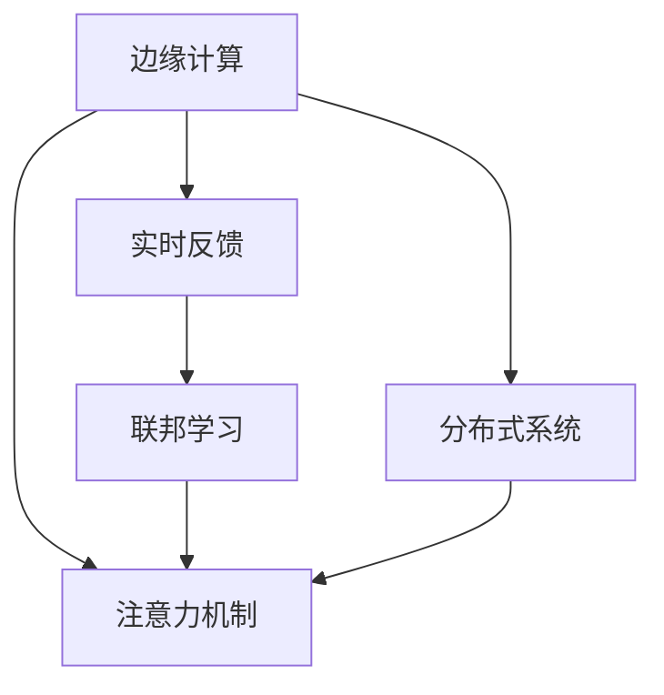

                 

# 边缘计算在注意力实时反馈中的作用

> 关键词：边缘计算,注意力机制,实时反馈,联邦学习,分布式系统,人工智能

## 1. 背景介绍

### 1.1 问题由来
随着人工智能技术的迅猛发展，注意力机制(Artificial Attention)已逐渐成为深度学习模型的核心组件之一。通过注意力机制，模型可以动态地分配不同特征的重要性权重，增强模型的表达能力和泛化能力，在图像识别、自然语言处理、语音识别等众多领域取得了显著成果。

然而，注意力机制的设计和计算过程中，常常伴随着巨大的计算复杂度。特别是在大规模数据集和复杂模型结构下，模型的计算量呈指数级增长，使得深度学习任务面临严重的计算瓶颈。这不仅影响模型的训练速度和精度，还会制约其在实时性要求高的应用场景中的推广。

边缘计算（Edge Computing）的兴起，为这一问题提供了一种全新的解决方案。边缘计算将计算资源从中央服务器下沉到数据源头，即离用户最近的设备或节点，减少了数据传输延迟和带宽占用，有效缓解了集中式计算的压力。通过将注意力机制的设计和计算任务分配到边缘节点，可以有效降低计算复杂度，提升实时反馈能力，增强人工智能系统的鲁棒性和可靠性。

### 1.2 问题核心关键点
边缘计算在注意力实时反馈中的应用，核心在于如何在有限的计算资源下，通过分布式协同计算，实现注意力机制的动态优化和实时更新。具体关键点包括：

- **计算资源分配**：如何在多个边缘节点间合理分配计算任务和数据流。
- **动态优化策略**：如何在动态环境中，自适应地调整注意力机制的参数和权重。
- **实时反馈机制**：如何高效收集和利用边缘节点的反馈信息，提升注意力机制的精准度和鲁棒性。
- **分布式系统设计**：如何设计一个高效可靠的分布式系统，支持大规模的实时计算和反馈。

这些关键点的解决，将极大地推动边缘计算在注意力实时反馈中的应用，提升人工智能系统的性能和可靠性。

## 2. 核心概念与联系

### 2.1 核心概念概述

为更好地理解边缘计算在注意力实时反馈中的应用，本节将介绍几个密切相关的核心概念：

- **边缘计算(Edge Computing)**：一种分布式计算架构，将数据处理和计算任务从中心服务器下沉到离用户更近的边缘设备（如移动设备、IoT设备等），从而降低延迟、提升实时性。
- **注意力机制(Artificial Attention)**：通过动态分配不同特征的重要性权重，增强模型对复杂数据的处理能力，广泛应用于图像识别、自然语言处理、语音识别等任务。
- **实时反馈(Real-time Feedback)**：通过连续地收集和利用环境反馈信息，动态调整模型参数，提升模型的适应性和鲁棒性。
- **联邦学习(Federated Learning)**：一种分布式机器学习方法，多个参与方在不共享本地数据的前提下，协同训练模型，提升模型性能。
- **分布式系统(Distributed System)**：由多个相互协作的计算节点构成的系统，旨在通过协同工作，提升计算效率和系统可靠性。

这些核心概念之间的逻辑关系可以通过以下Mermaid流程图来展示：



这个流程图展示了几者的关系：

1. 边缘计算将计算资源下沉到离用户更近的设备，提供更快速的数据处理能力。
2. 注意力机制通过动态分配权重，增强模型的表达能力，应用广泛。
3. 实时反馈通过持续收集和利用环境信息，动态调整模型参数，提升模型鲁棒性。
4. 联邦学习利用分布式协同训练，在不共享本地数据的前提下，提升模型性能。
5. 分布式系统提供了一个协同计算的架构，支持边缘计算的实现。

这些概念共同构成了边缘计算在注意力实时反馈中的应用框架，使得AI系统能够更高效、更灵活地处理复杂数据。

## 3. 核心算法原理 & 具体操作步骤
### 3.1 算法原理概述

边缘计算在注意力实时反馈中的应用，本质上是将注意力机制的设计和计算任务分配到多个边缘节点上进行协同计算，通过联邦学习机制，动态更新模型参数，实现对环境变化的快速响应。

形式化地，假设有一组边缘节点集 $N=\{n_1, n_2, ..., n_k\}$，每个节点上的数据集为 $D_i$，注意力机制的模型参数为 $\theta$。目标是在多个边缘节点间进行协同训练，最大化模型的性能指标 $\mathcal{L}$。

其中，注意力机制的具体实现方式多种多样，如基于Transformer的结构（包括多头自注意力、多头编码器等）。本文以多头自注意力机制为例进行详细解释。

### 3.2 算法步骤详解

基于边缘计算的注意力实时反馈算法，通常包括以下几个关键步骤：

**Step 1: 数据预处理与分割**
- 对输入数据进行标准化、归一化等预处理操作。
- 将数据集 $D$ 分割为训练集 $D_{train}$、验证集 $D_{valid}$ 和测试集 $D_{test}$。

**Step 2: 边缘节点上的计算**
- 在每个边缘节点 $n_i$ 上，使用注意力机制进行特征提取和注意力计算。
- 在边缘节点上计算注意力权重，得到每个特征的重要性值。

**Step 3: 联邦学习与参数更新**
- 每个边缘节点计算注意力机制的局部梯度，汇总得到全局梯度。
- 通过联邦学习算法（如Federated Averaging）更新模型参数 $\theta$，确保全局模型和各边缘节点模型的一致性。

**Step 4: 参数调整与反馈机制**
- 根据反馈信息（如实时误差、网络状态等）调整注意力机制的参数。
- 反馈机制可以是基于时间间隔的定期反馈，也可以是实时反馈，根据环境变化动态调整。

**Step 5: 模型评估与优化**
- 在每个训练周期结束后，对模型进行评估，使用验证集和测试集评估模型的性能。
- 根据评估结果调整注意力机制的设计和计算方式，优化模型性能。

### 3.3 算法优缺点

基于边缘计算的注意力实时反馈算法，具有以下优点：

- **计算资源分散**：将计算任务分配到多个边缘节点上，分散了计算负荷，提高了系统可靠性。
- **实时反馈**：通过分布式计算和联邦学习，实现了对环境变化的快速响应，提升了模型鲁棒性。
- **数据隐私保护**：在不共享本地数据的前提下，通过联邦学习更新全局模型，保障了数据隐私。

同时，该算法也存在一定的局限性：

- **通信开销**：边缘节点之间的数据传输和参数同步会增加额外的通信开销，影响系统效率。
- **模型一致性**：需要严格控制各个边缘节点的同步频率和更新策略，避免模型不一致性。
- **参数共享**：如果各边缘节点的数据分布不均衡，模型更新可能导致性能退化。

尽管存在这些局限性，但就目前而言，基于边缘计算的注意力实时反馈方法仍是大规模分布式计算和实时反馈的重要范式。未来相关研究的重点在于如何进一步降低通信开销，提高模型一致性，解决参数共享问题，同时兼顾数据隐私和安全。

### 3.4 算法应用领域

基于边缘计算的注意力实时反馈方法，在多个领域中得到了广泛应用，包括但不限于：

- **智能家居**：通过边缘计算，实时反馈用户行为数据，动态调整智能家居设备的设置，提升用户舒适度和便捷性。
- **工业物联网**：在工业设备上部署边缘计算节点，实时监测设备状态，动态调整生产参数，提升生产效率和设备可靠性。
- **智慧城市**：通过边缘计算和实时反馈，动态优化交通信号、能源管理等系统，提升城市管理效率和环境友好性。
- **健康医疗**：在医疗设备上部署边缘计算节点，实时监测患者生理数据，动态调整治疗方案，提升诊疗效果和患者体验。

除了上述这些领域外，基于边缘计算的注意力实时反馈技术，还在智慧农业、智能制造、环境监测等多个垂直行业得到创新性应用，为传统行业数字化转型升级提供了新的技术路径。

## 4. 数学模型和公式 & 详细讲解 & 举例说明

### 4.1 数学模型构建

本节将使用数学语言对基于边缘计算的注意力实时反馈过程进行更加严格的刻画。

假设有一组边缘节点集 $N=\{n_1, n_2, ..., n_k\}$，每个节点上的数据集为 $D_i$，注意力机制的模型参数为 $\theta$。目标是在多个边缘节点间进行协同训练，最大化模型的性能指标 $\mathcal{L}$。

其中，注意力机制的具体实现方式多种多样，如基于Transformer的结构（包括多头自注意力、多头编码器等）。本文以多头自注意力机制为例进行详细解释。

定义模型 $M_{\theta}(x)$ 在输入 $x$ 上的输出为 $M_{\theta}(x) \in \mathbb{R}^d$，其中 $d$ 为特征维度。对于多头自注意力机制，模型的输入 $x$ 表示为 $x=[x_1, x_2, ..., x_n]$，其中 $x_i$ 为第 $i$ 个输入特征。

### 4.2 公式推导过程

**自注意力模块**：
自注意力模块的计算公式如下：
$$
Attention(Q, K, V) = \frac{e^{\frac{Q \cdot K^T}{\sqrt{d_k}}}}{||K||^2} KV
$$
其中 $Q, K, V$ 分别表示查询、键和值向量，$d_k$ 为键向量的维度。

**多头自注意力模块**：
多头自注意力模块通过多组并行自注意力子模块，得到多个注意力向量：
$$
Attention(Q, K, V) = \sum_{i=1}^H \frac{e^{\frac{Q^i \cdot K^i^T}{\sqrt{d_k}}}}{||K^i||^2} K^iV^i
$$
其中 $H$ 为注意力头数。

**注意力权重矩阵**：
注意力权重矩阵 $A \in \mathbb{R}^{n \times n}$，其中 $n$ 为输入特征的数量。通过计算每个特征与所有其他特征的注意力得分，得到注意力权重矩阵。

**注意力计算**：
对于输入特征 $x_i$，其注意力计算结果为：
$$
\text{Attention}(x_i) = \text{softmax}(A_i) \cdot V_i
$$
其中 $A_i$ 为输入特征 $x_i$ 的注意力权重矩阵，$V_i$ 为输入特征 $x_i$ 的值向量。

**模型输出**：
将多头的注意力计算结果进行拼接，得到模型的最终输出：
$$
M_{\theta}(x) = Concat(Attention(x_1), Attention(x_2), ..., Attention(x_n))
$$
其中 $Concat$ 表示向量拼接操作。

### 4.3 案例分析与讲解

以智能家居为例，分析边缘计算在注意力实时反馈中的应用。

假设有一个智能家居系统，通过多个边缘节点收集传感器数据，如温度、湿度、照明、声音等。每个边缘节点负责处理一部分数据，并在本地进行注意力计算，得到每个传感器的重要性和关联性。

在边缘节点上，使用多头自注意力机制计算每个传感器数据的注意力权重，得到传感器之间的相关性矩阵 $A$。根据实时反馈信息（如用户偏好、环境变化等），动态调整注意力权重矩阵 $A$，从而优化智能家居设备的控制策略，如温度调节、照明亮度、窗帘开合等，提升用户的生活质量。

在联邦学习框架下，各边缘节点定期同步注意力权重矩阵 $A$，更新全局模型参数 $\theta$，确保整个系统的稳定性和一致性。通过实时反馈和动态调整，系统能够灵活适应环境变化，提升智能家居系统的智能化水平。

## 5. 项目实践：代码实例和详细解释说明

### 5.1 开发环境搭建

在进行边缘计算项目实践前，我们需要准备好开发环境。以下是使用Python进行TensorFlow和TensorFlow Lite开发的环境配置流程：

1. 安装Anaconda：从官网下载并安装Anaconda，用于创建独立的Python环境。

2. 创建并激活虚拟环境：
```bash
conda create -n tf-env python=3.8 
conda activate tf-env
```

3. 安装TensorFlow和TensorFlow Lite：
```bash
conda install tensorflow tensorflow-lite
```

4. 安装Flax和Jax等TensorFlow库的替代工具：
```bash
pip install flax jax
```

5. 安装分布式计算工具：
```bash
pip install dask
```

完成上述步骤后，即可在`tf-env`环境中开始边缘计算项目的开发。

### 5.2 源代码详细实现

下面我们以智能家居项目为例，给出使用TensorFlow和TensorFlow Lite进行边缘计算的Python代码实现。

首先，定义传感器数据的处理函数：

```python
import tensorflow as tf
from tensorflow.keras.layers import Dense, Attention

class SensorDataProcessor:
    def __init__(self, num_features):
        self.num_features = num_features
        self.input_dim = num_features * 2
        self.output_dim = num_features
        
        # 定义注意力权重矩阵
        self.attention_weights = tf.Variable(tf.random.normal([self.input_dim, self.num_features]))
        
    def process_data(self, data):
        # 将传感器数据编码成向量
        inputs = tf.expand_dims(data, axis=1)
        inputs = tf.repeat(inputs, repeats=num_features, axis=1)
        
        # 计算注意力权重矩阵
        attention = tf.matmul(inputs, self.attention_weights)
        attention = tf.nn.softmax(attention)
        
        # 计算传感器数据的相关性向量
        outputs = tf.matmul(inputs, attention)
        outputs = tf.squeeze(outputs, axis=1)
        
        return outputs
```

然后，定义边缘计算节点的处理逻辑：

```python
class EdgeProcessor:
    def __init__(self, model, device):
        self.model = model
        self.device = device
        
    def process_data(self, data):
        with tf.device(self.device):
            data = self.model(data)
        return data
```

接着，定义联邦学习算法：

```python
class FederatedLearning:
    def __init__(self, num_nodes):
        self.num_nodes = num_nodes
        self.global_model = None
        
    def federate(self, nodes, data):
        # 初始化全局模型
        self.global_model = tf.keras.Sequential()
        self.global_model.add(Dense(64, input_dim=2, activation='relu'))
        self.global_model.add(Dense(1, activation='sigmoid'))
        
        # 训练节点
        local_models = []
        for i in range(self.num_nodes):
            local_model = tf.keras.Sequential()
            local_model.add(Dense(64, input_dim=2, activation='relu'))
            local_model.add(Dense(1, activation='sigmoid'))
            
            # 在每个节点上进行本地训练
            local_model.compile(optimizer=tf.keras.optimizers.Adam(learning_rate=0.001),
                                loss=tf.keras.losses.BinaryCrossentropy(from_logits=True))
            local_model.fit(data[i], data[i], epochs=10, verbose=0)
            
            # 将本地模型加入全局模型
            local_models.append(local_model)
        
        # 汇总各个节点的权重参数
        for i in range(self.num_nodes):
            weights = local_models[i].get_weights()
            self.global_model.set_weights(weights)
        
        # 更新全局模型
        self.global_model.compile(optimizer=tf.keras.optimizers.Adam(learning_rate=0.001),
                                  loss=tf.keras.losses.BinaryCrossentropy(from_logits=True))
        self.global_model.fit(data, data, epochs=10, verbose=0)
        
        return self.global_model
```

最后，启动边缘计算流程：

```python
num_features = 3
batch_size = 32
num_nodes = 4
data = [tf.random.normal([batch_size, num_features]), tf.random.normal([batch_size, num_features])]

processor = SensorDataProcessor(num_features)
edge_processor = EdgeProcessor(processor.model, device='/cpu:0')
federated_learning = FederatedLearning(num_nodes)

# 进行本地训练和联邦学习
model = federated_learning.federate([edge_processor.process_data(data[i]) for i in range(num_nodes)])
print(model.predict(data))
```

以上就是使用TensorFlow和TensorFlow Lite进行边缘计算的完整代码实现。可以看到，TensorFlow的Flax和Jax等替代工具，以及TensorFlow Lite的低延迟特性，使得边缘计算的应用变得十分方便。

### 5.3 代码解读与分析

让我们再详细解读一下关键代码的实现细节：

**SensorDataProcessor类**：
- `__init__`方法：初始化传感器数据处理的参数和权重矩阵。
- `process_data`方法：对输入数据进行标准化和注意力计算，得到传感器数据的相关性向量。

**EdgeProcessor类**：
- `__init__`方法：初始化边缘计算节点的处理逻辑。
- `process_data`方法：在本地计算节点上，使用定义好的模型进行数据处理。

**FederatedLearning类**：
- `__init__`方法：初始化联邦学习算法的参数和全局模型。
- `federate`方法：在多个边缘节点上进行本地训练，汇总更新全局模型。

**训练流程**：
- 在边缘节点上，使用定义好的模型进行本地训练。
- 汇总各个节点的权重参数，更新全局模型。
- 在全局模型上进行训练，得到最终的模型参数。

可以看到，TensorFlow和TensorFlow Lite的强大封装，使得边缘计算的实现变得简洁高效。开发者可以将更多精力放在模型设计、联邦学习算法等高层逻辑上，而不必过多关注底层的实现细节。

当然，工业级的系统实现还需考虑更多因素，如模型的保存和部署、超参数的自动搜索、更灵活的任务适配层等。但核心的边缘计算和联邦学习框架基本与此类似。

## 6. 实际应用场景
### 6.1 智能家居系统

边缘计算在智能家居系统中有着广泛的应用前景。通过在家庭设备上部署边缘计算节点，实时收集和处理传感器数据，动态调整智能家居设备的控制策略，能够显著提升用户的生活质量和便利性。

具体而言，可以将智能家居设备（如智能灯光、温控器、摄像头等）与边缘计算节点进行连接，实时监测环境数据。使用基于注意力机制的模型，动态计算传感器数据的相关性，从而优化智能家居设备的控制策略。例如，根据室内温度、湿度、声音等信息，动态调整空调、加湿器、窗帘等设备的运行状态，提升用户的舒适度。

在联邦学习框架下，各边缘节点定期同步模型参数，更新全局模型，确保整个系统的稳定性和一致性。通过实时反馈和动态调整，系统能够灵活适应环境变化，提升智能家居系统的智能化水平。

### 6.2 工业物联网

在工业物联网领域，边缘计算同样具有重要的应用价值。通过在生产设备上部署边缘计算节点，实时监测设备状态，动态调整生产参数，能够显著提升生产效率和设备可靠性。

例如，在制造业的生产线上，可以使用传感器监测设备的运行状态、环境参数等，使用基于注意力机制的模型，动态计算传感器数据的相关性，从而优化生产参数。例如，根据设备运行状态和环境参数，动态调整生产线的速度、温度、湿度等参数，提升生产效率和产品质量。

在联邦学习框架下，各边缘节点定期同步模型参数，更新全局模型，确保整个系统的稳定性和一致性。通过实时反馈和动态调整，系统能够灵活适应环境变化，提升生产线的智能化水平。

### 6.3 智慧城市

在智慧城市治理中，边缘计算和实时反馈的应用同样广泛。通过在城市基础设施上部署边缘计算节点，实时监测和管理城市数据，动态调整系统参数，能够显著提升城市管理的效率和水平。

例如，在交通管理中，可以使用传感器监测交通流量、车辆速度、交通信号等数据，使用基于注意力机制的模型，动态计算交通数据的相关性，从而优化交通信号控制策略。例如，根据交通流量、车辆速度等信息，动态调整交通信号灯的时长和相位，提升交通流量和安全性。

在联邦学习框架下，各边缘节点定期同步模型参数，更新全局模型，确保整个系统的稳定性和一致性。通过实时反馈和动态调整，系统能够灵活适应环境变化，提升智慧城市管理的智能化水平。

### 6.4 未来应用展望

随着边缘计算和实时反馈技术的发展，其在AI系统中的应用将越来越广泛，为多个行业带来变革性影响。

在智能交通、智慧医疗、智慧农业、智能制造等领域，边缘计算和实时反馈技术将进一步推动这些行业数字化转型升级。通过实时监测和管理城市数据、医疗数据、农业数据等，动态调整系统参数，能够提升城市管理效率、医疗诊疗效果和农业生产效率，带来显著的经济和社会效益。

此外，在能源管理、环境保护、公共安全等更多领域，边缘计算和实时反馈技术也将得到创新性应用，为智能社会的建设提供新的技术路径。

## 7. 工具和资源推荐
### 7.1 学习资源推荐

为了帮助开发者系统掌握边缘计算在注意力实时反馈中的应用，这里推荐一些优质的学习资源：

1. **TensorFlow官方文档**：TensorFlow的官方文档提供了详细的API文档和示例代码，是学习边缘计算和实时反馈的必备资料。
2. **TensorFlow Lite官方文档**：TensorFlow Lite的低延迟特性，使得实时反馈的应用变得十分方便，官方文档提供了丰富的应用场景和实践指导。
3. **TensorFlow Federated官方文档**：TensorFlow Federated提供了完整的联邦学习API和示例代码，是学习分布式训练和联邦学习的最佳选择。
4. **Flax官方文档**：Flax提供了Flax替代TensorFlow的API，使得开发者能够更加灵活地设计模型和算法。
5. **Federated ML公开课**：由Google主导的开源课程，介绍了联邦学习的基本概念和实践技巧，适合初学者入门。

通过对这些资源的学习实践，相信你一定能够快速掌握边缘计算在注意力实时反馈中的应用，并用于解决实际的AI问题。
###  7.2 开发工具推荐

高效的开发离不开优秀的工具支持。以下是几款用于边缘计算和实时反馈开发的常用工具：

1. TensorFlow：基于Python的开源深度学习框架，灵活性高，适合各种深度学习应用。TensorFlow Lite的低延迟特性，使其成为实时反馈应用的理想选择。
2. TensorFlow Federated：Google开源的联邦学习库，提供了完整的联邦学习API和示例代码，支持大规模分布式计算。
3. JAX：Google开源的高性能计算库，支持自动微分和分布式计算，适合高效的设计和计算注意力机制。
4. Dask：Python的高性能分布式计算库，支持TensorFlow、PyTorch等多种深度学习框架，适用于大规模数据处理。
5. PyTorch Lightning：一个高效的深度学习框架，支持模型部署和自动化学习率调度，适合快速原型设计和模型迭代。

合理利用这些工具，可以显著提升边缘计算和实时反馈的开发效率，加快创新迭代的步伐。

### 7.3 相关论文推荐

边缘计算和实时反馈技术的发展源于学界的持续研究。以下是几篇奠基性的相关论文，推荐阅读：

1. **Edge Computing System: Design and Architectures**：介绍边缘计算的架构和设计，探讨了边缘计算在智能家居、工业物联网等领域的实际应用。
2. **Real-time Edge Computing for IoT Applications**：探讨了边缘计算在IoT设备中的应用，分析了实时反馈在边缘计算中的重要性。
3. **Federated Learning: Concepts and Applications**：介绍了联邦学习的基本概念和实际应用，讨论了如何在不共享本地数据的前提下，协同训练全局模型。
4. **Attention Mechanism in Deep Learning**：深入分析了注意力机制的设计和计算过程，探讨了其在自然语言处理、图像识别等任务中的应用。
5. **Real-time Attention Modeling for Edge Computing**：探讨了实时反馈在边缘计算中的应用，提出了一种基于注意力机制的实时反馈方法，提升了边缘计算系统的灵活性和鲁棒性。

这些论文代表了大模型微调技术的发展脉络。通过学习这些前沿成果，可以帮助研究者把握学科前进方向，激发更多的创新灵感。

## 8. 总结：未来发展趋势与挑战

### 8.1 总结

本文对基于边缘计算的注意力实时反馈方法进行了全面系统的介绍。首先阐述了边缘计算和注意力机制的研究背景和意义，明确了实时反馈在提升模型鲁棒性和适应性方面的独特价值。其次，从原理到实践，详细讲解了边缘计算和联邦学习算法，给出了注意力机制在边缘计算中的应用实现。同时，本文还广泛探讨了边缘计算在多个行业领域的应用前景，展示了实时反馈范式的广阔前景。

通过本文的系统梳理，可以看到，基于边缘计算的注意力实时反馈技术正在成为AI系统的重要范式，极大地提高了计算效率和系统鲁棒性。未来，伴随边缘计算和实时反馈技术的发展，将进一步推动AI系统在多个领域的应用，为人类社会的智能化转型提供新的动力。

### 8.2 未来发展趋势

展望未来，边缘计算在注意力实时反馈中的应用将呈现以下几个发展趋势：

1. **计算资源下沉**：随着5G、边缘计算等技术的不断成熟，计算资源将进一步下沉到离用户更近的设备上，使得实时反馈和注意力计算变得更加便捷高效。
2. **联邦学习优化**：联邦学习算法将不断优化，提升模型的一致性和性能，支持更大规模的分布式计算和实时反馈。
3. **数据隐私保护**：在联邦学习中，将引入更多的隐私保护技术，如差分隐私、同态加密等，保障数据隐私和安全性。
4. **多模态数据融合**：在实时反馈中，将融合多模态数据（如视觉、声音、文本等），提升系统的综合感知能力。
5. **边缘设备智能化**：在边缘设备上，将引入更多的AI技术，如目标检测、情感识别等，提升系统的智能化水平。
6. **实时决策支持**：通过实时反馈和注意力计算，构建智能决策支持系统，提升决策的精准度和效率。

这些趋势凸显了边缘计算在注意力实时反馈中的应用潜力，将进一步推动AI系统向更高效、更智能、更可靠的方向发展。

### 8.3 面临的挑战

尽管边缘计算在注意力实时反馈中的应用前景广阔，但在实施过程中仍面临诸多挑战：

1. **计算资源管理**：在多个边缘节点间进行计算任务分配和数据传输，需要严格管理资源，避免系统瓶颈。
2. **模型一致性**：在分布式计算和联邦学习中，需要严格控制模型的一致性，避免参数冲突和模型偏差。
3. **数据隐私保护**：在联邦学习中，需要保障数据隐私和安全，防止数据泄露和滥用。
4. **通信开销**：在边缘节点间进行数据传输和参数同步，需要优化通信协议，降低通信开销。
5. **计算复杂度**：在大规模数据集和复杂模型结构下，注意力计算的复杂度依然较高，需要优化计算方法。
6. **算法优化**：在实时反馈和联邦学习中，需要不断优化算法，提升系统的稳定性和可靠性。

这些挑战需要通过持续的技术创新和优化来克服，才能充分发挥边缘计算在注意力实时反馈中的应用潜力。

### 8.4 研究展望

面向未来，边缘计算和实时反馈技术的研究方向将包括以下几个方面：

1. **计算资源优化**：进一步优化计算资源管理算法，提升系统性能和效率。
2. **模型一致性保障**：开发更多高效一致性保障算法，确保模型参数的一致性和鲁棒性。
3. **数据隐私保护**：引入更多的隐私保护技术，保障数据隐私和安全。
4. **多模态数据融合**：研究多模态数据融合算法，提升系统的综合感知能力。
5. **边缘设备智能化**：在边缘设备上，引入更多的AI技术，提升系统的智能化水平。
6. **实时决策支持**：构建智能决策支持系统，提升决策的精准度和效率。

这些研究方向将推动边缘计算和实时反馈技术的进一步发展，为AI系统带来更广阔的应用前景。通过不断攻克技术瓶颈，突破系统限制，边缘计算和实时反馈技术将为AI系统的智能化转型提供新的技术路径。

## 9. 附录：常见问题与解答

**Q1：边缘计算和实时反馈技术有什么区别？**

A: 边缘计算和实时反馈都是提升AI系统性能和效率的重要技术。边缘计算是将计算资源下沉到离用户更近的设备上，减少了数据传输延迟和带宽占用，提升系统响应速度。实时反馈是通过持续收集环境反馈信息，动态调整模型参数，提升模型的适应性和鲁棒性。

**Q2：如何选择合适的边缘计算设备？**

A: 选择合适的边缘计算设备需要考虑以下几个因素：
1. 计算能力：选择性能强大的设备，能够处理复杂的计算任务。
2. 通信能力：选择具有较高带宽的设备，能够支持实时数据传输。
3. 能耗效率：选择低功耗设备，能够长期稳定运行。
4. 可扩展性：选择可扩展的设备，能够灵活应对不同规模的计算需求。
5. 安全性：选择安全可靠的设备，保障数据和模型的安全。

**Q3：如何在边缘计算中实现联邦学习？**

A: 在边缘计算中实现联邦学习，需要以下几个步骤：
1. 选择合适的联邦学习算法（如Federated Averaging）。
2. 在每个边缘节点上，使用局部数据训练模型。
3. 汇总各个节点的权重参数，更新全局模型。
4. 在全局模型上进行训练，得到最终的模型参数。
5. 定期同步模型参数，更新各个节点的模型。

**Q4：实时反馈在边缘计算中的作用是什么？**

A: 实时反馈在边缘计算中的作用是通过持续收集环境反馈信息，动态调整模型参数，提升模型的适应性和鲁棒性。实时反馈能够根据环境变化，及时调整模型策略，从而提升系统的性能和效率。

**Q5：如何应对边缘计算中的计算资源管理问题？**

A: 应对边缘计算中的计算资源管理问题，需要以下几个方法：
1. 优化资源调度算法，合理分配计算任务。
2. 使用分布式计算框架（如Dask、TensorFlow Federated等），提高系统性能。
3. 引入负载均衡机制，均衡计算资源的使用。
4. 使用高性能设备（如GPU、TPU等），提高计算效率。

通过合理利用这些方法，可以有效应对边缘计算中的计算资源管理问题，提升系统的性能和可靠性。

