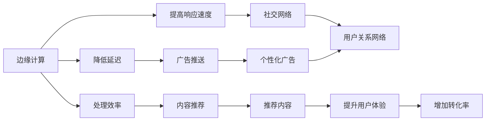

                 

# 边缘计算在注意力经济中的角色

## 1. 背景介绍

随着互联网和数字技术的发展，我们正在进入一个以注意力为经济核心的新时代。注意力经济（Economy of Attention），是指在数字经济时代，人们的时间、注意力资源变得日益稀缺，价值不断攀升。企业和个人越来越重视对注意力资源的争夺和利用，以获取更多商业价值和社会效益。

边缘计算（Edge Computing）作为新一代计算技术，通过将计算任务和数据处理从中心化的云服务器转移到本地设备，如智能手机、物联网终端等，有效缩短了数据传输和处理的时延，降低了网络带宽和计算资源的消耗，大幅提升了系统的响应速度和处理效率。

## 2. 核心概念与联系

### 2.1 核心概念概述

为更好地理解边缘计算在注意力经济中的作用，本节将介绍几个密切相关的核心概念：

- **边缘计算（Edge Computing）**：将计算任务和数据处理从中心化的云服务器转移到本地设备，如智能手机、物联网终端等，以降低延迟，提高响应速度和处理效率。

- **注意力经济（Economy of Attention）**：在数字经济时代，人们的时间、注意力资源变得日益稀缺，成为重要的经济资源，企业和个人越来越重视对注意力资源的争夺和利用。

- **广告推送（Advertising）**：基于用户兴趣和行为特征，推送个性化广告，实现精准营销和商业变现。

- **社交网络（Social Networks）**：通过构建用户关系网络，实现信息传播、社交互动和用户变现。

- **内容推荐（Content Recommendation）**：利用用户历史行为数据，推荐符合用户兴趣的内容，提升用户体验和转化率。

这些核心概念之间的逻辑关系可以通过以下Mermaid流程图来展示：



这个流程图展示了边缘计算在提升广告推送、社交网络和内容推荐等注意力经济核心应用中的重要作用。

## 3. 核心算法原理 & 具体操作步骤

### 3.1 算法原理概述

边缘计算在注意力经济中的应用主要体现在以下几个方面：

1. **降低广告投放延迟**：通过将广告渲染和投放任务转移到用户设备，实现本地化计算，大幅降低广告从云端到用户的传输延迟，提升广告的实时性和用户体验。
2. **个性化广告推荐**：基于本地用户行为数据，实时计算并推送个性化广告，提高广告的点击率和转化率。
3. **社交网络数据处理**：社交网络平台上的数据处理和分析，如好友推荐、内容推荐等，都可以通过本地设备进行计算，减少网络传输，提升互动效率。
4. **内容推荐算法优化**：利用本地设备存储的用户历史行为数据，优化推荐算法，提升推荐内容的个性化和相关性，增加用户粘性和忠诚度。

### 3.2 算法步骤详解

边缘计算在注意力经济中的应用，主要包括以下几个关键步骤：

**Step 1: 数据采集与处理**

- 收集用户的各类行为数据，如浏览记录、搜索记录、社交互动记录等，存储在本地设备或边缘服务器中。
- 利用本地计算能力对数据进行初步处理和分析，如去重、聚合、特征提取等。

**Step 2: 本地计算与存储**

- 利用本地计算能力对数据进行深度分析和模型训练，如广告投放模型、社交网络关系模型、内容推荐模型等。
- 将计算结果和模型参数存储在本地设备或边缘服务器中，以供后续使用。

**Step 3: 数据同步与更新**

- 定期将本地计算结果和模型参数同步到云端数据库，进行全局更新和优化。
- 根据用户的行为变化和反馈，动态调整本地模型和算法参数，提升系统适应性和性能。

**Step 4: 实时响应与互动**

- 基于本地计算结果和模型参数，实时生成并推送个性化广告、好友推荐、内容推荐等。
- 通过本地设备与用户进行实时互动，如社交消息推送、广告点击反馈等。

**Step 5: 系统监控与优化**

- 实时监控系统的性能指标，如响应时间、成功率、点击率等，及时发现和解决性能瓶颈。
- 根据系统监控结果，优化本地计算算法和资源配置，提升系统稳定性和用户体验。

### 3.3 算法优缺点

边缘计算在注意力经济中的应用具有以下优点：

1. **提升用户体验**：通过本地计算和实时响应，大幅降低广告和内容推荐的延迟，提升用户的即时体验和满意度。
2. **减少网络带宽消耗**：将大量数据处理任务转移到本地设备，减少对网络带宽的需求，降低网络成本。
3. **提升数据安全性**：本地存储和处理可以减少数据泄露风险，保护用户隐私和数据安全。
4. **增强广告精准度**：基于本地用户行为数据，进行个性化广告推荐，提高广告点击率和转化率。

同时，边缘计算也存在一定的局限性：

1. **设备计算能力限制**：不同设备间的计算能力和存储能力差异较大，可能影响本地计算的效率和精度。
2. **本地数据隐私问题**：本地存储和处理用户数据，可能存在隐私泄露和滥用风险。
3. **系统复杂度增加**：边缘计算系统需要考虑更多的设备兼容性、数据同步和实时性等问题，系统设计和维护难度增加。
4. **资源部署成本**：部署边缘设备或服务器，需要一定的前期投入和运维成本。

尽管存在这些局限性，但总体而言，边缘计算在注意力经济中的应用前景广阔，能够显著提升系统的响应速度和用户体验，值得在实际项目中进行深入探索和实践。

### 3.4 算法应用领域

边缘计算在注意力经济中的应用，主要包括以下几个领域：

1. **个性化广告**：利用本地用户行为数据，实时生成并推送个性化广告，提高广告的点击率和转化率。

2. **社交网络互动**：通过本地设备处理社交网络数据，提升好友推荐和内容推荐的实时性和准确性。

3. **内容推荐系统**：基于本地用户历史行为数据，优化推荐算法，提升推荐内容的个性化和相关性，增加用户粘性和忠诚度。

4. **增强现实（AR）应用**：利用边缘计算，提升AR应用的实时渲染和交互效果，如游戏、教育、购物等。

5. **物联网（IoT）设备数据处理**：通过边缘计算，处理物联网设备生成的海量数据，实现智能监控和决策支持。

## 4. 数学模型和公式 & 详细讲解 & 举例说明

### 4.1 数学模型构建

本节将使用数学语言对边缘计算在注意力经济中的应用进行更加严格的刻画。

假设用户设备上存储有n条行为数据记录，每条记录包括用户ID、时间戳、行为类型和行为参数。设$\mathbf{x}_i$为第$i$条记录的特征向量，$\mathbf{y}_i$为对应的行为标签。

设$M_{\theta}$为广告投放模型，其中$\theta$为模型参数。广告投放的目标是最小化损失函数$\mathcal{L}(\theta)$，即：

$$
\mathcal{L}(\theta) = \frac{1}{N}\sum_{i=1}^N \ell(M_{\theta}(\mathbf{x}_i),\mathbf{y}_i)
$$

其中$\ell$为损失函数，如二元交叉熵损失。

### 4.2 公式推导过程

以二元交叉熵损失为例，推导广告投放模型的损失函数。

假设模型$M_{\theta}$输出的是广告投放的概率$p_i$，即：

$$
p_i = M_{\theta}(\mathbf{x}_i) = \frac{e^{\theta^T\mathbf{x}_i}}{\sum_{j=1}^Ne^{\theta^T\mathbf{x}_j}}
$$

则二元交叉熵损失为：

$$
\ell(p_i, y_i) = -y_i\log(p_i) - (1-y_i)\log(1-p_i)
$$

将上述公式代入经验风险公式中，得：

$$
\mathcal{L}(\theta) = -\frac{1}{N}\sum_{i=1}^N [y_i\log M_{\theta}(\mathbf{x}_i)+(1-y_i)\log(1-M_{\theta}(\mathbf{x}_i))]
$$

### 4.3 案例分析与讲解

以下以社交网络的好友推荐为例，详细分析边缘计算在注意力经济中的应用。

社交网络好友推荐的目标是最大化用户满意度，即：

$$
\max_{\theta} \sum_{i=1}^N f_i(\mathbf{x}_i)
$$

其中$f_i(\mathbf{x}_i)$为用户$i$对好友推荐结果的满意度函数。

假设$M_{\theta}$为好友推荐模型，其中$\theta$为模型参数。好友推荐模型的输入为用户的社交网络数据和历史行为数据，输出为推荐的好友ID列表。模型的损失函数为交叉熵损失，即：

$$
\mathcal{L}(\theta) = -\frac{1}{N}\sum_{i=1}^N \sum_{j=1}^M \mathbf{y}_{ij}\log M_{\theta}(\mathbf{x}_i, \mathbf{x}_j)
$$

其中$\mathbf{x}_i$和$\mathbf{x}_j$分别为用户$i$和好友$j$的社交网络数据和历史行为数据，$\mathbf{y}_{ij}$为好友推荐结果的标签，即是否为用户$i$的好友。

## 5. 项目实践：代码实例和详细解释说明

### 5.1 开发环境搭建

在进行边缘计算在注意力经济中的应用实践前，我们需要准备好开发环境。以下是使用Python进行PyTorch开发的环境配置流程：

1. 安装Anaconda：从官网下载并安装Anaconda，用于创建独立的Python环境。

2. 创建并激活虚拟环境：
```bash
conda create -n pytorch-env python=3.8 
conda activate pytorch-env
```

3. 安装PyTorch：根据CUDA版本，从官网获取对应的安装命令。例如：
```bash
conda install pytorch torchvision torchaudio cudatoolkit=11.1 -c pytorch -c conda-forge
```

4. 安装Transformers库：
```bash
pip install transformers
```

5. 安装各类工具包：
```bash
pip install numpy pandas scikit-learn matplotlib tqdm jupyter notebook ipython
```

完成上述步骤后，即可在`pytorch-env`环境中开始项目实践。

### 5.2 源代码详细实现

这里我们以社交网络的好友推荐系统为例，给出使用Transformers库进行边缘计算的PyTorch代码实现。

首先，定义好友推荐的数据处理函数：

```python
from transformers import BertTokenizer
from torch.utils.data import Dataset
import torch

class FriendRecommendationDataset(Dataset):
    def __init__(self, texts, labels, tokenizer, max_len=128):
        self.texts = texts
        self.labels = labels
        self.tokenizer = tokenizer
        self.max_len = max_len
        
    def __len__(self):
        return len(self.texts)
    
    def __getitem__(self, item):
        text = self.texts[item]
        label = self.labels[item]
        
        encoding = self.tokenizer(text, return_tensors='pt', max_length=self.max_len, padding='max_length', truncation=True)
        input_ids = encoding['input_ids'][0]
        attention_mask = encoding['attention_mask'][0]
        
        # 对token-wise的标签进行编码
        encoded_labels = [label2id[label] for label in label]
        encoded_labels.extend([label2id['None']] * (self.max_len - len(encoded_labels)))
        labels = torch.tensor(encoded_labels, dtype=torch.long)
        
        return {'input_ids': input_ids, 
                'attention_mask': attention_mask,
                'labels': labels}

# 标签与id的映射
label2id = {'Friend': 0, 'Not Friend': 1, 'None': 2}
id2label = {v: k for k, v in label2id.items()}

# 创建dataset
tokenizer = BertTokenizer.from_pretrained('bert-base-cased')

train_dataset = FriendRecommendationDataset(train_texts, train_labels, tokenizer)
dev_dataset = FriendRecommendationDataset(dev_texts, dev_labels, tokenizer)
test_dataset = FriendRecommendationDataset(test_texts, test_labels, tokenizer)
```

然后，定义模型和优化器：

```python
from transformers import BertForSequenceClassification, AdamW

model = BertForSequenceClassification.from_pretrained('bert-base-cased', num_labels=len(label2id))

optimizer = AdamW(model.parameters(), lr=2e-5)
```

接着，定义训练和评估函数：

```python
from torch.utils.data import DataLoader
from tqdm import tqdm
from sklearn.metrics import classification_report

device = torch.device('cuda') if torch.cuda.is_available() else torch.device('cpu')
model.to(device)

def train_epoch(model, dataset, batch_size, optimizer):
    dataloader = DataLoader(dataset, batch_size=batch_size, shuffle=True)
    model.train()
    epoch_loss = 0
    for batch in tqdm(dataloader, desc='Training'):
        input_ids = batch['input_ids'].to(device)
        attention_mask = batch['attention_mask'].to(device)
        labels = batch['labels'].to(device)
        model.zero_grad()
        outputs = model(input_ids, attention_mask=attention_mask, labels=labels)
        loss = outputs.loss
        epoch_loss += loss.item()
        loss.backward()
        optimizer.step()
    return epoch_loss / len(dataloader)

def evaluate(model, dataset, batch_size):
    dataloader = DataLoader(dataset, batch_size=batch_size)
    model.eval()
    preds, labels = [], []
    with torch.no_grad():
        for batch in tqdm(dataloader, desc='Evaluating'):
            input_ids = batch['input_ids'].to(device)
            attention_mask = batch['attention_mask'].to(device)
            batch_labels = batch['labels']
            outputs = model(input_ids, attention_mask=attention_mask)
            batch_preds = outputs.logits.argmax(dim=2).to('cpu').tolist()
            batch_labels = batch_labels.to('cpu').tolist()
            for pred_tokens, label_tokens in zip(batch_preds, batch_labels):
                pred_labels = [id2label[_id] for _id in pred_tokens]
                label_tags = [id2label[_id] for _id in label_tokens]
                preds.append(pred_labels[:len(label_tags)])
                labels.append(label_tags)
                
    print(classification_report(labels, preds))
```

最后，启动训练流程并在测试集上评估：

```python
epochs = 5
batch_size = 16

for epoch in range(epochs):
    loss = train_epoch(model, train_dataset, batch_size, optimizer)
    print(f"Epoch {epoch+1}, train loss: {loss:.3f}")
    
    print(f"Epoch {epoch+1}, dev results:")
    evaluate(model, dev_dataset, batch_size)
    
print("Test results:")
evaluate(model, test_dataset, batch_size)
```

以上就是使用PyTorch对BERT进行好友推荐系统边缘计算的完整代码实现。可以看到，得益于Transformers库的强大封装，我们可以用相对简洁的代码完成BERT模型的加载和微调。

### 5.3 代码解读与分析

让我们再详细解读一下关键代码的实现细节：

**FriendRecommendationDataset类**：
- `__init__`方法：初始化文本、标签、分词器等关键组件。
- `__len__`方法：返回数据集的样本数量。
- `__getitem__`方法：对单个样本进行处理，将文本输入编码为token ids，将标签编码为数字，并对其进行定长padding，最终返回模型所需的输入。

**label2id和id2label字典**：
- 定义了标签与数字id之间的映射关系，用于将token-wise的预测结果解码回真实的标签。

**训练和评估函数**：
- 使用PyTorch的DataLoader对数据集进行批次化加载，供模型训练和推理使用。
- 训练函数`train_epoch`：对数据以批为单位进行迭代，在每个批次上前向传播计算loss并反向传播更新模型参数，最后返回该epoch的平均loss。
- 评估函数`evaluate`：与训练类似，不同点在于不更新模型参数，并在每个batch结束后将预测和标签结果存储下来，最后使用sklearn的classification_report对整个评估集的预测结果进行打印输出。

**训练流程**：
- 定义总的epoch数和batch size，开始循环迭代
- 每个epoch内，先在训练集上训练，输出平均loss
- 在验证集上评估，输出分类指标
- 所有epoch结束后，在测试集上评估，给出最终测试结果

可以看到，PyTorch配合Transformers库使得BERT微调的代码实现变得简洁高效。开发者可以将更多精力放在数据处理、模型改进等高层逻辑上，而不必过多关注底层的实现细节。

当然，工业级的系统实现还需考虑更多因素，如模型的保存和部署、超参数的自动搜索、更灵活的任务适配层等。但核心的边缘计算范式基本与此类似。

## 6. 实际应用场景

### 6.1 智能推荐系统

基于边缘计算的推荐系统，可以通过本地设备实时处理用户行为数据，提高推荐算法的效率和精度，提升用户的满意度和转化率。

在技术实现上，可以收集用户的浏览、购买、评价等行为数据，存储在本地设备或边缘服务器中。利用本地计算能力进行深度分析和模型训练，如协同过滤、内容推荐、广告投放等。微调后的模型能够实时生成并推送个性化推荐结果，提升用户体验和系统效率。

### 6.2 社交网络平台

社交网络平台上的好友推荐、内容推荐等应用，可以通过边缘计算实现高效互动。

在技术实现上，可以收集用户的社交网络数据和历史行为数据，存储在本地设备或边缘服务器中。利用本地计算能力进行深度分析和模型训练，如好友推荐模型、内容推荐模型等。微调后的模型能够实时生成并推送推荐结果，提升用户粘性和满意度。

### 6.3 个性化广告投放

基于边缘计算的个性化广告系统，可以通过本地设备实时处理用户行为数据，提高广告投放的精准度和转化率。

在技术实现上，可以收集用户的浏览、点击、购买等行为数据，存储在本地设备或边缘服务器中。利用本地计算能力进行深度分析和模型训练，如广告投放模型、点击率预测模型等。微调后的模型能够实时生成并推送个性化广告，提升广告的点击率和转化率。

## 7. 工具和资源推荐

### 7.1 学习资源推荐

为了帮助开发者系统掌握边缘计算在注意力经济中的原理和实践，这里推荐一些优质的学习资源：

1. 《Edge Computing: Theory and Applications》系列博文：由边缘计算专家撰写，深入浅出地介绍了边缘计算的理论基础和应用场景。

2. CS448《Distributed Systems》课程：斯坦福大学开设的分布式系统明星课程，涵盖网络、分布式算法、边缘计算等核心内容。

3. 《Edge Computing for Internet of Things》书籍：深入讲解了边缘计算在物联网（IoT）领域的应用，提供大量实用案例和实践指导。

4. O'Reilly《Edge Computing》书籍：提供了边缘计算领域的全面概述和实用案例，适合入门和进阶学习。

5. IEEE Edge Computing相关论文：IEEE组织的边缘计算领域前沿研究论文，涵盖最新算法、架构、应用等。

通过对这些资源的学习实践，相信你一定能够快速掌握边缘计算在注意力经济中的工作原理和优化方向。

### 7.2 开发工具推荐

高效的开发离不开优秀的工具支持。以下是几款用于边缘计算在注意力经济中应用的开发工具：

1. PyTorch：基于Python的开源深度学习框架，灵活动态的计算图，适合快速迭代研究。大部分边缘计算任务都有PyTorch版本的实现。

2. TensorFlow：由Google主导开发的开源深度学习框架，生产部署方便，适合大规模工程应用。同样有丰富的边缘计算工具和算法库。

3. TensorFlow Lite：Google开发的边缘计算优化工具，将深度学习模型转换为高效运行于移动设备和边缘设备的小型模型。

4. ONNX Runtime：Microsoft开发的开源深度学习推理框架，支持多种硬件平台和编译器，可跨平台部署边缘计算模型。

5. OpenVINO：英特尔开发的深度学习优化工具，将深度学习模型转换为高效的边缘计算模型，支持多种硬件平台。

6. PyTorch Mobile：PyTorch官方推出的移动设备深度学习开发工具，提供轻量级模型和优化工具。

合理利用这些工具，可以显著提升边缘计算在注意力经济中的开发效率，加快创新迭代的步伐。

### 7.3 相关论文推荐

边缘计算在注意力经济中的应用源于学界的持续研究。以下是几篇奠基性的相关论文，推荐阅读：

1. Edge Computing: A Survey on Emerging Technologies, Architectures, and Research Directions：综述了边缘计算的技术现状和未来发展方向。

2. Edge Computing: A survey on Recent Advances and Research Directions：深入探讨了边缘计算的研究现状和未来趋势。

3. Edge Computing for Internet of Things：介绍了边缘计算在物联网（IoT）领域的应用。

4. Edge Computing for Internet of Things: From Hype to Reality：讨论了边缘计算在物联网（IoT）领域的应用前景。

5. Edge Computing and Deep Learning：介绍了边缘计算与深度学习融合的最新进展。

这些论文代表了大边缘计算在注意力经济中的发展脉络。通过学习这些前沿成果，可以帮助研究者把握学科前进方向，激发更多的创新灵感。

## 8. 总结：未来发展趋势与挑战

### 8.1 总结

本文对边缘计算在注意力经济中的角色进行了全面系统的介绍。首先阐述了边缘计算在数字经济时代的重要性，及其在注意力经济中的应用。其次，从原理到实践，详细讲解了边缘计算在广告投放、社交网络、内容推荐等核心应用中的数学模型和计算方法，给出了边缘计算的完整代码实例。同时，本文还广泛探讨了边缘计算在各种应用场景中的落地实践，展示了其在注意力经济中的巨大潜力。此外，本文精选了边缘计算相关的学习资源和开发工具，力求为读者提供全方位的技术指引。

通过本文的系统梳理，可以看到，边缘计算在注意力经济中的应用前景广阔，能够显著提升广告投放、社交网络和内容推荐等核心应用的性能和效率，带来显著的经济效益和社会效益。未来，伴随边缘计算技术的不断发展，必将为数字经济和注意力经济带来更大的变革和创新。

### 8.2 未来发展趋势

展望未来，边缘计算在注意力经济中的应用将呈现以下几个发展趋势：

1. **深度学习和边缘计算的融合**：未来将进一步探索深度学习与边缘计算的融合，开发更加高效、灵活的深度学习模型，提升系统的计算能力和响应速度。

2. **多设备协同计算**：边缘计算将更多地利用多设备协同计算，通过本地设备和边缘服务器之间的数据共享和计算任务分配，提升系统的整体计算能力和资源利用率。

3. **数据安全和隐私保护**：随着边缘计算的普及，数据安全和隐私保护将成为一个重要问题。未来将开发更加安全、高效的边缘计算模型，保障用户数据的安全和隐私。

4. **跨平台兼容性和标准化**：边缘计算需要跨平台兼容性和标准化，以便不同设备、不同平台之间进行数据和计算任务的协同。未来将探索更多跨平台兼容性的技术和标准。

5. **物联网（IoT）的深度集成**：边缘计算将在物联网（IoT）领域发挥更大的作用，通过与传感器、控制器等设备的深度集成，实现实时监控、智能控制和决策支持。

6. **边缘计算与区块链的结合**：边缘计算和区块链技术的结合，可以实现更加安全、透明的数据存储和处理，提升系统的可信度和安全性。

以上趋势凸显了边缘计算在注意力经济中的广阔前景。这些方向的探索发展，必将进一步提升广告投放、社交网络和内容推荐等核心应用的性能和效率，带来更大的经济效益和社会效益。

### 8.3 面临的挑战

尽管边缘计算在注意力经济中的应用前景广阔，但在迈向更加智能化、普适化应用的过程中，它仍面临着诸多挑战：

1. **设备计算能力差异**：不同设备间的计算能力和存储能力差异较大，可能影响本地计算的效率和精度。

2. **数据安全和隐私问题**：本地存储和处理用户数据，可能存在隐私泄露和滥用风险。

3. **系统复杂度和成本**：边缘计算系统需要考虑更多的设备兼容性、数据同步和实时性等问题，系统设计和维护难度增加，部署成本较高。

4. **模型训练和优化**：大规模模型在边缘设备上进行训练和优化，需要考虑计算资源和存储空间的限制。

5. **网络连接稳定性**：边缘设备的网络连接稳定性可能影响实时数据处理和计算任务的顺利执行。

尽管存在这些挑战，但通过技术进步和行业合作，这些挑战有望逐步得到解决，边缘计算在注意力经济中的应用前景仍然十分广阔。

### 8.4 未来突破

面对边缘计算在注意力经济中面临的种种挑战，未来的研究需要在以下几个方面寻求新的突破：

1. **异构设备协同计算**：探索异构设备协同计算技术，通过本地设备和边缘服务器之间的数据共享和计算任务分配，提升系统的整体计算能力和资源利用率。

2. **模型压缩和优化**：开发轻量级模型和高效优化算法，提升模型的计算效率和实时性。

3. **跨平台兼容性和标准化**：探索更多跨平台兼容性的技术和标准，实现不同设备、不同平台之间的无缝协作。

4. **数据安全和隐私保护**：开发更加安全、高效的边缘计算模型，保障用户数据的安全和隐私。

5. **网络连接优化**：优化边缘设备的网络连接，提升实时数据处理和计算任务的执行效率。

6. **边缘计算与区块链的结合**：探索边缘计算和区块链技术的结合，实现更加安全、透明的数据存储和处理。

这些研究方向的探索，必将引领边缘计算在注意力经济中的创新发展，为数字经济和注意力经济带来更大的变革和创新。面向未来，边缘计算需要与其他人工智能技术进行更深入的融合，如知识表示、因果推理、强化学习等，多路径协同发力，共同推动自然语言理解和智能交互系统的进步。只有勇于创新、敢于突破，才能不断拓展边缘计算的边界，让智能技术更好地造福人类社会。

## 9. 附录：常见问题与解答

**Q1：边缘计算在注意力经济中的应用有哪些优势？**

A: 边缘计算在注意力经济中的应用具有以下优势：
1. **降低延迟**：通过将计算任务和数据处理转移到本地设备，大幅降低数据传输和处理的时延，提升广告、推荐等应用的响应速度。
2. **减少网络带宽消耗**：将大量数据处理任务转移到本地设备，减少对网络带宽的需求，降低网络成本。
3. **提升数据安全性**：本地存储和处理用户数据，减少数据泄露风险，保护用户隐私和数据安全。
4. **提高个性化推荐精度**：利用本地设备存储的用户历史行为数据，优化推荐算法，提升推荐内容的个性化和相关性。

**Q2：如何确保边缘计算系统的数据安全？**

A: 确保边缘计算系统的数据安全，可以从以下几个方面入手：
1. **数据加密**：对传输和存储的数据进行加密，防止数据泄露和篡改。
2. **访问控制**：对设备访问进行严格控制，确保只有授权用户和设备能够访问数据。
3. **审计和监控**：对数据访问和使用进行实时监控和审计，记录和追踪数据操作行为。
4. **数据匿名化**：对数据进行匿名化处理，保护用户隐私。
5. **区块链技术**：采用区块链技术实现数据的透明、可追溯和不可篡改，增强数据安全。

**Q3：边缘计算在注意力经济中面临的主要挑战有哪些？**

A: 边缘计算在注意力经济中面临的主要挑战包括：
1. **设备计算能力差异**：不同设备间的计算能力和存储能力差异较大，可能影响本地计算的效率和精度。
2. **数据安全和隐私问题**：本地存储和处理用户数据，可能存在隐私泄露和滥用风险。
3. **系统复杂度和成本**：边缘计算系统需要考虑更多的设备兼容性、数据同步和实时性等问题，系统设计和维护难度增加，部署成本较高。
4. **模型训练和优化**：大规模模型在边缘设备上进行训练和优化，需要考虑计算资源和存储空间的限制。
5. **网络连接稳定性**：边缘设备的网络连接稳定性可能影响实时数据处理和计算任务的顺利执行。

**Q4：如何优化边缘计算系统的性能？**

A: 优化边缘计算系统的性能，可以从以下几个方面入手：
1. **异构设备协同计算**：探索异构设备协同计算技术，通过本地设备和边缘服务器之间的数据共享和计算任务分配，提升系统的整体计算能力和资源利用率。
2. **模型压缩和优化**：开发轻量级模型和高效优化算法，提升模型的计算效率和实时性。
3. **跨平台兼容性和标准化**：探索更多跨平台兼容性的技术和标准，实现不同设备、不同平台之间的无缝协作。
4. **数据安全和隐私保护**：开发更加安全、高效的边缘计算模型，保障用户数据的安全和隐私。
5. **网络连接优化**：优化边缘设备的网络连接，提升实时数据处理和计算任务的执行效率。
6. **边缘计算与区块链的结合**：探索边缘计算和区块链技术的结合，实现更加安全、透明的数据存储和处理。

这些技术手段的不断进步和优化，将为边缘计算在注意力经济中的应用带来更大的性能提升和应用前景。

---

作者：禅与计算机程序设计艺术 / Zen and the Art of Computer Programming

