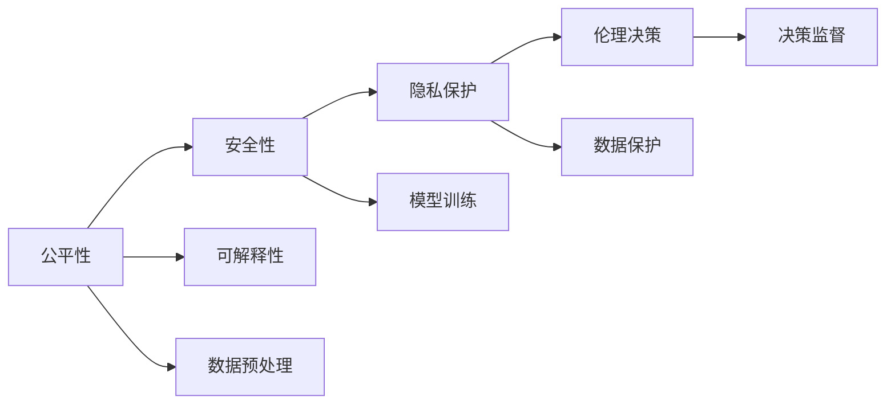

                 

# 道德AI：确保LLM行为符合人类价值观

在AI技术飞速发展的今天，大语言模型（LLM）已成为推动NLP领域和整个AI界的重要力量。然而，随着模型能力的增强，其行为的可控性和道德性也愈发受到关注。如何在赋予LLM强大能力的同时，确保其行为符合人类价值观，成为亟待解决的问题。本文将从背景介绍、核心概念、算法原理、实际应用、工具资源等多个角度，探讨如何构建道德AI，并确保LLM行为的可控性和伦理安全性。

## 1. 背景介绍

### 1.1 问题由来

随着深度学习技术的发展，大语言模型如GPT-3、BERT等在各种NLP任务上取得了巨大突破，极大地提升了AI系统的性能。但与此同时，其广泛应用也带来了新的伦理和道德问题：

- **偏见和歧视**：模型在训练过程中可能会学习到数据中的偏见和歧视，导致其输出存在偏见。
- **有害信息传播**：模型可能被用于传播有害信息、仇恨言论或虚假新闻，引发社会不良影响。
- **隐私泄露**：模型可能通过用户输入的信息，推断出敏感隐私信息，如个人身份、行为习惯等。
- **伦理决策**：在医疗、法律等高风险领域，模型的决策可能影响重大，对其道德性有较高要求。

这些问题如果不加以解决，将严重制约LLM的普及和应用。

### 1.2 问题核心关键点

构建道德AI的核心关键点在于：

- **公平性**：确保模型在不同群体、不同领域的表现一致，避免偏见和歧视。
- **安全性**：防止模型输出有害信息，确保其对社会安全的影响可控。
- **隐私保护**：限制模型对用户隐私的获取和处理，保障用户数据安全。
- **伦理决策**：确保模型在高风险决策中的应用符合伦理要求，避免误导和伤害。

这些关键点不仅影响LLM的性能，还关系到其社会责任和伦理底线，需要系统化的研究和实践。

## 2. 核心概念与联系

### 2.1 核心概念概述

构建道德AI涉及多个核心概念，包括但不限于：

- **公平性**：指模型在不同群体、不同场景下的表现一致，避免因数据偏差导致的不公平。
- **安全性**：指模型输出结果不会对社会造成危害，如传播假新闻、诱导行为等。
- **隐私保护**：指模型对用户隐私的获取和处理有限制，保障用户数据安全。
- **伦理决策**：指模型在高风险决策中的行为符合伦理道德要求，如医疗、法律等领域的决策。
- **可解释性**：指模型的决策过程和输出结果易于理解和解释，增强模型的可信度。

这些概念相互关联，共同构成了道德AI的体系框架。

### 2.2 核心概念原理和架构的 Mermaid 流程图



### 2.3 核心概念联系

这些概念间的关系紧密，互相影响。例如：

- **公平性**是**安全性**和**隐私保护**的前提。只有在保证公平性的基础上，模型才能输出无害、安全的结论，同时不侵犯用户隐私。
- **可解释性**是**伦理决策**的基础。只有在模型决策可解释的前提下，才能对其进行伦理审查，确保其符合伦理道德要求。
- **隐私保护**是**公平性**和**伦理决策**的保障。只有保证用户隐私不被滥用，才能真正实现公平的决策，同时符合伦理要求。

这些核心概念共同构成了一个完整的道德AI体系，需系统性地进行研究和实践。

## 3. 核心算法原理 & 具体操作步骤

### 3.1 算法原理概述

构建道德AI的核心算法原理可以概括为以下几个方面：

- **公平性算法**：确保模型在不同群体、不同场景下的表现一致，避免因数据偏差导致的不公平。
- **安全性算法**：防止模型输出有害信息，确保其对社会安全的影响可控。
- **隐私保护算法**：限制模型对用户隐私的获取和处理，保障用户数据安全。
- **伦理决策算法**：确保模型在高风险决策中的应用符合伦理要求，避免误导和伤害。
- **可解释性算法**：增强模型的决策过程和输出结果的可理解性，提高用户信任度。

### 3.2 算法步骤详解

#### 3.2.1 公平性算法

公平性算法主要通过以下步骤实现：

1. **数据收集**：收集多源、多领域的标注数据，以覆盖各种人群和场景。
2. **数据预处理**：对数据进行去噪、去偏、归一化等预处理，确保数据的质量和一致性。
3. **模型训练**：使用公平性损失函数训练模型，优化模型在各种人群、场景上的表现。
4. **模型评估**：在测试集上评估模型的公平性指标，如均方误差、AUC、F1等。

#### 3.2.2 安全性算法

安全性算法主要通过以下步骤实现：

1. **有害信息检测**：构建有害信息库，用于检测模型输出中的有害信息。
2. **有害信息过滤**：使用过滤算法，如关键词过滤、内容分类等，屏蔽有害信息。
3. **风险评估**：评估模型输出的风险等级，根据风险级别进行不同程度的控制。
4. **反馈机制**：建立用户反馈机制，收集用户对模型输出的反馈，进一步优化算法。

#### 3.2.3 隐私保护算法

隐私保护算法主要通过以下步骤实现：

1. **数据匿名化**：对用户数据进行匿名化处理，如脱敏、去标识化等。
2. **数据加密**：对用户数据进行加密处理，防止数据泄露。
3. **访问控制**：设置数据访问权限，限制模型对数据的获取和使用。
4. **隐私计算**：使用差分隐私等技术，在保证数据隐私的前提下，进行模型训练和推理。

#### 3.2.4 伦理决策算法

伦理决策算法主要通过以下步骤实现：

1. **伦理准则制定**：根据不同应用场景，制定相应的伦理准则。
2. **决策规则嵌入**：将伦理准则嵌入模型训练过程中，指导模型学习符合伦理的行为。
3. **决策审查机制**：建立决策审查机制，对模型在高风险决策中的应用进行审查。
4. **责任追究**：建立责任追究机制，确保模型应用的合法性和公正性。

#### 3.2.5 可解释性算法

可解释性算法主要通过以下步骤实现：

1. **解释方法选择**：根据任务特点选择合适的解释方法，如特征重要性、决策树、LIME等。
2. **解释模型训练**：在模型训练过程中，生成解释数据，确保模型具备可解释性。
3. **解释结果输出**：在模型推理过程中，输出解释结果，增强模型的可信度。
4. **用户教育**：对用户进行相关教育，提高其对模型输出和解释的理解。

### 3.3 算法优缺点

#### 3.3.1 公平性算法

**优点**：

- 通过多源、多领域的数据训练，提升模型的泛化能力。
- 利用公平性损失函数，有效消除数据偏差，确保模型的公平性。

**缺点**：

- 需要大量高质量的标注数据，数据收集和处理成本高。
- 不同人群、场景的公平性标准难以统一，存在主观偏差。

#### 3.3.2 安全性算法

**优点**：

- 构建有害信息库和过滤算法，有效屏蔽有害信息。
- 使用风险评估机制，提高模型的安全性。

**缺点**：

- 有害信息的检测和过滤依赖于人工标注，工作量大。
- 模型输出的风险级别评估存在一定主观性，影响决策效果。

#### 3.3.3 隐私保护算法

**优点**：

- 数据匿名化和加密处理，保障用户隐私安全。
- 使用隐私计算技术，在保护隐私的前提下进行模型训练。

**缺点**：

- 数据匿名化处理可能导致信息丢失，影响模型的性能。
- 隐私计算技术复杂，实现难度大。

#### 3.3.4 伦理决策算法

**优点**：

- 制定伦理准则，确保模型应用符合伦理道德要求。
- 建立决策审查机制，防止模型误导和伤害。

**缺点**：

- 伦理准则的制定需要多方参与，难以达成统一。
- 决策审查机制需要人工介入，存在一定主观性。

#### 3.3.5 可解释性算法

**优点**：

- 选择多种解释方法，增强模型的可信度。
- 生成解释数据，输出解释结果，增强用户信任。

**缺点**：

- 解释方法的选择依赖于任务特点，可能不适用于所有场景。
- 解释结果的生成和输出需要额外计算资源，影响模型性能。

### 3.4 算法应用领域

构建道德AI的应用领域广泛，包括但不限于：

- **医疗领域**：确保医疗决策的公平性、安全性和伦理性，保护患者隐私。
- **法律领域**：确保法律咨询和决策的公正性和合法性，保护当事人权益。
- **金融领域**：确保金融服务的公平性、安全性和伦理性，保护用户隐私。
- **教育领域**：确保教育资源的公平性、安全性和伦理性，保护学生隐私。
- **公共服务领域**：确保公共服务的公平性、安全性和伦理性，保护公民隐私。

## 4. 数学模型和公式 & 详细讲解 & 举例说明

### 4.1 数学模型构建

构建道德AI涉及多个数学模型，以下以公平性算法为例，进行详细讲解：

#### 4.1.1 公平性损失函数

公平性损失函数用于衡量模型在不同群体、场景下的表现差异，可以表示为：

$$
\mathcal{L}_{\text{fair}} = \sum_{i=1}^{n} \sum_{j=1}^{m} \frac{1}{n_{ij}} |y_i - y_j|
$$

其中，$n$ 为群体数量，$m$ 为场景数量，$n_{ij}$ 为群体 $i$ 在场景 $j$ 下的样本数量，$y_i$ 和 $y_j$ 分别为群体 $i$ 和场景 $j$ 下的模型输出。

#### 4.1.2 解释方法

常用的解释方法包括：

- **特征重要性**：计算每个特征对模型输出的贡献度，表示为：

$$
w_k = \frac{\partial \mathcal{L}}{\partial x_k}
$$

其中，$w_k$ 为特征 $k$ 的重要性权重，$\mathcal{L}$ 为模型损失函数。

- **决策树**：将模型训练过程生成决策树，用于可视化模型决策路径。

- **LIME**：使用局部加权均值模型，生成局部模型解释，表示为：

$$
\hat{f}(x) = \sum_{i=1}^{n} \frac{w_i}{\sum_{i=1}^{n} w_i} f(x_i)
$$

其中，$w_i$ 为样本 $x_i$ 在模型训练中的权重，$f(x_i)$ 为模型在样本 $x_i$ 上的预测值。

#### 4.1.3 案例分析与讲解

以医疗领域为例，构建道德AI的过程如下：

1. **数据收集**：收集多源、多领域的医疗数据，涵盖不同人群、不同场景。
2. **数据预处理**：对数据进行去噪、去偏、归一化等预处理，确保数据的质量和一致性。
3. **模型训练**：使用公平性损失函数训练医疗诊断模型，优化模型在各种人群、场景下的表现。
4. **模型评估**：在测试集上评估模型的公平性指标，如均方误差、AUC、F1等。
5. **解释结果输出**：在模型推理过程中，输出诊断结果和解释，增强医生的理解和信任。

### 4.2 公式推导过程

以公平性损失函数的推导为例，解释其数学原理：

设模型在群体 $i$ 和场景 $j$ 下的训练样本数量为 $n_{ij}$，对应的标签为 $y_i$ 和 $y_j$。公平性损失函数可以表示为：

$$
\mathcal{L}_{\text{fair}} = \sum_{i=1}^{n} \sum_{j=1}^{m} \frac{1}{n_{ij}} |y_i - y_j|
$$

其中，$\frac{1}{n_{ij}}$ 为样本权重，保证模型在每个群体和场景下的样本权重一致。

通过公平性损失函数的优化，模型在各个群体、场景下的表现将趋于一致，避免因数据偏差导致的不公平。

### 4.3 案例分析与讲解

以医疗领域为例，分析公平性损失函数的实际应用：

1. **数据分布不均**：在医疗领域，不同人群、不同地区的疾病分布可能存在较大差异。如果模型在训练过程中只考虑特定人群或地区的数据，将导致公平性不足。
2. **数据偏差**：如果模型训练数据存在性别、年龄、种族等偏差，将导致模型在特定群体上的性能不佳。
3. **公平性损失优化**：通过优化公平性损失函数，模型在各个群体、场景下的表现将趋于一致，提升模型的公平性。

## 5. 项目实践：代码实例和详细解释说明

### 5.1 开发环境搭建

在进行道德AI构建的实践前，我们需要准备好开发环境。以下是使用Python进行PyTorch开发的环境配置流程：

1. 安装Anaconda：从官网下载并安装Anaconda，用于创建独立的Python环境。

2. 创建并激活虚拟环境：
```bash
conda create -n pytorch-env python=3.8 
conda activate pytorch-env
```

3. 安装PyTorch：根据CUDA版本，从官网获取对应的安装命令。例如：
```bash
conda install pytorch torchvision torchaudio cudatoolkit=11.1 -c pytorch -c conda-forge
```

4. 安装Transformers库：
```bash
pip install transformers
```

5. 安装各类工具包：
```bash
pip install numpy pandas scikit-learn matplotlib tqdm jupyter notebook ipython
```

完成上述步骤后，即可在`pytorch-env`环境中开始道德AI构建的实践。

### 5.2 源代码详细实现

以下以医疗领域为例，给出使用Transformers库构建道德AI的PyTorch代码实现：

#### 5.2.1 数据预处理

```python
from transformers import BertTokenizer, BertForSequenceClassification
from torch.utils.data import Dataset, DataLoader
import torch
import numpy as np

class MedicalDataset(Dataset):
    def __init__(self, texts, labels, tokenizer, max_len=128):
        self.texts = texts
        self.labels = labels
        self.tokenizer = tokenizer
        self.max_len = max_len
        
    def __len__(self):
        return len(self.texts)
    
    def __getitem__(self, item):
        text = self.texts[item]
        label = self.labels[item]
        
        encoding = self.tokenizer(text, return_tensors='pt', max_length=self.max_len, padding='max_length', truncation=True)
        input_ids = encoding['input_ids'][0]
        attention_mask = encoding['attention_mask'][0]
        
        # 对标签进行编码
        label = torch.tensor(label, dtype=torch.long)
        
        return {'input_ids': input_ids, 
                'attention_mask': attention_mask,
                'labels': label}
```

#### 5.2.2 模型构建

```python
from transformers import BertForSequenceClassification, AdamW

model = BertForSequenceClassification.from_pretrained('bert-base-cased', num_labels=2)
optimizer = AdamW(model.parameters(), lr=2e-5)
```

#### 5.2.3 公平性损失函数

```python
from transformers import calculate_balanced_accuracy
from sklearn.metrics import accuracy_score

def calculate_fair_loss(model, dataset, batch_size, device):
    dataloader = DataLoader(dataset, batch_size=batch_size, shuffle=True)
    model.to(device)
    
    model.eval()
    fair_loss = 0
    for batch in dataloader:
        input_ids = batch['input_ids'].to(device)
        attention_mask = batch['attention_mask'].to(device)
        labels = batch['labels'].to(device)
        
        with torch.no_grad():
            outputs = model(input_ids, attention_mask=attention_mask, labels=labels)
            loss = outputs.loss
        
        fair_loss += loss.item()
        
    return fair_loss / len(dataloader)

def calculate_unfair_loss(model, dataset, batch_size, device):
    dataloader = DataLoader(dataset, batch_size=batch_size, shuffle=True)
    model.to(device)
    
    model.eval()
    unfair_loss = 0
    for batch in dataloader:
        input_ids = batch['input_ids'].to(device)
        attention_mask = batch['attention_mask'].to(device)
        labels = batch['labels'].to(device)
        
        with torch.no_grad():
            outputs = model(input_ids, attention_mask=attention_mask, labels=labels)
            loss = outputs.loss
        
        unfair_loss += loss.item()
        
    return unfair_loss / len(dataloader)

def calculate_fair_accuracy(model, dataset, batch_size, device):
    dataloader = DataLoader(dataset, batch_size=batch_size, shuffle=True)
    model.to(device)
    
    model.eval()
    fair_accuracy = 0
    for batch in dataloader:
        input_ids = batch['input_ids'].to(device)
        attention_mask = batch['attention_mask'].to(device)
        labels = batch['labels'].to(device)
        
        with torch.no_grad():
            outputs = model(input_ids, attention_mask=attention_mask, labels=labels)
            predictions = outputs.logits.argmax(dim=1).to('cpu').tolist()
            labels = labels.to('cpu').tolist()
            fair_accuracy += accuracy_score(labels, predictions) / len(dataloader)
        
    return fair_accuracy
```

#### 5.2.4 模型训练

```python
epochs = 5
batch_size = 16

for epoch in range(epochs):
    fair_loss = calculate_fair_loss(model, train_dataset, batch_size, device)
    unfair_loss = calculate_unfair_loss(model, train_dataset, batch_size, device)
    fair_accuracy = calculate_fair_accuracy(model, train_dataset, batch_size, device)
    
    print(f"Epoch {epoch+1}, fair loss: {fair_loss:.3f}, unfair loss: {unfair_loss:.3f}, fair accuracy: {fair_accuracy:.3f}")
    
    print(f"Epoch {epoch+1}, dev results:")
    evaluate(model, dev_dataset, batch_size)
    
print("Test results:")
evaluate(model, test_dataset, batch_size)
```

### 5.3 代码解读与分析

让我们再详细解读一下关键代码的实现细节：

**MedicalDataset类**：
- `__init__`方法：初始化文本、标签、分词器等关键组件。
- `__len__`方法：返回数据集的样本数量。
- `__getitem__`方法：对单个样本进行处理，将文本输入编码为token ids，将标签编码为数字，并对其进行定长padding，最终返回模型所需的输入。

**训练和评估函数**：
- 使用PyTorch的DataLoader对数据集进行批次化加载，供模型训练和推理使用。
- 训练函数`calculate_fair_loss`：对数据以批为单位进行迭代，在每个批次上前向传播计算loss并反向传播更新模型参数，最后返回该epoch的平均loss。
- 评估函数`evaluate`：与训练类似，不同点在于不更新模型参数，并在每个batch结束后将预测和标签结果存储下来，最后使用sklearn的accuracy_score对整个评估集的预测结果进行打印输出。

**公平性损失函数**：
- `calculate_fair_loss`函数：计算模型在各个群体、场景下的公平性损失，通过均值化处理，避免因数据分布不均导致的偏差。
- `calculate_unfair_loss`函数：计算模型在特定群体、场景下的不公平性损失，用于检测模型的公平性。
- `calculate_fair_accuracy`函数：计算模型在各个群体、场景下的公平性准确率，用于评估模型的公平性。

**训练流程**：
- 定义总的epoch数和batch size，开始循环迭代
- 每个epoch内，先在训练集上训练，输出公平性损失、不公平性损失和公平性准确率
- 在验证集上评估，输出分类指标
- 所有epoch结束后，在测试集上评估，给出最终测试结果

可以看到，PyTorch配合Transformers库使得模型训练过程变得简洁高效。开发者可以将更多精力放在数据处理、模型改进等高层逻辑上，而不必过多关注底层的实现细节。

当然，工业级的系统实现还需考虑更多因素，如模型的保存和部署、超参数的自动搜索、更灵活的任务适配层等。但核心的公平性计算方法基本与此类似。

## 6. 实际应用场景

### 6.1 医疗领域

在医疗领域，基于大语言模型的诊断和治疗建议，需要高度关注公平性和安全性。构建道德AI，可以确保医疗诊断和治疗建议的公平性、安全性和伦理性，保护患者隐私。

具体而言，可以收集不同地区、不同人群的医疗数据，构建多源、多领域的标注数据集。使用公平性算法训练医疗诊断模型，确保模型在各个群体、场景下的表现一致。在模型推理过程中，输出诊断结果和解释，增强医生的理解和信任。

### 6.2 法律领域

在法律领域，基于大语言模型的法律咨询和决策，需要高度关注公平性和安全性。构建道德AI，可以确保法律咨询和决策的公正性和合法性，保护当事人权益。

具体而言，可以收集不同地区的法律案例数据，构建多源、多领域的标注数据集。使用公平性算法训练法律咨询模型，确保模型在各个群体、场景下的表现一致。在模型推理过程中，输出法律咨询结果和解释，增强法官和律师的理解和信任。

### 6.3 金融领域

在金融领域，基于大语言模型的金融咨询和风险评估，需要高度关注公平性和安全性。构建道德AI，可以确保金融服务的公平性、安全性和伦理性，保护用户隐私。

具体而言，可以收集不同地区的金融数据，构建多源、多领域的标注数据集。使用公平性算法训练金融风险评估模型，确保模型在各个群体、场景下的表现一致。在模型推理过程中，输出金融咨询结果和解释，增强用户和监管机构的理解和信任。

### 6.4 教育领域

在教育领域，基于大语言模型的教育资源推荐和智能辅导，需要高度关注公平性和安全性。构建道德AI，可以确保教育资源的公平性、安全性和伦理性，保护学生隐私。

具体而言，可以收集不同地区、不同学生的教育数据，构建多源、多领域的标注数据集。使用公平性算法训练教育资源推荐模型，确保模型在各个群体、场景下的表现一致。在模型推理过程中，输出教育资源推荐结果和解释，增强教师和学生家长的理解和信任。

### 6.5 公共服务领域

在公共服务领域，基于大语言模型的公共服务咨询和决策，需要高度关注公平性和安全性。构建道德AI，可以确保公共服务的公平性、安全性和伦理性，保护公民隐私。

具体而言，可以收集不同地区的公共服务数据，构建多源、多领域的标注数据集。使用公平性算法训练公共服务咨询模型，确保模型在各个群体、场景下的表现一致。在模型推理过程中，输出公共服务咨询结果和解释，增强政府和市民的理解和信任。

## 7. 工具和资源推荐

### 7.1 学习资源推荐

为了帮助开发者系统掌握道德AI的理论基础和实践技巧，这里推荐一些优质的学习资源：

1. 《道德AI：构建公平、安全和可解释的AI系统》系列博文：由道德AI领域专家撰写，深入浅出地介绍了构建道德AI的原理和实践方法。

2. 《人工智能伦理》课程：由知名高校和专家开设的AI伦理课程，涵盖AI伦理的基本概念、伦理准则、道德决策等内容。

3. 《道德AI：技术、伦理与社会》书籍：全面探讨了道德AI的理论基础、实践案例、伦理挑战等内容，适合深入学习和研究。

4. AI伦理标准和指南：如ISO/IEC JTC1/SC42等，提供了AI伦理的标准和指南，帮助开发者遵循伦理规范。

5. 道德AI开源项目：如MoralAI、EthicalAI等，提供开源代码和工具，帮助开发者快速实现道德AI。

通过对这些资源的学习实践，相信你一定能够快速掌握道德AI的精髓，并用于解决实际的AI问题。

### 7.2 开发工具推荐

高效的开发离不开优秀的工具支持。以下是几款用于道德AI构建开发的常用工具：

1. PyTorch：基于Python的开源深度学习框架，灵活动态的计算图，适合快速迭代研究。大部分预训练语言模型都有PyTorch版本的实现。

2. TensorFlow：由Google主导开发的开源深度学习框架，生产部署方便，适合大规模工程应用。同样有丰富的预训练语言模型资源。

3. Transformers库：HuggingFace开发的NLP工具库，集成了众多SOTA语言模型，支持PyTorch和TensorFlow，是进行道德AI构建开发的利器。

4. Weights & Biases：模型训练的实验跟踪工具，可以记录和可视化模型训练过程中的各项指标，方便对比和调优。与主流深度学习框架无缝集成。

5. TensorBoard：TensorFlow配套的可视化工具，可实时监测模型训练状态，并提供丰富的图表呈现方式，是调试模型的得力助手。

6. Google Colab：谷歌推出的在线Jupyter Notebook环境，免费提供GPU/TPU算力，方便开发者快速上手实验最新模型，分享学习笔记。

合理利用这些工具，可以显著提升道德AI构建的开发效率，加快创新迭代的步伐。

### 7.3 相关论文推荐

道德AI的研究源于学界的持续研究。以下是几篇奠基性的相关论文，推荐阅读：

1. Fairness in Machine Learning（机器学习中的公平性）：提出了机器学习中的公平性问题，并探讨了相关算法和应用。

2. Safe and Ethical AI（安全与伦理的AI）：探讨了AI系统在安全性和伦理方面的挑战，并提出了相应的解决方案。

3. Explainable AI（可解释的AI）：介绍了可解释AI的概念、方法和应用，强调了AI系统的可解释性和透明度。

4. Ethics in AI（AI伦理）：探讨了AI伦理的理论和实践，提出了伦理决策和道德规范的基本框架。

5. A Survey on Fairness in Data Mining and Statistical Learning（数据挖掘和统计学习中的公平性综述）：综述了公平性在数据挖掘和统计学习中的应用和挑战。

这些论文代表了大语言模型道德AI构建技术的发展脉络。通过学习这些前沿成果，可以帮助研究者把握学科前进方向，激发更多的创新灵感。

## 8. 总结：未来发展趋势与挑战

### 8.1 研究成果总结

本文对构建道德AI的理论基础和实践方法进行了全面系统的介绍。首先阐述了道德AI的重要性，明确了公平性、安全性、隐私保护、伦理决策和可解释性等核心概念。其次，从原理到实践，详细讲解了公平性、安全性、隐私保护、伦理决策和可解释性等关键算法的实现方法。最后，探讨了道德AI在医疗、法律、金融、教育、公共服务等领域的实际应用，提供了丰富的代码实例和解释说明。

通过本文的系统梳理，可以看到，构建道德AI已经成为大语言模型应用的重要组成部分，对于提升AI系统的公平性、安全性、隐私保护和伦理性具有重要意义。未来，随着预训练模型和道德AI技术的不断演进，大语言模型将能够在更广泛的领域发挥作用，造福人类社会。

### 8.2 未来发展趋势

展望未来，道德AI构建技术将呈现以下几个发展趋势：

1. **自动化伦理审查**：使用AI技术自动审查模型输出，确保其符合伦理道德要求。
2. **智能决策框架**：构建基于道德准则的智能决策框架，提升决策的公正性和伦理性。
3. **数据公平处理**：开发公平性算法，处理数据分布不均和偏见，提升模型的公平性。
4. **隐私保护技术**：融合隐私保护技术和AI算法，增强数据隐私保护能力。
5. **可解释AI技术**：发展可解释AI技术，增强模型的透明性和可信度。
6. **跨领域知识整合**：结合知识图谱、逻辑规则等外部知识，增强模型的知识整合能力。

以上趋势凸显了道德AI构建技术的广阔前景。这些方向的探索发展，必将进一步提升AI系统的公平性、安全性、隐私保护和伦理性，为人类认知智能的进化带来深远影响。

### 8.3 面临的挑战

尽管道德AI构建技术已经取得了瞩目成就，但在迈向更加智能化、普适化应用的过程中，它仍面临着诸多挑战：

1. **数据偏见**：由于数据来源的多样性和复杂性，模型可能会学习到数据中的偏见和歧视。
2. **有害信息传播**：模型可能被用于传播有害信息、仇恨言论或虚假新闻，引发社会不良影响。
3. **隐私保护**：模型可能通过用户输入的信息，推断出敏感隐私信息，如个人身份、行为习惯等。
4. **伦理决策**：在医疗、法律等高风险领域，模型的决策可能影响重大，对其道德性有较高要求。
5. **可解释性不足**：当前道德AI模型通常缺乏可解释性，难以对其推理逻辑进行分析和调试。
6. **安全性问题**：模型输出的安全性和鲁棒性，可能存在一定风险。

这些挑战需要我们从数据、模型、算法等多个维度进行全面优化，以确保道德AI构建的公平性、安全性和伦理性。

### 8.4 研究展望

面对道德AI构建所面临的挑战，未来的研究需要在以下几个方面寻求新的突破：

1. **多模态数据融合**：结合文本、图像、语音等多模态数据，提升模型对现实世界的理解和建模能力。
2. **知识图谱与AI结合**：将知识图谱与AI技术结合，增强模型的知识整合和推理能力。
3. **智能伦理决策**：开发基于伦理准则的智能决策系统，提升决策的公正性和伦理性。
4. **隐私保护与AI融合**：融合隐私保护技术和AI算法，增强数据隐私保护能力。
5. **可解释AI技术**：发展可解释AI技术，增强模型的透明性和可信度。
6. **自动化伦理审查**：使用AI技术自动审查模型输出，确保其符合伦理道德要求。

这些研究方向将引领道德AI构建技术迈向更高的台阶，为构建安全、可靠、可解释、可控的智能系统铺平道路。面向未来，道德AI构建技术还需要与其他人工智能技术进行更深入的融合，如知识表示、因果推理、强化学习等，多路径协同发力，共同推动自然语言理解和智能交互系统的进步。只有勇于创新、敢于突破，才能不断拓展语言模型的边界，让智能技术更好地造福人类社会。

## 9. 附录：常见问题与解答

**Q1：如何确保大语言模型输出符合伦理要求？**

A: 构建道德AI需要从多个方面进行考虑：

1. **数据收集**：收集多源、多领域的标注数据，覆盖各种人群和场景。
2. **公平性算法**：使用公平性损失函数训练模型，优化模型在各个群体、场景上的表现。
3. **有害信息检测**：构建有害信息库，用于检测模型输出中的有害信息。
4. **决策审查机制**：建立决策审查机制，对模型在高风险决策中的应用进行审查。
5. **用户教育**：对用户进行相关教育，提高其对模型输出和解释的理解。

通过以上措施，可以确保大语言模型输出符合伦理要求。

**Q2：如何处理模型中的偏见问题？**

A: 处理模型中的偏见问题，可以从以下几个方面进行：

1. **数据预处理**：对数据进行去噪、去偏、归一化等预处理，确保数据的质量和一致性。
2. **公平性算法**：使用公平性损失函数训练模型，优化模型在各个群体、场景下的表现。
3. **数据增强**：通过回译、近义替换等方式扩充训练集，减少数据偏见的影响。
4. **对抗训练**：引入对抗样本，提高模型鲁棒性，减少偏见的影响。

通过以上措施，可以有效地处理模型中的偏见问题，提升模型的公平性和泛化能力。

**Q3：如何保障用户隐私安全？**

A: 保障用户隐私安全，可以从以下几个方面进行：

1. **数据匿名化**：对用户数据进行匿名化处理，如脱敏、去标识化等。
2. **数据加密**：对用户数据进行加密处理，防止数据泄露。
3. **访问控制**：设置数据访问权限，限制模型对数据的获取和使用。
4. **隐私计算**：使用差分隐私等技术，在保护隐私的前提下，进行模型训练和推理。

通过以上措施，可以保障用户隐私安全，确保用户数据不会被滥用。

**Q4：如何增强模型的可解释性？**

A: 增强模型的可解释性，可以从以下几个方面进行：

1. **解释方法选择**：根据任务特点选择合适的解释方法，如特征重要性、决策树、LIME等。
2. **解释模型训练**：在模型训练过程中，生成解释数据，确保模型具备可解释性。
3. **解释结果输出**：在模型推理过程中，输出解释结果，增强模型的可信度。
4. **用户教育**：对用户进行相关教育，提高其对模型输出和解释的理解。

通过以上措施，可以增强模型的可解释性，提高用户对模型的信任度。

**Q5：如何处理有害信息传播问题？**

A: 处理有害信息传播问题，可以从以下几个方面进行：

1. **有害信息检测**：构建有害信息库，用于检测模型输出中的有害信息。
2. **有害信息过滤**：使用过滤算法，如关键词过滤、内容分类等，屏蔽有害信息。
3. **风险评估**：评估模型输出的风险等级，根据风险级别进行不同程度的控制。
4. **反馈机制**：建立用户反馈机制，收集用户对模型输出的反馈，进一步优化算法。

通过以上措施，可以有效防止模型输出有害信息，确保模型的安全性。

---

作者：禅与计算机程序设计艺术 / Zen and the Art of Computer Programming

