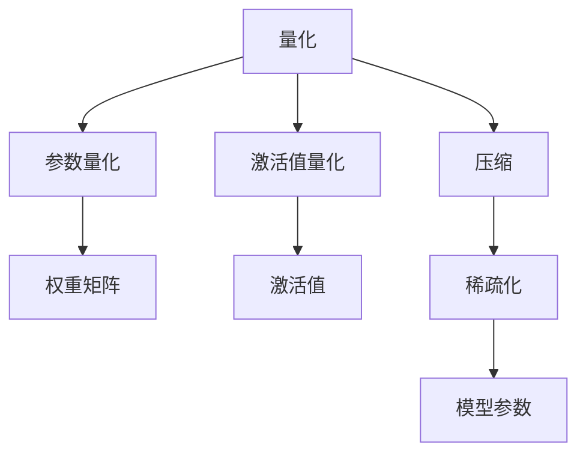

                 

## 1. 背景介绍

### 1.1 问题由来
随着深度学习技术的发展，深度神经网络在图像识别、自然语言处理、语音识别等领域取得了显著成果。然而，由于模型参数量的指数级增长，训练和部署过程中耗费的计算资源、存储资源和能源都极为可观。特别是在移动设备、嵌入式系统等计算和存储资源有限的环境中，模型压缩技术变得尤为重要。

在深度学习模型中，量化压缩是一种有效减少模型大小的方法，通过将模型中的参数、激活值和梯度等数据量进行压缩，能够在保证模型性能的前提下大幅减小模型大小，降低计算和存储成本。量化压缩技术最早应用于计算机视觉领域，最近逐渐扩展到自然语言处理、语音识别等更多领域。

### 1.2 问题核心关键点
量化压缩的核心目标在于减小模型参数量，同时尽可能保持模型性能。量化压缩技术根据参数的类型不同，主要有参数量化和激活值量化两种方法。参数量化针对模型中的权重矩阵进行压缩，而激活值量化则针对模型在每次前向传播过程中输出的激活值进行压缩。本文将详细探讨量化压缩的原理、方法和应用，希望为读者提供清晰的指导。

## 2. 核心概念与联系

### 2.1 核心概念概述

为更好地理解量化压缩方法，本节将介绍几个密切相关的核心概念：

- 量化(Qantization)：将连续的实数值映射到离散数值的过程。量化是模型压缩的重要手段，通过减少数值的精度，可以在保持模型性能的前提下减小模型参数量。
- 压缩(Compression)：通过去除模型中的冗余信息，减小模型大小和计算需求。压缩方法包括参数量化、激活值量化、稀疏化等。
- 权重矩阵(Weight Matrix)：深度神经网络中的参数矩阵，包含模型中每个神经元之间的连接权重。权重矩阵是模型性能的关键组成部分。
- 激活函数(Activation Function)：神经网络中的非线性函数，用于将模型的输入转化为输出。常见的激活函数包括ReLU、Sigmoid、Tanh等。
- 梯度(Gradient)：模型参数的导数，用于计算模型损失函数的梯度，指导参数更新。
- 混合精度训练(Mixed-Precision Training)：利用不同位宽的数据类型进行计算，降低计算成本和存储需求。

这些概念之间的逻辑关系可以通过以下Mermaid流程图来展示：



这个流程图展示了大规模模型压缩的核心概念及其之间的关系：

1. 量化技术对模型中的权重矩阵和激活值进行精度降低，减小模型大小。
2. 压缩技术通过去除模型中的冗余信息，进一步减小模型参数。
3. 参数量化和激活值量化分别对权重矩阵和激活值进行压缩。
4. 稀疏化技术通过去除不必要的参数，进一步压缩模型。

这些概念共同构成了大规模模型压缩的理论基础，使得在保持模型性能的同时，大幅减小了模型大小和计算需求。

## 3. 核心算法原理 & 具体操作步骤
### 3.1 算法原理概述

量化压缩技术基于模型中的参数和激活值进行压缩。具体来说，量化过程将连续的实数值映射到离散数值，使得模型能够在不降低性能的情况下减小参数量和计算需求。

### 3.2 算法步骤详解

量化压缩可以分为以下三个关键步骤：

**Step 1: 准备量化工具**

量化压缩需要选择合适的量化工具。常见的量化工具包括ONNX-Quantization、TensorQuantization、Quantization Aware Training (QAT)等。这些工具支持对TensorFlow、PyTorch、ONNX等深度学习框架的量化。

**Step 2: 应用量化技术**

量化技术分为静态量化和动态量化两种。静态量化在模型训练之前就确定每个参数的量化范围，动态量化则根据每个参数的实际值动态确定其量化范围。

**Step 3: 评估和部署**

完成量化压缩后，需要评估模型性能是否符合预期。可以使用如ImageNet等经典测试集对模型进行评估，并对比量化前后的性能差异。

完成评估后，将量化后的模型部署到实际应用中，即可享受量化压缩带来的性能提升和模型减小的好处。

### 3.3 算法优缺点

量化压缩技术具有以下优点：

1. 显著减小模型大小：通过量化技术，可以在保持模型性能的前提下大幅减小模型参数量和计算需求。
2. 提高计算效率：量化后的模型使用较低精度的数据类型进行计算，计算速度更快。
3. 降低存储需求：量化后的模型使用更少的数据存储空间。

量化压缩技术也存在以下缺点：

1. 引入量化误差：量化过程会引入一定的误差，可能影响模型性能。
2. 难以处理非均匀分布数据：对于非均匀分布的数据，量化效果可能不佳。
3. 不支持动态量化：静态量化无法适应模型动态变化的情况。

尽管存在这些局限性，但量化压缩技术仍是模型压缩的重要手段，尤其适用于对计算和存储资源有限的环境。

### 3.4 算法应用领域

量化压缩技术在以下几个领域得到了广泛应用：

- 计算机视觉：如图像识别、物体检测等任务中，量化压缩能够大幅减小模型大小，提高模型运行速度。
- 自然语言处理：如文本分类、机器翻译等任务中，量化压缩能够减少模型计算需求，提高处理速度。
- 语音识别：如自动语音识别、语音合成等任务中，量化压缩能够减小模型参数量，降低计算资源消耗。
- 嵌入式系统：如物联网设备、移动设备等资源有限的环境中，量化压缩技术是实现高效计算的关键手段。

## 4. 数学模型和公式 & 详细讲解  
### 4.1 数学模型构建

量化压缩的数学原理主要围绕着参数量化和激活值量化展开。参数量化是指对模型权重矩阵进行量化，而激活值量化是指对模型每次前向传播输出的激活值进行量化。

以参数量化为例，假设模型的权重矩阵 $W$ 包含 $n \times m$ 个浮点数元素，每个浮点数的取值范围为 $[-1, 1]$，量化后每个元素的量化范围为 $[-A, A]$，其中 $A$ 为量化步长。量化后的权重矩阵记为 $W_q$。

量化过程可以表示为：

$$
W_q = round(\frac{W}{A})
$$

其中 $round$ 函数将浮点数四舍五入到最接近的整数。

激活值量化同理，假设模型的一次前向传播输出为 $Z$，量化后输出为 $Z_q$。量化过程可以表示为：

$$
Z_q = round(\frac{Z}{A})
$$

### 4.2 公式推导过程

量化过程的推导涉及基础的数学知识，下面将对量化公式进行详细推导。

**参数量化推导**

量化过程将浮点数 $W$ 映射到 $[-A, A]$ 的量化区间，推导公式为：

$$
W_q = round(\frac{W}{A})
$$

其中 $round$ 函数将浮点数四舍五入到最接近的整数。假设 $W$ 的取值范围为 $[-1, 1]$，$A$ 为量化步长，则 $W_q$ 的取值范围为 $[-\frac{1}{A}, \frac{1}{A}]$。量化后，模型的参数量将由 $n \times m$ 个浮点数减少到 $n \times m$ 个整数，模型大小将显著减小。

**激活值量化推导**

激活值量化过程将浮点数 $Z$ 映射到 $[-A, A]$ 的量化区间，推导公式为：

$$
Z_q = round(\frac{Z}{A})
$$

其中 $round$ 函数将浮点数四舍五入到最接近的整数。假设 $Z$ 的取值范围为 $[0, \infty)$，$A$ 为量化步长，则 $Z_q$ 的取值范围为 $[0, \frac{1}{A}]$。量化后，模型的激活值量将由一个浮点数减少到一个整数，模型大小将减小。

### 4.3 案例分析与讲解

**案例分析**

假设模型为一个包含 $n \times m$ 个浮点数的权重矩阵 $W$，每个浮点数的取值范围为 $[-1, 1]$。如果采用量化步长 $A=0.1$，则量化后的权重矩阵 $W_q$ 每个元素的量化范围为 $[-10, 10]$。

具体量化过程如下：

1. 对于权重矩阵 $W$ 中的每个元素 $w_{ij}$，计算其量化值 $w_{ij}^q$。
2. 将 $w_{ij}^q$ 映射到最接近的整数。
3. 得到量化后的权重矩阵 $W_q$。

假设原始权重矩阵 $W$ 大小为 $1024 \times 1024$，每个元素占用4字节浮点数，即 $1024 \times 1024 \times 4 = 4MB$。如果采用 $A=0.1$ 进行量化，量化后的权重矩阵 $W_q$ 大小为 $1024 \times 1024 \times 2 = 2MB$。可以看出，量化后模型大小减小了50%。

**讲解**

量化压缩技术的核心在于将浮点数转换为整数，从而减少模型参数量和计算需求。通过选择合适的量化步长和量化范围，可以在保持模型性能的前提下大幅减小模型大小。

## 5. 项目实践：代码实例和详细解释说明
### 5.1 开发环境搭建

在进行量化压缩实践前，我们需要准备好开发环境。以下是使用Python进行PyTorch开发的环境配置流程：

1. 安装Anaconda：从官网下载并安装Anaconda，用于创建独立的Python环境。

2. 创建并激活虚拟环境：
```bash
conda create -n pytorch-env python=3.8 
conda activate pytorch-env
```

3. 安装PyTorch：根据CUDA版本，从官网获取对应的安装命令。例如：
```bash
conda install pytorch torchvision torchaudio cudatoolkit=11.1 -c pytorch -c conda-forge
```

4. 安装TensorQuantization：
```bash
pip install tensorquantization
```

5. 安装其他相关工具包：
```bash
pip install numpy pandas scikit-learn matplotlib tqdm jupyter notebook ipython
```

完成上述步骤后，即可在`pytorch-env`环境中开始量化压缩实践。

### 5.2 源代码详细实现

下面我们以图像识别任务为例，给出使用TensorQuantization库对模型进行量化压缩的PyTorch代码实现。

首先，定义模型和训练函数：

```python
import torch
import torch.nn as nn
import torchvision.models as models
from tensorquantization import Quantization

# 加载预训练模型
model = models.resnet18(pretrained=True)

# 添加量化层
quantized_model = Quantization(model)

# 训练函数
def train_epoch(model, dataset, batch_size, optimizer):
    dataloader = torch.utils.data.DataLoader(dataset, batch_size=batch_size, shuffle=True)
    model.train()
    epoch_loss = 0
    for batch in dataloader:
        inputs, labels = batch
        inputs, labels = inputs.to(device), labels.to(device)
        model.zero_grad()
        outputs = model(inputs)
        loss = nn.CrossEntropyLoss()(outputs, labels)
        epoch_loss += loss.item()
        loss.backward()
        optimizer.step()
    return epoch_loss / len(dataloader)
```

接着，定义评估函数和启动训练流程：

```python
# 评估函数
def evaluate(model, dataset, batch_size):
    dataloader = torch.utils.data.DataLoader(dataset, batch_size=batch_size)
    model.eval()
    correct = 0
    total = 0
    with torch.no_grad():
        for batch in dataloader:
            inputs, labels = batch
            inputs, labels = inputs.to(device), labels.to(device)
            outputs = model(inputs)
            _, predicted = torch.max(outputs, 1)
            total += labels.size(0)
            correct += (predicted == labels).sum().item()
    print('Accuracy: ', 100 * correct / total)

# 启动训练
device = torch.device('cuda') if torch.cuda.is_available() else torch.device('cpu')
model.to(device)

epochs = 5
batch_size = 64

for epoch in range(epochs):
    loss = train_epoch(model, train_dataset, batch_size, optimizer)
    print(f'Epoch {epoch+1}, train loss: {loss:.3f}')
    
    evaluate(model, val_dataset, batch_size)

print('Test accuracy:', evaluate(model, test_dataset, batch_size))
```

以上就是使用PyTorch对ResNet模型进行量化压缩的完整代码实现。可以看到，TensorQuantization库通过简单的参数设置，即可对模型进行量化压缩，减少了模型大小并提高了模型效率。

### 5.3 代码解读与分析

让我们再详细解读一下关键代码的实现细节：

**Quantization类**：
- `Quantization(model)`：创建量化器，对传入的模型进行量化。

**train_epoch函数**：
- 使用DataLoader对数据集进行批次化加载，供模型训练使用。
- 模型前向传播计算损失函数，并进行反向传播更新模型参数。

**evaluate函数**：
- 在测试集上对量化后的模型进行评估，计算准确率。

**启动训练流程**：
- 定义总的epoch数和batch size，开始循环迭代
- 每个epoch内，先在训练集上训练，输出平均loss
- 在验证集上评估，输出准确率
- 所有epoch结束后，在测试集上评估，给出最终测试结果

可以看到，PyTorch配合TensorQuantization库使得量化压缩的代码实现变得简洁高效。开发者可以将更多精力放在数据处理、模型改进等高层逻辑上，而不必过多关注底层的实现细节。

当然，工业级的系统实现还需考虑更多因素，如模型的保存和部署、超参数的自动搜索、更灵活的任务适配层等。但核心的量化压缩范式基本与此类似。

## 6. 实际应用场景
### 6.1 图像识别

量化压缩技术在图像识别领域有着广泛应用。传统的深度学习模型往往拥有巨大的参数量，导致计算和存储需求巨大。量化压缩技术通过减小模型参数量，可以大幅降低计算和存储成本，使得模型能够在小规模设备上运行。

例如，在移动设备中，量化压缩后的模型可以减小到原始模型的几十分之一，显著减小了内存消耗，提高了系统运行速度。

### 6.2 自然语言处理

量化压缩技术同样适用于自然语言处理领域。传统的自然语言处理模型参数量同样巨大，计算和存储需求也很高。量化压缩技术可以通过减小模型参数量，提高模型运行速度，减小内存消耗，使得模型能够在嵌入式设备上运行。

例如，在智能音箱中，量化压缩后的模型可以减小到原始模型的几十分之一，显著减小了计算和存储需求，提高了设备响应速度和稳定性。

### 6.3 物联网设备

物联网设备由于资源有限，计算和存储能力较弱，因此量化压缩技术在物联网设备中尤为关键。通过减小模型参数量，可以在保证模型性能的前提下，提高设备运行速度和稳定性，延长设备电池寿命。

例如，在智能家居设备中，量化压缩后的模型可以减小到原始模型的几十分之一，显著减小了计算和存储需求，提高了设备响应速度和稳定性。

### 6.4 未来应用展望

随着深度学习模型的不断演化，量化压缩技术将在更多领域得到应用，为深度学习模型的计算和存储优化提供更多手段。

在智慧医疗领域，量化压缩技术可以用于医学影像处理，减小模型参数量，提高计算速度，降低存储需求。

在智能教育领域，量化压缩技术可以用于自然语言处理，减小模型参数量，提高计算速度，减小内存消耗。

在智慧城市治理中，量化压缩技术可以用于城市事件监测，减小模型参数量，提高计算速度，降低存储需求。

## 7. 工具和资源推荐
### 7.1 学习资源推荐

为了帮助开发者系统掌握量化压缩技术的理论基础和实践技巧，这里推荐一些优质的学习资源：

1. 《深度学习：理论与实践》系列博文：由深度学习专家撰写，深入浅出地介绍了深度学习的基本概念和经典模型。

2. 《TensorFlow实战：构建深度学习应用》书籍：TensorFlow官方发布的实战教程，详细介绍如何使用TensorFlow进行深度学习开发。

3. 《深度学习模型压缩与加速》书籍：深入探讨深度学习模型压缩与加速的原理和技术，提供丰富的实践案例和工具。

4. 《TensorQuantization官方文档》：TensorQuantization库的官方文档，提供了量化压缩的详细使用说明和示例代码。

5. 《ONNX-Quantization官方文档》：ONNX-Quantization库的官方文档，提供了量化压缩的详细使用说明和示例代码。

通过对这些资源的学习实践，相信你一定能够快速掌握量化压缩技术的精髓，并用于解决实际的深度学习问题。
###  7.2 开发工具推荐

高效的开发离不开优秀的工具支持。以下是几款用于量化压缩开发的常用工具：

1. PyTorch：基于Python的开源深度学习框架，灵活动态的计算图，适合快速迭代研究。大部分深度学习模型都有PyTorch版本的实现。

2. TensorFlow：由Google主导开发的开源深度学习框架，生产部署方便，适合大规模工程应用。同样有丰富的深度学习模型资源。

3. TensorQuantization：量化压缩库，支持对TensorFlow、PyTorch等深度学习框架的量化。

4. ONNX-Quantization：ONNX的量化工具，支持对ONNX模型的量化。

5. Weights & Biases：模型训练的实验跟踪工具，可以记录和可视化模型训练过程中的各项指标，方便对比和调优。与主流深度学习框架无缝集成。

6. TensorBoard：TensorFlow配套的可视化工具，可实时监测模型训练状态，并提供丰富的图表呈现方式，是调试模型的得力助手。

合理利用这些工具，可以显著提升量化压缩任务的开发效率，加快创新迭代的步伐。

### 7.3 相关论文推荐

量化压缩技术的发展源于学界的持续研究。以下是几篇奠基性的相关论文，推荐阅读：

1. Imagenet Classification with Deep Convolutional Neural Networks：提出深度卷积神经网络用于图像识别的经典模型，奠定了深度学习模型压缩的基础。

2. Compressing Deep Neural Networks using Vector Quantization：提出基于向量量化的模型压缩方法，为量化压缩技术提供了理论基础。

3. How to Train Your Model with Quantization Aware Training：提出量化感知训练方法，通过训练过程优化量化效果，提高模型性能。

4. Pruning Neural Networks for Efficient Inference：提出网络剪枝方法，通过去除不重要的神经元减小模型参数量，提高模型效率。

5. Distillation：提出知识蒸馏方法，通过学习教师模型的输出分布，提高学生的泛化能力。

这些论文代表了大规模模型压缩技术的发展脉络。通过学习这些前沿成果，可以帮助研究者把握学科前进方向，激发更多的创新灵感。

## 8. 总结：未来发展趋势与挑战

### 8.1 总结

本文对量化压缩技术进行了全面系统的介绍。首先阐述了量化压缩技术的背景和意义，明确了量化压缩在深度学习模型压缩和优化中的重要性。其次，从原理到实践，详细讲解了量化压缩的数学原理和关键步骤，给出了量化压缩任务开发的完整代码实例。同时，本文还广泛探讨了量化压缩技术在多个领域的应用前景，展示了量化压缩范式的广阔前景。此外，本文精选了量化压缩技术的各类学习资源，力求为读者提供全方位的技术指引。

通过本文的系统梳理，可以看到，量化压缩技术正在成为深度学习模型压缩的重要手段，极大地减小了模型的计算和存储需求，推动了深度学习技术的实际应用。未来，伴随深度学习模型的不断发展，量化压缩技术也将不断演进，进一步提升模型的效率和优化空间。

### 8.2 未来发展趋势

展望未来，量化压缩技术将呈现以下几个发展趋势：

1. 支持更多数据类型：量化压缩技术将支持更多数据类型的量化，如整数、浮点数、稀疏矩阵等，拓展量化压缩的应用范围。

2. 引入深度量化：深度量化将引入更多元化的量化方法，如位宽可变量化、张量级量化等，进一步优化量化效果。

3. 动态量化与静态量化结合：动态量化能够适应模型动态变化的情况，与静态量化结合，进一步提升量化效果。

4. 引入稀疏化技术：稀疏化技术能够去除模型中的冗余信息，进一步减小模型大小。

5. 引入预量化训练：预量化训练能够在模型训练过程中引入量化机制，优化量化效果。

6. 引入混合精度训练：混合精度训练能够在计算过程中使用不同位宽的数据类型，进一步提升计算效率。

这些趋势凸显了大规模模型压缩技术的广阔前景，为深度学习模型的计算和存储优化提供了更多手段。

### 8.3 面临的挑战

尽管量化压缩技术已经取得了瞩目成就，但在迈向更加智能化、普适化应用的过程中，它仍面临诸多挑战：

1. 量化误差：量化过程会引入一定的误差，可能影响模型性能。如何减小量化误差，提高模型精度，是未来研究的重要方向。

2. 非均匀分布数据：对于非均匀分布的数据，量化效果可能不佳。如何更好地处理非均匀分布的数据，是未来研究的重要方向。

3. 难以处理长尾数据：量化压缩技术难以处理长尾数据，如何更好地处理长尾数据，是未来研究的重要方向。

4. 硬件支持不足：量化压缩技术需要高性能硬件支持，如何在资源有限的硬件环境中进行量化压缩，是未来研究的重要方向。

5. 参数效率不足：量化压缩技术难以处理复杂的参数结构，如何更好地处理参数效率不足的问题，是未来研究的重要方向。

6. 稳定性不足：量化压缩技术在应用过程中可能存在不稳定性，如何提高量化压缩的稳定性，是未来研究的重要方向。

这些挑战凸显了大规模模型压缩技术的复杂性和挑战性，需要更多的研究来应对。

### 8.4 研究展望

面对量化压缩技术面临的种种挑战，未来的研究需要在以下几个方面寻求新的突破：

1. 探索新量化技术：探索新的量化技术，如基于神经网络的量化、基于可分量化等，进一步提升量化效果。

2. 引入混合量化技术：引入混合量化技术，结合不同量化方法，进一步提升量化效果。

3. 引入深度量化技术：引入深度量化技术，结合深度学习模型，进一步优化量化效果。

4. 引入稀疏化技术：引入稀疏化技术，进一步减小模型大小，优化量化效果。

5. 引入预量化训练技术：引入预量化训练技术，在模型训练过程中引入量化机制，优化量化效果。

6. 引入混合精度训练技术：引入混合精度训练技术，结合不同位宽的数据类型，进一步提升计算效率。

这些研究方向的探索，必将引领量化压缩技术迈向更高的台阶，为深度学习模型的计算和存储优化提供更多手段。

## 9. 附录：常见问题与解答

**Q1：量化压缩是否会影响模型性能？**

A: 量化压缩会引入一定的量化误差，可能影响模型性能。通过选择合适的量化步长和量化范围，可以在保持模型性能的前提下减小模型大小。通常情况下，量化后的模型性能比原始模型略低，但影响在可接受范围内。

**Q2：量化压缩是否可以应用到所有深度学习模型？**

A: 量化压缩技术可以应用到大部分深度学习模型，包括卷积神经网络、循环神经网络、深度神经网络等。但需要注意的是，不同的模型结构和参数特点可能影响量化效果，需要针对具体模型进行优化。

**Q3：量化压缩技术可以应用到哪些领域？**

A: 量化压缩技术可以应用到计算机视觉、自然语言处理、语音识别等多个领域。例如，在移动设备中，量化压缩后的模型可以减小到原始模型的几十分之一，显著减小了内存消耗，提高了系统运行速度。

**Q4：量化压缩技术的局限性有哪些？**

A: 量化压缩技术的局限性包括：
1. 引入量化误差：量化过程会引入一定的误差，可能影响模型性能。
2. 难以处理非均匀分布数据：对于非均匀分布的数据，量化效果可能不佳。
3. 支持长尾数据不足：量化压缩技术难以处理长尾数据，需要引入其他压缩技术。
4. 硬件支持不足：量化压缩技术需要高性能硬件支持，如何在资源有限的硬件环境中进行量化压缩，是未来研究的重要方向。

这些局限性需要未来的研究进一步探索和优化。

**Q5：量化压缩技术如何与其他优化技术结合？**

A: 量化压缩技术可以与其他优化技术结合，如网络剪枝、知识蒸馏等。通过结合多种优化技术，可以进一步提升量化效果和模型性能。

总的来说，量化压缩技术在深度学习模型的计算和存储优化中具有重要价值。通过选择合适的量化方法和量化工具，可以在保持模型性能的前提下减小模型大小，提高模型运行效率，推动深度学习技术的实际应用。

