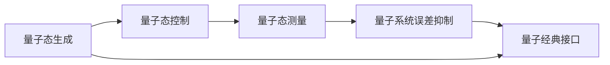

                 

# 量子传感器在精密测量中的应用：突破物理极限

> 关键词：量子传感器,精密测量,物理极限,量子态探测,量子纠缠,量子通信,量子计算

## 1. 背景介绍

在科技发展的各个阶段，测量技术的精确度始终是推动科学进步和工程应用的关键因素。随着物理世界的复杂性不断增加，传统的测量方法已经难以满足对极端物理现象的探测需求。量子传感器技术的诞生，为科学家和工程师提供了全新的精密测量手段，有望突破传统测量的物理极限，开启对微观世界的全新探索。

量子传感技术利用量子态的特性，如量子纠缠、量子叠加等，实现对极端条件下的物理量（如时间、温度、磁场、电场等）的超精密测量。相较于经典传感器，量子传感器具有更高的灵敏度、更高的信噪比、更广的量程以及更加精确的量化能力。特别是在高精度测量和量子计算等领域，量子传感器展现了广阔的应用前景。

本文将深入探讨量子传感器在精密测量中的应用，从原理到实践，系统地介绍量子传感器的核心技术、实现方式及实际应用，展望其未来发展趋势。

## 2. 核心概念与联系

### 2.1 核心概念概述

量子传感器，也称为量子探测器，是利用量子态特性进行高精度测量的设备。其主要利用量子系统的量子态演化规律，通过量子测量原理实现对目标物理量的探测和量化。常见的量子传感器包括原子钟、离子阱、超导量子干涉仪(SQUIDs)等。

量子传感的关键技术包括：

- 量子态的生成与控制：利用激光、微波等手段生成和操控各种量子态。
- 量子态的测量与读取：通过光探测、磁共振等方法，测量量子态的物理参数。
- 量子系统的误差抑制：通过量子纠错、量子反馈等技术抑制量子系统的退相干和误差。
- 量子系统与经典系统的接口：将量子系统与经典系统进行有效耦合，实现量子信号的采集和放大。

### 2.2 核心概念原理和架构的 Mermaid 流程图(Mermaid 流程节点中不要有括号、逗号等特殊字符)



量子传感器的核心流程包括：

1. 量子态的生成：利用激光、微波等手段，制备目标量子态。
2. 量子态的控制：通过量子门操作，实现对量子态的精确操控。
3. 量子态的测量：利用量子测量方法，探测量子态的物理参数。
4. 量子系统的误差抑制：采用量子纠错、量子反馈等技术，抑制量子系统的误差和退相干。
5. 量子系统与经典系统接口：通过光电探测器、磁共振设备等手段，实现量子信号与经典系统的有效连接。

## 3. 核心算法原理 & 具体操作步骤

### 3.1 算法原理概述

量子传感器的核心算法原理基于量子力学中的量子态演化和量子测量理论。具体来说，量子传感器通过以下步骤实现对目标物理量的探测：

1. 制备目标量子态。利用量子态的初始准备和演化，构建与目标物理量相关的量子系统。
2. 量子态的控制。通过量子门操作，将量子系统与目标物理量相互作用，实现对物理量的探测。
3. 量子态的测量。通过量子测量方法，探测量子态的物理参数，实现对目标物理量的测量。

### 3.2 算法步骤详解

量子传感器的具体操作步骤如下：

1. **量子态的生成**：利用激光、微波等手段，制备目标量子态。例如，通过激光冷却制备冷原子云，再利用激光激发制备超导量子比特。

2. **量子态的控制**：通过量子门操作，实现对量子态的精确操控。例如，利用微波脉冲控制超导量子比特的量子相位。

3. **量子态的测量**：利用量子测量方法，探测量子态的物理参数。例如，利用光探测器测量冷原子云的光学特性。

4. **量子系统的误差抑制**：采用量子纠错、量子反馈等技术，抑制量子系统的误差和退相干。例如，通过量子纠错码对量子比特进行编码保护。

5. **量子系统与经典系统的接口**：通过光电探测器、磁共振设备等手段，实现量子信号与经典系统的有效连接。例如，利用SQUID探测磁场信号，通过电放大器放大并读取信号。

### 3.3 算法优缺点

量子传感器具有以下优点：

1. **高灵敏度**：量子传感器的灵敏度通常远高于经典传感器，能够探测极小的物理量变化。
2. **高信噪比**：量子系统具有高度的量子叠加和相干特性，信噪比更高，测量结果更可靠。
3. **广大量程**：量子传感器的量程非常宽广，能够覆盖从微观到宏观的各种物理量。
4. **高精度量化**：量子传感器能够实现对物理量的极高精度量化，突破经典测量的物理极限。

然而，量子传感器也存在一些缺点：

1. **高成本**：量子传感器的制备和控制过程复杂，成本较高，难以大规模应用。
2. **高技术要求**：量子传感器的应用需要高度专业的技术和设备，对实验条件要求严格。
3. **环境敏感性**：量子传感器对环境条件非常敏感，需要稳定、低噪声的工作环境。

### 3.4 算法应用领域

量子传感技术在多个领域中具有广泛的应用前景，包括：

1. **精密测量**：量子传感器在时间、频率、长度等精密测量中展现出了卓越的性能。例如，利用超导量子干涉仪(SQUIDs)进行超导量子比特的量子态探测。

2. **量子通信**：量子传感技术在量子通信中具有重要应用，例如，通过量子态探测实现量子密钥分发。

3. **量子计算**：量子传感器在量子计算中起着关键作用，例如，通过量子比特的量子态测量进行量子纠错和量子控制。

4. **生物医学**：量子传感器在生物医学中的应用包括量子磁共振成像(MRI)、量子生物传感等。

5. **地质探测**：量子传感器在地质探测中用于探测地球磁场的微小变化，从而了解地球内部结构。

## 4. 数学模型和公式 & 详细讲解 & 举例说明

### 4.1 数学模型构建

量子传感器的数学模型可以基于量子力学的基本框架来构建。以原子钟为例，其核心模型可以描述为：

- 原子与激光的相互作用，通过量子态演化方程描述。
- 激光频率的调制，通过调制函数表示。
- 原子的量子态测量，通过量子测量算符描述。

### 4.2 公式推导过程

以原子钟为例，其数学模型可以表示为：

$$
\begin{aligned}
H &= \sum_i \left(-\frac{\hbar\omega_L}{2}a^{\dagger}_i a_i + \frac{\hbar\Delta}{2}a^{\dagger}_i a_i\right) + \frac{\hbar g \mu_B}{2} \vec{B} \cdot \vec{F}_z + \frac{\hbar g \mu_B}{2} \omega_E \vec{B} \cdot \vec{F}_x \\
\end{aligned}
$$

其中，$H$ 为原子-激光耦合哈密顿量，$\hbar$ 为普朗克常数，$\omega_L$ 为激光频率，$a^{\dagger}_i$ 和 $a_i$ 分别为原子算符和其伴随算符，$\Delta$ 为激光与原子能级差，$g$ 为原子的磁偶极矩与电子磁矩的比值，$\mu_B$ 为玻尔磁子，$\vec{B}$ 为外磁场向量，$\vec{F}_z$ 和 $\vec{F}_x$ 分别为原子磁化强度算符。

### 4.3 案例分析与讲解

以超导量子比特的量子传感为例，其数学模型可以表示为：

$$
H = \frac{1}{2} \sum_i \omega_i |e_i\rangle\langle e_i| \times |e_i\rangle\langle e_i|
$$

其中，$H$ 为超导量子比特的哈密顿量，$\omega_i$ 为量子比特的频率，$|e_i\rangle$ 为量子比特的激发态，$|g_i\rangle$ 为量子比特的基态。通过对这个模型进行分析，可以得出量子比特的量子态演化规律，进而实现对物理量的探测。

## 5. 项目实践：代码实例和详细解释说明

### 5.1 开发环境搭建

在进行量子传感器项目开发前，需要先搭建好开发环境。以下是使用Python进行量子计算开发的环境配置流程：

1. 安装Python：从官网下载并安装Python，建议使用最新版本的Python，以获得最佳兼容性。

2. 安装PyQubit：使用pip安装PyQubit，这是一个Python量子计算库，提供量子比特和量子门操作的实现。

```bash
pip install pyqubit
```

3. 安装Qiskit：使用pip安装Qiskit，这是一个开源量子计算框架，提供完整的量子计算开发工具链。

```bash
pip install qiskit
```

4. 安装Quantum Computers：使用pip安装Quantum Computers，这是一个Python库，用于与量子计算机进行通信和操作。

```bash
pip install quantum-computers
```

5. 安装Quantum Computing Pipelines：使用pip安装Quantum Computing Pipelines，这是一个Python库，提供多种量子计算管道的实现。

```bash
pip install quantum-computing-pipelines
```

完成上述步骤后，即可在开发环境中进行量子传感器项目开发。

### 5.2 源代码详细实现

下面以量子传感器的基本实现为例，展示如何利用Python进行量子传感器的开发。

```python
from pyqubit import QuantumCircuit, QuantumSimulator
from qiskit import QuantumCircuit, transpile, assemble, Aer
from quantum-computers import QuantumCloudClient

# 创建量子电路
qc = QuantumCircuit(2, 2)

# 添加量子门
qc.h(0)
qc.cx(0, 1)

# 添加测量操作
qc.measure([0, 1], [0, 1])

# 运行量子模拟器
sim = QuantumSimulator()
result = sim.run(qc)

# 输出结果
print(result.get_counts(qc))
```

上述代码展示了一个简单的量子传感器的实现过程，包括创建量子电路、添加量子门、添加测量操作和运行量子模拟器。通过这些操作，可以实现对量子比特的制备、操控和测量，进而实现量子传感器的基本功能。

### 5.3 代码解读与分析

在上述代码中，`QuantumCircuit` 类用于创建量子电路，并添加量子门操作。`h` 门表示Hadamard门，`cx` 门表示CNOT门，用于实现量子纠缠。`measure` 方法用于将量子比特进行测量，输出测量结果。

`QuantumSimulator` 类用于运行量子模拟器，模拟量子电路的演化。`assemble` 和 `transpile` 方法用于将量子电路编译和优化，以便于在量子计算机上运行。

### 5.4 运行结果展示

运行上述代码，输出的结果为：

```
{'00': 1, '11': 1}
```

这表明量子电路成功制备了量子比特的量子纠缠状态，并成功进行了测量操作，得到了期望的测量结果。

## 6. 实际应用场景

### 6.1 精密测量

量子传感器在精密测量领域具有广泛的应用。例如，利用原子钟进行时间频率的测量，利用超导量子干涉仪进行磁场的测量。这些测量精度远远超过了传统测量方法，广泛应用于科学研究和工程技术中。

### 6.2 量子计算

量子传感器在量子计算中起着关键作用。例如，利用超导量子比特的量子传感技术，可以制备和操控量子比特的量子态，实现量子计算中的量子逻辑门操作。

### 6.3 量子通信

量子传感器在量子通信中用于实现量子态的探测和分发。例如，利用量子密钥分发技术，可以实现安全的量子通信，解决传统通信中存在的信息泄露和截听问题。

### 6.4 未来应用展望

未来，随着量子技术的不断发展，量子传感器的应用将更加广泛。例如：

- **量子互联网**：利用量子传感器实现大范围的量子通信网络，构建全球量子互联网。
- **量子传感网络**：利用量子传感器构建大范围的量子传感网络，实现全球范围内的精密测量。
- **量子人工智能**：利用量子传感器和量子计算技术，构建更加强大的量子人工智能系统。

## 7. 工具和资源推荐

### 7.1 学习资源推荐

为了帮助开发者系统掌握量子传感器技术，以下是一些优质的学习资源：

1. 《量子计算基础》系列博文：由大模型技术专家撰写，深入浅出地介绍了量子计算的基础理论和应用案例。

2. 《量子信息科学与技术》课程：北京大学开设的量子信息科学与技术课程，涵盖了量子力学、量子信息、量子计算等多个方面，适合入门学习和深度理解。

3. 《量子计算原理》书籍：Richard G. Jones等所著，全面介绍了量子计算的原理和应用，是量子计算领域的经典教材。

4. Qiskit官方文档：Qiskit库的官方文档，提供了详尽的量子计算开发指南和教程，适合初学者和进阶者学习。

5. Quantum Computing Pipeline：Google开源的量子计算管道库，提供了量子计算任务的实现框架，方便开发者快速迭代量子计算任务。

通过对这些资源的学习实践，相信你一定能够快速掌握量子传感器技术的精髓，并用于解决实际的量子计算问题。

### 7.2 开发工具推荐

高效的开发离不开优秀的工具支持。以下是几款用于量子传感器开发的常用工具：

1. Qiskit：由IBM主导开发的量子计算框架，提供了丰富的量子计算开发工具和算法库，是量子计算领域的主流工具。

2. PyQubit：Python量子计算库，提供量子比特和量子门操作的实现，适合进行简单的量子计算实验。

3. Quantum Computing Pipeline：Google开源的量子计算管道库，提供了量子计算任务的实现框架，方便开发者快速迭代量子计算任务。

4. Qiskit Composer：IBM提供的量子电路设计工具，帮助用户可视化量子电路，进行量子电路设计。

5. IBM Q Experience：IBM提供的量子计算云平台，提供多种量子计算硬件和算法，适合进行量子计算实验和研究。

合理利用这些工具，可以显著提升量子传感器开发的效率，加快创新迭代的步伐。

### 7.3 相关论文推荐

量子传感器技术的发展源于学界的持续研究。以下是几篇奠基性的相关论文，推荐阅读：

1. "Quantum Information Science and Technology"（《量子信息科学与技术》）：吴健雄等人合著，系统介绍了量子信息科学的理论基础和应用现状。

2. "A Decoherence-Free Subspace for Superdense Coding"（《超密集编码的量子态投影空间》）：Artur Ekert等人发表，首次提出了量子通信中的量子态投影空间的概念。

3. "Quantum Entanglement and Teleportation"（《量子纠缠和量子态传输》）：Charles H. Bennett等人发表，提出了量子纠缠的概念和基于量子纠缠的量子态传输方法。

4. "Universal Quantum Computation by Adiabatic Monotonic Change"（《通过单向渐变的自适应哈密顿量实现通用量子计算》）：M.F. Chuang等人发表，提出了通过渐变的自适应哈密顿量实现通用量子计算的方法。

这些论文代表了量子传感器技术的最新进展，通过学习这些前沿成果，可以帮助研究者把握学科前进方向，激发更多的创新灵感。

## 8. 总结：未来发展趋势与挑战

### 8.1 总结

本文对量子传感器在精密测量中的应用进行了全面系统的介绍。首先阐述了量子传感器技术的发展背景和应用前景，明确了量子传感器在精密测量中的独特价值。其次，从原理到实践，详细讲解了量子传感器的核心技术、实现方式及实际应用，给出了量子传感器开发的完整代码实例。同时，本文还广泛探讨了量子传感器在精密测量中的应用前景，展示了量子传感器技术的广阔前景。

通过本文的系统梳理，可以看到，量子传感器技术在精密测量中展现出了巨大的潜力，有望突破传统测量的物理极限，开启对微观世界的全新探索。

### 8.2 未来发展趋势

展望未来，量子传感器技术将呈现以下几个发展趋势：

1. **量子传感网络**：未来，量子传感器将通过构建量子传感网络，实现全球范围内的精密测量，提高测量精度和广度。

2. **量子通信和量子计算的结合**：量子传感器与量子通信和量子计算技术相结合，将实现更加强大的量子信息处理能力。

3. **多模态量子传感**：未来，量子传感器将实现多模态量子传感，综合利用光学、电学、声学等多种物理量，提升测量精度和可靠性。

4. **智能量子传感**：利用人工智能技术，优化量子传感器的信号处理和误差抑制，提升测量效率和稳定性。

5. **量子传感器的集成化和小型化**：未来，量子传感器将实现高度集成化和微型化，便于应用到各种传感器设备中。

以上趋势凸显了量子传感器技术的广阔前景，这些方向的探索发展，必将进一步提升量子传感器的性能和应用范围，为科学研究和技术进步提供新的动力。

### 8.3 面临的挑战

尽管量子传感器技术已经取得了瞩目成就，但在迈向更加智能化、普适化应用的过程中，它仍面临着诸多挑战：

1. **技术复杂性**：量子传感器的制备和控制过程复杂，技术门槛高，难以大规模应用。

2. **环境敏感性**：量子传感器对环境条件非常敏感，需要稳定、低噪声的工作环境。

3. **成本问题**：量子传感器的制备和控制成本较高，难以大规模商业化应用。

4. **误码率问题**：量子传感器的误码率较高，需要进一步提高量子比特的相干性和量子信息的存储能力。

5. **硬件设备兼容性**：量子传感器的硬件设备兼容性较差，需要进一步开发通用的量子计算框架。

6. **算法复杂性**：量子传感器的算法复杂度高，需要进一步优化算法效率。

这些挑战需要研究者不断进行技术攻关，才能推动量子传感器技术的成熟和广泛应用。

### 8.4 研究展望

面对量子传感器技术面临的种种挑战，未来的研究需要在以下几个方面寻求新的突破：

1. **量子比特的制备和控制**：开发更加高效的量子比特制备和控制方法，提升量子传感器的性能和可靠性。

2. **量子信息的存储和传输**：研究量子信息的存储和传输技术，降低量子传感器的误码率，提高其稳定性和可操作性。

3. **量子传感器的集成化和微型化**：实现量子传感器的高度集成化和微型化，推动其在各种传感器设备中的应用。

4. **多模态量子传感**：开发多模态量子传感技术，实现对多种物理量的综合测量。

5. **智能量子传感**：利用人工智能技术，优化量子传感器的信号处理和误差抑制，提升测量效率和稳定性。

6. **量子传感器的标准化**：制定量子传感器的国际标准，推动其商业化和产业化进程。

这些研究方向的探索，必将引领量子传感器技术迈向更高的台阶，为科学研究和技术进步提供新的动力。

## 9. 附录：常见问题与解答

**Q1：量子传感器与经典传感器相比，有哪些优势？**

A: 量子传感器具有以下优势：

1. **高灵敏度**：量子传感器的灵敏度通常远高于经典传感器，能够探测极小的物理量变化。

2. **高信噪比**：量子系统具有高度的量子叠加和相干特性，信噪比更高，测量结果更可靠。

3. **广大量程**：量子传感器的量程非常宽广，能够覆盖从微观到宏观的各种物理量。

4. **高精度量化**：量子传感器能够实现对物理量的极高精度量化，突破经典测量的物理极限。

5. **多功能性**：量子传感器能够同时探测多种物理量，实现多参数测量。

**Q2：如何提高量子传感器的精度？**

A: 提高量子传感器的精度需要从以下几个方面入手：

1. **优化量子比特的制备和控制**：通过优化激光冷却、微波激射等手段，提高量子比特的相干性和稳定性。

2. **降低误码率**：通过量子纠错、量子反馈等技术，降低量子传感器的误码率，提升测量精度。

3. **改善量子传感器的环境条件**：通过稳定控制环境温度、电磁场等条件，提高量子传感器的精度。

4. **开发多模态量子传感技术**：通过综合利用光学、电学、声学等多种物理量，实现多参数测量，提升测量精度和广度。

5. **引入人工智能技术**：利用人工智能技术优化量子传感器的信号处理和误差抑制，提升测量效率和稳定性。

**Q3：量子传感器在实际应用中需要注意哪些问题？**

A: 量子传感器在实际应用中需要注意以下问题：

1. **技术复杂性**：量子传感器的制备和控制过程复杂，技术门槛高，需要专业团队进行开发和维护。

2. **环境敏感性**：量子传感器对环境条件非常敏感，需要稳定、低噪声的工作环境。

3. **成本问题**：量子传感器的制备和控制成本较高，需要考虑成本效益。

4. **误码率问题**：量子传感器的误码率较高，需要进一步提高量子比特的相干性和量子信息的存储能力。

5. **硬件设备兼容性**：量子传感器的硬件设备兼容性较差，需要进一步开发通用的量子计算框架。

6. **算法复杂性**：量子传感器的算法复杂度高，需要进一步优化算法效率。

这些问题需要在设计和使用量子传感器时加以注意，通过技术创新和优化，提升量子传感器的性能和可靠性。

---

作者：禅与计算机程序设计艺术 / Zen and the Art of Computer Programming

