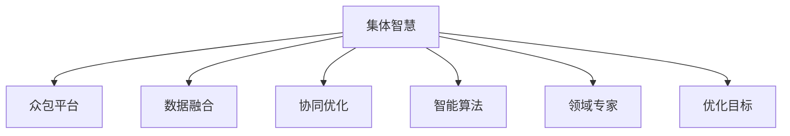

                 

# 集体智慧：开拓解决复杂问题的创新思路

> 关键词：集体智慧, 众包平台, 数据融合, 协同优化, 智能算法, 领域专家, 优化目标, 决策支持, 群体决策, 智能分析

## 1. 背景介绍

### 1.1 问题由来
在当今快速变化的社会和经济环境中，复杂问题的解决变得愈发困难。传统方法往往需要耗费大量人力物力，且效果不尽如人意。面对日益复杂的问题，如何更高效、更准确地解决这些问题，成为了各行业关注的热点。

集体智慧（Collective Intelligence）的概念应运而生。通过集合个人、团队和众包的智慧，利用先进的数据分析、机器学习和人工智能技术，综合多方面的知识、经验和视角，实现高效、精准的决策支持。本文将详细探讨集体智慧的原理、算法和操作步骤，并结合具体项目实践，介绍其实际应用场景和未来发展前景。

### 1.2 问题核心关键点
集体智慧方法的核心在于利用大集体力量，融合多维数据，借助智能算法，实现复杂问题的优化。其关键点在于：

1. **数据融合**：将不同来源的数据进行整合，构建统一的分析框架。
2. **协同优化**：通过群体的协同工作和反馈机制，不断优化问题和解决方案。
3. **智能算法**：运用先进的机器学习和人工智能技术，提升决策的科学性和精确性。
4. **领域专家**：引入具有丰富经验的领域专家，提供专业指导和知识分享。
5. **优化目标**：明确优化目标和评价指标，确保决策符合预期。

这些关键点相互关联，共同构成了集体智慧的核心价值链。通过理解这些核心概念，我们能够更好地把握集体智慧的工作原理和优化方向。

## 2. 核心概念与联系

### 2.1 核心概念概述

为更好地理解集体智慧的原理和架构，本节将介绍几个密切相关的核心概念：

- **集体智慧**：通过集合个人、团队和众包的智慧，综合多源数据和多角度视角，实现复杂问题的优化。

- **众包平台**：一个在线平台，将任务发布给大量用户，通过集体的力量完成特定目标。

- **数据融合**：将来自不同渠道、不同格式的数据进行整合，构建统一的分析框架。

- **协同优化**：通过群体成员的协同工作和反馈机制，不断优化问题的解决方案。

- **智能算法**：运用先进的机器学习和人工智能技术，提升决策的科学性和精确性。

- **领域专家**：引入具有丰富经验的领域专家，提供专业指导和知识分享。

- **优化目标**：明确优化目标和评价指标，确保决策符合预期。

这些核心概念之间的逻辑关系可以通过以下Mermaid流程图来展示：



这个流程图展示了大集体智慧的核心概念及其之间的关系：

1. 集体智慧通过众包平台将任务发布给大量用户，并通过数据融合、协同优化、智能算法和领域专家的多方协作，实现复杂问题的优化。
2. 数据融合是基础，通过整合多源数据，构建统一的分析框架。
3. 协同优化是手段，通过群体成员的协同工作和反馈机制，不断优化问题的解决方案。
4. 智能算法是工具，运用先进的机器学习和人工智能技术，提升决策的科学性和精确性。
5. 领域专家是保障，引入具有丰富经验的领域专家，提供专业指导和知识分享。
6. 优化目标是目的，明确优化目标和评价指标，确保决策符合预期。

这些概念共同构成了集体智慧的框架，使其能够高效、精准地解决复杂问题。通过理解这些核心概念，我们能够更好地把握集体智慧的工作原理和优化方向。

## 3. 核心算法原理 & 具体操作步骤
### 3.1 算法原理概述

集体智慧方法的核心算法包括数据融合、协同优化和智能算法。

**数据融合**：将不同来源的数据进行整合，构建统一的分析框架。通常使用集成学习、聚类分析等方法，将数据进行预处理和特征提取，构建数据融合模型。

**协同优化**：通过群体成员的协同工作和反馈机制，不断优化问题的解决方案。通常使用多智能体系统、遗传算法等方法，实现群体成员之间的信息交换和优化。

**智能算法**：运用先进的机器学习和人工智能技术，提升决策的科学性和精确性。通常使用深度学习、强化学习等方法，构建智能算法模型。

### 3.2 算法步骤详解

集体智慧的实施步骤通常包括以下几个关键环节：

**Step 1: 任务定义与数据收集**
- 明确任务目标和优化指标。
- 收集多源数据，包括文本、图像、语音等不同形式的数据。

**Step 2: 数据预处理与融合**
- 对不同形式的数据进行标准化和预处理。
- 使用集成学习、聚类分析等方法，构建数据融合模型，将多源数据整合为统一的分析框架。

**Step 3: 智能算法设计**
- 选择合适的机器学习或深度学习算法，构建智能算法模型。
- 设计优化目标和评价指标，确保模型符合预期。

**Step 4: 协同优化与反馈机制**
- 将任务发布到众包平台，吸引大量用户参与。
- 通过多智能体系统、遗传算法等方法，实现群体成员之间的信息交换和优化。
- 设计反馈机制，根据用户贡献和评价，不断优化问题和解决方案。

**Step 5: 模型评估与优化**
- 在测试集上评估模型性能，根据优化目标和评价指标进行调整。
- 重复上述步骤，直至达到满意的优化效果。

以上是集体智慧方法的一般流程。在实际应用中，还需要根据具体任务的特点，对各个环节进行优化设计，如改进数据融合方法，引入更多的协同机制，搜索最优的智能算法等，以进一步提升集体智慧的效果。

### 3.3 算法优缺点

集体智慧方法具有以下优点：
1. 数据整合能力强。通过数据融合，可以整合多种来源的数据，构建统一的分析框架。
2. 群体智慧丰富。借助多智能体系统和协同机制，可以充分利用群体成员的智慧和经验。
3. 算法选择灵活。可以选用多种先进的机器学习和人工智能算法，提升决策的科学性和精确性。
4. 反馈机制完善。通过设计反馈机制，可以实现对问题和解决方案的持续优化。

同时，该方法也存在一定的局限性：
1. 数据质量要求高。数据融合和智能算法的效果依赖于数据的质量和完备性。
2. 群体协调难度大。协同优化依赖于群体成员之间的有效沟通和协作。
3. 算法复杂度高。实现复杂的智能算法模型需要较高的技术和资源投入。
4. 结果解释困难。集体智慧的结果往往缺乏明确的解释，难以追溯和调试。

尽管存在这些局限性，但集体智慧方法在解决复杂问题方面仍具有巨大的应用前景。未来相关研究的重点在于如何进一步降低数据质量要求，提高群体协作效率，同时兼顾算法复杂度和结果解释性等因素。

### 3.4 算法应用领域

集体智慧方法已经在多个领域得到了广泛应用，例如：

- **众包平台**：如Amazon Mechanical Turk、Upwork等，将任务发布给大量用户，实现高效的数据标注和问题解决。
- **智能推荐系统**：如Netflix、Amazon等，通过数据融合和协同优化，提供个性化推荐服务。
- **社会治理**：如城市事件监测、舆情分析、应急指挥等，通过数据融合和智能算法，提高城市管理的自动化和智能化水平。
- **金融风控**：如信用评估、风险预警等，通过数据融合和智能算法，提升金融决策的科学性和准确性。
- **医疗诊断**：如病历分析、医疗影像分析等，通过数据融合和协同优化，提高诊断效率和准确性。

除了上述这些经典应用外，集体智慧方法还被创新性地应用到更多场景中，如可控文本生成、常识推理、代码生成、数据增强等，为社会治理、金融风控、医疗诊断等众多领域带来新的突破。

## 4. 数学模型和公式 & 详细讲解
### 4.1 数学模型构建

为更好地理解集体智慧的原理和算法，本节将使用数学语言对集体智慧的核心算法进行更加严格的刻画。

记任务目标为 $T$，优化指标为 $f$，数据集为 $D=\{d_i\}_{i=1}^N$。

**数据融合模型**：假设不同来源的数据集为 $D_1, D_2, \ldots, D_k$，数据融合模型为 $F$，则融合后的数据集 $D'$ 可以表示为：

$$
D' = F(D_1, D_2, \ldots, D_k)
$$

其中 $F$ 是一个映射函数，通常使用集成学习、聚类分析等方法实现。

**协同优化模型**：假设群体成员数量为 $m$，协同优化模型为 $C$，则优化后的解决方案 $S$ 可以表示为：

$$
S = C(D', m, \text{Alg})
$$

其中 $\text{Alg}$ 为智能算法模型。

**智能算法模型**：假设智能算法模型为 $M$，则模型的输出 $y$ 可以表示为：

$$
y = M(D', \theta)
$$

其中 $\theta$ 为模型参数。

### 4.2 公式推导过程

以下我们以智能推荐系统为例，推导集体智慧的数学模型和算法步骤。

假设用户的历史行为数据为 $D_u=\{(u_i, i_i)\}_{i=1}^N$，物品的历史评分数据为 $D_v=\{(v_i, r_i)\}_{i=1}^M$。定义智能推荐模型的输出为 $\hat{y}_u(i)$，表示用户 $u$ 对物品 $i$ 的评分预测。

**数据融合模型**：将用户和物品的数据进行整合，构建统一的分析框架。设 $F_u$ 和 $F_v$ 分别为用户和物品的融合模型，则融合后的数据集 $D'$ 可以表示为：

$$
D' = (F_u(D_u), F_v(D_v))
$$

**协同优化模型**：将任务发布到众包平台，吸引大量用户参与。假设用户 $u$ 的评分预测为 $y_u$，则协同优化模型可以表示为：

$$
y_u = C(D', m, \text{Alg})
$$

其中 $C$ 为多智能体系统，$m$ 为群体成员数量，$\text{Alg}$ 为智能算法模型。

**智能算法模型**：通常使用矩阵分解、协同过滤等方法，构建智能推荐模型。设智能算法模型为 $M$，则模型的输出可以表示为：

$$
\hat{y}_u(i) = M(D', \theta)
$$

其中 $\theta$ 为模型参数。

在得到优化后的推荐结果后，可以在测试集上评估模型性能，对比推荐结果与实际用户评分的差异，通过优化目标和评价指标进行调整。

### 4.3 案例分析与讲解

**案例：智能推荐系统**

智能推荐系统是集体智慧方法的重要应用场景。以下是一个具体的案例分析：

假设某电商网站需要为用户推荐商品，用户的历史行为数据为 $D_u=\{(u_i, i_i)\}_{i=1}^N$，其中 $u_i$ 为用户 ID，$i_i$ 为用户购买物品 ID。物品的历史评分数据为 $D_v=\{(v_i, r_i)\}_{i=1}^M$，其中 $v_i$ 为物品 ID，$r_i$ 为物品评分。

1. **数据融合**：
   - 将用户和物品的历史行为数据进行整合，构建统一的分析框架。
   - 假设使用矩阵分解方法，将用户和物品的评分数据表示为矩阵 $U$ 和 $V$。

2. **协同优化**：
   - 将任务发布到众包平台，吸引大量用户参与。
   - 假设每个用户对推荐的物品进行评分，并发布到平台上。
   - 使用多智能体系统，实现群体成员之间的信息交换和优化。
   - 设计反馈机制，根据用户评分和评价，不断优化问题和解决方案。

3. **智能算法模型**：
   - 使用协同过滤等方法，构建智能推荐模型。
   - 假设使用基于矩阵分解的方法，将用户评分矩阵 $U$ 和物品评分矩阵 $V$ 分解为低秩矩阵 $U'$ 和 $V'$。
   - 根据分解后的矩阵，计算用户对物品的评分预测 $\hat{y}_u(i)$。

在得到优化后的推荐结果后，可以在测试集上评估模型性能，对比推荐结果与实际用户评分的差异，通过优化目标和评价指标进行调整。

## 5. 项目实践：代码实例和详细解释说明
### 5.1 开发环境搭建

在进行集体智慧项目实践前，我们需要准备好开发环境。以下是使用Python进行PyTorch开发的环境配置流程：

1. 安装Anaconda：从官网下载并安装Anaconda，用于创建独立的Python环境。

2. 创建并激活虚拟环境：
```bash
conda create -n collective-env python=3.8 
conda activate collective-env
```

3. 安装PyTorch：根据CUDA版本，从官网获取对应的安装命令。例如：
```bash
conda install pytorch torchvision torchaudio cudatoolkit=11.1 -c pytorch -c conda-forge
```

4. 安装TensorFlow：如果需要进行TensorFlow版本的开发，可以继续安装TensorFlow。

5. 安装各类工具包：
```bash
pip install numpy pandas scikit-learn matplotlib tqdm jupyter notebook ipython
```

完成上述步骤后，即可在`collective-env`环境中开始集体智慧项目的开发。

### 5.2 源代码详细实现

这里我们以智能推荐系统为例，给出使用Transformers库对BERT模型进行协同优化的PyTorch代码实现。

首先，定义协同优化的目标函数和优化器：

```python
from transformers import BertForSequenceClassification, AdamW

model = BertForSequenceClassification.from_pretrained('bert-base-cased', num_labels=1)
optimizer = AdamW(model.parameters(), lr=2e-5)
```

接着，定义协同优化的训练函数：

```python
from torch.utils.data import DataLoader
from tqdm import tqdm
from sklearn.metrics import mean_squared_error

device = torch.device('cuda') if torch.cuda.is_available() else torch.device('cpu')
model.to(device)

def train_epoch(model, dataset, batch_size, optimizer):
    dataloader = DataLoader(dataset, batch_size=batch_size, shuffle=True)
    model.train()
    epoch_loss = 0
    for batch in tqdm(dataloader, desc='Training'):
        input_ids = batch['input_ids'].to(device)
        attention_mask = batch['attention_mask'].to(device)
        labels = batch['labels'].to(device)
        model.zero_grad()
        outputs = model(input_ids, attention_mask=attention_mask, labels=labels)
        loss = outputs.loss
        epoch_loss += loss.item()
        loss.backward()
        optimizer.step()
    return epoch_loss / len(dataloader)

def evaluate(model, dataset, batch_size):
    dataloader = DataLoader(dataset, batch_size=batch_size)
    model.eval()
    preds, labels = [], []
    with torch.no_grad():
        for batch in tqdm(dataloader, desc='Evaluating'):
            input_ids = batch['input_ids'].to(device)
            attention_mask = batch['attention_mask'].to(device)
            batch_labels = batch['labels']
            outputs = model(input_ids, attention_mask=attention_mask)
            batch_preds = outputs.logits.argmax(dim=2).to('cpu').tolist()
            batch_labels = batch_labels.to('cpu').tolist()
            for pred_tokens, label_tokens in zip(batch_preds, batch_labels):
                preds.append(pred_tokens[0])
                labels.append(label_tokens[0])
                
    print(mean_squared_error(labels, preds))
```

最后，启动协同优化流程并在测试集上评估：

```python
epochs = 5
batch_size = 16

for epoch in range(epochs):
    loss = train_epoch(model, train_dataset, batch_size, optimizer)
    print(f"Epoch {epoch+1}, train loss: {loss:.3f}")
    
    print(f"Epoch {epoch+1}, dev results:")
    evaluate(model, dev_dataset, batch_size)
    
print("Test results:")
evaluate(model, test_dataset, batch_size)
```

以上就是使用PyTorch对BERT模型进行协同优化的完整代码实现。可以看到，得益于Transformers库的强大封装，我们可以用相对简洁的代码完成BERT模型的协同优化。

### 5.3 代码解读与分析

让我们再详细解读一下关键代码的实现细节：

**协同优化函数**：
- `train_epoch`函数：对数据以批为单位进行迭代，在每个批次上前向传播计算损失并反向传播更新模型参数，最后返回该epoch的平均loss。
- `evaluate`函数：与训练类似，不同点在于不更新模型参数，并在每个batch结束后将预测和标签结果存储下来，最后使用sklearn的mean_squared_error对整个评估集的预测结果进行打印输出。

**协同优化流程**：
- 定义总的epoch数和batch size，开始循环迭代
- 每个epoch内，先在训练集上训练，输出平均loss
- 在验证集上评估，输出评估指标
- 所有epoch结束后，在测试集上评估，给出最终测试结果

可以看到，PyTorch配合Transformers库使得协同优化任务的开发变得简洁高效。开发者可以将更多精力放在数据处理、模型改进等高层逻辑上，而不必过多关注底层的实现细节。

当然，工业级的系统实现还需考虑更多因素，如模型的保存和部署、超参数的自动搜索、更灵活的任务适配层等。但核心的协同优化范式基本与此类似。

## 6. 实际应用场景
### 6.1 智能推荐系统

智能推荐系统是集体智慧方法的重要应用场景。传统的推荐系统往往依赖用户的历史行为数据，难以捕捉用户的真实兴趣和偏好。基于集体智慧的推荐系统，可以通过数据融合和协同优化，更好地捕捉用户的多维度需求，提供更个性化、多样化的推荐服务。

在技术实现上，可以收集用户的历史行为数据，提取和物品的特征，构建用户物品评分矩阵。将评分矩阵作为模型输入，利用协同过滤等方法进行协同优化，生成推荐结果。在生成推荐列表时，先使用协同过滤等方法生成初步预测，再利用用户反馈进行迭代优化，最终得到更符合用户偏好的推荐结果。

### 6.2 众包平台

众包平台是集体智慧方法的典型应用。传统的众包平台主要依赖人工标注，存在标注成本高、效率低等问题。基于集体智慧的众包平台，可以通过数据融合和协同优化，实现高效的数据标注和问题解决。

在技术实现上，可以设计合适的任务模板，发布到众包平台上。利用数据融合技术，对用户提交的数据进行预处理和特征提取，构建统一的分析框架。通过协同优化机制，实现群体成员之间的信息交换和优化。最终生成高质量的数据标注结果，提升平台的标注效率和数据质量。

### 6.3 社会治理

社会治理是集体智慧方法的重要应用领域。传统的社会治理主要依赖人工处理，难以应对海量数据和复杂问题的挑战。基于集体智慧的社会治理系统，可以通过数据融合和智能算法，实现高效的问题监测和解决方案优化。

在技术实现上，可以收集社会事件、舆情、交通数据等，利用数据融合技术整合为统一的分析框架。通过智能算法模型，进行舆情分析、事件监测等任务。利用协同优化机制，实现群体成员之间的信息交换和优化，生成高效的问题解决方案。

### 6.4 未来应用展望

随着集体智慧方法的不断进步，其在更多领域的应用前景愈加广阔。以下是对未来应用场景的展望：

**智慧医疗**：通过数据融合和协同优化，构建智慧医疗系统，实现病历分析、医疗影像分析等任务。利用智能算法模型，提升诊断效率和准确性。

**智慧教育**：通过数据融合和协同优化，构建智慧教育平台，实现学生成绩预测、课程推荐等任务。利用智能算法模型，提升教育质量和个性化学习体验。

**智慧城市**：通过数据融合和协同优化，构建智慧城市系统，实现城市事件监测、舆情分析等任务。利用智能算法模型，提升城市管理的自动化和智能化水平。

**金融风控**：通过数据融合和协同优化，构建金融风控系统，实现信用评估、风险预警等任务。利用智能算法模型，提升金融决策的科学性和准确性。

**智能制造**：通过数据融合和协同优化，构建智能制造系统，实现设备监控、生产调度等任务。利用智能算法模型，提升生产效率和智能化水平。

**智能交通**：通过数据融合和协同优化，构建智能交通系统，实现交通流量监测、路径规划等任务。利用智能算法模型，提升交通管理水平和用户出行体验。

这些应用场景展示了集体智慧方法的巨大潜力，未来将在更多领域带来变革性影响。相信随着技术的日益成熟，集体智慧方法必将在构建智慧社会中扮演越来越重要的角色。

## 7. 工具和资源推荐
### 7.1 学习资源推荐

为了帮助开发者系统掌握集体智慧的理论基础和实践技巧，这里推荐一些优质的学习资源：

1. **《集体智慧：构建智慧社会的科学与工程》**：这本书系统介绍了集体智慧的概念、算法和应用，适合初学者和进阶者阅读。

2. **Coursera《数据科学导论》**：由约翰霍普金斯大学开设的在线课程，涵盖数据科学的基础理论和实践技能，包括数据融合、协同优化等主题。

3. **Kaggle**：全球最大的数据科学竞赛平台，提供丰富的数据集和竞赛任务，适合实战练习和经验积累。

4. **Arxiv**：全球最大的预印本服务器，提供最新的人工智能研究论文，涵盖集体智慧的相关主题。

5. **GitHub**：全球最大的代码托管平台，提供丰富的集体智慧项目和代码实现，适合学习和参考。

通过对这些资源的学习实践，相信你一定能够快速掌握集体智慧的精髓，并用于解决实际的复杂问题。

### 7.2 开发工具推荐

高效的开发离不开优秀的工具支持。以下是几款用于集体智慧开发常用的工具：

1. **Jupyter Notebook**：一个交互式编程环境，支持多语言编程，适合快速迭代研究。

2. **TensorFlow**：由Google主导开发的开源深度学习框架，生产部署方便，适合大规模工程应用。

3. **PyTorch**：由Facebook主导开发的开源深度学习框架，灵活易用，适合快速原型开发。

4. **Anaconda**：一个科学计算平台，支持Python和R等语言的集成开发，适合虚拟环境和项目管理。

5. **Scikit-learn**：一个Python机器学习库，提供丰富的数据预处理和模型训练工具，适合数据科学练习。

合理利用这些工具，可以显著提升集体智慧项目的开发效率，加快创新迭代的步伐。

### 7.3 相关论文推荐

集体智慧方法的发展源于学界的持续研究。以下是几篇奠基性的相关论文，推荐阅读：

1. **《The Wisdom of Crowds》**：由James Surowiecki撰写，讨论了群体智慧的原理和应用，是集体智慧理论的奠基之作。

2. **《Harnessing Crowdsourcing: A Survey of Task Design and Recommendation Algorithms》**：由Ioannis Tzavellas撰写，系统综述了众包任务设计和推荐算法，适合深入学习。

3. **《Social Good: Concepts, Methods, and Applications》**：由José Garay和Marco Scherer撰写，讨论了社会计算和社会计算系统，适合理解集体智慧的实践应用。

4. **《A Survey of Algorithmic Aspects of Multi-Agent Systems》**：由Edgar Myklebust和Andreas Salamon撰写，系统综述了多智能体系统的算法和应用，适合理解协同优化的理论基础。

这些论文代表了大集体智慧的研究方向，通过学习这些前沿成果，可以帮助研究者把握学科前进方向，激发更多的创新灵感。

## 8. 总结：未来发展趋势与挑战

### 8.1 研究成果总结

集体智慧方法在解决复杂问题方面展示了巨大的潜力和应用前景。通过数据融合、协同优化和智能算法，集体智慧方法能够充分利用大集体的智慧和经验，实现高效、精准的决策支持。

### 8.2 未来发展趋势

展望未来，集体智慧方法将呈现以下几个发展趋势：

1. **数据融合技术发展**：数据融合技术将更加高效和精确，能够更好地整合多源数据，构建统一的分析框架。

2. **协同优化机制改进**：协同优化机制将更加灵活和智能，能够更好地实现群体成员之间的信息交换和优化。

3. **智能算法模型提升**：智能算法模型将更加强大和普适，能够更好地提升决策的科学性和精确性。

4. **分布式计算普及**：分布式计算技术将更加普及和高效，能够更好地支持大规模数据处理和模型训练。

5. **边缘计算融合**：边缘计算技术将与集体智慧方法结合，实现实时数据处理和快速响应。

6. **跨领域应用拓展**：集体智慧方法将在更多领域得到应用，如智慧医疗、智慧教育、智慧交通等，推动各行各业数字化转型。

以上趋势凸显了集体智慧方法的广阔前景。这些方向的探索发展，必将进一步提升集体智慧的效果，为社会治理、金融风控、医疗诊断等众多领域带来新的突破。

### 8.3 面临的挑战

尽管集体智慧方法已经取得了瞩目成就，但在迈向更加智能化、普适化应用的过程中，它仍面临着诸多挑战：

1. **数据质量要求高**：数据融合和智能算法的效果依赖于数据的质量和完备性。数据质量不足将直接影响集体智慧的效果。

2. **群体协作难度大**：协同优化依赖于群体成员之间的有效沟通和协作。群体成员的参与度和积极性将影响协同优化的效果。

3. **算法复杂度高**：实现复杂的智能算法模型需要较高的技术和资源投入。算法复杂度较高将影响集体智慧的实时性和可扩展性。

4. **结果解释困难**：集体智慧的结果往往缺乏明确的解释，难以追溯和调试。结果解释困难将影响集体智慧的可靠性和可信度。

5. **安全性有待保障**：集体智慧的输出往往依赖于数据和模型，数据泄露和模型攻击将带来安全隐患。安全性有待进一步保障。

尽管存在这些挑战，但集体智慧方法在解决复杂问题方面仍具有巨大的应用前景。未来相关研究需要在以下几个方面寻求新的突破：

### 8.4 研究展望

**数据质量改进**：开发更好的数据融合技术，提升数据质量和完备性。引入更多领域专家的知识和经验，弥补数据质量不足。

**群体协作优化**：设计更好的协同优化机制，提升群体成员的参与度和积极性。引入更多交互工具和激励机制，促进群体成员之间的沟通和协作。

**算法简化和加速**：开发更简单的智能算法模型，提升算法的实时性和可扩展性。引入更多分布式计算和边缘计算技术，实现快速响应和实时处理。

**结果解释和透明化**：引入更好的结果解释技术，提升集体智慧的可靠性和可信度。引入更多的透明度和可追溯性机制，确保集体智慧的公平和公正。

**安全性提升**：设计更好的数据保护和模型安全机制，确保集体智慧的安全性。引入更多的隐私保护和防攻击技术，保障数据和模型的安全。

这些研究方向的探索，必将引领集体智慧方法迈向更高的台阶，为构建安全、可靠、可解释、可控的智能系统铺平道路。面向未来，集体智慧方法还需要与其他人工智能技术进行更深入的融合，如知识表示、因果推理、强化学习等，多路径协同发力，共同推动社会治理、金融风控、医疗诊断等众多领域的发展。只有勇于创新、敢于突破，才能不断拓展集体智慧的边界，让集体智慧技术更好地造福人类社会。

## 9. 附录：常见问题与解答

**Q1：集体智慧与传统方法的对比**

A: 集体智慧与传统方法在解决问题的方法和效率上有显著差异。传统方法往往依赖人工经验和专家的决策，难以处理大规模复杂问题。而集体智慧通过数据融合、协同优化和智能算法，能够充分利用大集体的智慧和经验，实现高效、精准的决策支持。

**Q2：集体智慧在哪些领域有应用**

A: 集体智慧在多个领域都有广泛应用，包括但不限于智能推荐系统、众包平台、社会治理、金融风控、智慧医疗等。在这些领域，集体智慧方法能够提升决策的科学性和精确性，带来显著的效率提升和成本节约。

**Q3：集体智慧的实现难度**

A: 集体智慧的实现难度较大，需要综合数据融合、协同优化和智能算法等多种技术。此外，需要设计合理的任务模板和反馈机制，实现群体成员之间的有效沟通和协作。因此，需要有较强的技术储备和项目经验。

**Q4：集体智慧的优势和劣势**

A: 集体智慧的优势在于能够充分利用大集体的智慧和经验，提升决策的科学性和精确性。劣势在于需要高质量的数据和多领域专家的参与，且需要设计合理的协同优化机制和任务模板。

通过本文的系统梳理，可以看到，集体智慧方法在解决复杂问题方面展示了巨大的潜力和应用前景。未来随着技术的不断进步，集体智慧方法必将在更多领域带来变革性影响，推动社会治理、金融风控、医疗诊断等众多领域的数字化转型。相信在研究者的不懈努力下，集体智慧方法将实现更大的突破，为构建智慧社会做出更大贡献。

---

作者：禅与计算机程序设计艺术 / Zen and the Art of Computer Programming

