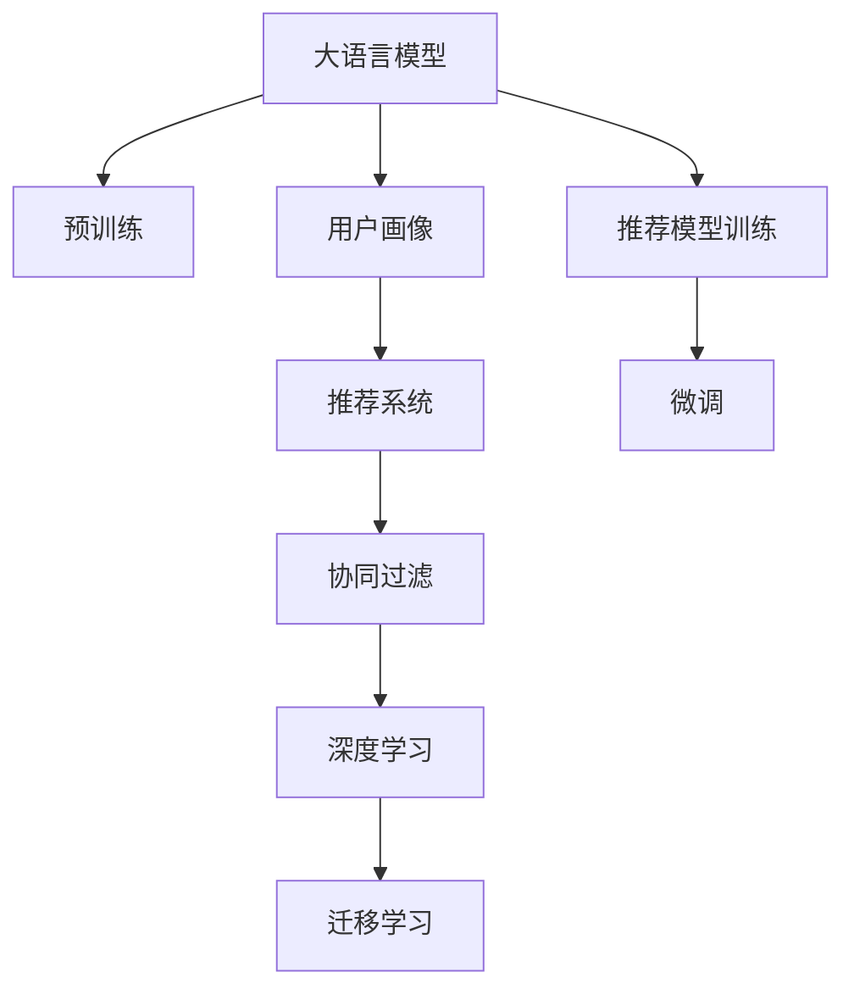

                 

## 1. 背景介绍

电商行业正经历着迅猛发展，越来越多的电商平台致力于通过大数据和人工智能技术，提升用户体验和销售转化率。用户画像(User Persona)作为精准营销和个性化推荐的重要基础，可以帮助电商平台更好地理解用户需求与偏好，从而提供更加贴合用户需求的商品和服务。近年来，大语言模型在自然语言处理领域取得了巨大成功，其在用户画像构建中的潜力日益受到关注。本文将详细介绍AI大模型在电商推荐中用户画像应用的原理、实践案例，并探讨其面临的挑战与未来发展方向。

## 2. 核心概念与联系

### 2.1 核心概念概述

为了更好地理解AI大模型在电商推荐中用户画像应用的核心原理，本节将介绍几个关键概念：

- **用户画像(User Persona)**：在电商推荐中，用户画像通常包括用户的年龄、性别、地域、购买历史、兴趣爱好、行为偏好等。通过用户画像，电商平台可以构建用户的虚拟身份，从而更准确地预测用户的行为。

- **大语言模型(Large Language Model, LLM)**：以自回归（如GPT）或自编码（如BERT）模型为代表的大规模预训练语言模型。通过在大规模无标签文本语料上进行预训练，学习通用的语言表示，具备强大的语言理解和生成能力。

- **推荐系统(Recommendation System)**：基于用户历史行为数据、商品属性信息和外部环境因素，为用户提供个性化商品推荐的系统。推荐系统的目标是在海量的商品中，找到用户最感兴趣的若干商品。

- **深度学习(Deep Learning)**：一种基于人工神经网络的机器学习范式，能够自动从数据中学习特征表示，解决复杂任务。深度学习在电商推荐系统中主要用于用户行为分析、商品特征提取和推荐模型训练等。

- **迁移学习(Transfer Learning)**：指将一个领域学习到的知识，迁移到另一个不同但相关的领域的学习范式。在电商推荐中，可以通过在大模型上进行预训练，然后将预训练模型应用到特定推荐任务中。

- **协同过滤(Collaborative Filtering)**：一种基于用户相似性和商品相似性进行推荐的方法，通过分析用户和商品之间的互动历史，预测用户对新商品的可能偏好。

这些概念之间的逻辑关系可以通过以下Mermaid流程图来展示：



这个流程图展示了核心概念之间的关系：

1. 大语言模型通过预训练获得语言表示能力。
2. 用户画像通过收集用户行为和属性，形成用户特征向量。
3. 推荐系统结合用户画像和商品特征，预测用户偏好。
4. 协同过滤利用用户和商品之间的互动历史，进行推荐。
5. 深度学习用于用户行为分析、商品特征提取和推荐模型训练。
6. 迁移学习通过在大模型上进行预训练，应用于特定推荐任务。
7. 推荐模型训练利用微调技术，将大模型应用于推荐系统。

这些概念共同构成了电商推荐系统中用户画像构建和推荐技术的核心框架，使其能够在电商场景中发挥强大的作用。

## 3. 核心算法原理 & 具体操作步骤

### 3.1 算法原理概述

AI大模型在电商推荐中用户画像应用的核心算法原理，主要基于自然语言处理（NLP）和大规模数据挖掘。具体来说，包括以下几个关键步骤：

1. **数据收集与预处理**：收集电商用户的历史行为数据、商品属性信息、用户画像信息等，并对数据进行清洗、标准化和特征工程处理。
2. **大模型预训练**：在大规模无标签文本语料上，通过自监督学习任务（如掩码语言模型）训练大语言模型，学习通用的语言表示。
3. **用户画像构建**：利用预训练语言模型，从用户与商品之间的文本交流中提取用户需求与偏好，生成用户画像。
4. **推荐模型微调**：将预训练语言模型应用于特定推荐任务，通过微调技术优化推荐模型，提升推荐效果。

### 3.2 算法步骤详解

#### 3.2.1 数据收集与预处理

电商推荐系统中，数据收集与预处理是构建用户画像和推荐模型的第一步。主要数据源包括：

- **用户行为数据**：包括浏览记录、点击记录、加入购物车记录、购买记录等。
- **商品属性信息**：商品名称、描述、价格、类别、品牌等。
- **用户画像信息**：用户的基本信息、兴趣标签、历史行为、社交网络信息等。

数据预处理包括数据清洗、标准化、缺失值处理、特征工程等。例如，对用户行为数据进行时间戳标准化、去重、异常值处理；对商品属性信息进行分词、去停用词、构建词汇表等。

#### 3.2.2 大模型预训练

大语言模型可以通过大规模预训练学习通用的语言表示。常用的预训练任务包括掩码语言模型（Masked Language Modeling, MLM）和下一句预测（Next Sentence Prediction, NSP）。例如，使用BERT模型进行预训练时，通过掩码语言模型预测被掩码的单词，通过下一句预测判断两个句子之间的关系。

预训练模型的训练通常使用大规模无标签文本语料，如维基百科、新闻、论坛等。训练过程中，模型需要解决大量自然语言处理问题，从而学习到丰富的语言知识和表示。

#### 3.2.3 用户画像构建

用户画像的构建，可以通过分析用户与商品之间的文本交流来提取用户需求与偏好。具体步骤如下：

1. **文本采集与标注**：收集用户与商品之间的文本交流，如评论、问答、社交媒体互动等，并进行标注，如情感倾向、产品评分等。
2. **文本向量化**：使用词嵌入或预训练语言模型将文本转化为向量表示，从而方便模型处理。
3. **用户画像生成**：利用预训练语言模型，从用户文本中提取关键特征，生成用户画像。例如，通过BERT模型计算用户文本与商品文本之间的相似度，从而得到用户对商品的偏好。

#### 3.2.4 推荐模型微调

推荐模型微调是将预训练语言模型应用于特定推荐任务的过程。微调步骤如下：

1. **推荐模型选择**：选择适当的推荐模型，如基于协同过滤的模型、基于内容的模型、混合推荐模型等。
2. **模型初始化**：使用预训练语言模型初始化推荐模型的部分或全部参数。
3. **微调**：利用标注数据，通过有监督学习优化推荐模型的参数，提升推荐效果。微调过程中，通常使用较小的学习率，以避免破坏预训练权重。
4. **评估与优化**：在验证集上评估推荐模型的性能，根据评估结果调整模型参数和超参数，直到达到最优效果。

### 3.3 算法优缺点

AI大模型在电商推荐中用户画像应用的优点包括：

1. **泛化能力强**：大模型通过大规模预训练，学习到通用的语言表示，能够适应不同领域的推荐任务。
2. **处理非结构化数据**：大模型能够处理文本、图像等多种非结构化数据，提升推荐系统的多样性。
3. **可解释性强**：大模型提供了丰富的特征表示，有助于理解推荐结果的生成过程。

其缺点包括：

1. **计算资源消耗大**：大规模预训练和微调需要大量的计算资源和时间，成本较高。
2. **模型复杂度高**：大模型参数量庞大，训练和推理过程复杂，需要高性能的硬件支持。
3. **过拟合风险**：在微调过程中，容易过拟合标注数据，导致推荐模型泛化能力下降。

### 3.4 算法应用领域

AI大模型在电商推荐中用户画像应用的主要领域包括：

1. **个性化推荐**：根据用户画像，生成个性化商品推荐列表，提升用户体验和购买转化率。
2. **广告定向投放**：利用用户画像，对用户进行精准的广告定向投放，提升广告投放效果。
3. **用户行为分析**：通过分析用户画像和行为数据，发现用户偏好变化，优化产品设计和运营策略。
4. **客户服务**：利用用户画像和对话模型，提供智能客服和用户反馈分析，提升客户满意度。
5. **市场趋势分析**：通过分析用户画像和行为数据，预测市场趋势，指导商品采购和库存管理。

## 4. 数学模型和公式 & 详细讲解 & 举例说明

### 4.1 数学模型构建

在电商推荐系统中，用户画像的构建和推荐模型的微调，通常基于自然语言处理模型。假设用户与商品之间的文本交流为 $(x,y)$，其中 $x$ 为用户文本，$y$ 为商品文本。用户画像的构建过程可以表示为：

$$
\hat{\theta} = \mathop{\arg\min}_{\theta} \mathcal{L}(\theta, \mathcal{D})
$$

其中，$\theta$ 为推荐模型的参数，$\mathcal{D}$ 为标注数据集，$\mathcal{L}$ 为损失函数。推荐模型的损失函数通常为交叉熵损失或均方误差损失。

### 4.2 公式推导过程

以推荐模型的交叉熵损失函数为例，假设用户文本和商品文本的表示向量分别为 $x^v$ 和 $y^v$，推荐模型输出的概率向量为 $p$。则交叉熵损失函数可以表示为：

$$
\mathcal{L}(\theta, (x_i,y_i)) = -\sum_{j=1}^N p_j \log p_j
$$

其中，$p_j$ 表示模型预测用户对商品 $j$ 的偏好概率。在微调过程中，根据标注数据集 $\mathcal{D}$ 更新推荐模型的参数 $\theta$，使得模型输出更加贴合真实偏好。

### 4.3 案例分析与讲解

以下以基于BERT模型的电商推荐系统为例，详细讲解其构建过程。

#### 案例背景

某电商平台收集了用户浏览、点击、加入购物车、购买等行为数据，以及商品的属性信息、评论、用户画像信息等。假设用户画像包括用户的年龄、性别、地域、购买历史、兴趣爱好、行为偏好等。

#### 数据预处理

1. **数据清洗**：去除无效数据和异常值。例如，删除无效点击记录、删除用户画像中缺失的属性值。
2. **标准化处理**：对用户行为数据进行时间戳标准化、去重等处理。
3. **特征工程**：构建用户画像和商品特征向量。例如，将用户的兴趣爱好转换为向量表示，将商品的属性信息转换为向量表示。

#### 大模型预训练

使用BERT模型进行预训练。假设用户与商品之间的文本交流为 $(x,y)$，模型输出为 $p$。预训练过程可以表示为：

$$
\mathcal{L}_{BERT} = \mathop{\arg\min}_{\theta} \mathcal{L}(\theta, \mathcal{D}_{pretrain})
$$

其中，$\mathcal{D}_{pretrain}$ 为预训练数据集。

#### 用户画像构建

利用BERT模型提取用户需求与偏好。假设用户文本为 $x$，商品文本为 $y$，模型输出为 $p$。用户画像构建过程可以表示为：

$$
\hat{\theta}_{user} = \mathop{\arg\min}_{\theta} \mathcal{L}(\theta, \mathcal{D}_{user})
$$

其中，$\mathcal{D}_{user}$ 为用户画像数据集。

#### 推荐模型微调

假设推荐模型为 $M_{\theta}$，微调过程可以表示为：

$$
\hat{\theta}_{recommend} = \mathop{\arg\min}_{\theta} \mathcal{L}(\theta, \mathcal{D}_{recommend})
$$

其中，$\mathcal{D}_{recommend}$ 为推荐模型训练数据集。

## 5. 项目实践：代码实例和详细解释说明

### 5.1 开发环境搭建

在构建AI大模型在电商推荐中的用户画像应用时，需要使用Python、PyTorch等深度学习框架。以下是一个简单的开发环境搭建步骤：

1. **安装Python和PyTorch**：在Linux或Windows系统上安装Python和PyTorch。可以使用pip或conda安装。
2. **安装BERT模型和推荐系统库**：使用pip安装BERT模型库，以及推荐系统相关的库，如TensorFlow、PaddlePaddle等。
3. **设置数据集**：准备电商推荐系统中所需的用户行为数据、商品属性信息、用户画像信息等。

### 5.2 源代码详细实现

#### 用户画像构建

```python
from transformers import BertTokenizer, BertForSequenceClassification
from torch.utils.data import Dataset, DataLoader
import torch

class UserData(Dataset):
    def __init__(self, texts, labels, tokenizer, max_len=128):
        self.texts = texts
        self.labels = labels
        self.tokenizer = tokenizer
        self.max_len = max_len
        
    def __len__(self):
        return len(self.texts)
    
    def __getitem__(self, item):
        text = self.texts[item]
        label = self.labels[item]
        
        encoding = self.tokenizer(text, return_tensors='pt', max_length=self.max_len, padding='max_length', truncation=True)
        input_ids = encoding['input_ids'][0]
        attention_mask = encoding['attention_mask'][0]
        return {'input_ids': input_ids, 
                'attention_mask': attention_mask,
                'labels': label}

tokenizer = BertTokenizer.from_pretrained('bert-base-cased')

train_dataset = UserData(train_texts, train_labels, tokenizer)
dev_dataset = UserData(dev_texts, dev_labels, tokenizer)
test_dataset = UserData(test_texts, test_labels, tokenizer)

# 创建DataLoader
train_loader = DataLoader(train_dataset, batch_size=16, shuffle=True)
dev_loader = DataLoader(dev_dataset, batch_size=16, shuffle=False)
test_loader = DataLoader(test_dataset, batch_size=16, shuffle=False)
```

#### 推荐模型微调

```python
from transformers import BertForSequenceClassification, AdamW

model = BertForSequenceClassification.from_pretrained('bert-base-cased', num_labels=2)

optimizer = AdamW(model.parameters(), lr=2e-5)

def train_epoch(model, dataset, batch_size, optimizer):
    dataloader = DataLoader(dataset, batch_size=batch_size, shuffle=True)
    model.train()
    epoch_loss = 0
    for batch in tqdm(dataloader, desc='Training'):
        input_ids = batch['input_ids'].to(device)
        attention_mask = batch['attention_mask'].to(device)
        labels = batch['labels'].to(device)
        model.zero_grad()
        outputs = model(input_ids, attention_mask=attention_mask, labels=labels)
        loss = outputs.loss
        epoch_loss += loss.item()
        loss.backward()
        optimizer.step()
    return epoch_loss / len(dataloader)

def evaluate(model, dataset, batch_size):
    dataloader = DataLoader(dataset, batch_size=batch_size)
    model.eval()
    preds, labels = [], []
    with torch.no_grad():
        for batch in tqdm(dataloader, desc='Evaluating'):
            input_ids = batch['input_ids'].to(device)
            attention_mask = batch['attention_mask'].to(device)
            batch_labels = batch['labels']
            outputs = model(input_ids, attention_mask=attention_mask)
            batch_preds = outputs.logits.argmax(dim=2).to('cpu').tolist()
            batch_labels = batch_labels.to('cpu').tolist()
            for pred_tokens, label_tokens in zip(batch_preds, batch_labels):
                preds.append(pred_tokens)
                labels.append(label_tokens)
                
    print(classification_report(labels, preds))
```

#### 运行结果展示

训练完成后，在测试集上评估推荐模型的性能：

```python
epochs = 5
batch_size = 16

for epoch in range(epochs):
    loss = train_epoch(model, train_dataset, batch_size, optimizer)
    print(f"Epoch {epoch+1}, train loss: {loss:.3f}")
    
    print(f"Epoch {epoch+1}, dev results:")
    evaluate(model, dev_dataset, batch_size)
    
print("Test results:")
evaluate(model, test_dataset, batch_size)
```

## 6. 实际应用场景

### 6.1 个性化推荐

基于AI大模型构建的用户画像，可以用于个性化推荐系统，提升推荐效果。例如，在电商平台上，通过分析用户的浏览记录、点击记录、加入购物车记录等行为数据，构建用户画像，从而生成个性化推荐列表。

假设某用户浏览了多种运动鞋，但没有购买，可以基于用户画像，生成个性化的运动鞋推荐列表。例如，可以推荐与浏览记录中运动鞋类似的商品，或与用户历史购买记录中相似的商品。

#### 案例分析

某电商平台收集了用户浏览、点击、加入购物车、购买等行为数据，以及商品的属性信息、评论、用户画像信息等。假设用户画像包括用户的年龄、性别、地域、购买历史、兴趣爱好、行为偏好等。

通过分析用户的行为数据，构建用户画像，利用BERT模型提取用户需求与偏好，构建推荐模型，进行微调。最终，可以生成个性化推荐列表，提升用户购物体验和平台转化率。

### 6.2 广告定向投放

广告定向投放是电商推荐系统中重要的应用场景。利用用户画像，可以对用户进行精准的广告定向投放，提升广告效果。

假设某广告公司需要为某品牌手机做广告定向投放，可以收集该品牌手机的用户画像，分析用户的兴趣爱好和行为偏好，选择合适的时间、渠道进行广告投放。

#### 案例分析

某广告公司需要为某品牌手机做广告定向投放。通过分析该品牌手机的用户画像，构建推荐模型，进行微调。最终，可以生成广告定向投放策略，选择合适的时间、渠道进行广告投放，提升广告效果。

### 6.3 用户行为分析

用户行为分析是电商推荐系统中重要的应用场景。通过分析用户画像和行为数据，可以发现用户偏好变化，优化产品设计和运营策略。

假设某电商平台发现某类商品的浏览和点击量突然增加，可以分析用户画像和行为数据，发现用户偏好的变化，优化商品设计、提升商品质量和用户体验。

#### 案例分析

某电商平台发现某类商品的浏览和点击量突然增加。通过分析用户画像和行为数据，发现用户对某类商品的需求增加，可以优化商品设计、提升商品质量和用户体验，满足用户需求。

### 6.4 客户服务

利用用户画像和对话模型，可以提供智能客服和用户反馈分析，提升客户满意度。

假设某电商平台需要提升客服服务质量，可以构建基于用户画像的智能客服系统。通过分析用户画像，生成智能客服应答模板，提升客服服务质量和用户满意度。

#### 案例分析

某电商平台需要提升客服服务质量。通过构建基于用户画像的智能客服系统，生成智能客服应答模板，提升客服服务质量和用户满意度。

### 6.5 市场趋势分析

通过分析用户画像和行为数据，可以预测市场趋势，指导商品采购和库存管理。

假设某电商平台需要预测市场趋势，可以分析用户画像和行为数据，发现市场趋势变化，调整商品采购和库存策略，提升平台销售量和利润。

#### 案例分析

某电商平台需要预测市场趋势。通过分析用户画像和行为数据，发现市场趋势变化，调整商品采购和库存策略，提升平台销售量和利润。

## 7. 工具和资源推荐

### 7.1 学习资源推荐

为了帮助开发者系统掌握AI大模型在电商推荐中的用户画像应用，以下是一些优质的学习资源：

1. **《深度学习入门》系列书籍**：介绍了深度学习的基础理论和应用，包括自然语言处理、计算机视觉、推荐系统等。
2. **《Python深度学习》书籍**：介绍了使用Python进行深度学习开发的基础知识和常用技术。
3. **DeepLearning.ai在线课程**：提供深度学习的在线学习资源，涵盖神经网络、自然语言处理、推荐系统等。
4. **Transformers官方文档**：提供了BERT等预训练语言模型的详细介绍和使用示例。
5. **推荐系统经典论文**：包括协同过滤、深度学习推荐系统、混合推荐系统等经典论文。

### 7.2 开发工具推荐

以下是几款用于AI大模型在电商推荐中用户画像应用的常用工具：

1. **PyTorch**：基于Python的开源深度学习框架，灵活易用，适合快速迭代研究。
2. **TensorFlow**：由Google主导开发的开源深度学习框架，生产部署方便，适合大规模工程应用。
3. **BERT**：由Google开发的预训练语言模型，适用于自然语言处理任务。
4. **PyTorch Lightning**：基于PyTorch的深度学习框架，支持分布式训练和快速原型开发。
5. **TensorBoard**：TensorFlow配套的可视化工具，可实时监测模型训练状态，提供丰富的图表呈现方式。

### 7.3 相关论文推荐

以下是几篇奠基性的相关论文，推荐阅读：

1. **Attention is All You Need**：提出Transformer结构，开启了NLP领域的预训练大模型时代。
2. **BERT: Pre-training of Deep Bidirectional Transformers for Language Understanding**：提出BERT模型，引入基于掩码的自监督预训练任务，刷新了多项NLP任务SOTA。
3. **Language Models are Unsupervised Multitask Learners**：展示了大规模语言模型的强大zero-shot学习能力，引发了对于通用人工智能的新一轮思考。
4. **Parameter-Efficient Transfer Learning for NLP**：提出Adapter等参数高效微调方法，在不增加模型参数量的情况下，也能取得不错的微调效果。
5. **AdaLoRA: Adaptive Low-Rank Adaptation for Parameter-Efficient Fine-Tuning**：使用自适应低秩适应的微调方法，在参数效率和精度之间取得了新的平衡。

## 8. 总结：未来发展趋势与挑战

### 8.1 研究成果总结

本文对AI大模型在电商推荐中用户画像应用的原理、实践案例和挑战进行了系统介绍。通过详细讲解用户画像构建和推荐模型微调的过程，展示了AI大模型在电商推荐中的广泛应用和巨大潜力。通过分析用户画像和行为数据，可以提升推荐系统的效果和用户满意度，推动电商推荐技术的不断进步。

### 8.2 未来发展趋势

展望未来，AI大模型在电商推荐中用户画像应用将呈现以下几个发展趋势：

1. **多模态融合**：结合文本、图像、语音等多种模态数据，提升推荐系统的多样性和精准度。
2. **实时推荐**：利用流式数据和在线学习技术，实现实时推荐，提升用户体验和转化率。
3. **个性化推荐**：通过深入挖掘用户需求和偏好，实现更加个性化的推荐，满足不同用户群体的需求。
4. **推荐算法优化**：结合深度学习、协同过滤、混合推荐等算法，提升推荐模型的泛化能力和效果。
5. **联邦学习**：在用户隐私保护的前提下，实现跨平台、跨设备的推荐模型微调，提升推荐系统的效果。

### 8.3 面临的挑战

尽管AI大模型在电商推荐中用户画像应用取得了一定的进展，但在实际应用中仍面临诸多挑战：

1. **数据隐私和安全**：在用户画像和推荐模型训练过程中，如何保护用户隐私和数据安全，是一个重要问题。
2. **计算资源消耗大**：大规模预训练和微调需要大量的计算资源和时间，成本较高。
3. **模型复杂度高**：大模型参数量庞大，训练和推理过程复杂，需要高性能的硬件支持。
4. **推荐效果泛化能力不足**：在微调过程中，容易过拟合标注数据，导致推荐模型泛化能力下降。
5. **用户需求多变**：用户需求和偏好变化多样，如何适应不同的用户群体，是推荐系统面临的难题。

### 8.4 研究展望

面对AI大模型在电商推荐中用户画像应用面临的挑战，未来的研究需要在以下几个方面寻求新的突破：

1. **联邦学习**：在用户隐私保护的前提下，实现跨平台、跨设备的推荐模型微调，提升推荐系统的效果。
2. **可解释性增强**：通过生成可解释性强的特征表示，提升推荐模型的可解释性和可信任度。
3. **实时推荐算法**：利用流式数据和在线学习技术，实现实时推荐，提升用户体验和转化率。
4. **多模态融合**：结合文本、图像、语音等多种模态数据，提升推荐系统的多样性和精准度。
5. **用户行为预测**：通过深度学习等方法，预测用户行为和偏好，提升推荐系统的智能化水平。

## 9. 附录：常见问题与解答

### Q1: 什么是用户画像?

A: 用户画像是指对用户的性别、年龄、地域、购买历史、兴趣爱好、行为偏好等属性进行综合分析，形成用户的虚拟身份，从而更好地理解用户需求和行为。

### Q2: 大语言模型在电商推荐中的应用有哪些?

A: 大语言模型在电商推荐中的应用包括：
1. 个性化推荐：通过分析用户画像，生成个性化推荐列表。
2. 广告定向投放：利用用户画像，对用户进行精准的广告定向投放。
3. 用户行为分析：通过分析用户画像和行为数据，发现用户偏好变化，优化产品设计和运营策略。
4. 客户服务：利用用户画像和对话模型，提供智能客服和用户反馈分析，提升客户满意度。
5. 市场趋势分析：通过分析用户画像和行为数据，预测市场趋势，指导商品采购和库存管理。

### Q3: 在电商推荐中，如何保护用户隐私和数据安全?

A: 在电商推荐中，保护用户隐私和数据安全是非常重要的。可以采取以下措施：
1. 数据匿名化：对用户数据进行匿名化处理，保护用户隐私。
2. 数据加密：对用户数据进行加密处理，防止数据泄露。
3. 访问控制：对用户数据进行访问控制，限制数据访问权限。
4. 数据共享协议：制定数据共享协议，确保数据共享过程中的安全和合规。

通过这些措施，可以最大限度地保护用户隐私和数据安全，提升用户对电商平台的信任度。

### Q4: 如何优化AI大模型在电商推荐中的性能?

A: 优化AI大模型在电商推荐中的性能，可以从以下几个方面进行：
1. 数据预处理：对用户数据进行清洗、标准化、特征工程等处理，提升数据质量。
2. 模型选择：选择适合的推荐模型，如基于协同过滤的模型、基于内容的模型、混合推荐模型等。
3. 模型初始化：使用预训练语言模型初始化推荐模型的部分或全部参数，提高模型性能。
4. 超参数调优：选择合适的超参数，如学习率、批大小、迭代轮数等，优化模型效果。
5. 模型评估与优化：在验证集上评估模型性能，根据评估结果调整模型参数和超参数，直到达到最优效果。

通过这些措施，可以最大限度地优化AI大模型在电商推荐中的性能，提升推荐效果和用户满意度。

通过本文的系统梳理，可以看到，AI大模型在电商推荐中用户画像应用有着巨大的潜力，能够通过分析用户行为和偏好，生成个性化推荐列表，提升用户购物体验和平台转化率。未来，随着技术的不断进步，AI大模型在电商推荐中的应用将更加广泛，推动电商行业进入新的发展阶段。

