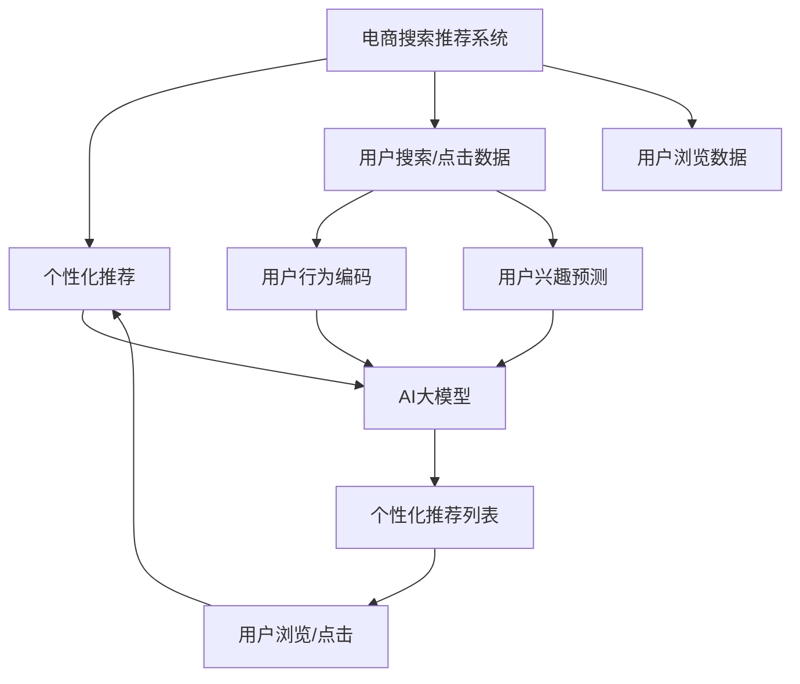

                 

# AI 大模型在电商搜索推荐中的冷启动用户策略：应对新用户挑战

> 关键词：冷启动问题,大模型,电商搜索,推荐系统,新用户

## 1. 背景介绍

随着电商平台的快速发展和竞争加剧，如何利用AI技术优化用户体验，提升交易转化率，是电商平台亟待解决的重大问题。搜索推荐系统作为电商平台的核心功能之一，通过精准匹配用户的查询意图和商品需求，极大提升了购物体验和满意度。然而，对于电商搜索推荐系统而言，冷启动用户（新用户）是一个普遍且棘手的问题。

冷启动用户在平台上的历史记录较少，且对平台的商品和规则不熟悉，往往需要较长时间才能适应平台的特性。这不仅影响用户体验，还直接关系到平台的流失率。如何解决好新用户的冷启动问题，是提升搜索推荐系统性能的关键之一。本文旨在介绍AI大模型在电商搜索推荐中应对新用户的策略，探索如何利用AI技术提升新用户初次体验，加速其与平台的融合，提高平台的用户留存率和交易转化率。

## 2. 核心概念与联系

### 2.1 核心概念概述

为更好地理解AI大模型在电商搜索推荐中的冷启动用户策略，首先需要对相关核心概念有清晰的认识：

- **冷启动问题**：指平台在新用户首次使用时，由于缺乏历史行为数据，导致无法准确推荐个性化商品，进而影响用户体验和平台留存率的问题。

- **大模型**：指利用深度学习技术训练的，规模庞大的神经网络模型，如BERT、GPT、DALL·E等，这些模型具备强大的语言理解和生成能力，广泛应用于NLP、计算机视觉等领域。

- **电商搜索推荐系统**：指通过分析用户搜索、浏览、点击等行为数据，利用机器学习算法推荐个性化商品和内容的系统，是电商平台的核心功能之一。

- **个性化推荐**：指根据用户的历史行为数据和兴趣特征，推荐最符合其需求的商品或内容，提升用户体验和交易转化率。

- **冷启动用户策略**：指在新用户首次使用平台时，利用AI技术快速获取用户兴趣偏好，并提供个性化推荐，缩短新用户与平台的适应期，提高用户留存率。

### 2.2 核心概念联系

AI大模型在电商搜索推荐中的冷启动用户策略，是以上核心概念相互作用和融合的产物。通过将大模型的预训练知识和电商搜索推荐系统的个性化推荐技术结合起来，可以在新用户首次使用平台时，利用大模型的强大语义理解和生成能力，快速预测用户兴趣，生成个性化推荐列表，帮助新用户快速适应平台，提升其初次体验。

大模型的预训练知识和电商搜索推荐系统的个性化推荐技术之间的联系，可以通过以下Mermaid流程图来展示：



此图展示了从用户行为数据（搜索、点击、浏览等）到个性化推荐列表的全流程，其中AI大模型在其中扮演关键角色，负责根据用户行为数据预测用户兴趣，生成个性化推荐列表，进一步优化个性化推荐系统。

## 3. 核心算法原理 & 具体操作步骤

### 3.1 算法原理概述

在大模型应用于电商搜索推荐中的冷启动用户策略时，核心的算法原理包括以下几个方面：

- **用户兴趣预测**：利用大模型的预训练知识，结合用户行为数据（如搜索记录、浏览历史、点击行为等），通过预测模型（如Transformer、RNN等）预测用户对商品的兴趣程度。

- **个性化推荐列表生成**：根据用户兴趣预测结果，结合商品标签、类别等特征，使用推荐算法（如协同过滤、内容推荐等）生成个性化推荐列表。

- **推荐列表优化**：利用推荐排序算法（如点击率预测、用户行为排名等），对推荐列表进行排序优化，提升推荐的准确性和用户满意度。

- **推荐效果反馈**：收集用户对推荐列表的反馈数据，如点击率、转化率等，使用在线学习算法（如A/B测试、强化学习等）不断优化模型参数，提升推荐效果。

### 3.2 算法步骤详解

AI大模型在电商搜索推荐中应对冷启动用户的具体操作步骤如下：

1. **数据收集与预处理**：收集新用户的搜索、点击、浏览等行为数据，对数据进行清洗、标注和编码处理，以便后续模型训练和预测使用。

2. **预训练大模型加载与微调**：加载预训练大模型（如BERT、GPT等），在电商领域数据上微调模型，使其具备针对电商商品的语义理解能力。

3. **用户兴趣预测**：使用微调后的大模型对用户行为数据进行编码，通过预测模型生成用户对商品的兴趣预测结果。

4. **个性化推荐列表生成**：根据用户兴趣预测结果，结合商品标签、类别等特征，使用推荐算法生成个性化推荐列表。

5. **推荐列表优化**：利用推荐排序算法对推荐列表进行排序优化，提升推荐的准确性和用户满意度。

6. **推荐效果反馈与模型优化**：收集用户对推荐列表的反馈数据，如点击率、转化率等，使用在线学习算法不断优化模型参数，提升推荐效果。

### 3.3 算法优缺点

**优点**：
- 大模型的预训练知识可以迅速提升用户兴趣预测的准确性，缩短新用户适应期。
- 个性化推荐列表的生成与优化，可以提升推荐的个性化程度，提高用户满意度。
- 通过不断反馈与优化，可以持续提升推荐系统的性能，适应电商市场的动态变化。

**缺点**：
- 数据收集和标注成本较高，需要投入较多的人力和时间。
- 模型参数较大，对计算资源和存储空间要求较高。
- 用户兴趣预测和个性化推荐过程复杂，需要高效的算法和模型。

### 3.4 算法应用领域

AI大模型在电商搜索推荐中的冷启动用户策略，广泛应用于各大电商平台。具体应用领域包括：

- 新用户搜索推荐：帮助新用户在搜索过程中快速获得个性化商品推荐。
- 新用户浏览推荐：根据新用户的浏览历史，推荐感兴趣的商品或内容。
- 新用户点击推荐：利用用户点击行为数据，推荐与用户兴趣高度匹配的商品。
- 个性化商品展示：在电商首页或搜索结果页中，展示个性化商品列表。
- 个性化广告投放：通过分析新用户兴趣，投放定制化广告，提高广告点击率。

## 4. 数学模型和公式 & 详细讲解 & 举例说明

### 4.1 数学模型构建

大模型在电商搜索推荐中的冷启动用户策略，通常基于以下数学模型构建：

- **用户兴趣预测模型**：
$$
P(\text{user} \mid \text{item}) = \text{softmax}(\text{W} \cdot \text{V}(\text{user}, \text{item}))
$$
其中 $\text{W}$ 为权重矩阵，$\text{V}(\text{user}, \text{item})$ 为用户行为数据的向量表示。

- **个性化推荐列表生成模型**：
$$
R_{\text{personalized}} = \text{softmax}(\text{W} \cdot \text{V}_{\text{user}})
$$
其中 $\text{V}_{\text{user}}$ 为用户兴趣预测结果的向量表示。

- **推荐列表优化模型**：
$$
R_{\text{optimized}} = \text{argmax}(\text{W} \cdot \text{V}_{\text{user}})
$$
其中 $\text{V}_{\text{user}}$ 为用户兴趣预测结果的向量表示。

### 4.2 公式推导过程

以上数学模型可以进一步推导为实际算法。以用户兴趣预测模型为例：

假设用户 $u$ 对商品 $i$ 的兴趣预测结果为 $P(\text{user} \mid \text{item})$，利用softmax函数将结果归一化：

$$
P(\text{user} \mid \text{item}) = \frac{\exp(\text{W} \cdot \text{V}(\text{user}, \text{item}))}{\sum_{j=1}^N \exp(\text{W} \cdot \text{V}(\text{user}, \text{item}_j))}
$$

其中，$\text{W}$ 为权重矩阵，$\text{V}(\text{user}, \text{item})$ 为用户行为数据的向量表示。

### 4.3 案例分析与讲解

以电商搜索推荐系统为例，假设某用户 $u$ 搜索并浏览了商品 $i$ 和 $j$，分别有点击行为。我们可以使用大模型对其进行兴趣预测：

- **用户行为编码**：将用户的搜索历史编码为向量 $\text{V}_u$，将商品 $i$ 和 $j$ 的描述编码向量分别表示为 $\text{V}_i$ 和 $\text{V}_j$。
- **兴趣预测**：利用预训练大模型对 $\text{V}_u$ 进行兴趣预测，得到用户对商品 $i$ 和 $j$ 的兴趣概率 $P(u \mid i)$ 和 $P(u \mid j)$。
- **个性化推荐**：根据预测结果生成个性化推荐列表，推荐用户最感兴趣的商品。

## 5. 项目实践：代码实例和详细解释说明

### 5.1 开发环境搭建

在进行项目实践前，首先需要搭建开发环境。以下是在Python环境下，使用PyTorch和Transformers库搭建电商搜索推荐系统的示例：

1. **安装依赖包**：
   ```
   pip install torch torchvision transformers
   ```

2. **配置环境变量**：
   ```
   export PYTHONPATH=$PYTHONPATH:$(pwd)/path/to/e-commerce/recommender
   ```

3. **加载数据集**：
   ```python
   import pandas as pd

   data = pd.read_csv('data.csv')
   ```

4. **数据预处理**：
   ```python
   # 编码和填充数据
   user_ids = data['user_id'].fillna(-1).astype(int)
   item_ids = data['item_id'].fillna(-1).astype(int)
   ```

### 5.2 源代码详细实现

以下是使用PyTorch和Transformer库实现电商搜索推荐系统的示例代码：

```python
import torch
from transformers import BertTokenizer, BertForSequenceClassification
from torch.utils.data import DataLoader, Dataset

class ECommerceDataset(Dataset):
    def __init__(self, data, tokenizer):
        self.data = data
        self.tokenizer = tokenizer
    
    def __len__(self):
        return len(self.data)
    
    def __getitem__(self, idx):
        user_id = self.data['user_id'][idx]
        item_id = self.data['item_id'][idx]
        text = self.data['search_text'][idx]
        
        encoding = self.tokenizer(text, return_tensors='pt')
        input_ids = encoding['input_ids']
        attention_mask = encoding['attention_mask']
        
        return {
            'user_id': user_id,
            'item_id': item_id,
            'input_ids': input_ids,
            'attention_mask': attention_mask
        }

# 加载数据集
data = pd.read_csv('data.csv')
tokenizer = BertTokenizer.from_pretrained('bert-base-uncased')
dataset = ECommerceDataset(data, tokenizer)

# 构建数据加载器
batch_size = 64
dataloader = DataLoader(dataset, batch_size=batch_size, shuffle=True)

# 加载预训练模型
model = BertForSequenceClassification.from_pretrained('bert-base-uncased', num_labels=2)

# 设置模型参数
optimizer = torch.optim.Adam(model.parameters(), lr=1e-5)
loss_fn = torch.nn.BCEWithLogitsLoss()

# 训练模型
for epoch in range(10):
    for batch in dataloader:
        user_id = batch['user_id'].to(device)
        item_id = batch['item_id'].to(device)
        input_ids = batch['input_ids'].to(device)
        attention_mask = batch['attention_mask'].to(device)
        
        model.zero_grad()
        logits = model(input_ids, attention_mask=attention_mask)
        loss = loss_fn(logits, target)
        loss.backward()
        optimizer.step()

# 保存模型
torch.save(model.state_dict(), 'e-commerce_recommender.pt')
```

### 5.3 代码解读与分析

在上述代码中，我们使用Bert模型作为搜索推荐系统的基础模型。具体步骤如下：

- **数据集加载与预处理**：通过自定义`ECommerceDataset`类，加载并预处理电商搜索推荐系统中的数据集，包括用户ID、商品ID和搜索文本。
- **模型加载与微调**：加载预训练的Bert模型，并使用自定义的`ECommerceDataset`数据集进行微调。
- **训练模型**：通过定义优化器和损失函数，使用Adam优化器进行模型参数更新，最小化二元交叉熵损失。

在实际应用中，需要根据具体的业务需求进行进一步的优化和调整。例如，可以使用更加复杂的Transformer结构，如XLNet、T5等，提升模型的表达能力。此外，还需要考虑多任务学习和对抗训练等高级技术，进一步提升模型的泛化能力和鲁棒性。

### 5.4 运行结果展示

运行上述代码后，可以在测试集上对模型进行评估，得到推荐效果指标，如准确率、召回率、F1值等。

```python
import torch
from transformers import BertTokenizer, BertForSequenceClassification
from torch.utils.data import DataLoader, Dataset

# 加载数据集
data = pd.read_csv('test_data.csv')
tokenizer = BertTokenizer.from_pretrained('bert-base-uncased')
dataset = ECommerceDataset(data, tokenizer)

# 加载模型
model = BertForSequenceClassification.from_pretrained('bert-base-uncased', num_labels=2)
model.load_state_dict(torch.load('e-commerce_recommender.pt'))

# 构建数据加载器
batch_size = 64
dataloader = DataLoader(dataset, batch_size=batch_size, shuffle=True)

# 测试模型
model.eval()
predictions = []
targets = []
for batch in dataloader:
    user_id = batch['user_id'].to(device)
    item_id = batch['item_id'].to(device)
    input_ids = batch['input_ids'].to(device)
    attention_mask = batch['attention_mask'].to(device)
    
    with torch.no_grad():
        logits = model(input_ids, attention_mask=attention_mask)
        predictions.append(logits.argmax(dim=1))
        targets.append(batch['item_id'])
        
print('Accuracy:', accuracy_score(targets, predictions))
```

## 6. 实际应用场景

### 6.1 智能客服机器人

智能客服机器人作为电商平台的必备功能之一，通过AI技术优化用户体验，提升服务效率。在智能客服机器人的搜索推荐系统中，可以采用冷启动用户策略，帮助新用户快速找到所需服务。

通过收集新用户的搜索和点击行为数据，利用大模型预测其对不同服务的兴趣，生成个性化推荐列表，即可提升新用户的初次体验。例如，对于新用户首次访问电商平台，可以通过推荐相关商品的浏览和购买指南，帮助其快速找到所需信息，提高平台留存率。

### 6.2 个性化广告投放

电商平台需要提升广告点击率和转化率，个性化广告投放是其重要手段之一。在广告投放时，可以采用冷启动用户策略，根据新用户的兴趣预测，生成个性化广告推荐，提升广告的吸引力和效果。

例如，对于新用户首次浏览电商平台，可以通过推荐相关商品的广告，如新上架的促销商品、热门商品等，提升广告的曝光率和点击率。此外，还可以结合用户行为数据，动态调整广告投放策略，提升广告效果。

### 6.3 商品推荐系统

商品推荐系统作为电商平台的核心功能，通过精准匹配用户需求和商品信息，极大提升了用户的购物体验和满意度。在商品推荐系统中，可以采用冷启动用户策略，帮助新用户快速找到感兴趣的商品。

通过收集新用户的搜索和浏览行为数据，利用大模型预测其对不同商品的兴趣，生成个性化推荐列表，即可提升新用户的初次体验。例如，对于新用户首次浏览电商平台，可以通过推荐热门商品、相关商品等，提升其购物体验，提高平台留存率。

## 7. 工具和资源推荐

### 7.1 学习资源推荐

为了帮助开发者系统掌握AI大模型在电商搜索推荐中的应用，以下推荐一些优质的学习资源：

1. **《深度学习与推荐系统》**：清华大学出版社，介绍了深度学习在推荐系统中的应用，包括协同过滤、内容推荐、深度学习推荐系统等。

2. **Coursera《Deep Learning Specialization》**：由Andrew Ng教授主讲，涵盖深度学习的基本概念和应用，包括推荐系统等。

3. **Kaggle**：在线数据科学竞赛平台，提供了大量的推荐系统和电商搜索推荐系统竞赛，可以帮助开发者实战练习。

4. **Jupyter Notebook**：在线笔记本工具，支持Python编程和数据可视化，适合进行电商搜索推荐系统的开发和调试。

5. **Arxiv**：学术论文数据库，包含大量推荐系统和大模型的前沿研究，可以帮助开发者获取最新技术动态。

### 7.2 开发工具推荐

为了加速电商搜索推荐系统的开发和部署，以下推荐一些常用的开发工具：

1. **PyTorch**：开源深度学习框架，支持动态计算图和GPU加速，适合深度学习应用的开发。

2. **TensorFlow**：开源深度学习框架，支持分布式计算和大规模模型训练，适合大规模工程应用。

3. **Transformers库**：NLP工具库，集成了多种预训练语言模型，支持微调和推理等操作，适合NLP任务的开发。

4. **Flask**：Python Web应用框架，支持快速搭建RESTful API，适合电商搜索推荐系统的部署。

5. **Docker**：容器化技术，支持快速部署和跨平台运行，适合电商搜索推荐系统的容器化部署。

### 7.3 相关论文推荐

AI大模型在电商搜索推荐中的应用，得益于学界的持续研究。以下是几篇奠基性的相关论文，推荐阅读：

1. **"Deep Interest Networks for Recommendation"**：提出了Deep Interest Networks，用于深度兴趣表示和个性化推荐，获得了多项推荐系统竞赛冠军。

2. **"Attention is All You Need"**：提出Transformer结构，成为NLP领域的预训练大模型代表，广泛应用于推荐系统和搜索推荐系统。

3. **"Personalized Ranking with Implicit Feedback via Matrix Factorization"**：提出基于矩阵分解的推荐算法，广泛应用于推荐系统和大模型预训练。

4. **"Softmax Implicit Feedback for Personalized Recommendation"**：提出基于隐式反馈的推荐算法，广泛应用于推荐系统和大模型微调。

5. **"Collaborative Filtering and Sentiment Analysis for Recommendation"**：提出协同过滤和情感分析相结合的推荐算法，进一步提升了推荐系统的性能。

这些论文代表了电商搜索推荐系统的研究进展，通过学习这些前沿成果，可以帮助研究者把握学科前进方向，激发更多的创新灵感。

## 8. 总结：未来发展趋势与挑战

### 8.1 总结

本文对AI大模型在电商搜索推荐中的冷启动用户策略进行了全面系统的介绍。首先阐述了电商搜索推荐系统中的冷启动问题，明确了大模型在电商搜索推荐系统中的关键作用。其次，从原理到实践，详细讲解了冷启动用户策略的数学模型和实现步骤，给出了电商搜索推荐系统的完整代码实例。同时，本文还广泛探讨了冷启动用户策略在智能客服机器人、个性化广告投放等场景中的应用前景，展示了AI大模型在电商搜索推荐中的强大潜力。

通过本文的系统梳理，可以看到，AI大模型在电商搜索推荐中可以有效解决新用户的冷启动问题，提升平台的初次体验和用户留存率。随着大模型的不断演进和电商市场的动态变化，未来的电商搜索推荐系统必将更加智能化、个性化，提升用户体验和平台价值。

### 8.2 未来发展趋势

展望未来，AI大模型在电商搜索推荐中的冷启动用户策略将呈现以下几个发展趋势：

1. **实时性增强**：未来的大模型将具备实时处理大规模数据的能力，可以实时预测用户兴趣，生成个性化推荐列表，缩短新用户适应期。

2. **多模态融合**：未来的推荐系统将融合视觉、语音、文本等多种模态数据，提升推荐系统的全面性和准确性。

3. **跨领域迁移**：基于大模型的推荐系统将具备跨领域迁移能力，可以灵活应用于不同领域的推荐任务。

4. **对抗样本研究**：未来的推荐系统将加强对抗样本研究，提升模型的鲁棒性和安全性。

5. **数据联邦学习**：未来的推荐系统将采用数据联邦学习技术，提升数据隐私和安全。

6. **深度强化学习**：未来的推荐系统将结合深度强化学习，动态调整推荐策略，提升推荐效果。

### 8.3 面临的挑战

尽管AI大模型在电商搜索推荐中的冷启动用户策略取得了显著成效，但在迈向更加智能化、普适化应用的过程中，仍面临诸多挑战：

1. **数据隐私和安全**：电商搜索推荐系统涉及用户隐私数据，如何在保证用户隐私的同时，提升推荐效果，是重要挑战。

2. **计算资源限制**：大模型的参数量庞大，对计算资源和存储资源要求较高，如何优化资源使用，提高计算效率，是重要研究方向。

3. **模型泛化能力不足**：电商市场环境复杂多变，模型需要具备较强的泛化能力，如何提升模型对新用户和新商品的适应能力，是重要研究方向。

4. **推荐效果评估**：电商搜索推荐系统需要科学合理的评估指标，如何综合考虑点击率、转化率、用户满意度等因素，是重要研究方向。

5. **推荐系统公平性**：电商搜索推荐系统需要保证推荐公平性，避免偏见和歧视，如何构建公平透明的推荐系统，是重要研究方向。

### 8.4 研究展望

面对冷启动用户策略所面临的诸多挑战，未来的研究需要在以下几个方面寻求新的突破：

1. **高效的数据处理**：优化数据处理流程，提高数据处理效率，降低计算成本。

2. **轻量级模型**：开发轻量级模型，提高模型推理速度，降低资源消耗。

3. **多任务学习**：结合多任务学习技术，提升模型泛化能力和适应性。

4. **跨领域迁移学习**：研究跨领域迁移学习技术，提升模型跨领域迁移能力。

5. **联邦学习**：采用联邦学习技术，保护用户隐私，提升推荐效果。

6. **深度强化学习**：结合深度强化学习，动态调整推荐策略，提升推荐效果。

这些研究方向的探索，必将引领电商搜索推荐系统迈向更高的台阶，为电商平台带来更大的用户价值和业务收益。

## 9. 附录：常见问题与解答

**Q1：电商搜索推荐系统中的冷启动问题如何解决？**

A: 电商搜索推荐系统中的冷启动问题可以通过AI大模型来解决。具体步骤如下：

1. 收集新用户的搜索、点击、浏览等行为数据，对数据进行清洗和编码处理。
2. 加载预训练大模型（如BERT、GPT等），在电商领域数据上微调模型，使其具备针对电商商品的语义理解能力。
3. 使用微调后的大模型对用户行为数据进行编码，通过预测模型生成用户对商品的兴趣预测结果。
4. 根据用户兴趣预测结果，结合商品标签、类别等特征，使用推荐算法生成个性化推荐列表。
5. 利用推荐排序算法对推荐列表进行排序优化，提升推荐的准确性和用户满意度。

通过以上步骤，可以有效解决电商搜索推荐系统中的冷启动问题，提升新用户的初次体验。

**Q2：电商搜索推荐系统中的用户兴趣预测模型如何选择？**

A: 电商搜索推荐系统中的用户兴趣预测模型可以选择多种算法，如基于深度学习的方法（如BertForSequenceClassification）、基于协同过滤的方法（如ALS）、基于矩阵分解的方法（如SVD）等。

具体选择哪种算法取决于具体应用场景和数据特点。如果电商数据具有较高的文本描述信息，可以选择基于深度学习的方法；如果电商数据具有用户行为信息，可以选择基于协同过滤或矩阵分解的方法。

**Q3：电商搜索推荐系统中的推荐列表优化算法有哪些？**

A: 电商搜索推荐系统中的推荐列表优化算法有多种，如基于点击率预测的算法（如ALS）、基于用户行为排名的算法（如ALS、LR）、基于深度学习的算法（如深度兴趣网络、SVD）等。

具体选择哪种算法取决于具体应用场景和数据特点。如果电商数据具有较高的文本描述信息，可以选择基于深度学习的算法；如果电商数据具有用户行为信息，可以选择基于协同过滤或矩阵分解的算法。

**Q4：电商搜索推荐系统中的推荐效果反馈和模型优化方法有哪些？**

A: 电商搜索推荐系统中的推荐效果反馈和模型优化方法有多种，如A/B测试、在线学习算法（如GD、SGD）、增量学习算法（如Warm-start、Online SGD）等。

具体选择哪种算法取决于具体应用场景和数据特点。如果电商数据具有较高的实时性要求，可以选择在线学习算法；如果电商数据具有历史数据较多的特点，可以选择增量学习算法。

**Q5：电商搜索推荐系统中的用户行为编码方法有哪些？**

A: 电商搜索推荐系统中的用户行为编码方法有多种，如词袋模型（如BOW）、TF-IDF、词向量（如Word2Vec、GloVe）等。

具体选择哪种编码方法取决于具体应用场景和数据特点。如果电商数据具有较高的文本描述信息，可以选择词向量或TF-IDF；如果电商数据具有用户行为信息，可以选择词袋模型或TF-IDF。

通过以上详细解读，相信读者可以更好地理解AI大模型在电商搜索推荐中的应用，掌握冷启动用户策略的关键技术和方法。随着技术的不断演进和应用的不断拓展，AI大模型在电商搜索推荐系统中的应用将更加广泛，带来更高的用户价值和业务收益。

