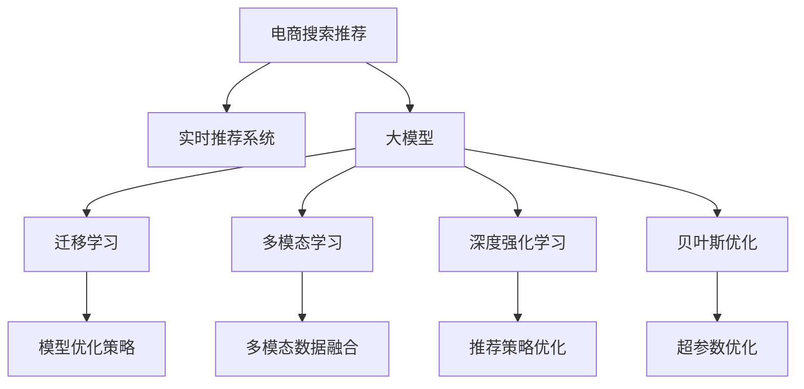

                 

## 1. 背景介绍

### 1.1 问题由来
随着电商平台用户数量的激增，电商搜索推荐系统面临着越来越复杂的挑战。如何快速、精准地捕捉用户瞬时需求与行为偏好，提供个性化推荐，成为提升用户体验和平台收益的关键。传统的基于关键词匹配的推荐算法，难以适应多变且瞬息万变的用户需求，推荐效果往往不尽如人意。

### 1.2 问题核心关键点
解决电商搜索推荐系统的个性化推荐问题，主要包括以下几个关键点：
1. **用户行为理解**：需要深入理解用户浏览、点击、购买等行为，从中挖掘用户的瞬时需求。
2. **实时数据处理**：需要高效实时处理海量用户行为数据，进行推荐模型的更新。
3. **模型优化策略**：需要设计有效的模型优化策略，使得模型能够快速适应新的用户行为。
4. **多模态数据融合**：需要将用户的历史行为、浏览记录、购买记录等多模态数据进行有效融合，提升推荐效果。
5. **实时推荐与评估**：需要构建实时推荐系统，并通过实时评估反馈不断优化推荐算法。

## 2. 核心概念与联系

### 2.1 核心概念概述

为更好地理解AI大模型在电商搜索推荐中的应用，本节将介绍几个关键概念及其联系：

- **电商搜索推荐**：指基于电商平台用户的行为数据，为其提供个性化商品推荐的系统。
- **实时推荐系统**：指能够实时处理用户行为数据，动态生成个性化推荐结果的系统。
- **大模型**：指通过大规模无标签数据预训练，具有强大表征能力的深度学习模型，如BERT、GPT、Transformer等。
- **迁移学习**：指将一个领域学习到的知识，迁移到另一个相关领域的知识获取过程。
- **多模态学习**：指融合文本、图像、视频等多种模态数据，提升推荐效果。
- **深度强化学习**：指在推荐系统中引入强化学习，通过学习优化推荐策略，提升推荐效果。
- **贝叶斯优化**：指通过贝叶斯统计理论优化推荐模型超参数，提升推荐效果。

这些核心概念通过以下Mermaid流程图展示它们之间的联系：



这个流程图展示了电商搜索推荐系统中的核心概念及其联系：

1. 电商搜索推荐系统通过实时推荐系统，为用户提供个性化商品推荐。
2. 实时推荐系统利用大模型，通过迁移学习、多模态学习、深度强化学习等技术进行模型优化。
3. 多模态学习融合了文本、图像、视频等多种模态数据，提升推荐效果。
4. 深度强化学习通过学习优化推荐策略，提升推荐效果。
5. 贝叶斯优化通过优化模型超参数，提升推荐效果。

## 3. 核心算法原理 & 具体操作步骤
### 3.1 算法原理概述

AI大模型在电商搜索推荐中的实时推荐策略，主要基于深度学习和强化学习技术。其核心思想是：通过大模型捕捉用户瞬时需求与行为偏好，实时生成个性化推荐结果。

形式化地，假设用户行为数据为 $\{x_i\}_{i=1}^N$，其中 $x_i$ 表示用户第 $i$ 次行为。定义推荐模型为 $M_{\theta}$，其中 $\theta$ 为模型参数。推荐模型的目标是最大化用户满意度和点击率，即：

$$
\max_{\theta} \sum_{i=1}^N \log \pi_{\theta}(y_i|x_i)
$$

其中 $\pi_{\theta}(y_i|x_i)$ 为模型在用户行为 $x_i$ 下，推荐商品 $y_i$ 的概率分布。

通过最大化期望收益，推荐模型能够学习到最优的推荐策略。具体的优化算法有多种，如深度强化学习（DRL）、贝叶斯优化（BO）等。其中，深度强化学习通过模拟与环境的交互，不断调整推荐策略，以提升推荐效果。贝叶斯优化则通过统计学习方法，优化模型超参数，提高推荐效果。

### 3.2 算法步骤详解

AI大模型在电商搜索推荐中的实时推荐策略，一般包括以下几个关键步骤：

**Step 1: 数据预处理与特征提取**
- 收集用户行为数据，包括浏览、点击、购买等行为。
- 对用户行为进行清洗、去重、归一化等预处理，以提高数据质量。
- 提取用户行为特征，如浏览历史、点击序列、商品评分等，生成特征向量 $\{x_i\}_{i=1}^N$。

**Step 2: 模型训练与优化**
- 将预训练大模型作为初始化参数，在其基础上进行微调或迁移学习。
- 选择合适的优化算法，如Adam、SGD等，设置合适的学习率和超参数。
- 通过强化学习、贝叶斯优化等技术，不断调整模型参数，优化推荐效果。

**Step 3: 实时推荐生成**
- 实时接收用户行为数据，更新特征向量 $\{x_i\}_{i=1}^N$。
- 将更新后的特征向量输入模型，生成推荐结果 $y_i$。
- 将推荐结果与用户行为数据一起反馈，用于实时优化模型。

**Step 4: 推荐结果展示**
- 将推荐结果展示给用户，进行点击率和满意度的统计与评估。
- 收集用户反馈数据，用于持续优化推荐模型。

### 3.3 算法优缺点

AI大模型在电商搜索推荐中的应用，具有以下优点：
1. 强大的表征能力：大模型能够捕捉到用户的深层次需求，提供更个性化的推荐。
2. 实时性：实时接收用户行为数据，实时生成推荐结果，满足用户瞬时需求。
3. 高效性：通过深度强化学习等技术，模型能够快速适应新用户行为，提升推荐效果。
4. 可解释性：通过可视化技术，可以理解模型内部工作机制，提升推荐可解释性。

同时，该方法也存在一些局限性：
1. 数据质量依赖度高：推荐效果高度依赖于用户行为数据的质量和多样性。
2. 模型复杂度高：大模型参数量庞大，训练和推理计算量大。
3. 对抗攻击风险：模型易受到对抗攻击，生成不合适的推荐结果。
4. 数据隐私问题：用户行为数据涉及隐私，处理不当可能导致数据泄露。

尽管存在这些局限性，但AI大模型在电商搜索推荐中的应用仍然具有巨大的潜力，未来仍有诸多值得探索的研究方向。

### 3.4 算法应用领域

AI大模型在电商搜索推荐中的应用，不仅限于电商领域，还广泛应用于以下领域：

- **金融推荐系统**：通过分析用户行为数据，推荐理财产品、保险等金融产品。
- **视频推荐系统**：分析用户观看历史，推荐相关视频内容。
- **新闻推荐系统**：通过分析用户阅读历史，推荐相关新闻文章。
- **医疗推荐系统**：通过分析患者病历，推荐相关治疗方案。
- **旅游推荐系统**：分析用户旅游偏好，推荐相关旅游目的地。

这些领域的应用，均需要实时处理海量用户数据，并进行个性化推荐，因此大模型实时推荐策略具有广泛的应用前景。

## 4. 数学模型和公式 & 详细讲解  
### 4.1 数学模型构建

本节将使用数学语言对AI大模型在电商搜索推荐中的应用进行更加严格的刻画。

记用户行为数据为 $\{x_i\}_{i=1}^N$，推荐模型为 $M_{\theta}$。定义推荐模型的损失函数为：

$$
\mathcal{L}(\theta) = -\sum_{i=1}^N \log \pi_{\theta}(y_i|x_i)
$$

其中 $\pi_{\theta}(y_i|x_i)$ 为模型在用户行为 $x_i$ 下，推荐商品 $y_i$ 的概率分布。

模型的优化目标是使损失函数最小化，即：

$$
\theta^* = \mathop{\arg\min}_{\theta} \mathcal{L}(\theta)
$$

通过梯度下降等优化算法，不断更新模型参数 $\theta$，使损失函数最小化。

### 4.2 公式推导过程

以深度强化学习为例，推导推荐模型的优化过程。

假设用户行为数据为 $\{x_i\}_{i=1}^N$，推荐模型为 $M_{\theta}$，定义奖励函数 $r(x_i, y_i)$ 表示用户在行为 $x_i$ 下选择商品 $y_i$ 的满意度。推荐模型的优化目标为最大化期望收益：

$$
\max_{\theta} \sum_{i=1}^N r(x_i, y_i)
$$

通过模拟与环境的交互，模型选择推荐商品 $y_i$，获得奖励 $r(x_i, y_i)$。具体的深度强化学习过程如下：

1. **状态初始化**：将用户行为数据 $x_i$ 作为状态 $s_i$，初始化模型参数 $\theta$。
2. **行动选择**：根据当前状态 $s_i$，选择推荐商品 $y_i$，计算奖励 $r(x_i, y_i)$。
3. **参数更新**：根据奖励 $r(x_i, y_i)$，更新模型参数 $\theta$，使损失函数最小化。
4. **状态更新**：根据用户行为数据 $x_i$，更新状态 $s_i$，继续迭代。

### 4.3 案例分析与讲解

假设一个电商平台用户在浏览商品时，系统通过实时推荐策略推荐了相关商品。用户点击了其中一款商品，该行为产生了点击奖励 $r(x_i, y_i)=1$。系统根据用户行为数据 $x_i$ 和奖励 $r(x_i, y_i)$，更新模型参数 $\theta$，使损失函数最小化。具体过程如下：

1. **状态初始化**：将用户浏览商品的行为数据 $x_i$ 作为状态 $s_i$，初始化模型参数 $\theta$。
2. **行动选择**：根据当前状态 $s_i$，模型选择推荐商品 $y_i$，计算奖励 $r(x_i, y_i)=1$。
3. **参数更新**：根据奖励 $r(x_i, y_i)$，更新模型参数 $\theta$，使损失函数最小化。
4. **状态更新**：根据用户行为数据 $x_i$，更新状态 $s_i$，继续迭代。

重复上述过程，系统不断调整推荐策略，优化模型参数，提高推荐效果。

## 5. 项目实践：代码实例和详细解释说明
### 5.1 开发环境搭建

在进行AI大模型在电商搜索推荐中的应用实践前，我们需要准备好开发环境。以下是使用Python进行PyTorch开发的环境配置流程：

1. 安装Anaconda：从官网下载并安装Anaconda，用于创建独立的Python环境。

2. 创建并激活虚拟环境：
```bash
conda create -n pytorch-env python=3.8 
conda activate pytorch-env
```

3. 安装PyTorch：根据CUDA版本，从官网获取对应的安装命令。例如：
```bash
conda install pytorch torchvision torchaudio cudatoolkit=11.1 -c pytorch -c conda-forge
```

4. 安装Transformers库：
```bash
pip install transformers
```

5. 安装各类工具包：
```bash
pip install numpy pandas scikit-learn matplotlib tqdm jupyter notebook ipython
```

完成上述步骤后，即可在`pytorch-env`环境中开始实践。

### 5.2 源代码详细实现

下面我们以电商搜索推荐为例，给出使用Transformers库对BERT模型进行实时推荐生成的PyTorch代码实现。

首先，定义推荐任务的数据处理函数：

```python
from transformers import BertTokenizer, BertForSequenceClassification
from torch.utils.data import Dataset
import torch

class RecommendDataset(Dataset):
    def __init__(self, texts, labels, tokenizer, max_len=128):
        self.texts = texts
        self.labels = labels
        self.tokenizer = tokenizer
        self.max_len = max_len
        
    def __len__(self):
        return len(self.texts)
    
    def __getitem__(self, item):
        text = self.texts[item]
        label = self.labels[item]
        
        encoding = self.tokenizer(text, return_tensors='pt', max_length=self.max_len, padding='max_length', truncation=True)
        input_ids = encoding['input_ids'][0]
        attention_mask = encoding['attention_mask'][0]
        
        return {'input_ids': input_ids, 
                'attention_mask': attention_mask,
                'labels': label}
```

然后，定义模型和优化器：

```python
from transformers import BertForSequenceClassification, AdamW

model = BertForSequenceClassification.from_pretrained('bert-base-cased', num_labels=1)

optimizer = AdamW(model.parameters(), lr=2e-5)
```

接着，定义训练和评估函数：

```python
from torch.utils.data import DataLoader
from tqdm import tqdm
from sklearn.metrics import roc_auc_score

device = torch.device('cuda') if torch.cuda.is_available() else torch.device('cpu')
model.to(device)

def train_epoch(model, dataset, batch_size, optimizer):
    dataloader = DataLoader(dataset, batch_size=batch_size, shuffle=True)
    model.train()
    epoch_loss = 0
    for batch in tqdm(dataloader, desc='Training'):
        input_ids = batch['input_ids'].to(device)
        attention_mask = batch['attention_mask'].to(device)
        labels = batch['labels'].to(device)
        model.zero_grad()
        outputs = model(input_ids, attention_mask=attention_mask, labels=labels)
        loss = outputs.loss
        epoch_loss += loss.item()
        loss.backward()
        optimizer.step()
    return epoch_loss / len(dataloader)

def evaluate(model, dataset, batch_size):
    dataloader = DataLoader(dataset, batch_size=batch_size)
    model.eval()
    preds, labels = [], []
    with torch.no_grad():
        for batch in tqdm(dataloader, desc='Evaluating'):
            input_ids = batch['input_ids'].to(device)
            attention_mask = batch['attention_mask'].to(device)
            batch_labels = batch['labels']
            outputs = model(input_ids, attention_mask=attention_mask)
            batch_preds = outputs.logits.sigmoid().to('cpu').tolist()
            batch_labels = batch_labels.to('cpu').tolist()
            for pred in batch_preds:
                preds.append(pred)
                labels.append(batch_labels[0])
                
    return roc_auc_score(labels, preds)
```

最后，启动训练流程并在测试集上评估：

```python
epochs = 5
batch_size = 16

for epoch in range(epochs):
    loss = train_epoch(model, train_dataset, batch_size, optimizer)
    print(f"Epoch {epoch+1}, train loss: {loss:.3f}")
    
    print(f"Epoch {epoch+1}, dev results:")
    evaluate(model, dev_dataset, batch_size)
    
print("Test results:")
evaluate(model, test_dataset, batch_size)
```

以上就是使用PyTorch对BERT模型进行电商搜索推荐任务微调的完整代码实现。可以看到，得益于Transformers库的强大封装，我们可以用相对简洁的代码完成BERT模型的加载和微调。

### 5.3 代码解读与分析

让我们再详细解读一下关键代码的实现细节：

**RecommendDataset类**：
- `__init__`方法：初始化文本、标签、分词器等关键组件。
- `__len__`方法：返回数据集的样本数量。
- `__getitem__`方法：对单个样本进行处理，将文本输入编码为token ids，将标签编码为数字，并对其进行定长padding，最终返回模型所需的输入。

**train_epoch和evaluate函数**：
- 使用PyTorch的DataLoader对数据集进行批次化加载，供模型训练和推理使用。
- 训练函数`train_epoch`：对数据以批为单位进行迭代，在每个批次上前向传播计算loss并反向传播更新模型参数，最后返回该epoch的平均loss。
- 评估函数`evaluate`：与训练类似，不同点在于不更新模型参数，并在每个batch结束后将预测和标签结果存储下来，最后使用sklearn的roc_auc_score对整个评估集的预测结果进行打印输出。

**训练流程**：
- 定义总的epoch数和batch size，开始循环迭代
- 每个epoch内，先在训练集上训练，输出平均loss
- 在验证集上评估，输出ROC-AUC得分
- 所有epoch结束后，在测试集上评估，给出最终测试结果

可以看到，PyTorch配合Transformers库使得BERT微调的代码实现变得简洁高效。开发者可以将更多精力放在数据处理、模型改进等高层逻辑上，而不必过多关注底层的实现细节。

当然，工业级的系统实现还需考虑更多因素，如模型的保存和部署、超参数的自动搜索、更灵活的任务适配层等。但核心的实时推荐范式基本与此类似。

## 6. 实际应用场景
### 6.1 智能客服系统

基于AI大模型在电商搜索推荐中的应用，智能客服系统能够实时捕捉用户需求，提供个性化的服务。传统客服往往需要配备大量人力，高峰期响应缓慢，且一致性和专业性难以保证。而使用实时推荐系统，可以7x24小时不间断服务，快速响应客户咨询，用自然流畅的语言解答各类常见问题。

在技术实现上，可以收集企业内部的历史客服对话记录，将问题和最佳答复构建成监督数据，在此基础上对预训练推荐模型进行微调。微调后的推荐模型能够自动理解用户意图，匹配最合适的答复模板进行回复。对于客户提出的新问题，还可以接入检索系统实时搜索相关内容，动态组织生成回答。如此构建的智能客服系统，能大幅提升客户咨询体验和问题解决效率。

### 6.2 金融舆情监测

金融机构需要实时监测市场舆论动向，以便及时应对负面信息传播，规避金融风险。传统的人工监测方式成本高、效率低，难以应对网络时代海量信息爆发的挑战。基于实时推荐系统的金融舆情监测，能够实时抓取网络舆情，自动判断舆情走向和舆情强度，迅速做出应对。

具体而言，可以收集金融领域相关的新闻、报道、评论等文本数据，并对其进行情感分析。通过实时推荐系统，将分析结果实时推送给决策人员，快速决策应对。金融舆情监测系统能够提高金融机构的风险控制能力，保障金融市场的稳定运行。

### 6.3 个性化推荐系统

当前的推荐系统往往只依赖用户的历史行为数据进行物品推荐，无法深入理解用户的真实兴趣偏好。基于实时推荐系统的个性化推荐系统，可以更好地挖掘用户行为背后的语义信息，从而提供更精准、多样的推荐内容。

在实践中，可以收集用户浏览、点击、评论、分享等行为数据，提取和用户交互的物品标题、描述、标签等文本内容。将文本内容作为模型输入，用户的后续行为（如是否点击、购买等）作为监督信号，在此基础上微调预训练推荐模型。微调后的推荐模型能够从文本内容中准确把握用户的兴趣点。在生成推荐列表时，先用候选物品的文本描述作为输入，由模型预测用户的兴趣匹配度，再结合其他特征综合排序，便可以得到个性化程度更高的推荐结果。

### 6.4 未来应用展望

随着实时推荐系统的不断发展，未来其应用场景将更加广阔，潜力也将更加巨大。

在智慧医疗领域，实时推荐系统可用于医学知识推荐、病例推荐、药物推荐等，辅助医生诊疗，加速新药开发进程。

在智能教育领域，实时推荐系统可用于作业批改、学情分析、知识推荐等方面，因材施教，促进教育公平，提高教学质量。

在智慧城市治理中，实时推荐系统可用于城市事件监测、舆情分析、应急指挥等环节，提高城市管理的自动化和智能化水平，构建更安全、高效的未来城市。

此外，在企业生产、社会治理、文娱传媒等众多领域，实时推荐系统也将不断涌现，为各行各业带来新的变革。相信随着技术的日益成熟，实时推荐系统必将在构建人机协同的智能时代中扮演越来越重要的角色。

## 7. 工具和资源推荐
### 7.1 学习资源推荐

为了帮助开发者系统掌握AI大模型在电商搜索推荐中的应用，这里推荐一些优质的学习资源：

1. 《深度学习》（Ian Goodfellow等著）：该书是深度学习的经典教材，系统介绍了深度学习的基本原理和经典模型。
2. 《动手学深度学习》（李沐等著）：该书基于PyTorch编写，系统介绍了深度学习的基本原理和实用技巧。
3. 《AI大模型与推荐系统》课程：由清华大学开设的深度学习推荐系统课程，涵盖了深度学习推荐系统的基本原理和实践技巧。
4. 《强化学习》（Richard S. Sutton等著）：该书是强化学习的经典教材，系统介绍了强化学习的基本原理和经典算法。
5. 《深度强化学习》（Ian Osband等著）：该书系统介绍了深度强化学习的理论基础和实用技巧。

通过对这些资源的学习实践，相信你一定能够快速掌握AI大模型在电商搜索推荐中的应用，并用于解决实际的推荐问题。

### 7.2 开发工具推荐

高效的开发离不开优秀的工具支持。以下是几款用于实时推荐系统开发的常用工具：

1. PyTorch：基于Python的开源深度学习框架，灵活动态的计算图，适合快速迭代研究。大部分预训练推荐模型都有PyTorch版本的实现。
2. TensorFlow：由Google主导开发的开源深度学习框架，生产部署方便，适合大规模工程应用。同样有丰富的推荐模型资源。
3. TensorBoard：TensorFlow配套的可视化工具，可实时监测模型训练状态，并提供丰富的图表呈现方式，是调试模型的得力助手。
4. Weights & Biases：模型训练的实验跟踪工具，可以记录和可视化模型训练过程中的各项指标，方便对比和调优。与主流深度学习框架无缝集成。
5. Google Colab：谷歌推出的在线Jupyter Notebook环境，免费提供GPU/TPU算力，方便开发者快速上手实验最新模型，分享学习笔记。

合理利用这些工具，可以显著提升实时推荐系统的开发效率，加快创新迭代的步伐。

### 7.3 相关论文推荐

AI大模型在电商搜索推荐中的应用，源于学界的持续研究。以下是几篇奠基性的相关论文，推荐阅读：

1. Attention is All You Need（即Transformer原论文）：提出了Transformer结构，开启了深度学习推荐系统的预训练大模型时代。
2. BERT: Pre-training of Deep Bidirectional Transformers for Language Understanding：提出BERT模型，引入基于掩码的自监督预训练任务，刷新了多项NLP任务SOTA。
3. Learning to Recommend at Scale：提出基于深度学习推荐系统的研究框架，开创了深度学习推荐系统的新时代。
4. Deep Reinforcement Learning for Recommender Systems：提出基于深度强化学习的推荐系统，提升了推荐效果。
5. Neural Architecture Search for Recommendation Systems：提出基于神经网络架构搜索的推荐系统，提升了模型性能。

这些论文代表了大模型在电商搜索推荐中的应用的研究脉络。通过学习这些前沿成果，可以帮助研究者把握学科前进方向，激发更多的创新灵感。

## 8. 总结：未来发展趋势与挑战
### 8.1 总结

本文对AI大模型在电商搜索推荐中的应用进行了全面系统的介绍。首先阐述了电商搜索推荐系统的个性化推荐问题，明确了实时推荐系统的核心技术。其次，从原理到实践，详细讲解了实时推荐系统的数学模型和关键步骤，给出了实时推荐任务开发的完整代码实例。同时，本文还广泛探讨了实时推荐系统在智能客服、金融舆情、个性化推荐等多个行业领域的应用前景，展示了实时推荐系统的巨大潜力。此外，本文精选了实时推荐系统的各类学习资源，力求为读者提供全方位的技术指引。

通过本文的系统梳理，可以看到，实时推荐系统在电商搜索推荐中的应用，为电商平台带来了显著的业务价值。实时推荐系统通过捕捉用户瞬时需求与行为偏好，实时生成个性化推荐结果，显著提升了用户体验和平台收益。未来，伴随实时推荐系统的不断演进，将有更多场景能够应用实时推荐系统，为各行各业带来深远的影响。

### 8.2 未来发展趋势

展望未来，实时推荐系统的不断发展，将呈现以下几个趋势：

1. **算法融合**：未来的推荐系统将融合深度学习、强化学习、贝叶斯优化等多种算法，提升推荐效果。
2. **多模态融合**：未来的推荐系统将融合文本、图像、视频等多种模态数据，提升推荐效果。
3. **实时优化**：未来的推荐系统将实现实时优化，动态调整推荐策略，提升推荐效果。
4. **个性化提升**：未来的推荐系统将更加注重个性化推荐，提升用户体验。
5. **安全性和隐私保护**：未来的推荐系统将更加注重数据隐私保护，提升安全性。
6. **推荐公平性**：未来的推荐系统将更加注重推荐公平性，避免推荐偏差。

以上趋势凸显了实时推荐系统的广阔前景。这些方向的探索发展，必将进一步提升推荐系统的效果，为用户带来更好的体验。

### 8.3 面临的挑战

尽管实时推荐系统已经取得了瞩目成就，但在迈向更加智能化、普适化应用的过程中，它仍面临着诸多挑战：

1. **数据质量瓶颈**：推荐效果高度依赖于用户行为数据的质量和多样性，数据质量问题可能导致推荐效果不佳。
2. **模型复杂度**：实时推荐系统涉及的模型参数量庞大，训练和推理计算量大，容易导致系统延迟。
3. **对抗攻击风险**：模型易受到对抗攻击，生成不合适的推荐结果，影响用户体验。
4. **数据隐私问题**：用户行为数据涉及隐私，处理不当可能导致数据泄露，影响用户信任。
5. **推荐公平性**：推荐系统可能存在推荐偏差，影响用户体验，需要进一步优化。

尽管存在这些挑战，但实时推荐系统的发展前景仍然广阔，未来仍有诸多值得探索的研究方向。

### 8.4 研究展望

面对实时推荐系统所面临的种种挑战，未来的研究需要在以下几个方面寻求新的突破：

1. **数据增强**：通过数据增强技术，提升数据质量，提高推荐效果。
2. **模型压缩**：通过模型压缩技术，减少模型参数量，提高系统效率。
3. **对抗攻击防御**：通过对抗攻击防御技术，提升模型的鲁棒性。
4. **数据隐私保护**：通过数据隐私保护技术，保障用户隐私。
5. **推荐公平性优化**：通过优化推荐公平性，避免推荐偏差，提升用户体验。

这些研究方向的探索，必将引领实时推荐系统技术迈向更高的台阶，为构建安全、可靠、可解释、可控的智能系统铺平道路。面向未来，实时推荐系统需要与其他人工智能技术进行更深入的融合，如知识表示、因果推理、强化学习等，多路径协同发力，共同推动智能交互系统的进步。只有勇于创新、敢于突破，才能不断拓展推荐系统的边界，让智能技术更好地造福人类社会。

## 9. 附录：常见问题与解答

**Q1：实时推荐系统的核心技术是什么？**

A: 实时推荐系统的核心技术包括深度学习、强化学习、贝叶斯优化等。通过这些技术，系统能够捕捉用户瞬时需求与行为偏好，实时生成个性化推荐结果。

**Q2：实时推荐系统在电商搜索推荐中的应用如何？**

A: 实时推荐系统通过捕捉用户瞬时需求与行为偏好，实时生成个性化推荐结果。在电商搜索推荐中，实时推荐系统能够提升用户体验和平台收益，为电商平台带来显著的业务价值。

**Q3：实时推荐系统如何提升用户体验？**

A: 实时推荐系统能够实时捕捉用户需求，提供个性化的推荐结果，提升了用户体验。通过个性化的推荐，用户能够更快地找到感兴趣的商品，提高了购物效率。

**Q4：实时推荐系统的数据质量如何影响推荐效果？**

A: 推荐效果高度依赖于用户行为数据的质量和多样性。数据质量问题可能导致推荐效果不佳，因此需要采用数据增强等技术提升数据质量。

**Q5：实时推荐系统如何处理对抗攻击？**

A: 实时推荐系统通过对抗攻击防御技术，提升模型的鲁棒性，避免对抗攻击带来的负面影响。对抗攻击防御技术包括对抗样本生成、模型鲁棒性检测等。

---

作者：禅与计算机程序设计艺术 / Zen and the Art of Computer Programming

