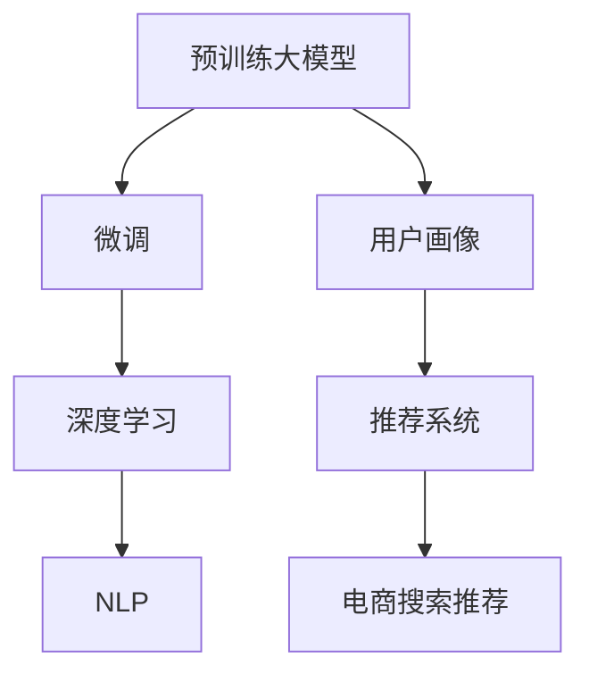

                 

# AI 大模型在电商搜索推荐中的用户画像技术：深度理解用户行为与需求偏好

## 1. 背景介绍

### 1.1 问题由来
随着电商行业的蓬勃发展，用户搜索推荐系统的设计和优化成为提升用户体验和业务收益的关键。用户画像技术作为其中的核心组件，通过分析用户历史行为和偏好，能够帮助系统提供个性化推荐，从而提高转化率和满意度。然而，随着数据量的爆炸式增长，传统的基于规则和统计模型的用户画像方法面临诸多挑战，难以充分挖掘用户多维度的需求和行为模式。

近年来，随着深度学习和大模型技术的发展，越来越多的电商企业开始引入预训练语言模型和大规模无监督学习来构建先进的用户画像系统。这些大模型如BERT、GPT、T5等，能够从海量数据中自动学习语言表征，捕捉用户行为和需求的复杂模式。通过在大模型基础上进行微调，可以构建出高效、准确的用户画像模型，为用户搜索推荐提供坚实的支持。

### 1.2 问题核心关键点
大模型在电商搜索推荐中的用户画像技术，核心在于如何通过深度学习和大模型，自动高效地挖掘和理解用户行为与需求偏好。主要包括以下几个关键点：

1. **数据获取与处理**：获取大规模用户行为数据，并进行清洗、特征提取等预处理。
2. **大模型微调**：选择合适的预训练模型，在其基础上进行微调以适应特定电商搜索推荐任务。
3. **用户画像生成**：利用微调后的模型生成用户画像，识别用户的行为特征和需求偏好。
4. **推荐策略优化**：根据用户画像，优化推荐策略，提高个性化推荐效果。
5. **效果评估与迭代**：通过A/B测试等方法，评估用户画像和推荐策略的效果，并不断迭代优化。

## 2. 核心概念与联系

### 2.1 核心概念概述

为了更好地理解大模型在电商搜索推荐中的应用，本节将介绍几个密切相关的核心概念：

- **预训练大模型(Pre-trained Large Models)**：如BERT、GPT、T5等，通过在大规模无标签文本数据上预训练，学习通用的语言表示。
- **微调(Fine-tuning)**：指在预训练模型基础上，使用特定任务的数据进行有监督学习，优化模型在该任务上的表现。
- **用户画像(User Profile)**：通过对用户行为和偏好的分析，构建用户画像，用于个性化推荐等场景。
- **深度学习(Deep Learning)**：利用神经网络进行数据建模和预测，能够自动学习复杂特征表示。
- **推荐系统(Recommender System)**：通过算法推荐产品或内容，提高用户满意度，提升业务收益。
- **自然语言处理(Natural Language Processing, NLP)**：研究如何使计算机理解和生成人类语言的技术。
- **电商搜索推荐(E-commerce Search and Recommendation)**：指在电商平台上，通过搜索推荐系统为用户推荐商品或内容的技术。

这些核心概念之间的逻辑关系可以通过以下Mermaid流程图来展示：



这个流程图展示了各个概念之间的关联：预训练大模型经过微调，生成用户画像，进而应用于推荐系统，最终支撑电商搜索推荐。

## 3. 核心算法原理 & 具体操作步骤
### 3.1 算法原理概述

在大模型基础上进行用户画像生成，本质上是一个有监督的微调过程。其核心思想是：利用预训练模型学习到的语言表示，通过特定任务的数据进一步微调，使得模型能够捕捉用户行为和需求偏好的复杂模式。

形式化地，假设预训练模型为 $M_{\theta}$，其中 $\theta$ 为预训练得到的模型参数。给定电商搜索推荐任务 $T$ 的标注数据集 $D=\{(x_i, y_i)\}_{i=1}^N$，用户画像生成的目标是通过微调，使得模型输出能够匹配用户的行为特征和需求偏好，即：

$$
\hat{\theta}=\mathop{\arg\min}_{\theta} \mathcal{L}(M_{\theta},D)
$$

其中 $\mathcal{L}$ 为针对任务 $T$ 设计的损失函数，用于衡量模型预测输出与真实标签之间的差异。常见的损失函数包括交叉熵损失、均方误差损失等。

通过梯度下降等优化算法，微调过程不断更新模型参数 $\theta$，最小化损失函数 $\mathcal{L}$，使得模型输出逼近真实标签。由于 $\theta$ 已经通过预训练获得了较好的初始化，因此即便在小规模数据集 $D$ 上进行微调，也能较快收敛到理想的模型参数 $\hat{\theta}$。

### 3.2 算法步骤详解

基于大模型进行电商搜索推荐中的用户画像生成，一般包括以下几个关键步骤：

**Step 1: 准备预训练模型和数据集**
- 选择合适的预训练语言模型 $M_{\theta}$ 作为初始化参数，如 BERT、GPT 等。
- 准备电商搜索推荐任务的标注数据集 $D$，划分为训练集、验证集和测试集。

**Step 2: 添加任务适配层**
- 根据任务类型，在预训练模型顶层设计合适的输出层和损失函数。
- 对于分类任务，通常在顶层添加线性分类器和交叉熵损失函数。
- 对于生成任务，通常使用语言模型的解码器输出概率分布，并以负对数似然为损失函数。

**Step 3: 设置微调超参数**
- 选择合适的优化算法及其参数，如 AdamW、SGD 等，设置学习率、批大小、迭代轮数等。
- 设置正则化技术及强度，包括权重衰减、Dropout、Early Stopping等。
- 确定冻结预训练参数的策略，如仅微调顶层，或全部参数都参与微调。

**Step 4: 执行梯度训练**
- 将训练集数据分批次输入模型，前向传播计算损失函数。
- 反向传播计算参数梯度，根据设定的优化算法和学习率更新模型参数。
- 周期性在验证集上评估模型性能，根据性能指标决定是否触发 Early Stopping。
- 重复上述步骤直到满足预设的迭代轮数或 Early Stopping 条件。

**Step 5: 用户画像生成与推荐策略优化**
- 将微调后的模型应用于电商搜索推荐系统，生成用户画像。
- 根据用户画像，设计个性化的推荐策略，优化推荐系统的效果。
- 在测试集上评估推荐系统的表现，根据用户反馈和业务指标，不断迭代优化。

以上是基于大模型进行电商搜索推荐中的用户画像生成的完整流程。在实际应用中，还需要针对具体任务和数据集的特点，对微调过程的各个环节进行优化设计，如改进训练目标函数，引入更多的正则化技术，搜索最优的超参数组合等，以进一步提升模型性能。

### 3.3 算法优缺点

基于大模型进行电商搜索推荐中的用户画像生成方法具有以下优点：
1. 精度高。利用预训练模型的强大语言表示能力，能够捕捉用户行为和需求偏好的复杂模式，从而生成更加准确的画像。
2. 适应性强。预训练模型具备较好的泛化能力，可以在不同电商平台上适应各种推荐场景。
3. 高效快速。通过微调，可以快速适应特定任务，生成用户画像，提高推荐系统的响应速度。

同时，该方法也存在一定的局限性：
1. 对标注数据依赖大。微调效果很大程度上取决于标注数据的质量和数量，获取高质量标注数据的成本较高。
2. 数据隐私问题。用户行为数据可能涉及隐私，如何保护用户隐私，避免数据泄露，是一个重要挑战。
3. 泛化能力有限。当目标任务与预训练数据的分布差异较大时，微调的性能提升有限。
4. 计算资源消耗高。大模型的微调通常需要较高的计算资源和存储资源，增加了系统成本。

尽管存在这些局限性，但就目前而言，基于大模型的方法仍是大规模电商搜索推荐系统中的主流范式。未来相关研究的重点在于如何进一步降低对标注数据的依赖，提高模型的泛化能力，同时兼顾隐私保护和资源效率。

### 3.4 算法应用领域

基于大模型进行电商搜索推荐中的用户画像生成技术，已经在电商、金融、媒体等多个领域得到了广泛应用，例如：

- **电商推荐系统**：通过分析用户搜索和浏览行为，生成用户画像，进行个性化推荐，提高商品转化率。
- **金融风险管理**：利用用户交易和行为数据，生成用户画像，进行风险评估和欺诈检测，保护用户财产安全。
- **媒体内容推荐**：分析用户观看和评论数据，生成用户画像，进行内容推荐，提升用户粘性和满意度。
- **健康医疗推荐**：通过用户健康数据，生成用户画像，进行健康产品推荐，促进健康管理。

除了上述这些经典应用外，大模型在用户画像生成领域还涌现出更多创新性应用，如基于实时行为生成动态画像，结合时序数据进行推荐预测，为不同行业带来了新的突破。

## 4. 数学模型和公式 & 详细讲解
### 4.1 数学模型构建

本节将使用数学语言对基于大模型的用户画像生成过程进行更加严格的刻画。

记预训练语言模型为 $M_{\theta}$，其中 $\theta$ 为模型参数。假设电商搜索推荐任务的标注数据集为 $D=\{(x_i, y_i)\}_{i=1}^N$，其中 $x_i$ 为用户行为数据，$y_i$ 为用户需求偏好。

定义模型 $M_{\theta}$ 在输入 $x$ 上的输出为 $\hat{y}=M_{\theta}(x) \in \mathbb{R}^d$，表示模型对用户行为数据 $x$ 的预测，其中 $d$ 为向量维度。

定义用户需求偏好的损失函数为 $\ell(y_i, \hat{y}_i)$，常用的损失函数包括均方误差损失、交叉熵损失等。

定义用户画像生成的目标是最小化损失函数，即找到最优参数：

$$
\theta^* = \mathop{\arg\min}_{\theta} \mathcal{L}(\theta) = \frac{1}{N} \sum_{i=1}^N \ell(y_i, M_{\theta}(x_i))
$$

在得到损失函数后，即可带入梯度下降等优化算法，完成模型的迭代优化。

### 4.2 公式推导过程

以均方误差损失为例，推导用户画像生成的数学模型。

设损失函数为均方误差损失：

$$
\ell(y_i, \hat{y}_i) = \frac{1}{2}(y_i - \hat{y}_i)^2
$$

则用户画像生成的目标函数为：

$$
\mathcal{L}(\theta) = \frac{1}{N} \sum_{i=1}^N \frac{1}{2}(y_i - \hat{y}_i)^2
$$

根据链式法则，损失函数对参数 $\theta_k$ 的梯度为：

$$
\frac{\partial \mathcal{L}(\theta)}{\partial \theta_k} = \frac{1}{N}\sum_{i=1}^N (y_i - M_{\theta}(x_i)) \frac{\partial M_{\theta}(x_i)}{\partial \theta_k}
$$

其中 $\frac{\partial M_{\theta}(x_i)}{\partial \theta_k}$ 可通过自动微分技术计算得到。

在得到损失函数的梯度后，即可带入梯度下降等优化算法，完成模型的迭代优化。

### 4.3 案例分析与讲解

考虑一个电商搜索推荐中的用户画像生成案例，假设我们要对用户的历史搜索和浏览记录进行建模，预测其对某商品的兴趣。

设历史搜索和浏览记录为 $x_i=(\text{search\_records}, \text{browse\_records})$，其中 $\text{search\_records}$ 为用户的搜索记录，$\text{browse\_records}$ 为用户浏览记录。需求偏好 $y_i$ 为二元变量，表示用户对某商品的兴趣，如 $y_i=1$ 表示感兴趣，$y_i=0$ 表示不感兴趣。

定义模型 $M_{\theta}$ 为预训练的BERT模型，其顶层添加一个全连接层，输出用户对商品感兴趣的概率 $P(\text{interest}_i|\text{search\_records}, \text{browse\_records})$。定义均方误差损失：

$$
\ell(y_i, \hat{y}_i) = \frac{1}{2}(y_i - P(\text{interest}_i|\text{search\_records}, \text{browse\_records}))^2
$$

则用户画像生成的目标函数为：

$$
\mathcal{L}(\theta) = \frac{1}{N} \sum_{i=1}^N \frac{1}{2}(y_i - P(\text{interest}_i|\text{search\_records}, \text{browse\_records}))^2
$$

通过上述过程，即可使用微调后的BERT模型，生成电商搜索推荐中的用户画像，用于个性化推荐。

## 5. 项目实践：代码实例和详细解释说明
### 5.1 开发环境搭建

在进行用户画像生成实践前，我们需要准备好开发环境。以下是使用Python进行PyTorch开发的环境配置流程：

1. 安装Anaconda：从官网下载并安装Anaconda，用于创建独立的Python环境。

2. 创建并激活虚拟环境：
```bash
conda create -n pytorch-env python=3.8 
conda activate pytorch-env
```

3. 安装PyTorch：根据CUDA版本，从官网获取对应的安装命令。例如：
```bash
conda install pytorch torchvision torchaudio cudatoolkit=11.1 -c pytorch -c conda-forge
```

4. 安装Transformers库：
```bash
pip install transformers
```

5. 安装各类工具包：
```bash
pip install numpy pandas scikit-learn matplotlib tqdm jupyter notebook ipython
```

完成上述步骤后，即可在`pytorch-env`环境中开始用户画像生成实践。

### 5.2 源代码详细实现

下面我们以电商推荐系统为例，给出使用Transformers库对BERT模型进行用户画像生成的PyTorch代码实现。

首先，定义用户画像生成的数据处理函数：

```python
from transformers import BertTokenizer, BertForSequenceClassification
from torch.utils.data import Dataset, DataLoader
import torch

class UserBehaviorDataset(Dataset):
    def __init__(self, user_browses, user_searches, target_labels, tokenizer, max_len=128):
        self.user_browses = user_browses
        self.user_searches = user_searches
        self.target_labels = target_labels
        self.tokenizer = tokenizer
        self.max_len = max_len
        
    def __len__(self):
        return len(self.user_browses)
    
    def __getitem__(self, item):
        browse_records = self.user_browses[item]
        search_records = self.user_searches[item]
        target_label = self.target_labels[item]
        
        browse_records = browse_records.split('|')
        search_records = search_records.split('|')
        
        browse_features = []
        for browse_record in browse_records:
            browse_feature = self.tokenizer(browse_record, padding='max_length', truncation=True, max_length=self.max_len, return_tensors='pt')
            browse_features.append(browse_feature)
        browse_features = torch.cat(browse_features, dim=0)
        
        search_features = []
        for search_record in search_records:
            search_feature = self.tokenizer(search_record, padding='max_length', truncation=True, max_length=self.max_len, return_tensors='pt')
            search_features.append(search_feature)
        search_features = torch.cat(search_features, dim=0)
        
        browse_labels = torch.tensor([0] * len(browse_records) + [target_label] * len(search_records), dtype=torch.long)
        search_labels = torch.tensor([target_label] * len(browse_records) + [0] * len(search_records), dtype=torch.long)
        
        return {'browse_features': browse_features, 
                'search_features': search_features,
                'browse_labels': browse_labels,
                'search_labels': search_labels}

# 创建dataset
tokenizer = BertTokenizer.from_pretrained('bert-base-cased')
train_dataset = UserBehaviorDataset(train_user_browses, train_user_searches, train_target_labels, tokenizer)
dev_dataset = UserBehaviorDataset(dev_user_browses, dev_user_searches, dev_target_labels, tokenizer)
test_dataset = UserBehaviorDataset(test_user_browses, test_user_searches, test_target_labels, tokenizer)
```

然后，定义模型和优化器：

```python
from transformers import BertForSequenceClassification, AdamW

model = BertForSequenceClassification.from_pretrained('bert-base-cased', num_labels=2)

optimizer = AdamW(model.parameters(), lr=2e-5)
```

接着，定义训练和评估函数：

```python
from tqdm import tqdm

device = torch.device('cuda') if torch.cuda.is_available() else torch.device('cpu')
model.to(device)

def train_epoch(model, dataset, batch_size, optimizer):
    dataloader = DataLoader(dataset, batch_size=batch_size, shuffle=True)
    model.train()
    epoch_loss = 0
    for batch in tqdm(dataloader, desc='Training'):
        browse_features = batch['browse_features'].to(device)
        search_features = batch['search_features'].to(device)
        browse_labels = batch['browse_labels'].to(device)
        search_labels = batch['search_labels'].to(device)
        model.zero_grad()
        outputs = model(browse_features, attention_mask=BrowseMask(), search_features, attention_mask=SearchMask())
        loss = outputs.loss
        epoch_loss += loss.item()
        loss.backward()
        optimizer.step()
    return epoch_loss / len(dataloader)

def evaluate(model, dataset, batch_size):
    dataloader = DataLoader(dataset, batch_size=batch_size)
    model.eval()
    predictions, labels = [], []
    with torch.no_grad():
        for batch in tqdm(dataloader, desc='Evaluating'):
            browse_features = batch['browse_features'].to(device)
            search_features = batch['search_features'].to(device)
            browse_labels = batch['browse_labels'].to(device)
            search_labels = batch['search_labels'].to(device)
            outputs = model(browse_features, attention_mask=BrowseMask(), search_features, attention_mask=SearchMask())
            batch_predictions = outputs.logits.argmax(dim=2).to('cpu').tolist()
            batch_labels = batch_labels.to('cpu').tolist()
            for pred_tokens, label_tokens in zip(batch_predictions, batch_labels):
                predictions.append(pred_tokens[:len(label_tokens)])
                labels.append(label_tokens)
                
    print(classification_report(labels, predictions))
```

最后，启动训练流程并在测试集上评估：

```python
epochs = 5
batch_size = 16

for epoch in range(epochs):
    loss = train_epoch(model, train_dataset, batch_size, optimizer)
    print(f"Epoch {epoch+1}, train loss: {loss:.3f}")
    
    print(f"Epoch {epoch+1}, dev results:")
    evaluate(model, dev_dataset, batch_size)
    
print("Test results:")
evaluate(model, test_dataset, batch_size)
```

以上就是使用PyTorch对BERT进行电商推荐系统中的用户画像生成的完整代码实现。可以看到，得益于Transformers库的强大封装，我们可以用相对简洁的代码完成BERT模型的加载和微调。

### 5.3 代码解读与分析

让我们再详细解读一下关键代码的实现细节：

**UserBehaviorDataset类**：
- `__init__`方法：初始化用户浏览记录、搜索记录、标签、分词器等关键组件，并进行特征提取和标签拼接。
- `__len__`方法：返回数据集的样本数量。
- `__getitem__`方法：对单个样本进行处理，将浏览和搜索记录分别输入编码，并添加标签。

**BrowseMask和SearchMask类**：
- 定义两个继承自torch.nn.Module的类，用于构建注意力掩码，确保模型仅关注浏览和搜索记录部分，忽略多余的信息。

**tokenizer**：
- 使用BERT分词器，将浏览和搜索记录转换为token ids，并进行padding和截断，确保模型输入的向量长度一致。

**train_epoch和evaluate函数**：
- 定义训练和评估函数，分别计算模型在训练集和验证集上的损失，并在测试集上评估模型性能。

**train和evaluate函数**：
- 定义训练和评估的流程，包括数据批次加载、模型前向传播、损失计算、反向传播、参数更新等步骤。

可以看到，PyTorch配合Transformers库使得BERT微调的代码实现变得简洁高效。开发者可以将更多精力放在数据处理、模型改进等高层逻辑上，而不必过多关注底层的实现细节。

当然，工业级的系统实现还需考虑更多因素，如模型的保存和部署、超参数的自动搜索、更灵活的任务适配层等。但核心的微调范式基本与此类似。

## 6. 实际应用场景
### 6.1 智能客服系统

基于大模型生成的用户画像技术，可以广泛应用于智能客服系统的构建。传统客服往往需要配备大量人力，高峰期响应缓慢，且一致性和专业性难以保证。而使用用户画像技术，可以构建7x24小时不间断服务的智能客服系统。

在技术实现上，可以通过分析用户的历史搜索和浏览记录，生成用户画像，实时识别用户的问题和需求，引导智能客服机器人进行回答。对于复杂问题，还可以接入人工客服，实现人机协同。如此构建的智能客服系统，能大幅提升客户咨询体验和问题解决效率。

### 6.2 金融风险管理

金融机构需要实时监测市场舆论动向，以便及时应对负面信息传播，规避金融风险。传统的人工监测方式成本高、效率低，难以应对网络时代海量信息爆发的挑战。基于用户画像技术，金融机构可以实时分析用户的行为和交易模式，进行风险评估和欺诈检测，提高风险管理能力。

在技术实现上，可以收集金融领域相关的网络数据，通过分析用户的行为和交易模式，生成用户画像，实时监测用户的行为变化，一旦发现异常，系统便会自动预警，帮助金融机构快速应对潜在风险。

### 6.3 媒体内容推荐

当前的推荐系统往往只依赖用户的历史行为数据进行物品推荐，难以深入理解用户的真实兴趣偏好。基于用户画像技术，推荐系统可以更好地挖掘用户的行为模式，推荐符合用户兴趣的内容。

在技术实现上，可以分析用户的搜索和浏览记录，生成用户画像，识别用户的兴趣偏好，结合时序数据和深度学习模型，进行个性化的内容推荐。如此构建的推荐系统，能大幅提升用户粘性和满意度。

### 6.4 未来应用展望

随着大模型和用户画像技术的不断发展，其在电商搜索推荐中的应用前景将更加广阔。

在智慧医疗领域，用户画像技术可应用于健康数据分析，生成用户画像，进行个性化的健康产品推荐，促进健康管理。

在智能教育领域，通过分析学生的学习行为和偏好，生成用户画像，进行个性化的学习资源推荐，因材施教，促进教育公平，提高教学质量。

在智慧城市治理中，用户画像技术可应用于城市事件监测，生成用户画像，进行个性化的城市服务推荐，提高城市管理的自动化和智能化水平，构建更安全、高效的未来城市。

此外，在企业生产、社会治理、文娱传媒等众多领域，基于用户画像技术的人工智能应用也将不断涌现，为传统行业带来变革性影响。相信随着技术的日益成熟，用户画像技术将成为人工智能落地应用的重要范式，推动人工智能技术向更广阔的领域加速渗透。

## 7. 工具和资源推荐
### 7.1 学习资源推荐

为了帮助开发者系统掌握大模型在电商搜索推荐中的应用，这里推荐一些优质的学习资源：

1. 《Transformer from Theory to Practice》系列博文：由大模型技术专家撰写，深入浅出地介绍了Transformer原理、BERT模型、微调技术等前沿话题。

2. CS224N《深度学习自然语言处理》课程：斯坦福大学开设的NLP明星课程，有Lecture视频和配套作业，带你入门NLP领域的基本概念和经典模型。

3. 《Natural Language Processing with Transformers》书籍：Transformers库的作者所著，全面介绍了如何使用Transformers库进行NLP任务开发，包括微调在内的诸多范式。

4. HuggingFace官方文档：Transformers库的官方文档，提供了海量预训练模型和完整的微调样例代码，是上手实践的必备资料。

5. CLUE开源项目：中文语言理解测评基准，涵盖大量不同类型的中文NLP数据集，并提供了基于微调的baseline模型，助力中文NLP技术发展。

通过对这些资源的学习实践，相信你一定能够快速掌握大模型在电商搜索推荐中的应用，并用于解决实际的NLP问题。
###  7.2 开发工具推荐

高效的开发离不开优秀的工具支持。以下是几款用于大模型在电商搜索推荐中的应用开发的常用工具：

1. PyTorch：基于Python的开源深度学习框架，灵活动态的计算图，适合快速迭代研究。大部分预训练语言模型都有PyTorch版本的实现。

2. TensorFlow：由Google主导开发的开源深度学习框架，生产部署方便，适合大规模工程应用。同样有丰富的预训练语言模型资源。

3. Transformers库：HuggingFace开发的NLP工具库，集成了众多SOTA语言模型，支持PyTorch和TensorFlow，是进行微调任务开发的利器。

4. Weights & Biases：模型训练的实验跟踪工具，可以记录和可视化模型训练过程中的各项指标，方便对比和调优。与主流深度学习框架无缝集成。

5. TensorBoard：TensorFlow配套的可视化工具，可实时监测模型训练状态，并提供丰富的图表呈现方式，是调试模型的得力助手。

6. Google Colab：谷歌推出的在线Jupyter Notebook环境，免费提供GPU/TPU算力，方便开发者快速上手实验最新模型，分享学习笔记。

合理利用这些工具，可以显著提升大模型在电商搜索推荐中的应用开发效率，加快创新迭代的步伐。

### 7.3 相关论文推荐

大模型和用户画像技术的发展源于学界的持续研究。以下是几篇奠基性的相关论文，推荐阅读：

1. Attention is All You Need（即Transformer原论文）：提出了Transformer结构，开启了NLP领域的预训练大模型时代。

2. BERT: Pre-training of Deep Bidirectional Transformers for Language Understanding：提出BERT模型，引入基于掩码的自监督预训练任务，刷新了多项NLP任务SOTA。

3. Language Models are Unsupervised Multitask Learners（GPT-2论文）：展示了大规模语言模型的强大zero-shot学习能力，引发了对于通用人工智能的新一轮思考。

4. Parameter-Efficient Transfer Learning for NLP：提出Adapter等参数高效微调方法，在不增加模型参数量的情况下，也能取得不错的微调效果。

5. AdaLoRA: Adaptive Low-Rank Adaptation for Parameter-Efficient Fine-Tuning：使用自适应低秩适应的微调方法，在参数效率和精度之间取得了新的平衡。

这些论文代表了大模型和用户画像技术的发展脉络。通过学习这些前沿成果，可以帮助研究者把握学科前进方向，激发更多的创新灵感。

## 8. 总结：未来发展趋势与挑战
### 8.1 总结

本文对大模型在电商搜索推荐中的用户画像技术进行了全面系统的介绍。首先阐述了大模型和微调技术在电商搜索推荐中的应用背景和意义，明确了用户画像在个性化推荐中的关键作用。其次，从原理到实践，详细讲解了用户画像生成的数学原理和关键步骤，给出了电商推荐系统中的用户画像生成的完整代码实例。同时，本文还广泛探讨了用户画像技术在智能客服、金融风险管理、媒体内容推荐等多个行业领域的应用前景，展示了用户画像技术的巨大潜力。此外，本文精选了用户画像技术的各类学习资源，力求为读者提供全方位的技术指引。

通过本文的系统梳理，可以看到，基于大模型的用户画像生成方法正在成为电商搜索推荐系统中的重要范式，极大地拓展了预训练语言模型的应用边界，催生了更多的落地场景。得益于大规模语料的预训练和微调，用户画像能够捕捉用户行为和需求偏好的复杂模式，从而生成更加准确的画像，提高个性化推荐的效果。未来，伴随大模型和微调方法的持续演进，相信用户画像技术必将进一步提升NLP系统的性能和应用范围，深刻影响人类的生产生活方式。

### 8.2 未来发展趋势

展望未来，大模型在电商搜索推荐中的用户画像技术将呈现以下几个发展趋势：

1. **模型规模持续增大**：随着算力成本的下降和数据规模的扩张，预训练语言模型的参数量还将持续增长。超大模型蕴含的丰富语言知识，有望支撑更加复杂多变的推荐场景。

2. **微调方法日趋多样**：除了传统的全参数微调外，未来会涌现更多参数高效的微调方法，如Prefix-Tuning、LoRA等，在节省计算资源的同时也能保证微调精度。

3. **持续学习成为常态**：随着数据分布的不断变化，用户画像模型也需要持续学习新知识以保持性能。如何在不遗忘原有知识的同时，高效吸收新样本信息，将成为重要的研究课题。

4. **标注样本需求降低**：受启发于提示学习(Prompt-based Learning)的思路，未来的用户画像方法将更好地利用大模型的语言理解能力，通过更加巧妙的任务描述，在更少的标注样本上也能实现理想的画像生成效果。

5. **多模态微调崛起**：当前的推荐主要聚焦于纯文本数据，未来会进一步拓展到图像、视频、语音等多模态数据微调。多模态信息的融合，将显著提升语言模型对现实世界的理解和建模能力。

6. **知识整合能力增强**：现有的用户画像模型往往局限于任务内数据，难以灵活吸收和运用更广泛的先验知识。如何让微调过程更好地与外部知识库、规则库等专家知识结合，形成更加全面、准确的信息整合能力，还有很大的想象空间。

以上趋势凸显了大模型在电商搜索推荐中的应用前景。这些方向的探索发展，必将进一步提升推荐系统的性能和应用范围，为电商行业带来更优质的用户体验和更高的商业价值。

### 8.3 面临的挑战

尽管大模型在电商搜索推荐中的应用取得了显著进展，但在迈向更加智能化、普适化应用的过程中，仍面临诸多挑战：

1. **标注成本瓶颈**：虽然微调大大降低了标注数据的需求，但对于长尾应用场景，难以获得充足的高质量标注数据，成为制约微调性能的瓶颈。如何进一步降低微调对标注样本的依赖，将是一大难题。

2. **数据隐私问题**：用户行为数据可能涉及隐私，如何保护用户隐私，避免数据泄露，是一个重要挑战。

3. **泛化能力有限**：当目标任务与预训练数据的分布差异较大时，微调的性能提升有限。

4. **计算资源消耗高**：大模型的微调通常需要较高的计算资源和存储资源，增加了系统成本。

尽管存在这些局限性，但就目前而言，基于大模型的方法仍是大规模电商搜索推荐系统中的主流范式。未来相关研究的重点在于如何进一步降低对标注数据的依赖，提高模型的泛化能力，同时兼顾隐私保护和资源效率。

### 8.4 研究展望

面对大模型在电商搜索推荐中所面临的挑战，未来的研究需要在以下几个方面寻求新的突破：

1. **探索无监督和半监督微调方法**：摆脱对大规模标注数据的依赖，利用自监督学习、主动学习等无监督和半监督范式，最大限度利用非结构化数据，实现更加灵活高效的画像生成。

2. **研究参数高效和计算高效的微调范式**：开发更加参数高效的微调方法，在固定大部分预训练参数的同时，只更新极少量的任务相关参数。同时优化微调模型的计算图，减少前向传播和反向传播的资源消耗，实现更加轻量级、实时性的部署。

3. **融合因果和对比学习范式**：通过引入因果推断和对比学习思想，增强画像生成模型建立稳定因果关系的能力，学习更加普适、鲁棒的语言表征，从而提升模型泛化性和抗干扰能力。

4. **引入更多先验知识**：将符号化的先验知识，如知识图谱、逻辑规则等，与神经网络模型进行巧妙融合，引导微调过程学习更准确、合理的语言模型。同时加强不同模态数据的整合，实现视觉、语音等多模态信息与文本信息的协同建模。

5. **结合因果分析和博弈论工具**：将因果分析方法引入画像生成模型，识别出模型决策的关键特征，增强输出解释的因果性和逻辑性。借助博弈论工具刻画人机交互过程，主动探索并规避模型的脆弱点，提高系统稳定性。

6. **纳入伦理道德约束**：在模型训练目标中引入伦理导向的评估指标，过滤和惩罚有偏见、有害的输出倾向。同时加强人工干预和审核，建立模型行为的监管机制，确保输出符合人类价值观和伦理道德。

这些研究方向的探索，必将引领大模型在电商搜索推荐中的应用向更高的台阶，为构建安全、可靠、可解释、可控的智能系统铺平道路。面向未来，大模型在电商搜索推荐中的应用还需要与其他人工智能技术进行更深入的融合，如知识表示、因果推理、强化学习等，多路径协同发力，共同推动自然语言理解和智能交互系统的进步。只有勇于创新、敢于突破，才能不断拓展语言模型的边界，让智能技术更好地造福人类社会。

## 9. 附录：常见问题与解答

**Q1：大模型在电商搜索推荐中的应用是否适用于所有电商平台？**

A: 大模型在电商搜索推荐中的应用对平台特性和用户行为模式有一定要求。一般来说，适用于数据量较大、用户行为多样化的电商平台，如淘宝、京东等。对于小型电商平台，由于数据量和用户行为模式的限制，可能效果不佳。

**Q2：如何选择合适的预训练模型？**

A: 选择合适的预训练模型需要考虑任务特性和数据量。对于大规模语料预训练的模型，如BERT、GPT、T5等，适用于处理复杂多变的推荐任务。对于特定领域的小规模语料预训练模型，如SCENE、FT-GPT等，适用于处理特定领域推荐任务。

**Q3：如何处理数据不平衡问题？**

A: 数据不平衡是推荐系统中的常见问题。可以通过重采样、数据增强等方法处理。例如，对于少数类样本，可以使用过采样或欠采样方法增加其数量，平衡数据集。同时，可以使用Focal Loss等针对不平衡数据的损失函数，提高模型对少数类样本的预测效果。

**Q4：用户画像生成的过程是否可以离线进行？**

A: 用户画像生成一般需要实时处理用户行为数据，在线生成画像。离线生成画像可能导致数据偏差和实时性问题。因此，用户画像生成通常是实时在线进行的，以确保画像的准确性和时效性。

**Q5：用户画像生成的效果如何评估？**

A: 用户画像生成的效果可以通过多种指标进行评估，如准确率、召回率、F1分数、AUC等。同时，可以结合用户反馈和业务指标，如点击率、转化率、留存率等，综合评估画像生成的效果。

总之，大模型在电商搜索推荐中的应用，通过用户画像生成技术，能够深入理解用户行为和需求偏好，实现个性化推荐，提升用户体验和业务收益。未来，随着技术的发展，用户画像生成将变得更加高效、准确，为用户带来更好的购物体验。

---

作者：禅与计算机程序设计艺术 / Zen and the Art of Computer Programming

